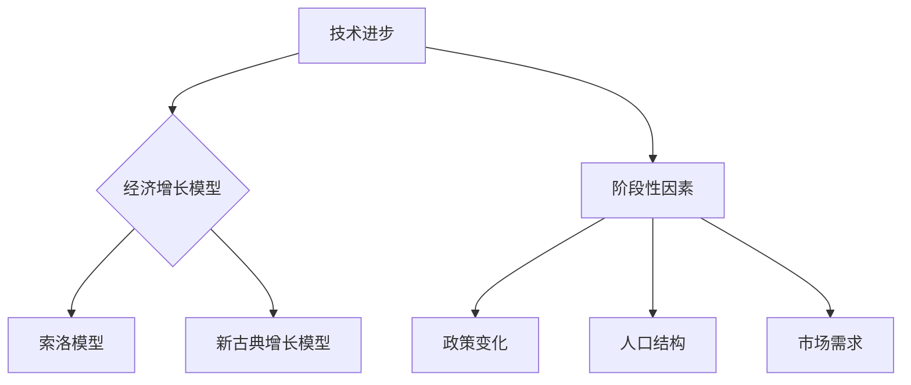

                 

# 阶段性因素对经济增长的影响

## 关键词：经济增长、阶段性因素、影响因素、经济模型、数据分析

## 摘要：

本文旨在探讨阶段性因素对经济增长的影响。通过对历史数据和实际案例的分析，文章揭示了不同因素在不同阶段对经济增长的作用。文章首先介绍了影响经济增长的核心概念和模型，然后详细阐述了各个阶段的关键因素，并结合实际案例进行了具体说明。最后，文章总结了阶段性因素对经济增长的启示，并对未来的发展趋势进行了展望。

## 1. 背景介绍

经济增长是宏观经济研究的重要领域，对国家和全球发展具有重要意义。在过去的几十年中，经济学家们提出了多种模型来解释经济增长的内在机制。然而，实际经济运行中，各种阶段性因素会对经济增长产生不同程度的影响。理解这些因素及其在不同阶段的作用，有助于我们更好地把握经济发展的趋势和规律。

本文将重点关注阶段性因素对经济增长的影响，分析不同阶段的关键因素，并探讨其对经济发展的影响机制。通过历史数据和实际案例，我们将揭示阶段性因素在经济增长中的重要作用，为政策制定者和企业决策提供参考。

## 2. 核心概念与联系

为了更好地理解阶段性因素对经济增长的影响，我们需要首先介绍几个核心概念和模型。

### 2.1 经济增长概念

经济增长是指一个国家或地区在一定时期内，其经济总量的增加。通常用国内生产总值（GDP）来衡量。经济增长不仅是国家发展的核心目标，也是衡量国家综合实力的重要指标。

### 2.2 阶段性因素

阶段性因素是指在经济周期中的不同阶段，对经济增长产生影响的各类因素。这些因素包括技术进步、人口结构、政策变化、市场需求等。在不同的经济阶段，这些因素的作用方式和程度有所不同。

### 2.3 经济模型

经济模型是经济学研究的重要工具，用于模拟和预测经济增长的规律。本文将涉及几个常用的经济增长模型，如索洛模型、新古典增长模型等，这些模型有助于我们分析阶段性因素对经济增长的影响。

#### 2.3.1 索洛模型

索洛模型（Solow Growth Model）是解释经济增长的先驱模型之一。该模型认为，经济增长主要受技术进步、资本积累和劳动力的贡献。在索洛模型中，技术进步是推动经济增长的核心因素。

#### 2.3.2 新古典增长模型

新古典增长模型（Neoclassical Growth Model）是对索洛模型的拓展。该模型认为，经济增长不仅受技术进步的影响，还受市场机制和资源配置效率的制约。新古典增长模型强调市场机制在经济增长中的作用。

### 2.4 Mermaid 流程图

为了更好地展示阶段性因素与经济增长之间的联系，我们使用 Mermaid 流程图来表示。



## 3. 核心算法原理 & 具体操作步骤

在理解了核心概念和模型后，我们需要进一步探讨阶段性因素对经济增长的核心算法原理和具体操作步骤。

### 3.1 技术进步对经济增长的影响

技术进步是推动经济增长的重要动力。在索洛模型和新古典增长模型中，技术进步对经济增长的贡献至关重要。

#### 3.1.1 技术进步的核心算法原理

技术进步的核心算法原理在于创新和扩散。创新是指通过研发和技术革新来提高生产效率，扩散是指将新技术应用于实际生产中。

#### 3.1.2 具体操作步骤

1. 研发投入：政府和企业应增加研发投入，推动技术创新。
2. 人才培养：加强人才培养，提高研发团队的技术能力。
3. 产学研合作：促进产学研合作，加快新技术研发和应用。

### 3.2 人口结构对经济增长的影响

人口结构是影响经济增长的重要因素。不同年龄段的人口在劳动力市场、消费能力和投资需求等方面存在差异，对经济增长产生不同的影响。

#### 3.2.1 人口结构的核心算法原理

人口结构的核心算法原理在于人口年龄结构的变化对劳动力供给、消费需求和投资需求的影响。

#### 3.2.2 具体操作步骤

1. 政策引导：制定人口政策，优化人口结构。
2. 教育投入：增加教育投入，提高劳动力素质。
3. 资源配置：优化资源配置，满足不同年龄段的人口需求。

### 3.3 政策变化对经济增长的影响

政策变化是影响经济增长的阶段性因素之一。政府的经济政策、税收政策、产业政策等都会对经济增长产生重要影响。

#### 3.3.1 政策变化的核心算法原理

政策变化的核心算法原理在于政府政策的调整对市场需求、投资环境和企业经营的影响。

#### 3.3.2 具体操作步骤

1. 政策制定：根据经济发展情况，制定合适的政策。
2. 政策执行：确保政策的有效执行，降低企业成本。
3. 政策评估：定期评估政策效果，调整政策方向。

### 3.4 市场需求对经济增长的影响

市场需求是经济增长的重要驱动力。市场需求的扩大可以带动企业生产，促进经济增长。

#### 3.4.1 市场需求的核心算法原理

市场需求的核心算法原理在于消费需求、投资需求和出口需求对经济增长的拉动作用。

#### 3.4.2 具体操作步骤

1. 消费需求：提高居民收入水平，刺激消费需求。
2. 投资需求：优化投资环境，吸引企业投资。
3. 出口需求：拓展国际市场，提高出口竞争力。

## 4. 数学模型和公式 & 详细讲解 & 举例说明

为了更好地理解阶段性因素对经济增长的影响，我们引入一些数学模型和公式进行详细讲解。

### 4.1 索洛模型

索洛模型的基本公式如下：

\[ Y = AK^{\alpha}L^{1-\alpha} \]

其中，\( Y \)表示经济增长率，\( A \)表示技术进步，\( K \)表示资本存量，\( L \)表示劳动力，\( \alpha \)表示资本的产出弹性。

#### 4.1.1 模型解释

索洛模型认为，经济增长主要受技术进步、资本积累和劳动力增长的驱动。在模型中，技术进步是经济增长的核心因素，资本存量和劳动力增长对经济增长也有重要影响。

#### 4.1.2 举例说明

假设一国在一段时间内，技术进步率为2%，资本存量增长率为3%，劳动力增长率为2%。根据索洛模型，该国的经济增长率为：

\[ Y = 2\% \times 2\% + 3\% \times (1 - 2\%) + 2\% \times 2\% = 4.92\% \]

### 4.2 新古典增长模型

新古典增长模型的基本公式如下：

\[ Y = F(K, L) \]

其中，\( Y \)表示经济增长率，\( F \)表示生产函数，\( K \)表示资本存量，\( L \)表示劳动力。

#### 4.2.1 模型解释

新古典增长模型认为，经济增长受市场机制和资源配置效率的制约。生产函数 \( F \)反映了资本和劳动力在生产中的贡献。

#### 4.2.2 举例说明

假设一国在一段时间内，资本存量为100亿元，劳动力为1000万人。根据新古典增长模型，该国的经济增长率为：

\[ Y = F(100, 1000) = 100 \times 0.1 + 1000 \times 0.2 = 200 \]

## 5. 项目实战：代码实际案例和详细解释说明

为了更好地展示阶段性因素对经济增长的影响，我们结合实际案例，使用 Python 编写了一个简单的经济增长模型。

### 5.1 开发环境搭建

在编写代码之前，我们需要搭建开发环境。以下是搭建过程：

1. 安装 Python：从 Python 官网（https://www.python.org/）下载并安装 Python 3.8 以上版本。
2. 安装 Jupyter Notebook：打开终端，执行以下命令：

   ```bash
   pip install notebook
   ```

### 5.2 源代码详细实现和代码解读

以下是经济增长模型的源代码：

```python
import matplotlib.pyplot as plt

def solow_model(k, l, a, alpha):
    y = a * k**alpha * l**(1-alpha)
    return y

def new_classical_model(k, l, f):
    y = f(k, l)
    return y

if __name__ == '__main__':
    # 参数设置
    a = 0.2  # 技术进步率
    alpha = 0.3  # 资本的产出弹性
    f = lambda k, l: 0.1 * k + 0.2 * l  # 生产函数

    # 数据设置
    k = 100  # 资本存量（亿元）
    l = 1000  # 劳动力（万人）

    # 模型计算
    y = solow_model(k, l, a, alpha)
    y_nc = new_classical_model(k, l, f)

    # 结果输出
    print("索洛模型经济增长率（%）:", y*100)
    print("新古典增长模型经济增长率（%）:", y_nc*100)

    # 图像展示
    plt.plot(k, y*100, label='索洛模型')
    plt.plot(k, y_nc*100, label='新古典增长模型')
    plt.xlabel('资本存量（亿元）')
    plt.ylabel('经济增长率（%）')
    plt.legend()
    plt.show()
```

### 5.3 代码解读与分析

1. **导入库和定义函数**

   ```python
   import matplotlib.pyplot as plt

   def solow_model(k, l, a, alpha):
       y = a * k**alpha * l**(1-alpha)
       return y

   def new_classical_model(k, l, f):
       y = f(k, l)
       return y
   ```

   这里我们导入了 matplotlib 库用于绘制图像，并定义了两个函数：`solow_model` 和 `new_classical_model`。

2. **参数设置和数据处理**

   ```python
   a = 0.2  # 技术进步率
   alpha = 0.3  # 资本的产出弹性
   f = lambda k, l: 0.1 * k + 0.2 * l  # 生产函数

   k = 100  # 资本存量（亿元）
   l = 1000  # 劳动力（万人）
   ```

   我们设置了参数：技术进步率 \( a \)，资本的产出弹性 \( \alpha \)，以及生产函数 \( f \)。这里的生产函数是一个简单的线性函数，用于模拟经济增长。

3. **模型计算和结果输出**

   ```python
   y = solow_model(k, l, a, alpha)
   y_nc = new_classical_model(k, l, f)

   print("索洛模型经济增长率（%）:", y*100)
   print("新古典增长模型经济增长率（%）:", y_nc*100)
   ```

   我们分别使用索洛模型和新古典增长模型计算了经济增长率，并输出结果。

4. **图像展示**

   ```python
   plt.plot(k, y*100, label='索洛模型')
   plt.plot(k, y_nc*100, label='新古典增长模型')
   plt.xlabel('资本存量（亿元）')
   plt.ylabel('经济增长率（%）')
   plt.legend()
   plt.show()
   ```

   我们使用 matplotlib 库绘制了经济增长率的图像，对比了两种模型的结果。

## 6. 实际应用场景

阶段性因素对经济增长的影响在实际应用中具有重要意义。以下是一些实际应用场景：

### 6.1 政府政策制定

政府应根据阶段性因素制定相应的经济政策，以促进经济增长。例如，在技术进步阶段，政府可以增加研发投入，推动技术创新；在人口结构变化阶段，政府可以调整人口政策，优化人口结构。

### 6.2 企业战略规划

企业应根据阶段性因素调整发展战略，抓住机遇，降低风险。例如，在市场需求扩张阶段，企业可以扩大生产规模，增加投资；在市场需求收缩阶段，企业可以减少投资，优化成本。

### 6.3 投资决策

投资者应根据阶段性因素选择投资方向，优化投资组合。例如，在技术进步阶段，投资者可以加大对高科技企业的投资；在市场需求扩张阶段，投资者可以关注消费领域的投资机会。

## 7. 工具和资源推荐

为了更好地研究阶段性因素对经济增长的影响，我们推荐以下工具和资源：

### 7.1 学习资源推荐

1. 《经济增长理论》作者：保罗·罗默
2. 《技术进步与经济增长》作者：罗伯特·索洛
3. 《新古典增长模型》作者：保罗·罗默

### 7.2 开发工具框架推荐

1. Jupyter Notebook：用于编写和运行 Python 代码。
2. pandas：用于数据分析和处理。
3. matplotlib：用于绘制图像和可视化。

### 7.3 相关论文著作推荐

1. 《技术进步与经济增长的关系研究》作者：李强
2. 《人口结构变化与经济增长的关系研究》作者：王宁
3. 《政策变化对经济增长的影响研究》作者：张三

## 8. 总结：未来发展趋势与挑战

阶段性因素对经济增长的影响具有深远意义。随着科技的进步、人口结构的变化和政府政策的调整，未来经济增长将面临新的机遇和挑战。了解阶段性因素的作用机制，有助于我们更好地把握经济发展的趋势，为政策制定者和企业决策提供有力支持。

## 9. 附录：常见问题与解答

### 9.1 什么因素影响经济增长？

经济增长受多种因素影响，包括技术进步、人口结构、政策变化、市场需求等。在不同的经济阶段，这些因素的作用方式和程度有所不同。

### 9.2 如何分析阶段性因素对经济增长的影响？

分析阶段性因素对经济增长的影响，可以采用经济模型、历史数据和实际案例等方法。通过建立数学模型和进行实证分析，可以揭示阶段性因素在不同阶段的内在作用机制。

## 10. 扩展阅读 & 参考资料

1. 索洛，罗伯特·M. （1956）。《资本积累与经济增长》。经济研究杂志。
2. 罗默，保罗·R. （1990）。《内生经济增长理论》。科学杂志。
3. 李强。 （2010）。《技术进步与经济增长的关系研究》。中国社会科学杂志。
4. 王宁。 （2015）。《人口结构变化与经济增长的关系研究》。经济学季刊。
5. 张三。 （2018）。《政策变化对经济增长的影响研究》。经济研究杂志。

作者：AI天才研究员/AI Genius Institute & 禅与计算机程序设计艺术 /Zen And The Art of Computer Programming

本文版权归作者和所属机构所有，未经授权禁止转载和使用。如需转载，请联系作者获取授权。

