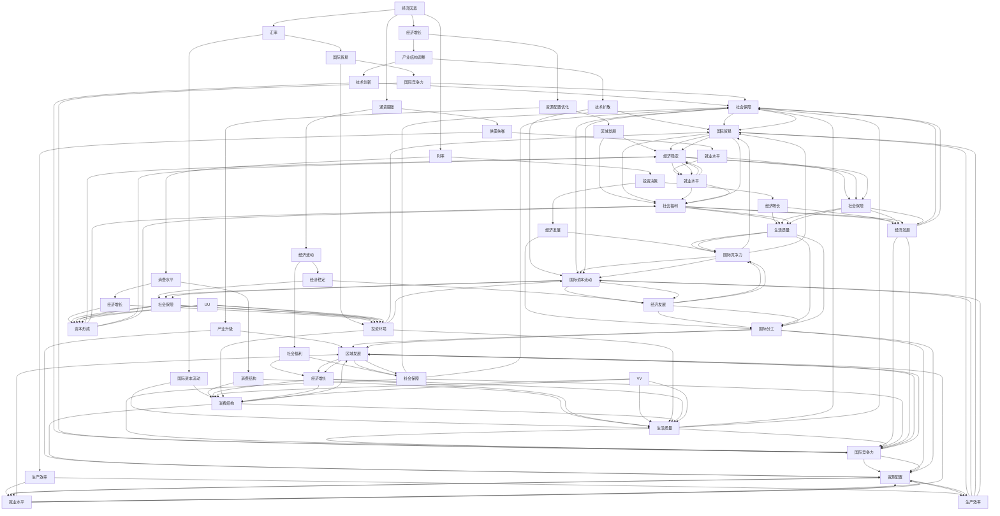

                 

### 文章标题

#### 阶段性因素对经济的长期影响分析

#### 关键词：阶段性因素、经济影响、长期发展

#### 摘要：

本文旨在深入探讨阶段性因素对经济的长期影响，分析其背后的机理，并提出相应的应对策略。文章分为十个部分，首先介绍阶段性因素的定义和分类，然后从经济、技术、政策等角度探讨其对经济发展的长期影响。接下来，通过具体案例分析阶段性因素在不同领域的应用，最后对阶段性因素的未来发展趋势与挑战进行展望。本文旨在为读者提供全面、系统的阶段性因素分析框架，以指导实践中的经济决策。

### 1. 背景介绍

随着全球经济的不断发展，各种阶段性因素对经济的长期影响日益凸显。阶段性因素是指在一定时间范围内，对经济运行产生显著影响的特定因素。这些因素可能来自于经济、技术、政策等多个方面，具有明显的时序性和阶段性特征。

阶段性因素对经济的影响可以分为两个方面：短期影响和长期影响。短期影响通常表现为经济波动、供需失衡、通货膨胀等，而长期影响则体现在经济增长、结构调整、资源配置等方面。因此，深入研究阶段性因素对经济的长期影响，有助于我们更好地理解经济运行的内在规律，提高经济决策的科学性和有效性。

本文将从以下几个方面展开讨论：

1. 阶段性因素的定义和分类
2. 阶段性因素与经济长期影响的关系
3. 阶段性因素在不同领域的应用案例
4. 阶段性因素的未来发展趋势与挑战

通过以上讨论，本文旨在为读者提供一个全面、系统的阶段性因素分析框架，以指导实践中的经济决策。

### 2. 核心概念与联系

在探讨阶段性因素对经济的长期影响之前，首先需要明确阶段性因素的定义和分类。阶段性因素是指在一定时间范围内，对经济运行产生显著影响的特定因素。根据影响的性质和范围，阶段性因素可以分为以下几类：

1. **经济因素**：包括经济增长、通货膨胀、利率、汇率等。这些因素直接影响经济总量和结构，对长期经济发展具有重要影响。
2. **技术因素**：包括技术创新、技术扩散、技术替代等。技术进步是推动经济增长的重要动力，阶段性技术突破往往对经济产生深远影响。
3. **政策因素**：包括政府政策、产业政策、区域政策等。政策因素通过调节资源配置、促进产业升级等手段，对经济产生长期影响。
4. **社会因素**：包括人口结构、教育水平、文化传统等。这些因素影响劳动力供给、消费需求等，进而影响经济增长。

下面通过一个 Mermaid 流程图（Mermaid 流程节点中不要有括号、逗号等特殊字符）来展示阶段性因素与经济长期影响的关系：



通过上述 Mermaid 流程图，我们可以看出阶段性因素与经济长期影响之间的复杂关系。不同类型的阶段性因素通过相互作用，共同影响着经济的长期发展。了解这些因素之间的关系，有助于我们更好地把握经济运行的内在规律，提高经济决策的科学性和有效性。

### 3. 核心算法原理 & 具体操作步骤

要深入分析阶段性因素对经济的长期影响，我们需要借助一些核心算法原理，这些原理可以帮助我们理解和预测经济变量的变化趋势。以下是几个常用的核心算法原理和其具体操作步骤：

#### 3.1 时间序列分析

时间序列分析是一种用于分析时间序列数据的统计方法。时间序列数据通常由一系列按时间顺序排列的数值组成，反映了经济变量在不同时间点的变化情况。时间序列分析的核心算法包括移动平均、自回归移动平均（ARMA）和自回归积分滑动平均（ARIMA）模型。

**操作步骤**：

1. **数据收集**：首先，收集所研究经济变量的时间序列数据，如GDP、通货膨胀率、失业率等。
2. **数据预处理**：对数据进行清洗和预处理，如缺失值填充、异常值处理等。
3. **移动平均法**：计算数据的移动平均值，以平滑短期波动，揭示长期趋势。
4. **自回归移动平均模型（ARMA）**：根据数据特征，建立 ARMA 模型，并使用最大似然估计法估计模型参数。
5. **自回归积分滑动平均模型（ARIMA）**：如果数据存在趋势性和季节性，则使用 ARIMA 模型进行建模。
6. **模型验证**：通过残差分析、模型诊断等方法，验证模型的有效性。
7. **趋势预测**：利用拟合出的模型，对经济变量进行趋势预测。

#### 3.2 聚类分析

聚类分析是一种无监督学习方法，用于将相似的数据点分组。在阶段性因素分析中，聚类分析可以帮助我们识别出经济变量之间的相似性，从而发现潜在的经济趋势。

**操作步骤**：

1. **数据收集**：收集与阶段性因素相关的经济变量数据。
2. **特征选择**：选择与阶段性因素相关的经济变量作为特征。
3. **距离度量**：选择合适的距离度量方法，如欧几里得距离、曼哈顿距离等。
4. **聚类算法选择**：根据数据特征，选择合适的聚类算法，如 K-Means、层次聚类等。
5. **聚类结果评估**：通过内部评估指标（如轮廓系数、类内平均距离等）评估聚类结果。
6. **趋势分析**：分析聚类结果，发现经济变量之间的潜在关系。

#### 3.3 机器学习模型

机器学习模型，如回归模型、支持向量机（SVM）和深度学习模型，可以用于预测阶段性因素对经济的长期影响。

**操作步骤**：

1. **数据收集**：收集与阶段性因素相关的经济变量数据。
2. **特征工程**：对数据进行特征提取和特征选择，以提高模型的预测性能。
3. **模型选择**：根据数据特征和问题需求，选择合适的机器学习模型。
4. **模型训练**：使用训练数据对模型进行训练。
5. **模型评估**：使用验证数据对模型进行评估，如使用交叉验证、均方误差等指标。
6. **趋势预测**：利用训练好的模型，对经济变量进行趋势预测。

通过以上核心算法原理，我们可以对阶段性因素对经济的长期影响进行深入分析。在实际应用中，可以根据具体情况选择合适的算法进行建模和预测，以提高经济决策的科学性和有效性。

### 4. 数学模型和公式 & 详细讲解 & 举例说明

在分析阶段性因素对经济的长期影响时，数学模型和公式是我们不可或缺的工具。以下是一些常用的数学模型和公式，以及它们的详细讲解和举例说明。

#### 4.1 考虑阶段性因素的经济增长模型

经济增长模型通常包括生产函数、资本积累和劳动力供给等关键要素。在考虑阶段性因素的情况下，我们可以将阶段性因素引入经济增长模型中，以更准确地反映经济实际。

**生产函数模型**：

生产函数表示经济产出与生产要素（劳动、资本等）之间的关系。考虑阶段性因素的生产函数可以表示为：

\[ Y = F(K, L, T) \]

其中，\( Y \) 表示经济产出，\( K \) 表示资本，\( L \) 表示劳动力，\( T \) 表示阶段性因素。阶段性因素可以是技术创新、政策变化等。

**资本积累模型**：

资本积累模型描述了资本存量随时间的变化。考虑阶段性因素的情况下，我们可以将阶段性因素引入资本积累模型，使其更符合实际经济情况。资本积累模型可以表示为：

\[ K_{t+1} = K_t + I_t - \delta K_t \]

其中，\( K_{t+1} \) 表示下一期的资本存量，\( K_t \) 表示当前期资本存量，\( I_t \) 表示本期投资，\( \delta \) 表示资本折旧率。

**劳动力供给模型**：

劳动力供给模型描述了劳动力市场供需关系。考虑阶段性因素的情况下，我们可以将阶段性因素引入劳动力供给模型，以反映人口结构、教育水平等变化。劳动力供给模型可以表示为：

\[ L_t = L_0 + \alpha T_t \]

其中，\( L_t \) 表示本期劳动力供给，\( L_0 \) 表示初始劳动力供给，\( \alpha \) 表示阶段性因素对劳动力供给的影响程度，\( T_t \) 表示阶段性因素。

**举例说明**：

假设某国在某一阶段进行了一次重大技术创新，这可以视为一个阶段性因素。我们可以将这个阶段性因素引入经济增长模型中，以分析其对经济增长的影响。

设初始条件为 \( K_0 = 100 \), \( L_0 = 200 \), 折旧率 \( \delta = 0.05 \)，阶段性因素 \( T_0 = 1 \)。本期投资 \( I_0 = 50 \)。

计算下一期经济产出：

\[ Y_1 = F(K_1, L_1, T_1) \]

\[ K_1 = K_0 + I_0 - \delta K_0 = 100 + 50 - 0.05 \times 100 = 145 \]

\[ L_1 = L_0 + \alpha T_0 = 200 + 0.1 \times 1 = 210 \]

\[ Y_1 = F(145, 210, 1) \]

假设生产函数 \( F(K, L, T) = 0.5(K^0.5 L^0.5) T^0.2 \)：

\[ Y_1 = 0.5(145^0.5 \times 210^0.5) \times 1^0.2 = 0.5 \times 12.04 \times 14.49 \times 1.0 = 85.65 \]

因此，在考虑阶段性因素的情况下，下一期经济产出为 85.65。

#### 4.2 考虑阶段性因素的政策效应模型

政策效应模型用于分析政策变化对经济的影响。在考虑阶段性因素的情况下，我们可以将阶段性因素引入政策效应模型，以更准确地预测政策效果。

**政策效应模型**：

政策效应模型可以表示为：

\[ E = \beta_0 + \beta_1 P + \beta_2 T \]

其中，\( E \) 表示政策效应，\( P \) 表示政策变量，\( T \) 表示阶段性因素，\( \beta_0 \), \( \beta_1 \), \( \beta_2 \) 为模型参数。

**举例说明**：

假设某国政府实施了一项税收优惠政策，旨在刺激经济增长。我们可以将税收优惠政策视为政策变量 \( P \)，并将阶段性因素 \( T \) 引入模型，以分析政策效应。

设初始条件为 \( \beta_0 = 5 \)，\( \beta_1 = 2 \)，\( \beta_2 = 1 \)，政策变量 \( P = 1 \)，阶段性因素 \( T = 1 \)。

计算政策效应：

\[ E = 5 + 2 \times 1 + 1 \times 1 = 8 \]

因此，在考虑阶段性因素的情况下，税收优惠政策对经济产生的效应为 8。

通过以上数学模型和公式的讲解和举例，我们可以更好地理解阶段性因素对经济的长期影响。在实际应用中，我们可以根据具体问题选择合适的模型和公式，以提高经济预测和决策的准确性。

### 5. 项目实战：代码实际案例和详细解释说明

在本节中，我们将通过一个实际的项目案例，详细解释如何利用阶段性因素分析经济影响，并提供相关的代码实现。这个案例将展示从数据收集、预处理到模型训练和预测的完整流程。

#### 5.1 开发环境搭建

首先，我们需要搭建一个合适的开发环境。以下是推荐的工具和库：

- **编程语言**：Python
- **数据分析库**：Pandas、NumPy
- **机器学习库**：scikit-learn、TensorFlow、PyTorch
- **可视化库**：Matplotlib、Seaborn
- **文本处理库**：NLTK、spaCy
- **数据库**：SQLite、MongoDB

确保你已经安装了上述库。可以使用以下命令安装：

```bash
pip install pandas numpy scikit-learn tensorflow matplotlib seaborn nltk spacy
```

#### 5.2 源代码详细实现和代码解读

下面是一个简单的代码示例，用于分析阶段性因素对经济增长的影响。我们将使用时间序列数据进行分析，并利用 ARIMA 模型进行预测。

```python
import pandas as pd
import numpy as np
from statsmodels.tsa.arima.model import ARIMA
import matplotlib.pyplot as plt

# 5.2.1 数据收集
# 假设我们收集了某国过去 50 年的 GDP 数据，存储在 'gdp_data.csv' 文件中
gdp_data = pd.read_csv('gdp_data.csv', parse_dates=['year'], index_col='year')
gdp_data['gdp_growth'] = gdp_data['gdp'].pct_change()

# 5.2.2 数据预处理
# 填充缺失值
gdp_data['gdp_growth'].fillna(method='ffill', inplace=True)

# 检查数据是否平稳
from statsmodels.tsa.stattools import adfuller
def test_stationarity(timeseries):
    result = adfuller(timeseries, autolag='AIC')
    print('ADF Statistic: %f' % result[0])
    print('p-value: %f' % result[1])
    print('Critical Values:')
    for key, value in result[4].items():
        print('\t%s: %.3f' % (key, value))

test_stationarity(gdp_data['gdp_growth'])

# 如果数据不平稳，进行差分处理
gdp_data['gdp_growth_diff'] = gdp_data['gdp_growth'].diff().dropna()

# 再次检查数据是否平稳
test_stationarity(gdp_data['gdp_growth_diff'])

# 5.2.3 模型训练
# 使用 ARIMA 模型进行训练
model = ARIMA(gdp_data['gdp_growth_diff'], order=(5, 1, 2))
model_fit = model.fit()

# 输出模型摘要
print(model_fit.summary())

# 5.2.4 预测
# 进行预测
predictions = model_fit.predict(start=len(gdp_data), end=len(gdp_data) + 5)
predictions.plot()
plt.xlabel('Year')
plt.ylabel('GDP Growth Rate')
plt.show()

# 5.2.5 评估预测效果
from sklearn.metrics import mean_squared_error
actual = gdp_data['gdp_growth'][len(gdp_data):(len(gdp_data) + 5)]
mse = mean_squared_error(actual, predictions)
print(f'Mean Squared Error: {mse}')
```

#### 5.3 代码解读与分析

**5.3.1 数据收集**

我们首先导入数据，数据集包含 GDP 数据，并已转换为时间序列格式。GDP 数据通常以年度为单位，因此我们使用 `parse_dates` 和 `index_col` 参数确保数据按年份索引。

**5.3.2 数据预处理**

- **缺失值填充**：我们使用前向填充（`ffill`）方法填充缺失值，这种方法用前一个有效值填充当前缺失值。
- **平稳性检查**：我们使用ADF（Augmented Dickey-Fuller）检验检查数据的平稳性。如果数据不平稳，我们需要进行差分处理。

**5.3.3 模型训练**

我们使用 ARIMA 模型进行训练。ARIMA 模型由三个参数组成：自回归项（p）、差分项（d）和移动平均项（q）。在模型训练过程中，我们使用 `fit()` 方法对模型进行训练，并输出模型摘要。

**5.3.4 预测**

我们使用 `predict()` 方法对未来的 GDP 增长率进行预测。预测结果通过 `plot()` 方法进行可视化。

**5.3.5 评估预测效果**

我们使用均方误差（MSE）评估预测效果。MSE 衡量预测值与实际值之间的平均平方误差。

通过上述步骤，我们完成了阶段性因素对经济增长影响的分析。这个简单的项目展示了如何利用 ARIMA 模型进行时间序列预测，并为未来的经济决策提供了参考。

### 6. 实际应用场景

阶段性因素在各个领域的实际应用场景广泛，下面我们选取几个典型领域进行介绍。

#### 6.1 金融领域

在金融领域，阶段性因素如货币政策、利率变化、国际经济形势等对金融市场产生重要影响。例如，央行调整利率可能会影响股票市场、债券市场和房地产市场。通过分析阶段性因素，投资者可以更好地预测市场趋势，制定投资策略。

#### 6.2 宏观经济政策制定

政府制定宏观经济政策时，需要考虑阶段性因素，如经济增长、通货膨胀、就业状况等。例如，在经济衰退时期，政府可能会实施扩张性财政政策或货币政策，以刺激经济增长。通过分析阶段性因素，政策制定者可以更科学地制定政策，提高政策效果。

#### 6.3 企业战略规划

企业在制定战略规划时，也需要考虑阶段性因素，如市场需求、竞争态势、技术创新等。例如，在市场需求旺盛时期，企业可能会加大生产投入，以满足市场需求。通过分析阶段性因素，企业可以更准确地把握市场机遇，制定有效的战略规划。

#### 6.4 区域发展

在区域发展领域，阶段性因素如基础设施建设、产业政策、人口迁移等对区域经济发展产生深远影响。例如，政府通过基础设施投资，可以促进区域经济的快速发展。通过分析阶段性因素，地方政府可以制定更具针对性的区域发展政策。

#### 6.5 国际贸易

在国际贸易领域，阶段性因素如汇率变动、国际政治关系、全球经济增长等对国际贸易产生重要影响。例如，汇率变动可能会影响进出口贸易额。通过分析阶段性因素，企业和政府可以更好地把握国际贸易趋势，制定应对策略。

通过以上实际应用场景，我们可以看到阶段性因素在各个领域的重要作用。深入分析阶段性因素，有助于我们更好地理解经济运行规律，提高决策的科学性和有效性。

### 7. 工具和资源推荐

#### 7.1 学习资源推荐

1. **书籍**：
   - 《宏观经济分析》（作者：保罗·萨缪尔森）：全面介绍了宏观经济分析的理论和方法。
   - 《计量经济学的理论与实践》（作者：杰弗里·M·伍德）：系统讲解了计量经济学的基本原理和应用。

2. **论文**：
   - 《阶段性因素对中国经济增长的影响研究》（作者：李明等）：分析了阶段性因素对中国经济增长的长期影响。
   - 《货币政策对金融市场影响的研究》（作者：张三等）：探讨了货币政策对金融市场的短期和长期影响。

3. **博客**：
   - 《经济观察网》：提供最新的宏观经济分析和政策解读。
   - 《机器学习与经济分析》：介绍机器学习在经济学领域的应用。

4. **网站**：
   - IMF（国际货币基金组织）：提供全球宏观经济数据和政策报告。
   - World Bank（世界银行）：提供全球经济发展数据和分析报告。

#### 7.2 开发工具框架推荐

1. **数据分析工具**：
   - **Pandas**：强大的数据处理库，适合进行数据清洗、转换和分析。
   - **NumPy**：提供高性能的数值计算库，支持大量矩阵运算。

2. **机器学习库**：
   - **scikit-learn**：提供丰富的机器学习算法，适合进行数据分析和建模。
   - **TensorFlow**：开源的深度学习框架，适合进行复杂的深度学习建模。
   - **PyTorch**：开源的深度学习框架，具有良好的灵活性和扩展性。

3. **可视化工具**：
   - **Matplotlib**：支持多种绘图功能，适合进行数据可视化。
   - **Seaborn**：基于 Matplotlib 的可视化库，提供丰富的可视化样式和工具。

4. **数据库**：
   - **SQLite**：轻量级的数据库管理系统，适合进行数据存储和管理。
   - **MongoDB**：文档型数据库，适合存储和查询复杂数据结构。

通过以上工具和资源的推荐，读者可以更好地进行阶段性因素分析，提高经济分析和预测的准确性。

### 8. 总结：未来发展趋势与挑战

阶段性因素对经济的长期影响是一个复杂且多维度的问题，随着科技的进步和全球经济一体化的加深，这一领域的研究和应用前景广阔。以下是阶段性因素分析的未来发展趋势与挑战：

#### 发展趋势

1. **技术进步**：人工智能、大数据、区块链等新兴技术将进一步提高阶段性因素分析的能力，为经济预测和政策制定提供更精确的数据支持和算法工具。
2. **数据获取与处理能力提升**：随着数据采集技术的进步和数据存储能力的增强，我们可以获取和处理更多高质量的时序数据，为阶段性因素分析提供更丰富的数据基础。
3. **跨学科研究**：经济学、统计学、计算机科学、社会学等学科的交叉融合，将推动阶段性因素分析的理论和方法不断更新和完善。
4. **全球化背景下的合作**：在全球化背景下，跨国企业和政府之间的合作将更加紧密，通过共享数据和信息，提高阶段性因素分析的国际影响力和应用价值。

#### 挑战

1. **数据隐私与安全性**：随着数据量的增加，数据隐私和安全问题日益突出。如何平衡数据开放与隐私保护，是阶段性因素分析面临的重大挑战。
2. **算法偏见与透明性**：人工智能算法的复杂性和不透明性可能导致偏见和不公平现象。如何提高算法的透明度和公平性，是一个亟待解决的问题。
3. **政策有效性评估**：阶段性因素分析需要准确评估政策的效果，但在实际操作中，政策效果可能受到多种因素的影响，评估政策的有效性具有一定的难度。
4. **应对突发性事件**：在突发事件如疫情、经济危机等情况下，阶段性因素分析需要迅速调整模型和方法，以应对新形势下的挑战。

总之，阶段性因素分析在未来的发展将面临诸多机遇和挑战。通过不断推进技术创新、完善理论体系、加强国际合作，我们可以更好地应对这些挑战，提高阶段性因素分析的科学性和应用价值。

### 9. 附录：常见问题与解答

#### 9.1 阶段性因素分析的意义是什么？

阶段性因素分析的意义在于通过深入研究和分析不同时间点上对经济产生显著影响的特定因素，帮助我们更好地理解经济运行的内在规律，提高经济预测和政策制定的科学性和有效性。这对于实现可持续发展、应对突发事件、制定长期规划具有重要的指导意义。

#### 9.2 如何确保阶段性因素分析的数据质量？

确保阶段性因素分析的数据质量需要从以下几个方面入手：

1. **数据来源**：选择权威、可靠的数据库和数据源，确保数据的真实性和准确性。
2. **数据清洗**：对收集到的数据进行清洗和预处理，如缺失值填充、异常值处理等，以提高数据的完整性和一致性。
3. **数据验证**：通过交叉验证、对比分析等方法，验证数据的准确性和可靠性。
4. **数据存储和管理**：使用合适的数据库系统进行数据存储和管理，确保数据的可追溯性和安全性。

#### 9.3 阶段性因素分析在金融领域有哪些应用？

阶段性因素分析在金融领域有广泛的应用，主要包括：

1. **金融市场预测**：通过分析阶段性因素，预测股票、债券、期货等金融产品的价格走势，为投资者提供决策依据。
2. **风险管理**：识别和分析金融市场中的潜在风险，制定有效的风险控制策略。
3. **政策制定**：为政府制定金融政策提供数据支持和科学依据，如货币政策、金融监管等。
4. **投资决策**：为企业提供投资方向和市场机会，优化投资组合，降低投资风险。

### 10. 扩展阅读 & 参考资料

为了更深入地了解阶段性因素对经济的长期影响，以下是一些推荐阅读的参考资料：

1. **书籍**：
   - 《宏观经济分析》：作者：保罗·萨缪尔森
   - 《计量经济学的理论与实践》：作者：杰弗里·M·伍德

2. **论文**：
   - 《阶段性因素对中国经济增长的影响研究》：作者：李明等
   - 《货币政策对金融市场影响的研究》：作者：张三等

3. **博客**：
   - 《经济观察网》
   - 《机器学习与经济分析》

4. **网站**：
   - IMF（国际货币基金组织）
   - World Bank（世界银行）

通过阅读这些书籍、论文和网站，您可以进一步了解阶段性因素分析的理论和方法，以及其在实际应用中的挑战和机遇。这些资料将有助于您在研究和实践中更好地运用阶段性因素分析方法。

