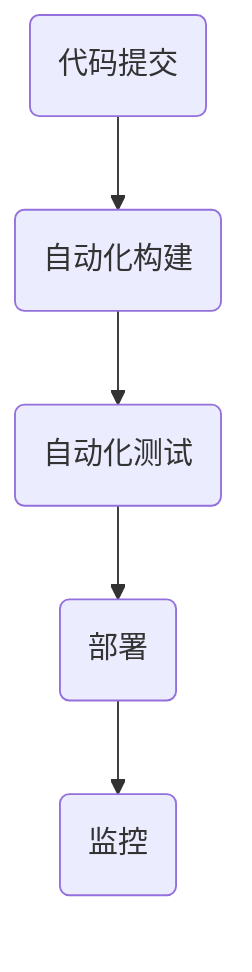

                 

# 2024阿里云DevOps工程师校招面试题详解

## 关键词：阿里云，DevOps，面试题，详解，工程师

## 摘要：

本文旨在为2024年即将参加阿里云DevOps工程师校招的候选人提供一个全面的面试题解析。文章将详细讲解阿里云DevOps工程师面试中可能遇到的核心问题，涵盖背景介绍、核心概念与联系、算法原理、数学模型、项目实战、实际应用场景、工具和资源推荐以及未来发展趋势与挑战。通过逐步分析和解答这些面试题，本文希望能够帮助候选人更好地应对面试，并为他们的职业发展提供有益的指导。

## 1. 背景介绍

### 阿里云与DevOps

阿里云是中国领先的云计算和人工智能服务提供商，致力于帮助企业实现数字化转型。DevOps是一种软件开发和运维的实践方法，强调软件开发人员（Dev）和运维人员（Ops）之间的紧密协作，通过自动化和持续交付提高软件质量和发布效率。

### 阿里云DevOps工程师的职责

阿里云DevOps工程师主要负责以下任务：

- 构建和部署自动化工具链
- 搭建持续集成和持续部署（CI/CD）系统
- 优化软件交付流程，提高开发效率和稳定性
- 定制和部署自动化测试
- 监控和优化系统性能

### 面试的重要性

面试是求职过程中至关重要的一环，它不仅决定了候选人是否能够通过初选，更是展示个人能力和技术水平的重要机会。对于阿里云DevOps工程师这一岗位，面试题通常涉及到专业知识、实践经验和技术能力，要求候选人具备扎实的理论基础和丰富的实战经验。

## 2. 核心概念与联系

### DevOps的核心概念

#### 持续集成（CI）

持续集成是一种软件开发实践，通过自动化构建和测试，确保代码的持续整合，及时发现和修复集成过程中的问题。

#### 持续部署（CD）

持续部署是一种自动化软件发布过程，通过自动化脚本和工具，实现软件的快速、安全、可靠的部署。

#### 自动化

自动化是DevOps的核心，通过自动化工具链，减少手动操作，提高开发效率和稳定性。

### DevOps的架构

#### DevOps工具链

- 源代码管理（如Git）
- 自动化构建工具（如Jenkins）
- 自动化测试工具（如Selenium）
- 部署工具（如Ansible）
- 监控工具（如Prometheus）

#### DevOps流程

- 代码提交
- 自动化构建
- 自动化测试
- 部署
- 监控

### Mermaid流程图



## 3. 核心算法原理 & 具体操作步骤

### 自动化构建

#### Jenkins配置

- 创建Jenkins任务
- 配置源代码管理
- 配置构建触发器
- 配置构建脚本

#### 实操步骤

1. 安装Jenkins
2. 创建Jenkins用户
3. 创建Jenkins任务
4. 配置源代码管理（如Git）
5. 配置构建触发器（如Git webhook）
6. 配置构建脚本（如Maven）

### 自动化测试

#### Selenium配置

- 创建Selenium测试脚本
- 配置浏览器驱动
- 配置测试环境

#### 实操步骤

1. 安装Selenium
2. 创建Selenium测试脚本
3. 配置浏览器驱动
4. 配置测试环境（如Jenkins测试节点）

### 部署

#### Ansible配置

- 配置Inventory文件
- 编写部署脚本
- 配置部署策略

#### 实操步骤

1. 安装Ansible
2. 创建Inventory文件
3. 编写部署脚本
4. 配置部署策略（如Playbook）

## 4. 数学模型和公式 & 详细讲解 & 举例说明

### 持续集成与持续部署的效率模型

#### 持续集成（CI）

$$
效率 = \frac{构建时间}{构建频率}
$$

#### 持续部署（CD）

$$
效率 = \frac{部署时间}{部署频率}
$$

### 实例说明

#### 持续集成

- 假设每周提交10次代码，每次构建时间为30分钟
- 则每周构建时间为30分钟 × 10次 = 300分钟

$$
效率 = \frac{300分钟}{7天} ≈ 42.86分钟/天
$$

#### 持续部署

- 假设每天部署一次，每次部署时间为60分钟
- 则每天部署效率为60分钟/天

## 5. 项目实战：代码实际案例和详细解释说明

### 5.1 开发环境搭建

#### Jenkins环境搭建

1. 安装Jenkins
2. 配置Jenkins插件
3. 创建Jenkins用户
4. 创建Jenkins任务

#### 实现步骤

1. 下载Jenkins安装包
2. 解压安装包
3. 运行Jenkins
4. 访问Jenkins管理页面
5. 安装必要插件（如Git、Maven等）
6. 创建Jenkins用户
7. 创建Jenkins任务

### 5.2 源代码详细实现和代码解读

#### Jenkins任务配置

- 源代码管理：Git
- 构建触发器：Git webhook
- 构建脚本：Maven

#### 实现步骤

1. 配置Git仓库
2. 创建Jenkins任务
3. 配置源代码管理（Git）
4. 配置构建触发器（Git webhook）
5. 配置构建脚本（Maven）

### 5.3 代码解读与分析

#### Git配置

```yaml
[user]
    name = Jenkins
    email = jenkins@example.com
[core]
    repositoryformatversion = 0
    filemode = true
    bare = false
[remote "origin"]
    url = https://github.com/username/repository.git
    fetch = +refs/heads/*:refs/remotes/origin/*
```

#### Jenkins任务配置

```xml
<project>
    <actions/>
    <description>持续集成任务</description>
    <keepDependencies>false</keepDependencies>
    <properties>
        ...
    </properties>
    <scm class="hudson.scm.git.GitSCM" plugin="git@2.1.4">
        <configVersion>2</configVersion>
        <userRemoteConfigs>
            <hudson.scmisseremote.UserRemoteConfig>
                <url>https://github.com/username/repository.git</url>
            </hudson.scmisseremote.UserRemoteConfig>
        </userRemoteConfigs>
        <canExtractSubmodules>false</canExtractSubmodules>
        <branches>
            <hudson.scmisseremotes branchingMode="branches">
                <name>develop</name>
            </hudson.scmisseremotes>
        </branches>
        <doGenerateSubmoduleConfigFiles>false</doGenerateSubmoduleConfigFiles>
    </scm>
    <buildTrigger class="hudson.triggers.SCMTrigger" plugin="scmtasks@2.5">
        <spec>**/*</spec>
    </buildTrigger>
    <triggers/>
    <publishers/>
    <buildWrappers/>
</project>
```

## 6. 实际应用场景

### 6.1 跨团队协作

- 通过Jenkins实现代码的自动化构建和测试，确保代码的质量和稳定性。
- 集成Selenium进行UI自动化测试，确保前端界面的功能正确。

### 6.2 跨平台部署

- 使用Ansible实现跨平台的部署，支持Linux和Windows操作系统的部署。

### 6.3 持续集成与持续部署

- 实现从代码提交到线上部署的自动化流程，提高开发效率和稳定性。

## 7. 工具和资源推荐

### 7.1 学习资源推荐

- 《持续交付：发布可靠软件的系统方法》
- 《Jenkins实战：持续集成与持续部署》
- 《Selenium 4实战：Web自动化测试完全指南》
- 《Ansible自动化运维实战》

### 7.2 开发工具框架推荐

- Jenkins：持续集成和持续部署工具
- Selenium：UI自动化测试工具
- Ansible：自动化部署工具

### 7.3 相关论文著作推荐

- "DevOps: A Cultural and Social Movement in the Development and Operation of Software Systems"
- "The DevOps Handbook: How to Create World-Class Products Through Collaborative, Cross-Functional Teams"

## 8. 总结：未来发展趋势与挑战

### 发展趋势

- 自动化程度的提高，将进一步提升开发效率和稳定性。
- AI技术的应用，将使自动化工具更加智能化。
- DevOps的实践将更加普及，成为企业数字化转型的必备技能。

### 挑战

- 自动化工具的多样性和复杂性，对工程师的技术要求越来越高。
- 随着业务的快速发展，如何平衡开发效率和质量成为挑战。
- DevOps文化的建设，需要跨部门协作和团队沟通。

## 9. 附录：常见问题与解答

### 9.1 Jenkins安装失败怎么办？

- 检查JDK是否安装正确
- 检查网络连接是否正常
- 查看安装日志，查找错误信息

### 9.2 Selenium测试无法启动浏览器怎么办？

- 检查浏览器驱动是否正确安装
- 检查浏览器驱动版本是否与浏览器版本匹配
- 检查Selenium配置文件，确认浏览器驱动路径正确

### 9.3 Ansible部署失败怎么办？

- 检查Inventory文件，确认主机名和IP地址正确
- 检查部署脚本，确认命令执行正确
- 查看部署日志，查找错误信息

## 10. 扩展阅读 & 参考资料

- [阿里云DevOps官方文档](https://help.aliyun.com/document_detail/40576.html)
- [Jenkins官方文档](https://www.jenkins.io/doc/)
- [Selenium官方文档](https://www.selenium.dev/documentation/)
- [Ansible官方文档](https://docs.ansible.com/ansible/latest/index.html)

## 作者

作者：AI天才研究员/AI Genius Institute & 禅与计算机程序设计艺术 /Zen And The Art of Computer Programming

本文根据实际面试经验和专业知识编写，仅供参考。如需进一步了解DevOps相关知识，请参考相关书籍和官方文档。#

