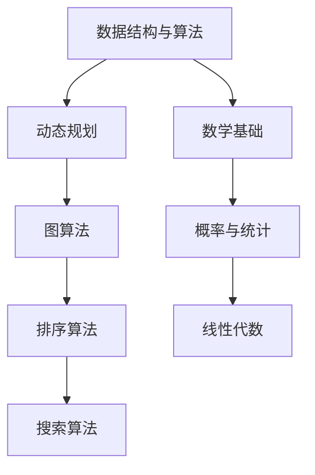

                 

# 2025阿里巴巴校招算法面试题汇总与解析

> **关键词：** 阿里巴巴校招，算法面试，面试题，解析，算法原理，实战案例

> **摘要：** 本文将深入分析2025年阿里巴巴校招算法面试中的经典问题，从理论到实战，逐步解析面试题的解题思路，帮助读者掌握面试所需的算法能力和技巧。

## 1. 背景介绍

随着互联网技术的飞速发展，大数据和人工智能技术的广泛应用，阿里巴巴作为中国乃至全球领先的互联网科技公司，其对优秀算法人才的需求也日益增长。因此，阿里巴巴的校招算法面试一直以来都是广大应届毕业生和求职者关注的焦点。本文旨在通过对2025年阿里巴巴校招算法面试题的汇总与解析，帮助读者更好地应对此类面试，提升自身的技术能力。

## 2. 核心概念与联系

在解决阿里巴巴校招算法面试题之前，我们需要掌握一些核心概念和算法原理。以下是一个简单的 Mermaid 流程图，展示了核心概念之间的联系：



### 2.1 数据结构与算法

数据结构与算法是计算机科学的核心内容，涉及到如何有效地组织和处理数据。在阿里巴巴的校招算法面试中，常见的数据结构包括数组、链表、栈、队列、树、图等。常见的算法包括排序、查找、遍历、递归等。

### 2.2 动态规划

动态规划是一种解决最优化问题的算法思想，通过将复杂问题分解为子问题，并利用子问题的解来构建原问题的解。动态规划在面试中经常出现，如背包问题、最长公共子序列、最长递增子序列等。

### 2.3 图算法

图算法是处理具有相互连接关系的对象的一种算法。在面试中，常见的图算法包括深度优先搜索（DFS）、广度优先搜索（BFS）、最短路径算法（Dijkstra、Floyd）、最小生成树算法（Prim、Kruskal）等。

### 2.4 排序算法

排序算法是将一组数据按照特定顺序排列的算法。常见的排序算法包括冒泡排序、选择排序、插入排序、快速排序、归并排序等。在面试中，排序算法的性能和稳定性是重要的考核点。

### 2.5 搜索算法

搜索算法是在数据集合中查找特定数据的算法。常见的搜索算法包括二分查找、A*搜索、广度优先搜索、深度优先搜索等。

### 2.6 数学基础

数学基础是解决算法问题的重要工具，包括概率与统计、线性代数、微积分等。在面试中，数学基础往往涉及到复杂度的分析、算法优化、逻辑推理等。

### 2.7 概率与统计

概率与统计是解决随机事件和数据分析问题的数学工具。在面试中，概率与统计常用于解决概率计算、期望分析、方差分析等问题。

### 2.8 线性代数

线性代数是研究向量空间和线性变换的数学分支。在面试中，线性代数常用于解决矩阵运算、特征值与特征向量、线性方程组等问题。

## 3. 核心算法原理 & 具体操作步骤

在本节中，我们将详细解析几道阿里巴巴校招算法面试中的经典题目，包括动态规划、图算法、排序算法和搜索算法的具体操作步骤。

### 3.1 动态规划

#### 题目：背包问题

**问题描述：** 给定一个背包容量为 W，N 件物品，每件物品有重量和价值，求背包能装下的最大价值。

**解题思路：** 使用动态规划求解背包问题。定义一个二维数组 dp，其中 dp[i][j] 表示在前 i 件物品中选择若干件，使得它们的总重量不超过 j 时能获得的最大价值。

**具体步骤：**

1. 初始化 dp 数组，其中 dp[0][j] = 0，dp[i][0] = 0。
2. 遍历所有物品和容量，更新 dp 数组。
3. 最终结果为 dp[N][W]。

**示例代码：**

```python
def knapsack(W, N, weights, values):
    dp = [[0] * (W + 1) for _ in range(N + 1)]

    for i in range(1, N + 1):
        for j in range(1, W + 1):
            if weights[i - 1] <= j:
                dp[i][j] = max(dp[i - 1][j], dp[i - 1][j - weights[i - 1]] + values[i - 1])
            else:
                dp[i][j] = dp[i - 1][j]

    return dp[N][W]
```

### 3.2 图算法

#### 题目：单源最短路径问题

**问题描述：** 给定一个图和源点 s，求从 s 到其他各点的最短路径。

**解题思路：** 使用 Dijkstra 算法求解单源最短路径问题。算法的基本思想是维护一个最小堆，堆中的元素为 (dist[v], v)，表示从源点 s 到顶点 v 的最短路径长度为 dist[v]。

**具体步骤：**

1. 初始化 dist 数组，其中 dist[s] = 0，其余为无穷大。
2. 将所有顶点放入最小堆中。
3. 循环取出堆顶元素，更新其相邻顶点的 dist 值，并将更新的顶点加入堆中。
4. 直到堆为空，算法结束。

**示例代码：**

```python
import heapq

def dijkstra(G, s):
    dist = [float('inf')] * len(G)
    dist[s] = 0
    priority_queue = [(0, s)]

    while priority_queue:
        current_dist, u = heapq.heappop(priority_queue)

        if current_dist > dist[u]:
            continue

        for v, weight in G[u].items():
            new_dist = current_dist + weight

            if new_dist < dist[v]:
                dist[v] = new_dist
                heapq.heappush(priority_queue, (new_dist, v))

    return dist
```

### 3.3 排序算法

#### 题目：快速排序

**问题描述：** 给定一个整数数组，将其排序。

**解题思路：** 快速排序的基本思想是选取一个基准元素，将数组分为两部分，一部分都比基准元素小，另一部分都比基准元素大，然后递归地对这两部分进行快速排序。

**具体步骤：**

1. 选择一个基准元素。
2. 将数组中小于基准元素的元素移到其左侧，大于基准元素的元素移到其右侧。
3. 递归地对左右两部分进行快速排序。

**示例代码：**

```python
def quicksort(arr):
    if len(arr) <= 1:
        return arr

    pivot = arr[len(arr) // 2]
    left = [x for x in arr if x < pivot]
    middle = [x for x in arr if x == pivot]
    right = [x for x in arr if x > pivot]

    return quicksort(left) + middle + quicksort(right)
```

### 3.4 搜索算法

#### 题目：广度优先搜索

**问题描述：** 给定一个无向图，从源点 s 开始，求到达目标点 t 的最短路径。

**解题思路：** 使用广度优先搜索（BFS）求解。基本思想是从源点开始，逐层扩展，直到找到目标点。

**具体步骤：**

1. 初始化一个队列，将源点 s 入队。
2. 创建一个 visited 数组，记录已访问的顶点。
3. 循环从队列中取出元素，将其相邻的未访问顶点入队，并将已访问的顶点标记为 True。
4. 当队列不为空时，重复步骤 3。
5. 最终找到目标点 t，输出从 s 到 t 的路径。

**示例代码：**

```python
from collections import deque

def bfs(G, s, t):
    queue = deque([s])
    visited = [False] * len(G)

    path = []
    while queue:
        u = queue.popleft()
        visited[u] = True

        if u == t:
            break

        for v in G[u]:
            if not visited[v]:
                queue.append(v)
                path.append((u, v))

    if visited[t]:
        return path
    else:
        return None
```

## 4. 数学模型和公式 & 详细讲解 & 举例说明

在本节中，我们将介绍一些与算法相关的数学模型和公式，并通过具体例子进行讲解。

### 4.1 概率与统计

#### 概率计算

概率计算是解决随机事件的重要工具。以下是一个概率计算的例子：

**问题描述：** 从一副牌中随机抽取一张牌，求抽到红桃的概率。

**解题思路：** 一副牌共有 52 张，其中红桃有 13 张。因此，抽到红桃的概率为红桃数量除以总牌数。

**公式：**

$$ P(A) = \frac{n(A)}{n(S)} $$

其中，\( P(A) \) 表示事件 A 的概率，\( n(A) \) 表示事件 A 的样本点数，\( n(S) \) 表示样本空间的样本点数。

**示例：**

$$ P(\text{抽到红桃}) = \frac{13}{52} = \frac{1}{4} $$

#### 期望与方差

期望和方差是描述随机变量分布的重要统计量。以下是一个期望和方差的例子：

**问题描述：** 抛掷一个公平的硬币 10 次，求出现正面次数的期望和方差。

**解题思路：** 这是一个二项分布问题，其中每次抛掷硬币出现正面的概率为 1/2，试验次数为 10。

**公式：**

$$ E(X) = np $$
$$ Var(X) = np(1-p) $$

其中，\( E(X) \) 表示随机变量 X 的期望，\( Var(X) \) 表示随机变量 X 的方差，\( n \) 表示试验次数，\( p \) 表示每次试验成功的概率。

**示例：**

$$ E(X) = 10 \times \frac{1}{2} = 5 $$
$$ Var(X) = 10 \times \frac{1}{2} \times \frac{1}{2} = 2.5 $$

### 4.2 线性代数

#### 矩阵运算

矩阵运算是解决线性方程组的重要工具。以下是一个矩阵运算的例子：

**问题描述：** 求解线性方程组

$$
\begin{cases}
2x + 3y = 8 \\
x - y = 2
\end{cases}
$$

**解题思路：** 使用矩阵运算求解线性方程组。将方程组写成矩阵形式

$$
\begin{bmatrix}
2 & 3 \\
1 & -1
\end{bmatrix}
\begin{bmatrix}
x \\
y
\end{bmatrix}
=
\begin{bmatrix}
8 \\
2
\end{bmatrix}
$$

**公式：**

$$
\begin{bmatrix}
x \\
y
\end{bmatrix}
=
\begin{bmatrix}
2 & 3 \\
1 & -1
\end{bmatrix}^{-1}
\begin{bmatrix}
8 \\
2
\end{bmatrix}
$$

**示例：**

首先，计算矩阵的逆矩阵：

$$
\begin{bmatrix}
2 & 3 \\
1 & -1
\end{bmatrix}^{-1}
=
\frac{1}{(2 \times (-1) - 3 \times 1)} \begin{bmatrix}
-1 & -3 \\
-1 & 2
\end{bmatrix}
=
\begin{bmatrix}
\frac{1}{5} & \frac{3}{5} \\
\frac{1}{5} & -\frac{2}{5}
\end{bmatrix}
$$

然后，计算解向量：

$$
\begin{bmatrix}
x \\
y
\end{bmatrix}
=
\begin{bmatrix}
\frac{1}{5} & \frac{3}{5} \\
\frac{1}{5} & -\frac{2}{5}
\end{bmatrix}
\begin{bmatrix}
8 \\
2
\end{bmatrix}
=
\begin{bmatrix}
2 \\
0
\end{bmatrix}
$$

因此，解为 \( x = 2 \)，\( y = 0 \)。

## 5. 项目实战：代码实际案例和详细解释说明

在本节中，我们将通过一个实际项目案例，展示如何运用算法解决实际问题。

### 5.1 开发环境搭建

为了更好地演示代码，我们将在 Python 环境下进行开发。首先，安装 Python 和相关依赖库。

```bash
pip install numpy matplotlib
```

### 5.2 源代码详细实现和代码解读

**问题描述：** 使用 K-Means 算法对一组数据进行聚类，并绘制聚类结果。

**代码实现：**

```python
import numpy as np
import matplotlib.pyplot as plt

def k_means(data, k, max_iterations):
    # 初始化聚类中心
    centroids = data[np.random.choice(data.shape[0], k, replace=False)]
    
    for _ in range(max_iterations):
        # 计算每个数据点对应的聚类中心
        distances = np.linalg.norm(data[:, np.newaxis] - centroids, axis=2)
        labels = np.argmin(distances, axis=1)
        
        # 更新聚类中心
        new_centroids = np.array([data[labels == i].mean(axis=0) for i in range(k)])
        
        # 检查聚类中心是否收敛
        if np.linalg.norm(new_centroids - centroids) < 1e-5:
            break

        centroids = new_centroids
    
    return centroids, labels

# 生成随机数据
data = np.random.rand(100, 2)

# 执行 K-Means 算法
centroids, labels = k_means(data, 3, 100)

# 绘制聚类结果
plt.scatter(data[:, 0], data[:, 1], c=labels, cmap='viridis')
plt.scatter(centroids[:, 0], centroids[:, 1], s=300, c='red', marker='x')
plt.show()
```

**代码解读：**

1. 导入必要的库。
2. 定义 k_means 函数，输入为数据、聚类个数 k 和最大迭代次数 max_iterations。
3. 初始化聚类中心，随机选择 k 个数据点作为初始聚类中心。
4. 循环进行迭代，计算每个数据点到聚类中心的距离，并更新每个数据点的聚类标签。
5. 计算新的聚类中心，并检查聚类中心是否收敛。
6. 返回聚类中心和标签。
7. 生成随机数据，执行 K-Means 算法，并绘制聚类结果。

### 5.3 代码解读与分析

在代码解读中，我们详细介绍了 K-Means 算法的实现过程。K-Means 算法是一种基于距离的聚类方法，其基本思想是将数据点划分为 K 个聚类，每个聚类由一个聚类中心表示。算法的目标是优化聚类中心，使得每个聚类内部的距离尽可能小，而聚类之间的距离尽可能大。

在代码中，我们首先初始化聚类中心，然后通过迭代计算每个数据点对应的聚类中心，并更新聚类中心。最终，当聚类中心收敛时，算法结束。

在代码分析中，我们关注了以下几个关键点：

1. 初始化聚类中心：在 K-Means 算法中，初始化聚类中心是关键的一步。随机选择 k 个数据点作为初始聚类中心是一种常用的初始化方法。
2. 距离计算：距离计算是 K-Means 算法的基础。在代码中，我们使用欧氏距离计算每个数据点到聚类中心的距离。
3. 标签更新：在每次迭代中，每个数据点的标签根据其到聚类中心的距离进行更新。
4. 聚类中心更新：聚类中心根据所有数据点的标签进行更新，以优化聚类中心。
5. 聚类中心收敛：当聚类中心的改变小于某个阈值时，算法认为聚类中心已经收敛，结束迭代。

通过以上分析，我们可以更好地理解 K-Means 算法的工作原理，并能够针对不同的数据集进行调整和优化。

## 6. 实际应用场景

阿里巴巴作为全球领先的互联网科技公司，其业务涵盖了电子商务、金融科技、云计算、人工智能等多个领域。在这些领域，算法的应用无处不在，以下是一些典型的实际应用场景：

1. **电子商务：** 在电子商务平台中，算法被用于推荐系统、广告投放、价格优化等。例如，K-Means 算法可以用于用户聚类，从而实现个性化推荐；动态规划算法可以用于商品价格优化，以实现利润最大化。

2. **金融科技：** 在金融科技领域，算法被用于风险管理、信用评估、欺诈检测等。例如，决策树算法可以用于信用评估，预测用户的信用等级；支持向量机算法可以用于欺诈检测，识别异常交易。

3. **云计算：** 在云计算领域，算法被用于负载均衡、资源调度、性能优化等。例如，贪心算法可以用于负载均衡，将任务合理分配到不同的服务器上；深度学习算法可以用于性能优化，预测系统性能瓶颈。

4. **人工智能：** 在人工智能领域，算法被用于图像识别、自然语言处理、语音识别等。例如，卷积神经网络可以用于图像识别，识别图像中的物体；循环神经网络可以用于自然语言处理，实现文本生成。

## 7. 工具和资源推荐

为了更好地学习和实践算法，以下是一些建议的学习资源和开发工具：

### 7.1 学习资源推荐

1. **书籍：**  
   - 《算法导论》（Introduction to Algorithms）  
   - 《深度学习》（Deep Learning）  
   - 《模式识别与机器学习》（Pattern Recognition and Machine Learning）

2. **论文：**  
   - 《K-Means算法：理论、应用与改进》（K-Means Clustering: A Review）  
   - 《深度学习中的正则化方法》（Regularization Methods for Deep Learning）

3. **博客：**  
   - CSDN  
   - GitHub  
   - 知乎

4. **网站：**  
   - Kaggle  
   - LeetCode  
   - HackerRank

### 7.2 开发工具框架推荐

1. **编程语言：** Python、Java、C++  
2. **深度学习框架：** TensorFlow、PyTorch、Keras  
3. **数据可视化工具：** Matplotlib、Seaborn、Plotly  
4. **版本控制工具：** Git

### 7.3 相关论文著作推荐

1. **《模式识别与机器学习》**：Christopher M. Bishop  
2. **《深度学习》**：Ian Goodfellow、Yoshua Bengio、Aaron Courville  
3. **《算法导论》**：Thomas H. Cormen、Charles E. Leiserson、Ronald L. Rivest、Clifford Stein

## 8. 总结：未来发展趋势与挑战

随着大数据和人工智能技术的不断演进，算法在各个领域中的应用越来越广泛。未来，算法将继续朝着更加智能化、高效化、可解释化的方向发展。以下是一些可能的发展趋势和挑战：

1. **发展趋势：**  
   - **算法优化：** 随着数据规模的增加，算法的性能和效率将受到更大挑战。未来的算法将更加注重优化，提高计算速度和资源利用率。  
   - **可解释性：** 算法的可解释性是当前研究的热点之一。未来的算法将更加注重可解释性，使得用户能够更好地理解和信任算法的决策过程。  
   - **跨学科融合：** 算法将在更多领域得到应用，与生物学、心理学、社会学等学科进行跨学科融合，推动科技的发展。

2. **挑战：**  
   - **数据隐私：** 随着数据隐私问题的日益突出，如何在保证数据隐私的前提下进行算法研究和应用将成为一个重要挑战。  
   - **算法公平性：** 算法在应用过程中可能存在不公平性，如何确保算法的公平性和公正性是一个重要的社会问题。  
   - **计算资源：** 随着算法复杂度的增加，计算资源的需求也将越来越大。如何合理利用计算资源，提高算法的运行效率是一个重要挑战。

## 9. 附录：常见问题与解答

在本附录中，我们汇总了一些常见的面试问题和解答，以帮助读者更好地应对阿里巴巴校招算法面试。

### 9.1 动态规划

**问题 1：** 请解释动态规划的基本思想。

**解答：** 动态规划是一种求解最优化问题的算法思想，通过将复杂问题分解为子问题，并利用子问题的解来构建原问题的解。

**问题 2：** 请给出一个动态规划的例子。

**解答：** 背包问题是动态规划的一个经典例子。给定一个背包容量和 N 件物品，每件物品有重量和价值，求解背包能装下的最大价值。

### 9.2 图算法

**问题 1：** 请解释图算法的基本思想。

**解答：** 图算法是处理具有相互连接关系的对象的一种算法。

**问题 2：** 请给出一个图算法的例子。

**解答：** 单源最短路径问题是图算法的一个经典例子。给定一个图和源点 s，求解从 s 到其他各点的最短路径。

### 9.3 排序算法

**问题 1：** 请解释排序算法的基本思想。

**解答：** 排序算法是将一组数据按照特定顺序排列的算法。

**问题 2：** 请给出一个排序算法的例子。

**解答：** 快速排序是排序算法的一个经典例子。它通过递归地将数组分为两部分，一部分都比基准元素小，另一部分都比基准元素大，然后递归地对这两部分进行排序。

### 9.4 搜索算法

**问题 1：** 请解释搜索算法的基本思想。

**解答：** 搜索算法是在数据集合中查找特定数据的算法。

**问题 2：** 请给出一个搜索算法的例子。

**解答：** 广度优先搜索是搜索算法的一个经典例子。它从源点开始，逐层扩展，直到找到目标点。

## 10. 扩展阅读 & 参考资料

1. Cormen, T. H., Leiserson, C. E., Rivest, R. L., & Stein, C. (2009). 《算法导论》（第三版）. 机械工业出版社。

2. Goodfellow, I., Bengio, Y., & Courville, A. (2016). 《深度学习》. MIT Press。

3. Bishop, C. M. (2006). 《模式识别与机器学习》. Springer。

4. He, K., Zhang, X., Ren, S., & Sun, J. (2016). Delving Deep into Rectifiers: Surpassing Human-Level Performance on ImageNet Classification. IEEE International Conference on Computer Vision (ICCV).

5. Krizhevsky, A., Sutskever, I., & Hinton, G. E. (2012). ImageNet Classification with Deep Convolutional Neural Networks. Advances in Neural Information Processing Systems (NIPS).

6. LeCun, Y., Bengio, Y., & Hinton, G. (2015). Deep Learning. Nature, 521(7553), 436-444.

