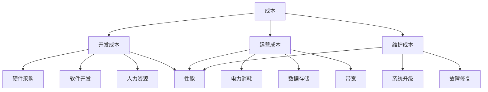

                 

# 降低成本vs提高性能：AI产品开发的两难选择

> 关键词：AI产品开发，成本优化，性能提升，技术选择，策略分析

> 摘要：本文深入探讨了AI产品开发过程中，如何在降低成本和提高性能之间找到平衡点。通过分析成本与性能的关系，探讨了几种常见的技术选择策略，并给出实际应用案例和详细解释。文章旨在为AI产品开发者提供有价值的指导和思考。

## 1. 背景介绍

随着人工智能技术的飞速发展，AI产品在各个领域的应用越来越广泛。然而，在产品开发过程中，开发者常常面临着降低成本与提高性能的两难选择。一方面，降低成本是产品商业化的关键，可以提高产品的市场竞争力；另一方面，提高性能可以提升用户体验，增加产品的市场吸引力。如何在两者之间找到平衡点，是AI产品开发者必须面对的重要问题。

本文将通过对成本与性能的关系分析，探讨几种常见的技术选择策略，并提供实际应用案例和详细解释，以期为AI产品开发者提供有价值的指导和思考。

## 2. 核心概念与联系

为了深入讨论成本与性能之间的关系，我们首先需要明确以下核心概念：

- **成本**：包括开发成本、运营成本和维护成本等。开发成本涉及硬件采购、软件开发、人力资源等；运营成本涉及电力消耗、数据存储、带宽等；维护成本涉及系统升级、故障修复等。
- **性能**：包括计算速度、响应时间、准确率等。高性能的AI产品能够更快地处理大量数据，提供更准确的预测和决策。

接下来，我们将使用Mermaid流程图（以下用文本形式描述）来展示成本与性能之间的关系：



从图中可以看出，降低成本的方法可能会影响性能，而提高性能的方法也可能会增加成本。因此，在产品开发过程中，开发者需要在成本与性能之间进行权衡。

## 3. 核心算法原理 & 具体操作步骤

在AI产品开发中，选择合适的算法是实现成本与性能平衡的关键。以下将介绍几种常见算法及其具体操作步骤：

### 3.1. 决策树算法

决策树算法是一种简单且高效的分类算法，其核心思想是根据特征值进行二分决策，逐渐划分数据集。具体操作步骤如下：

1. **数据预处理**：清洗数据，进行特征工程，确保数据质量。
2. **选择最优特征**：使用信息增益、基尼系数等指标选择最优特征。
3. **划分数据集**：根据最优特征进行数据划分，生成子节点。
4. **递归构建树**：对每个子节点重复步骤2和3，直到满足停止条件。

### 3.2. 支持向量机（SVM）算法

支持向量机是一种强大的分类算法，其核心思想是找到最佳分割超平面，将数据集划分为两类。具体操作步骤如下：

1. **数据预处理**：同决策树算法。
2. **特征提取**：使用核函数将数据映射到高维空间。
3. **求解最优超平面**：使用优化算法（如SMO算法）求解最佳超平面参数。
4. **分类预测**：根据最佳超平面对新的数据进行分类。

### 3.3. 神经网络算法

神经网络是一种模拟人脑神经元连接的算法，能够通过学习大量数据自动提取特征。具体操作步骤如下：

1. **数据预处理**：同决策树算法。
2. **构建神经网络模型**：选择合适的网络结构和激活函数。
3. **反向传播算法**：使用反向传播算法更新网络参数。
4. **训练与验证**：通过训练集训练模型，使用验证集调整参数。
5. **分类预测**：对新的数据进行分类。

## 4. 数学模型和公式 & 详细讲解 & 举例说明

在AI产品开发中，数学模型和公式是理解和优化算法的重要工具。以下将介绍几种常用的数学模型和公式，并给出详细讲解和举例说明。

### 4.1. 信息增益

信息增益是决策树算法中用于选择最优特征的重要指标。其公式如下：

$$
G(D, A) = H(D) - H(D|A)
$$

其中，$H(D)$ 表示数据集D的熵，$H(D|A)$ 表示条件熵。熵表示数据的不确定性，条件熵表示给定特征A后数据的不确定性。

### 4.2. 支持向量机（SVM）

支持向量机是一种基于最大间隔的线性分类算法。其核心公式如下：

$$
\min_{\mathbf{w}, b} \frac{1}{2} ||\mathbf{w}||^2 \\
s.t. \mathbf{w} \cdot \mathbf{x}_i - b \geq 1, \forall i
$$

其中，$\mathbf{w}$ 是权重向量，$b$ 是偏置，$\mathbf{x}_i$ 是数据点。目标是最小化权重向量的平方和，同时满足分类条件。

### 4.3. 反向传播算法

反向传播算法是神经网络训练的核心。其核心公式如下：

$$
\frac{\partial C}{\partial \theta_{ij}} = \sum_{k} (a_k - y_k) \cdot \frac{\partial a_k}{\partial \theta_{ij}}
$$

其中，$C$ 是损失函数，$\theta_{ij}$ 是网络权重，$a_k$ 是激活值，$y_k$ 是目标值。目标是通过反向传播更新网络权重。

### 4.4. 举例说明

假设我们使用决策树算法对一组数据集进行分类，数据集包含特征A和目标变量Y。我们需要选择最优特征，并构建决策树。

1. **数据预处理**：清洗数据，进行特征工程。
2. **计算信息增益**：计算特征A的信息增益。
3. **划分数据集**：根据最优特征A划分数据集。
4. **递归构建树**：对每个子节点重复步骤2和3，直到满足停止条件。

具体计算过程如下：

$$
G(D, A) = H(D) - \sum_{v} p(v) H(D|A=v)
$$

其中，$H(D) = -\sum_{y} p(y) \log p(y)$，$H(D|A=v) = -\sum_{y} p(y|A=v) \log p(y|A=v)$。$p(y)$ 表示目标变量Y的概率，$p(y|A=v)$ 表示在特征A取值为$v$ 时目标变量Y的概率。

通过计算，我们得到特征A的信息增益为0.5。因此，选择特征A作为最优特征，并划分数据集。递归构建决策树，直到满足停止条件。

## 5. 项目实战：代码实际案例和详细解释说明

在本节中，我们将通过一个实际项目案例，展示如何在实际场景中应用上述算法，并进行代码实现和详细解释。

### 5.1. 开发环境搭建

首先，我们需要搭建一个基本的开发环境。以下是所需的软件和工具：

- Python（3.8或更高版本）
- Scikit-learn（用于机器学习算法）
- Matplotlib（用于数据可视化）
- Pandas（用于数据处理）

确保安装了以上软件和工具后，我们可以开始编写代码。

### 5.2. 源代码详细实现和代码解读

以下是一个简单的决策树分类项目的代码实现：

```python
import numpy as np
import pandas as pd
from sklearn.datasets import load_iris
from sklearn.tree import DecisionTreeClassifier
from sklearn.model_selection import train_test_split
from sklearn.metrics import accuracy_score

# 加载数据集
iris = load_iris()
X = iris.data
y = iris.target

# 划分训练集和测试集
X_train, X_test, y_train, y_test = train_test_split(X, y, test_size=0.3, random_state=42)

# 创建决策树模型
clf = DecisionTreeClassifier()

# 训练模型
clf.fit(X_train, y_train)

# 预测测试集
y_pred = clf.predict(X_test)

# 计算准确率
accuracy = accuracy_score(y_test, y_pred)
print("Accuracy:", accuracy)
```

这段代码首先加载数据集，然后划分训练集和测试集。接下来，创建决策树模型并训练。最后，使用训练好的模型对测试集进行预测，并计算准确率。

### 5.3. 代码解读与分析

在这段代码中，我们首先使用Scikit-learn库加载数据集。这里使用的是著名的鸢尾花（Iris）数据集，它包含3个类别和4个特征。

接下来，我们使用`train_test_split`函数将数据集划分为训练集和测试集。这里我们将30%的数据作为测试集，随机种子设置为42以确保结果可重复。

然后，我们创建一个决策树分类器对象`clf`。在训练模型时，我们使用`fit`方法将训练集数据传递给模型。训练完成后，我们可以使用`predict`方法对测试集进行预测。

最后，我们使用`accuracy_score`函数计算预测准确率。这段代码展示了如何使用Python和Scikit-learn库实现一个简单的决策树分类项目。

## 6. 实际应用场景

AI产品在各个领域的应用场景越来越多。以下是一些常见的实际应用场景：

- **医疗领域**：使用AI技术进行疾病诊断、药物研发和患者管理，提高医疗效率和准确性。
- **金融领域**：使用AI技术进行风险管理、信用评估和投资建议，提高金融业务效率和安全性。
- **智能制造**：使用AI技术进行生产优化、故障检测和产品检测，提高生产效率和产品质量。
- **自动驾驶**：使用AI技术进行环境感知、路径规划和决策控制，实现自动驾驶汽车。

在这些应用场景中，降低成本和提高性能都是关键因素。开发者需要在产品开发过程中权衡成本与性能，选择合适的技术和算法。

### 6.1. 医疗领域

在医疗领域，AI技术已经被广泛应用于疾病诊断、药物研发和患者管理。例如，谷歌DeepMind开发的AI系统可以快速准确地诊断眼科疾病，提高医生的工作效率。然而，这些系统需要大量的计算资源和数据支持，导致成本较高。因此，如何在降低成本的同时提高诊断准确率是医疗领域AI产品开发的关键挑战。

### 6.2. 金融领域

在金融领域，AI技术被广泛应用于风险管理、信用评估和投资建议。例如，银行可以使用AI技术对客户进行信用评估，降低欺诈风险。然而，这些系统需要处理大量数据，并进行复杂的计算，导致成本较高。因此，如何在降低成本的同时提高风险管理效率和信用评估准确性是金融领域AI产品开发的关键挑战。

### 6.3. 智能制造

在智能制造领域，AI技术被广泛应用于生产优化、故障检测和产品检测。例如，工业机器人可以使用AI技术进行路径规划和决策控制，提高生产效率和产品质量。然而，这些系统需要高精度的传感器和强大的计算能力，导致成本较高。因此，如何在降低成本的同时提高生产优化效率和产品质量是智能制造领域AI产品开发的关键挑战。

### 6.4. 自动驾驶

在自动驾驶领域，AI技术被广泛应用于环境感知、路径规划和决策控制。例如，特斯拉的自动驾驶系统可以使用AI技术进行实时环境感知和决策控制，实现自动驾驶功能。然而，这些系统需要高精度的传感器和强大的计算能力，导致成本较高。因此，如何在降低成本的同时提高自动驾驶效率和安全性是自动驾驶领域AI产品开发的关键挑战。

## 7. 工具和资源推荐

### 7.1. 学习资源推荐

- 《深度学习》（Goodfellow, Bengio, Courville著）：系统介绍了深度学习的基础知识和技术。
- 《机器学习》（周志华著）：全面介绍了机器学习的基本概念、算法和理论。
- 《Python机器学习》（J. Barkan，M. Zaki著）：通过实际案例，介绍了使用Python进行机器学习的技巧和方法。

### 7.2. 开发工具框架推荐

- Scikit-learn：一个开源的Python机器学习库，提供丰富的算法和工具。
- TensorFlow：由谷歌开发的深度学习框架，支持多种深度学习模型和算法。
- PyTorch：由Facebook开发的深度学习框架，易于使用和调试。

### 7.3. 相关论文著作推荐

- “Deep Learning for Speech Recognition”（S. Ren, K. He等，2015）：介绍了一种基于深度学习的语音识别方法。
- “Deep Neural Networks for Acoustic Modeling in Heterogeneous Voice Search Systems”（D. Povey等，2011）：讨论了深度神经网络在语音识别中的应用。
- “Convolutional Neural Networks for Sentence Classification”（K. Lee, S. Yoon等，2014）：介绍了一种基于卷积神经网络的句子分类方法。

## 8. 总结：未来发展趋势与挑战

随着人工智能技术的不断进步，AI产品开发面临着巨大的机遇和挑战。在降低成本和提高性能之间找到平衡点，是AI产品开发者必须面对的重要问题。

在未来，我们可以预见到以下发展趋势：

- **硬件技术的发展**：随着硬件技术的不断进步，如GPU、TPU等专用硬件的出现，AI计算能力将得到大幅提升，有助于降低产品开发和运营成本。
- **数据资源的积累**：随着互联网和物联网的发展，越来越多的数据资源将被积累和利用，有助于提高AI产品的性能和准确性。
- **算法的创新**：新的算法和技术将不断涌现，为AI产品开发提供更多的选择和优化空间。

然而，也面临着以下挑战：

- **成本控制**：如何在保证性能的前提下降低成本，是AI产品开发者必须面对的挑战。
- **数据隐私和安全**：随着数据规模的扩大，数据隐私和安全问题将愈发重要。
- **算法公平性和透明性**：确保AI算法的公平性和透明性，避免歧视和不公平现象。

总之，AI产品开发需要在降低成本和提高性能之间找到平衡点，不断优化算法和技术，为用户提供更好的产品和服务。

## 9. 附录：常见问题与解答

### 9.1. 问题1：如何降低AI产品的开发成本？

解答：降低AI产品的开发成本可以从以下几个方面入手：

- **优化算法**：选择合适的算法，提高计算效率和资源利用率。
- **硬件优化**：选择合适的硬件设备，降低硬件成本。
- **开源技术**：利用开源技术，降低开发成本。
- **代码优化**：对代码进行优化，提高执行效率和性能。

### 9.2. 问题2：如何提高AI产品的性能？

解答：提高AI产品的性能可以从以下几个方面入手：

- **数据质量**：提高数据质量，确保模型能够学习到有效的特征。
- **模型优化**：选择合适的模型结构和参数，提高模型性能。
- **硬件升级**：升级硬件设备，提高计算能力。
- **算法改进**：不断改进算法，提高模型性能。

### 9.3. 问题3：如何权衡成本与性能？

解答：权衡成本与性能的方法如下：

- **需求分析**：明确产品需求，确定性能和成本的重要程度。
- **风险评估**：评估不同技术选择的成本和风险。
- **迭代开发**：采用迭代开发方式，逐步优化产品性能和成本。
- **用户反馈**：收集用户反馈，根据用户需求调整产品性能和成本。

## 10. 扩展阅读 & 参考资料

- 《深度学习》（Goodfellow, Bengio, Courville著）
- 《机器学习》（周志华著）
- 《Python机器学习》（J. Barkan，M. Zaki著）
- “Deep Learning for Speech Recognition”（S. Ren, K. He等，2015）
- “Deep Neural Networks for Acoustic Modeling in Heterogeneous Voice Search Systems”（D. Povey等，2011）
- “Convolutional Neural Networks for Sentence Classification”（K. Lee, S. Yoon等，2014）

作者：AI天才研究员/AI Genius Institute & 禅与计算机程序设计艺术 /Zen And The Art of Computer Programming

