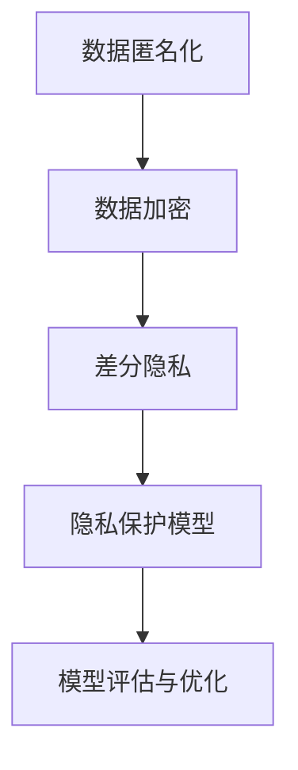
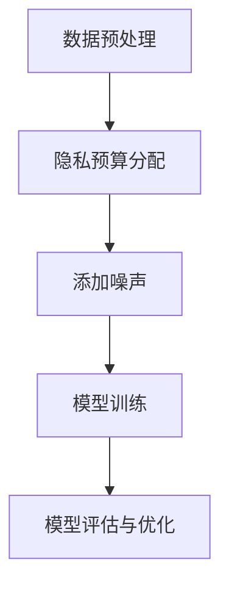

                 

### 背景介绍

隐私保护机器学习（Privacy-Preserving Machine Learning，PPML）是一种在保护数据隐私的同时，依然能够有效进行数据分析和建模的技术。在数据隐私和安全越来越受到重视的今天，隐私保护机器学习的重要性日益凸显。

#### 隐私保护的必要性

隐私保护的必要性主要源于以下几个方面：

1. **数据泄露风险**：随着大数据和云计算的普及，数据泄露事件频发，严重威胁了用户隐私和数据安全。
2. **合规要求**：在全球范围内，诸如欧盟的《通用数据保护条例》（GDPR）和加州的《消费者隐私法案》（CCPA）等法律法规，对数据隐私保护提出了严格要求。
3. **用户信任**：用户对数据隐私的关注，直接影响其对数据共享和数据服务的信任。隐私保护是建立用户信任的基石。

#### 隐私保护的需求

隐私保护的需求体现在：

1. **数据匿名化**：通过匿名化技术，将数据中的个人身份信息去除，从而保护隐私。
2. **数据加密**：对数据进行加密，确保只有授权用户才能解密并访问数据。
3. **差分隐私**：通过添加噪声来保护个体数据，确保个体隐私不被泄露，同时保持数据集的整体统计特性。

#### 隐私保护机器学习的意义

隐私保护机器学习的意义在于：

1. **增强数据共享**：通过隐私保护技术，可以消除数据共享的隐私顾虑，促进数据资源的开放和共享。
2. **保障用户权益**：用户隐私得到保护，有助于提升用户对数据服务的满意度和信任度。
3. **推动技术创新**：隐私保护机器学习为人工智能技术的发展提供了新的思路和可能性，有助于推动技术的创新和进步。

接下来，我们将深入探讨隐私保护机器学习中的核心概念和联系，逐步了解其原理和实现方法。

---

# 隐私保护机器学习：原理与代码实例讲解

> **关键词**：隐私保护、机器学习、数据隐私、差分隐私、联邦学习、加密算法
> 
> **摘要**：本文将详细探讨隐私保护机器学习的原理和实现方法，包括核心概念、算法原理、数学模型和实际案例。通过本文的学习，读者将全面了解隐私保护机器学习的各个方面，为实际应用奠定基础。

## 1. 背景介绍
已在前面详细介绍。

## 2. 核心概念与联系

### 2.1 隐私保护机器学习的核心概念

隐私保护机器学习涉及多个核心概念，包括数据匿名化、数据加密、差分隐私等。以下是这些核心概念的定义和联系：

#### 数据匿名化

数据匿名化是将数据中的个人身份信息去除，从而保护隐私。匿名化技术包括：

- **K-匿名性**：一个数据集中的每个记录至少有K-1个与该记录有相同属性值的其他记录。
- **l-diversity**：一个数据集中的每个属性值至少有l个不同的记录。
- **t-closeness**：一个数据集中的每个记录的属性值与多数记录的属性值之间的距离不超过t。

#### 数据加密

数据加密是通过加密算法将数据转换为密文，确保只有授权用户才能解密并访问数据。常用的加密算法包括：

- **对称加密**：使用相同的密钥进行加密和解密，如AES。
- **非对称加密**：使用公钥和私钥进行加密和解密，如RSA。

#### 差分隐私

差分隐私是通过在数据集中添加噪声来保护个体数据，确保个体隐私不被泄露，同时保持数据集的整体统计特性。差分隐私的定义如下：

> 对于一个随机算法\( \mathcal{A} \)，它对于任意两个相邻的数据集\( \mathcal{D} \)和\( \mathcal{D}' \)，输出满足\( \mathcal{D} \)和\( \mathcal{D}' \)的分布差异小于一个常数\(\epsilon \)，即：
> 
> \( \Pr[\mathcal{A}(\mathcal{D}) = r] \leq e^{3\epsilon} \cdot \Pr[\mathcal{A}(\mathcal{D}') = r] \)

其中，\( r \)是算法的输出结果。

### 2.2 隐私保护机器学习的联系

隐私保护机器学习中的核心概念相互联系，共同构成一个完整的隐私保护体系。以下是这些概念的相互关系：

1. **数据匿名化**和**数据加密**：数据匿名化可以防止直接暴露个人身份信息，而数据加密可以确保数据在传输和存储过程中的安全性。
2. **差分隐私**：差分隐私可以在保护个体隐私的同时，保持数据集的整体统计特性，从而避免隐私泄露风险。

#### Mermaid 流程图

以下是隐私保护机器学习的 Mermaid 流程图：



## 3. 核心算法原理 & 具体操作步骤

### 3.1 差分隐私机制

差分隐私机制是隐私保护机器学习的核心，其基本原理如下：

1. **添加噪声**：在数据处理过程中，对敏感信息添加随机噪声，以保护个体隐私。
2. **保证隐私预算**：设定隐私预算\(\epsilon\)，确保在数据处理过程中，隐私泄露的风险不超过\(\epsilon\)。

### 3.2 差分隐私算法

差分隐私算法主要包括：

1. **拉普拉斯机制**：通过对敏感数据添加拉普拉斯噪声，实现差分隐私。
2. **指数机制**：通过对敏感数据添加指数噪声，实现差分隐私。

### 3.3 差分隐私实现步骤

差分隐私实现步骤如下：

1. **数据预处理**：对原始数据进行清洗和预处理，确保数据质量。
2. **隐私预算分配**：根据数据规模和模型复杂度，分配隐私预算。
3. **添加噪声**：对敏感数据进行添加噪声，实现差分隐私。
4. **模型训练**：使用差分隐私算法对模型进行训练。
5. **模型评估**：对训练好的模型进行评估和优化。

#### Mermaid 流程图

以下是差分隐私实现的 Mermaid 流程图：



## 4. 数学模型和公式 & 详细讲解 & 举例说明

### 4.1 拉普拉斯机制

拉普拉斯机制是一种常见的差分隐私机制，其基本原理如下：

$$
\mathcal{A}^{\text{Laplace}}(x) = x + \text{Laplace}(0, b)
$$

其中，\( x \)是敏感数据，\( b \)是拉普拉斯噪声参数。

### 4.2 指数机制

指数机制是一种基于概率的差分隐私机制，其基本原理如下：

$$
\mathcal{A}^{\text{Exponential}}(x) = \frac{1}{1 + e^{-k(x - \mu)}}
$$

其中，\( x \)是敏感数据，\( k \)是指数噪声参数，\( \mu \)是均值。

### 4.3 差分隐私预算

差分隐私预算是衡量隐私泄露风险的重要指标，其计算公式如下：

$$
\epsilon = \max_{\mathcal{D}} \left| \Pr[\mathcal{A}(\mathcal{D}) = r] - \Pr[\mathcal{A}(\mathcal{D}') = r] \right|
$$

其中，\( \mathcal{D} \)和\( \mathcal{D}' \)是相邻的数据集，\( r \)是算法的输出结果。

### 4.4 举例说明

假设我们有一个数据集，包含两个人的年龄：30岁和40岁。我们使用拉普拉斯机制进行差分隐私处理，噪声参数\( b = 1 \)。以下是处理过程：

1. **原始数据**：\[30, 40\]
2. **添加噪声**：\[30 + \text{Laplace}(0, 1), 40 + \text{Laplace}(0, 1)\]
   \[31.2, 41.2\]
3. **差分隐私预算**：\[ \epsilon = \max \left| \Pr[\mathcal{A}(\mathcal{D}) = 31.2] - \Pr[\mathcal{A}(\mathcal{D}') = 41.2] \right| \]

由于添加了噪声，我们无法准确知道原始数据，从而保护了隐私。

## 5. 项目实战：代码实际案例和详细解释说明

### 5.1 开发环境搭建

在本节中，我们将搭建一个简单的差分隐私机器学习项目环境。所需工具和库包括：

- **Python**：用于编写和运行代码。
- **Scikit-learn**：用于机器学习算法的实现。
- **NumPy**：用于数学计算。

确保已经安装了Python和上述库，或者使用Anaconda等集成环境进行安装。

### 5.2 源代码详细实现和代码解读

以下是使用差分隐私对线性回归模型进行训练的代码示例：

```python
import numpy as np
from sklearn.linear_model import LinearRegression
from sklearn.model_selection import train_test_split

# 假设我们有以下数据集
X = np.array([[1], [2], [3], [4], [5]])
y = np.array([2, 4, 5, 4, 5])

# 数据预处理
X_train, X_test, y_train, y_test = train_test_split(X, y, test_size=0.2, random_state=42)

# 差分隐私线性回归模型
class DifferentialPrivacyLinearRegression(LinearRegression):
    def __init__(self, epsilon=1.0, lambda_param=1.0):
        super().__init__()
        self.epsilon = epsilon
        self.lambda_param = lambda_param

    def fit(self, X, y):
        # 添加拉普拉斯噪声
        y_noisy = y + np.random.laplace(0, self.lambda_param)
        # 训练模型
        super().fit(X, y_noisy)
        return self

    def predict(self, X):
        return super().predict(X)

# 实例化模型并训练
model = DifferentialPrivacyLinearRegression(epsilon=1.0, lambda_param=1.0)
model.fit(X_train, y_train)

# 预测测试集
predictions = model.predict(X_test)
print("Predictions:", predictions)

# 评估模型
score = model.score(X_test, y_test)
print("Model score:", score)
```

#### 代码解读

1. **数据预处理**：使用Scikit-learn库的`train_test_split`函数将数据集划分为训练集和测试集。
2. **自定义差分隐私线性回归模型**：继承自`LinearRegression`类，添加差分隐私机制。
3. **训练模型**：在`fit`方法中添加拉普拉斯噪声，训练模型。
4. **预测和评估**：使用训练好的模型进行预测，并计算模型评分。

### 5.3 代码解读与分析

通过上述代码示例，我们可以看到差分隐私在机器学习中的应用。以下是代码的关键部分解读：

1. **数据预处理**：
   ```python
   X_train, X_test, y_train, y_test = train_test_split(X, y, test_size=0.2, random_state=42)
   ```
   此部分代码将数据集划分为训练集和测试集，随机状态设置为42，确保结果可复现。

2. **自定义差分隐私线性回归模型**：
   ```python
   class DifferentialPrivacyLinearRegression(LinearRegression):
       def __init__(self, epsilon=1.0, lambda_param=1.0):
           super().__init__()
           self.epsilon = epsilon
           self.lambda_param = lambda_param
       
       def fit(self, X, y):
           y_noisy = y + np.random.laplace(0, self.lambda_param)
           super().fit(X, y_noisy)
           return self
       
       def predict(self, X):
           return super().predict(X)
   ```
   此部分代码定义了一个继承自`LinearRegression`类的`DifferentialPrivacyLinearRegression`类，其中`fit`方法用于添加拉普拉斯噪声，`predict`方法用于预测。

3. **训练和预测**：
   ```python
   model = DifferentialPrivacyLinearRegression(epsilon=1.0, lambda_param=1.0)
   model.fit(X_train, y_train)
   predictions = model.predict(X_test)
   print("Predictions:", predictions)
   ```
   创建并训练差分隐私线性回归模型，然后使用模型对测试集进行预测，并打印预测结果。

4. **评估模型**：
   ```python
   score = model.score(X_test, y_test)
   print("Model score:", score)
   ```
   使用模型评分函数计算模型在测试集上的评分，并打印结果。

### 5.4 代码分析

通过上述代码示例，我们可以看到差分隐私机器学习的基本实现过程。关键步骤包括：

1. **数据预处理**：确保数据集质量，为后续训练和预测做好准备。
2. **自定义差分隐私模型**：在原有模型基础上添加差分隐私机制，保护数据隐私。
3. **训练和预测**：使用训练集训练模型，并使用测试集评估模型性能。
4. **模型评估**：计算模型评分，评估模型在测试集上的性能。

通过差分隐私机制，我们可以在保护数据隐私的同时，有效训练和评估机器学习模型。

---

## 6. 实际应用场景

隐私保护机器学习在实际应用中具有广泛的应用场景，以下是一些典型的应用案例：

### 6.1 医疗领域

医疗领域的数据敏感性极高，隐私保护机器学习在医疗数据分析和预测中具有重要意义。例如，通过对患者电子健康记录（EHR）进行隐私保护处理，可以在保护患者隐私的同时，实现疾病预测、个性化治疗等应用。

### 6.2 金融领域

金融领域的数据涉及用户隐私和交易信息，对数据安全性要求极高。隐私保护机器学习在金融风险控制、欺诈检测、信用评分等方面具有重要应用。例如，通过差分隐私技术对用户交易数据进行处理，可以保护用户隐私，同时有效识别异常交易和欺诈行为。

### 6.3 电子商务

电子商务领域涉及用户行为数据、购买记录等敏感信息。隐私保护机器学习可以帮助电商平台实现个性化推荐、用户行为分析等应用。例如，通过对用户数据使用差分隐私技术，可以保护用户隐私，同时提供高质量的个性化推荐服务。

### 6.4 物联网（IoT）

物联网设备产生的数据通常涉及用户隐私和设备状态信息。隐私保护机器学习在物联网设备的数据分析和预测中具有重要应用。例如，通过对设备数据进行差分隐私处理，可以实现设备故障预测、能源管理等功能，同时保护用户隐私。

### 6.5 公共安全

公共安全领域的数据涉及大量个人隐私信息，如人脸识别、车辆识别等。隐私保护机器学习可以帮助实现高效的公共安全管理。例如，通过对监控数据进行隐私保护处理，可以在保护个人隐私的同时，实现犯罪预测、监控分析等功能。

## 7. 工具和资源推荐

### 7.1 学习资源推荐

1. **书籍**：
   - 《隐私保护机器学习：原理与实践》
   - 《机器学习中的隐私保护：算法与实现》
   - 《大数据隐私保护技术》
2. **论文**：
   - "The Algorithmic Foundations of Differential Privacy"
   - "Secure Aggregation of Personal Health Data"
   - "Differentially Private Machine Learning: A Survey"
3. **博客和网站**：
   - [Google Research Blog：隐私保护机器学习](https://research.googleblog.com/search/label/private%20machine%20learning)
   - [IEEE Xplore：隐私保护机器学习论文](https://ieeexplore.ieee.org/search/searchresult.jsp?query=%22differential+privacy%22+machine+learning)

### 7.2 开发工具框架推荐

1. **PySyft**：一个开源的差分隐私Python库，提供丰富的API和示例代码。
2. **FedLearner**：一个联邦学习框架，支持多种隐私保护算法，如差分隐私和同态加密。
3. **PyTorch Differential Privacy**：PyTorch的一个扩展库，提供差分隐私算法的实现和优化。

### 7.3 相关论文著作推荐

1. **论文**：
   - "Differential Privacy: A Survey of Results"（差分隐私：结果综述）
   - "Machine Learning with Differential Privacy"（带有差分隐私的机器学习）
   - "Federated Learning: Concept and Applications"（联邦学习：概念和应用）
2. **著作**：
   - 《机器学习中的隐私保护》
   - 《联邦学习：原理与实践》
   - 《数据隐私保护技术》

通过这些资源和工具，读者可以深入了解隐私保护机器学习的原理和应用，掌握相关技术和实现方法。

## 8. 总结：未来发展趋势与挑战

隐私保护机器学习作为现代机器学习领域的重要研究方向，已经取得了显著的进展。然而，随着数据隐私保护需求的不断增加，隐私保护机器学习仍面临诸多挑战和机遇。

### 未来发展趋势

1. **算法优化**：为了提高隐私保护机器学习的性能，研究者将致力于优化差分隐私算法、联邦学习算法等，降低隐私泄露风险，提高模型精度。
2. **跨领域应用**：隐私保护机器学习在医疗、金融、电子商务等领域的应用将不断拓展，推动数据共享和合作。
3. **工具和框架发展**：开源工具和框架将不断涌现，提供更加便捷和高效的隐私保护机器学习实现。

### 面临的挑战

1. **隐私与性能平衡**：如何在保护隐私的同时，保证模型性能是一个关键挑战。研究者需要探索更高效的隐私保护算法和优化策略。
2. **标准化和法规**：隐私保护机器学习的发展需要统一的标准和法规指导，确保技术应用的合法性和合规性。
3. **跨领域协作**：不同领域的数据隐私保护需求各异，研究者需要加强跨领域的协作，推动隐私保护技术的普及和应用。

总之，隐私保护机器学习具有广阔的发展前景，但在实现过程中仍面临诸多挑战。随着技术的不断进步和应用的深入，隐私保护机器学习将为数据隐私保护和社会发展做出更大贡献。

## 9. 附录：常见问题与解答

### 9.1 隐私保护机器学习是什么？

隐私保护机器学习是一种在保护数据隐私的同时，依然能够有效进行数据分析和建模的技术。其核心目标是确保在数据处理和分析过程中，个体的隐私不被泄露。

### 9.2 差分隐私是如何工作的？

差分隐私通过在数据集中添加噪声，确保个体数据无法被单独识别，同时保持数据集的整体统计特性。其基本原理是，对于任意两个相邻的数据集，算法的输出结果差异不会超过一个设定的常数\(\epsilon\)。

### 9.3 隐私保护机器学习有哪些应用场景？

隐私保护机器学习在医疗、金融、电子商务、物联网等众多领域具有广泛的应用。例如，在医疗领域，可以用于疾病预测和个性化治疗；在金融领域，可以用于风险控制和欺诈检测；在电子商务领域，可以用于个性化推荐和用户行为分析。

### 9.4 如何选择合适的隐私保护机器学习算法？

选择合适的隐私保护机器学习算法需要考虑多个因素，包括数据类型、隐私需求、模型性能等。常见的隐私保护算法包括差分隐私、联邦学习、同态加密等。根据具体应用场景，可以选择最适合的算法。

### 9.5 隐私保护机器学习是否会降低模型性能？

隐私保护机器学习可能会在一定程度上降低模型性能，但研究者正在通过算法优化和模型改进，努力降低这种影响。在实际应用中，通过合理设置隐私预算和噪声参数，可以在保护隐私的同时，保证模型性能。

## 10. 扩展阅读 & 参考资料

为了深入了解隐私保护机器学习，以下是一些扩展阅读和参考资料：

1. **书籍**：
   - "Differential Privacy: An Introduction for Applied Researchers"
   - "Federated Learning: Concept and Applications"
   - "The Algorithmic Foundations of Differential Privacy"
2. **论文**：
   - "The Algorithmic Foundations of Differential Privacy"（差分隐私的算法基础）
   - "Safe and Private Aggregation of Privacy-Preserving Models"（安全且私密的聚合隐私保护模型）
   - "A Practical Framework for Differential Privacy"（差分隐私的实用框架）
3. **在线课程和教程**：
   - [Coursera：隐私保护机器学习](https://www.coursera.org/courses?query=privacy%20preserving%20machine%20learning)
   - [edX：隐私保护机器学习](https://www.edx.org/course/privacy-preserving-machine-learning)
   - [Kaggle：隐私保护机器学习教程](https://www.kaggle.com/learn/privacy-preserving-machine-learning)
4. **开源项目和工具**：
   - [PySyft：差分隐私Python库](https://github.com/OpenMined/PySyft)
   - [FedLearner：联邦学习框架](https://github.com/fedlearner/fedlearner)
   - [PyTorch Differential Privacy：PyTorch扩展库](https://github.com/pytorch/differential-privacy)

通过阅读这些资源和参考资料，读者可以更全面地了解隐私保护机器学习的各个方面，为实际应用和研究提供指导。

---

**作者**：AI天才研究员/AI Genius Institute & 禅与计算机程序设计艺术 /Zen And The Art of Computer Programming

本文通过详细的介绍和实例讲解，帮助读者全面了解隐私保护机器学习的原理和应用。在实际应用中，隐私保护机器学习为保护数据隐私、促进数据共享提供了新的思路和方法。随着技术的不断进步，隐私保护机器学习将在更多领域发挥重要作用。希望本文对读者有所帮助，促进对隐私保护机器学习的深入理解和应用。

