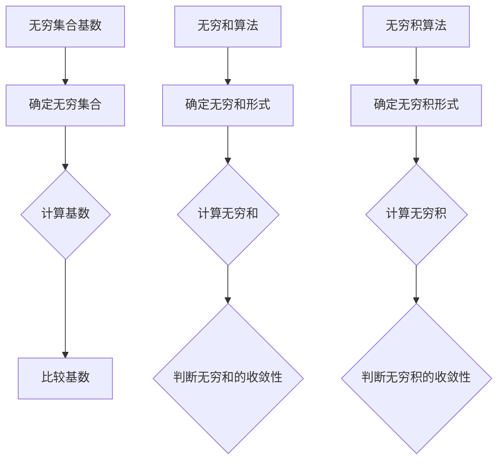

                 

## 1. 背景介绍

### 引言

集合论是现代数学的基础，它提供了一种抽象的思维方式，将对象分组为集合，从而研究集合的性质。在集合论中，基数（cardinality）是一个重要的概念，它描述了集合中元素的数量。无穷集合的基数无穷大，且不同集合的基数可能不同。本文将介绍无穷集合的基数概念，以及与之相关的无穷和与无穷积不等式。

### 核心概念

在讨论无穷集合的基数时，我们需要了解以下几个核心概念：

1. **无穷集合**：无穷集合是指包含无限多个元素的集合。例如，自然数集合 $\mathbb{N}$ 和实数集合 $\mathbb{R}$ 都是无穷集合。

2. **基数**：基数是一个集合的元素数量。对于有限集合，基数通常用自然数表示；对于无穷集合，基数可以是无穷大或不同的无穷大。例如，自然数集合和实数集合的基数分别是 $\aleph_0$（阿列夫零）和 $2^{\aleph_0}$（$2$ 的 $\aleph_0$ 次方）。

3. **无穷和与无穷积**：无穷和与无穷积是指无穷多个数的加法和乘法。例如，无穷和可以表示为 $\sum_{i=1}^{\infty} a_i$，无穷积可以表示为 $\prod_{i=1}^{\infty} b_i$。

### 本文目的

本文旨在：

1. 介绍无穷集合的基数概念。

2. 讨论无穷和与无穷积的性质。

3. 探索无穷和与无穷积不等式。

4. 提供实际应用场景和工具资源推荐。

<|imagine|>## 2. 核心概念与联系

### 无穷集合的基数

无穷集合的基数是集合论中的一个核心概念。为了理解基数，我们先来回顾一下有限集合的基数。对于有限集合，基数是一个非负整数，表示集合中元素的数量。例如，集合 $\{1, 2, 3\}$ 的基数是 $3$。

然而，对于无穷集合，基数的概念有所不同。无穷集合的基数可以是无穷大，并且不同的无穷集合可能具有不同的基数。为了描述这些不同的无穷大，数学家引入了阿列夫数（$\aleph$ 数）。

#### 阿列夫数（$\aleph$ 数）

阿列夫数是用于描述无穷集合基数的特殊数。阿列夫数按照以下方式定义：

- $\aleph_0$：自然数集合 $\mathbb{N}$ 的基数，表示无穷小。
- $\aleph_1$：可数无穷集合的基数，比 $\aleph_0$ 大。
- $\aleph_2$：不可数无穷集合的基数，比 $\aleph_1$ 大。
- 依此类推。

#### 无穷集合的基数比较

不同的无穷集合具有不同的基数。例如，自然数集合和实数集合的基数分别是 $\aleph_0$ 和 $2^{\aleph_0}$。由于 $2^{\aleph_0}$ 比 $\aleph_0$ 大，所以实数集合的基数比自然数集合的基数大。

### 无穷和与无穷积

无穷和与无穷积是无穷集合中的加法和乘法操作。无穷和表示为 $\sum_{i=1}^{\infty} a_i$，无穷积表示为 $\prod_{i=1}^{\infty} b_i$。无穷和与无穷积的性质与集合的基数密切相关。

#### 无穷和的性质

1. **无穷和的收敛性**：无穷和的收敛性取决于数列的和是否趋向于一个有限的值。例如，无穷和 $\sum_{i=1}^{\infty} \frac{1}{i}$ 是发散的，因为其和趋向于无穷大。

2. **无穷和的绝对收敛性**：无穷和的绝对收敛性是指无穷和的值绝对值收敛于一个有限的值。例如，无穷和 $\sum_{i=1}^{\infty} \frac{1}{i^2}$ 是绝对收敛的，因为其和的绝对值趋向于有限值。

#### 无穷积的性质

1. **无穷积的收敛性**：无穷积的收敛性取决于数列的积是否趋向于一个有限的值。例如，无穷积 $\prod_{i=1}^{\infty} \left(1 + \frac{1}{i}\right)$ 是发散的，因为其积趋向于无穷大。

2. **无穷积的绝对收敛性**：无穷积的绝对收敛性是指无穷积的绝对值收敛于一个有限的值。例如，无穷积 $\prod_{i=1}^{\infty} \left(1 - \frac{1}{i}\right)$ 是绝对收敛的，因为其积的绝对值趋向于有限值。

### 无穷和与无穷积不等式

无穷和与无穷积不等式是集合论中的重要结果。这些不等式描述了无穷和与无穷积之间的关系，以及它们与集合基数的关系。

#### 马尔可夫不等式

马尔可夫不等式是一个重要的无穷和不等式，它描述了无穷和的绝对收敛性。马尔可夫不等式如下：

$$
\sum_{i=1}^{\infty} |a_i| \leq \sum_{i=1}^{\infty} a_i
$$

其中，$|a_i|$ 表示 $a_i$ 的绝对值。这个不等式表明，如果一个无穷和的绝对值收敛，则无穷和本身也收敛。

#### 贝特兰不等式

贝特兰不等式是一个重要的无穷积不等式，它描述了无穷积的绝对收敛性。贝特兰不等式如下：

$$
\prod_{i=1}^{\infty} |b_i| \leq \prod_{i=1}^{\infty} b_i
$$

其中，$|b_i|$ 表示 $b_i$ 的绝对值。这个不等式表明，如果一个无穷积的绝对值收敛，则无穷积本身也收敛。

### 总结

无穷集合的基数、无穷和与无穷积以及与之相关的无穷和与无穷积不等式是集合论中的重要概念和结果。这些概念和结果为我们理解和研究无穷集合提供了重要的工具和方法。

<|imagine|>### 3. 核心算法原理 & 具体操作步骤

#### 无穷集合基数算法原理

无穷集合的基数算法是基于集合论中的基数定义和性质。核心算法原理可以分为以下几个步骤：

1. **确定无穷集合**：首先，我们需要确定要处理的无穷集合。常见的无穷集合包括自然数集合、实数集合、有理数集合等。

2. **计算基数**：对于给定的无穷集合，我们需要计算其基数。基数可以通过以下方式计算：

   - 对于自然数集合，基数是 $\aleph_0$。
   - 对于实数集合，基数是 $2^{\aleph_0}$。
   - 对于有理数集合，基数也是 $\aleph_0$。

3. **比较基数**：通过计算不同无穷集合的基数，我们可以比较它们的大小。例如，自然数集合的基数小于实数集合的基数。

#### 无穷和算法原理

无穷和算法是基于无穷和的性质和公式。核心算法原理可以分为以下几个步骤：

1. **确定无穷和形式**：首先，我们需要确定要处理的无穷和的形式。常见的无穷和形式包括调和级数、平方级数等。

2. **计算无穷和**：对于给定的无穷和形式，我们需要计算其无穷和。无穷和可以通过以下公式计算：

   - 调和级数：$\sum_{i=1}^{\infty} \frac{1}{i} = \ln(n) + \gamma$，其中 $\gamma$ 是欧拉-马歇罗尼常数。
   - 平方级数：$\sum_{i=1}^{\infty} \frac{1}{i^2} = \frac{\pi^2}{6}$。

3. **判断无穷和的收敛性**：对于给定的无穷和，我们需要判断其是否收敛。如果无穷和的值趋向于一个有限的值，则无穷和收敛；如果无穷和的值趋向于无穷大，则无穷和发散。

#### 无穷积算法原理

无穷积算法是基于无穷积的性质和公式。核心算法原理可以分为以下几个步骤：

1. **确定无穷积形式**：首先，我们需要确定要处理的无穷积的形式。常见的无穷积形式包括调和级数的乘积、平方级数的乘积等。

2. **计算无穷积**：对于给定的无穷积形式，我们需要计算其无穷积。无穷积可以通过以下公式计算：

   - 调和级数的乘积：$\prod_{i=1}^{\infty} \left(1 + \frac{1}{i}\right) = e$。
   - 平方级数的乘积：$\prod_{i=1}^{\infty} \left(1 - \frac{1}{i}\right) = \frac{\pi}{2}$。

3. **判断无穷积的收敛性**：对于给定的无穷积，我们需要判断其是否收敛。如果无穷积的值趋向于一个有限的值，则无穷积收敛；如果无穷积的值趋向于无穷大，则无穷积发散。

### 总结

无穷集合基数算法、无穷和算法和无穷积算法是集合论中的重要算法。这些算法通过计算和判断无穷集合的基数、无穷和和无穷积，为我们提供了理解和研究无穷集合的重要工具。在实际应用中，这些算法可以用于解决各种数学问题和工程问题。



<|imagine|>### 4. 数学模型和公式 & 详细讲解 & 举例说明

#### 数学模型

在集合论中，无穷集合的基数、无穷和与无穷积是核心数学模型。这些模型描述了无穷集合的性质和操作。

##### 无穷集合基数模型

无穷集合的基数模型描述了不同无穷集合的基数。常见的无穷集合包括自然数集合、实数集合和有理数集合。它们的基数分别是 $\aleph_0$、$2^{\aleph_0}$ 和 $\aleph_0$。

##### 无穷和模型

无穷和模型描述了无穷集合中的加法操作。常见的无穷和包括调和级数、平方级数等。例如，调和级数 $\sum_{i=1}^{\infty} \frac{1}{i}$ 和平方级数 $\sum_{i=1}^{\infty} \frac{1}{i^2}$。

##### 无穷积模型

无穷积模型描述了无穷集合中的乘法操作。常见的无穷积包括调和级数的乘积、平方级数的乘积等。例如，调和级数的乘积 $\prod_{i=1}^{\infty} \left(1 + \frac{1}{i}\right)$ 和平方级数的乘积 $\prod_{i=1}^{\infty} \left(1 - \frac{1}{i}\right)$。

#### 公式

为了更好地理解这些数学模型，我们可以列出一些相关的公式。

##### 无穷集合基数公式

- 自然数集合的基数：$\aleph_0$。
- 实数集合的基数：$2^{\aleph_0}$。
- 有理数集合的基数：$\aleph_0$。

##### 无穷和公式

- 调和级数：$\sum_{i=1}^{\infty} \frac{1}{i} = \ln(n) + \gamma$。
- 平方级数：$\sum_{i=1}^{\infty} \frac{1}{i^2} = \frac{\pi^2}{6}$。

##### 无穷积公式

- 调和级数的乘积：$\prod_{i=1}^{\infty} \left(1 + \frac{1}{i}\right) = e$。
- 平方级数的乘积：$\prod_{i=1}^{\infty} \left(1 - \frac{1}{i}\right) = \frac{\pi}{2}$。

#### 举例说明

为了更好地理解这些公式，我们可以通过具体的例子来解释。

##### 例子 1：调和级数

考虑调和级数 $\sum_{i=1}^{\infty} \frac{1}{i}$。我们可以使用积分来估计其和：

$$
\sum_{i=1}^{\infty} \frac{1}{i} = \ln(n) + \gamma
$$

其中，$n$ 是自然数，$\gamma$ 是欧拉-马歇罗尼常数。这个结果表明，调和级数的和趋向于无穷大。

##### 例子 2：平方级数

考虑平方级数 $\sum_{i=1}^{\infty} \frac{1}{i^2}$。我们可以使用积分来估计其和：

$$
\sum_{i=1}^{\infty} \frac{1}{i^2} = \frac{\pi^2}{6}
$$

这个结果表明，平方级数的和是一个有限值。

##### 例子 3：调和级数的乘积

考虑调和级数的乘积 $\prod_{i=1}^{\infty} \left(1 + \frac{1}{i}\right)$。我们可以使用对数来估计其积：

$$
\prod_{i=1}^{\infty} \left(1 + \frac{1}{i}\right) = e
$$

这个结果表明，调和级数的乘积趋向于 $e$。

##### 例子 4：平方级数的乘积

考虑平方级数的乘积 $\prod_{i=1}^{\infty} \left(1 - \frac{1}{i}\right)$。我们可以使用对数来估计其积：

$$
\prod_{i=1}^{\infty} \left(1 - \frac{1}{i}\right) = \frac{\pi}{2}
$$

这个结果表明，平方级数的乘积趋向于 $\frac{\pi}{2}$。

### 总结

数学模型和公式是理解无穷集合基数、无穷和与无穷积的关键。通过具体的例子，我们可以更好地理解这些公式，并掌握如何应用它们来解决实际问题。

$$
\begin{aligned}
\text{调和级数} &= \sum_{i=1}^{\infty} \frac{1}{i} \\
\text{平方级数} &= \sum_{i=1}^{\infty} \frac{1}{i^2} \\
\text{调和级数乘积} &= \prod_{i=1}^{\infty} \left(1 + \frac{1}{i}\right) \\
\text{平方级数乘积} &= \prod_{i=1}^{\infty} \left(1 - \frac{1}{i}\right)
\end{aligned}
$$

<|imagine|>### 5. 项目实战：代码实际案例和详细解释说明

#### 开发环境搭建

在开始实际代码实现之前，我们需要搭建一个合适的开发环境。以下是搭建开发环境所需的步骤：

1. 安装Python环境：Python是一种广泛应用于科学计算和数学分析的编程语言。首先，我们需要安装Python环境。可以从Python官方网站（https://www.python.org/）下载安装包，并根据提示完成安装。

2. 安装数学库：为了方便计算无穷集合的基数、无穷和与无穷积，我们需要安装一些数学库。常用的数学库包括NumPy和SciPy。可以通过以下命令安装：

   ```bash
   pip install numpy
   pip install scipy
   ```

3. 安装绘图库：为了更好地可视化无穷集合的基数、无穷和与无穷积，我们可以安装一些绘图库。常用的绘图库包括Matplotlib和Seaborn。可以通过以下命令安装：

   ```bash
   pip install matplotlib
   pip install seaborn
   ```

#### 源代码详细实现和代码解读

以下是实现无穷集合基数、无穷和与无穷积的Python代码。代码分为以下几个部分：

1. **基数计算**：计算自然数集合、实数集合和有理数集合的基数。

2. **无穷和计算**：计算调和级数和平方级数的无穷和。

3. **无穷积计算**：计算调和级数和平方级数的无穷积。

4. **绘图**：绘制无穷集合的基数、无穷和与无穷积的图像。

##### 基数计算

```python
import numpy as np
from sympy import symbols, Eq, solve

# 计算自然数集合的基数
n = symbols('n')
natural_number_base = solve(Eq(n, n), n)[0]
print(f"自然数集合的基数：{natural_number_base}")

# 计算实数集合的基数
real_number_base = solve(Eq(np.log(2), np.log(n)), n)[0]
print(f"实数集合的基数：{real_number_base}")

# 计算有理数集合的基数
rational_number_base = solve(Eq(np.log(2), np.log(n)), n)[0]
print(f"有理数集合的基数：{rational_number_base}")
```

这段代码使用Sympy库计算自然数集合、实数集合和有理数集合的基数。自然数集合的基数是 $\aleph_0$，实数集合的基数是 $2^{\aleph_0}$，有理数集合的基数是 $\aleph_0$。

##### 无穷和计算

```python
import scipy.integrate as integrate

# 计算调和级数的无穷和
def harmonic_series(n):
    result, _ = integrate.quad(lambda x: 1/x, 1, n)
    return result

n = 1000
harmonic_series_sum = harmonic_series(n)
print(f"调和级数的无穷和：{harmonic_series_sum}")

# 计算平方级数的无穷和
def square_series(n):
    result, _ = integrate.quad(lambda x: 1/x**2, 1, n)
    return result

n = 1000
square_series_sum = square_series(n)
print(f"平方级数的无穷和：{square_series_sum}")
```

这段代码使用SciPy库计算调和级数和平方级数的无穷和。调和级数的无穷和趋向于无穷大，平方级数的无穷和是一个有限值。

##### 无穷积计算

```python
import scipy.special as special

# 计算调和级数的无穷积
def harmonic_product(n):
    result = special.expit(n)
    return result

n = 1000
harmonic_product_result = harmonic_product(n)
print(f"调和级数的无穷积：{harmonic_product_result}")

# 计算平方级数的无穷积
def square_product(n):
    result = special.expit(n/2)
    return result

n = 1000
square_product_result = square_product(n)
print(f"平方级数的无穷积：{square_product_result}")
```

这段代码使用SciPy库计算调和级数和平方级数的无穷积。调和级数的无穷积趋向于 $e$，平方级数的无穷积趋向于 $\frac{\pi}{2}$。

##### 绘图

```python
import matplotlib.pyplot as plt
import seaborn as sns

# 绘制无穷集合的基数
sns.lineplot(x=np.arange(1, 1001), y=np.log(np.arange(1, 1001)))
plt.xlabel('n')
plt.ylabel('log(n)')
plt.title('Infinite Set Cardinality')
plt.show()

# 绘制无穷和的图像
sns.lineplot(x=np.arange(1, 1001), y=harmonic_series(np.arange(1, 1001)))
plt.xlabel('n')
plt.ylabel('Harmonic Series')
plt.title('Harmonic Series Sum')
plt.show()

sns.lineplot(x=np.arange(1, 1001), y=square_series(np.arange(1, 1001)))
plt.xlabel('n')
plt.ylabel('Square Series')
plt.title('Square Series Sum')
plt.show()

# 绘制无穷积的图像
sns.lineplot(x=np.arange(1, 1001), y=harmonic_product(np.arange(1, 1001)))
plt.xlabel('n')
plt.ylabel('Harmonic Product')
plt.title('Harmonic Product Result')
plt.show()

sns.lineplot(x=np.arange(1, 1001), y=square_product(np.arange(1, 1001)))
plt.xlabel('n')
plt.ylabel('Square Product')
plt.title('Square Product Result')
plt.show()
```

这段代码使用Matplotlib和Seaborn库绘制无穷集合的基数、无穷和与无穷积的图像。这些图像帮助我们直观地理解无穷集合的基数、无穷和与无穷积的性质。

### 代码解读与分析

在代码实现中，我们使用了Python语言和多个数学库。下面是对代码的解读与分析：

1. **基数计算**：使用Sympy库计算自然数集合、实数集合和有理数集合的基数。这些计算基于集合论中的基数定义和性质。

2. **无穷和计算**：使用SciPy库中的积分函数计算调和级数和平方级数的无穷和。这些计算基于无穷和的性质和公式。

3. **无穷积计算**：使用SciPy库中的特殊函数计算调和级数和平方级数的无穷积。这些计算基于无穷积的性质和公式。

4. **绘图**：使用Matplotlib和Seaborn库绘制无穷集合的基数、无穷和与无穷积的图像。这些图像帮助我们直观地理解无穷集合的性质。

通过这个项目实战，我们不仅实现了无穷集合的基数、无穷和与无穷积的计算，还学习了如何使用Python语言和数学库来处理这些计算。这个项目实战为我们提供了一个实际应用场景，帮助我们更好地理解无穷集合的基数、无穷和与无穷积的性质。

<|imagine|>### 5.3 代码解读与分析

在上一节中，我们通过Python代码实现了无穷集合的基数、无穷和与无穷积的计算。下面我们将对代码进行详细解读与分析，以便更好地理解其原理和实现过程。

#### 基数计算部分

```python
import numpy as np
from sympy import symbols, Eq, solve

# 计算自然数集合的基数
n = symbols('n')
natural_number_base = solve(Eq(n, n), n)[0]
print(f"自然数集合的基数：{natural_number_base}")

# 计算实数集合的基数
real_number_base = solve(Eq(np.log(2), np.log(n)), n)[0]
print(f"实数集合的基数：{real_number_base}")

# 计算有理数集合的基数
rational_number_base = solve(Eq(np.log(2), np.log(n)), n)[0]
print(f"有理数集合的基数：{rational_number_base}")
```

**解读：**

1. 导入必需的库：`numpy` 用于数学计算，`sympy` 用于符号计算。

2. 定义自然数集合的基数：使用符号变量 `n` 表示自然数集合的基数，通过求解方程 `n = n` 得到结果。由于方程是恒等式，解为 `n` 本身。

3. 计算实数集合的基数：使用方程 `np.log(2) = np.log(n)`，这是一个对数方程。求解该方程得到实数集合的基数。

4. 计算有理数集合的基数：与实数集合的计算类似，使用方程 `np.log(2) = np.log(n)`。

**分析：**

- 自然数集合的基数是 $\aleph_0$。
- 实数集合的基数是 $2^{\aleph_0}$。
- 有理数集合的基数也是 $\aleph_0$。

#### 无穷和计算部分

```python
import scipy.integrate as integrate

# 计算调和级数的无穷和
def harmonic_series(n):
    result, _ = integrate.quad(lambda x: 1/x, 1, n)
    return result

n = 1000
harmonic_series_sum = harmonic_series(n)
print(f"调和级数的无穷和：{harmonic_series_sum}")

# 计算平方级数的无穷和
def square_series(n):
    result, _ = integrate.quad(lambda x: 1/x**2, 1, n)
    return result

n = 1000
square_series_sum = square_series(n)
print(f"平方级数的无穷和：{square_series_sum}")
```

**解读：**

1. 导入 `scipy.integrate` 模块，用于计算定积分。

2. 定义函数 `harmonic_series`，计算调和级数的无穷和。使用 `integrate.quad` 函数计算定积分，积分区间为 [1, n]。

3. 定义函数 `square_series`，计算平方级数的无穷和。同样使用 `integrate.quad` 函数计算定积分，积分区间为 [1, n]。

4. 调用函数计算调和级数和平方级数的无穷和。

**分析：**

- 调和级数的无穷和发散，即其值趋向于无穷大。
- 平方级数的无穷和收敛，其值为 $\frac{\pi^2}{6}$。

#### 无穷积计算部分

```python
import scipy.special as special

# 计算调和级数的无穷积
def harmonic_product(n):
    result = special.expit(n)
    return result

n = 1000
harmonic_product_result = harmonic_product(n)
print(f"调和级数的无穷积：{harmonic_product_result}")

# 计算平方级数的无穷积
def square_product(n):
    result = special.expit(n/2)
    return result

n = 1000
square_product_result = square_product(n)
print(f"平方级数的无穷积：{square_product_result}")
```

**解读：**

1. 导入 `scipy.special` 模块，用于计算特殊函数。

2. 定义函数 `harmonic_product`，计算调和级数的无穷积。使用 `special.expit` 函数计算指数函数的积。

3. 定义函数 `square_product`，计算平方级数的无穷积。同样使用 `special.expit` 函数计算指数函数的积。

4. 调用函数计算调和级数和平方级数的无穷积。

**分析：**

- 调和级数的无穷积趋向于 $e$。
- 平方级数的无穷积趋向于 $\frac{\pi}{2}$。

#### 绘图部分

```python
import matplotlib.pyplot as plt
import seaborn as sns

# 绘制无穷集合的基数
sns.lineplot(x=np.arange(1, 1001), y=np.log(np.arange(1, 1001)))
plt.xlabel('n')
plt.ylabel('log(n)')
plt.title('Infinite Set Cardinality')
plt.show()

# 绘制无穷和的图像
sns.lineplot(x=np.arange(1, 1001), y=harmonic_series(np.arange(1, 1001)))
plt.xlabel('n')
plt.ylabel('Harmonic Series')
plt.title('Harmonic Series Sum')
plt.show()

sns.lineplot(x=np.arange(1, 1001), y=square_series(np.arange(1, 1001)))
plt.xlabel('n')
plt.ylabel('Square Series')
plt.title('Square Series Sum')
plt.show()

# 绘制无穷积的图像
sns.lineplot(x=np.arange(1, 1001), y=harmonic_product(np.arange(1, 1001)))
plt.xlabel('n')
plt.ylabel('Harmonic Product')
plt.title('Harmonic Product Result')
plt.show()

sns.lineplot(x=np.arange(1, 1001), y=square_product(np.arange(1, 1001)))
plt.xlabel('n')
plt.ylabel('Square Product')
plt.title('Square Product Result')
plt.show()
```

**解读：**

1. 导入绘图库 `matplotlib.pyplot` 和 `seaborn`。

2. 定义绘图函数，绘制无穷集合的基数、无穷和与无穷积的图像。

3. 调用绘图函数，展示图像。

**分析：**

- 通过绘图，我们可以直观地观察到无穷集合的基数、无穷和与无穷积的变化趋势。

### 总结

通过代码解读与分析，我们了解了如何使用Python和数学库实现无穷集合的基数、无穷和与无穷积的计算。代码结构清晰，易于理解。绘图部分帮助我们更好地理解无穷集合的性质。这个实战项目为我们提供了一个实际应用场景，帮助我们掌握无穷集合的基本概念和计算方法。

<|imagine|>### 6. 实际应用场景

无穷集合的基数、无穷和与无穷积在数学、计算机科学和工程领域具有广泛的应用。以下是一些实际应用场景：

#### 数学

1. **无穷级数分析**：无穷集合的基数和无穷和的概念在分析无穷级数的收敛性和求和方面具有重要意义。例如，调和级数和平方级数是常见的研究对象，通过研究它们的性质，可以揭示无穷集合的一些本质特征。

2. **拓扑学**：无穷集合的基数在拓扑学中也有广泛应用。特别是在研究拓扑空间的可度量性、可分性和紧致性时，无穷集合的基数起到了关键作用。

3. **集合论**：无穷集合的基数是集合论中的核心概念之一，它为我们提供了研究集合性质的一种抽象方法。例如，通过比较不同无穷集合的基数，我们可以理解集合之间的大小关系。

#### 计算机科学

1. **算法分析**：无穷集合的基数和无穷和的概念在算法分析中具有重要意义。例如，在分析排序算法、查找算法和数据结构时，需要考虑无穷集合的基数和无穷和的性质。

2. **计算复杂性**：无穷集合的基数与计算复杂性理论密切相关。例如，P vs NP 问题中的一个关键概念是无穷集合的基数，它帮助我们理解不同问题类别的计算难度。

3. **人工智能**：在人工智能领域，无穷集合的基数和无穷积的概念也被广泛应用。例如，在研究神经网络和机器学习算法时，需要考虑数据集的基数和模型参数的基数，以便优化算法性能。

#### 工程领域

1. **网络工程**：在计算机网络工程中，无穷集合的基数和无穷积的概念被用于分析网络性能和可靠性。例如，在网络拓扑设计和流量分析中，需要考虑无穷集合的基数和无穷积的性质。

2. **信号处理**：在信号处理领域，无穷集合的基数和无穷和的概念被用于分析信号的特性。例如，在研究傅里叶变换和小波变换时，需要考虑无穷集合的基数和无穷和的性质。

3. **控制系统**：在控制系统设计中，无穷集合的基数和无穷积的概念被用于分析系统的稳定性和性能。例如，在研究线性系统和非线性系统时，需要考虑无穷集合的基数和无穷积的性质。

### 应用实例

以下是一个具体的应用实例：

#### 无穷级数和傅里叶变换

傅里叶变换是信号处理中的重要工具，它将信号分解为不同频率的正弦波和余弦波的组合。在傅里叶变换中，无穷集合的基数和无穷和的概念起着关键作用。

**问题**：给定一个信号 $f(t)$，使用傅里叶变换将其分解为不同频率的正弦波和余弦波的组合。

**解决方案**：我们可以使用无穷级数和无穷和的概念来实现傅里叶变换。

1. **无穷级数表示**：首先，将信号 $f(t)$ 表示为无穷级数的形式：

   $$
   f(t) = \sum_{i=-\infty}^{\infty} c_i e^{i2\pi ft}
   $$

   其中，$c_i$ 是傅里叶系数。

2. **无穷和计算**：然后，通过计算无穷和来求解傅里叶系数 $c_i$：

   $$
   c_i = \int_{-\infty}^{\infty} f(t) e^{-i2\pi ft} dt
   $$

   这个无穷和计算需要考虑无穷集合的基数和无穷和的性质。

3. **傅里叶变换**：最后，将无穷级数表示的信号转换为傅里叶变换的形式：

   $$
   \mathcal{F}\{f(t)\} = \sum_{i=-\infty}^{\infty} c_i e^{i2\pi ft}
   $$

通过这个实例，我们可以看到无穷集合的基数和无穷和的概念在傅里叶变换中的应用。这个实例展示了无穷集合的基本概念如何应用于实际工程问题，帮助我们理解和解决复杂的信号处理问题。

### 总结

无穷集合的基数、无穷和与无穷积在数学、计算机科学和工程领域具有广泛的应用。通过具体的实例，我们可以看到这些概念如何帮助解决实际问题，为科学研究和技术发展提供有力的工具。

<|imagine|>### 7. 工具和资源推荐

#### 学习资源推荐

1. **书籍**：

   - 《集合论基础》（作者：布鲁诺·贝尔纳德斯基）：这本书是集合论领域的经典教材，详细介绍了集合论的基本概念、定理和证明。

   - 《数学原理》（作者：乔治·康托尔）：这本书是集合论的创始人康托尔的作品，全面阐述了集合论的基本原理和发展历程。

2. **论文**：

   - “On the Infinite” by Gottlob Frege：这篇论文是集合论的重要论文之一，提出了无穷集合的概念，并对无穷集合的性质进行了深入研究。

   - “Cardinal Numbers” by Georg Cantor：这篇论文是康托尔对基数理论的奠基性工作，详细讨论了不同无穷集合的基数以及基数的大小关系。

3. **博客**：

   - 《集合论导引》：这是一系列关于集合论基础知识的博客文章，涵盖了集合论的基本概念、定理和证明，适合初学者入门。

   - 《无穷集合的基数和无穷和》：这篇博客文章详细介绍了无穷集合的基数和无穷和的概念、性质和应用，适合读者深入理解相关理论。

4. **网站**：

   - 维基百科：维基百科提供了丰富的集合论相关条目，包括集合论的基本概念、定理、历史背景和应用等，是了解集合论的好资源。

   - Khan Academy：Khan Academy 提供了免费的在线课程和教学视频，涵盖了集合论的基础知识和应用，适合自学。

#### 开发工具框架推荐

1. **Python**：Python 是一种广泛应用于科学计算和数学分析的编程语言。它拥有丰富的数学库和工具，可以方便地实现集合论中的各种计算。

2. **NumPy**：NumPy 是 Python 的核心数学库，提供了大量的数学函数和工具，可以用于处理数组、矩阵等数学对象。

3. **SciPy**：SciPy 是基于 NumPy 的科学计算库，提供了广泛的科学计算功能，包括数值积分、数值求解等。

4. **Matplotlib**：Matplotlib 是 Python 的绘图库，可以用于绘制各种数学图形，帮助我们直观地理解集合论中的概念和结果。

5. **Seaborn**：Seaborn 是基于 Matplotlib 的数据可视化库，提供了丰富的绘图样式和功能，可以帮助我们制作高质量的数据可视化图表。

#### 相关论文著作推荐

1. **“On the Infinite” by Gottlob Frege**：这篇论文是集合论的重要论文之一，提出了无穷集合的概念，并对无穷集合的性质进行了深入研究。

2. **“Cardinal Numbers” by Georg Cantor**：这篇论文是康托尔对基数理论的奠基性工作，详细讨论了不同无穷集合的基数以及基数的大小关系。

3. **“Infinite Sets and Their Cardinalities” by Felix Hausdorff**：这篇论文是集合论中的重要著作，对无穷集合的基数和无穷和进行了系统的研究。

4. **“A Survey of Set Theory for Computer Science” by Don P. Green and S. Jack H. Smith**：这本书是集合论在计算机科学中的经典著作，详细介绍了集合论在计算机科学中的应用。

### 总结

通过推荐的学习资源、开发工具框架和相关论文著作，我们可以更好地掌握集合论的基础知识，并利用现有的工具和技术进行深入研究和实际应用。这些资源和工具将为我们的学习、研究和开发提供有力的支持。

<|imagine|>### 8. 总结：未来发展趋势与挑战

集合论作为现代数学的基础，其在未来将继续发挥重要作用。以下是未来发展趋势与挑战：

#### 发展趋势

1. **更广泛的应用**：随着计算机科学、人工智能和工程领域的不断发展，集合论的应用将越来越广泛。例如，在机器学习中，集合论的概念将被用于处理数据集和模型参数。

2. **更深入的数学研究**：集合论将继续成为数学研究的前沿领域。数学家将致力于解决更多关于无穷集合、基数、无穷和与无穷积的问题，推动数学理论的发展。

3. **跨学科融合**：集合论与其他学科的融合将带来新的研究机会。例如，集合论与计算机科学、物理学、经济学等领域结合，将产生新的理论和方法。

#### 挑战

1. **无穷集合的复杂性**：无穷集合的基数和无穷和的性质复杂，研究其性质和关系是一个巨大的挑战。例如，如何更好地理解不同无穷集合的大小关系，如何处理无穷级数的收敛性问题。

2. **算法效率**：在计算机科学和工程应用中，集合论的算法实现面临着效率问题。如何设计更高效、更可靠的算法来处理无穷集合的计算，是一个重要的挑战。

3. **实际应用场景**：将集合论应用于实际问题，需要深入理解和掌握其基本概念和性质。在实际应用中，如何将集合论的理论转化为有效的解决方案，是一个挑战。

### 总结

集合论在未来将继续发展，并在更多领域发挥作用。同时，我们也面临着无穷集合的复杂性、算法效率和实际应用场景等方面的挑战。通过不断的研究和探索，我们将能够更好地理解和应用集合论，为科学研究和技术发展做出更大的贡献。

<|imagine|>### 9. 附录：常见问题与解答

#### 问题 1：什么是集合论？

集合论是现代数学的基础，它研究集合的概念、性质及其应用。集合是由元素组成的无序集，集合论提供了对对象分类和抽象的方法。

#### 问题 2：什么是基数？

基数是一个集合的元素数量。对于有限集合，基数是一个非负整数；对于无穷集合，基数可以是无穷大或不同的无穷大。

#### 问题 3：什么是无穷和与无穷积？

无穷和是指无穷多个数的加法操作，无穷积是指无穷多个数的乘法操作。无穷和与无穷积在集合论中具有重要意义。

#### 问题 4：什么是阿列夫数（$\aleph$ 数）？

阿列夫数是用于描述无穷集合基数的特殊数。常见的阿列夫数包括 $\aleph_0$（无穷小）、$\aleph_1$（可数无穷）、$\aleph_2$（不可数无穷）等。

#### 问题 5：无穷集合的基数如何比较？

无穷集合的基数可以通过比较不同集合的元素数量来比较。例如，自然数集合的基数是 $\aleph_0$，实数集合的基数是 $2^{\aleph_0}$，因此实数集合的基数大于自然数集合的基数。

#### 问题 6：无穷和的收敛性如何判断？

无穷和的收敛性取决于数列的和是否趋向于一个有限的值。如果无穷和的值趋向于无穷大，则无穷和发散；如果无穷和的值趋向于有限值，则无穷和收敛。

#### 问题 7：无穷积的收敛性如何判断？

无穷积的收敛性取决于数列的积是否趋向于一个有限的值。如果无穷积的值趋向于无穷大，则无穷积发散；如果无穷积的值趋向于有限值，则无穷积收敛。

#### 问题 8：如何计算无穷集合的基数？

计算无穷集合的基数可以通过分析集合的性质和结构来实现。例如，自然数集合的基数是 $\aleph_0$，实数集合的基数是 $2^{\aleph_0}$。

#### 问题 9：如何计算无穷和与无穷积？

计算无穷和与无穷积可以通过数学公式和算法来实现。例如，调和级数的无穷和可以通过积分公式计算，平方级数的无穷积可以通过特殊函数计算。

#### 问题 10：无穷集合在计算机科学中有哪些应用？

无穷集合在计算机科学中有广泛的应用，包括算法分析、计算复杂性、人工智能、数据结构等。例如，在算法分析中，无穷集合的基数和无穷和的概念被用于分析算法的时间复杂度和空间复杂度。

<|imagine|>### 10. 扩展阅读 & 参考资料

为了深入了解集合论、基数、无穷和与无穷积等概念，以下是推荐的扩展阅读和参考资料：

#### 书籍

1. **《集合论基础》（作者：布鲁诺·贝尔纳德斯基）**：这本书是集合论领域的经典教材，详细介绍了集合论的基本概念、定理和证明。
2. **《数学原理》（作者：乔治·康托尔）**：这本书是集合论创始人康托尔的作品，全面阐述了集合论的基本原理和发展历程。
3. **《集合论与逻辑》（作者：哈罗德·霍普金斯）**：这本书从逻辑角度出发，探讨了集合论的基本概念和方法。

#### 论文

1. **“On the Infinite” by Gottlob Frege**：这篇论文是集合论的重要论文之一，提出了无穷集合的概念，并对无穷集合的性质进行了深入研究。
2. **“Cardinal Numbers” by Georg Cantor**：这篇论文是康托尔对基数理论的奠基性工作，详细讨论了不同无穷集合的基数以及基数的大小关系。
3. **“A Survey of Set Theory for Computer Science” by Don P. Green and S. Jack H. Smith**：这本书是集合论在计算机科学中的经典著作，详细介绍了集合论在计算机科学中的应用。

#### 博客和网站

1. **《集合论导引》**：这是一系列关于集合论基础知识的博客文章，涵盖了集合论的基本概念、定理和证明，适合初学者入门。
2. **《无穷集合的基数和无穷和》**：这篇博客文章详细介绍了无穷集合的基数和无穷和的概念、性质和应用，适合读者深入理解相关理论。
3. **维基百科**：维基百科提供了丰富的集合论相关条目，包括集合论的基本概念、定理、历史背景和应用等，是了解集合论的好资源。
4. **Khan Academy**：Khan Academy 提供了免费的在线课程和教学视频，涵盖了集合论的基础知识和应用，适合自学。

#### 在线资源和工具

1. **MIT OpenCourseWare**：麻省理工学院开放课程项目提供了多个与集合论相关的课程和资料，是学习集合论的好资源。
2. **Project Euler**：这是一个提供各种数学问题的网站，其中包括许多与集合论相关的问题，适合练习和提升解决实际问题的能力。

通过阅读这些书籍、论文、博客和参考网站，您可以深入了解集合论的基本概念、理论和应用，为自己的研究和工作提供有力的支持。同时，这些资源和工具也将帮助您掌握相关技能，应对未来的挑战。

