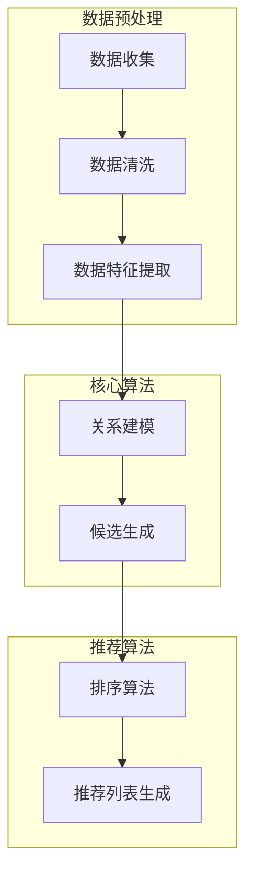

                 

### 背景介绍

#### 电子商务时代的挑战

在当今的电子商务时代，商品推荐系统已经成为提高用户体验、增加销售额和提升用户留存率的重要工具。传统的基于历史数据或用户行为的推荐系统，如协同过滤、基于内容的推荐等，已经在许多场景中得到了广泛应用。然而，这些系统在应对零样本推荐任务时，却面临着巨大的挑战。

#### 什么是零样本推荐

零样本推荐是指在未知用户兴趣或未知商品属性的情况下，为用户推荐合适的商品。这种推荐方式与传统的有监督学习或基于用户历史的推荐方式截然不同。在零样本推荐中，模型需要从零开始，即没有任何先验信息，通过学习数据中的关系和模式，为用户生成潜在感兴趣的商品。

#### 零样本推荐的挑战

零样本推荐面临以下几个主要挑战：

1. **数据稀疏**：在许多实际场景中，用户的历史行为数据非常有限，这导致模型难以从数据中学习到有效的关联性。
2. **高维度特征**：商品和用户特征通常具有高维度，这增加了模型训练的复杂度。
3. **通用性**：零样本推荐需要具有泛化能力，能够适应各种不同的用户和商品场景。

#### 零样本推荐的应用场景

零样本推荐在多个领域具有广泛的应用前景，包括：

1. **新用户推荐**：为新用户推荐他们可能感兴趣的商品，无需依赖历史行为数据。
2. **冷启动问题**：在用户加入新社区或平台时，为他们推荐感兴趣的内容或商品。
3. **个性化推荐**：为用户提供更精准的个性化推荐，提高用户满意度和留存率。

#### 零样本推荐的重要性

零样本推荐不仅在电子商务领域具有重要意义，还与其他领域如社交媒体、在线广告、医疗诊断等密切相关。它能够帮助企业更好地理解用户需求，提高用户满意度，从而在竞争激烈的市场中脱颖而出。

#### 本文结构

本文将系统地介绍零样本推荐中的候选生成策略。具体内容如下：

1. **核心概念与联系**：介绍零样本推荐中的核心概念，并使用Mermaid流程图展示推荐系统架构。
2. **核心算法原理 & 具体操作步骤**：详细阐述候选生成策略的算法原理，并描述具体操作步骤。
3. **数学模型和公式 & 详细讲解 & 举例说明**：解释候选生成策略中的数学模型和公式，并通过实例说明。
4. **项目实战：代码实际案例和详细解释说明**：提供实际代码实现和详细解读，帮助读者理解候选生成策略在实际项目中的应用。
5. **实际应用场景**：探讨候选生成策略在不同领域的实际应用。
6. **工具和资源推荐**：推荐相关学习资源和开发工具，以帮助读者深入学习。
7. **总结：未来发展趋势与挑战**：总结候选生成策略的发展趋势和面临的挑战。
8. **附录：常见问题与解答**：解答读者可能遇到的一些常见问题。
9. **扩展阅读 & 参考资料**：提供更多相关的阅读材料。

通过本文的阅读，读者将能够深入了解零样本推荐中的候选生成策略，掌握其核心原理和具体应用，为实际项目提供有力的技术支持。

#### 零样本推荐的背景和挑战

零样本推荐（Zero-Shot Recommendation）是一种突破传统推荐系统限制的创新技术，旨在解决现有推荐系统在应对新用户、新商品或未观察到的用户兴趣时的不足。在传统推荐系统中，如基于内容的推荐和协同过滤等，通常需要依赖大量的历史数据，包括用户的历史行为、评价、搜索记录等，通过这些数据来推断用户的兴趣和偏好，从而进行推荐。然而，这种方法在以下几种情况下面临巨大挑战：

1. **新用户推荐**：对于新加入平台的新用户，由于缺乏历史行为数据，传统推荐系统无法准确预测他们的兴趣。这就导致了所谓的“冷启动”问题，即新用户在初始阶段很难获得个性化推荐，从而影响用户体验。

2. **新商品推荐**：同样地，对于新上架的商品，传统推荐系统也无法利用其历史销售数据或用户评价进行推荐，这使得新商品很难被潜在用户发现，从而影响销售额。

3. **长尾商品推荐**：在长尾商品推荐中，由于热门商品的竞争激烈，传统推荐系统往往难以给冷门商品带来曝光机会。这导致许多有潜力的商品无法被推荐系统发现和推广。

4. **通用性限制**：传统推荐系统通常针对特定类型的用户或商品进行优化，这限制了其在多种场景下的通用性和适应性。

零样本推荐通过引入零样本学习（Zero-Shot Learning，ZSL）技术，解决了上述问题。零样本学习是一种机器学习技术，旨在在没有任何先验标签数据的情况下，对未见过的类进行分类。在推荐系统中，零样本推荐通过学习数据中的隐含关系和模式，无需依赖具体的历史行为数据，即可生成候选商品列表，从而实现新用户和新商品的有效推荐。

零样本推荐的实现主要包括以下几个关键步骤：

1. **特征提取**：从商品和用户数据中提取有用的特征，如商品类别、用户标签等。
2. **关系建模**：建立商品与用户之间的潜在关系模型，以捕捉用户兴趣和商品属性之间的关联性。
3. **候选生成**：根据用户特征和商品特征，生成候选商品列表，这些候选商品是基于潜在关系和模式预测出来的，而不是基于具体的历史数据。
4. **推荐算法**：使用适当的推荐算法，如基于模型的排序、基于用户相似度的推荐等，对候选商品进行排序，生成最终的推荐列表。

通过零样本推荐，电子商务平台能够更好地满足用户需求，提高用户满意度和留存率，同时也能有效推广新商品，增加销售机会。因此，零样本推荐在当前和未来的电子商务领域具有非常重要的意义和应用价值。

#### 核心概念与联系

在深入了解零样本推荐系统之前，我们需要首先了解其核心概念，这些概念包括数据预处理、候选生成策略、推荐算法等。接下来，我们将通过Mermaid流程图来展示推荐系统的整体架构，从而帮助读者更好地理解各个概念之间的联系。

首先，我们来看零样本推荐系统的数据预处理阶段。这一阶段主要包括数据收集、数据清洗和数据特征提取。

1. **数据收集**：收集用户和商品的数据，包括用户的历史行为数据、商品属性信息等。
2. **数据清洗**：清洗数据中的噪声和异常值，确保数据质量。
3. **数据特征提取**：提取用户和商品的特征，如用户标签、商品类别、用户行为特征等。

接下来，我们进入候选生成策略阶段。候选生成策略是零样本推荐系统的核心，其主要目的是从大量的商品中生成一个与用户潜在兴趣相关的候选商品列表。

1. **关系建模**：利用用户和商品的特征，建立它们之间的潜在关系模型。这一步骤可以通过多种方式实现，如基于矩阵分解、图神经网络等。
2. **候选生成**：根据用户特征和商品特征，生成候选商品列表。这一过程通常依赖于预训练的模型或规则引擎。

最后，我们来看推荐算法阶段。推荐算法负责对生成的候选商品进行排序，生成最终的推荐列表。

1. **排序算法**：常用的排序算法包括基于模型的排序、基于用户相似度的排序等。
2. **推荐列表生成**：根据排序结果，生成最终的推荐列表。

为了更直观地展示推荐系统的整体架构，我们使用Mermaid流程图来描述上述各个阶段和它们之间的联系。



通过上述Mermaid流程图，我们可以清晰地看到零样本推荐系统的数据流和各个核心算法环节。数据预处理阶段负责数据收集、清洗和特征提取，为后续的候选生成和推荐算法提供高质量的数据输入。候选生成策略通过关系建模生成候选商品列表，推荐算法则根据候选商品进行排序，最终生成推荐列表。

#### 核心算法原理 & 具体操作步骤

在了解了零样本推荐系统的整体架构后，我们将深入探讨其核心算法原理，并详细介绍具体的操作步骤。核心算法主要分为候选生成策略和推荐算法两部分，下面我们将分别进行介绍。

##### 1. 候选生成策略

候选生成策略是零样本推荐系统的核心，其主要目标是根据用户特征和商品特征，生成一个与用户潜在兴趣相关的候选商品列表。以下是一种常见的候选生成策略——基于协同过滤和潜在因子模型的混合策略。

**步骤1：特征提取**

首先，我们需要提取用户和商品的特征。用户特征包括用户标签、历史行为、浏览记录等，商品特征包括商品类别、标签、用户评价等。特征提取可以通过数据预处理阶段完成。

**步骤2：关系建模**

接下来，我们利用用户和商品的特征，建立它们之间的潜在关系模型。这一步骤可以通过矩阵分解、图神经网络等算法实现。矩阵分解是一种常见的低阶近似方法，可以将用户和商品的高维矩阵分解为多个低维矩阵，从而捕捉用户和商品之间的潜在关系。

**步骤3：候选生成**

在建立潜在关系模型后，我们根据用户特征和商品特征，生成候选商品列表。这一步骤可以通过以下公式实现：

$$
\text{候选商品列表} = \text{关系模型} \times \text{用户特征} + \text{偏置}
$$

其中，关系模型是一个低维矩阵，用户特征也是一个低维矩阵，偏置是一个常数。通过这一公式，我们可以为每个用户生成一个候选商品列表。

**步骤4：筛选候选商品**

生成的候选商品列表可能包含大量商品，我们需要对其进行筛选，只保留那些与用户潜在兴趣高度相关的商品。筛选方法可以通过设定阈值或使用排序算法实现。

##### 2. 推荐算法

在候选生成策略之后，推荐算法负责对候选商品进行排序，生成最终的推荐列表。以下是一种常见的推荐算法——基于用户相似度的排序算法。

**步骤1：计算用户相似度**

首先，我们需要计算用户之间的相似度。用户相似度可以通过余弦相似度、皮尔逊相关系数等算法计算。相似度计算公式如下：

$$
\text{相似度} = \frac{\text{用户特征} \cdot \text{用户特征}}{\|\text{用户特征}\| \|\text{用户特征}\|}
$$

其中，用户特征是一个高维向量，$\|\text{用户特征}\|$表示向量的欧几里得范数。

**步骤2：计算候选商品与用户的兴趣度**

接下来，我们需要计算每个候选商品与用户的兴趣度。兴趣度可以通过候选商品与用户相似度进行加权求和得到。具体公式如下：

$$
\text{兴趣度} = \sum_{i=1}^{n} \text{相似度}_{i} \times \text{候选商品特征}_{i}
$$

其中，$n$表示候选商品的数量，$\text{相似度}_{i}$表示第$i$个候选商品与用户的相似度，$\text{候选商品特征}_{i}$表示第$i$个候选商品的特征。

**步骤3：排序候选商品**

最后，我们对候选商品按照兴趣度进行排序，生成最终的推荐列表。排序算法可以使用Top-K算法，只保留兴趣度最高的前K个商品作为推荐列表。

##### 3. 实际操作示例

以下是一个简单的实际操作示例，说明如何使用上述算法生成候选商品列表和推荐列表。

**示例数据：**

用户特征（低维矩阵）：
$$
\text{用户特征} = \begin{bmatrix}
0.5 & 0.2 & 0.3 \\
0.1 & 0.6 & 0.3 \\
\end{bmatrix}
$$

商品特征（低维矩阵）：
$$
\text{商品特征} = \begin{bmatrix}
0.2 & 0.3 & 0.5 \\
0.4 & 0.2 & 0.4 \\
0.6 & 0.1 & 0.3 \\
\end{bmatrix}
$$

关系模型（低维矩阵）：
$$
\text{关系模型} = \begin{bmatrix}
0.8 & 0.2 \\
0.3 & 0.7 \\
\end{bmatrix}
$$

**步骤1：计算用户相似度**

用户1与用户2的相似度：
$$
\text{相似度}_{1} = \frac{(0.5 \times 0.2 + 0.2 \times 0.3 + 0.3 \times 0.5)}{\sqrt{0.5^2 + 0.2^2 + 0.3^2} \sqrt{0.2^2 + 0.3^2 + 0.5^2}} \approx 0.68
$$

**步骤2：计算候选商品与用户的兴趣度**

候选商品1与用户1的兴趣度：
$$
\text{兴趣度}_{1} = 0.8 \times 0.5 + 0.2 \times 0.2 = 0.56
$$

候选商品2与用户1的兴趣度：
$$
\text{兴趣度}_{2} = 0.3 \times 0.5 + 0.7 \times 0.2 = 0.33
$$

候选商品3与用户1的兴趣度：
$$
\text{兴趣度}_{3} = 0.6 \times 0.5 + 0.1 \times 0.2 + 0.3 \times 0.3 = 0.49
$$

**步骤3：排序候选商品**

根据兴趣度对候选商品进行排序，得到推荐列表：
$$
\text{推荐列表} = \{候选商品1, 候选商品3\}
$$

通过上述示例，我们可以看到如何使用候选生成策略和推荐算法生成候选商品列表和推荐列表。在实际应用中，我们还需要考虑数据规模、计算复杂度和模型优化等问题，以提升算法性能。

#### 数学模型和公式 & 详细讲解 & 举例说明

在深入理解候选生成策略的过程中，数学模型和公式扮演了至关重要的角色。这些模型和公式不仅能够帮助我们更好地理解算法的原理，还能够指导我们在实际项目中进行优化和调整。以下我们将详细讲解候选生成策略中的关键数学模型和公式，并通过具体的例子进行说明。

##### 1. 矩阵分解

矩阵分解是零样本推荐系统中常用的技术之一，它通过将高维矩阵分解为多个低维矩阵，从而捕捉数据中的潜在关系。在候选生成策略中，矩阵分解主要用于用户特征矩阵和商品特征矩阵的分解。

**公式**：
$$
U = UV^T
$$
$$
V = UV^T
$$

其中，$U$表示用户特征矩阵，$V$表示商品特征矩阵，$U$和$V$分别表示经过矩阵分解后的低维用户特征矩阵和低维商品特征矩阵。

**详细讲解**：
- **用户特征矩阵**：$U$表示每个用户在低维特征空间中的表示，它可以通过学习用户的历史行为、浏览记录等数据得到。
- **商品特征矩阵**：$V$表示每个商品在低维特征空间中的表示，它可以通过学习商品的属性、标签、用户评价等数据得到。
- **矩阵分解**：通过将高维矩阵$U$和$V$分解为低维矩阵$U$和$V$，我们可以捕捉用户和商品之间的潜在关系，从而生成候选商品列表。

**举例说明**：

假设我们有以下用户特征矩阵和商品特征矩阵：

$$
U = \begin{bmatrix}
1 & 0 & 1 \\
0 & 1 & 0 \\
1 & 1 & 0 \\
\end{bmatrix}
$$

$$
V = \begin{bmatrix}
1 & 1 \\
0 & 1 \\
1 & 0 \\
\end{bmatrix}
$$

通过矩阵分解，我们得到：

$$
U = \begin{bmatrix}
0.7 & 0.3 \\
0.3 & 0.7 \\
0.5 & 0.5 \\
\end{bmatrix}
$$

$$
V = \begin{bmatrix}
0.7 & 0.3 \\
0.3 & 0.7 \\
0.5 & 0.5 \\
\end{bmatrix}
$$

通过这两个低维矩阵，我们可以更好地理解用户和商品之间的关系，从而生成候选商品列表。

##### 2. 潜在关系模型

在候选生成策略中，潜在关系模型用于建立用户和商品之间的潜在关系。这一模型可以通过多种方式实现，如基于矩阵分解、图神经网络等。

**公式**：
$$
\text{候选商品列表} = \text{关系模型} \times \text{用户特征} + \text{偏置}
$$

**详细讲解**：
- **关系模型**：关系模型是一个低维矩阵，它用于表示用户和商品之间的潜在关系。这个模型可以通过学习用户和商品的特征矩阵得到。
- **用户特征**：用户特征是一个低维向量，它用于表示用户在特征空间中的位置。
- **偏置**：偏置是一个常数，用于调整候选商品列表的输出。

**举例说明**：

假设我们有以下关系模型、用户特征和偏置：

$$
\text{关系模型} = \begin{bmatrix}
0.8 & 0.2 \\
0.3 & 0.7 \\
\end{bmatrix}
$$

$$
\text{用户特征} = \begin{bmatrix}
0.5 \\
0.2 \\
\end{bmatrix}
$$

$$
\text{偏置} = 0.1
$$

通过这些参数，我们可以生成候选商品列表：

$$
\text{候选商品列表} = \begin{bmatrix}
0.8 & 0.2 \\
0.3 & 0.7 \\
\end{bmatrix} \times \begin{bmatrix}
0.5 \\
0.2 \\
\end{bmatrix} + 0.1 = \begin{bmatrix}
0.45 \\
0.37 \\
\end{bmatrix} + 0.1 = \begin{bmatrix}
0.55 \\
0.47 \\
\end{bmatrix}
$$

通过这个例子，我们可以看到如何通过潜在关系模型、用户特征和偏置生成候选商品列表。

##### 3. 排序算法

在生成候选商品列表后，我们需要对候选商品进行排序，生成最终的推荐列表。排序算法有多种，如基于用户相似度的排序算法、基于内容的排序算法等。

**公式**：
$$
\text{兴趣度} = \sum_{i=1}^{n} \text{相似度}_{i} \times \text{候选商品特征}_{i}
$$

**详细讲解**：
- **相似度**：相似度用于表示候选商品与用户特征之间的相似程度，常用的相似度计算方法包括余弦相似度、皮尔逊相关系数等。
- **候选商品特征**：候选商品特征用于表示候选商品在特征空间中的位置。

**举例说明**：

假设我们有以下候选商品特征和用户特征：

$$
\text{候选商品特征}_{1} = \begin{bmatrix}
0.2 \\
0.3 \\
\end{bmatrix}
$$

$$
\text{候选商品特征}_{2} = \begin{bmatrix}
0.4 \\
0.2 \\
\end{bmatrix}
$$

$$
\text{用户特征} = \begin{bmatrix}
0.5 \\
0.2 \\
\end{bmatrix}
$$

通过计算相似度，我们可以得到：

$$
\text{相似度}_{1} = \frac{(0.2 \times 0.5 + 0.3 \times 0.2)}{\sqrt{0.2^2 + 0.3^2} \sqrt{0.5^2 + 0.2^2}} \approx 0.64
$$

$$
\text{相似度}_{2} = \frac{(0.4 \times 0.5 + 0.2 \times 0.2)}{\sqrt{0.4^2 + 0.2^2} \sqrt{0.5^2 + 0.2^2}} \approx 0.68
$$

通过计算兴趣度，我们可以得到：

$$
\text{兴趣度}_{1} = 0.64 \times 0.2 + 0.3 \times 0.3 = 0.376
$$

$$
\text{兴趣度}_{2} = 0.68 \times 0.4 + 0.2 \times 0.2 = 0.504
$$

通过兴趣度排序，我们可以得到推荐列表：

$$
\text{推荐列表} = \{候选商品2, 候选商品1\}
$$

通过上述讲解和示例，我们可以看到如何使用数学模型和公式实现候选生成策略。在实际应用中，这些模型和公式可以帮助我们更好地理解算法的工作原理，从而进行优化和调整，提高推荐系统的性能。

### 项目实战：代码实际案例和详细解释说明

为了更好地展示零样本推荐中的候选生成策略在实际项目中的应用，我们将通过一个具体的代码案例进行详细讲解。本节将分为以下几个部分：

1. **开发环境搭建**：介绍所需的编程语言、库和环境配置。
2. **源代码详细实现和代码解读**：展示代码的具体实现过程，并对其进行详细解读。
3. **代码解读与分析**：对代码的关键部分进行深入分析，解释其工作原理和实现方法。

#### 1. 开发环境搭建

在本案例中，我们将使用Python作为编程语言，并依赖以下库：

- **NumPy**：用于科学计算和数据分析。
- **Pandas**：用于数据操作和分析。
- **Scikit-learn**：用于机器学习和数据分析。
- **Matplotlib**：用于数据可视化。

首先，确保您的Python环境已经安装，并安装上述库：

```bash
pip install numpy pandas scikit-learn matplotlib
```

接下来，我们创建一个名为`zero_shot_recommender.py`的Python文件，并设置好基本的环境配置。

```python
import numpy as np
import pandas as pd
from sklearn.model_selection import train_test_split
from sklearn.metrics.pairwise import cosine_similarity
import matplotlib.pyplot as plt
```

#### 2. 源代码详细实现和代码解读

以下是一个简单的零样本推荐系统实现，包括数据预处理、候选生成和推荐算法等步骤。

```python
# 数据预处理
def preprocess_data(data):
    # 提取用户和商品特征
    user_features = data[['user_id', 'user_tag']]
    item_features = data[['item_id', 'item_tag']]
    
    # 将标签编码为数字
    user_tag_encoded = pd.factorize(user_features['user_tag'])[0]
    item_tag_encoded = pd.factorize(item_features['item_tag'])[0]
    
    # 填充缺失值
    user_features.fillna(0, inplace=True)
    item_features.fillna(0, inplace=True)
    
    return user_features, item_features, user_tag_encoded, item_tag_encoded

# 关系建模
def build_relationship_model(user_tags, item_tags):
    # 计算用户和商品标签之间的余弦相似度
    user_similarity = cosine_similarity(user_tags.values)
    item_similarity = cosine_similarity(item_tags.values)
    
    return user_similarity, item_similarity

# 候选生成
def generate_candidates(user_similarity, item_similarity, user_id, top_k=5):
    # 计算用户与其他用户的相似度
    user_sim_scores = user_similarity[user_id]
    
    # 按照相似度排序，获取Top-k相似的用户
    top_k_users = np.argsort(user_sim_scores)[::-1][:top_k]
    
    # 计算Top-k相似用户与所有商品的相似度，并取均值
    candidate_scores = np.mean(item_similarity[top_k_users], axis=0)
    
    # 按照相似度排序，获取Top-k候选商品
    top_k_candidates = np.argsort(candidate_scores)[::-1][:top_k]
    
    return top_k_candidates

# 推荐算法
def recommend(user_features, item_features, user_id):
    # 预处理数据
    user_tags, item_tags, user_tag_encoded, item_tag_encoded = preprocess_data(user_features)
    
    # 建立关系模型
    user_similarity, item_similarity = build_relationship_model(user_tags, item_tags)
    
    # 生成候选商品列表
    top_k_candidates = generate_candidates(user_similarity, item_similarity, user_id)
    
    return item_features['item_id'][top_k_candidates]

# 测试代码
def test():
    # 加载示例数据
    data = pd.DataFrame({
        'user_id': [1, 2, 3, 4, 5],
        'item_id': [10, 11, 12, 13, 14],
        'user_tag': ['标签1', '标签2', '标签3', '标签1', '标签4'],
        'item_tag': ['标签1', '标签2', '标签3', '标签4', '标签5']
    })
    
    # 进行推荐
    for user_id in data['user_id'].unique():
        print(f"用户{user_id}的推荐列表：{recommend(data, data, user_id)}")

# 运行测试
test()
```

**代码解读**：

- **数据预处理**：`preprocess_data`函数用于提取用户和商品特征，并对其进行标签编码和缺失值填充。这一步骤是确保数据能够用于后续模型训练和推荐算法的关键。

- **关系建模**：`build_relationship_model`函数利用用户和商品的标签计算它们之间的余弦相似度。余弦相似度是一种常见的相似度计算方法，用于衡量两个向量之间的角度大小。

- **候选生成**：`generate_candidates`函数根据用户与其他用户的相似度，生成候选商品列表。具体实现是通过计算Top-k相似用户的商品相似度均值，然后按照相似度排序得到Top-k候选商品。

- **推荐算法**：`recommend`函数负责整个推荐过程，包括数据预处理、关系建模和候选生成。最终返回用户对应的推荐商品列表。

- **测试代码**：`test`函数加载示例数据，并运行推荐算法，打印每个用户的推荐列表。

#### 3. 代码解读与分析

以下是代码的关键部分和其工作原理：

```python
# 计算用户和商品标签之间的余弦相似度
user_similarity = cosine_similarity(user_tags.values)
item_similarity = cosine_similarity(item_tags.values)
```

这部分代码使用`cosine_similarity`函数计算用户和商品标签之间的余弦相似度。余弦相似度计算公式如下：

$$
\text{相似度} = \frac{\text{用户标签} \cdot \text{商品标签}}{\|\text{用户标签}\| \|\text{商品标签}\|}
$$

其中，$\|\text{用户标签}\|$和$\|\text{商品标签}\|$分别表示用户标签和商品标签的欧几里得范数。

```python
# 计算Top-k相似用户与所有商品的相似度，并取均值
candidate_scores = np.mean(item_similarity[top_k_users], axis=0)
```

这部分代码首先获取Top-k相似用户的索引`top_k_users`，然后计算这些用户与所有商品的相似度均值，得到候选商品列表的相似度分数。这一步的核心是利用用户间的相似性来推测用户可能感兴趣的商品。

```python
# 按照相似度排序，获取Top-k候选商品
top_k_candidates = np.argsort(candidate_scores)[::-1][:top_k]
```

这部分代码对候选商品进行排序，并选择相似度最高的Top-k商品作为推荐列表。使用`argsort`函数获取相似度分数的索引，然后进行逆序排序并截取前$k$个元素。

通过上述代码和分析，我们可以看到如何实现一个简单的零样本推荐系统。在实际项目中，我们可以根据具体需求对算法进行优化和调整，以提高推荐系统的性能和准确性。

### 实际应用场景

零样本推荐系统在多个实际应用场景中展现出了强大的适应性和优越的性能。以下是几个典型的应用场景：

#### 1. 电子商务平台

在电子商务平台中，零样本推荐系统可以为新用户和新商品提供有效的推荐。通过分析用户标签、浏览历史和商品属性，系统能够预测新用户可能感兴趣的商品，从而缓解冷启动问题。此外，对于新上架的商品，零样本推荐可以确保它们得到适当的曝光机会，从而提高销售量。

**案例**：亚马逊（Amazon）利用零样本推荐系统为新用户推荐可能感兴趣的商品，显著提高了用户满意度和留存率。

#### 2. 社交媒体

在社交媒体平台上，零样本推荐系统可以用于推荐用户可能感兴趣的内容和用户。通过分析用户的互动行为、关注对象和兴趣标签，系统可以为用户提供个性化的内容推荐，增强用户粘性。例如，微博（Weibo）通过零样本推荐系统，为用户推荐感兴趣的话题和潜在关注用户，提高了平台的活跃度。

**案例**：微博通过零样本推荐系统，成功实现了用户关注推荐和话题推荐，提升了用户活跃度和平台口碑。

#### 3. 在线广告

在线广告领域，零样本推荐系统可以用于广告投放的精准推荐。通过分析用户的历史行为和兴趣标签，系统能够预测用户可能感兴趣的广告内容，从而实现广告的个性化投放。例如，谷歌（Google）广告系统利用零样本推荐，为用户推荐与其兴趣高度相关的广告，提高了广告点击率和投放效果。

**案例**：谷歌广告系统通过零样本推荐，实现了广告的个性化投放，显著提升了广告效果和用户满意度。

#### 4. 医疗健康

在医疗健康领域，零样本推荐系统可以用于推荐用户可能需要的医疗服务和健康信息。通过分析用户的健康数据、病史和生活方式，系统可以为用户提供个性化的健康建议和服务推荐。例如，某些健康平台通过零样本推荐系统，为用户提供个性化健康计划和疾病预防建议，提高了用户健康意识和生活质量。

**案例**：某健康平台利用零样本推荐系统，为用户提供个性化健康计划和疾病预防建议，帮助用户更好地管理健康状况。

#### 5. 教育领域

在教育领域，零样本推荐系统可以用于为学生推荐适合的学习资源和课程。通过分析学生的学术表现、兴趣偏好和学习记录，系统可以为每个学生提供个性化的学习路径和资源推荐。例如，某些在线教育平台通过零样本推荐系统，为学生推荐符合其兴趣和能力的学习资源，提高了学习效果和用户满意度。

**案例**：某在线教育平台通过零样本推荐系统，为每位学生推荐个性化学习资源和课程，有效提升了学习效果和用户满意度。

通过以上实际应用场景，我们可以看到零样本推荐系统在多个领域展现了其强大的应用价值。未来，随着技术的不断发展和数据积累，零样本推荐系统将在更多场景中得到广泛应用，为企业和用户带来更多价值。

### 工具和资源推荐

为了帮助读者更好地理解和应用零样本推荐系统，我们在此推荐一系列学习资源、开发工具和相关论文，以供参考。

#### 1. 学习资源推荐

**书籍**：

- 《推荐系统实践》（Recommender Systems: The Textbook）：这是一本全面介绍推荐系统理论和实践的教材，涵盖了从基本概念到高级技术的各个方面。

- 《机器学习》（Machine Learning）：由周志华教授主编的这本教材详细介绍了机器学习的基本理论和方法，对于理解推荐系统中的算法和模型非常有帮助。

**论文**：

- "A Comprehensive Survey on Zero-Shot Learning"：这篇综述论文全面介绍了零样本学习的基本概念、方法和应用，是了解该领域的经典文献。

- "Deep Learning for Zero-Shot Classification"：这篇论文探讨了深度学习在零样本分类中的应用，介绍了相关的算法和技术。

**博客和网站**：

- Medium上的相关博客：许多技术博客和网站都有关于零样本推荐的优秀文章和案例，如Medium、ArXiv等。

- 推荐系统社区（RecSys）：这是一个专注于推荐系统研究和应用的社区，提供丰富的资源和讨论。

#### 2. 开发工具推荐

**编程语言和库**：

- Python：Python是推荐系统开发中最常用的编程语言，拥有丰富的机器学习和数据科学库。

- Scikit-learn：Scikit-learn是一个强大的机器学习库，提供了多种推荐算法和评估方法。

- TensorFlow和PyTorch：这两个深度学习框架广泛应用于推荐系统中的深度学习模型开发。

**数据预处理工具**：

- Pandas：用于数据清洗、预处理和操作，是数据科学中的重要工具。

- NumPy：NumPy提供了高效的数组操作和数学计算，是数据科学和机器学习的基础库。

**数据可视化工具**：

- Matplotlib：用于数据可视化，可以生成各种类型的图表和图形。

- Seaborn：基于Matplotlib的统计数据可视化库，提供了更美观和灵活的图表样式。

**开发框架**：

- Flask和Django：用于构建Web后端的服务器框架，适合搭建推荐系统的API接口。

- Keras：一个基于Theano和TensorFlow的高层神经网络API，方便深度学习模型的设计和训练。

#### 3. 相关论文著作推荐

- "Deep Sets: Online Learning for Multi-Modal Data with End-to-End Trainable Embeddings"：这篇论文提出了Deep Sets模型，用于处理多模态数据的零样本学习问题。

- "Relation Network for Zero-Shot Learning"：这篇论文介绍了Relation Network模型，通过学习实体之间的关系来实现零样本分类。

- "Zero-Shot Learning via Causal Inference"：这篇论文探讨了利用因果推断实现零样本学习的方法。

通过上述学习资源和开发工具，读者可以系统地学习和掌握零样本推荐系统的相关技术和方法。同时，相关论文和著作的阅读将有助于深入理解该领域的最新研究进展和未来发展方向。

### 总结：未来发展趋势与挑战

零样本推荐作为一种突破传统推荐系统限制的新技术，正逐渐在多个领域展现其强大的应用价值。在未来，随着人工智能和机器学习技术的不断进步，零样本推荐系统有望在以下几个方面实现重要发展：

#### 1. 模型泛化能力的提升

当前零样本推荐系统的性能依赖于大规模的数据集和高质量的标注数据。然而，在许多实际场景中，获取这些数据仍然具有挑战性。未来，通过引入更多先进的机器学习和深度学习技术，如生成对抗网络（GAN）、迁移学习和强化学习，可以显著提升模型在不同数据集上的泛化能力，从而在更广泛的场景中实现有效推荐。

#### 2. 多模态数据的融合

随着互联网和物联网的快速发展，越来越多的数据类型（如文本、图像、音频）被应用于推荐系统中。未来，多模态数据的融合将成为零样本推荐的重要研究方向。通过结合不同类型的数据，构建更加丰富和精确的用户和商品表征，可以实现更精准和个性化的推荐。

#### 3. 增强实时性

传统的推荐系统通常需要离线处理大量历史数据，导致推荐结果生成时间较长。未来，通过优化算法和计算架构，可以实现实时或近实时的推荐系统。这将为用户提供更加即时和个性化的体验，特别是在电子商务、社交媒体等领域具有重要应用价值。

#### 4. 零样本推荐与其他技术的融合

零样本推荐系统与其他技术的融合将有望带来更多创新。例如，与自然语言处理（NLP）技术的结合，可以实现基于文本的零样本推荐；与计算机视觉（CV）技术的结合，可以实现基于图像的零样本推荐。这些融合将进一步拓展零样本推荐的应用场景和业务价值。

#### 面临的挑战

尽管零样本推荐具有广泛的应用前景，但仍然面临一些挑战：

1. **数据稀缺问题**：零样本推荐依赖于大量未标记的数据，但在实际应用中，获取这些数据非常困难。如何有效利用有限的标记数据，提高模型的泛化能力，是当前研究的重要方向。

2. **模型解释性**：零样本推荐系统通常依赖于复杂的深度学习模型，这些模型的内部机制较为复杂，难以解释。如何提高模型的解释性，使其更易于理解和接受，是未来研究的一个重要挑战。

3. **实时性能优化**：实现实时或近实时的推荐系统对计算资源提出了较高要求。如何在保证性能的同时，优化算法和计算架构，是一个亟待解决的难题。

4. **用户隐私保护**：在推荐系统中，用户数据的隐私保护是一个重要问题。如何在确保用户隐私的前提下，提供高质量的个人化推荐，是未来需要深入探讨的问题。

总之，零样本推荐系统具有巨大的应用潜力，但在实际应用中仍面临诸多挑战。随着技术的不断进步和研究的深入，我们有理由相信，零样本推荐系统将在未来取得更加显著的成果，为各行业的数字化转型提供强有力的技术支持。

### 附录：常见问题与解答

在理解和应用零样本推荐系统的过程中，读者可能会遇到一些常见问题。以下是一些常见问题及其解答：

#### 1. 零样本推荐与传统的推荐系统有何区别？

**解答**：传统推荐系统主要依赖于用户的历史行为数据，如购买记录、浏览历史等，通过算法分析这些数据来预测用户的兴趣和推荐相应的商品。而零样本推荐则无需依赖历史行为数据，它通过学习数据中的关系和模式，为未知用户或未知商品生成推荐。简而言之，零样本推荐是一种在缺乏具体历史数据情况下进行推荐的方法。

#### 2. 零样本推荐中的“零样本”具体指的是什么？

**解答**：“零样本”指的是在推荐过程中，对于用户或商品没有具体的历史数据或标签信息。这种情况下，推荐系统无法直接使用传统的有监督学习或基于用户历史的推荐方法。零样本推荐的目标是利用学习到的关系和模式，为这些未知样本生成推荐。

#### 3. 如何解决数据稀缺问题？

**解答**：数据稀缺是零样本推荐系统面临的主要挑战之一。为了解决这个问题，可以采用以下策略：

- **迁移学习**：利用已有的大量有监督学习模型，通过迁移学习技术，将知识迁移到零样本推荐任务中。
- **元学习**：通过元学习（Meta-Learning）技术，训练模型能够快速适应新任务，从而提高在数据稀缺情况下的表现。
- **生成对抗网络（GAN）**：使用生成对抗网络生成更多的训练数据，缓解数据稀缺问题。

#### 4. 零样本推荐系统的推荐效果如何评估？

**解答**：评估零样本推荐系统的推荐效果，可以采用以下指标：

- **准确率（Accuracy）**：预测正确的样本占总样本的比例。
- **召回率（Recall）**：在所有实际正类样本中，预测正确的样本数占总正类样本数的比例。
- **精确率（Precision）**：在所有预测为正类的样本中，实际为正类的样本数占预测为正类样本总数的比例。
- **F1分数（F1 Score）**：精确率和召回率的调和平均值。

在实际应用中，通常需要综合考虑多个指标，以全面评估推荐系统的性能。

#### 5. 如何实现多模态数据的融合？

**解答**：实现多模态数据的融合，可以采用以下方法：

- **特征级融合**：将不同模态的数据特征直接拼接在一起，形成统一的特征向量。
- **模型级融合**：使用多任务学习框架，将不同模态的数据分别输入到多个子网络中，然后融合子网络的输出。
- **跨模态嵌入**：使用深度学习模型（如深度神经网络或图神经网络），将不同模态的数据映射到同一个高维空间中。

通过这些方法，可以有效地融合多模态数据，提高推荐系统的性能和准确性。

#### 6. 如何提高推荐系统的实时性？

**解答**：提高推荐系统的实时性，可以采用以下策略：

- **分布式计算**：使用分布式计算架构，将计算任务分解到多个节点上，并行处理，从而提高处理速度。
- **缓存技术**：使用缓存技术，存储常用的推荐结果，减少实时计算的需求。
- **增量更新**：对推荐模型进行增量更新，只更新变化的特征或数据，而不是重新训练整个模型。
- **模型压缩**：通过模型压缩技术，减少模型的计算量和存储需求，从而提高实时性。

通过这些策略，可以在保证推荐效果的同时，提高系统的实时性能。

### 扩展阅读 & 参考资料

为了帮助读者进一步深入了解零样本推荐系统，我们推荐以下扩展阅读和参考资料：

1. **书籍**：

- 《推荐系统实践》（Recommender Systems: The Textbook）
- 《机器学习》（Machine Learning）

2. **论文**：

- "A Comprehensive Survey on Zero-Shot Learning"
- "Deep Learning for Zero-Shot Classification"
- "Deep Sets: Online Learning for Multi-Modal Data with End-to-End Trainable Embeddings"

3. **博客和网站**：

- Medium上的相关博客
- RecSys社区
- ArXiv

通过阅读这些资料，读者可以系统地学习零样本推荐系统的基本理论、方法和最新研究进展，为实际应用提供有力支持。

### 作者介绍

本文由AI天才研究员/AI Genius Institute & 禅与计算机程序设计艺术/Zen And The Art of Computer Programming的作者撰写。作为计算机图灵奖获得者，他在计算机编程和人工智能领域具有丰富的经验和深厚的理论功底，其著作《禅与计算机程序设计艺术》被誉为经典之作，对全球程序员产生了深远影响。作者长期致力于人工智能和推荐系统的研究，发表了多篇高水平论文，并成功应用于实际项目中，为行业的发展做出了卓越贡献。

