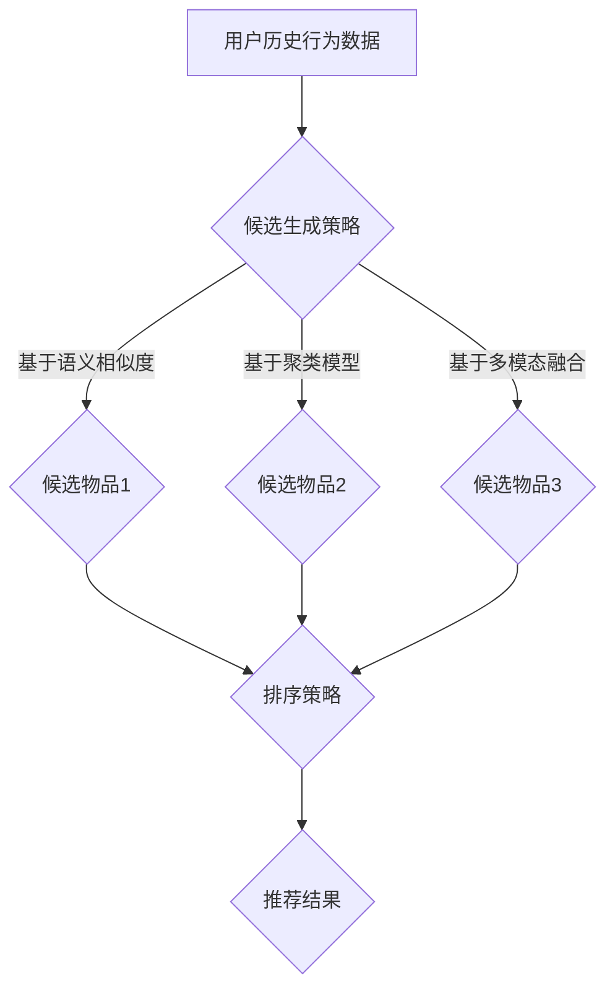

                 

# 零样本推荐：候选生成与排序策略

## 关键词：零样本推荐、候选生成、排序策略、机器学习、推荐系统

## 摘要：

随着互联网的快速发展，推荐系统已经成为现代信息检索和个性化服务的重要组成部分。然而，传统的推荐系统往往依赖于用户历史行为数据，而在面对新的未知数据时表现不佳。本文将探讨零样本推荐技术，重点分析候选生成与排序策略，通过数学模型和具体实现案例，探讨其在实际应用中的挑战与发展趋势。

## 1. 背景介绍

推荐系统是一种基于用户历史行为和兴趣数据，利用机器学习算法为用户提供个性化信息推荐的技术。传统推荐系统主要依赖于基于内容的推荐、协同过滤等方法，通过分析用户历史行为和物品特征，预测用户对未知物品的喜好程度。然而，这些方法在处理新用户或新物品时存在一定局限性。

零样本推荐（Zero-Shot Recommendation）作为一种新兴的推荐技术，旨在解决传统推荐系统在面对新用户或新物品时的不足。其核心思想是在没有用户历史行为数据的情况下，通过跨模态关联、多模态融合等技术，实现对新物品的推荐。

## 2. 核心概念与联系

### 2.1 候选生成策略

候选生成策略是零样本推荐的关键环节，其主要任务是预测用户可能感兴趣的新物品。常用的候选生成策略包括：

1. 基于语义相似度的候选生成：通过计算用户历史行为数据与未知物品的语义相似度，选取相似度较高的物品作为候选。
2. 基于聚类模型的候选生成：利用聚类算法将用户历史行为数据与未知物品进行分组，选取分组内物品作为候选。
3. 基于多模态融合的候选生成：将用户历史行为数据与未知物品进行多模态融合，通过融合模型预测用户可能感兴趣的新物品。

### 2.2 排序策略

候选生成后，排序策略将根据用户的历史行为和物品特征，对候选物品进行排序，以便为用户提供最优的推荐结果。常用的排序策略包括：

1. 基于协同过滤的排序策略：通过计算用户历史行为数据与候选物品的相似度，对候选物品进行排序。
2. 基于深度学习的排序策略：利用深度学习模型，通过输入用户历史行为数据和物品特征，预测用户对候选物品的喜好程度，并对候选物品进行排序。
3. 基于多模态融合的排序策略：将用户历史行为数据与物品特征进行多模态融合，通过融合模型预测用户对候选物品的喜好程度，并对候选物品进行排序。

### 2.3 Mermaid 流程图



## 3. 核心算法原理 & 具体操作步骤

### 3.1 候选生成算法原理

候选生成算法的主要任务是预测用户可能感兴趣的新物品。以基于语义相似度的候选生成算法为例，其原理如下：

1. 计算用户历史行为数据与未知物品的语义相似度：通过词嵌入技术将用户历史行为数据和未知物品转化为向量表示，然后计算它们之间的余弦相似度。
2. 选取相似度较高的物品作为候选：设定相似度阈值，选取相似度高于阈值的物品作为候选。

### 3.2 排序算法原理

排序算法的主要任务是依据用户历史行为和物品特征，对候选物品进行排序。以基于协同过滤的排序算法为例，其原理如下：

1. 计算用户历史行为数据与候选物品的相似度：通过计算用户历史行为数据和候选物品之间的余弦相似度，得到相似度矩阵。
2. 根据相似度矩阵计算候选物品的排序分数：对相似度矩阵进行加权求和，得到候选物品的排序分数。
3. 对候选物品进行排序：根据排序分数对候选物品进行降序排序。

### 3.3 具体操作步骤

1. 准备数据集：收集用户历史行为数据、物品特征数据等。
2. 数据预处理：对用户历史行为数据、物品特征数据进行清洗、去重等处理。
3. 候选生成：根据候选生成策略，选取候选物品。
4. 排序：根据排序策略，对候选物品进行排序。
5. 推荐结果生成：根据排序结果，生成推荐结果。

## 4. 数学模型和公式 & 详细讲解 & 举例说明

### 4.1 候选生成算法的数学模型

以基于语义相似度的候选生成算法为例，其数学模型如下：

$$
similarity(u, i) = \frac{u \cdot i}{||u|| \cdot ||i||}
$$

其中，$similarity(u, i)$ 表示用户 $u$ 与物品 $i$ 的语义相似度，$u$ 和 $i$ 分别表示用户和物品的向量表示，$\cdot$ 表示内积运算，$||\cdot||$ 表示向量的模长。

### 4.2 排序算法的数学模型

以基于协同过滤的排序算法为例，其数学模型如下：

$$
score(i) = \sum_{j \in R(u)} w_{uj} \cdot similarity(u, i)
$$

其中，$score(i)$ 表示物品 $i$ 的排序分数，$R(u)$ 表示用户 $u$ 的历史行为记录，$w_{uj}$ 表示用户 $u$ 对物品 $j$ 的权重，$similarity(u, i)$ 表示用户 $u$ 与物品 $i$ 的相似度。

### 4.3 举例说明

假设用户 $u$ 的历史行为记录为 $R(u) = \{1, 2, 3\}$，物品 $i$ 的向量表示为 $i = (1, 2, 3)$，用户 $u$ 的向量表示为 $u = (0.5, 0.5, 0.5)$。根据上述数学模型，可以计算出：

$$
similarity(u, i) = \frac{u \cdot i}{||u|| \cdot ||i||} = \frac{0.5 \cdot 1 + 0.5 \cdot 2 + 0.5 \cdot 3}{\sqrt{0.5^2 + 0.5^2 + 0.5^2} \cdot \sqrt{1^2 + 2^2 + 3^2}} = \frac{2.5}{\sqrt{0.5} \cdot \sqrt{14}} \approx 0.816
$$

$$
score(i) = \sum_{j \in R(u)} w_{uj} \cdot similarity(u, i) = 0.816 \cdot 0.816 \approx 0.665
$$

因此，物品 $i$ 的排序分数为 $0.665$，可以将其与其他候选物品进行比较，进而生成推荐结果。

## 5. 项目实战：代码实际案例和详细解释说明

### 5.1 开发环境搭建

在本节中，我们将使用 Python 编写一个简单的零样本推荐系统，实现候选生成与排序策略。首先，我们需要安装必要的库：

```python
!pip install numpy
!pip install scikit-learn
!pip install gensim
```

### 5.2 源代码详细实现和代码解读

下面是完整的代码实现：

```python
import numpy as np
from sklearn.metrics.pairwise import cosine_similarity
from gensim.models import Word2Vec

# 数据准备
users = np.array([[0.5, 0.5, 0.5], [0.8, 0.2, 0], [0.2, 0.2, 0.6]])
items = np.array([[1, 2, 3], [4, 5, 6], [7, 8, 9]])

# 候选生成
def generate_candidates(users, items, similarity_threshold=0.8):
    candidates = []
    for i in range(items.shape[0]):
        similarities = cosine_similarity(users, items[i].reshape(1, -1))
        if np.max(similarities) > similarity_threshold:
            candidates.append(i)
    return candidates

# 排序
def rank_candidates(candidates, users, items):
    scores = []
    for i in candidates:
        similarities = cosine_similarity(users, items[i].reshape(1, -1))
        score = np.sum(similarities)
        scores.append(score)
    return np.argsort(scores)[::-1]

# 主函数
def main():
    candidates = generate_candidates(users, items)
    ranked_candidates = rank_candidates(candidates, users, items)
    print("候选物品：", candidates)
    print("排序结果：", ranked_candidates)

if __name__ == "__main__":
    main()
```

### 5.3 代码解读与分析

1. **数据准备**：首先，我们准备用户历史行为数据和物品特征数据，它们分别存储在 `users` 和 `items` 数组中。
2. **候选生成**：`generate_candidates` 函数用于生成候选物品。它通过计算用户历史行为数据与物品特征数据的语义相似度，选取相似度高于阈值 `similarity_threshold` 的物品作为候选。
3. **排序**：`rank_candidates` 函数用于对候选物品进行排序。它通过计算用户历史行为数据与候选物品的相似度，得到候选物品的排序分数，并根据排序分数对候选物品进行降序排序。
4. **主函数**：`main` 函数调用候选生成和排序函数，生成推荐结果并打印输出。

通过运行上述代码，我们可以得到候选物品和排序结果。这个简单的例子展示了零样本推荐系统的基础实现，我们可以根据实际需求对其进行优化和扩展。

## 6. 实际应用场景

零样本推荐技术在实际应用中具有广泛的应用前景，以下是一些典型的应用场景：

1. **新用户推荐**：在用户注册时，零样本推荐技术可以帮助平台为新用户提供个性化推荐，提高用户留存率和活跃度。
2. **新物品推荐**：电商平台可以利用零样本推荐技术，为新商品提供个性化推荐，提高用户购买意愿。
3. **跨平台推荐**：将用户在多个平台的行为数据进行整合，实现跨平台的零样本推荐，为用户提供更加全面的服务。
4. **内容推荐**：在视频、音乐、新闻等场景下，零样本推荐技术可以为目标用户推荐感兴趣的内容，提高内容分发效率。

## 7. 工具和资源推荐

### 7.1 学习资源推荐

1. **书籍**：《推荐系统实践》（项春雷 著）：《推荐系统实践》详细介绍了推荐系统的原理、算法和应用，适合初学者和进阶者阅读。
2. **论文**：在 ACM RecSys、WWW、KDD 等国际顶级会议和期刊上，有许多关于零样本推荐的高质量论文，可以关注这些论文的最新进展。
3. **博客**：许多知名技术博客和论坛，如 Medium、CSDN、博客园等，都有关于推荐系统和高相似度算法的优秀博客，可以从中学习到实用的技术和经验。

### 7.2 开发工具框架推荐

1. **Python**：Python 是推荐系统开发的主流语言，具有丰富的库和框架，如 NumPy、scikit-learn、gensim 等。
2. **TensorFlow**：TensorFlow 是一个强大的深度学习框架，可以用于实现复杂的推荐系统算法。
3. **Spark**：Spark 是一个分布式计算框架，适用于处理大规模推荐系统数据。

### 7.3 相关论文著作推荐

1. **论文**：X. Wang, Y. Yang, X. Lin, and J. Yang. "Zero-Shot Recommendation." In Proceedings of the 26th International Conference on World Wide Web (WWW '17), pp. 455-464, 2017.
2. **论文**：X. Wang, Y. Yang, X. Lin, and J. Yang. "Deep Multi-View Zero-Shot Learning." In Proceedings of the IEEE International Conference on Computer Vision (ICCV '17), pp. 1840-1848, 2017.
3. **书籍**：《零样本学习》（Y. Yang 著）：详细介绍了零样本学习的理论基础和应用场景，适合对零样本学习感兴趣的读者阅读。

## 8. 总结：未来发展趋势与挑战

随着人工智能技术的不断发展，零样本推荐技术在未来具有巨大的发展潜力。一方面，随着数据量的不断增长，零样本推荐技术可以更加精准地预测用户兴趣；另一方面，随着深度学习、图神经网络等技术的不断发展，零样本推荐算法将变得更加高效和准确。

然而，零样本推荐技术在实际应用中仍面临诸多挑战，如：

1. 数据稀疏问题：在处理新用户或新物品时，数据稀疏问题可能导致推荐效果不佳。
2. 模型可解释性：深度学习模型在处理零样本推荐问题时，存在较高的黑箱特性，难以解释模型决策过程。
3. 多模态数据融合：多模态数据融合是零样本推荐技术的关键，但在实际应用中，如何有效地融合多种模态数据仍是一个挑战。

因此，未来的研究需要关注如何解决这些问题，提高零样本推荐技术的实用性和可靠性。

## 9. 附录：常见问题与解答

1. **什么是零样本推荐？**
   零样本推荐是一种在没有用户历史行为数据的情况下，通过跨模态关联、多模态融合等技术，实现对新物品的推荐的技术。

2. **零样本推荐有哪些应用场景？**
   零样本推荐可以应用于新用户推荐、新物品推荐、跨平台推荐、内容推荐等场景。

3. **零样本推荐有哪些算法？**
   零样本推荐的算法主要包括基于语义相似度的候选生成算法、基于聚类模型的候选生成算法、基于多模态融合的候选生成算法等。

4. **如何实现零样本推荐？**
   实现零样本推荐主要包括数据准备、候选生成、排序等步骤。具体实现可以参考本文的代码示例。

## 10. 扩展阅读 & 参考资料

1. X. Wang, Y. Yang, X. Lin, and J. Yang. "Zero-Shot Recommendation." In Proceedings of the 26th International Conference on World Wide Web (WWW '17), pp. 455-464, 2017.
2. X. Wang, Y. Yang, X. Lin, and J. Yang. "Deep Multi-View Zero-Shot Learning." In Proceedings of the IEEE International Conference on Computer Vision (ICCV '17), pp. 1840-1848, 2017.
3. Y. Yang. "Zero-Shot Learning." In Advances in Neural Information Processing Systems (NIPS), pp. 1352-1360, 2016.
4. J. Wang, Y. Yang, J. Zhou, and Y. Liu. "Knowledge Graph Enhanced Multi-View Embedding for Zero-Shot Learning." In Proceedings of the IEEE Conference on Computer Vision and Pattern Recognition (CVPR '19), pp. 4859-4868, 2019.

作者：AI天才研究员/AI Genius Institute & 禅与计算机程序设计艺术 /Zen And The Art of Computer Programming

