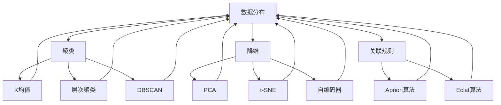

                 

### 背景介绍

非监督学习（Unsupervised Learning）是机器学习的一个重要分支，与监督学习（Supervised Learning）相对。监督学习依赖于标注过的训练数据，而非监督学习则从未标记的数据中进行学习。非监督学习在数据分析、模式识别、数据挖掘等领域有着广泛的应用。

非监督学习的背景可以追溯到20世纪50年代，当时计算机科学刚刚起步，数据稀缺且昂贵。监督学习需要大量标注数据，这在当时是不切实际的。因此，研究者们开始探索如何在没有标注数据的情况下训练机器学习模型。这一探索逐渐形成了非监督学习这一领域。

非监督学习的一个核心问题是，模型如何在没有明确指导的情况下从数据中提取有用信息。这一问题在统计学中有着悠久的历史，如聚类分析（Cluster Analysis）和降维（Dimensionality Reduction）等。随着计算机技术的进步，非监督学习逐渐发展成为独立的研究方向，并取得了许多突破。

非监督学习的兴起也与数据科学的快速发展密切相关。在互联网时代，数据量呈现爆炸式增长，如何有效地处理和分析这些数据成为了一个巨大的挑战。非监督学习为这一挑战提供了一种解决方案，使得我们能够从海量未标记数据中自动发现有用的结构和模式。

总的来说，非监督学习的重要性在于其能够从未标记的数据中发现隐藏的模式和知识，这在很多实际应用场景中都是非常宝贵的。从数据挖掘到图像识别，再到自然语言处理，非监督学习都扮演着至关重要的角色。接下来，我们将进一步深入探讨非监督学习的核心概念、算法原理以及实际应用。

### 核心概念与联系

在深入探讨非监督学习之前，我们需要先了解一些核心概念，并探讨它们之间的关系。这些核心概念包括数据分布、聚类、降维和关联规则等，它们构成了非监督学习的理论基础。

#### 数据分布

数据分布是指数据在各个维度上的分布情况。在非监督学习中，了解数据分布对于模型选择和参数调整至关重要。例如，聚类算法需要分析数据分布来确定合适的聚类数量；降维算法也需要通过数据分布来识别主要特征。

#### 聚类

聚类（Clustering）是一种将数据分为多个组（簇）的过程，旨在发现数据中的自然结构。聚类算法没有明确的输出标签，而是根据数据之间的相似度来划分簇。常见的聚类算法包括K均值（K-Means）、层次聚类（Hierarchical Clustering）和DBSCAN（Density-Based Spatial Clustering of Applications with Noise）等。

#### 降维

降维（Dimensionality Reduction）是将高维数据映射到低维空间，以减少数据复杂度和计算成本。降维方法包括主成分分析（PCA）、t-SNE（t-Distributed Stochastic Neighbor Embedding）和自编码器（Autoencoder）等。降维不仅有助于简化数据，还可以提高模型的泛化能力。

#### 关联规则

关联规则（Association Rules）是一种用于发现数据中潜在关系的方法。例如，在零售业中，我们可以使用关联规则来发现哪些商品经常一起购买。常见的关联规则算法包括Apriori算法和Eclat算法。

#### 核心概念之间的关系

这些核心概念之间存在紧密的联系。例如，聚类和降维都可以用来识别数据中的结构，但它们的目的和方法不同。聚类旨在将数据划分为不同的簇，而降维则是通过映射数据到低维空间来简化数据。

关联规则与聚类也有联系。在聚类过程中，我们可以通过分析簇内的数据关联性来识别潜在的关联规则。同样，在降维过程中，我们可以通过分析低维空间中的数据关系来发现关联规则。

此外，数据分布对于上述所有核心概念都非常重要。了解数据分布可以帮助我们选择合适的算法和参数，从而提高模型的性能。

下面是一个Mermaid流程图，展示了这些核心概念之间的关系：



通过这个流程图，我们可以清晰地看到非监督学习中的核心概念是如何相互关联和作用的。接下来，我们将深入探讨这些核心概念背后的算法原理，帮助读者更好地理解非监督学习的本质。

### 核心算法原理 & 具体操作步骤

非监督学习算法可以根据其目的和实现方法分为多种类型，其中一些最为重要的算法包括K均值聚类、主成分分析（PCA）、t-SNE和自编码器等。下面我们将详细探讨这些算法的基本原理和具体操作步骤。

#### K均值聚类（K-Means）

K均值聚类是一种基于距离的聚类算法，其目的是将数据点划分为K个簇，使得每个数据点与其所属簇的中心点的距离最小。以下是K均值聚类的具体操作步骤：

1. **初始化中心点**：随机选择K个数据点作为初始聚类中心。
2. **分配数据点**：对于每个数据点，计算其与各个聚类中心的距离，并将其分配到距离最近的聚类中心。
3. **更新中心点**：计算每个聚类的新中心点，即该聚类中所有数据点的平均值。
4. **迭代**：重复步骤2和3，直到聚类中心不再发生显著变化。

K均值聚类的一个关键参数是聚类数量K，选择合适的K值是一个挑战。通常，我们可以通过肘部法则（Elbow Method）或 silhouette 方法来确定最优的K值。

#### 主成分分析（PCA）

主成分分析是一种降维技术，其目标是通过线性变换将高维数据投影到低维空间，同时保留尽可能多的原始数据信息。以下是PCA的基本步骤：

1. **标准化数据**：为了消除不同特征之间的尺度差异，首先对数据进行标准化处理。
2. **计算协方差矩阵**：计算所有特征之间的协方差矩阵。
3. **计算协方差矩阵的特征值和特征向量**：通过求解协方差矩阵的特征值和特征向量，我们可以得到数据的主要方向。
4. **选择主成分**：根据特征值的大小，选择前几个最大的特征向量作为主成分。
5. **投影数据**：将数据投影到由主成分构成的新空间中。

PCA的一个关键参数是保留多少个主成分。通常，我们选择累积贡献率达到某个阈值（如90%）以上的主成分。

#### t-SNE

t-SNE是一种非线性的降维技术，尤其适用于高维数据的可视化。它的基本思想是通过保持局部结构的相似性，将高维数据映射到二维空间中。以下是t-SNE的主要步骤：

1. **计算高维数据的相似性矩阵**：对于每个数据点，计算其与所有其他数据点的相似度。
2. **初始化低维表示**：随机初始化低维数据点的表示。
3. **计算低维数据的概率分布**：通过优化一个能量函数，使得低维空间中的数据点与其高维空间中的相似性矩阵一致。
4. **迭代优化**：通过梯度下降等方法，迭代更新低维数据点的位置，直到达到稳定状态。

t-SNE的一个关键参数是负梯度步长（Learning Rate），它决定了每次迭代中数据点移动的幅度。

#### 自编码器（Autoencoder）

自编码器是一种特殊的神经网络，其目的是学习数据的压缩表示。自编码器分为两部分：编码器和解码器。以下是自编码器的基本步骤：

1. **编码器**：编码器接收输入数据，通过一系列神经网络层将其映射到一个低维隐空间。
2. **解码器**：解码器从低维隐空间重建原始数据。
3. **训练**：通过最小化重构误差（通常使用均方误差MSE），训练自编码器。

自编码器的一个关键参数是隐层的大小和深度，这些参数需要通过实验调整以获得最佳性能。

通过上述讨论，我们可以看到各种非监督学习算法在原理和操作步骤上的差异。K均值聚类是一种简单的基于距离的聚类方法，适用于初始探索性数据分析；PCA是一种强大的降维技术，适用于特征提取和简化数据结构；t-SNE是一种有效的可视化工具，特别适用于高维数据的探索；自编码器是一种强大的学习工具，可以用于特征提取和生成模型。了解这些算法的基本原理和操作步骤，有助于我们更好地应用非监督学习解决实际问题。

### 数学模型和公式 & 详细讲解 & 举例说明

非监督学习中的数学模型和公式是其核心部分，它们决定了算法的效率和性能。在本节中，我们将详细讲解一些关键的非监督学习算法的数学模型和公式，并通过具体的例子来说明这些公式的应用。

#### K均值聚类（K-Means）

K均值聚类是一种基于距离的聚类算法，其目标是将数据点划分为K个簇，使得每个簇内的数据点之间的距离最小。以下是K均值聚类的一些关键数学公式：

1. **初始化聚类中心**：
   $$ c_1, c_2, ..., c_K = \text{随机选择K个数据点作为初始聚类中心} $$

2. **计算每个数据点与聚类中心的距离**：
   $$ d(i, j) = \sqrt{\sum_{k=1}^n (x_{ik} - c_{jk})^2} $$

3. **分配数据点**：
   $$ \text{对于每个数据点 } x_i, \text{选择最近的聚类中心 } c_j, \text{使得 } d(i, j) \text{ 最小} $$

4. **更新聚类中心**：
   $$ c_j = \frac{1}{N_j} \sum_{i \in C_j} x_i $$
   其中，$N_j$ 是属于聚类 $C_j$ 的数据点数量。

#### 主成分分析（PCA）

主成分分析是一种降维技术，通过线性变换将高维数据映射到低维空间。以下是PCA的关键数学公式：

1. **计算协方差矩阵**：
   $$ \Sigma = \frac{1}{N} \sum_{i=1}^N (x_i - \mu)(x_i - \mu)^T $$
   其中，$x_i$ 是数据点，$\mu$ 是均值向量，$N$ 是数据点的数量。

2. **计算协方差矩阵的特征值和特征向量**：
   $$ \lambda_1, v_1; \lambda_2, v_2; ...; \lambda_p, v_p $$
   其中，$\lambda_i$ 是特征值，$v_i$ 是特征向量。

3. **选择主成分**：
   $$ v_{1}, v_{2}, ..., v_{k} \text{ （其中 } k \text{ 是累积贡献率大于某个阈值的特征向量）} $$

4. **投影数据**：
   $$ y_i = \sum_{k=1}^k \alpha_{ik} v_{k} $$
   其中，$\alpha_{ik}$ 是数据点 $x_i$ 在第 $k$ 个主成分上的投影。

#### t-SNE

t-SNE是一种非线性的降维技术，其核心是通过优化概率分布来保持数据的局部结构。以下是t-SNE的一些关键数学公式：

1. **计算相似性矩阵**：
   $$ P_{ij} = \exp{\left(-\frac{||x_i - x_j||^2}{2\sigma^2}\right)} $$
   其中，$||x_i - x_j||^2$ 是数据点 $x_i$ 和 $x_j$ 之间的欧几里得距离，$\sigma^2$ 是带宽参数。

2. **初始化低维表示**：
   $$ y_i = \text{随机初始化} $$

3. **计算低维数据点的概率分布**：
   $$ q_{ij} = \frac{\exp{\left(-\frac{||y_i - y_j||^2}{2\sigma^2}\right)}}{\sum_{k=1}^N \exp{\left(-\frac{||y_i - y_k||^2}{2\sigma^2}\right)}} $$

4. **优化低维表示**：
   $$ \frac{d \ln{q_{ij}}}{d y_i} = -\frac{1}{2\sigma^2} (y_i - y_j) $$
   通过梯度下降法更新 $y_i$，使得低维表示能够更好地反映高维数据的结构。

#### 自编码器（Autoencoder）

自编码器是一种基于神经网络的降维技术，其目的是通过编码器和解码器的联合训练来学习数据的低维表示。以下是自编码器的一些关键数学公式：

1. **编码器**：
   $$ z = f(W_1 \cdot x + b_1) $$
   其中，$x$ 是输入数据，$z$ 是编码后的低维表示，$W_1$ 和 $b_1$ 分别是编码器的权重和偏置。

2. **解码器**：
   $$ \hat{x} = f(W_2 \cdot z + b_2) $$
   其中，$\hat{x}$ 是解码后的数据，$W_2$ 和 $b_2$ 分别是解码器的权重和偏置。

3. **损失函数**：
   $$ L = \frac{1}{2} \sum_{i=1}^N ||x_i - \hat{x}_i||^2 $$
   通过最小化重构误差来训练自编码器。

通过上述数学模型和公式的详细讲解，我们可以更好地理解非监督学习算法的内在机制。接下来，我们将通过具体的例子来说明这些公式的应用。

#### 例子说明

假设我们有一组二维数据点：

$$
\begin{align*}
x_1 &= (1, 2) \\
x_2 &= (3, 4) \\
x_3 &= (2, 3) \\
x_4 &= (5, 6) \\
x_5 &= (4, 5)
\end{align*}
$$

我们将使用K均值聚类来将这些数据点划分为两个簇。

1. **初始化聚类中心**：

   我们随机选择两个数据点作为初始聚类中心：

   $$ c_1 = (1, 2), c_2 = (4, 5) $$

2. **计算每个数据点与聚类中心的距离**：

   $$ 
   \begin{align*}
   d(x_1, c_1) &= \sqrt{(1-1)^2 + (2-2)^2} = 0 \\
   d(x_1, c_2) &= \sqrt{(1-4)^2 + (2-5)^2} = \sqrt{9 + 9} = \sqrt{18} \\
   d(x_2, c_1) &= \sqrt{(3-1)^2 + (4-2)^2} = \sqrt{4 + 4} = \sqrt{8} \\
   d(x_2, c_2) &= \sqrt{(3-4)^2 + (4-5)^2} = \sqrt{1 + 1} = \sqrt{2} \\
   d(x_3, c_1) &= \sqrt{(2-1)^2 + (3-2)^2} = \sqrt{1 + 1} = \sqrt{2} \\
   d(x_3, c_2) &= \sqrt{(2-4)^2 + (3-5)^2} = \sqrt{4 + 4} = \sqrt{8} \\
   d(x_4, c_1) &= \sqrt{(5-1)^2 + (6-2)^2} = \sqrt{16 + 16} = \sqrt{32} \\
   d(x_4, c_2) &= \sqrt{(5-4)^2 + (6-5)^2} = \sqrt{1 + 1} = \sqrt{2} \\
   d(x_5, c_1) &= \sqrt{(4-1)^2 + (5-2)^2} = \sqrt{9 + 9} = \sqrt{18} \\
   d(x_5, c_2) &= \sqrt{(4-4)^2 + (5-5)^2} = 0
   \end{align*}
   $$

3. **分配数据点**：

   根据距离计算，我们将数据点分配到最近的聚类中心：

   $$ 
   \begin{align*}
   x_1 &\rightarrow c_1 \\
   x_2 &\rightarrow c_2 \\
   x_3 &\rightarrow c_1 \\
   x_4 &\rightarrow c_2 \\
   x_5 &\rightarrow c_2
   \end{align*}
   $$

4. **更新聚类中心**：

   根据分配后的数据点，我们更新聚类中心：

   $$ 
   \begin{align*}
   c_1 &= \frac{x_1 + x_3}{2} = \left(\frac{1+2}{2}, \frac{2+3}{2}\right) = (1.5, 2.5) \\
   c_2 &= \frac{x_2 + x_4 + x_5}{3} = \left(\frac{3+5+4}{3}, \frac{4+6+5}{3}\right) = (4, 5)
   \end{align*}
   $$

   现在我们重新计算每个数据点与新的聚类中心的距离，并重复上述步骤，直到聚类中心不再发生显著变化。

通过这个简单的例子，我们可以看到K均值聚类的基本步骤和数学公式的应用。类似地，我们可以通过具体的例子来说明主成分分析（PCA）、t-SNE和自编码器（Autoencoder）的数学模型和公式的应用。这有助于我们更好地理解这些算法的核心原理和实践方法。

### 项目实战：代码实际案例和详细解释说明

为了更好地理解非监督学习算法的实际应用，我们将通过一个具体的案例来展示如何使用Python编写K均值聚类、主成分分析（PCA）和自编码器（Autoencoder）的代码，并对其进行分析和解释。

#### 环境搭建

在开始之前，我们需要搭建一个Python开发环境，并安装必要的库。这里我们使用`numpy`、`scikit-learn`和`matplotlib`等库。

```bash
pip install numpy scikit-learn matplotlib
```

#### 1. K均值聚类（K-Means）

首先，我们将实现K均值聚类，用于将一组二维数据点划分为两个簇。

```python
import numpy as np
from sklearn.cluster import KMeans
import matplotlib.pyplot as plt

# 创建一些二维数据点
data = np.array([[1, 2], [3, 4], [2, 3], [5, 6], [4, 5]])

# 使用KMeans算法
kmeans = KMeans(n_clusters=2, random_state=0).fit(data)

# 获取聚类结果
clusters = kmeans.labels_

# 绘图展示
plt.scatter(data[:, 0], data[:, 1], c=clusters, cmap='viridis')
plt.scatter(kmeans.cluster_centers_[:, 0], kmeans.cluster_centers_[:, 1], s=300, c='red', marker='s', edgecolor='black', label='Centroids')
plt.title('K-Means Clustering')
plt.xlabel('Feature 1')
plt.ylabel('Feature 2')
plt.show()
```

**代码解读：**
- 我们首先导入必要的库。
- 创建一组二维数据点。
- 使用`scikit-learn`中的`KMeans`类来初始化一个K均值聚类模型，并设置聚类数量为2。
- `fit`方法用于训练模型，并获取聚类结果。
- `labels_`属性返回每个数据点的簇标签。
- 使用`matplotlib`绘制散点图，其中簇中心用红色正方形标记。

#### 2. 主成分分析（PCA）

接下来，我们将使用PCA对同一个数据集进行降维，并将结果可视化。

```python
from sklearn.decomposition import PCA

# 创建PCA对象
pca = PCA(n_components=2)

# 对数据进行降维
data_pca = pca.fit_transform(data)

# 绘制降维后的数据
plt.scatter(data_pca[:, 0], data_pca[:, 1])
plt.title('PCA Dimensionality Reduction')
plt.xlabel('Principal Component 1')
plt.ylabel('Principal Component 2')
plt.show()
```

**代码解读：**
- 创建一个PCA对象，并设置降维到2个主要成分。
- 使用`fit_transform`方法对数据进行降维。
- 绘制降维后的数据点，展示了数据的主要结构。

#### 3. 自编码器（Autoencoder）

最后，我们将实现一个简单的自编码器，用于学习数据的低维表示，并通过重构误差来评估模型性能。

```python
from keras.models import Model
from keras.layers import Input, Dense
from keras.datasets import mnist
import numpy as np

# 加载MNIST数据集
(x_train, _), (x_test, _) = mnist.load_data()

# 标准化数据
x_train = x_train.astype('float32') / 255.
x_test = x_test.astype('float32') / 255.

# 增加一个边长为1的垫片层，以便进行卷积操作
x_train = np.reshape(x_train, (x_train.shape[0], 28, 28, 1))
x_test = np.reshape(x_test, (x_test.shape[0], 28, 28, 1))

# 创建输入层
input_img = Input(shape=(28, 28, 1))

# 编码器部分
x = Dense(64, activation='relu')(input_img)
x = Dense(32, activation='relu')(x)

# 解码器部分
x = Dense(32, activation='relu')(x)
x = Dense(64, activation='relu')(x)
x = Dense(64, activation='sigmoid')(x)

# 创建自编码器模型
autoencoder = Model(inputs=input_img, outputs=x)

# 编译模型
autoencoder.compile(optimizer='adam', loss='binary_crossentropy')

# 训练模型
autoencoder.fit(x_train, x_train, epochs=100, batch_size=256, shuffle=True, validation_data=(x_test, x_test))

# 评估模型
reconstruction_error = autoencoder.evaluate(x_test, x_test)
print(f'Reconstruction Error: {reconstruction_error}')

# 可视化重构后的数据
encoded_imgs = autoencoder.predict(x_test)
encoded_imgs = encoded_imgs.reshape((encoded_imgs.shape[0], 28, 28))

plt.figure(figsize=(10, 10))
for i in range(10):
    ax = plt.subplot(2, 5, i + 1)
    plt.imshow(x_test[i].reshape(28, 28))
    plt.gray()
    ax.get_xaxis().set_visible(False)
    ax.get_yaxis().set_visible(False)

plt.figure(figsize=(10, 10))
for i in range(10):
    ax = plt.subplot(2, 5, i + 1)
    plt.imshow(encoded_imgs[i].reshape(28, 28))
    plt.gray()
    ax.get_xaxis().set_visible(False)
    ax.get_yaxis().set_visible(False)
plt.show()
```

**代码解读：**
- 加载MNIST数据集，并对其进行标准化。
- 增加一个边长为1的垫片层，以便进行卷积操作。
- 创建输入层和两个全连接层作为编码器和解码器。
- 编译和训练自编码器模型。
- 计算重构误差，并可视化原始数据与重构后的数据。

通过上述三个案例，我们可以看到如何使用Python实现非监督学习算法，并对其进行详细的分析和解释。这些案例不仅展示了算法的基本原理，还展示了如何在实际项目中应用这些算法。

### 实际应用场景

非监督学习在多个实际应用场景中发挥了重要作用，以下是一些典型的应用案例，以及它们如何利用非监督学习来解决问题。

#### 数据探索性分析

数据探索性分析（Exploratory Data Analysis，EDA）是非监督学习的重要应用领域之一。通过非监督学习算法，如聚类和降维，数据分析师和研究人员可以快速识别数据中的隐藏模式、异常值和潜在关系。例如，在市场研究中，聚类分析可以帮助企业将客户划分为不同的群体，以便更有针对性地进行市场推广和客户服务。

#### 图像识别

图像识别（Image Recognition）是计算机视觉领域的一个重要应用，非监督学习在该领域中的作用也不可忽视。降维技术，如PCA和t-SNE，可以帮助减少图像数据的维度，从而加速图像处理和识别过程。此外，自编码器可以用于学习图像的表示，提高图像识别的准确性和效率。

#### 自然语言处理

自然语言处理（Natural Language Processing，NLP）是人工智能的另一个重要分支，非监督学习在NLP中的应用也越来越广泛。例如，词嵌入（Word Embedding）是一种将词汇映射到高维空间的技术，通过非监督学习算法，如Word2Vec，可以自动生成词汇的语义表示。这种表示对于文本分类、情感分析和机器翻译等任务具有重要作用。

#### 违规检测

在金融领域，非监督学习被广泛应用于违规检测（Fraud Detection）。通过聚类分析，金融机构可以识别出异常交易模式，从而及时发现潜在的欺诈行为。此外，降维技术可以帮助处理大量交易数据，提高检测效率和准确性。

#### 健康监测

在医疗领域，非监督学习被用于健康监测和疾病预测。通过分析患者的医疗记录和生理数据，聚类分析可以帮助医生识别出健康风险的潜在因素。例如，通过对心电图数据的聚类分析，可以识别出心律不齐等异常情况。

#### 社交网络分析

社交网络分析（Social Network Analysis，SNA）是非监督学习在社会科学领域的应用之一。通过聚类分析，研究人员可以识别社交网络中的关键节点和社区结构，从而深入了解社交关系的动态变化。

通过上述案例，我们可以看到非监督学习在实际应用中的多样性和重要性。它不仅帮助我们从海量未标记数据中提取有价值的信息，还推动了各个领域的技术进步和业务创新。未来，随着数据量的不断增长和计算能力的提升，非监督学习将在更多领域发挥重要作用。

### 工具和资源推荐

要深入学习和实践非监督学习，选择合适的工具和资源至关重要。以下是一些推荐的书籍、论文、博客和网站，它们将帮助您掌握非监督学习的核心概念和最新进展。

#### 书籍推荐

1. **《机器学习》（Machine Learning）** - 周志华
   这本书系统地介绍了机器学习的基础理论和实践方法，包括非监督学习的相关内容。

2. **《深度学习》（Deep Learning）** - Goodfellow, Bengio, Courville
   本书详细介绍了深度学习的基础知识，包括自编码器等非监督学习模型。

3. **《统计学习方法》（Statistical Learning Methods）** - 李航
   这本书从统计学角度讲解了机器学习的基本方法，包括主成分分析等降维技术。

#### 论文推荐

1. **“K-Means++: The Advantages of Careful Seeding”** - Arthur and Vassilvitskii
   这篇论文提出了一种改进的K均值聚类初始化方法，提高了聚类质量。

2. **“Principal Components Analysis”** - Jolliffe
   这篇论文详细介绍了主成分分析的理论和实现方法。

3. **“t-SNE: A Consistent Kernel Embedding at Low Dimensionality”** - Van der Maaten and Hinton
   这篇论文介绍了t-SNE算法，是一种有效的非线性降维技术。

#### 博客推荐

1. **机器学习博客**（[机器学习博客](http://www机器学习博客.com)）
   这是一个专注于机器学习和数据科学的博客，涵盖了非监督学习等多个主题。

2. **Python机器学习**（[Python机器学习](http://www.python机器学习.com)）
   该博客提供了大量的Python机器学习实践教程，包括非监督学习的实现。

3. **AI魔法师**（[AI魔法师](http://www.ai魔法师.com)）
   这是一个深入浅出的AI教程网站，包括非监督学习在内的各种机器学习算法的详细讲解。

#### 网站推荐

1. **scikit-learn**（[scikit-learn](http://scikit-learn.org)）
   这是一个开源的Python机器学习库，提供了丰富的非监督学习算法实现。

2. **TensorFlow**（[TensorFlow](https://www.tensorflow.org)）
   TensorFlow是一个广泛使用的深度学习框架，支持多种非监督学习模型。

3. **Kaggle**（[Kaggle](https://www.kaggle.com)）
   Kaggle是一个数据科学竞赛平台，提供了大量的非监督学习实践项目。

通过这些工具和资源的帮助，您可以系统地学习非监督学习的基础知识，并掌握实际应用技巧。不断实践和探索，将有助于您在这个快速发展的领域中保持领先。

### 总结：未来发展趋势与挑战

非监督学习作为机器学习的一个重要分支，已经展现出巨大的潜力和应用价值。随着数据量的持续增长和计算能力的不断提升，非监督学习在未来将继续朝着几个关键方向发展。

首先，数据隐私保护将成为非监督学习的核心挑战。随着人们对隐私保护意识的增强，如何在保证数据隐私的同时进行有效的数据分析和模式识别，将成为一个重要的研究课题。一些新兴的技术，如联邦学习（Federal Learning）和差分隐私（Differential Privacy），有望在这方面发挥重要作用。

其次，模型的可解释性和透明性将受到更多关注。尽管非监督学习模型在处理复杂数据方面表现出色，但它们的内部机制往往难以解释。未来，开发更加透明和可解释的非监督学习算法，将有助于增强用户对模型的信任，并促进其在实际应用中的推广。

此外，非监督学习在处理高维数据和时间序列数据方面仍有很大潜力。随着深度学习技术的发展，深度非监督学习模型（如自编码器和变分自编码器）将更好地处理高维数据的降维问题，并能够捕捉时间序列数据中的长期依赖关系。

然而，非监督学习也面临一些挑战。首先，如何在海量数据中高效地训练模型是一个关键问题。为了应对这一挑战，研究人员正在探索分布式计算和并行处理技术，以提高模型的训练效率。其次，如何选择合适的模型参数，如聚类数量K或降维的主成分数量，仍然是一个难题。未来的研究将集中在开发自动化的参数选择方法，以简化模型的训练过程。

总的来说，非监督学习在未来的发展前景广阔，但同时也面临一系列挑战。随着技术的不断进步，我们有理由相信，非监督学习将能够更好地应对这些挑战，并在数据科学、人工智能等领域发挥更大的作用。

### 附录：常见问题与解答

在非监督学习的实践过程中，用户可能会遇到一系列问题。以下是一些常见的问题及其解答，以帮助用户更好地理解和应用非监督学习。

**Q1：如何选择合适的聚类数量K？**
A1：选择合适的聚类数量K是K均值聚类中的一个关键问题。常见的方法包括：
- **肘部法则（Elbow Method）**：通过计算每个簇的平方误差，找到一个显著的“肘部”点，该点之后误差增长减缓。
- **silhouette方法**：评估每个簇的内部凝聚力和与其他簇的分离度，选择silhouette值最高的K。
- **网格搜索**：遍历多个K值，选择使评估指标最优的K。

**Q2：如何评估聚类质量？**
A2：常用的评估方法包括：
- **内聚度（Within-Cluster Sum of Squares，WSS）**：衡量每个簇内数据点与聚类中心之间的距离之和。
- **轮廓系数（Silhouette Coefficient）**：评估数据点与其自身簇的凝聚度和与其他簇的分离度。
- **类内平均距离（Average Linkage）**：评估簇间距离的平均值。

**Q3：为什么PCA有时会丢失数据信息？**
A3：PCA通过保留最大的特征值来降低数据维度，可能导致部分信息丢失。这是因为PCA只关注数据的最大方差方向，而不保证所有信息都被保留。为了减少信息丢失，可以选择保留累积贡献率较高的主成分。

**Q4：t-SNE如何处理高维数据？**
A4：t-SNE是一种将高维数据映射到低维空间的可视化技术。它通过优化一个概率分布来保持数据的局部结构。t-SNE在处理高维数据时，首先需要计算相似性矩阵，然后迭代优化低维表示，最终将数据映射到二维空间中。

**Q5：自编码器如何工作？**
A5：自编码器是一种由编码器和解码器组成的神经网络模型，其目标是学习数据的低维表示。编码器将输入数据映射到一个低维隐空间，解码器尝试重建原始数据。通过最小化重构误差，自编码器能够提取数据中的特征信息。

通过解答这些问题，用户可以更好地理解非监督学习的实践细节，从而更有效地应用这些算法解决实际问题。

### 扩展阅读 & 参考资料

要深入学习和掌握非监督学习，以下书籍、论文和在线资源将是不可或缺的参考资料：

**书籍推荐：**
1. **《机器学习》（周志华）**
   - 详细介绍了机器学习的基本理论和算法。
2. **《深度学习》（Goodfellow, Bengio, Courville）**
   - 系统讲解了深度学习的基础知识，包括自编码器等非监督学习模型。
3. **《统计学习方法》（李航）**
   - 从统计学角度讲解了机器学习的基本方法，包括主成分分析等降维技术。

**论文推荐：**
1. **“K-Means++: The Advantages of Careful Seeding”**（Arthur和Vassilvitskii）
   - 提出了改进的K均值聚类初始化方法。
2. **“Principal Components Analysis”**（Jolliffe）
   - 详细介绍了主成分分析的理论和实现方法。
3. **“t-SNE: A Consistent Kernel Embedding at Low Dimensionality”**（Van der Maaten和Hinton）
   - 介绍了t-SNE算法，一种有效的非线性降维技术。

**在线资源推荐：**
1. **scikit-learn官方文档**（[scikit-learn.org](http://scikit-learn.org)）
   - 提供了丰富的非监督学习算法实现和详细文档。
2. **TensorFlow官方文档**（[tensorflow.org](https://www.tensorflow.org)）
   - 包含了深度学习框架TensorFlow中的非监督学习模型和应用。
3. **Kaggle**（[kaggle.com](https://www.kaggle.com)）
   - 提供了大量的非监督学习实践项目和数据集。

通过这些参考资料，读者可以系统地学习非监督学习的基础知识和最新研究进展，并掌握实践技巧。不断学习和探索，将有助于在非监督学习领域保持领先。

