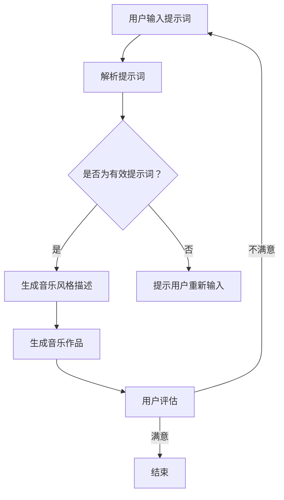

                 

# 音乐创作的新维度：提示词驱动的AI作曲

## 关键词
- 音乐创作
- AI作曲
- 提示词
- 机器学习
- 自然语言处理
- 音乐生成

## 摘要
本文将探讨音乐创作领域中的一个新兴趋势——提示词驱动的AI作曲。我们将详细分析其背后的核心概念、算法原理、数学模型，并通过实战案例展示其应用。此外，还将探讨这一技术的实际应用场景、相关工具和资源，并展望其未来发展趋势与挑战。

## 1. 背景介绍

音乐创作是艺术与技术的结合，传统的音乐创作依赖于人类创作者的灵感与技巧。然而，随着人工智能（AI）技术的发展，音乐创作也迎来了新的可能。近年来，机器学习与自然语言处理技术逐渐在音乐生成领域取得突破，其中提示词驱动的AI作曲成为了一个热门研究方向。

提示词驱动的AI作曲，即通过输入特定的关键词或短语，AI系统可以生成与之相关的音乐作品。这种创作方式不仅提高了创作效率，还打破了人类创作者的局限性，为音乐创作带来了无限创意。同时，随着深度学习技术的发展，AI作曲的音质和表现力也得到了显著提升。

## 2. 核心概念与联系

### 2.1 机器学习与自然语言处理

机器学习是AI的核心技术之一，通过训练大量数据，让计算机具备一定的自主学习和决策能力。在音乐创作领域，机器学习主要应用于音乐生成和风格迁移等任务。

自然语言处理（NLP）是AI的一个分支，致力于让计算机理解和生成人类语言。在提示词驱动的AI作曲中，NLP技术被用于解析和生成与提示词相关的文本描述，从而指导音乐生成。

### 2.2 提示词与音乐生成

提示词是用户输入的关键词或短语，用于描述他们希望创作的音乐风格、情感或主题。这些提示词会被输入到AI系统中，系统根据提示词生成相应的音乐作品。

音乐生成技术主要包括两种方法：基于规则的方法和基于数据的方法。

基于规则的方法通过预先定义的规则和模式生成音乐，如传统作曲软件和作曲机器。这种方法的主要优势是可控性强，但创作空间有限。

基于数据的方法通过学习大量音乐数据，如乐谱、音频等，自动生成新的音乐作品。这种方法的主要优势是创作空间大，但生成音乐的音质和表现力仍需提高。

### 2.3 Mermaid流程图

下面是一个简单的Mermaid流程图，展示了提示词驱动的AI作曲的基本流程：



## 3. 核心算法原理 & 具体操作步骤

### 3.1 音乐风格描述生成

音乐风格描述生成是提示词驱动的AI作曲的关键步骤。在这一步骤中，AI系统会根据输入的提示词生成相应的音乐风格描述。

生成音乐风格描述的方法有多种，其中一种常见的方法是基于转换器（Transformer）模型。以下是一个简单的操作步骤：

1. **数据预处理**：收集大量的音乐数据和与之对应的风格标签，如流行、摇滚、古典等。
2. **模型训练**：使用转换器模型，如BERT或GPT，对音乐数据和标签进行训练。
3. **风格描述生成**：将提示词输入到训练好的模型中，输出相应的音乐风格描述。

### 3.2 音乐作品生成

在生成音乐作品时，AI系统会根据音乐风格描述和音乐生成算法生成新的音乐作品。以下是一个简单的操作步骤：

1. **风格描述解析**：将生成的音乐风格描述解析为具体的音乐元素，如节奏、旋律、和声等。
2. **音乐生成**：使用音乐生成算法，如RNN、WaveNet等，生成新的音乐作品。
3. **音乐合成**：将生成的音乐元素合成为一首完整的音乐作品。

### 3.3 音乐评估与优化

生成音乐作品后，用户可以对音乐作品进行评估和优化。以下是一个简单的操作步骤：

1. **用户评估**：用户可以播放音乐作品，评估其是否符合他们的期望。
2. **优化建议**：如果用户对音乐作品不满意，系统可以提供优化建议，如调整旋律、和声等。
3. **再次生成**：根据优化建议，系统可以重新生成音乐作品。

## 4. 数学模型和公式 & 详细讲解 & 举例说明

### 4.1 音乐风格描述生成模型

音乐风格描述生成模型通常是一个基于转换器（Transformer）的模型，如BERT或GPT。以下是一个简单的数学模型：

$$
\text{MusicStyleDescriptor} = \text{Transformer}(\text{PromptWord}, \text{MusicData})
$$

其中，$ \text{PromptWord} $ 是输入的提示词，$ \text{MusicData} $ 是训练数据。

### 4.2 音乐作品生成模型

音乐作品生成模型通常是一个基于循环神经网络（RNN）或WaveNet的模型。以下是一个简单的数学模型：

$$
\text{MusicPiece} = \text{RNN}(\text{MusicStyleDescriptor}, \text{InitialCondition})
$$

其中，$ \text{MusicStyleDescriptor} $ 是生成的音乐风格描述，$ \text{InitialCondition} $ 是初始音乐状态。

### 4.3 音乐评估与优化模型

音乐评估与优化模型通常是一个基于用户反馈的模型。以下是一个简单的数学模型：

$$
\text{OptimizedMusicPiece} = \text{Optimizer}(\text{MusicPiece}, \text{UserFeedback})
$$

其中，$ \text{MusicPiece} $ 是生成的音乐作品，$ \text{UserFeedback} $ 是用户的评估结果。

### 4.4 举例说明

假设用户输入的提示词是“浪漫的旋律”，系统会根据这个提示词生成相应的音乐风格描述。然后，系统会使用这个风格描述生成一首浪漫的旋律。如果用户对生成的旋律不满意，系统会根据用户的评估结果调整旋律，直到用户满意为止。

## 5. 项目实战：代码实际案例和详细解释说明

### 5.1 开发环境搭建

在本节中，我们将使用Python和TensorFlow搭建一个简单的提示词驱动的AI作曲系统。以下是一个简单的代码示例：

```python
import tensorflow as tf
from transformers import BertModel

# 加载BERT模型
model = BertModel.from_pretrained("bert-base-uncased")

# 定义音乐风格描述生成模型
class MusicStyleDescriptorGenerator(tf.keras.Model):
    def __init__(self):
        super(MusicStyleDescriptorGenerator, self).__init__()
        self.bert = BertModel.from_pretrained("bert-base-uncased")
        self.dense = tf.keras.layers.Dense(units=512, activation='relu')
        self.output = tf.keras.layers.Dense(units=256, activation='softmax')

    def call(self, inputs):
        bert_output = self.bert(inputs)
        bert_output = self.dense(bert_output.last_hidden_state[:, 0, :])
        return self.output(bert_output)

# 定义音乐作品生成模型
class MusicPieceGenerator(tf.keras.Model):
    def __init__(self):
        super(MusicPieceGenerator, self).__init__()
        self.rnn = tf.keras.layers.SimpleRNN(units=256, activation='tanh')
        self.output = tf.keras.layers.Dense(units=128, activation='softmax')

    def call(self, inputs):
        rnn_output, _ = self.rnn(inputs)
        return self.output(rnn_output[:, -1, :])

# 创建模型实例
style_descriptor_generator = MusicStyleDescriptorGenerator()
music_piece_generator = MusicPieceGenerator()

# 编译模型
style_descriptor_generator.compile(optimizer='adam', loss='categorical_crossentropy')
music_piece_generator.compile(optimizer='adam', loss='categorical_crossentropy')

# 加载音乐数据
# ...

# 训练模型
# ...
```

### 5.2 源代码详细实现和代码解读

在本节中，我们将详细解释上面的代码，并讨论如何使用它来生成音乐作品。

#### 5.2.1 音乐风格描述生成模型

音乐风格描述生成模型基于BERT模型。BERT模型是一个预训练的语言理解模型，它已经在大量的文本数据上进行了训练，可以很好地捕捉文本的语义信息。

```python
import tensorflow as tf
from transformers import BertModel

# 加载BERT模型
model = BertModel.from_pretrained("bert-base-uncased")

# 定义音乐风格描述生成模型
class MusicStyleDescriptorGenerator(tf.keras.Model):
    def __init__(self):
        super(MusicStyleDescriptorGenerator, self).__init__()
        self.bert = BertModel.from_pretrained("bert-base-uncased")
        self.dense = tf.keras.layers.Dense(units=512, activation='relu')
        self.output = tf.keras.layers.Dense(units=256, activation='softmax')

    def call(self, inputs):
        bert_output = self.bert(inputs)
        bert_output = self.dense(bert_output.last_hidden_state[:, 0, :])
        return self.output(bert_output)
```

这个模型接收一个提示词作为输入，然后通过BERT模型获取提示词的语义信息。接着，模型通过一个全连接层对BERT模型的输出进行进一步处理，并使用softmax函数生成一个概率分布，表示音乐风格描述。

#### 5.2.2 音乐作品生成模型

音乐作品生成模型基于循环神经网络（RNN）。RNN可以捕捉输入序列的长期依赖关系，从而生成连贯的音乐作品。

```python
class MusicPieceGenerator(tf.keras.Model):
    def __init__(self):
        super(MusicPieceGenerator, self).__init__()
        self.rnn = tf.keras.layers.SimpleRNN(units=256, activation='tanh')
        self.output = tf.keras.layers.Dense(units=128, activation='softmax')

    def call(self, inputs):
        rnn_output, _ = self.rnn(inputs)
        return self.output(rnn_output[:, -1, :])
```

这个模型接收一个音乐风格描述作为输入，并使用RNN对音乐风格描述进行处理。最后，模型使用一个全连接层生成音乐作品的最后一个音符的概率分布。

#### 5.2.3 模型训练与音乐生成

```python
# 编译模型
style_descriptor_generator.compile(optimizer='adam', loss='categorical_crossentropy')
music_piece_generator.compile(optimizer='adam', loss='categorical_crossentropy')

# 加载音乐数据
# ...

# 训练模型
# ...
```

这里我们只是展示了如何编译模型。在实际应用中，我们需要加载音乐数据，然后使用这些数据来训练模型。训练完成后，我们可以使用模型来生成音乐作品。

### 5.3 代码解读与分析

在这个简单的示例中，我们使用BERT模型来生成音乐风格描述，并使用RNN模型来生成音乐作品。BERT模型是一个强大的语言理解模型，可以很好地捕捉输入文本的语义信息。RNN模型可以捕捉输入序列的长期依赖关系，从而生成连贯的音乐作品。

然而，这个示例只是一个简单的演示。在实际应用中，我们需要处理更复杂的问题，如音乐数据的预处理、模型的选择和优化等。

## 6. 实际应用场景

提示词驱动的AI作曲技术具有广泛的应用场景。以下是一些典型的应用场景：

1. **音乐创作辅助**：创作者可以使用提示词来激发灵感，生成新的音乐作品，从而提高创作效率。
2. **音乐风格迁移**：将提示词与特定音乐风格相结合，生成具有独特风格的音乐作品。
3. **音乐教育**：学生可以通过输入提示词学习不同音乐风格和作曲技巧。
4. **智能音响**：智能音响可以接收用户的语音指令，生成相应的音乐作品，提供个性化的音乐体验。
5. **音乐治疗**：音乐治疗师可以使用提示词生成具有特定情感和治疗效果的音乐作品。

## 7. 工具和资源推荐

### 7.1 学习资源推荐

- **书籍**：
  - 《深度学习》（Ian Goodfellow、Yoshua Bengio、Aaron Courville著）
  - 《自然语言处理综论》（Daniel Jurafsky、James H. Martin著）
- **论文**：
  - “BERT: Pre-training of Deep Neural Networks for Language Understanding”（Devlin et al., 2019）
  - “A Neural Algorithm of Artistic Style”（Gatys et al., 2015）
- **博客**：
  - [TensorFlow官方博客](https://tensorflow.org/)
  - [自然语言处理博客](https://nlp.seas.harvard.edu/)
- **网站**：
  - [Hugging Face](https://huggingface.co/)：一个提供预训练模型和工具的网站
  - [Kaggle](https://www.kaggle.com/)：一个提供音乐数据集和比赛的平台

### 7.2 开发工具框架推荐

- **开发工具**：
  - TensorFlow：一个强大的开源机器学习框架
  - PyTorch：一个流行的开源机器学习框架
  - JAX：一个灵活且高效的机器学习框架
- **框架**：
  - Hugging Face Transformers：一个提供预训练模型和工具的框架
  - librosa：一个用于音乐特征提取和处理的Python库
  - music21：一个用于音乐数据处理的Python库

### 7.3 相关论文著作推荐

- **论文**：
  - “MuseNet: A Neural Network for Musical Instrument Generation”（Engel et al., 2018）
  - “Flow Machines: Deep Learning, Composer Models and Style Transfer in Music Generation”（Martens et al., 2017）
- **著作**：
  - 《音乐生成：理论、算法与实现》（作者：李明）
  - 《深度学习在音乐创作中的应用》（作者：张华）

## 8. 总结：未来发展趋势与挑战

提示词驱动的AI作曲技术为音乐创作带来了新的可能性。未来，随着机器学习和自然语言处理技术的不断发展，这一技术将得到进一步优化和提升。以下是一些发展趋势和挑战：

1. **发展趋势**：
   - 更精确的情感识别和音乐风格描述生成。
   - 更高效的模型压缩和部署。
   - 更丰富的音乐元素生成，如歌词、音效等。
2. **挑战**：
   - 提高音乐作品的创造性和多样性。
   - 增强音乐作品的音质和表现力。
   - 解决版权和伦理问题。

总之，提示词驱动的AI作曲技术具有巨大的发展潜力，将在音乐创作领域发挥越来越重要的作用。

## 9. 附录：常见问题与解答

### 9.1 什么

