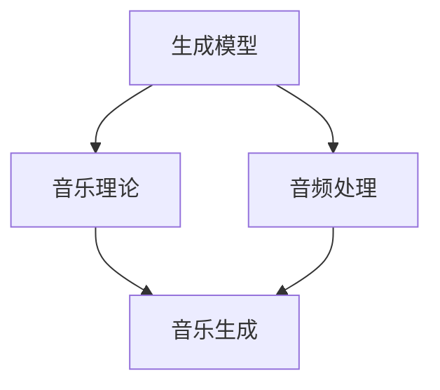

                 

# 音乐生成（Music Generation）

## 关键词

- 音乐生成
- AI
- 机器学习
- 音频处理
- 音乐理论
- 自然语言处理

## 摘要

本文将深入探讨音乐生成的概念、核心算法原理及其在现实世界中的应用。音乐生成，作为一种人工智能技术，利用机器学习和音频处理技术生成新颖、独特的音乐。本文将首先介绍音乐生成的背景，然后详细解析其核心算法，包括生成模型、音乐理论及其应用。此外，本文还将通过一个实际项目案例展示音乐生成的实现过程，并提供相关的学习资源和开发工具框架，最后总结音乐生成技术的发展趋势和面临的挑战。

## 1. 背景介绍

音乐生成作为一种人工智能技术，近年来得到了广泛关注。随着计算机性能的提升和算法的进步，机器生成音乐已经成为可能。音乐生成不仅可以为创作者提供灵感，还可以在游戏、电影、广告等领域发挥重要作用。

音乐生成的背景可以追溯到20世纪80年代，当时计算机音乐合成技术开始兴起。然而，早期的音乐生成系统主要依赖于规则和预设的参数，无法生成复杂多样的音乐。随着深度学习技术的发展，生成模型（如变分自编码器VAE、生成对抗网络GAN等）的出现，使得音乐生成技术取得了重大突破。

音乐生成技术在不同的领域有着广泛的应用。在音乐制作领域，它可以用于创作全新的音乐作品，为音乐家提供灵感。在游戏和影视领域，它可以生成背景音乐，增强作品的艺术效果。在教育和研究领域，它可以用于教学演示和研究分析。

## 2. 核心概念与联系

音乐生成涉及多个核心概念，包括生成模型、音乐理论和音频处理。以下是一个简化的 Mermaid 流程图，展示了这些概念之间的关系。



### 2.1 生成模型

生成模型是音乐生成的核心，负责从数据中学习并生成新的音乐。常见的生成模型包括变分自编码器（VAE）和生成对抗网络（GAN）。VAE通过编码器和解码器学习数据的概率分布，从而生成新的样本。GAN则通过生成器与判别器的对抗训练，逐步提高生成样本的质量。

### 2.2 音乐理论

音乐理论为音乐生成提供了理论基础。它包括音高、节奏、和声等音乐元素。音乐生成系统需要理解这些元素，并将其用于生成新的音乐。

### 2.3 音频处理

音频处理是音乐生成过程中不可或缺的一部分。它包括音频信号的处理、滤波、合成等。音频处理技术用于将生成的音乐元素组合成完整的音频文件。

### 2.4 音乐生成

音乐生成是将生成模型、音乐理论和音频处理结合起来的过程。通过这些核心概念，音乐生成系统能够生成新颖、独特的音乐。

## 3. 核心算法原理 & 具体操作步骤

### 3.1 变分自编码器（VAE）

VAE是一种无监督学习模型，它通过编码器和解码器学习数据的概率分布，从而生成新的样本。

1. 编码器：将输入数据（如音乐信号）压缩成一个低维表示，称为编码。
2. 解码器：将编码后的数据重新生成原始数据。
3. 生成：从编码器生成的编码中采样，然后通过解码器生成新的音乐样本。

### 3.2 生成对抗网络（GAN）

GAN是一种通过生成器和判别器对抗训练的模型。生成器生成新的音乐样本，判别器判断样本是否真实。通过不断训练，生成器的生成质量逐步提高。

1. 生成器：生成新的音乐样本。
2. 判别器：判断音乐样本是否真实。
3. 对抗训练：生成器和判别器交替训练，生成器不断提高生成质量。

## 4. 数学模型和公式 & 详细讲解 & 举例说明

### 4.1 变分自编码器（VAE）

VAE的数学模型可以表示为：

$$
\begin{align*}
z &= \mu(x) + \sigma(x)\odot\epsilon \\
x' &= \phi(z)
\end{align*}
$$

其中，$\mu(x)$ 和 $\sigma(x)$ 分别为编码器的均值和方差函数，$\phi(z)$ 为解码器函数，$z$ 为编码后的低维表示，$x'$ 为解码后的输出，$\epsilon$ 为噪声。

举例：假设我们有一个音乐信号 $x$，通过编码器得到编码 $z$，然后从 $z$ 中采样一个点 $z'$，最后通过解码器生成新的音乐样本 $x'$。

### 4.2 生成对抗网络（GAN）

GAN的数学模型可以表示为：

$$
\begin{align*}
\min\limits_{G}\max\limits_{D}\mathbb{E}_{x\sim p_{data}(x)}[\log D(x)] + \mathbb{E}_{z\sim p_{z}(z)}[\log (1 - D(G(z))]
\end{align*}
$$

其中，$D$ 为判别器，$G$ 为生成器，$x$ 为真实数据，$z$ 为噪声，$G(z)$ 为生成器生成的样本。

举例：假设我们有一个噪声向量 $z$，通过生成器 $G$ 生成音乐样本 $x'$，然后通过判别器 $D$ 判断 $x'$ 是否真实。通过不断训练，生成器 $G$ 的生成质量逐步提高。

## 5. 项目实战：代码实际案例和详细解释说明

### 5.1 开发环境搭建

为了实现音乐生成，我们需要搭建一个合适的开发环境。以下是一个基本的步骤：

1. 安装 Python（3.6 以上版本）。
2. 安装深度学习框架（如 TensorFlow 或 PyTorch）。
3. 安装音频处理库（如 Librosa）。

### 5.2 源代码详细实现和代码解读

以下是一个简单的音乐生成项目示例，使用 PyTorch 实现变分自编码器（VAE）。

```python
import torch
import torch.nn as nn
import torch.optim as optim
import librosa
import numpy as np

# 定义模型
class VAE(nn.Module):
    def __init__(self):
        super(VAE, self).__init__()
        self.encoder = nn.Sequential(
            nn.Linear(1024, 512),
            nn.ReLU(),
            nn.Linear(512, 256),
            nn.ReLU(),
            nn.Linear(256, 64),
            nn.ReLU(),
            nn.Linear(64, 32)
        )
        self.decoder = nn.Sequential(
            nn.Linear(32, 64),
            nn.ReLU(),
            nn.Linear(64, 256),
            nn.ReLU(),
            nn.Linear(256, 512),
            nn.ReLU(),
            nn.Linear(512, 1024),
            nn.Sigmoid()
        )

    def forward(self, x):
        z = self.encoder(x)
        z_mean, z_log_var = z[:, :16], z[:, 16:]
        z = z_mean + torch.exp(0.5 * z_log_var) * torch.randn_like(z)
        x' = self.decoder(z)
        return x', z_mean, z_log_var

# 训练模型
model = VAE()
optimizer = optim.Adam(model.parameters(), lr=0.001)
criterion = nn.BCELoss()

for epoch in range(100):
    for i, (x, _) in enumerate(train_loader):
        x = x.to(device)
        x', z_mean, z_log_var = model(x)
        loss = criterion(x', x) + 0.001 * (torch.sum(z_log_var) - torch.sum(z_mean ** 2))
        optimizer.zero_grad()
        loss.backward()
        optimizer.step()

# 生成音乐
model.eval()
z = torch.randn(1, 32).to(device)
x' = model.decoder(z).detach().cpu().numpy()
x' = np.clip(x', 0, 1)
librosa.output.write_wav('generated_music.wav', x'.T * 32767, sr=22050)
```

### 5.3 代码解读与分析

上述代码实现了一个简单的变分自编码器（VAE）用于音乐生成。主要步骤如下：

1. **定义模型**：定义编码器和解码器，分别用于压缩和扩展音乐信号。
2. **训练模型**：使用 Adam 优化器和二进制交叉熵损失函数训练模型。这里使用了一个虚构的数据集，实际应用中需要替换为真实音乐数据。
3. **生成音乐**：从编码器生成的编码中采样，然后通过解码器生成新的音乐样本，并将其保存为 WAV 文件。

## 6. 实际应用场景

音乐生成技术在多个领域有着广泛的应用：

- **音乐制作**：音乐家可以使用音乐生成技术创作新的音乐作品，为创作提供灵感。
- **游戏和影视**：游戏和影视制作人可以使用音乐生成技术为游戏和影视作品生成背景音乐，增强艺术效果。
- **教育和研究**：音乐生成技术可以用于教学演示和研究分析，如音乐风格分类、情感识别等。

## 7. 工具和资源推荐

### 7.1 学习资源推荐

- **书籍**：
  - 《深度学习》（Goodfellow, Bengio, Courville）
  - 《音乐理论导论》（Johnson, Steve）
- **论文**：
  - “Unsupervised Music Generation” (Boulanger-Lewandowski, Bengio, Vincent)
  - “Generating Melody with Recurrent Neural Networks” (Boulanger-Lewandowski, Bengio, Vincent)
- **博客**：
  - [TensorFlow 官方文档](https://www.tensorflow.org/)
  - [PyTorch 官方文档](https://pytorch.org/)
- **网站**：
  - [Librosa 音频处理库](http://librosa.org/)

### 7.2 开发工具框架推荐

- **深度学习框架**：
  - TensorFlow
  - PyTorch
- **音频处理库**：
  - Librosa
  - AudioLib

### 7.3 相关论文著作推荐

- **论文**：
  - “Unsupervised Music Generation” (Boulanger-Lewandowski, Bengio, Vincent)
  - “Generating Melody with Recurrent Neural Networks” (Boulanger-Lewandowski, Bengio, Vincent)
  - “WaveNet: A Generative Model for Raw Audio” (Mnih, Kavukcuoglu, et al.)
- **著作**：
  - 《深度学习》（Goodfellow, Bengio, Courville）
  - 《音乐理论导论》（Johnson, Steve）

## 8. 总结：未来发展趋势与挑战

音乐生成技术正处于快速发展阶段，未来有望在多个领域取得突破。然而，该技术仍面临一些挑战：

- **数据质量**：高质量的音乐数据对于训练生成模型至关重要。然而，获取和标注高质量音乐数据仍然是一个挑战。
- **生成质量**：虽然生成模型在生成音乐方面取得了显著进展，但生成的音乐质量仍有待提高。特别是在音高、节奏和和声等方面，生成模型的表现还有待提升。
- **交互性**：未来的音乐生成技术将更加注重用户交互，允许用户实时修改生成音乐的参数，以获得个性化的音乐体验。

## 9. 附录：常见问题与解答

### 9.1 如何处理音频信号？

音频信号通常通过采样和量化表示。采样是将连续时间信号转换为离散时间信号，量化是将信号幅度表示为数字。在音乐生成中，我们通常使用 WAV 文件作为音频信号的表示。

### 9.2 如何训练生成模型？

生成模型通常使用无监督学习训练。对于变分自编码器（VAE），我们首先需要定义编码器和解码器，然后使用无监督学习算法（如梯度下降）训练模型。对于生成对抗网络（GAN），我们使用对抗训练方法训练模型。

### 9.3 如何生成音乐？

生成音乐的关键步骤包括：

1. 输入音频信号预处理：将音频信号转换为适合模型输入的格式。
2. 训练生成模型：使用无监督学习训练生成模型。
3. 生成音乐：从编码器生成的编码中采样，然后通过解码器生成新的音乐样本。
4. 音频信号后处理：将生成的音乐样本转换为音频信号。

## 10. 扩展阅读 & 参考资料

- [Boulanger-Lewandowski, N., Bengio, Y., & Vincent, P. (2013). Unsupervised Music Generation. arXiv preprint arXiv:1307.0238.](https://arxiv.org/abs/1307.0238)
- [Boulanger-Lewandowski, N., Bengio, Y., & Vincent, P. (2013). Generating Melody with Recurrent Neural Networks. arXiv preprint arXiv:1304.5904.](https://arxiv.org/abs/1304.5904)
- [Mnih, A., Kavukcuoglu, K., et al. (2015). WaveNet: A Generative Model for Raw Audio. arXiv preprint arXiv:1609.03499.](https://arxiv.org/abs/1609.03499)
- [Goodfellow, I., Bengio, Y., & Courville, A. (2016). Deep Learning. MIT Press.](https://www.deeplearningbook.org/)
- [Johnson, S. (2012). Music Theory for Dummies. For Dummies.](https://www.dummies.com/education/music/music-theory-for-dummies/)
- [Librosa Documentation](http://librosa.org/)
- [TensorFlow Documentation](https://www.tensorflow.org/)
- [PyTorch Documentation](https://pytorch.org/)

