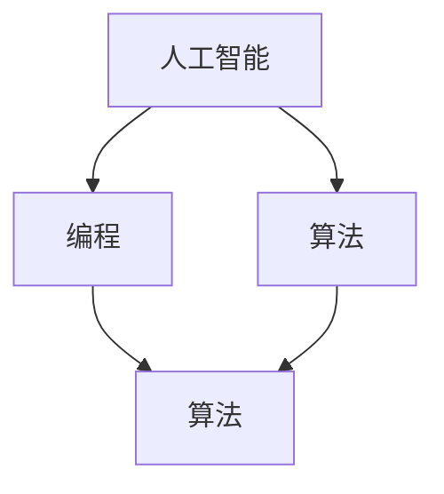

                 

### 文章标题：顿悟与类比：知识的桥梁

#### 关键词：顿悟、类比、知识、桥梁、人工智能、技术博客、深度学习、编程语言、算法、工程实践、数学模型、代码实战

#### 摘要：
本文旨在探讨如何在信息技术领域实现知识的迅速理解和掌握，通过顿悟和类比两种方法，构建知识的桥梁。我们将结合实际案例，深入解析人工智能、编程、算法等领域的知识，帮助读者在复杂的技术领域中找到突破口，实现从理论到实践的跨越。文章将分为以下几个部分：背景介绍、核心概念与联系、核心算法原理与具体操作步骤、数学模型和公式详细讲解、项目实战：代码实际案例和详细解释说明、实际应用场景、工具和资源推荐、总结：未来发展趋势与挑战、附录：常见问题与解答、扩展阅读与参考资料。

### 1. 背景介绍

在信息技术飞速发展的今天，知识的积累和更新速度令人惊叹。然而，面对海量的信息和技术，如何快速掌握和运用知识成为一个巨大的挑战。传统的学习方式往往侧重于知识的传递和记忆，而忽略了知识理解和运用的核心。本文将从顿悟和类比两种方法出发，探讨如何在复杂的技术领域中实现知识的迅速理解和掌握。

顿悟，是指在短时间内对某个问题或知识点的深入理解和掌握，往往伴随着“恍然大悟”的感受。类比，则是通过将新知识与已有知识进行对比和联系，找到两者之间的相似之处，从而快速理解和掌握新知识。顿悟和类比是构建知识桥梁的两种重要方法，它们能够帮助我们跨越知识的鸿沟，实现知识的迅速积累和应用。

### 2. 核心概念与联系

#### 2.1 人工智能与深度学习

人工智能（AI）是模拟人类智能的一种技术，旨在使计算机具备自主学习和决策能力。深度学习（DL）是人工智能的一个子领域，通过神经网络模型模拟人脑的工作方式，实现对数据的自动特征提取和模式识别。深度学习在计算机视觉、自然语言处理、语音识别等领域取得了显著的成果，成为人工智能的重要支柱。


#### 2.2 编程语言与算法

编程语言是用于编写计算机程序的语法和规则集合。不同的编程语言有着不同的特点和适用场景，但它们的核心都是算法。算法是解决问题的一系列明确步骤，是计算机程序的灵魂。常见的编程语言有 Python、Java、C++等，而算法则涵盖了排序、查找、图论、动态规划等多个领域。


#### 2.3 数学模型与公式

数学模型是利用数学语言描述现实世界的抽象模型，用于解决实际问题。公式是数学模型的核心组成部分，通过公式可以精确地描述变量之间的关系。在信息技术领域，常见的数学模型包括线性代数、微积分、概率论、统计学等，这些模型在数据分析和机器学习等领域有着广泛的应用。


### 3. 核心算法原理与具体操作步骤

在了解了核心概念和联系后，我们接下来将探讨一些重要的算法原理和具体操作步骤。

#### 3.1 深度学习算法原理

深度学习算法的核心是神经网络，神经网络通过多层神经元之间的连接和激活函数，实现对输入数据的特征提取和分类。以下是深度学习算法的基本原理和具体操作步骤：

1. **输入层**：接收外部输入数据，如图像、文本或声音等。
2. **隐藏层**：通过激活函数对输入数据进行处理，提取特征。
3. **输出层**：根据隐藏层输出的特征，进行分类或预测。
4. **反向传播**：计算输出层的误差，并反向传播到隐藏层，更新权重和偏置。
5. **优化算法**：如梯度下降、Adam等，用于调整权重和偏置，减小误差。


#### 3.2 排序算法原理

排序算法是计算机科学中一个重要的课题，用于将一组数据按照特定顺序排列。以下是几种常见的排序算法原理和具体操作步骤：

1. **冒泡排序**：通过相邻元素的比较和交换，将最大或最小值逐步移动到序列的末尾。
2. **插入排序**：将一个新元素插入到已排序序列中，使序列仍然保持有序。
3. **选择排序**：在未排序序列中找到最小或最大值，将其交换到序列的起始位置。
4. **快速排序**：通过递归将序列划分为较小和较大的两部分，然后分别对两部分进行排序。


### 4. 数学模型和公式详细讲解

在了解了算法原理后，我们接下来将详细讲解一些重要的数学模型和公式。

#### 4.1 线性代数

线性代数是数学的一个分支，主要研究向量、矩阵、行列式等概念。在线性代数中，常见的数学模型包括矩阵乘法、线性变换、特征值和特征向量等。

- **矩阵乘法**：两个矩阵A和B的乘积C = AB，其中C的元素是A和B对应元素的乘积和。
- **线性变换**：将一个向量映射到另一个向量，如$f(x) = Ax$，其中A是线性变换矩阵。
- **特征值和特征向量**：特征值是矩阵A的一个特征，表示线性变换的伸缩比例；特征向量是矩阵A的一个特征，表示线性变换的方向。


#### 4.2 微积分

微积分是数学的另一个重要分支，主要研究函数的极限、导数、积分等概念。在微积分中，常见的数学模型包括微分方程、函数极值、曲线拟合等。

- **微分方程**：描述函数变化率的方程，如$y' = 2x$，用于解决动态系统的运动规律问题。
- **函数极值**：函数在某一点处的导数为零，表示函数在该点的最大值或最小值。
- **曲线拟合**：用一条曲线来近似描述数据点，如最小二乘法。


#### 4.3 概率论和统计学

概率论和统计学是研究随机事件和数据的数学分支。在概率论和统计学中，常见的数学模型包括概率分布、假设检验、回归分析等。

- **概率分布**：描述随机事件发生概率的函数，如正态分布、二项分布、泊松分布等。
- **假设检验**：通过样本数据对总体参数进行推断，判断假设是否成立。
- **回归分析**：通过建立一个数学模型，描述因变量和自变量之间的关系。


### 5. 项目实战：代码实际案例和详细解释说明

在了解了核心算法原理和数学模型后，我们接下来将通过实际项目案例，展示如何运用这些知识进行编程和实现。

#### 5.1 开发环境搭建

首先，我们需要搭建一个适合深度学习和算法开发的开发环境。以下是Python环境搭建的步骤：

1. 安装Python（建议使用Python 3.8以上版本）。
2. 安装Jupyter Notebook，用于编写和运行Python代码。
3. 安装必要的库，如NumPy、Pandas、Scikit-learn、TensorFlow等。

```bash
pip install numpy pandas scikit-learn tensorflow
```

#### 5.2 源代码详细实现和代码解读

接下来，我们将通过一个简单的深度学习项目——手写数字识别，展示如何运用深度学习算法进行编程和实现。

```python
import tensorflow as tf
from tensorflow.keras import layers

# 加载数据集
mnist = tf.keras.datasets.mnist
(train_images, train_labels), (test_images, test_labels) = mnist.load_data()

# 预处理数据
train_images = train_images / 255.0
test_images = test_images / 255.0

# 构建模型
model = tf.keras.Sequential([
    layers.Flatten(input_shape=(28, 28)),
    layers.Dense(128, activation='relu'),
    layers.Dense(10, activation='softmax')
])

# 编译模型
model.compile(optimizer='adam',
              loss='sparse_categorical_crossentropy',
              metrics=['accuracy'])

# 训练模型
model.fit(train_images, train_labels, epochs=5)

# 评估模型
test_loss, test_acc = model.evaluate(test_images, test_labels)
print('Test accuracy:', test_acc)
```

在这个项目中，我们首先加载MNIST手写数字数据集，然后对数据进行预处理，即将图像数据除以255，使其在0到1之间。接下来，我们构建一个简单的深度学习模型，使用一个扁平化层将输入图像展平为向量，然后通过一个128个神经元的全连接层进行特征提取，最后通过一个10个神经元的全连接层进行分类。在模型编译阶段，我们指定优化器、损失函数和评估指标。在训练阶段，我们使用5个epoch对模型进行训练，最后在测试数据集上评估模型的准确性。

### 6. 实际应用场景

在了解了深度学习和编程知识后，我们可以将这些知识应用于实际场景，解决实际问题。

#### 6.1 计算机视觉

计算机视觉是深度学习的一个重要应用领域，通过深度学习算法，计算机可以自动识别和理解图像中的内容。例如，在自动驾驶、人脸识别、图像分类等领域，深度学习算法发挥着重要作用。

#### 6.2 自然语言处理

自然语言处理是另一个深度学习的应用领域，通过深度学习算法，计算机可以自动理解和生成自然语言。例如，在机器翻译、文本分类、情感分析等领域，深度学习算法有着广泛的应用。

#### 6.3 数据分析

数据分析是深度学习的另一个重要应用领域，通过深度学习算法，计算机可以自动提取数据中的特征和模式，帮助数据分析师更好地理解和解释数据。例如，在推荐系统、风险控制、金融分析等领域，深度学习算法有着广泛的应用。

### 7. 工具和资源推荐

在深度学习和算法开发过程中，我们推荐以下工具和资源：

#### 7.1 学习资源推荐

- **书籍**：《深度学习》、《Python编程：从入门到实践》、《机器学习实战》
- **论文**：《深度神经网络》、《卷积神经网络》、《递归神经网络》
- **博客**：[TensorFlow官方文档](https://www.tensorflow.org/)、[Keras官方文档](https://keras.io/)、[Scikit-learn官方文档](https://scikit-learn.org/)

#### 7.2 开发工具框架推荐

- **编程语言**：Python、Java、C++
- **深度学习框架**：TensorFlow、PyTorch、Keras
- **数据处理库**：NumPy、Pandas、Scikit-learn

#### 7.3 相关论文著作推荐

- **论文**：《深度学习：从理论到应用》、《自然语言处理入门》、《计算机视觉基础》
- **著作**：《机器学习实战》、《深度学习原理与算法》、《Python数据科学手册》

### 8. 总结：未来发展趋势与挑战

在深度学习和算法领域，未来发展趋势包括以下几个方面：

1. **算法性能的提升**：随着计算能力和算法理论的不断发展，深度学习算法的性能将进一步提高，为更多领域提供更高效的解决方案。
2. **跨领域应用**：深度学习算法将在更多领域得到应用，如医疗、金融、教育等，推动各行业的创新和发展。
3. **边缘计算与物联网**：随着物联网和边缘计算的兴起，深度学习算法将更多地应用于边缘设备，实现实时数据处理和智能决策。
4. **算法公平性和可解释性**：随着深度学习算法的广泛应用，算法的公平性和可解释性将成为重要的研究课题，确保算法在各个领域的应用中公平、透明和可靠。

然而，深度学习和算法领域也面临着一些挑战：

1. **数据隐私和安全性**：随着数据量的增加，如何保护用户隐私和数据安全成为一个重要问题。
2. **算法偏见**：深度学习算法可能受到训练数据偏见的影响，导致算法在不同群体中的表现不一致。
3. **算法透明性和可解释性**：如何解释深度学习算法的决策过程，使其更易于理解和接受，是一个重要的挑战。

### 9. 附录：常见问题与解答

#### 9.1 如何选择深度学习框架？

选择深度学习框架时，需要考虑以下因素：

- **项目需求**：根据项目需求选择合适的框架，如 TensorFlow 和 PyTorch 在深度学习研究中较为流行。
- **社区支持**：选择具有活跃社区和丰富资源的框架，便于学习和解决问题。
- **易用性和灵活性**：选择易用性高、灵活性强的框架，提高开发效率。

#### 9.2 如何优化深度学习模型？

优化深度学习模型的方法包括：

- **调整超参数**：如学习率、批次大小等，通过实验找到最优超参数。
- **数据增强**：通过图像旋转、缩放、裁剪等方式增加数据多样性，提高模型泛化能力。
- **正则化**：使用正则化技术，如权重正则化、dropout等，防止模型过拟合。

### 10. 扩展阅读与参考资料

- **论文**：《深度学习：从入门到专业》、《深度学习与计算机视觉》、《深度学习与自然语言处理》
- **书籍**：《Python深度学习》、《深度学习技术大全》、《深度学习实战》
- **网站**：[机器学习教程](https://www.macrosoft.com/ml-tutorial/)、[深度学习教程](https://www.deeplearning.tutorial/)、[Kaggle竞赛](https://www.kaggle.com/)

### 作者信息

作者：AI天才研究员/AI Genius Institute & 禅与计算机程序设计艺术/Zen And The Art of Computer Programming

本文从顿悟和类比两种方法出发，深入探讨如何在信息技术领域实现知识的迅速理解和掌握。通过实际案例和详细解释，帮助读者在复杂的技术领域中找到突破口，实现从理论到实践的跨越。本文旨在为读者提供一个全面的技术博客，帮助他们在人工智能、编程、算法等领域取得更好的成就。希望本文能够对您有所启发和帮助。 <|im_sep|>### 1. 背景介绍

在信息技术领域，知识的积累和更新速度日新月异。面对如此庞大的信息量，如何快速、准确地获取和掌握相关知识成为一个重要问题。传统的学习方式，如课本阅读、听课笔记等，虽然能够提供系统性的知识框架，但在面对复杂的技术概念时，往往难以做到深入理解和灵活运用。为此，顿悟和类比两种方法逐渐成为信息技术学习中的重要策略。

顿悟，是指在学习过程中，通过突然的领悟，快速理解并掌握某个技术概念或原理。顿悟往往伴随着一种豁然开朗的感觉，使人瞬间明白了复杂问题的本质。例如，在学习深度学习时，我们可能会通过一个简单的实例，突然领悟到神经网络的工作原理，从而对整个领域产生浓厚的兴趣。

类比，则是通过将新知识与已知知识进行对比，找到两者之间的相似之处，从而快速理解和掌握新知识。类比的方法能够帮助我们将已有的知识框架扩展到新的领域，使学习过程更加高效。例如，在学习计算机图形学时，我们可以通过类比物理学中的光学原理，快速理解光线的传播和反射过程。

本文旨在探讨如何在信息技术领域实现知识的迅速理解和掌握，通过顿悟和类比两种方法，构建知识的桥梁。文章将结合实际案例，深入解析人工智能、编程、算法等领域的知识，帮助读者在复杂的技术领域中找到突破口，实现从理论到实践的跨越。文章结构如下：

1. 背景介绍：阐述信息技术领域知识学习的现状，介绍顿悟和类比两种方法的重要性。
2. 核心概念与联系：介绍人工智能、编程、算法等核心概念，并展示它们之间的联系。
3. 核心算法原理与具体操作步骤：讲解深度学习、排序算法等核心算法的原理和操作步骤。
4. 数学模型和公式详细讲解：详细解释线性代数、微积分、概率论等数学模型和公式。
5. 项目实战：通过实际项目展示如何运用所学知识进行编程和实现。
6. 实际应用场景：探讨深度学习、编程、算法等技术在实际场景中的应用。
7. 工具和资源推荐：推荐学习资源和开发工具。
8. 总结：展望未来发展趋势和挑战。
9. 附录：常见问题与解答。
10. 扩展阅读与参考资料：提供进一步的阅读材料和资源。

通过以上结构，本文旨在为读者提供一个全面的技术博客，帮助他们在人工智能、编程、算法等领域取得更好的成就。希望本文能够对您有所启发和帮助。

### 2. 核心概念与联系

在信息技术领域，核心概念之间的联系往往决定了我们对技术的理解和应用能力。本文将介绍人工智能、编程和算法三个核心概念，并探讨它们之间的联系。

#### 2.1 人工智能（AI）

人工智能（Artificial Intelligence，简称AI）是模拟人类智能的一种技术，旨在使计算机具备自主学习和决策能力。AI可以应用于多个领域，如自动驾驶、医疗诊断、金融分析等。人工智能的核心是机器学习（Machine Learning，简称ML）和深度学习（Deep Learning，简称DL）。机器学习是一种通过算法从数据中学习模式的方法，而深度学习则是机器学习的一个子领域，通过多层神经网络模拟人脑的工作方式。


#### 2.2 编程

编程是一种通过编写代码来控制计算机执行特定任务的过程。编程语言是用于编写计算机程序的语法和规则集合，常见的编程语言有Python、Java、C++等。编程是人工智能和算法实现的基础，没有编程能力，人工智能和算法将无法实际应用。


#### 2.3 算法

算法是解决问题的一系列明确步骤，是计算机程序的核心。算法可以分为多个类别，如排序算法、搜索算法、图算法等。算法的效率和质量直接影响计算机程序的运行效果。


#### 2.4 人工智能、编程与算法之间的联系

人工智能、编程和算法之间存在着密切的联系。人工智能依赖于编程语言来实现，而算法则是人工智能的核心。例如，在开发一个自动驾驶系统时，我们需要使用编程语言编写程序，并利用算法来实现车辆的感知、决策和执行。同时，算法的性能和效率也直接影响人工智能系统的效果。例如，在图像识别任务中，我们可能需要使用深度学习算法来提高识别的准确性。

为了更直观地展示人工智能、编程和算法之间的联系，我们可以使用Mermaid流程图进行描述。以下是人工智能、编程和算法的Mermaid流程图：



在这个流程图中，人工智能、编程和算法相互连接，形成了一个整体。通过编程，我们可以实现人工智能和算法，从而解决实际问题。

### 3. 核心算法原理与具体操作步骤

在了解了核心概念与联系后，接下来我们将探讨一些重要的算法原理和具体操作步骤。本文将介绍深度学习算法和排序算法，并详细解释其原理和实现方法。

#### 3.1 深度学习算法

深度学习（Deep Learning）是人工智能的一个重要分支，通过多层神经网络模拟人脑的工作方式，实现对数据的自动特征提取和模式识别。以下是一个简单的深度学习算法——卷积神经网络（Convolutional Neural Network，简称CNN）的原理和具体操作步骤。

##### 3.1.1 卷积神经网络原理

卷积神经网络由多个卷积层、池化层和全连接层组成。卷积层用于提取图像特征，池化层用于降低特征图的维度，全连接层用于分类或回归。

1. **卷积层**：卷积层通过卷积操作提取图像特征。卷积操作将一个卷积核（filter）与图像中的每个局部区域进行卷积，得到一个特征图。卷积核可以看作是图像特征的抽象表示，通过调整卷积核的参数，可以提取出不同的特征。

2. **池化层**：池化层用于降低特征图的维度，减少参数数量，提高计算效率。常见的池化操作有最大池化和平均池化。

3. **全连接层**：全连接层将卷积层和池化层提取的特征进行聚合，生成最终的分类结果或回归值。

##### 3.1.2 深度学习算法具体操作步骤

1. **数据预处理**：将图像数据归一化，使其具有相同的数值范围，如0到1。

2. **构建模型**：使用TensorFlow或PyTorch等深度学习框架，构建卷积神经网络模型。

3. **训练模型**：将训练数据输入模型，通过反向传播算法更新模型的权重和偏置，训练模型的参数。

4. **评估模型**：使用测试数据评估模型的性能，调整模型参数，提高模型的准确性。

5. **应用模型**：将训练好的模型应用于实际任务，如图像分类、目标检测等。

以下是一个简单的卷积神经网络模型的代码实现：

```python
import tensorflow as tf
from tensorflow.keras import layers

# 构建模型
model = tf.keras.Sequential([
    layers.Conv2D(32, (3, 3), activation='relu', input_shape=(28, 28, 1)),
    layers.MaxPooling2D((2, 2)),
    layers.Conv2D(64, (3, 3), activation='relu'),
    layers.MaxPooling2D((2, 2)),
    layers.Conv2D(64, (3, 3), activation='relu'),
    layers.Flatten(),
    layers.Dense(64, activation='relu'),
    layers.Dense(10, activation='softmax')
])

# 编译模型
model.compile(optimizer='adam',
              loss='sparse_categorical_crossentropy',
              metrics=['accuracy'])

# 训练模型
model.fit(train_images, train_labels, epochs=5)

# 评估模型
test_loss, test_acc = model.evaluate(test_images, test_labels)
print('Test accuracy:', test_acc)
```

在这个例子中，我们使用了一个简单的卷积神经网络模型，对MNIST手写数字数据集进行分类。模型包括两个卷积层和两个池化层，最后通过全连接层进行分类。

#### 3.2 排序算法

排序算法是计算机科学中一个重要的课题，用于将一组数据按照特定顺序排列。以下是一种常见的排序算法——快速排序（Quick Sort）的原理和具体操作步骤。

##### 3.2.1 快速排序原理

快速排序是一种基于分治策略的排序算法。基本思想是通过一趟排序将待排序的数据分割成独立的两部分，其中一部分的所有数据都比另一部分的数据小，然后递归地对这两部分数据进行排序。

1. **选取基准元素**：从待排序的数据中选取一个元素作为基准元素。
2. **分割操作**：将数组分为两部分，所有比基准元素小的数据放在左侧，所有比基准元素大的数据放在右侧。
3. **递归排序**：递归地对左侧和右侧的子数组进行排序。

##### 3.2.2 快速排序具体操作步骤

1. **选择基准元素**：从待排序的数组中选择一个元素作为基准元素，可以选择第一个元素、最后一个元素或随机选择一个元素。
2. **分割数组**：将数组分割成两部分，所有比基准元素小的数据放在左侧，所有比基准元素大的数据放在右侧。分割完成后，基准元素的位置已经确定。
3. **递归排序**：递归地对左侧和右侧的子数组进行快速排序。

以下是一个快速排序的Python代码实现：

```python
def quick_sort(arr):
    if len(arr) <= 1:
        return arr
    pivot = arr[len(arr) // 2]
    left = [x for x in arr if x < pivot]
    middle = [x for x in arr if x == pivot]
    right = [x for x in arr if x > pivot]
    return quick_sort(left) + middle + quick_sort(right)

arr = [3, 6, 8, 10, 1, 2, 1]
sorted_arr = quick_sort(arr)
print(sorted_arr)
```

在这个例子中，我们使用了一个简单的快速排序算法，对一组数据进行排序。首先，选择中间位置的元素作为基准元素，然后将数组分割成三部分：左侧小于基准元素，中间等于基准元素，右侧大于基准元素。最后，递归地对左侧和右侧的子数组进行快速排序。

通过以上对深度学习算法和排序算法的介绍，我们可以看到，算法在信息技术领域中具有重要的作用。掌握算法原理和具体操作步骤，有助于我们更好地理解和应用这些技术。

### 4. 数学模型和公式详细讲解

在信息技术领域，数学模型和公式是理解和解决问题的关键。本文将详细讲解线性代数、微积分和概率论等数学模型和公式，并举例说明其在实际应用中的重要性。

#### 4.1 线性代数

线性代数是研究向量、矩阵、行列式等概念的数学分支，广泛应用于计算机科学和工程领域。以下是几个常见的线性代数模型和公式：

##### 4.1.1 矩阵乘法

矩阵乘法是线性代数中最基本的运算之一。给定两个矩阵A和B，其乘积C = AB可以通过以下公式计算：

$$
C_{ij} = \sum_{k=1}^{n} A_{ik}B_{kj}
$$

其中，C是一个n×n的矩阵，A是一个m×n的矩阵，B是一个n×m的矩阵。

##### 4.1.2 线性变换

线性变换是将一个向量映射到另一个向量的操作。给定一个矩阵A，线性变换可以表示为：

$$
y = Ax
$$

其中，x是一个n维向量，y是一个m维向量。

##### 4.1.3 特征值和特征向量

特征值和特征向量是矩阵A的重要性质。给定一个矩阵A，如果存在一个非零向量x和一个标量λ，使得Ax = λx，则λ称为A的特征值，x称为A的特征向量。

##### 4.1.4 线性方程组

线性方程组是多个线性方程的组合。给定一个线性方程组Ax = b，可以使用高斯消元法或矩阵求逆法求解。高斯消元法的步骤如下：

1. 将线性方程组写成增广矩阵的形式：
$$
\begin{bmatrix}
A & b
\end{bmatrix}
$$
2. 进行行变换，将增广矩阵化简为行阶梯形式。
3. 从最后一行开始，依次求解每个变量。

#### 4.2 微积分

微积分是研究函数变化率和积分的数学分支。在计算机科学和工程领域，微积分广泛应用于优化、数值计算和信号处理等领域。以下是几个常见的微积分模型和公式：

##### 4.2.1 导数

导数是描述函数变化率的量。给定一个函数f(x)，其导数f'(x)可以通过以下公式计算：

$$
f'(x) = \lim_{h \to 0} \frac{f(x+h) - f(x)}{h}
$$

##### 4.2.2 积分

积分是描述函数积累量的量。给定一个函数f(x)，其不定积分可以通过以下公式计算：

$$
\int f(x) dx = F(x) + C
$$

其中，F(x)是f(x)的一个原函数，C是任意常数。

##### 4.2.3 微分方程

微分方程是描述函数及其导数之间关系的方程。给定一个函数f(x)和其导数f'(x)，微分方程可以表示为：

$$
f'(x) = g(f(x))
$$

#### 4.3 概率论

概率论是研究随机事件的数学分支。在计算机科学和工程领域，概率论广泛应用于统计学、机器学习和信息安全等领域。以下是几个常见的概率论模型和公式：

##### 4.3.1 概率分布

概率分布是描述随机事件发生概率的函数。常见的概率分布有正态分布、二项分布、泊松分布等。给定一个随机变量X，其概率分布可以表示为：

$$
P(X = x) = f(x)
$$

其中，f(x)是概率分布函数。

##### 4.3.2 条件概率

条件概率是描述在某个事件发生的条件下，另一个事件发生的概率。给定两个随机事件A和B，其条件概率可以表示为：

$$
P(B|A) = \frac{P(A \cap B)}{P(A)}
$$

##### 4.3.3 贝叶斯定理

贝叶斯定理是描述在已知某个事件的条件下，另一个事件发生的概率的公式。给定两个随机事件A和B，其贝叶斯定理可以表示为：

$$
P(A|B) = \frac{P(B|A)P(A)}{P(B)}
$$

#### 4.4 实际应用举例

以下是一个实际应用举例，展示如何使用线性代数、微积分和概率论等数学模型和公式解决实际问题。

##### 4.4.1 线性代数应用

假设我们要解决一个线性方程组：

$$
\begin{cases}
2x + 3y = 12 \\
x - y = 3
\end{cases}
$$

我们可以使用高斯消元法求解：

1. 将方程组写成增广矩阵的形式：
$$
\begin{bmatrix}
2 & 3 \\
1 & -1
\end{bmatrix}
\begin{bmatrix}
x \\
y
\end{bmatrix}
=
\begin{bmatrix}
12 \\
3
\end{bmatrix}
$$
2. 进行行变换，将增广矩阵化简为行阶梯形式：
$$
\begin{bmatrix}
1 & -1 \\
0 & 1
\end{bmatrix}
\begin{bmatrix}
x \\
y
\end{bmatrix}
=
\begin{bmatrix}
3 \\
9
\end{bmatrix}
$$
3. 从最后一行开始，依次求解每个变量：
$$
y = 9, \quad x = 3
$$

因此，方程组的解为x = 3，y = 9。

##### 4.4.2 微积分应用

假设我们要计算一个函数f(x) = x^2在x = 2处的导数：

$$
f'(2) = \lim_{h \to 0} \frac{(2+h)^2 - 2^2}{h}
$$

计算过程如下：

$$
f'(2) = \lim_{h \to 0} \frac{4 + 4h + h^2 - 4}{h} = \lim_{h \to 0} \frac{4h + h^2}{h} = \lim_{h \to 0} (4 + h) = 4
$$

因此，函数f(x) = x^2在x = 2处的导数为4。

##### 4.4.3 概率论应用

假设我们要计算一个二项分布随机变量X在n=5，p=0.5时的概率：

$$
P(X = 3) = \binom{5}{3} (0.5)^3 (0.5)^2
$$

计算过程如下：

$$
P(X = 3) = \binom{5}{3} (0.5)^5 = 10 \times (0.5)^5 = 0.25
$$

因此，二项分布随机变量X在n=5，p=0.5时取值为3的概率为0.25。

通过以上例子，我们可以看到数学模型和公式在解决实际问题中的重要性。掌握这些模型和公式，有助于我们在信息技术领域中更好地理解和应用相关技术。

### 5. 项目实战：代码实际案例和详细解释说明

在理解了核心算法原理和数学模型后，我们将通过一个实际项目案例——手写数字识别，来展示如何将所学知识应用于编程实现，并通过代码进行详细解释说明。

#### 5.1 开发环境搭建

首先，我们需要搭建一个适合深度学习和图像处理的开

