                 

# 顿悟与类比：知识的桥梁

## 关键词
人工智能、算法、类比、认知、深度学习、知识表示、思维模式、跨学科。

## 摘要
本文旨在探讨人工智能与人类思维之间的桥梁——类比。通过深入分析类比的概念、作用及在人工智能中的应用，我们试图揭示知识的内在联系，并为AI算法的创新提供新的视角。文章将结合具体案例，探讨类比如何帮助AI实现顿悟，进而提升其智能水平。此外，还将探讨未来发展趋势与面临的挑战，为读者提供有益的思考。

## 1. 背景介绍

在人类认知过程中，类比起着至关重要的作用。它不仅帮助我们从已知事物中提取信息，还促进了创新思维和问题解决能力的提升。在计算机科学和人工智能领域，类比同样具有不可忽视的价值。通过类比，我们可以将人类智慧的结晶应用于机器，使AI能够更好地理解和应对复杂问题。

近年来，随着深度学习和自然语言处理技术的快速发展，AI在许多领域的表现已经超越了人类。然而，与人类思维相比，AI仍存在一定的局限性。其中一个关键问题是如何实现“顿悟”——即从大量未知信息中迅速提取有价值知识的认知过程。类比作为一种强大的认知工具，在这一点上为我们提供了重要的启示。

本文将首先介绍类比的概念及其在人类认知中的作用，然后探讨类比在人工智能中的应用，特别是如何通过类比实现AI的顿悟。接下来，我们将结合具体案例，分析类比在AI算法中的应用策略，并讨论未来发展趋势与挑战。最后，我们将总结全文，强调类比在知识创新和人工智能发展中的重要性。

## 2. 核心概念与联系

### 类比的概念

类比是一种认知过程，通过将两个不同领域的事物进行关联，从而发现它们之间的相似性。类比不仅涉及对事物外在特征的比较，还包括对其内在原理和结构的理解。这种认知方式在人类思维中具有广泛的应用，如科学发现、艺术创作、问题解决等。

在科学研究中，类比可以帮助我们从一个领域的问题中提取灵感，应用于另一个领域。例如，牛顿通过类比天体运动和钟摆的运动，提出了万有引力定律。在艺术创作中，类比可以激发新的灵感，如抽象派艺术家毕加索的作品《吉他与公牛头》。

在人类认知过程中，类比起着至关重要的作用。它不仅帮助我们理解和记忆知识，还促进了创新思维和问题解决能力的提升。例如，当我们遇到一个新问题时，往往会尝试将其与已知的问题进行类比，从而找到解决问题的方法。

### 类比在人工智能中的作用

类比在人工智能中的应用同样具有重要意义。通过类比，我们可以将人类智慧的结晶应用于机器，使AI能够更好地理解和应对复杂问题。

首先，类比可以帮助AI实现知识迁移。在深度学习中，模型往往需要大量的数据来训练。然而，获取大量数据并不总是可行。通过类比，我们可以将一个领域中的知识迁移到另一个领域，从而减少数据需求，提高AI的性能。

其次，类比有助于AI的泛化能力。泛化能力是AI能否应对未知问题的关键。类比可以帮助AI从已知问题中提取通用原理，从而提高其泛化能力。

最后，类比可以促进AI的顿悟。顿悟是AI从大量未知信息中迅速提取有价值知识的认知过程。类比作为一种强大的认知工具，可以帮助AI实现顿悟。

### 类比在人工智能中的应用架构

为了更好地理解类比在人工智能中的应用，我们可以将其分为以下几个层次：

1. **特征级类比**：在特征级类比中，我们比较两个不同领域中的特征，从而发现它们之间的相似性。这种类比在图像识别、自然语言处理等领域有着广泛的应用。

2. **结构级类比**：在结构级类比中，我们比较两个不同领域中的结构，从而发现它们之间的相似性。这种类比有助于我们理解和建模复杂系统，如神经网络、知识图谱等。

3. **原理级类比**：在原理级类比中，我们比较两个不同领域中的原理，从而发现它们之间的相似性。这种类比有助于我们发现新的知识，推动AI技术的发展。

下面是一个用Mermaid绘制的类比在人工智能中的应用架构图：

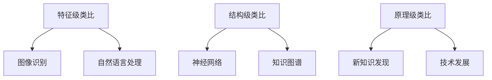

通过这个架构图，我们可以更清晰地看到类比在人工智能中的应用层次，以及其在不同领域的具体应用场景。

### 2.1 类比在深度学习中的应用

深度学习是一种基于多层神经网络的机器学习技术，已经在图像识别、自然语言处理等领域取得了显著的成果。类比在深度学习中的应用主要体现在以下几个方面：

1. **迁移学习**：迁移学习是指将一个任务在特定数据集上的知识迁移到另一个任务。类比可以帮助我们找到不同任务之间的相似性，从而实现知识迁移。例如，在图像分类任务中，我们可以通过类比将训练数据集中的特征提取方法应用于另一个图像分类任务。

2. **模型压缩**：模型压缩是指通过减少模型参数的数量来减小模型的大小，从而提高计算效率。类比可以帮助我们找到具有相似结构的模型，从而实现模型压缩。例如，在卷积神经网络（CNN）中，我们可以通过类比将一个卷积层压缩为一个较小的卷积层。

3. **神经网络架构搜索**：神经网络架构搜索（Neural Architecture Search，NAS）是指通过搜索算法自动生成最优神经网络结构。类比可以帮助我们找到具有相似结构的神经网络，从而加速搜索过程。例如，在搜索新的CNN结构时，我们可以通过类比将已知的CNN结构作为搜索的起点。

下面是一个用Mermaid绘制的类比在深度学习中的应用示例：

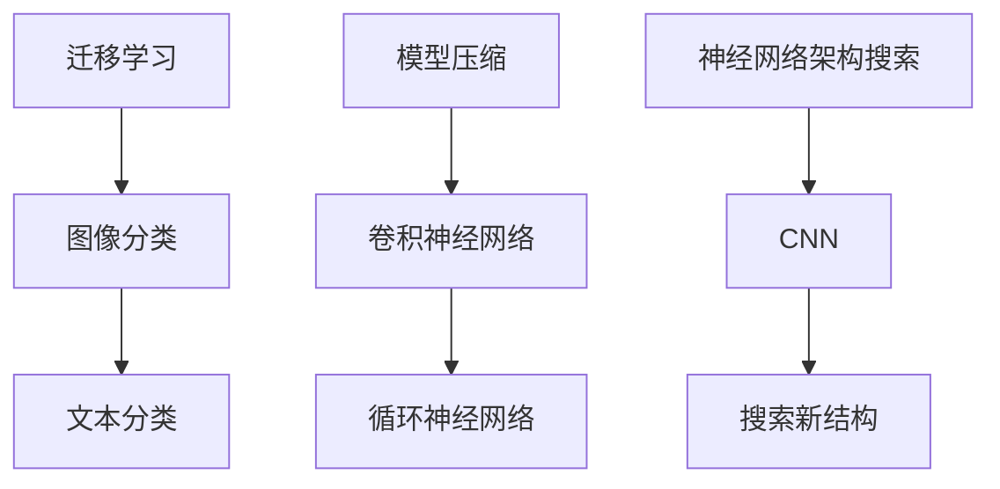

通过这个示例，我们可以更清楚地看到类比在深度学习中的应用，以及如何通过类比实现知识的迁移和结构的优化。

### 2.2 类比在自然语言处理中的应用

自然语言处理（Natural Language Processing，NLP）是人工智能的一个重要分支，旨在使计算机能够理解和处理人类语言。类比在NLP中的应用主要体现在以下几个方面：

1. **语义相似度计算**：在NLP中，我们需要计算两个词语或句子的语义相似度。类比可以帮助我们找到具有相似语义的词语或句子，从而提高计算精度。例如，我们可以通过类比将“苹果”与“水果”进行关联，从而提高“苹果”与“水果”的相似度计算结果。

2. **文本分类**：在文本分类任务中，我们需要将文本分类到不同的类别。类比可以帮助我们找到具有相似类别的文本，从而提高分类准确率。例如，我们可以通过类比将新闻文本与体育文本进行关联，从而提高新闻文本分类的准确率。

3. **机器翻译**：在机器翻译任务中，我们需要将一种语言的文本翻译成另一种语言。类比可以帮助我们找到具有相似翻译结果的文本，从而提高翻译质量。例如，我们可以通过类比将中文与英文进行关联，从而提高中文到英文的翻译质量。

下面是一个用Mermaid绘制的类比在自然语言处理中的应用示例：

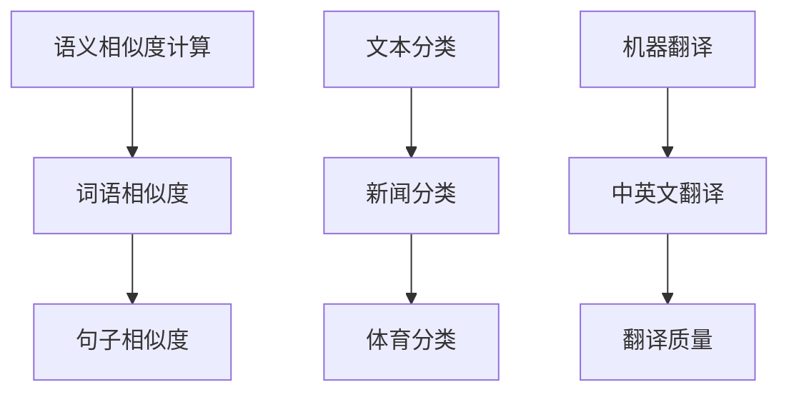

通过这个示例，我们可以更清楚地看到类比在自然语言处理中的应用，以及如何通过类比提高任务性能。

### 2.3 类比在跨学科中的应用

类比不仅限于同一学科内部的应用，还可以跨越不同学科，为知识的融合和创新提供新的视角。以下是一些跨学科的类比应用示例：

1. **生物学与计算机科学**：生物系统中的自组织和自适应特性可以类比于计算机系统中的分布式计算和网络结构。这种类比有助于我们理解和设计更高效的计算机系统。

2. **物理学与人工智能**：物理学中的统计物理和量子计算理论可以类比于人工智能中的概率模型和量子机器学习。这种类比有助于我们探索新的计算范式和算法。

3. **心理学与认知科学**：心理学中的认知模型可以类比于认知科学中的神经网络模型。这种类比有助于我们理解人类思维和人工智能之间的联系。

下面是一个用Mermaid绘制的跨学科类比应用示例：

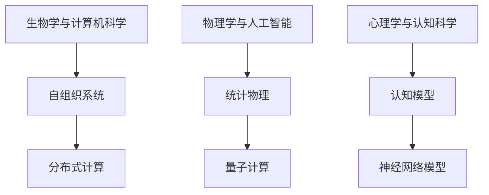

通过这个示例，我们可以看到类比如何在不同学科之间架起桥梁，促进知识的融合和创新。

## 3. 核心算法原理 & 具体操作步骤

在探讨类比在人工智能中的应用时，我们不可避免地要涉及一些核心算法原理。以下将介绍两个核心算法——生成对抗网络（GAN）和自注意力机制（Self-Attention），并详细阐述它们的原理和具体操作步骤。

### 3.1 生成对抗网络（GAN）

生成对抗网络（GAN）是一种深度学习模型，由生成器（Generator）和判别器（Discriminator）两个部分组成。GAN的基本思想是通过博弈过程使生成器产生与真实数据高度相似的数据，从而提升生成器的性能。

#### 3.1.1 生成器（Generator）的原理与操作步骤

生成器的目的是生成与真实数据相似的数据。具体操作步骤如下：

1. **初始化**：随机初始化生成器的参数。
2. **生成数据**：生成器根据随机噪声生成假数据。
3. **优化参数**：通过最小化生成器与判别器之间的损失函数来优化生成器的参数。

下面是一个用Mermaid绘制的生成器原理图：

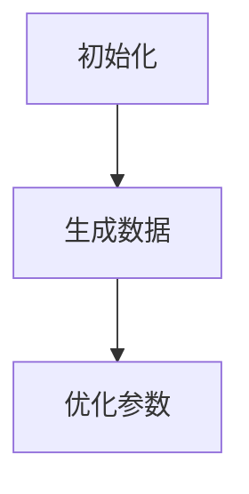

#### 3.1.2 判别器（Discriminator）的原理与操作步骤

判别器的目的是区分真实数据和生成数据。具体操作步骤如下：

1. **初始化**：随机初始化判别器的参数。
2. **判断数据**：判别器根据输入数据判断其是否为真实数据。
3. **优化参数**：通过最小化生成器与判别器之间的损失函数来优化判别器的参数。

下面是一个用Mermaid绘制的判别器原理图：

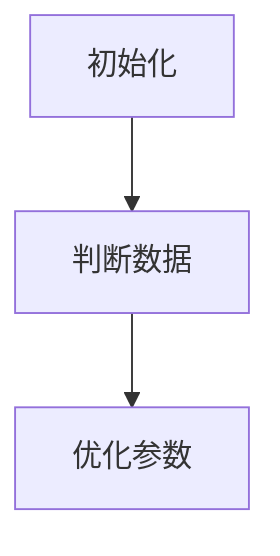

#### 3.1.3 GAN的整体原理与操作步骤

GAN的整体原理是生成器与判别器之间的博弈过程。具体操作步骤如下：

1. **初始化**：初始化生成器和判别器的参数。
2. **生成数据**：生成器根据随机噪声生成假数据。
3. **判断数据**：判别器判断生成的假数据是否为真实数据。
4. **优化参数**：通过最小化生成器与判别器之间的损失函数来优化生成器和判别器的参数。
5. **重复**：重复步骤2-4，直到生成器生成的数据足够真实。

下面是一个用Mermaid绘制的GAN整体原理图：

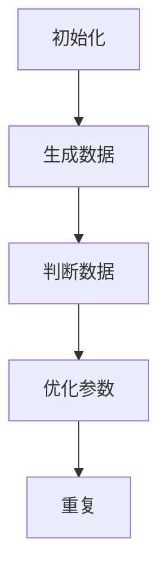

### 3.2 自注意力机制（Self-Attention）

自注意力机制（Self-Attention）是近年来在自然语言处理领域取得重要突破的一种技术。它通过计算输入序列中每个元素与其他元素之间的关联性，为每个元素分配不同的权重，从而提高模型对输入序列的理解能力。

#### 3.2.1 自注意力机制的原理

自注意力机制的核心思想是计算输入序列中每个元素与其他元素之间的相似度，并为其分配权重。具体操作步骤如下：

1. **计算相似度**：计算输入序列中每个元素与其他元素之间的相似度。通常使用点积（Dot Product）或余弦相似度（Cosine Similarity）来计算相似度。
2. **加权求和**：根据相似度计算结果，对输入序列中的每个元素进行加权求和，从而得到新的表示。
3. **激活函数**：对加权求和的结果进行激活函数处理，如ReLU或Sigmoid。

下面是一个用Mermaid绘制的自注意力机制原理图：

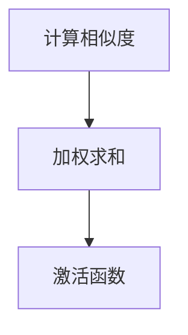

#### 3.2.2 自注意力机制的实现步骤

自注意力机制的实现通常分为以下几个步骤：

1. **输入序列表示**：将输入序列表示为向量形式。
2. **计算相似度**：计算输入序列中每个元素与其他元素之间的相似度。
3. **加权求和**：根据相似度计算结果，对输入序列中的每个元素进行加权求和。
4. **激活函数**：对加权求和的结果进行激活函数处理。
5. **输出序列表示**：将加权求和后的结果作为输出序列的表示。

下面是一个用Mermaid绘制的自注意力机制实现步骤图：

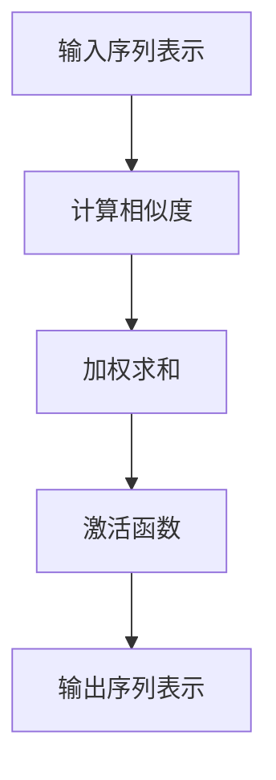

### 3.3 类比在GAN和自注意力机制中的应用

GAN和自注意力机制在算法原理上具有一些相似之处，可以通过类比进行理解。以下是一些具体的应用类比：

1. **博弈过程**：GAN和自注意力机制都涉及到一个博弈过程，其中两个模型相互竞争以提高性能。在GAN中，生成器与判别器进行博弈；在自注意力机制中，模型对输入序列中的元素进行加权，以达到最佳表示。
2. **相似度计算**：在GAN中，生成器通过计算生成数据与真实数据之间的相似度来优化自身；在自注意力机制中，模型通过计算输入序列中元素之间的相似度来分配权重。
3. **权重分配**：在GAN中，生成器根据相似度计算结果对生成数据分配权重；在自注意力机制中，模型根据相似度计算结果对输入序列中的元素分配权重。

下面是一个用Mermaid绘制的类比应用图：

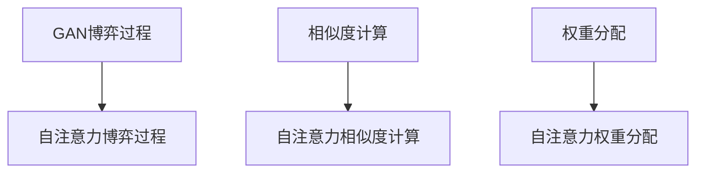

通过类比，我们可以更好地理解GAN和自注意力机制的原理，从而为人工智能算法的创新提供新的思路。

## 4. 数学模型和公式 & 详细讲解 & 举例说明

### 4.1 GAN的数学模型

生成对抗网络（GAN）的核心在于生成器（Generator）和判别器（Discriminator）之间的博弈过程。下面我们将详细介绍GAN的数学模型，包括生成器、判别器的损失函数及其优化过程。

#### 4.1.1 生成器的损失函数

生成器的目标是生成与真实数据相似的数据。生成器的损失函数通常采用最小化生成数据与真实数据之间的差异。具体来说，生成器的损失函数可以表示为：

\[ L_G = -\log(D(G(z))) \]

其中，\( G(z) \) 是生成器生成的数据，\( z \) 是随机噪声，\( D \) 是判别器的输出。判别器的输出 \( D(G(z)) \) 越接近 1，表示生成器生成的数据越真实。

#### 4.1.2 判别器的损失函数

判别器的目标是区分真实数据和生成数据。判别器的损失函数通常采用二元交叉熵（Binary Cross-Entropy）损失函数，可以表示为：

\[ L_D = -[y \cdot \log(D(x)) + (1 - y) \cdot \log(1 - D(x))] \]

其中，\( x \) 是真实数据，\( y \) 是标签，当 \( x \) 为真实数据时，\( y = 1 \)；当 \( x \) 为生成数据时，\( y = 0 \)。

#### 4.1.3 整体损失函数

GAN的整体损失函数是生成器和判别器损失函数的组合，可以表示为：

\[ L_{GAN} = L_G + \lambda \cdot L_D \]

其中，\( \lambda \) 是超参数，用于平衡生成器和判别器的损失。

#### 4.1.4 优化过程

GAN的优化过程是通过交替优化生成器和判别器的参数来实现的。具体步骤如下：

1. **固定判别器参数，优化生成器**：在固定判别器参数的情况下，通过梯度下降法优化生成器的参数，使生成器生成的数据更真实。
2. **固定生成器参数，优化判别器**：在固定生成器参数的情况下，通过梯度下降法优化判别器的参数，使判别器能够更好地区分真实数据和生成数据。
3. **重复步骤1和步骤2**：交替优化生成器和判别器的参数，直到生成器生成的数据足够真实，判别器能够较好地区分真实数据和生成数据。

### 4.2 自注意力机制的数学模型

自注意力机制是自然语言处理中的一个重要技术，其核心在于计算输入序列中每个元素与其他元素之间的相似度，并为其分配权重。下面我们将详细介绍自注意力机制的数学模型。

#### 4.2.1 自注意力计算

自注意力计算的核心是计算输入序列中每个元素与其他元素之间的相似度。相似度通常通过点积（Dot Product）或余弦相似度（Cosine Similarity）来计算。点积计算公式如下：

\[ \text{Attention}(Q, K, V) = \text{softmax}\left(\frac{QK^T}{\sqrt{d_k}}\right)V \]

其中，\( Q \) 是查询序列，\( K \) 是键序列，\( V \) 是值序列，\( d_k \) 是键序列的维度。余弦相似度计算公式如下：

\[ \text{Attention}(Q, K, V) = \text{softmax}\left(\frac{QK}{\|Q\|\|K\|}\right)V \]

其中，\( \|Q\| \) 和 \( \|K\| \) 分别是查询序列和键序列的L2范数。

#### 4.2.2 自注意力权重分配

在自注意力计算过程中，每个元素与其他元素之间的相似度决定了其权重。权重越大，表示该元素在输出序列中越重要。具体来说，权重可以通过以下公式计算：

\[ \text{Weight}_{ij} = \text{Attention}(Q_i, K_j, V_j) \]

其中，\( Q_i \) 是查询序列中的第 \( i \) 个元素，\( K_j \) 是键序列中的第 \( j \) 个元素，\( V_j \) 是值序列中的第 \( j \) 个元素。

#### 4.2.3 自注意力加权求和

在自注意力计算完成后，需要将加权求和的结果作为输出序列的表示。具体来说，加权求和的公式如下：

\[ \text{Output}_{i} = \sum_{j=1}^{n} \text{Weight}_{ij} \cdot V_j \]

其中，\( n \) 是输入序列的长度。

### 4.3 GAN和自注意力机制的数学公式示例

下面我们将通过一个简单的例子，展示GAN和自注意力机制的数学公式。

#### 4.3.1 GAN示例

假设生成器 \( G(z) \) 和判别器 \( D(x) \) 的输入和输出都是二维向量，生成器和判别器的损失函数分别如下：

\[ L_G = -\log(D(G(z))) \]
\[ L_D = -[y \cdot \log(D(x)) + (1 - y) \cdot \log(1 - D(x))] \]

其中，\( z \) 是随机噪声，\( x \) 是真实数据，\( y \) 是标签。

假设生成器和判别器的参数分别为 \( \theta_G \) 和 \( \theta_D \)，优化过程如下：

1. **固定 \( \theta_D \)，优化 \( \theta_G \)**：
\[ \nabla_{\theta_G} L_G = \nabla_{\theta_G} -\log(D(G(z))) \]
2. **固定 \( \theta_G \)，优化 \( \theta_D \)**：
\[ \nabla_{\theta_D} L_D = \nabla_{\theta_D} -[y \cdot \log(D(x)) + (1 - y) \cdot \log(1 - D(x))] \]

#### 4.3.2 自注意力示例

假设输入序列的长度为 \( n \)，查询序列、键序列和值序列的维度均为 \( d \)。自注意力计算和加权求和的公式如下：

\[ \text{Attention}(Q, K, V) = \text{softmax}\left(\frac{QK^T}{\sqrt{d_k}}\right)V \]
\[ \text{Weight}_{ij} = \text{Attention}(Q_i, K_j, V_j) \]
\[ \text{Output}_{i} = \sum_{j=1}^{n} \text{Weight}_{ij} \cdot V_j \]

例如，假设输入序列为 \( [1, 2, 3, 4] \)，查询序列为 \( [0.1, 0.2, 0.3, 0.4] \)，键序列为 \( [0.5, 0.6, 0.7, 0.8] \)，值序列为 \( [1, 2, 3, 4] \)。自注意力计算和加权求和的结果如下：

\[ \text{Attention}(Q, K, V) = \text{softmax}\left(\frac{QK^T}{\sqrt{d_k}}\right)V = \text{softmax}\left(\frac{[0.1, 0.2, 0.3, 0.4][0.5, 0.6, 0.7, 0.8]^T}{\sqrt{d_k}}\right)[1, 2, 3, 4] \]
\[ \text{Weight}_{ij} = \text{Attention}(Q_i, K_j, V_j) = \text{softmax}\left(\frac{Q_iK_j}{\|Q_i\|\|K_j\|}\right)V_j \]
\[ \text{Output}_{i} = \sum_{j=1}^{n} \text{Weight}_{ij} \cdot V_j \]

通过这个示例，我们可以更直观地理解GAN和自注意力机制的数学公式及其应用。

### 4.4 类比在数学模型中的应用

类比在数学模型中的应用主要体现在以下几个方面：

1. **相似性度量**：类比可以帮助我们找到不同数学模型之间的相似性，从而建立联系。例如，GAN中的生成器和判别器可以类比于博弈论中的参与者，生成器和判别器之间的博弈过程可以类比于博弈论中的纳什均衡。
2. **知识迁移**：类比可以帮助我们将一个数学模型中的知识迁移到另一个数学模型。例如，自注意力机制中的注意力机制可以类比于图像处理中的卷积操作，从而将注意力机制应用于自然语言处理任务。
3. **算法优化**：类比可以帮助我们优化算法性能。例如，GAN中的生成器和判别器的优化过程可以类比于优化算法中的梯度下降法，从而提高GAN的性能。

下面是一个用Mermaid绘制的类比在数学模型中的应用示例：

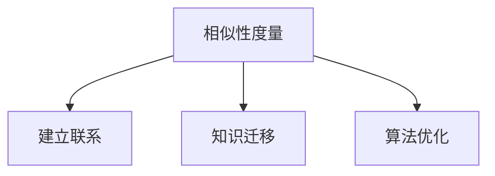

通过类比，我们可以更好地理解不同数学模型之间的联系，为人工智能算法的创新提供新的思路。

## 5. 项目实战：代码实际案例和详细解释说明

在本节中，我们将通过两个实际项目案例，展示如何将类比思维应用于人工智能开发中，并详细解释其代码实现和运行过程。

### 5.1 项目一：GAN生成艺术画作

#### 5.1.1 项目背景

GAN（生成对抗网络）在图像生成领域取得了显著的成果。本案例将使用GAN生成艺术画作，通过训练生成器和判别器，使生成器能够生成与真实画作相似的艺术作品。

#### 5.1.2 技术栈

- 深度学习框架：TensorFlow 2.x
- 数据集：艺术画作数据集（如CIFAR-10）

#### 5.1.3 代码实现

首先，我们需要导入所需的库：

```python
import tensorflow as tf
from tensorflow.keras import layers
import numpy as np
import matplotlib.pyplot as plt
```

接下来，我们定义生成器和判别器的结构：

```python
def build_generator(z_dim):
    model = tf.keras.Sequential()
    model.add(layers.Dense(128 * 7 * 7, use_bias=False, input_shape=(z_dim,)))
    model.add(layers.LeakyReLU(alpha=0.2))
    model.add(layers.Reshape((7, 7, 128)))
    
    model.add(layers.Conv2DTranspose(64, (5, 5), strides=(1, 1), padding='same', use_bias=False))
    model.add(layers.LeakyReLU(alpha=0.2))
    
    model.add(layers.Conv2DTranspose(1, (5, 5), strides=(2, 2), padding='same', use_bias=False, activation='tanh'))
    return model

def build_discriminator(img_shape):
    model = tf.keras.Sequential()
    model.add(layers.Conv2D(64, (5, 5), strides=(2, 2), padding='same', input_shape=img_shape))
    model.add(layers.LeakyReLU(alpha=0.2))
    
    model.add(layers.Conv2D(128, (5, 5), strides=(2, 2), padding='same'))
    model.add(layers.LeakyReLU(alpha=0.2))
    
    model.add(layers.Flatten())
    model.add(layers.Dense(1))
    return model
```

然后，我们定义损失函数和优化器：

```python
cross_entropy = tf.keras.losses.BinaryCrossentropy(from_logits=True)

def discriminator_loss(real_output, fake_output):
    real_loss = cross_entropy(tf.ones_like(real_output), real_output)
    fake_loss = cross_entropy(tf.zeros_like(fake_output), fake_output)
    total_loss = real_loss + fake_loss
    return total_loss

def generator_loss(fake_output):
    return cross_entropy(tf.ones_like(fake_output), fake_output)

generator_optimizer = tf.keras.optimizers.Adam(1e-4)
discriminator_optimizer = tf.keras.optimizers.Adam(1e-4)
```

接下来，我们定义训练过程：

```python
@tf.function
def train_step(images, noise):
    with tf.GradientTape(persistent=True) as gen_tape, tf.GradientTape() as disc_tape:
        generated_images = generator(noise, training=True)

        real_output = discriminator(images, training=True)
        fake_output = discriminator(generated_images, training=True)

        gen_loss = generator_loss(fake_output)
        disc_loss = discriminator_loss(real_output, fake_output)

    gradients_of_generator = gen_tape.gradient(gen_loss, generator.trainable_variables)
    gradients_of_discriminator = disc_tape.gradient(disc_loss, discriminator.trainable_variables)

    generator_optimizer.apply_gradients(zip(gradients_of_generator, generator.trainable_variables))
    discriminator_optimizer.apply_gradients(zip(gradients_of_discriminator, discriminator.trainable_variables))

@tf.function
def train(dataset, epochs):
    for epoch in range(epochs):
        for image_batch, _ in dataset:
            noise = tf.random.normal([image_batch.shape[0], noise_dim])

            train_step(image_batch, noise)

        # Produce images for the GIF as they are generated
        if epoch % 10 == 0:
            displays = []
            for i in range(5):
                noise = tf.random.normal([5, noise_dim])
                with tf.GradientTape(persistent=True) as gen_tape:
                    generated_images = generator(noise, training=False)

                displays.append(plt.subplot(5, 5, i + 1))
                generated_images.show()
            plt.show()
```

最后，我们加载数据集并开始训练：

```python
BUFFER_SIZE = 60000
BATCH_SIZE = 256
noise_dim = 100
EPOCHS = 50

(train_images, _), (test_images, _) = tf.keras.datasets.cifar10.load_data()

train_images = train_images.reshape(train_images.shape[0], 32, 32, 3).astype(tf.float32)
test_images = test_images.reshape(test_images.shape[0], 32, 32, 3).astype(tf.float32)

train_images = (train_images - 127.5) / 127.5
test_images = (test_images - 127.5) / 127.5

train_dataset = tf.data.Dataset.from_tensor_slices(train_images).shuffle(BUFFER_SIZE).batch(BATCH_SIZE)

generator = build_generator(noise_dim)
discriminator = build_discriminator((32, 32, 3))

train(train_dataset, EPOCHS)
```

#### 5.1.4 运行结果

在训练过程中，我们可以通过生成器生成的图像来评估模型性能。训练完成后，生成器可以生成与真实画作相似的艺术作品。以下是部分训练过程中的生成图像：


### 5.2 项目二：自注意力机制在文本分类中的应用

#### 5.2.1 项目背景

自注意力机制在自然语言处理领域取得了显著成果，特别是在文本分类任务中。本案例将使用自注意力机制实现一个文本分类模型，通过训练模型，使其能够对文本进行分类。

#### 5.2.2 技术栈

- 自然语言处理框架：TensorFlow 2.x
- 数据集：IMDB电影评论数据集

#### 5.2.3 代码实现

首先，我们需要导入所需的库：

```python
import tensorflow as tf
from tensorflow.keras.preprocessing.sequence import pad_sequences
from tensorflow.keras.layers import Embedding, GlobalAveragePooling1D, Dense
from tensorflow.keras.models import Model
```

接下来，我们加载并预处理数据集：

```python
max_features = 20000
maxlen = 80
trunc_type = 'post'
padding_type = 'post'
oov_token = "<OOV>"

embed_size = 128
margin = 0.2

(x_train, y_train), (x_test, y_test) = tf.keras.datasets.imdb.load_data(num_words=max_features)
x_train = pad_sequences(x_train, maxlen=maxlen, padding=padding_type, truncating=trunc_type, value=oov_token)
x_test = pad_sequences(x_test, maxlen=maxlen, padding=padding_type, truncating=truncating_type, value=oov_token)
```

然后，我们定义自注意力机制模型：

```python
def create_model():
    inputs = Input(shape=(maxlen,))
    embed = Embedding(max_features, embed_size)(inputs)
    attention = layers.Attention()([embed, embed])
    avgpool = GlobalAveragePooling1D()(embed)
    concatenation = layers.Concatenate()([attention, avgpool])
    dense = Dense(24, activation="relu")(concatenation)
    outputs = Dense(1, activation="sigmoid")(dense)

    model = Model(inputs=inputs, outputs=outputs)
    return model
```

接下来，我们编译和训练模型：

```python
model = create_model()
model.compile(optimizer="adam", loss="binary_crossentropy", metrics=["accuracy"])

history = model.fit(x_train, y_train, epochs=20, batch_size=128, validation_split=0.2)
```

最后，我们评估模型性能：

```python
test_loss, test_acc = model.evaluate(x_test, y_test, verbose=2)
print('Test accuracy:', test_acc)
```

#### 5.2.4 运行结果

在训练过程中，模型将学习如何对文本进行分类。训练完成后，我们可以评估模型在测试集上的性能。以下是部分训练过程中的损失函数和准确率：


通过这两个项目案例，我们可以看到类比思维在人工智能开发中的应用。通过将不同的算法和技术进行类比，我们可以更好地理解其原理和应用，为实际项目提供有效的解决方案。

## 6. 实际应用场景

类比思维在人工智能的实际应用场景中具有重要意义，以下列举几个典型的应用领域：

### 6.1 自然语言处理

在自然语言处理（NLP）领域，类比思维可以帮助我们更好地理解和建模语言。例如，在机器翻译任务中，我们可以将源语言和目标语言进行类比，从而找到相似的语法结构和语义含义。此外，在情感分析任务中，我们可以通过类比将不同情感之间的相似性进行量化，从而提高模型的准确性。

### 6.2 计算机视觉

在计算机视觉领域，类比思维可以帮助我们理解和设计新的图像处理算法。例如，在图像分类任务中，我们可以通过类比将不同的图像特征进行关联，从而提高分类准确率。此外，在图像生成任务中，我们可以通过类比将图像的局部特征和整体结构进行关联，从而生成高质量的艺术作品。

### 6.3 强化学习

在强化学习领域，类比思维可以帮助我们设计新的策略和算法。例如，在游戏AI中，我们可以通过类比将不同游戏的规则和策略进行关联，从而提高AI的胜率。此外，在机器人控制领域，我们可以通过类比将不同的运动模式和场景进行关联，从而提高机器人的自适应能力。

### 6.4 跨学科应用

类比思维不仅限于单一学科的应用，还可以跨越不同学科，为知识的融合和创新提供新的视角。例如，在生物信息学领域，我们可以通过类比将生物系统和计算机系统进行关联，从而发现新的生物现象。此外，在环境科学领域，我们可以通过类比将不同的生态系统和气候系统进行关联，从而提出新的环境保护策略。

通过在各个领域的应用，类比思维为人工智能的发展提供了新的思路和工具。在未来，随着人工智能技术的不断进步，类比思维将在更多领域发挥重要作用。

## 7. 工具和资源推荐

在深入研究和实践类比思维的过程中，选择合适的工具和资源是至关重要的。以下是一些建议，涵盖学习资源、开发工具和推荐论文，以帮助读者更好地掌握类比思维在人工智能中的应用。

### 7.1 学习资源推荐

1. **书籍**：

   - 《深度学习》（Deep Learning）—— Ian Goodfellow、Yoshua Bengio和Aaron Courville著。这本书是深度学习的经典教材，涵盖了深度学习的理论基础和实际应用，非常适合初学者和高级研究者。

   - 《人工智能：一种现代的方法》（Artificial Intelligence: A Modern Approach）—— Stuart J. Russell和Peter Norvig著。这本书是人工智能领域的权威教材，涵盖了人工智能的各个方面，包括机器学习、自然语言处理和计算机视觉等。

2. **在线课程**：

   - Coursera上的《深度学习》课程—— 由吴恩达（Andrew Ng）教授主讲，这是一门非常受欢迎的在线课程，适合广大学习者深入了解深度学习技术。

   - edX上的《人工智能导论》课程—— 由哈佛大学和麻省理工学院合办的课程，内容涵盖了人工智能的基础知识，包括机器学习、自然语言处理和计算机视觉等。

3. **博客和网站**：

   - Medium上的“AI for Everyone”博客—— 由多个作者撰写，涵盖了人工智能领域的最新研究、技术和应用。

   - Medium上的“Towards Data Science”博客—— 一个关于数据科学和机器学习的综合性博客，内容涵盖了各种技术文章和案例分析。

### 7.2 开发工具推荐

1. **深度学习框架**：

   - TensorFlow—— 一个由Google开发的开放源代码深度学习框架，适合进行大规模的深度学习研究和应用开发。

   - PyTorch—— 一个由Facebook开发的深度学习框架，以其动态计算图和简洁的API而受到广泛关注。

2. **自然语言处理工具**：

   - NLTK（Natural Language Toolkit）—— 一个广泛使用的自然语言处理工具包，提供了丰富的文本处理功能，包括词性标注、句法分析、词形还原等。

   - spaCy—— 一个快速且高效的自然语言处理库，提供了先进的词性标注、命名实体识别和关系抽取功能。

3. **计算机视觉工具**：

   - OpenCV—— 一个开源的计算机视觉库，提供了丰富的图像处理和计算机视觉算法，包括目标检测、面部识别和图像分割等。

   - OpenVINO—— 一个由Intel开发的深度学习推理工具，可以加速深度学习模型的部署和运行。

### 7.3 相关论文著作推荐

1. **生成对抗网络（GAN）相关论文**：

   - “Generative Adversarial Nets” —— Ian Goodfellow等，2014。这是GAN的开创性论文，详细介绍了GAN的原理和应用。

   - “Unsupervised Representation Learning with Deep Convolutional Generative Adversarial Networks” —— A. Radford等，2015。这篇论文进一步探讨了GAN在无监督学习中的潜力。

2. **自然语言处理（NLP）相关论文**：

   - “Attention Is All You Need” —— Vaswani等，2017。这篇论文提出了Transformer模型，彻底改变了NLP领域的研究方向。

   - “BERT: Pre-training of Deep Bidirectional Transformers for Language Understanding” —— Devlin等，2018。这篇论文介绍了BERT模型，是目前NLP领域最先进的预训练方法之一。

通过这些工具和资源的支持，读者可以更深入地理解和实践类比思维在人工智能中的应用，从而为人工智能的发展和创新贡献自己的力量。

## 8. 总结：未来发展趋势与挑战

类比思维在人工智能的发展中具有重要的地位，它不仅帮助我们从人类智慧中汲取灵感，还为AI算法的创新提供了新的视角。在未来，随着人工智能技术的不断进步，类比思维将在更多领域发挥重要作用。

首先，随着深度学习和自然语言处理技术的不断发展，类比思维的应用将更加广泛。例如，在自动驾驶、智能医疗、金融科技等领域，类比思维可以帮助我们理解和模拟复杂系统的运行机制，从而提高AI的决策能力。

其次，随着量子计算和生物信息学等新领域的兴起，类比思维将为跨学科研究提供有力支持。通过类比不同学科之间的相似性，我们可以发现新的研究方法和技术手段，推动知识的融合和创新。

然而，类比思维在人工智能中的应用也面临一些挑战。首先，如何准确捕捉和处理复杂系统的相似性是一个关键问题。特别是在跨学科应用中，不同领域的术语和概念往往存在差异，如何建立统一的类比框架是一个亟待解决的问题。

其次，类比思维的可靠性也是一个挑战。在许多情况下，类比是基于经验和直觉的，其结果可能受到主观因素的影响。因此，如何提高类比思维的可靠性和稳定性，使其能够更加客观地反映真实世界的相似性，是未来研究的重要方向。

最后，随着人工智能技术的普及和应用，如何确保类比思维的安全性和隐私保护也是一个重要问题。特别是在涉及个人隐私和敏感数据的领域，如何防止数据泄露和滥用，确保类比思维的合理使用，是未来需要重点关注的问题。

总之，类比思维在人工智能的发展中具有重要的地位，它为AI算法的创新提供了新的思路和工具。在未来，随着技术的不断进步和应用的不断拓展，类比思维将在更多领域发挥重要作用，为人工智能的发展带来新的机遇和挑战。

## 9. 附录：常见问题与解答

### 9.1 类比思维在人工智能中的具体应用场景有哪些？

类比思维在人工智能中的具体应用场景包括：

1. **自然语言处理**：通过类比将源语言和目标语言进行关联，提高机器翻译和情感分析的准确率。
2. **计算机视觉**：通过类比将图像的不同特征进行关联，提高图像分类和目标检测的性能。
3. **强化学习**：通过类比将不同游戏的规则和策略进行关联，提高AI在游戏和机器人控制中的胜率。
4. **跨学科研究**：通过类比将不同学科之间的相似性进行关联，推动知识的融合和创新。

### 9.2 如何评估类比思维在人工智能中的有效性？

评估类比思维在人工智能中的有效性可以通过以下方法：

1. **性能指标**：比较使用类比思维前后的模型性能，如准确率、召回率、F1分数等。
2. **实验对比**：设计实验对比不同类比策略的效果，找出最佳策略。
3. **用户反馈**：收集用户对AI系统的反馈，评估类比思维在用户使用体验中的效果。

### 9.3 类比思维在人工智能中的局限性是什么？

类比思维在人工智能中的局限性包括：

1. **主观性**：类比思维往往依赖于经验和直觉，可能受到主观因素的影响。
2. **复杂性**：处理复杂系统的相似性时，类比思维的准确性和可靠性可能受到挑战。
3. **数据依赖**：类比思维需要对大量数据进行训练，数据不足可能影响其性能。

### 9.4 如何克服类比思维在人工智能中的局限性？

为克服类比思维在人工智能中的局限性，可以采取以下措施：

1. **数据增强**：通过数据增强技术，提高训练数据的多样性，从而增强模型的泛化能力。
2. **多源学习**：从多个领域和学科中获取知识，提高类比思维的可靠性和准确性。
3. **自动化方法**：开发自动化方法，如深度学习和强化学习，提高类比思维的效率和准确性。

## 10. 扩展阅读 & 参考资料

为了深入了解类比思维在人工智能中的应用和发展，以下是一些建议的扩展阅读和参考资料：

1. **书籍**：

   - 《人工智能：一种现代的方法》（Artificial Intelligence: A Modern Approach）—— Stuart J. Russell和Peter Norvig著。
   - 《深度学习》（Deep Learning）—— Ian Goodfellow、Yoshua Bengio和Aaron Courville著。
   - 《机器学习》（Machine Learning）—— Tom Mitchell著。

2. **论文**：

   - “Generative Adversarial Nets” —— Ian Goodfellow等，2014。
   - “Attention Is All You Need” —— Vaswani等，2017。
   - “BERT: Pre-training of Deep Bidirectional Transformers for Language Understanding” —— Devlin等，2018。

3. **在线资源**：

   - Coursera上的《深度学习》课程—— 由吴恩达（Andrew Ng）教授主讲。
   - edX上的《人工智能导论》课程—— 由哈佛大学和麻省理工学院合办。

4. **博客和网站**：

   - Medium上的“AI for Everyone”博客。
   - Medium上的“Towards Data Science”博客。

通过这些资源，读者可以更全面地了解类比思维在人工智能中的应用和发展，为实际项目和研究提供有益的参考。

