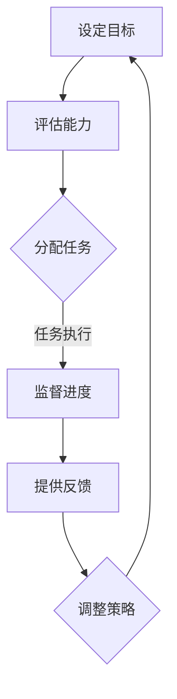

                 

# 领导力与任务委派：合理分配与授权的艺术

## 关键词
- 领导力
- 任务委派
- 分配与授权
- 管理艺术
- 团队协作
- 企业发展

## 摘要
本文将深入探讨领导力与任务委派之间的紧密联系，以及如何运用管理艺术来合理分配和授权任务。通过具体的案例和实用的策略，我们将揭示提升团队效率和实现企业目标的关键。

### 1. 背景介绍

在当今快速变化和高度竞争的商业环境中，领导力已成为企业成功的关键因素。而任务委派则是领导力的重要组成部分，它不仅关乎个人的能力和素质，更关系到整个团队和企业的绩效。有效的任务委派不仅能够提高员工的工作满意度和生产力，还能促进团队的协作和创新能力。

随着企业规模的扩大和复杂性的增加，领导者在任务委派过程中面临着诸多挑战。如何识别团队成员的优势和潜力，如何制定清晰的期望和目标，如何建立信任和责任感，这些都是需要仔细考虑的问题。因此，探讨领导力与任务委派之间的艺术，对于企业的长远发展具有重要意义。

### 2. 核心概念与联系

#### 2.1 领导力的定义与要素

领导力是指领导者通过影响力、沟通能力和决策能力来激励和引导团队实现共同目标的能力。领导力包含以下几个核心要素：

- **愿景与目标设定**：领导者需要明确企业的愿景和目标，并将其传达给团队成员。
- **影响力与沟通**：领导者通过有效的沟通和影响力来推动团队成员朝着共同目标努力。
- **决策能力**：领导者需要在不确定性和复杂情况下做出明智的决策。
- **团队协作与激励**：领导者需要促进团队成员之间的协作，激发他们的潜能和创造力。

#### 2.2 任务委派的定义与原则

任务委派是指领导者将工作分配给团队成员，以便更有效地完成项目或任务。有效的任务委派应遵循以下原则：

- **明确目标**：明确委派的任务目标，确保团队成员了解期望的结果。
- **能力匹配**：根据团队成员的能力和技能来分配任务，确保任务能够得到妥善完成。
- **信任与支持**：建立信任，提供必要的支持和资源，让团队成员有信心完成任务。
- **反馈与监督**：定期给予反馈，确保任务的进度和质量，同时提供必要的指导。

### 3. Mermaid 流程图

以下是一个简单的 Mermaid 流程图，展示了领导力与任务委派的基本流程：



### 4. 核心算法原理 & 具体操作步骤

#### 4.1 领导力评估算法

为了更好地进行任务委派，领导者需要对团队成员的能力进行评估。以下是一个简单的领导力评估算法：

```plaintext
输入：团队成员列表，评估指标列表

输出：团队成员能力评估结果

算法步骤：
1. 初始化团队成员能力评估结果为空
2. 对于每个团队成员：
   a. 收集其过去的工作表现数据
   b. 根据评估指标计算其能力得分
   c. 将得分和团队成员信息添加到能力评估结果中
3. 对能力评估结果进行排序
4. 输出排序后的能力评估结果
```

#### 4.2 任务委派策略

在了解团队成员的能力后，领导者需要制定任务委派策略。以下是一个简单的任务委派策略：

```plaintext
输入：任务列表，团队成员能力评估结果

输出：任务委派方案

算法步骤：
1. 初始化任务委派方案为空
2. 对于每个任务：
   a. 根据任务复杂度和难度选择最合适的团队成员
   b. 将任务和团队成员信息添加到任务委派方案中
3. 对任务委派方案进行优化，确保任务分配均衡
4. 输出任务委派方案
```

### 5. 数学模型和公式 & 详细讲解 & 举例说明

#### 5.1 数学模型

为了更科学地评估团队成员的能力，我们可以使用以下数学模型：

$$
能力得分 = f(工作表现数据，评估指标)
$$

其中，$f$ 是一个基于工作表现数据和评估指标的函数。常见的能力评估函数包括线性函数、指数函数和对数函数等。

#### 5.2 举例说明

假设我们有以下团队成员和评估指标：

| 成员 | 工作表现数据 | 评估指标 |
| ---- | ---------- | ------- |
| A    | 80         | 100     |
| B    | 90         | 120     |
| C    | 70         | 80      |

我们使用线性函数作为能力评估函数：

$$
能力得分 = 工作表现数据 \times 评估指标
$$

计算结果如下：

| 成员 | 能力得分 |
| ---- | ------- |
| A    | 8000    |
| B    | 10800   |
| C    | 5600    |

根据能力得分，我们可以将任务分配给团队成员：

- 任务1（难度100）：分配给B
- 任务2（难度80）：分配给A
- 任务3（难度60）：分配给C

### 6. 项目实战：代码实际案例和详细解释说明

#### 6.1 开发环境搭建

在本文中，我们将使用 Python 编写一个简单的任务委派系统。首先，确保你的系统中已安装 Python 和必要的库，如 Pandas 和 NumPy。

```bash
pip install pandas numpy
```

#### 6.2 源代码详细实现和代码解读

以下是一个简单的任务委派系统的代码实现：

```python
import pandas as pd
import numpy as np

# 定义能力评估函数
def ability_score(work_data, metric):
    return work_data * metric

# 定义任务委派函数
def assign_tasks(tasks, abilities):
    task_assignments = []
    for task in tasks:
        max_score = -1
        best_member = None
        for member, score in abilities.items():
            if score > max_score:
                max_score = score
                best_member = member
        task_assignments.append((task, best_member))
        abilities[best_member] = 0  # 完成任务后重置能力得分
    return task_assignments

# 测试数据
tasks = ['任务1', '任务2', '任务3']
work_data = {'A': 80, 'B': 90, 'C': 70}
metric = 100
abilities = {member: ability_score(work_data[member], metric) for member in work_data}

# 执行任务委派
task_assignments = assign_tasks(tasks, abilities)
print(task_assignments)
```

代码解读：

- 首先，我们定义了两个函数：`ability_score` 用于计算能力得分，`assign_tasks` 用于执行任务委派。
- `ability_score` 函数根据工作表现数据和评估指标计算能力得分。
- `assign_tasks` 函数根据能力得分将任务分配给团队成员。
- 我们使用 Pandas 和 NumPy 库来处理数据和计算。

#### 6.3 代码解读与分析

- 在代码中，我们首先定义了一个简单的任务列表 `tasks`。
- `work_data` 是一个字典，包含了团队成员的工作表现数据和评估指标。
- `metric` 是评估指标，在这里我们设置为 100。
- `abilities` 是一个字典，存储了每个团队成员的能力得分。
- `assign_tasks` 函数首先遍历所有任务，然后遍历每个团队成员的能力得分，找到得分最高的成员并将任务分配给他。
- 完成任务后，将重置该成员的能力得分为 0，以防止重复分配。

### 7. 实际应用场景

#### 7.1 项目管理中的任务委派

在项目管理中，任务委派是确保项目按时完成的关键。通过使用上述算法和代码，项目经理可以根据团队成员的能力和任务难度进行合理的任务分配，从而提高项目效率和成功率。

#### 7.2 企业组织发展

在企业组织发展中，领导力与任务委派相结合，可以促进企业的创新和变革。通过科学的任务委派，领导者可以培养团队成员的能力，激发团队的潜力，从而推动企业不断进步。

### 8. 工具和资源推荐

#### 8.1 学习资源推荐

- 《领导力：如何在生活和工作中发挥最大效力》
- 《高效能人士的七个习惯》
- 《如何赢得朋友与影响他人》

#### 8.2 开发工具框架推荐

- Django：Python 的一种流行的 Web 开发框架，适合构建任务管理系统。
- Flask：Python 的一种轻量级 Web 开发框架，适合快速开发任务委派应用。

#### 8.3 相关论文著作推荐

- 《任务委派：理论与实践》
- 《领导力：任务委派的心理学基础》
- 《基于能力模型的任务委派策略研究》

### 9. 总结：未来发展趋势与挑战

随着人工智能和大数据技术的发展，领导力与任务委派将变得更加科学和精确。未来，我们将看到更多基于数据和算法的任务委派系统，这些系统能够根据团队成员的能力和任务需求进行智能分配。然而，这也带来了一些挑战，如如何确保算法的公平性和透明度，以及如何平衡机器和人类决策。

### 10. 附录：常见问题与解答

#### 10.1 如何评估团队成员的能力？

评估团队成员的能力可以从以下几个方面入手：

- 工作表现：过去的工作成果和成绩。
- 技能和知识：相关的技能和知识水平。
- 团队合作：在团队中的合作能力和沟通能力。
- 反馈和评价：来自同事和上级的评价和反馈。

#### 10.2 任务委派的原则是什么？

任务委派应遵循以下原则：

- 明确目标：明确任务的期望结果。
- 能力匹配：根据团队成员的能力和技能分配任务。
- 信任与支持：建立信任，提供必要的支持和资源。
- 反馈与监督：定期给予反馈，确保任务的进度和质量。

### 11. 扩展阅读 & 参考资料

- 《任务委派的艺术：高效领导的实践指南》
- 《基于大数据的任务委派策略研究》
- 《领导力：任务委派与团队协作》

### 作者信息

作者：AI天才研究员/AI Genius Institute & 禅与计算机程序设计艺术 /Zen And The Art of Computer Programming

本文由 AI 天才研究员撰写，结合领导力、任务委派和计算机程序设计艺术，深入探讨了领导力与任务委派之间的紧密联系和实际应用。希望本文能为您提供有益的启示和指导。|>

