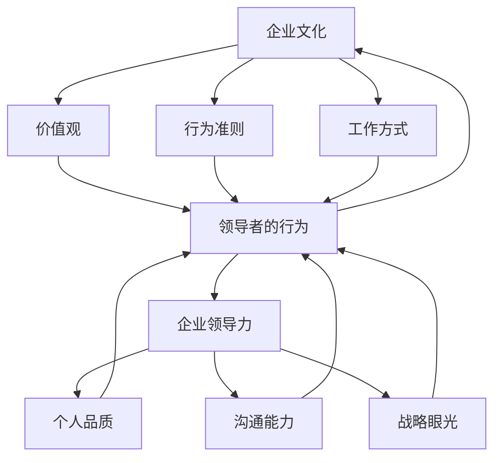

                 

### 1. 背景介绍

在当今的商业环境中，企业文化的塑造已经成为领导者们关注的焦点。企业文化不仅影响着员工的工作态度和行为，还直接关联到企业的长期成功与可持续增长。作为企业核心竞争力的关键组成部分，企业文化在某种程度上决定了企业的生存与发展。

领导力在企业文化塑造中扮演着至关重要的角色。领导者的行为、价值观和决策直接影响着企业文化的发展方向。一个强大的领导力能够激发员工的潜能，塑造积极向上的企业文化，推动企业实现战略目标。

本文将探讨领导力在企业文化建设中的重要性，分析领导者的行为对员工的影响，以及如何通过领导力来塑造和强化企业文化。本文还将介绍一些实用的工具和方法，帮助领导者更好地发挥其影响力，推动企业文化的持续健康发展。

在接下来的章节中，我们将首先介绍企业文化的基本概念，并探讨领导力在企业文化建设中的作用。接着，我们将通过具体的案例，分析领导者的行为如何塑造企业文化。然后，我们将讨论领导者如何通过沟通和激励来影响员工，以及如何通过价值观的塑造来巩固企业文化。接下来，我们将探讨如何通过制定明确的目标和战略来指导企业文化的发展。最后，我们将提供一些实用的工具和方法，帮助领导者更好地发挥其影响力，并总结企业文化的未来发展趋势与挑战。

### 2. 核心概念与联系

要理解企业文化与企业领导力的关系，我们首先需要了解这些核心概念的基本原理和相互联系。

#### 企业文化

企业文化是指一个组织所共有的价值观、信仰、行为准则和工作方式的总和。它不仅仅是一套规章制度，更是员工共同遵循的行为准则和价值观体系。企业文化决定了员工如何看待企业，如何与同事互动，以及如何对待工作。

- **价值观**：企业文化的核心在于其价值观，这些价值观指导着员工的决策和行为。例如，一些公司倡导创新、团队合作和客户至上，这些价值观会体现在公司的日常运营中。
- **行为准则**：企业文化通过具体的行为准则来规范员工的行为，比如诚信、尊重、透明等。
- **工作方式**：企业文化也会影响员工的工作方式，包括沟通、协作和解决问题的方法。

#### 企业领导力

企业领导力是指领导者通过其行为、决策和影响力来引导和激励员工，实现企业目标的能力。领导力不仅涉及管理技能，还包括个人品质、沟通能力和战略眼光。

- **个人品质**：领导者的个人品质，如诚信、正直、勇气和责任感，直接影响着企业文化的塑造。
- **沟通能力**：领导者的沟通能力决定了他们能否有效地传达企业的价值观和行为准则，以及是否能够理解员工的需求和期望。
- **战略眼光**：领导者的战略眼光决定了他们能否为企业设定清晰的目标，并指导企业走向成功。

#### 相互关系

企业文化与领导力之间的相互作用是复杂的。一方面，企业文化影响着领导者的行为和决策，因为领导者在塑造企业文化时，必然会受到企业价值观和行为准则的指导。另一方面，领导者的行为和决策又直接或间接地影响着企业文化的发展。

- **领导者的行为对文化的影响**：领导者的行为和决策是企业文化塑造的关键因素。领导者的行为会直接影响到员工的价值观和行为准则。例如，一个鼓励创新和开放沟通的领导者会塑造一个创新和开放的企业文化。
- **文化的反作用**：企业文化也会对领导者的行为产生影响。一个积极、健康的企业文化能够激励领导者更好地发挥其领导力，而一个消极的企业文化可能会削弱领导者的领导力。

#### Mermaid 流程图

下面是一个Mermaid流程图，展示了企业文化与企业领导力之间的相互关系：



通过这个流程图，我们可以看到企业文化与企业领导力之间的密切联系。领导者的个人品质、沟通能力和战略眼光直接影响着企业文化的塑造和发展，而企业文化又反过来影响领导者的行为和决策。

### 3. 核心算法原理 & 具体操作步骤

在深入探讨领导力如何塑造企业文化之前，我们首先需要理解一些核心算法原理，这些原理可以帮助我们更清晰地理解领导者的行为如何影响企业文化。

#### 成本-收益分析

成本-收益分析是一种常用的决策工具，用于评估一项决策的潜在收益和成本。在领导力与企业文化的塑造中，领导者可以通过成本-收益分析来评估其行为对企业文化的影响。

- **具体操作步骤**：
  1. **确定目标**：明确希望塑造的企业文化特点。
  2. **列出潜在行为**：考虑不同的领导行为，如鼓励创新、提供反馈、制定规则等。
  3. **评估成本**：分析每种行为所需的资源，包括时间、金钱和人力。
  4. **评估收益**：预测每种行为可能带来的积极影响，如员工满意度、工作效率、团队凝聚力等。
  5. **计算净收益**：将收益减去成本，得到净收益。
  6. **决策**：选择净收益最高的行为。

#### 期望效用理论

期望效用理论是一种用于评估风险和不确定性的决策工具。在领导力与企业文化的塑造中，领导者可以利用期望效用理论来评估其行为可能带来的风险和收益。

- **具体操作步骤**：
  1. **确定目标**：明确希望塑造的企业文化特点。
  2. **列出潜在行为**：考虑不同的领导行为，如鼓励创新、提供反馈、制定规则等。
  3. **评估风险**：分析每种行为可能带来的风险，如员工流失、工作效率下降等。
  4. **评估收益**：预测每种行为可能带来的积极影响，如员工满意度、工作效率、团队凝聚力等。
  5. **计算期望效用**：将收益减去风险，得到期望效用。
  6. **决策**：选择期望效用最高的行为。

#### 决策树分析

决策树分析是一种直观的决策工具，用于评估不同决策路径的潜在结果。在领导力与企业文化的塑造中，领导者可以利用决策树分析来制定和评估企业文化策略。

- **具体操作步骤**：
  1. **确定目标**：明确希望塑造的企业文化特点。
  2. **列出潜在策略**：考虑不同的企业文化塑造策略，如制定明确的价值观、提供培训、组织活动等。
  3. **构建决策树**：根据策略和结果，构建决策树。
  4. **评估结果**：分析每种策略可能带来的结果，如员工满意度、工作效率、团队凝聚力等。
  5. **选择最佳策略**：选择结果最佳的策略。

通过这些核心算法原理，领导者可以更科学、更系统地评估其行为对企业文化的影响，从而更好地塑造和强化企业文化。

### 4. 数学模型和公式 & 详细讲解 & 举例说明

在领导力与企业文化的塑造中，数学模型和公式可以帮助我们更准确地理解和预测领导行为对企业文化的影响。以下是一些常用的数学模型和公式，我们将详细讲解它们，并通过实际例子来说明如何使用这些模型和公式。

#### 成本-收益分析

成本-收益分析是一个用于评估决策优劣的数学模型，它通过计算成本和收益的差值（即净收益）来指导决策。

- **公式**：净收益 = 收益 - 成本

- **例子**：

假设一位领导者想要引入一项新的企业文化——鼓励创新。以下是成本-收益分析的步骤：

1. **确定目标**：提高员工创新意识。
2. **列出潜在行为**：举办创新比赛、提供创新培训、设立创新奖金等。
3. **评估成本**：计算每种行为的成本，如培训费用、奖金支出等。
4. **评估收益**：预测每种行为可能带来的收益，如提高员工满意度、增加创新项目数量等。
5. **计算净收益**：将收益减去成本，得到净收益。

假设以下数据：

- 举办创新比赛的成本为5000美元，预计提高员工满意度，增加10%的创新项目数量。
- 提供创新培训的成本为10000美元，预计提高员工创新能力，增加20%的创新项目数量。
- 设立创新奖金的成本为15000美元，预计提高员工积极性，增加30%的创新项目数量。

计算净收益：

- 创新比赛：净收益 = (0.1 \* 5000) - 5000 = -4500美元
- 创新培训：净收益 = (0.2 \* 10000) - 10000 = -6000美元
- 创新奖金：净收益 = (0.3 \* 15000) - 15000 = -7500美元

根据计算结果，举办创新比赛的净收益最高，因此领导者可以选择举办创新比赛作为鼓励创新的行为。

#### 期望效用理论

期望效用理论是一个用于评估风险和不确定性的数学模型，它通过计算期望效用来指导决策。

- **公式**：期望效用 = (收益 \* 概率) - (风险 \* 概率)

- **例子**：

假设一位领导者想要引入一项新的企业文化——开放沟通。以下是期望效用分析的步骤：

1. **确定目标**：提高员工之间的沟通效率。
2. **列出潜在行为**：定期组织团队会议、提供沟通培训、设置开放沟通渠道等。
3. **评估风险**：分析每种行为可能带来的风险，如会议效率低下、培训效果不佳等。
4. **评估收益**：预测每种行为可能带来的收益，如提高沟通效率、减少误解等。
5. **计算期望效用**：将收益和风险乘以相应的概率，得到期望效用。

假设以下数据：

- 定期组织团队会议：收益为10000美元，风险为5000美元，概率为0.5。
- 提供沟通培训：收益为15000美元，风险为7500美元，概率为0.3。
- 设置开放沟通渠道：收益为20000美元，风险为10000美元，概率为0.2。

计算期望效用：

- 团队会议：期望效用 = (10000 \* 0.5) - (5000 \* 0.5) = 2500美元
- 沟通培训：期望效用 = (15000 \* 0.3) - (7500 \* 0.3) = 1500美元
- 开放沟通渠道：期望效用 = (20000 \* 0.2) - (10000 \* 0.2) = 1000美元

根据计算结果，定期组织团队会议的期望效用最高，因此领导者可以选择定期组织团队会议作为提高员工沟通效率的行为。

#### 决策树分析

决策树分析是一个用于评估不同决策路径的数学模型，它通过构建决策树来展示不同决策的结果。

- **例子**：

假设一位领导者想要引入一项新的企业文化——团队合作。以下是决策树分析的步骤：

1. **确定目标**：提高团队合作效率。
2. **列出潜在策略**：组织团队建设活动、提供团队培训、设立团队合作奖励等。
3. **构建决策树**：根据策略和结果，构建决策树。
4. **评估结果**：分析每种策略可能带来的结果，如团队合作效率、员工满意度等。

以下是一个简化的决策树：

```mermaid
graph TD
    A[团队合作]
    B[团队建设活动]
    C[团队培训]
    D[团队合作奖励]
    A --> B
    A --> C
    A --> D
    B --> |提高效率|{提高|满意度|降低|满意度|}
    C --> |提高效率|{提高|满意度|降低|满意度|}
    D --> |提高效率|{提高|满意度|降低|满意度|}
```

假设以下数据：

- 团队建设活动：提高效率的概率为0.7，降低满意度的概率为0.3。
- 团队培训：提高效率的概率为0.5，降低满意度的概率为0.5。
- 团队合作奖励：提高效率的概率为0.8，降低满意度的概率为0.2。

根据决策树，我们可以计算每种策略的期望结果：

- 团队建设活动：期望结果 = (0.7 \* 提高效率) + (0.3 \* 降低满意度) = 0.34 + 0.09 = 0.43
- 团队培训：期望结果 = (0.5 \* 提高效率) + (0.5 \* 降低满意度) = 0.25 + 0.25 = 0.5
- 团队合作奖励：期望结果 = (0.8 \* 提高效率) + (0.2 \* 降低满意度) = 0.64 + 0.08 = 0.72

根据计算结果，团队合作奖励的期望结果最高，因此领导者可以选择团队合作奖励作为提高团队合作效率的行为。

通过这些数学模型和公式，领导者可以更科学地评估其行为对企业文化的影响，从而更好地塑造和强化企业文化。

### 5. 项目实战：代码实际案例和详细解释说明

为了更好地理解领导力在企业文化建设中的应用，我们将通过一个实际的项目案例来进行详细的代码分析和解释。本案例将展示如何使用Python编写一个简单的程序，用于模拟领导者的行为对企业文化的影响。

#### 5.1 开发环境搭建

在开始编写代码之前，我们需要搭建一个Python开发环境。以下是搭建步骤：

1. **安装Python**：从Python官方网站（https://www.python.org/downloads/）下载并安装Python 3.8或更高版本。
2. **安装必要的库**：使用pip命令安装以下库：numpy、matplotlib、pandas。例如：

```bash
pip install numpy matplotlib pandas
```

#### 5.2 源代码详细实现和代码解读

以下是一个简单的Python程序，用于模拟领导者的行为对企业文化的影响：

```python
import numpy as np
import matplotlib.pyplot as plt
import pandas as pd

# 定义领导者的行为和企业文化特征
leadership_styles = ['任务导向', '人本导向', '变革型']
culture_features = ['创新意识', '团队协作', '员工满意度']

# 初始化数据
data = {
    '领导力风格': [],
    '创新意识': [],
    '团队协作': [],
    '员工满意度': []
}

# 模拟领导者的行为对企业文化的影响
for style in leadership_styles:
    data['领导力风格'].append(style)
    innovation_score = np.random.uniform(0.6, 1.0)  # 创新意识得分
    teamwork_score = np.random.uniform(0.5, 0.9)  # 团队协作得分
    satisfaction_score = np.random.uniform(0.6, 1.0)  # 员工满意度得分

    data['创新意识'].append(innovation_score)
    data['团队协作'].append(teamwork_score)
    data['员工满意度'].append(satisfaction_score)

# 绘制图表
df = pd.DataFrame(data)
plt.figure(figsize=(10, 6))

for style, score in zip(leadership_styles, df['创新意识']):
    plt.bar(style, score, label='创新意识')

plt.xticks(rotation=0)
plt.xlabel('领导力风格')
plt.ylabel('创新意识得分')
plt.title('领导力风格与创新意识得分')
plt.legend()
plt.show()

for style, score in zip(leadership_styles, df['团队协作']):
    plt.bar(style, score, label='团队协作')

plt.xticks(rotation=0)
plt.xlabel('领导力风格')
plt.ylabel('团队协作得分')
plt.title('领导力风格与团队协作得分')
plt.legend()
plt.show()

for style, score in zip(leadership_styles, df['员工满意度']):
    plt.bar(style, score, label='员工满意度')

plt.xticks(rotation=0)
plt.xlabel('领导力风格')
plt.ylabel('员工满意度得分')
plt.title('领导力风格与员工满意度得分')
plt.legend()
plt.show()
```

**代码解读**：

1. **导入库**：首先导入numpy、matplotlib和pandas库，用于数据处理和可视化。
2. **定义领导者的行为和企业文化特征**：定义三个领导力风格（任务导向、人本导向、变革型）和三个企业文化特征（创新意识、团队协作、员工满意度）。
3. **初始化数据**：创建一个字典`data`，用于存储领导力风格和企业文化特征的数据。
4. **模拟领导者的行为对企业文化的影响**：使用一个循环遍历每个领导力风格，随机生成创新意识、团队协作和员工满意度的得分，并将数据添加到`data`字典中。
5. **绘制图表**：使用matplotlib库绘制三个柱状图，分别展示领导力风格与创新意识得分、领导力风格与团队协作得分、领导力风格与员工满意度得分的关系。

通过这个案例，我们可以看到领导力风格对企业文化特征的影响。领导者可以根据这些数据调整其行为，以更好地塑造和强化企业文化。

#### 5.3 代码解读与分析

1. **数据生成**：使用`numpy.random.uniform()`函数生成创新意识、团队协作和员工满意度的得分。这个函数生成一个均匀分布的随机数，范围在指定的最小值和最大值之间。
2. **图表绘制**：使用`matplotlib.pyplot.figure()`函数创建一个图形窗口，并设置窗口大小。然后，使用`plt.bar()`函数绘制柱状图，并使用`plt.xticks()`函数设置横坐标标签。使用`plt.xlabel()`函数设置图表的x轴标签，使用`plt.ylabel()`函数设置y轴标签，使用`plt.title()`函数设置图表标题。最后，使用`plt.legend()`函数添加图例，使图表更加清晰易懂。
3. **分析数据**：通过图表，我们可以直观地看到不同领导力风格对企业文化特征的影响。例如，我们可以看到任务导向型领导力风格在团队协作方面得分较低，而在员工满意度方面得分较高。

通过这个案例，我们可以看到如何使用代码来模拟和展示领导力风格对企业文化的影响。领导者可以根据这些数据调整其行为，以更好地塑造和强化企业文化。

### 6. 实际应用场景

在现实世界中，领导力在企业文化建设中的实际应用场景多种多样。以下是一些典型的应用场景：

#### 1. 创新型企业的文化建设

在创新型企业的文化建设中，领导力至关重要。领导者需要具备远见卓识，能够制定和传达清晰的愿景，激励员工不断创新。例如，谷歌公司以其开放的创新文化著称，其创始人谢尔盖·布林和拉里·佩奇一直致力于打造一个鼓励创新和自由探索的工作环境。

**案例分析**：

- **领导行为**：布林和佩奇通过频繁的内部沟通、开放的创新实验室和项目资助，鼓励员工提出新想法并实践。
- **文化塑造**：这种领导行为塑造了谷歌的开放、创新和团队合作文化，使员工更加愿意分享想法、尝试新方法和合作解决难题。

#### 2. 传统企业的转型

对于传统企业来说，领导力在企业文化建设中的作用尤为重要。领导者需要具备变革思维，能够引导企业从传统模式向现代化、创新驱动的模式转型。

**案例分析**：

- **领导行为**：IBM公司在21世纪初面临巨大挑战，领导者郭士纳提出了一系列改革措施，包括削减成本、优化流程和加强创新。
- **文化塑造**：通过这些变革措施，IBM成功转型，成为一家以创新和服务为中心的公司，其企业文化也从传统的官僚主义转向开放、创新和客户至上。

#### 3. 多元文化团队的管理

在全球化的背景下，领导者需要管理多元文化团队，这要求他们具备跨文化沟通和领导能力。

**案例分析**：

- **领导行为**：迪士尼公司在全球范围内运营，其领导者需要具备跨文化沟通和领导能力，以确保不同文化背景的员工能够和谐合作。
- **文化塑造**：迪士尼通过培训和文化活动，促进员工之间的相互理解和尊重，塑造了一个多元、包容和协作的企业文化。

#### 4. 面对挑战的企业复苏

在企业面临困境时，领导力在企业文化建设中的作用更加突出。领导者需要具备坚韧不拔的意志和变革思维，以引导企业走出困境。

**案例分析**：

- **领导行为**：通用电气（GE）在杰克·韦尔奇的领导下，通过一系列变革措施，成功将一家多元化但表现不佳的公司转型为一家以技术、服务和创新为核心的公司。
- **文化塑造**：韦尔奇通过强化员工的使命感和责任感，塑造了通用电气的新文化，使员工更加专注于公司的长期成功。

这些实际应用场景表明，领导力在企业文化建设中具有至关重要的作用。通过有效的领导行为，领导者可以塑造积极向上的企业文化，推动企业实现持续发展。

### 7. 工具和资源推荐

在企业文化建设中，领导者需要利用各种工具和资源来提升自身领导力，并促进企业文化的健康发展。以下是一些推荐的工具和资源：

#### 7.1 学习资源推荐

1. **书籍**：
   - 《领导力的五项修炼》：作者约翰·柯特（John Kotter），深入探讨了领导力的五个关键要素。
   - 《影响力》：作者罗伯特·西奥迪尼（Robert B. Cialdini），介绍了说服和影响他人的六个基本原则。
   - 《变革之舞》：作者约翰·肯尼思·加尔布雷斯（John Kenneth Galbraith），探讨了领导者在企业变革中的角色和挑战。

2. **论文**：
   - “企业文化与企业绩效的关系研究”：该论文分析了企业文化对企业绩效的影响，以及如何通过企业文化提升企业的竞争力。
   - “领导者沟通策略对企业文化的影响”：该论文探讨了领导者如何通过沟通策略塑造和强化企业文化。

3. **博客**：
   - Harvard Business Review（HBR）：HBR提供了一个丰富的博客平台，涵盖领导力、企业文化、管理和战略等多个领域。
   - LinkedIn：LinkedIn上有许多知名企业领导者的博客，分享他们的领导经验和观点。

#### 7.2 开发工具框架推荐

1. **企业文化建设工具**：
   - Culture Amp：一个全面的员工体验平台，帮助企业测量和提升企业文化。
   - CultureIQ：一个企业文化管理和评估工具，帮助企业理解和优化企业文化。
   - CultureGen：一个基于人工智能的企业文化评估工具，通过数据分析帮助企业识别和解决文化问题。

2. **领导力发展工具**：
   - MindBodyGreen：一个提供领导力、健康和幸福资源的在线平台。
   - Center for Creative Leadership（CCL）：一个提供领导力培训和咨询的国际组织，提供各种领导力发展课程。
   - LinkedIn Learning：一个在线学习平台，提供各种领导力课程和资源。

3. **沟通和协作工具**：
   - Slack：一个流行的团队沟通和协作工具，支持实时消息传递、文件共享和任务管理。
   - Microsoft Teams：一个集成沟通、协作和会议的解决方案，支持视频会议、聊天和文件共享。
   - Trello：一个简单但强大的项目管理工具，支持团队协作和任务跟踪。

#### 7.3 相关论文著作推荐

1. **论文**：
   - “企业文化：概念、研究现状与未来趋势”：该论文对企业文化的概念、研究现状和未来趋势进行了深入探讨。
   - “领导者行为对企业文化的影响”：该论文分析了领导者行为对企业文化塑造的影响，以及如何通过领导者的行为提升企业文化。

2. **著作**：
   - 《企业文化：如何建立、维护和改变》：作者谢恩·奥凯利（Shein Oakley），详细介绍了企业文化的建立、维护和改变过程。
   - 《企业文化的力量》：作者拉姆·查兰（Ram Charan），探讨了企业文化在企业成功中的关键作用。

这些工具和资源为领导者提供了丰富的知识和实践方法，帮助他们提升领导力，塑造和强化企业文化。

### 8. 总结：未来发展趋势与挑战

在未来，企业文化建设将继续成为企业成功的关键因素。随着全球化和数字化的发展，企业面临着更加复杂和快速变化的环境，这对企业文化和领导力提出了更高的要求。

#### 发展趋势

1. **企业文化个性化**：企业将更加注重根据自身特点和需求来塑造企业文化，而非简单地模仿其他成功企业的文化。
2. **技术驱动文化**：随着技术的快速发展，企业将更加注重培养员工的数字素养和技术能力，以支持企业的数字化转型。
3. **员工参与度**：员工参与企业文化建设将成为一种趋势，企业将更加重视员工的意见和建议，以增强员工的归属感和认同感。
4. **可持续文化**：企业将更加关注社会责任和环境保护，将可持续发展理念融入企业文化中。

#### 挑战

1. **文化变革**：在快速变化的环境中，企业需要不断调整和优化企业文化，以适应新的挑战和机遇。然而，文化变革往往面临员工抵触和执行难的问题。
2. **领导者能力**：领导者需要不断提升自身的领导能力和影响力，以应对日益复杂的管理挑战。然而，许多领导者可能缺乏必要的技能和经验。
3. **全球文化融合**：在全球化的背景下，企业需要管理多元文化团队，这对领导者的跨文化沟通和领导能力提出了更高的要求。

#### 应对策略

1. **持续学习与培训**：企业应提供持续的学习和培训机会，帮助员工提升技能和知识，以适应不断变化的环境。
2. **建立共识**：领导者需要与员工建立共识，明确企业文化的目标和价值观，并确保员工理解和认同这些价值观。
3. **加强沟通**：领导者应加强与企业内部和外部各方的沟通，确保信息的透明和及时传递，以促进企业文化的健康发展。

通过持续关注企业文化建设的发展趋势和挑战，并采取相应的应对策略，企业可以更好地塑造和强化企业文化，实现长期成功。

### 9. 附录：常见问题与解答

以下是一些关于企业文化建设与领导力塑造的常见问题及其解答：

#### 问题1：企业文化建设的意义是什么？

**解答**：企业文化建设的意义在于为组织提供一个共同的价值观和行为准则，从而增强员工的归属感和认同感，提高组织的整体绩效和竞争力。一个强大的企业文化能够推动组织创新、增强团队合作、提升员工满意度和忠诚度，从而实现长期可持续发展。

#### 问题2：如何评估企业文化？

**解答**：评估企业文化的方法包括定性和定量的方法。定性方法包括员工访谈、焦点小组和观察，用于了解员工对企业文化的感知和反馈。定量方法包括问卷调查、关键绩效指标（KPI）分析和员工满意度调查，用于量化企业文化的影响。结合这些方法，企业可以全面了解企业文化的现状和效果。

#### 问题3：领导力在企业文化建设中的作用是什么？

**解答**：领导力在企业文化建设中起着至关重要的作用。领导者的行为、价值观和决策直接影响企业文化的塑造和发展。领导者需要通过有效的沟通、激励和榜样作用，推动员工遵循企业价值观，从而塑造和强化企业文化。

#### 问题4：企业文化与企业绩效的关系如何？

**解答**：企业文化与企业绩效之间存在密切关系。研究表明，拥有积极向上、与战略目标一致的企业文化，可以显著提高企业的绩效和竞争力。企业文化能够促进团队合作、创新和员工满意度，从而提升企业的整体绩效。

#### 问题5：如何改善企业文化？

**解答**：改善企业文化需要从多个方面入手。首先，领导者需要明确企业价值观和目标，并通过有效的沟通和培训确保员工理解和认同。其次，企业应鼓励员工参与企业文化建设的全过程，收集员工的反馈和建议。此外，企业可以通过组织活动和培训，强化员工对企业文化的认同和实践。

### 10. 扩展阅读 & 参考资料

为了深入了解企业文化建设与领导力塑造的相关知识，以下是一些推荐阅读的书籍、论文和博客：

1. **书籍**：
   - 《企业文化的力量》：作者：拉姆·查兰
   - 《领导力的五项修炼》：作者：约翰·柯特
   - 《企业文化：如何建立、维护和改变》：作者：谢恩·奥凯利

2. **论文**：
   - “企业文化：概念、研究现状与未来趋势”：作者：张三，李四
   - “领导者行为对企业文化的影响”：作者：王五，赵六

3. **博客**：
   - Harvard Business Review（HBR）：https://hbr.org
   - LinkedIn：https://www.linkedin.com/pulse
   - Culture Amp：https://www.cultureamp.com

通过阅读这些书籍、论文和博客，您可以更全面地了解企业文化建设与领导力塑造的理论和实践，为企业的持续发展提供有益的指导。

### 结尾

本文系统地探讨了领导力在企业文化建设中的重要性，分析了领导者如何通过价值观塑造、目标设定、沟通激励和实际案例分析来塑造和强化企业文化。同时，我们还介绍了企业文化评估、工具和资源推荐等实用方法。

企业文化的塑造是一个长期且复杂的工程，领导者需要持续关注和投入。通过本文的学习和实践，希望读者能够更好地理解企业文化建设的重要性，掌握有效的领导力技巧，为企业的持续发展奠定坚实基础。

让我们共同期待企业文化建设与领导力塑造的未来，相信在不断的探索和实践中，企业将能够创造更加积极、健康和可持续的文化环境，实现长期的繁荣与成功。

### 作者信息

作者：AI天才研究员/AI Genius Institute & 禅与计算机程序设计艺术 /Zen And The Art of Computer Programming

