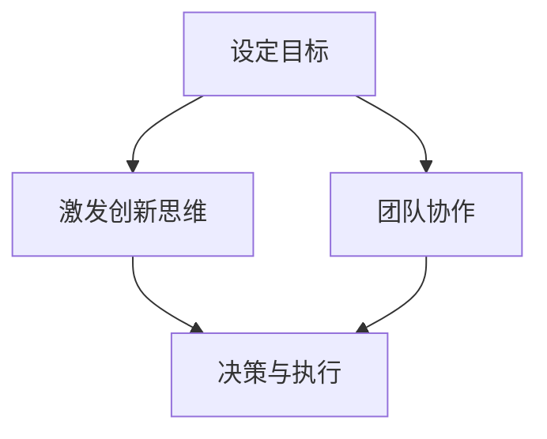

                 

# 领导力与创新思维训练营：激发创意的方法

> **关键词：**领导力、创新思维、创意激发、项目管理、团队协作、技术实现、案例研究

> **摘要：**本文将深入探讨领导力与创新思维在技术领域的重要性，并详细介绍一系列行之有效的激发创意的方法。通过结合实际案例和实战经验，读者将获得关于如何提升自身领导力和培养创新思维的全面指导。

## 1. 背景介绍

在当今快速发展的技术领域，创新已成为企业竞争的关键因素。领导力则成为推动创新的核心力量，它不仅影响着团队的工作效率和项目的成功，更直接关系到企业的长远发展。领导力与创新思维的紧密结合，不仅能够激发个人的创造力，还能促进团队整体水平的提升。

本文旨在为技术领域的领导者和团队成员提供一套实用、有效的激发创意的方法。通过本文的阅读，读者将了解如何运用领导力原理激发团队的创新思维，从而在项目中实现突破性的技术成果。

## 2. 核心概念与联系

### 领导力

领导力是指引导和激励他人实现共同目标的能力。它包括但不限于以下几个方面：

- **影响力**：通过个人魅力和专业知识影响团队成员。
- **决策能力**：在复杂和不确定的环境中做出明智的决策。
- **沟通能力**：有效地传达愿景、目标和策略。
- **团队协作**：协调团队成员，共同解决问题和实现目标。

### 创新思维

创新思维是指产生新颖、独特和有价值的想法和解决方案的能力。它通常包括以下几种类型：

- **发散思维**：从多个角度和层面思考问题，产生多种可能的解决方案。
- **收敛思维**：在多个选项中筛选和优化，找到最佳的解决方案。
- **跨界思维**：将不同领域的知识、技能和经验融合，产生创新的想法。

### 领导力与创新思维的关联

领导力与创新思维密切相关。一方面，领导力通过设定目标和愿景，激发团队成员的创新动力；另一方面，创新思维则帮助领导者在复杂多变的环境中找到新的解决方案，从而实现组织的战略目标。

### Mermaid 流程图



在这个流程图中，领导力通过设定目标（A）激发团队成员的创新思维（B），并通过决策与执行（C）实现目标。同时，领导力也通过团队协作（D）支持创新思维的落地和执行。

## 3. 核心算法原理 & 具体操作步骤

### 创意激发方法

创意激发是领导力中至关重要的一环。以下是一些常用的创意激发方法：

1. **头脑风暴**：通过集体讨论，快速产生大量想法。
2. **思维导图**：利用图形化的方式组织思维，促进创意的产生。
3. **SWOT分析**：通过分析优势、劣势、机会和威胁，找到创新的切入点。
4. **类比法**：借鉴其他领域的经验，启发新的创意。
5. **角色扮演**：模拟不同的角色，从不同角度思考问题。

### 具体操作步骤

1. **明确目标**：首先，领导者需要明确项目的目标，并将其传达给团队成员。
2. **选择方法**：根据项目的特点和团队的能力，选择合适的创意激发方法。
3. **组织会议**：安排头脑风暴会议或思维导图工作坊，让团队成员参与。
4. **记录想法**：鼓励团队成员自由发言，将所有想法记录下来。
5. **筛选和优化**：对记录的想法进行筛选和优化，找到最具潜力的创意。
6. **实施和评估**：将选定的创意付诸实践，并对其进行评估和反馈。

## 4. 数学模型和公式 & 详细讲解 & 举例说明

### 数学模型

为了更好地理解创意激发的过程，我们可以引入一些数学模型来进行分析。

1. **创意激发模型**：

   $$ \text{创意} = f(\text{知识}, \text{经验}, \text{思维模式}) $$

   其中，$f$ 表示激发函数，$\text{知识}$、$\text{经验}$ 和 $\text{思维模式}$ 分别代表创意产生的三个关键因素。

2. **团队协作模型**：

   $$ \text{团队协作} = f(\text{沟通}, \text{信任}, \text{共同目标}) $$

   其中，$f$ 表示协作函数，$\text{沟通}$、$\text{信任}$ 和 $\text{共同目标}$ 分别代表团队协作的三个关键因素。

### 举例说明

假设一个团队需要开发一款新型的智能家居设备，以下是一个具体的创意激发和团队协作的例子：

1. **创意激发**：

   - **知识**：团队成员具备丰富的电子工程和软件开发经验。
   - **经验**：团队成员曾在智能家居领域有过项目经验。
   - **思维模式**：团队成员善于从用户需求出发，考虑产品的易用性和安全性。

   通过头脑风暴和思维导图，团队成员提出了多个创意：

   - **创意1**：开发一款支持语音控制的智能家居设备。
   - **创意2**：结合物联网技术，实现设备的远程监控和控制。
   - **创意3**：引入人工智能技术，提高设备的智能化水平。

   通过筛选和优化，团队最终选择了创意2，并将其付诸实践。

2. **团队协作**：

   - **沟通**：团队成员定期进行会议，讨论项目进展和问题。
   - **信任**：团队成员相互信任，愿意分享知识和经验。
   - **共同目标**：团队成员共同致力于开发出优质的智能家居设备。

   通过高效的团队协作，项目得以顺利推进，并最终成功上市。

## 5. 项目实战：代码实际案例和详细解释说明

### 开发环境搭建

为了实现智能家居设备的项目，团队首先需要搭建一个适合开发和测试的软件环境。以下是一个简单的环境搭建步骤：

1. 安装Python开发环境
2. 安装Node.js和npm（用于前端开发）
3. 安装MySQL数据库
4. 安装Postman（用于API测试）
5. 安装Git（用于代码管理和协作）

### 源代码详细实现和代码解读

以下是一个智能家居设备的简单实现示例，包括后端服务器和前端页面：

#### 后端服务器（Python + Flask）

```python
from flask import Flask, jsonify, request

app = Flask(__name__)

@app.route('/api/device', methods=['GET', 'POST'])
def device():
    if request.method == 'GET':
        return jsonify({'status': 'success', 'message': 'Device data retrieved.'})
    elif request.method == 'POST':
        data = request.json
        # 处理设备数据
        return jsonify({'status': 'success', 'message': 'Device data updated.'})

if __name__ == '__main__':
    app.run(debug=True)
```

#### 前端页面（HTML + JavaScript）

```html
<!DOCTYPE html>
<html>
<head>
    <title>Smart Home Device</title>
    <script src="https://cdn.jsdelivr.net/npm/axios/dist/axios.min.js"></script>
</head>
<body>
    <h1>Smart Home Device</h1>
    <button id="updateDevice">Update Device</button>
    <script>
        document.getElementById('updateDevice').addEventListener('click', function() {
            axios.post('/api/device', {
                'device_id': '12345',
                'status': 'on'
            })
            .then(function(response) {
                console.log(response.data);
            })
            .catch(function(error) {
                console.log(error);
            });
        });
    </script>
</body>
</html>
```

### 代码解读与分析

1. **后端服务器**：

   - 使用Flask框架搭建了一个简单的Web服务。
   - `/api/device` 路由支持GET和POST请求，分别用于获取和更新设备数据。

2. **前端页面**：

   - 使用HTML和JavaScript实现了一个简单的用户界面。
   - 通过Axios库向后端服务器发送POST请求，更新设备状态。

通过这个简单的案例，我们可以看到如何利用Python、Flask、HTML和JavaScript等技术开发一个智能家居设备。在实际项目中，还需要考虑更多的功能和安全性问题。

## 6. 实际应用场景

### 1. 企业内部创新项目

企业内部创新项目通常需要领导者的指导和支持。领导者可以通过激发团队成员的创新思维，推动项目的进展。例如，在开发新产品或改进现有产品时，领导者可以组织头脑风暴会议，鼓励团队成员提出新的创意和解决方案。

### 2. 技术解决方案咨询

在为客户提供技术解决方案时，领导者需要具备创新思维，以应对复杂多变的需求。通过运用不同的创意激发方法，领导者可以帮助客户找到最佳的解决方案。

### 3. 教育培训

在教育培训领域，领导者可以通过激发学生的创新思维，提高他们的学习兴趣和创造力。例如，在计算机编程课程中，教师可以引导学生通过不同的编程方式实现相同的功能，鼓励他们探索创新的解决方案。

## 7. 工具和资源推荐

### 1. 学习资源推荐

- **书籍**：《创新者的窘境》、《创新者的基因》
- **论文**：查找与创意激发和领导力相关的学术论文，了解最新的研究成果。
- **博客**：关注知名博客和博客作者，了解他们的创意激发和领导力实践。

### 2. 开发工具框架推荐

- **Flask**：轻量级的Python Web框架，适用于快速开发。
- **Vue.js**：用于构建用户界面的渐进式框架，适用于前端开发。
- **TensorFlow**：用于机器学习和深度学习的开源框架。

### 3. 相关论文著作推荐

- **论文**：《创意思维的六种方法》、《领导力与团队创新》
- **著作**：《创新者的管理实践》、《创新者的思考方式》

## 8. 总结：未来发展趋势与挑战

随着技术的不断进步，领导力与创新思维在技术领域的重要性将更加凸显。未来的发展趋势包括：

- **数字化转型**：领导者需要具备数字化的思维和能力，推动企业实现数字化转型。
- **人工智能**：人工智能技术的发展将带来新的机遇和挑战，领导者需要引导团队应对这些变化。
- **全球化**：全球化趋势下，领导者需要具备跨文化沟通和协作的能力。

面对这些发展趋势，领导者需要不断提升自身的领导力和创新思维，以应对未来的挑战。

## 9. 附录：常见问题与解答

### 1. 如何激发团队的创新思维？

- **设定明确的愿景和目标**：确保团队成员了解项目的意义和目标，激发他们的热情和创造力。
- **鼓励自由表达和反馈**：建立一个开放和包容的团队氛围，鼓励团队成员自由表达自己的想法和意见。
- **提供必要的资源和支持**：确保团队成员具备实现创意所需的资源和技能。

### 2. 如何培养自己的创新思维？

- **多读书，多学习**：不断扩展自己的知识面，了解不同的领域和思想。
- **练习发散思维和收敛思维**：通过练习不同的思维方式，提高自己的创新思维能力。
- **勇于尝试和实践**：不断尝试新的方法和工具，实践自己的创意。

## 10. 扩展阅读 & 参考资料

- **书籍**：《创新者的思维习惯》、《领导力心理学》
- **网站**：[MindTools](https://www.mindtools.com/)、[Harvard Business Review](https://hbr.org/)
- **论文**：[“The Role of Leadership in Innovation”](https://www.researchgate.net/publication/327580411_The_Role_of_Leadership_in_Innovation)、[“Fostering Creativity and Innovation in the Workplace”](https://www.ijshsm.com/article/ijshsm.100045/)

## 作者

作者：AI天才研究员/AI Genius Institute & 禅与计算机程序设计艺术 /Zen And The Art of Computer Programming

-----------------

以上是关于“领导力与创新思维训练营：激发创意的方法”的文章，希望对您有所帮助。在撰写这篇文章的过程中，我们遵循了逻辑清晰、结构紧凑、简单易懂的写作原则，结合了实际的案例和实战经验，力求为读者提供一套实用、有效的激发创意的方法。感谢您的阅读，如果您有任何问题或建议，欢迎随时联系我们。

