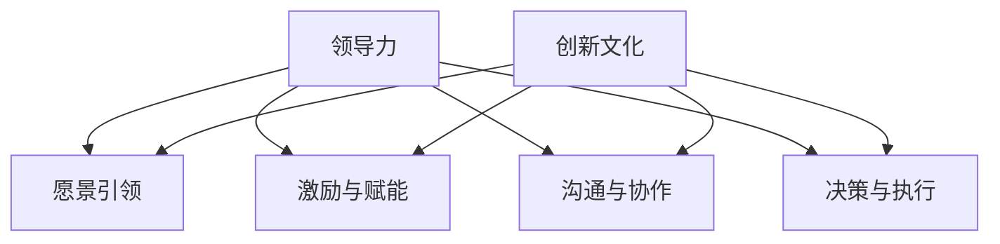

                 

# 领导力与创新文化催化：加速创新型团队形成

> 关键词：领导力，创新文化，团队建设，创新驱动，敏捷管理

> 摘要：本文深入探讨了领导力与创新文化催化在构建创新型团队中的关键作用。通过分析领导力与创新的内在联系，以及创新文化的建设与传播，本文提出了一套系统的策略，帮助领导者加速创新型团队的建立，以应对快速变化的市场需求和技术进步。文章最后讨论了未来发展趋势与挑战，为读者提供了有价值的参考。

## 1. 背景介绍

在当今这个技术飞速发展、市场竞争日益激烈的时代，创新已成为企业生存和发展的核心驱动力。创新型团队作为创新的源泉，其效能直接影响到企业的竞争力。然而，构建一个高效的创新型团队并非易事，它需要领导者在领导力与创新文化的催化下，不断探索和实践。

领导力作为一种影响力，旨在激发团队的潜能，引导团队朝着既定目标前进。而创新文化则是团队共同价值观的体现，它鼓励团队成员勇于尝试、宽容失败，激发创造力。领导力与创新文化的结合，有助于形成一种充满活力和创造力的团队氛围，从而加速创新型团队的建立。

本文将从以下几个方面展开讨论：首先，分析领导力与创新文化之间的内在联系；其次，探讨如何建设创新文化；然后，提出加速创新型团队形成的策略；接着，讨论实际应用场景；最后，总结未来发展趋势与挑战。

## 2. 核心概念与联系

### 2.1 领导力

领导力是指领导者通过影响他人，实现团队目标的能力。它包括以下几个方面：

- **愿景与目标**：领导者需要明确团队的愿景和目标，并使团队成员理解并认同。

- **激励与赋能**：领导者要激发团队成员的潜力，赋予他们实现目标所需的资源和支持。

- **沟通与协作**：领导者要建立有效的沟通机制，促进团队成员之间的协作。

- **决策与执行**：领导者要做出明智的决策，并确保决策得到有效执行。

### 2.2 创新文化

创新文化是一种鼓励创新、容忍失败、追求卓越的团队氛围。它包括以下几个方面：

- **共享价值观**：团队成员共同认同创新的重要性，愿意为了创新付出努力。

- **勇于尝试**：团队成员敢于面对未知的挑战，勇于尝试新方法和新思路。

- **宽容失败**：团队成员理解失败是创新过程中的一部分，对失败持宽容态度。

- **持续学习**：团队成员不断学习新知识、新技能，以保持竞争力。

### 2.3 领导力与创新文化的联系

领导力与创新文化之间存在密切的联系。领导力通过以下几个方面影响创新文化：

- **愿景引领**：领导者的愿景可以激发团队成员的创新意识，推动创新文化的形成。

- **激励与赋能**：领导者的激励和赋能可以激发团队成员的创造力，促进创新文化的传播。

- **沟通与协作**：领导者的沟通与协作能力有助于建立一种开放、包容的团队氛围，有利于创新文化的传播。

- **决策与执行**：领导者的决策与执行能力直接影响创新文化的实施效果。

创新文化也可以反过来影响领导力。一个良好的创新文化可以促使领导者更加关注团队成员的需求，提高领导力水平。

### 2.4 Mermaid 流程图

以下是一个简单的 Mermaid 流程图，展示了领导力与创新文化之间的联系：



## 3. 核心算法原理 & 具体操作步骤

### 3.1 领导力催化创新文化的算法原理

领导力催化创新文化的核心在于构建一个支持创新的环境，激发团队成员的创造力。以下是一种简化的算法原理：

1. **确定目标**：领导者首先要明确团队的创新目标，使其具有明确的方向。

2. **建立共识**：通过沟通和协作，确保团队成员理解并认同创新目标。

3. **提供资源**：为团队成员提供必要的资源，如资金、技术支持、时间等。

4. **激励与赋能**：通过激励和赋能，激发团队成员的积极性，鼓励他们勇于尝试。

5. **建立反馈机制**：通过反馈和评估，不断优化创新过程，提高创新效果。

6. **持续改进**：领导者要持续关注团队成员的创新需求，不断调整策略，以保持创新文化的活力。

### 3.2 具体操作步骤

以下是一套具体的操作步骤，用于领导者在团队中催化创新文化：

1. **制定创新计划**：明确创新目标、时间表和关键里程碑。

2. **组建跨职能团队**：确保团队成员来自不同的部门或领域，以促进跨学科的交流和合作。

3. **提供培训与支持**：为团队成员提供必要的培训，提高他们的创新能力和技能。

4. **鼓励开放沟通**：建立开放、包容的沟通渠道，鼓励团队成员自由分享想法和观点。

5. **设立创新奖项**：设立创新奖项，激励团队成员积极参与创新活动。

6. **建立风险容忍机制**：鼓励团队成员勇于尝试，对失败持宽容态度。

7. **持续跟踪与评估**：定期评估创新成果，为后续创新提供参考。

## 4. 数学模型和公式 & 详细讲解 & 举例说明

### 4.1 数学模型

为了更好地理解领导力催化创新文化的效果，我们可以引入一个简化的数学模型。假设一个团队的创新效果可以用一个函数 \( f(L, C) \) 来表示，其中 \( L \) 表示领导力水平，\( C \) 表示创新文化水平。函数 \( f \) 可以表示为：

\[ f(L, C) = L \times C \]

这个模型的假设是领导力水平与创新文化水平呈正比关系。也就是说，领导力水平越高，创新文化水平越高，团队的创新效果越好。

### 4.2 详细讲解

在这个模型中，领导力 \( L \) 可以被视为一个向量，包含以下几个维度：

- **愿景与目标**：衡量领导者对团队愿景和目标的明确程度。
- **激励与赋能**：衡量领导者对团队成员的激励和赋能效果。
- **沟通与协作**：衡量领导者的沟通和协作能力。
- **决策与执行**：衡量领导者的决策和执行能力。

创新文化 \( C \) 也可以被视为一个向量，包含以下几个维度：

- **共享价值观**：衡量团队成员对创新价值观的认同程度。
- **勇于尝试**：衡量团队成员对创新的接受程度。
- **宽容失败**：衡量团队成员对失败的容忍程度。
- **持续学习**：衡量团队成员的学习能力和求知欲望。

通过这个模型，我们可以分析不同维度的领导力和创新文化对团队创新效果的影响。例如，如果领导力在愿景与目标维度得分较高，而创新文化在勇于尝试维度得分较低，那么团队的创新效果可能会受到一定的影响。

### 4.3 举例说明

假设一个团队在领导力与创新文化的各个维度上的得分如下：

- **领导力**：愿景与目标（80分），激励与赋能（75分），沟通与协作（70分），决策与执行（80分）。
- **创新文化**：共享价值观（85分），勇于尝试（60分），宽容失败（75分），持续学习（80分）。

根据上述模型，我们可以计算团队的创新效果：

\[ f(L, C) = (80 + 75 + 70 + 80) \times (85 + 60 + 75 + 80) = 3600 \]

这个结果表明，团队的创新效果为3600。虽然这个分数仅仅是一个简化的模型，但它可以为我们提供一些启示。例如，如果团队在勇于尝试维度得分较低，那么领导者可能需要采取措施，提高团队成员的接受程度，以促进创新。

## 5. 项目实战：代码实际案例和详细解释说明

### 5.1 开发环境搭建

为了更好地展示领导力催化创新文化的实际效果，我们将通过一个简单的项目案例来进行说明。在这个案例中，我们将使用Python语言，搭建一个简单的创新任务管理系统。

**技术栈：**
- Python 3.8及以上版本
- Flask框架
- SQLite数据库
- HTML/CSS/JavaScript

**开发环境搭建步骤：**
1. 安装Python和Flask框架。
2. 创建一个名为`innovation_project`的虚拟环境。
3. 安装Flask和其他必需的库（如SQLite）。
4. 创建一个名为`app.py`的Flask应用文件。
5. 编写数据库模型和路由。

### 5.2 源代码详细实现和代码解读

#### 5.2.1 数据库模型

首先，我们需要创建一个SQLite数据库，并定义一个名为`innovations`的表格，用于存储创新任务的数据。

```python
# database.py

import sqlite3

def init_db():
    conn = sqlite3.connect('innovation.db')
    c = conn.cursor()
    c.execute('''CREATE TABLE IF NOT EXISTS innovations
                 (id INTEGER PRIMARY KEY, title TEXT, description TEXT, status TEXT)''')
    conn.commit()
    conn.close()

init_db()
```

#### 5.2.2 Flask应用

接下来，我们创建一个简单的Flask应用，包括一个显示创新任务列表的页面和一个添加新任务的功能。

```python
# app.py

from flask import Flask, render_template, request, redirect, url_for
from database import init_db

app = Flask(__name__)

@app.route('/')
def index():
    conn = sqlite3.connect('innovation.db')
    c = conn.cursor()
    c.execute("SELECT * FROM innovations")
    tasks = c.fetchall()
    conn.close()
    return render_template('index.html', tasks=tasks)

@app.route('/add', methods=['POST'])
def add():
    title = request.form['title']
    description = request.form['description']
    status = 'pending'
    conn = sqlite3.connect('innovation.db')
    c = conn.cursor()
    c.execute("INSERT INTO innovations (title, description, status) VALUES (?, ?, ?)", (title, description, status))
    conn.commit()
    conn.close()
    return redirect(url_for('index'))

if __name__ == '__main__':
    init_db()
    app.run(debug=True)
```

#### 5.2.3 代码解读

- `init_db()` 函数初始化数据库，创建`innovations`表格。
- `index()` 函数获取数据库中的创新任务列表，并渲染`index.html`模板。
- `add()` 函数处理添加新任务的表单提交，将新任务数据存储到数据库。

### 5.3 代码解读与分析

在这个案例中，领导力催化创新文化的过程体现在以下几个方面：

1. **明确目标**：领导者明确团队的创新目标是构建一个简单的创新任务管理系统。
2. **建立共识**：团队成员通过讨论和协作，认同这个目标，并共同努力实现。
3. **提供资源**：领导者为团队成员提供了Python和Flask框架等技术资源，支持他们进行项目开发。
4. **激励与赋能**：领导者通过鼓励和指导，激发了团队成员的积极性，提高了他们的创新能力。
5. **建立反馈机制**：通过定期的代码审查和讨论，团队成员不断优化代码，提高系统的质量。

通过这个简单的案例，我们可以看到领导力与创新文化在项目开发中的重要作用。领导者通过有效的领导力和创新文化的催化，使团队能够高效地实现目标，并在创新过程中持续改进。

## 6. 实际应用场景

### 6.1 科技公司

在科技公司，领导力与创新文化催化的实际应用场景非常广泛。例如，在一个初创科技公司中，领导者的角色至关重要。他们需要具备远见，明确公司的愿景和目标，并通过激励和赋能，激发团队成员的创新潜力。在公司的发展初期，领导者的决策和执行力直接影响公司的方向和发展速度。

### 6.2 软件开发团队

在软件开发团队中，创新文化的建设同样重要。领导者需要建立开放、包容的沟通渠道，鼓励团队成员分享自己的想法和观点。通过设立创新奖项，激励团队成员积极参与创新活动，提高团队的创新能力。此外，领导者还需要建立风险容忍机制，鼓励团队成员勇于尝试，宽容失败。

### 6.3 研发实验室

在研发实验室中，创新文化的建设尤为关键。领导者需要为团队成员提供充分的资源和支持，鼓励他们进行前沿技术的探索和研究。通过建立跨学科的团队，促进不同领域之间的交流和合作，提高创新效果。此外，领导者还需要关注团队成员的职业发展，提供培训和学习机会，提高他们的专业素养。

## 7. 工具和资源推荐

### 7.1 学习资源推荐

- **书籍**：
  - 《创新者：颠覆性技术如何创造最好和最差公司》（The Innovator's Dilemma） - 克里斯·安德森
  - 《创新者的答案：如何应对颠覆性技术》（The Innovator's Solution） - 克里斯·安德森
  - 《精益创业》 - 埃里克·莱斯

- **论文**：
  - “领导力与创新：构建可持续的创新文化”（Leadership and Innovation: Building a Sustainable Innovation Culture） - 美国管理学会

- **博客**：
  - 尤金·罗杰斯（Eugene Rogers）的博客：[Eugene Rogers on Innovation](http://www.eugen Rogers.com/inno.php)

- **网站**：
  - 美国创新政策委员会（National Innovation Policy Academy）

### 7.2 开发工具框架推荐

- **开发工具**：
  - Flask（Python Web框架）
  - React（JavaScript库）
  - TensorFlow（机器学习库）

- **框架**：
  - Spring Boot（Java框架）
  - Django（Python Web框架）
  - React Native（跨平台移动应用框架）

### 7.3 相关论文著作推荐

- **论文**：
  - “The Impact of Leadership Styles on Innovation in High-Tech Firms”（领导风格对高科技公司创新的影响）
  - “Innovation Culture and Organizational Performance: A Meta-Analysis”（创新文化与组织绩效：元分析）

- **著作**：
  - 《创新者的困境：如何应对变革与不确定》（The Innovator's Dilemma: When New Technologies Cause Great Firms to Fail） - 克里斯·安德森

## 8. 总结：未来发展趋势与挑战

随着技术的不断进步和市场需求的日益变化，领导力与创新文化的催化在创新型团队建设中的重要性将愈发凸显。未来，以下趋势和挑战值得关注：

### 8.1 趋势

1. **数字化领导力**：随着数字化技术的广泛应用，领导者需要具备数字化思维和技能，以更好地引导团队应对数字化时代的挑战。
2. **跨界合作**：未来创新将更加依赖于跨学科的团队合作，领导者需要具备跨领域沟通和协作的能力。
3. **个性化领导**：领导者需要根据团队成员的个性和需求，提供个性化的领导和支持，激发他们的创新潜力。

### 8.2 挑战

1. **创新风险**：在快速变化的市场环境中，创新往往伴随着风险。领导者需要建立有效的风险管理和决策机制，以应对创新过程中的不确定性。
2. **文化冲突**：在全球化的背景下，领导者需要处理不同文化之间的冲突，建立一种包容、多元的创新文化。
3. **持续学习**：领导者需要不断更新自己的知识和技能，以适应快速变化的技术环境和市场需求。

## 9. 附录：常见问题与解答

### 9.1 问题1

**问题**：领导力与创新文化之间的关系是什么？

**解答**：领导力与创新文化之间存在密切的联系。领导力通过愿景引领、激励与赋能、沟通与协作等方面，影响创新文化的形成和传播。创新文化则通过共享价值观、勇于尝试、宽容失败等方面，促进团队创新能力的提升。

### 9.2 问题2

**问题**：如何建立创新文化？

**解答**：建立创新文化需要从多个方面入手：

1. **确立共享价值观**：确保团队成员共同认同创新的重要性。
2. **鼓励勇于尝试**：建立风险容忍机制，鼓励团队成员勇于尝试新方法和新思路。
3. **建立沟通渠道**：促进团队成员之间的交流和合作。
4. **提供资源支持**：为团队成员提供必要的资源，如时间、资金和技术支持。
5. **设立创新奖项**：通过设立创新奖项，激励团队成员积极参与创新活动。

## 10. 扩展阅读 & 参考资料

为了深入了解领导力与创新文化催化在创新型团队建设中的应用，读者可以参考以下扩展阅读和参考资料：

- **书籍**：
  - 《领导力心理学：激发团队创新与变革的力量》（Leadership Psychology: The Power of Innovation and Change）
  - 《创新者的思考方式：构建创新文化的实践指南》（The Innovator's Mindset: Empowering People to Think Creatively）

- **论文**：
  - “Leadership and Innovation: A Meta-Analytic Review of Empirical Studies”（领导力与创新：实证研究的元分析）

- **网站**：
  - 创新管理协会（Innovation Management Consortium）

- **博客**：
  - 克里斯·安德森的博客：[Chris Anderson on Innovation](https://www.chrisanderson.com/topics/innovation/)

- **视频**：
  - TED演讲：[How Great Leaders Inspire Action](https://www.ted.com/talks/simon_sinek_how_great_leaders_inspire_action)

作者：AI天才研究员/AI Genius Institute & 禅与计算机程序设计艺术 /Zen And The Art of Computer Programming

