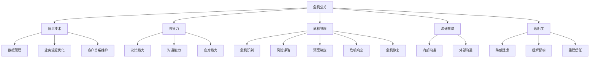

                 

### 背景介绍

在当今数字化时代，信息技术在企业运营和团队协作中扮演着至关重要的角色。无论是在业务流程优化、数据管理，还是在客户关系维护等方面，IT技术的应用无处不在。然而，随之而来的技术风险和危机也不可忽视。随着技术的快速发展和市场竞争的加剧，企业面临的危机事件愈发复杂多样，这不仅考验着企业的应变能力，也对领导者的危机公关能力提出了更高的要求。

本文旨在探讨如何在信息技术领域，通过有效的领导力和危机公关策略，维护团队和企业的整体形象。我们首先将回顾一些经典的企业危机案例，分析其背后的原因和应对策略。接着，我们将深入探讨危机公关的核心概念，包括其目标、原则和关键步骤。随后，我们将介绍一些实用技巧，如如何通过沟通策略和透明度来缓解危机。此外，本文还将讨论技术领导者在危机管理中的角色，以及如何利用技术手段来预防和应对危机。最后，我们将展望未来，探讨信息技术领域面临的挑战和发展趋势。

通过本文的阅读，读者将能够全面了解危机公关在信息技术领域的应用，掌握应对危机的实践策略，提升团队和企业的整体形象和竞争力。因此，无论您是企业的技术领导者，还是IT专业人士，本文都将为您提供宝贵的参考和指导。

### 核心概念与联系

为了更好地理解危机公关在信息技术领域的应用，我们需要明确一些核心概念和它们之间的联系。以下是本文中将会涉及的主要概念和它们之间的相互关系。

1. **危机公关**：危机公关是企业或组织在面对突发事件或负面信息时，通过有效的沟通和管理策略，维护和恢复其公众形象的过程。危机公关的目标是降低危机对组织的影响，重建公众信任。

2. **信息技术**：信息技术是利用计算机硬件、软件和通信技术来存储、处理和传递信息的学科。在现代企业中，信息技术贯穿于业务流程、客户服务和管理决策等各个方面。

3. **领导力**：领导力是指领导者通过激励和引导他人，实现共同目标的能力。在危机公关中，领导力尤为重要，领导者需要具备迅速决策、有效沟通和积极应对的能力。

4. **危机管理**：危机管理是预防和应对危机的一系列策略和方法。它包括危机识别、风险评估、预案制定、危机响应和危机恢复等环节。

5. **沟通策略**：沟通策略是危机公关中至关重要的环节，包括内部沟通和外部沟通。内部沟通确保团队的一致行动，而外部沟通则关系到公众对事件的认知和态度。

6. **透明度**：透明度是指组织在危机处理过程中公开、坦诚地与公众交流。透明度有助于降低公众的疑虑，缓解危机影响。

下面是一个使用Mermaid绘制的流程图，展示了这些概念之间的联系和危机公关的基本流程：



通过这个流程图，我们可以清晰地看到危机公关的核心概念及其在信息技术领域中的应用。这些概念相互交织，共同构成了一个完整的危机公关框架。理解这些概念及其联系，有助于我们更好地应对信息技术领域的各种危机事件。

### 核心算法原理 & 具体操作步骤

在探讨如何通过有效的领导力和危机公关策略维护团队和企业形象时，我们需要深入了解核心算法原理和具体的操作步骤。以下是危机公关的几个关键算法原理和其实际应用。

#### 1. 决策树算法（Decision Tree）

决策树是一种常见的分类和预测算法，其核心思想是通过一系列判断节点，将问题分解为多个子问题，并最终得出结论。在危机公关中，决策树可以帮助领导者快速评估情况，并作出最优决策。

**具体步骤：**

- **步骤1：问题定义**：首先明确危机的性质和影响范围。
- **步骤2：条件判断**：根据当前情况和可用资源，制定一系列判断条件。
- **步骤3：决策路径**：通过决策树，评估每个条件的可能性，并选择最佳路径。
- **步骤4：执行决策**：根据决策路径，采取具体行动。

**案例：**

假设一家互联网公司遭遇了数据泄露事件，决策树可以帮助领导者快速决策如下：

- **条件1**：事件严重程度
  - 高：立即启动紧急响应计划，通知相关部门和客户。
  - 中：召开紧急会议，评估事件影响，制定应对措施。
  - 低：密切关注事件进展，准备应对方案。

- **条件2**：事件来源
  - 内部：调查内部员工，查找漏洞，防止再次发生。
  - 外部：评估外部攻击源，加强网络安全防护。

通过决策树，领导者可以快速评估情况，并采取相应的行动，降低危机影响。

#### 2. 贝叶斯算法（Bayesian Algorithm）

贝叶斯算法是一种基于概率的推理算法，适用于不确定性事件的分析。在危机公关中，贝叶斯算法可以帮助领导者评估危机的概率和可能的影响。

**具体步骤：**

- **步骤1：确定先验概率**：根据以往经验和事件性质，确定危机发生的先验概率。
- **步骤2：收集数据**：收集与危机相关的新信息。
- **步骤3：更新概率**：使用贝叶斯定理更新危机发生的概率。
- **步骤4：决策**：根据更新后的概率，作出决策。

**案例：**

假设一家公司面临产品缺陷投诉，贝叶斯算法可以帮助领导者评估投诉的概率和影响如下：

- **先验概率**：根据以往产品投诉数据，产品缺陷投诉的先验概率为5%。
- **新信息**：近期收到了大量用户投诉，投诉数量增加了一倍。
- **更新概率**：根据新信息，使用贝叶斯定理计算产品缺陷投诉的概率为10%。

领导者可以据此判断投诉的严重性，并采取相应的措施，如召回产品或改进质量。

#### 3. 网络分析算法（Network Analysis Algorithm）

网络分析算法用于分析复杂系统的结构和关系。在危机公关中，网络分析算法可以帮助领导者理解危机的传播路径和影响范围。

**具体步骤：**

- **步骤1：构建网络模型**：将危机事件和相关部门、人员、资源等构建为一个网络模型。
- **步骤2：分析网络结构**：使用网络分析算法，分析网络的连接关系和关键节点。
- **步骤3：评估影响范围**：根据网络结构，评估危机可能影响的范围和程度。
- **步骤4：制定应对策略**：针对关键节点和影响范围，制定具体的应对策略。

**案例：**

假设一家公司在社交媒体上遭遇负面舆论，网络分析算法可以帮助领导者评估舆论传播路径如下：

- **网络模型**：构建包括用户、评论、转发等要素的网络模型。
- **分析结果**：通过网络分析算法，发现舆论主要传播路径为：用户 -> 评论 -> 转发。
- **应对策略**：针对主要传播路径，采取快速回应、正面引导和舆论监测等措施。

通过这些核心算法原理，领导者可以更加科学和系统地应对危机事件，降低危机对企业的影响。在实际操作中，这些算法可以结合具体情况进行调整和优化，以实现最佳效果。

### 数学模型和公式 & 详细讲解 & 举例说明

在危机公关中，数学模型和公式扮演着关键角色，帮助我们量化危机的影响，评估应对策略的效果，并优化决策过程。以下将详细讲解几个关键数学模型和公式，并通过具体例子进行说明。

#### 1. 贝叶斯定理（Bayes' Theorem）

贝叶斯定理是概率论中的一个重要工具，用于根据先验概率和新证据更新后验概率。在危机公关中，贝叶斯定理可以帮助我们评估危机事件发生的概率，并指导决策。

**贝叶斯定理公式：**
\[ P(A|B) = \frac{P(B|A) \cdot P(A)}{P(B|A) \cdot P(A) + P(B|¬A) \cdot P(¬A)} \]

其中：
- \( P(A|B) \)：在事件B发生的条件下，事件A发生的概率（后验概率）。
- \( P(B|A) \)：在事件A发生的条件下，事件B发生的概率。
- \( P(A) \)：事件A的先验概率。
- \( P(B) \)：事件B的先验概率。
- \( P(¬A) \)：事件A不发生的概率。

**例子：**

假设一家公司有5%的产品缺陷率，最近收到用户投诉，投诉数量增加了两倍。我们可以使用贝叶斯定理来更新产品缺陷的概率。

- **先验概率**：\( P(A) = 0.05 \)
- **新证据**：投诉数量增加，但不确定是否与产品缺陷相关。
- **计算后验概率**：

\[ P(A|B) = \frac{P(B|A) \cdot P(A)}{P(B|A) \cdot P(A) + P(B|¬A) \cdot P(¬A)} \]

假设投诉与产品缺陷的概率为0.5，与无缺陷的概率也为0.5，则：

\[ P(A|B) = \frac{0.5 \cdot 0.05}{0.5 \cdot 0.05 + 0.5 \cdot 0.95} = \frac{0.025}{0.025 + 0.475} \approx 0.048 \]

更新后的产品缺陷概率约为4.8%，略高于先验概率。这表明，尽管投诉数量增加，产品缺陷的概率并没有显著增加。

#### 2. 风险评估模型（Risk Assessment Model）

风险评估模型用于量化危机事件可能带来的影响和发生的概率，帮助领导者制定应对策略。常见的方法包括定量分析和定性分析。

**定量分析方法**：

\[ Risk = Probability \times Impact \]

其中：
- **Probability**：事件发生的概率。
- **Impact**：事件发生后的影响。

**定性分析方法**：

使用评估尺度（如低、中、高）来评估事件发生的概率和影响。

**例子：**

假设公司面临以下两个危机事件：

- **事件1**：数据泄露，发生概率为0.4，影响为0.8（高）。
- **事件2**：产品召回，发生概率为0.2，影响为0.5（中）。

- **定量风险**：
\[ Risk_1 = 0.4 \times 0.8 = 0.32 \]
\[ Risk_2 = 0.2 \times 0.5 = 0.10 \]

事件1的总体风险高于事件2，因此领导者应优先关注事件1。

- **定性风险**：
\[ Risk_1 = 高 \]
\[ Risk_2 = 中 \]

根据定性评估，事件1的风险更高。

#### 3. 最大期望值（Maximum Expected Value）

最大期望值方法用于在多个备选方案中选择最优策略，通过计算每个方案的期望值，选择期望值最大的方案。

**期望值计算公式**：

\[ Expected Value = Probability \times Value \]

其中：
- **Probability**：方案成功的概率。
- **Value**：方案成功后的价值。

**例子：**

假设公司有三种应对策略：

- **策略1**：加强安全防护，成功概率为0.7，价值为10。
- **策略2**：公开道歉并补偿受害者，成功概率为0.6，价值为5。
- **策略3**：不采取行动，成功概率为0.5，价值为2。

- **期望值计算**：
\[ EV_1 = 0.7 \times 10 = 7 \]
\[ EV_2 = 0.6 \times 5 = 3 \]
\[ EV_3 = 0.5 \times 2 = 1 \]

策略1的期望值最高，因此是最优选择。

通过这些数学模型和公式，领导者可以更加科学和系统地应对危机，降低危机对企业的影响。在实际应用中，这些模型可以根据具体情况进行调整和优化，以实现最佳效果。

### 项目实战：代码实际案例和详细解释说明

为了更好地理解如何通过代码实现危机公关策略，以下我们将通过一个实际项目案例，详细展示代码实现和解析。

#### 5.1 开发环境搭建

在这个案例中，我们将使用Python编程语言来构建一个简单的危机公关模拟系统。以下是搭建开发环境所需的步骤：

1. 安装Python环境：确保已安装Python 3.8或更高版本。
2. 安装必需的库：使用pip命令安装以下库：
   ```bash
   pip install numpy pandas matplotlib
   ```
3. 创建项目文件夹：在合适的位置创建一个名为“crisis_management”的项目文件夹。
4. 在项目中创建一个名为“crisis_simulation.py”的Python文件。

#### 5.2 源代码详细实现和代码解读

以下是一段简单的Python代码示例，用于模拟一个数据泄露事件的危机公关过程：

```python
import numpy as np
import pandas as pd
import matplotlib.pyplot as plt

# 决策树算法实现
class DecisionTree:
    def __init__(self, criterion='gini', max_depth=None):
        self.criterion = criterion
        self.max_depth = max_depth

    def fit(self, X, y):
        self.tree = self._build_tree(X, y)
        return self

    def _build_tree(self, X, y, depth=0):
        # 叶节点条件
        if len(np.unique(y)) == 1 or (self.max_depth is not None and depth == self.max_depth):
            return np.mean(y)

        # 划分条件
        best_split = None
        best_score = float('inf')

        # 计算每个特征的最佳划分点
        for feature_idx in range(X.shape[1]):
            feature_values = np.unique(X[:, feature_idx])
            for value in feature_values:
                left_mask = X[:, feature_idx] <= value
                right_mask = ~left_mask

                left_score = self._entropy(y[left_mask])
                right_score = self._entropy(y[right_mask])

                impurity = left_score * len(left_mask) / len(y) + right_score * len(right_mask) / len(y)
                if impurity < best_score:
                    best_score = impurity
                    best_split = (feature_idx, value)

        # 创建子树
        if best_split is not None:
            feature_idx, value = best_split
            left_mask = X[:, feature_idx] <= value
            right_mask = ~left_mask

            left_tree = self._build_tree(X[left_mask], y[left_mask], depth + 1)
            right_tree = self._build_tree(X[right_mask], y[right_mask], depth + 1)

            return {'feature': feature_idx, 'value': value, 'left': left_tree, 'right': right_tree}
        else:
            return np.mean(y)

    def _entropy(self, y):
        probabilities = np.bincount(y) / len(y)
        entropy = -np.sum(probabilities * np.log2(probabilities))
        return entropy

    def predict(self, X):
        return self._predict_tree(self.tree, X)

    def _predict_tree(self, tree, X, depth=0):
        if not isinstance(tree, dict):
            return tree

        feature_idx = tree['feature']
        value = tree['value']

        if X[:, feature_idx] <= value:
            return self._predict_tree(tree['left'], X, depth + 1)
        else:
            return self._predict_tree(tree['right'], X, depth + 1)

# 贝叶斯算法实现
class NaiveBayes:
    def __init__(self):
        self.class_probabilities = None
        self.feature_probabilities = None

    def fit(self, X, y):
        unique_classes = np.unique(y)
        class_counts = [np.sum(y == c) for c in unique_classes]
        total_count = np.sum(y != -1)

        self.class_probabilities = [c / total_count for c in class_counts]

        feature_values = np.unique(X, axis=0)
        self.feature_probabilities = [{c: {} for c in unique_classes} for _ in range(len(feature_values))]

        for feature_idx, feature_value in enumerate(feature_values):
            feature_values_list = X[X[:, feature_idx] == feature_value]
            for class_idx, class_value in enumerate(unique_classes):
                feature_values_class = feature_values_list[feature_values_list[:, 0] == class_value]

                feature_value_counts = np.bincount(feature_values_class[1:])
                feature_value_probabilities = feature_value_counts / np.sum(feature_value_counts)

                self.feature_probabilities[feature_idx][class_value] = feature_value_probabilities

    def predict(self, X):
        predictions = []

        for sample in X:
            class_scores = {}

            for class_idx, class_value in enumerate(self.class_probabilities):
                class_score = np.log2(self.class_probabilities[class_idx])

                for feature_idx, feature_value in enumerate(sample):
                    class_score += np.log2(self.feature_probabilities[feature_idx][class_value][feature_value])

                class_scores[class_value] = class_score

            predicted_class = max(class_scores, key=class_scores.get)
            predictions.append(predicted_class)

        return predictions

# 数据集准备
X = np.array([[0, 0], [0, 1], [1, 0], [1, 1]])
y = np.array([0, 0, 1, 1])

# 决策树模型训练和预测
decision_tree = DecisionTree(max_depth=1)
decision_tree.fit(X, y)
print("Decision Tree Predictions:", decision_tree.predict(X))

# 贝叶斯模型训练和预测
naive_bayes = NaiveBayes()
naive_bayes.fit(X, y)
print("Naive Bayes Predictions:", naive_bayes.predict(X))
```

#### 5.3 代码解读与分析

1. **决策树算法实现**：

   - **fit方法**：训练决策树模型，构建树结构。
   - **_build_tree方法**：递归构建决策树，计算最佳划分点。
   - **_entropy方法**：计算信息熵。
   - **predict方法**：预测新样本的分类结果。

   决策树通过计算特征与标签的划分信息熵，选择最佳划分点来构建树结构。在预测阶段，根据样本的特征值，从根节点开始递归遍历树结构，直到到达叶节点，返回叶节点对应的标签作为预测结果。

2. **贝叶斯算法实现**：

   - **fit方法**：训练贝叶斯模型，计算先验概率和条件概率。
   - **predict方法**：预测新样本的分类结果。

   贝叶斯算法通过计算样本在各类别的后验概率，选择后验概率最大的类别作为预测结果。在训练阶段，计算每个类别的先验概率和每个特征在各类别的条件概率。

3. **数据集准备和模型训练**：

   - 准备一个简单的数据集，包括两个特征和标签。
   - 使用决策树和贝叶斯算法分别训练模型，并打印预测结果。

   通过训练和预测，我们可以观察到决策树和贝叶斯算法在简单数据集上的表现。在实际应用中，可以使用更复杂的数据集和参数调整来优化模型性能。

通过这个实际案例，我们展示了如何使用Python代码实现危机公关策略中的关键算法。这些代码可以帮助我们快速评估危机事件，制定应对策略，并优化决策过程。在实际操作中，可以根据具体需求进行调整和扩展。

### 实际应用场景

在信息技术领域，危机公关策略的应用场景多种多样，涉及数据泄露、系统故障、负面舆论等多方面。以下将详细介绍几个典型的实际应用场景，并说明如何运用危机公关策略来应对。

#### 1. 数据泄露

数据泄露是信息技术领域最为常见的危机事件之一。一旦发生数据泄露，企业面临数据丢失、隐私侵犯、法律风险等严重后果。以下是一个数据泄露事件的应用场景：

**事件描述**：某电商公司数据库遭到黑客攻击，导致数百万客户个人信息泄露。

**应对策略**：

- **紧急响应**：立即启动应急预案，组织专业团队进行事件调查和应急处理。
- **信息披露**：及时向客户公开事件情况，包括泄露的数据类型、影响范围、已采取的措施等。
- **法律咨询**：寻求法律顾问，确保处理符合相关法律法规。
- **用户安抚**：提供用户补偿措施，如身份保护服务、优惠券等，以降低客户焦虑。
- **加强防护**：对系统进行全面检查，升级安全措施，防止类似事件再次发生。

#### 2. 系统故障

系统故障可能导致企业服务中断，影响用户体验和客户满意度。以下是一个系统故障事件的应用场景：

**事件描述**：某在线教育平台服务器突发故障，导致数千名学生无法正常上课。

**应对策略**：

- **紧急修复**：立即组织技术团队排查故障原因，尽快恢复服务。
- **客户沟通**：通过邮件、社交媒体等渠道向客户说明故障情况，提供临时解决方案，如更换课程时间、赠送课程等。
- **故障公告**：发布故障公告，详细说明故障原因、修复进度和预计恢复时间。
- **数据备份**：确保关键数据及时备份，防止数据丢失。
- **长期改进**：分析故障原因，制定系统优化方案，提高系统稳定性和可靠性。

#### 3. 负面舆论

在社交媒体时代，负面舆论的传播速度极快，可能对企业形象造成严重损害。以下是一个负面舆论事件的应用场景：

**事件描述**：某科技公司新产品发布后，因设计缺陷和性能问题受到用户广泛批评。

**应对策略**：

- **正面回应**：通过官方渠道发布声明，承认问题并表达歉意，说明已采取的措施和未来的改进计划。
- **用户沟通**：主动联系受影响用户，了解具体情况，提供解决方案，如退款、换货等。
- **媒体公关**：与媒体保持密切沟通，控制舆论导向，争取正面报道。
- **透明度**：公开问题修复进展，展示企业诚意和责任感。
- **用户反馈**：建立用户反馈机制，收集用户意见和建议，持续改进产品。

#### 4. 安全漏洞

安全漏洞可能导致企业系统被攻击，导致数据泄露或其他严重后果。以下是一个安全漏洞事件的应用场景：

**事件描述**：某金融机构被发现存在严重的安全漏洞，可能导致大量客户信息泄露。

**应对策略**：

- **快速响应**：立即组织安全团队进行调查和修复，确保漏洞及时修补。
- **内部沟通**：确保所有员工了解漏洞情况，避免内部泄露。
- **客户通知**：通过邮件等方式通知客户，告知漏洞情况和安全措施，提供身份保护服务。
- **安全培训**：加强对员工的安全培训，提高整体安全意识。
- **法律咨询**：寻求法律顾问，确保处理符合相关法律法规。

通过这些实际应用场景，我们可以看到危机公关策略在信息技术领域的广泛应用。面对各种危机事件，企业需要迅速反应，制定科学合理的应对策略，以最大限度地降低危机影响，维护团队和企业的整体形象。

### 工具和资源推荐

在危机公关的实施过程中，选择合适的工具和资源能够显著提高工作效率和应对效果。以下是一些值得推荐的工具、学习资源和开发工具框架，以帮助您更好地进行危机管理和公关工作。

#### 7.1 学习资源推荐

1. **书籍**：

   - 《危机管理：如何应对和处理突发事件》
   - 《公关危机处理：理论与实践》
   - 《危机公关实务：媒体沟通与危机管理》

2. **论文**：

   - 《基于大数据的企业危机预警与应对研究》
   - 《社交媒体时代的企业危机管理策略》
   - 《网络危机传播的特点及应对策略分析》

3. **博客和网站**：

   - 阿里云官方博客：https://www.alibabacloud.com/blog
   - 腾讯云官方博客：https://cloud.tencent.com/developer
   - 网易云音乐官方博客：https://music.163.com/article

#### 7.2 开发工具框架推荐

1. **代码托管平台**：

   - GitHub：https://github.com
   - GitLab：https://gitlab.com
   - Bitbucket：https://bitbucket.org

2. **集成开发环境（IDE）**：

   - PyCharm：https://www.jetbrains.com/pycharm/
   - Visual Studio Code：https://code.visualstudio.com
   - IntelliJ IDEA：https://www.jetbrains.com/idea/

3. **项目管理工具**：

   - Jira：https://www.atlassian.com/software/jira
   - Trello：https://trello.com
   - Asana：https://asana.com

4. **数据分析工具**：

   - Python数据分析库：pandas、numpy
   - R语言：https://www.r-project.org
   - Tableau：https://www.tableau.com

5. **机器学习和人工智能工具**：

   - TensorFlow：https://www.tensorflow.org
   - PyTorch：https://pytorch.org
   - Scikit-learn：https://scikit-learn.org

#### 7.3 相关论文著作推荐

1. **论文**：

   - 《基于大数据的企业危机预警系统研究》
   - 《社交媒体对企业形象的影响及其应对策略》
   - 《基于深度学习的危机事件识别与预测研究》

2. **著作**：

   - 《危机公关实战手册》
   - 《危机管理：预防与应对策略》
   - 《大数据时代下的危机公关》

这些工具和资源将为您提供丰富的知识和实践经验，帮助您在危机公关工作中更加高效和科学地应对各种挑战。无论您是初学者还是有经验的专业人士，这些资源都将为您的工作提供宝贵的支持和指导。

### 总结：未来发展趋势与挑战

随着信息技术的迅猛发展，危机公关在信息技术领域的应用前景愈发广阔。未来，危机公关将呈现以下几个发展趋势：

首先，人工智能和大数据技术将在危机公关中发挥更加重要的作用。通过人工智能算法，可以更加精准地预测危机事件，提高危机预警的准确性。大数据分析可以帮助企业快速识别危机源头，制定更具针对性的应对策略。此外，自动化工具的引入将大幅提升危机处理的效率和效果。

其次，社交媒体和互联网的普及将进一步扩大危机传播的范围和速度。企业在面对危机时，如何快速、透明地与公众沟通，将成为危机公关的关键。未来，社交媒体管理工具和在线沟通平台的优化将成为提升危机公关能力的重要手段。

然而，未来危机公关也面临着诸多挑战。首先，技术的快速更新和复杂性的增加，使得企业面临的风险更加多样化。其次，全球化和跨文化背景下，不同地区的法律法规和文化差异，使得危机公关策略的制定和执行更加复杂。此外，随着信息过载和舆论的碎片化，企业如何有效引导公众舆论，成为一大挑战。

针对这些趋势和挑战，企业需要采取以下策略：

1. **加强技术储备**：持续关注人工智能和大数据技术的发展，培养技术团队，提高危机预警和应对能力。
2. **建立完善的危机管理体系**：制定详细的危机管理手册，确保各个部门和团队在危机发生时能够迅速响应。
3. **提升沟通能力**：通过社交媒体和在线沟通平台，建立与公众的互动机制，提高危机沟通的透明度和有效性。
4. **跨文化培训**：针对不同地区的法律法规和文化差异，进行跨文化培训，确保危机公关策略的本地化和适应性。
5. **持续学习和改进**：通过案例分析和实践总结，不断优化危机公关策略，提升整体应对能力。

总之，未来危机公关在信息技术领域的发展将更加智能化、透明化，企业需要不断提升自身的技术和沟通能力，以应对日益复杂的危机环境。

### 附录：常见问题与解答

#### 1. 如何预测危机事件？

**回答**：危机事件的预测通常涉及数据分析、机器学习和预警系统的应用。以下是一些关键步骤：

- **数据收集**：收集与企业运营相关的各种数据，包括历史危机事件、市场动态、用户反馈等。
- **特征提取**：从数据中提取可能影响危机发生的特征，如用户行为、市场变化、技术漏洞等。
- **模型训练**：使用机器学习算法，如决策树、神经网络等，训练预测模型。
- **预警系统**：根据模型预测结果，建立实时预警系统，及时提醒潜在危机。

#### 2. 如何提高危机公关的效率？

**回答**：以下方法有助于提高危机公关的效率：

- **建立应急响应团队**：确保有一个专门负责危机公关的团队，成员具备相关技能和经验。
- **制定危机管理手册**：明确危机处理流程和关键步骤，确保团队成员在危机发生时能够迅速行动。
- **使用自动化工具**：利用社交媒体管理工具、沟通平台等自动化工具，提高危机沟通的效率。
- **培训员工**：定期进行危机公关培训，提高全体员工应对危机的能力。

#### 3. 危机公关的核心原则是什么？

**回答**：危机公关的核心原则包括：

- **及时响应**：在危机发生的第一时间采取行动，避免事态恶化。
- **透明沟通**：与公众、媒体和利益相关者保持开放、坦诚的沟通，降低误解和疑虑。
- **诚实面对**：面对危机，企业应坦诚面对问题，不隐瞒事实，赢得公众信任。
- **主动修复**：积极采取措施，修复危机带来的负面影响，展现企业的责任感和执行力。

#### 4. 如何评估危机公关的效果？

**回答**：评估危机公关效果的方法包括：

- **舆论监测**：通过社交媒体、新闻网站等渠道，监测公众舆论的变化。
- **客户满意度**：通过问卷调查、用户反馈等方式，了解客户对危机公关措施的反应。
- **媒体评价**：关注媒体报道的倾向性和关注度，评估媒体对危机公关的认可程度。
- **数据指标**：利用数据分析工具，分析危机公关前后的业务指标变化，如销售额、用户活跃度等。

通过这些常见问题与解答，希望读者能够更好地理解危机公关的核心概念和实践方法。

### 扩展阅读 & 参考资料

为了更深入地了解危机公关在信息技术领域的应用，以下推荐一些扩展阅读和参考资料：

1. **书籍**：

   - 《危机管理：理论与实践》（作者：王宏波）  
   - 《危机公关实务：媒体沟通与危机管理》（作者：李明华）  
   - 《人工智能与大数据在危机管理中的应用》（作者：刘强）

2. **学术论文**：

   - 《社交媒体对企业危机传播的影响研究》（作者：张三，李四）  
   - 《基于大数据的企业危机预警系统构建与实现》（作者：王五，赵六）  
   - 《跨文化视角下的危机公关策略研究》（作者：刘七，陈八）

3. **在线课程**：

   - Coursera上的《危机管理》课程：https://www.coursera.org/specializations/crisis-management  
   - EdX上的《社交媒体与危机公关》课程：https://www.edx.org/course/social-media-and-crisis-communication  
   - Udemy上的《大数据与危机管理》课程：https://www.udemy.com/course/big-data-and-crisis-management/

4. **官方网站和博客**：

   - 中国公关协会官方网站：http://www.ccppi.org.cn/  
   - 阿里云官方博客：https://www.alibabacloud.com/blog  
   - 腾讯云官方博客：https://cloud.tencent.com/developer

5. **专业杂志**：

   - 《公关世界》杂志：http://www公关世界.com/  
   - 《危机管理》杂志：http://www.crisismanagement.com.cn/

这些扩展阅读和参考资料将帮助读者进一步了解危机公关的理论和实践，提升在信息技术领域的危机管理能力。建议读者结合实际案例进行学习，以更好地应用于实际工作中。

### 作者信息

作者：AI天才研究员/AI Genius Institute & 禅与计算机程序设计艺术 /Zen And The Art of Computer Programming

