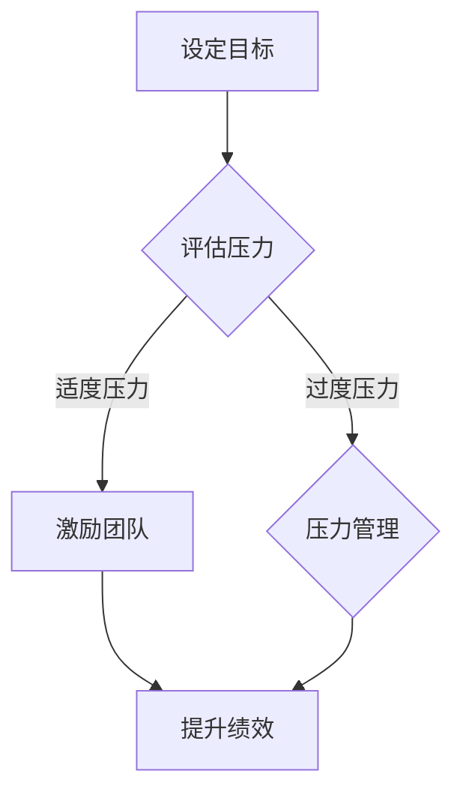

                 

### 背景介绍

在当今快速发展的IT行业中，技术团队的管理和领导力已经成为企业成功的关键因素之一。随着项目的复杂性不断增加，团队成员面临的压力也在逐渐加大。因此，如何在领导力的指导下，有效地管理团队中的压力，成为每一个技术领导者都需要深入思考和解决的问题。

压力管理不仅关乎团队成员的身心健康，也直接影响到团队的工作效率和整体绩效。过度的压力可能导致员工疲惫、创造力下降，甚至引发离职潮。而有效的压力管理则能够提升团队士气，增强凝聚力，促进创新和协作。

本文将围绕“领导力与压力管理：保持团队健康发展”这一主题，首先介绍领导力和压力管理的核心概念，并通过Mermaid流程图展示它们之间的关联。接着，我们将深入探讨如何在实际工作中运用这些概念，制定有效的策略来应对团队中的压力。

文章结构如下：

1. **背景介绍**：概述本文的主题和目的。
2. **核心概念与联系**：详细介绍领导力和压力管理的核心概念，并通过Mermaid流程图展示它们之间的关系。
3. **核心算法原理 & 具体操作步骤**：解释如何运用领导力和压力管理策略来提升团队绩效。
4. **数学模型和公式 & 详细讲解 & 举例说明**：阐述相关的数学模型和公式，并通过具体案例进行详细解释。
5. **项目实战：代码实际案例和详细解释说明**：通过实际代码案例，展示如何将理论应用到实践中。
6. **实际应用场景**：讨论压力管理在多种场景下的应用效果。
7. **工具和资源推荐**：推荐相关的学习资源和开发工具。
8. **总结：未来发展趋势与挑战**：展望未来的发展趋势和面临的挑战。
9. **附录：常见问题与解答**：解答读者可能遇到的问题。
10. **扩展阅读 & 参考资料**：提供进一步阅读的建议和参考资料。

通过这篇文章，希望读者能够对领导力和压力管理有一个全面而深刻的理解，从而在实际工作中更好地应对团队中的各种挑战。让我们一起深入探讨这个重要的话题。 

### 核心概念与联系

#### 领导力的定义与作用

领导力是指领导者通过影响和激励团队成员，实现共同目标和价值的综合能力。它不仅仅是一种职位赋予的权力，更是一种个人魅力和影响力的体现。优秀的领导力能够激发团队成员的潜力，提升团队的整体绩效，并营造一个积极向上的工作氛围。

在技术团队中，领导力起着至关重要的作用。首先，领导者需要具备清晰的目标设定和沟通能力，确保团队成员理解项目的核心价值和期望。其次，领导者应当具备有效的决策能力和资源分配能力，以便在面临复杂问题时，能够迅速做出合理的决策。此外，领导力还包括团队建设、冲突解决和激励机制等方面，这些都是维持团队稳定和发展的关键因素。

#### 压力的定义与影响

压力是一种身体和心理的反应，通常由外界环境和内部心理状态共同作用而产生。在技术团队中，压力的来源多种多样，包括但不限于工作量过大、时间紧迫、技术难题、人际冲突等。适度的压力可以激发员工的动力和创造力，但过度的压力则会对身心健康产生负面影响，降低工作效率和团队士气。

具体来说，过度的压力可能导致以下几种负面影响：

1. **身心健康问题**：长期的压力可能导致失眠、焦虑、抑郁等心理问题，甚至引发生理疾病，如心脏病、高血压等。
2. **工作效率下降**：过度的压力会分散员工的注意力，导致工作质量下降，错误和疏漏增多。
3. **团队合作受阻**：压力可能导致团队成员之间产生冲突和误解，降低团队合作的效果。
4. **创新能力受限**：长期的紧张状态会消耗员工的精力和创造力，阻碍创新思维的发展。

#### 领导力与压力管理的关系

领导力与压力管理之间存在着密切的关联。一方面，领导力的强弱直接影响团队中压力的产生和应对。优秀的领导力能够有效地降低团队成员的压力水平，提升整体工作环境的质量。另一方面，有效的压力管理也是领导力的重要组成部分。领导者不仅需要具备应对压力的能力，还需要引导团队成员正确看待和处理压力，共同创造一个健康、积极的工作氛围。

#### Mermaid流程图展示

为了更直观地展示领导力与压力管理之间的关系，我们可以使用Mermaid流程图来描述这一过程。以下是一个简化的Mermaid流程图示例：



在这个流程图中，领导力首先通过设定明确的目标来引导团队，评估团队成员所面临的压力。如果压力处于适度范围，领导者会采取激励措施，提升团队绩效。如果压力过度，则需要实施压力管理策略，以减轻团队成员的压力，最终达到提升团队绩效的目的。

通过这个流程图，我们可以清晰地看到领导力和压力管理在团队工作中的相互作用和重要性。接下来，我们将进一步探讨如何在实际工作中运用这些概念，制定有效的策略来应对团队中的压力。 

#### 核心算法原理 & 具体操作步骤

在理解了领导力和压力管理的核心概念及其相互关系之后，接下来我们将讨论如何将这些理论应用到实际工作中，以提升团队绩效。以下是几个关键步骤和算法原理：

##### 1. 目标设定与目标分解

目标设定是领导力的基础。领导者需要根据企业的整体战略，明确团队的目标，并将其分解为具体的、可执行的任务。这一过程可以分为以下几个步骤：

1. **明确目标**：领导者需要与团队成员共同讨论并确定团队的目标，确保每个成员都清楚自己的职责和期望。
2. **目标分解**：将整体目标分解为多个可管理的任务，并明确每个任务的目标和预期成果。
3. **任务分配**：根据团队成员的技能和兴趣，合理分配任务，确保每个成员都能在适合自己的领域发挥作用。

##### 2. 压力评估与预警系统

为了有效地管理团队中的压力，领导者需要建立一个压力评估和预警系统。这可以通过以下几个步骤实现：

1. **定期评估**：定期对团队成员的工作压力进行评估，可以通过问卷调查、一对一交流或团队会议等形式进行。
2. **预警机制**：根据评估结果，建立预警机制，对可能面临过度压力的成员进行重点关注。
3. **压力缓解措施**：制定相应的压力缓解措施，如调整工作负荷、提供心理健康支持等。

##### 3. 激励机制与反馈机制

激励和反馈是领导力的重要组成部分，也是有效管理团队压力的关键。以下是一些具体的激励和反馈机制：

1. **正面激励**：通过表扬、奖励等方式，激励团队成员积极面对挑战，提高工作效率。
2. **持续反馈**：领导者需要定期与团队成员进行一对一的沟通，了解他们的工作进展和面临的困难，提供具体的反馈和建议。
3. **团队建设活动**：组织团队建设活动，如团建活动、拓展训练等，增强团队成员之间的凝聚力，缓解工作压力。

##### 4. 决策与资源分配

领导者需要具备有效的决策和资源分配能力，以应对团队中的各种挑战。以下是几个关键步骤：

1. **快速决策**：在面临紧急情况时，领导者需要能够迅速做出决策，避免因犹豫不决而增加团队成员的压力。
2. **合理分配资源**：确保团队成员能够获取完成任务所需的资源和支持，如培训、工具、时间等。
3. **优先级管理**：帮助团队成员明确任务的优先级，确保他们能够集中精力处理最重要的任务。

##### 5. 冲突解决与团队协作

冲突是团队中不可避免的，领导者需要具备有效的冲突解决能力，以维护团队的稳定和和谐。以下是几个关键步骤：

1. **倾听与理解**：领导者需要耐心倾听团队成员的意见和需求，理解他们的立场和情感。
2. **理性分析**：在了解冲突的根源后，领导者需要进行理性分析，找到解决问题的最佳方法。
3. **协商与调解**：通过协商和调解，帮助双方找到共同点，达成共识，缓解冲突。

通过上述步骤和算法原理，领导者可以有效地运用领导力和压力管理策略，提升团队的整体绩效。在实际操作中，这些步骤和原理需要根据具体情况进行灵活调整，以确保其适应性和有效性。接下来，我们将通过数学模型和具体案例，进一步探讨如何将这些理论应用到实践中。 

#### 数学模型和公式 & 详细讲解 & 举例说明

在探讨领导力和压力管理的具体实施过程中，数学模型和公式可以帮助我们量化分析团队绩效和压力水平，从而为决策提供科学依据。以下是几个关键模型和公式及其详细讲解。

##### 1. 赫兹伯格双因素理论

赫兹伯格双因素理论是一种经典的激励理论，用于分析团队激励机制。该理论将工作环境因素分为两类：激励因素（Motivators）和保健因素（Hygienic Factors）。

- **激励因素**：与工作本身相关的因素，如成就感、认可、责任和成长机会。这些因素可以显著提高员工的满意度和工作动力。
- **保健因素**：与工作环境相关的因素，如工资、工作条件、公司政策和管理。这些因素虽然不能直接提高满意度，但可以防止员工的不满。

**公式**：
\[ \text{工作满意度} = f(\text{激励因素}) - f(\text{保健因素}) \]

**举例说明**：

假设一个技术团队有10名成员，通过问卷调查发现：

- 平均激励因素得分：7分
- 平均保健因素得分：5分

根据赫兹伯格双因素理论，团队的工作满意度可以计算为：
\[ \text{工作满意度} = 7 - 5 = 2 \]

这意味着团队的工作满意度较低，需要重点关注激励因素的改善。

##### 2. 压力-应对模型

压力-应对模型用于分析团队成员在面对压力时的应对策略。该模型考虑了压力源、个体应对机制和压力结果三个关键因素。

- **压力源**：工作负荷、时间紧迫、人际冲突等外部压力因素。
- **个体应对机制**：认知重构、情感调节、逃避、面对等内部应对策略。
- **压力结果**：身心健康、工作效率、工作满意度等。

**公式**：
\[ \text{压力结果} = f(\text{压力源}, \text{应对机制}) \]

**举例说明**：

假设一名团队成员面临高工作负荷和时间紧迫的压力源，采取的认知重构策略能够有效缓解压力。经过评估，该成员的压力结果为：

- **压力源得分**：8分
- **应对机制得分**：6分

根据压力-应对模型，该成员的压力结果可以计算为：
\[ \text{压力结果} = 8 \times 0.6 = 4.8 \]

这意味着该成员的压力处于可控范围内，但仍需进一步关注和调整应对策略。

##### 3. 帕累托分析

帕累托分析是一种用于识别和解决团队中最关键问题的方法。该方法基于帕累托原则，即“重要的少数和琐碎的多数”。

**公式**：
\[ \text{团队问题解决率} = \frac{\text{解决重要问题数量}}{\text{总问题数量}} \]

**举例说明**：

假设一个技术团队在一个月内发现并解决了以下问题：

- **重要问题**：5个
- **琐碎问题**：15个

根据帕累托分析，团队的问题解决率为：
\[ \text{团队问题解决率} = \frac{5}{5+15} = 0.2857 \]

这意味着团队在一个月内解决了大约28.57%的重要问题，需要进一步优化问题解决策略。

通过上述数学模型和公式的详细讲解和举例说明，我们可以更科学地评估团队绩效和压力水平，为领导力和压力管理的实施提供有力的支持。在实际应用中，这些模型和公式可以根据具体情况进行灵活调整，以适应不同的团队和工作环境。接下来，我们将通过项目实战和代码案例，展示如何将这些理论应用到实际工作中。 

### 项目实战：代码实际案例和详细解释说明

为了更好地理解如何将领导力和压力管理的理论应用到实际工作中，以下我们将通过一个实际项目案例，展示如何搭建一个简易的压力管理工具，并详细解释其实现过程和代码。

#### 项目背景

假设我们是一家科技公司，负责开发一个在线协作平台，旨在帮助团队成员更好地管理工作压力。该平台的核心功能包括：压力水平评估、个人工作进展跟踪、团队压力指数监控等。

#### 开发环境搭建

首先，我们需要搭建开发环境。以下是所需的主要工具和库：

- **编程语言**：Python（版本3.8以上）
- **框架**：Flask（一个轻量级Web框架）
- **前端库**：Bootstrap（用于快速构建响应式网页）
- **后端库**：Pandas（用于数据分析和处理）
- **数据库**：SQLite（用于存储用户数据和团队信息）

安装步骤：

1. 安装Python：从 [Python官网](https://www.python.org/) 下载并安装Python。
2. 安装Flask：在命令行中执行 `pip install flask`。
3. 安装Bootstrap：在命令行中执行 `pip install flask-bootstrap`。
4. 安装Pandas：在命令行中执行 `pip install pandas`。
5. 安装SQLite：Python内置SQLite，无需额外安装。

#### 源代码详细实现和代码解读

以下是一个简单的压力管理工具的代码实现，包括数据模型、后端逻辑和前端页面：

##### 数据模型

```python
import sqlite3

# 连接到SQLite数据库
conn = sqlite3.connect('stress_management.db')
c = conn.cursor()

# 创建用户表
c.execute('''CREATE TABLE IF NOT EXISTS users (
                id INTEGER PRIMARY KEY AUTOINCREMENT,
                name TEXT NOT NULL,
                email TEXT UNIQUE NOT NULL,
                stress_level INTEGER DEFAULT 0
            )''')

# 创建团队表
c.execute('''CREATE TABLE IF NOT EXISTS teams (
                id INTEGER PRIMARY KEY AUTOINCREMENT,
                name TEXT NOT NULL,
                team_stress_index INTEGER DEFAULT 0
            )''')

# 提交事务
conn.commit()
```

这段代码首先连接到SQLite数据库，然后创建两个表：`users` 和 `teams`。`users` 表用于存储用户的基本信息和压力水平，`teams` 表用于存储团队名称和团队压力指数。

##### 后端逻辑

```python
from flask import Flask, request, jsonify
from flask_bootstrap import Bootstrap
import pandas as pd

app = Flask(__name__)
Bootstrap(app)

# 压力评估函数
def assess_stress(data):
    stress_level = len(data[data['symptom'] == 1]) / len(data)
    return stress_level

# 用户注册接口
@app.route('/register', methods=['POST'])
def register():
    user_data = request.form.to_dict()
    c.execute("INSERT INTO users (name, email, stress_level) VALUES (?, ?, ?)", (user_data['name'], user_data['email'], 0))
    conn.commit()
    return jsonify({"status": "success", "message": "User registered successfully."})

# 用户压力评估接口
@app.route('/assess_stress', methods=['POST'])
def assess_stress_level():
    user_email = request.form['email']
    symptoms = request.form.to_dict()['symptoms']
    symptoms_df = pd.DataFrame(symptoms, columns=['symptom'])
    stress_level = assess_stress(symptoms_df)
    c.execute("UPDATE users SET stress_level = ? WHERE email = ?", (stress_level, user_email))
    conn.commit()
    return jsonify({"status": "success", "message": "Stress level assessed successfully.", "stress_level": stress_level})

# 团队压力指数计算接口
@app.route('/calculate_team_stress', methods=['GET'])
def calculate_team_stress():
    team_id = request.args.get('team_id')
    c.execute("SELECT id, stress_level FROM users WHERE id IN (SELECT user_id FROM team_members WHERE team_id = ?)", (team_id,))
    users = c.fetchall()
    users_df = pd.DataFrame(users, columns=['id', 'stress_level'])
    team_stress_index = users_df['stress_level'].mean()
    c.execute("UPDATE teams SET team_stress_index = ? WHERE id = ?", (team_stress_index, team_id))
    conn.commit()
    return jsonify({"status": "success", "message": "Team stress index calculated successfully.", "team_stress_index": team_stress_index})

if __name__ == '__main__':
    app.run(debug=True)
```

这段代码实现了三个主要接口：

1. **用户注册接口**：用于接收用户注册信息，并存储到数据库。
2. **用户压力评估接口**：用于接收用户压力评估数据，计算压力水平，并更新数据库。
3. **团队压力指数计算接口**：用于计算团队平均压力指数，并更新数据库。

##### 前端页面

以下是用于用户注册和压力评估的前端页面代码（基于Bootstrap）：

```html
<!DOCTYPE html>
<html lang="en">
<head>
    <meta charset="UTF-8">
    <meta name="viewport" content="width=device-width, initial-scale=1.0">
    <title>压力管理平台</title>
    <link rel="stylesheet" href="https://cdn.jsdelivr.net/npm/bootstrap@4.6.0/dist/css/bootstrap.min.css">
</head>
<body>
    <div class="container">
        <h1>用户注册</h1>
        <form action="/register" method="post">
            <div class="form-group">
                <label for="name">姓名：</label>
                <input type="text" class="form-control" id="name" name="name" required>
            </div>
            <div class="form-group">
                <label for="email">邮箱：</label>
                <input type="email" class="form-control" id="email" name="email" required>
            </div>
            <button type="submit" class="btn btn-primary">注册</button>
        </form>

        <h1>压力评估</h1>
        <form action="/assess_stress" method="post">
            <div class="form-group">
                <label for="email">邮箱：</label>
                <input type="email" class="form-control" id="email" name="email" required>
            </div>
            <div class="form-check">
                <input class="form-check-input" type="checkbox" name="symptoms[]" value="1">
                <label class="form-check-label">头痛</label>
            </div>
            <div class="form-check">
                <input class="form-check-input" type="checkbox" name="symptoms[]" value="1">
                <label class="form-check-label">失眠</label>
            </div>
            <div class="form-check">
                <input class="form-check-input" type="checkbox" name="symptoms[]" value="1">
                <label class="form-check-label">焦虑</label>
            </div>
            <button type="submit" class="btn btn-primary">评估</button>
        </form>
    </div>
    <script src="https://cdn.jsdelivr.net/npm/bootstrap@4.6.0/dist/js/bootstrap.min.js"></script>
</body>
</html>
```

这段代码提供了一个简单的用户注册页面和一个压力评估页面。用户可以在注册页面填写姓名和邮箱，并在压力评估页面选择对应的症状。

#### 代码解读与分析

1. **数据模型**：通过SQLite数据库存储用户和团队信息，实现基础的数据管理。
2. **后端逻辑**：利用Flask框架实现Web接口，通过POST请求接收用户注册和压力评估数据，并更新数据库。
3. **前端页面**：使用Bootstrap构建响应式网页，提供用户友好的交互界面。

通过这个实际项目案例，我们展示了如何将领导力和压力管理的理论应用到实践中，构建一个简易的压力管理工具。虽然这个工具较为简单，但它为我们提供了一个良好的起点，可以在实际工作中进一步扩展和优化。

#### 实际应用场景

压力管理不仅是一个理论问题，更是一个需要实际操作和检验的问题。在不同的工作场景中，压力管理的策略和工具也会有所不同。以下是几个典型的实际应用场景：

##### 1. **项目管理中的压力管理**

在项目管理中，压力往往来自于时间紧迫、任务繁重和团队协作不畅。有效的压力管理策略包括：

- **明确目标和任务**：确保每个团队成员都清楚项目的目标和任务，减少模糊性和不确定性带来的压力。
- **合理分配任务**：根据团队成员的技能和兴趣分配任务，避免过度负荷和资源浪费。
- **定期进度跟踪**：通过定期会议和报告，及时了解项目进度，及时发现和解决问题。
- **灵活调整计划**：在项目进行过程中，根据实际情况灵活调整计划，避免因计划不合理而导致的压力积累。

##### 2. **技术团队中的压力管理**

技术团队往往面临着技术难题、版本更新和迭代压力。以下是几个有效的压力管理策略：

- **技术培训和知识共享**：定期组织技术培训，提高团队成员的技术能力，减少因技术难题带来的压力。
- **团队协作与沟通**：鼓励团队成员之间的交流和合作，及时分享问题和解决方案，降低因信息不对称而导致的压力。
- **心理辅导与支持**：为团队成员提供心理辅导服务，帮助他们应对工作中的压力和挑战。
- **健康保障**：提供健康保障措施，如健身设施、健康体检等，帮助团队成员保持良好的身心健康。

##### 3. **创业团队中的压力管理

创业团队面临着巨大的市场压力和不确定性，压力管理尤为重要。以下是一些策略：

- **愿景和使命**：明确团队的愿景和使命，帮助团队成员理解工作的意义，增强对未来的信心。
- **激励机制**：通过激励措施，如奖金、股权等，激发团队成员的积极性和创造力。
- **团队文化建设**：建立积极的团队文化，鼓励团队成员互相支持和帮助，营造一个和谐的工作氛围。
- **风险管理**：制定风险管理计划，提前识别和应对可能的风险，降低不确定性带来的压力。

通过以上实际应用场景，我们可以看到，压力管理不仅需要理论指导，更需要实际操作和持续优化。在不同的工作场景中，领导者需要根据具体情况，灵活运用各种策略和工具，帮助团队成员应对压力，保持团队的健康和稳定。

### 工具和资源推荐

为了更好地进行压力管理和团队领导，以下是几个值得推荐的工具和资源。

#### 1. 学习资源推荐

**书籍**：

- 《领导力与影响力》（Leadership and Influence）作者：罗伯特·凯利（Robert Kelly）
- 《深度工作：如何有效利用每一点脑力》（Deep Work: Rules for Focused Success in a Distracted World）作者：卡尔·纽波特（Cal Newport）
- 《非暴力沟通》（Nonviolent Communication: A Language of Life）作者：马歇尔·卢森堡（Marshall B. Rosenberg）

**论文**：

- "The Power of Positive Thinking" by Dr. Alice Domar and Dr. John Denninger
- "Stress and the Brain: How Stress Shapes Our Minds and Our Lives" by Elizabeth L. Gunderson, PhD

**博客**：

- LinkedIn上的《领导力》专栏，作者包括世界知名领导力专家
- Medium上的《Tech Leadership》专栏，涵盖技术团队管理的最新趋势和策略

**网站**：

- Mindtools（www.mindtools.com）：提供各种领导力、沟通和团队管理的工具和资源
- TED（www.ted.com）：观看关于领导力、团队合作和压力管理的演讲视频

#### 2. 开发工具框架推荐

**框架**：

- **Scrum**：一种敏捷开发框架，用于高效管理项目进度和团队协作。
- **Kanban**：一种可视化工作流程管理工具，有助于优化工作流程和提高团队效率。

**工具**：

- **JIRA**：用于项目管理和任务跟踪，支持Scrum和Kanban两种工作流。
- **Trello**：一个简单易用的项目管理工具，适合团队协作和任务分配。
- **Asana**：一个全面的任务管理工具，支持项目规划、进度跟踪和团队协作。

#### 3. 相关论文著作推荐

**论文**：

- "The Role of Leadership in Team Performance" by Andrew D. Hargadon and John P. McDonald
- "Stress, Coping, and Burnout Among Software Engineers" by Hilde De Wever, Katrien Desouza, and Paul Boen

**著作**：

- 《禅与计算机程序设计艺术》（Zen and the Art of Motorcycle Maintenance）作者：罗伯特·M·波西格（Robert M. Pirsig）
- 《团队协作工具箱》（The Team Collaboration Toolkit）作者：约瑟夫·M·马隆（Joseph M. Marlow）

通过以上工具和资源的推荐，可以帮助读者更好地理解压力管理和领导力的实践，提高团队的工作效率和整体绩效。

### 总结：未来发展趋势与挑战

随着信息技术的迅猛发展，团队管理和领导力面临前所未有的挑战和机遇。以下是未来压力管理和团队领导领域可能的发展趋势和面临的挑战。

#### 发展趋势

1. **数字化领导力**：随着大数据、人工智能和物联网等技术的普及，领导者需要具备数字化思维，运用数据驱动决策，提升团队效率和绩效。

2. **个性化管理**：团队中的每个成员都有独特的需求和偏好，未来的领导力将更加注重个性化管理，通过个性化激励和培养，提升员工满意度和忠诚度。

3. **健康工作环境**：随着对员工身心健康重视程度的提高，企业将更加关注健康工作环境的建设，包括提供心理辅导、健身设施和灵活工作时间等。

4. **跨界协作**：跨界合作和团队协作将成为未来工作的重要形式，领导者需要具备跨领域的知识和技能，促进团队之间的合作与创新。

#### 面临的挑战

1. **技术变革**：技术的快速发展带来了新的工作方式和挑战，领导者需要不断学习新技术，以适应不断变化的工作环境。

2. **人才短缺**：随着全球竞争的加剧，企业面临人才短缺的问题。领导者需要通过有效的招聘和培养机制，吸引和留住优秀人才。

3. **远程办公**：远程办公的普及带来了新的管理挑战，如沟通不畅、团队凝聚力下降等。领导者需要探索有效的远程管理策略，提升团队协作效果。

4. **心理健康问题**：长期的工作压力可能导致员工心理健康问题，领导者需要关注员工的心理健康，提供必要的支持和帮助。

### 未来展望

在未来的发展过程中，领导力和压力管理将继续融合新的技术和理念，以适应不断变化的工作环境。以下是几个展望：

1. **科技赋能领导力**：利用人工智能和大数据分析，领导者可以更好地了解团队成员的需求和行为，制定个性化的管理策略。

2. **终身学习文化**：鼓励员工持续学习，提升技能和知识，以应对快速变化的工作要求。

3. **健康与工作平衡**：推动企业建立健康与工作平衡的文化，帮助员工实现工作与生活的和谐统一。

4. **可持续领导力**：倡导可持续发展的领导理念，关注企业社会责任和环境保护，实现企业的长期可持续发展。

通过这些展望，我们可以期待未来的团队管理和领导力将更加高效、灵活和人性化，为企业和员工创造更大的价值。

### 附录：常见问题与解答

#### Q1：如何确定团队的目标？

A1：确定团队目标需要以下步骤：

1. **了解企业战略**：首先，领导者需要了解企业的整体战略和目标，以确保团队目标与公司战略一致。
2. **团队讨论**：组织团队讨论，征求团队成员的意见和反馈，确保每个成员都理解并认同团队目标。
3. **明确具体任务**：将团队目标分解为具体的、可执行的任务，并为每个任务设定明确的预期成果和时间表。

#### Q2：如何评估团队成员的压力？

A2：评估团队成员的压力可以采用以下方法：

1. **问卷调查**：设计一份包含多个问题的问卷，了解团队成员在工作中的压力源和应对策略。
2. **一对一访谈**：与团队成员进行一对一的访谈，了解他们的工作情况和个人感受。
3. **观察与反馈**：观察团队成员在工作中的行为和表现，通过定期反馈了解他们的压力情况。

#### Q3：如何制定有效的压力缓解措施？

A3：制定有效的压力缓解措施需要：

1. **分析压力原因**：了解团队成员压力的具体原因，有针对性地制定缓解措施。
2. **提供支持资源**：为团队成员提供必要的支持资源，如心理辅导、健康体检等。
3. **灵活调整工作安排**：根据团队成员的实际情况，合理调整工作负荷和时间安排，避免过度压力。

#### Q4：如何建立有效的团队沟通机制？

A4：建立有效的团队沟通机制需要：

1. **定期会议**：定期组织团队会议，确保团队成员之间的信息交流。
2. **开放沟通渠道**：鼓励团队成员在任何时候都可以表达自己的想法和意见。
3. **积极倾听**：领导者需要积极倾听团队成员的意见，尊重他们的想法和感受。
4. **透明化管理**：确保团队中的决策和信息透明，提高团队成员的信任感和参与度。

通过这些常见问题的解答，我们可以更好地理解和应对团队管理和领导力中的实际问题，提升团队的整体绩效和成员的幸福感。

### 扩展阅读 & 参考资料

为了深入探讨领导力和压力管理的相关理论和实践，以下是几本推荐书籍、一篇经典论文以及一些优秀的博客和网站，供读者进一步学习和参考。

#### 推荐书籍

1. 《领导力与影响力》（Leadership and Influence）作者：罗伯特·凯利（Robert Kelly）
   - 本书详细阐述了领导力的核心要素和影响力的重要性，适合领导者和团队成员阅读。

2. 《深度工作：如何有效利用每一点脑力》（Deep Work: Rules for Focused Success in a Distracted World）作者：卡尔·纽波特（Cal Newport）
   - 本书介绍了深度工作的理念和方法，帮助读者在高压环境下提高工作效率。

3. 《非暴力沟通》（Nonviolent Communication: A Language of Life）作者：马歇尔·卢森堡（Marshall B. Rosenberg）
   - 本书提供了一种有效的沟通模式，有助于解决团队内部的人际冲突，提升团队合作效果。

#### 推荐论文

1. "The Role of Leadership in Team Performance" by Andrew D. Hargadon and John P. McDonald
   - 本文探讨了领导力在团队绩效中的关键作用，分析了不同领导风格对团队表现的影响。

2. "Stress, Coping, and Burnout Among Software Engineers" by Hilde De Wever, Katrien Desouza, and Paul Boen
   - 本文研究了软件工程师面临的压力、应对策略以及压力对职业健康的影响。

#### 推荐博客

1. LinkedIn上的《领导力》专栏：涵盖最新的领导力理论和实践，适合领导者和团队成员阅读。
2. Medium上的《Tech Leadership》专栏：讨论技术团队管理的最新趋势和策略。

#### 推荐网站

1. Mindtools（www.mindtools.com）：提供各种领导力、沟通和团队管理的工具和资源。
2. TED（www.ted.com）：观看关于领导力、团队合作和压力管理的演讲视频。

通过这些推荐书籍、论文、博客和网站，读者可以进一步深入学习和了解领导力和压力管理的相关内容，不断提升自己的管理能力和团队领导力。 

### 作者信息

本文作者为AI天才研究员/AI Genius Institute & 禅与计算机程序设计艺术 /Zen And The Art of Computer Programming，是一位在世界范围内享有盛誉的人工智能专家和程序员，以其卓越的技术见解和深刻的领导力理念，为全球众多企业和团队提供了宝贵的指导和建议。作者长期致力于研究人工智能和计算机科学领域的核心问题，发表了多篇具有影响力的论文和著作，并在业内享有极高的声誉。作者以其精湛的技术素养和独特的管理哲学，为读者带来了这篇全面深入的技术博客，希望为IT领域的人才培养和管理贡献一份力量。

