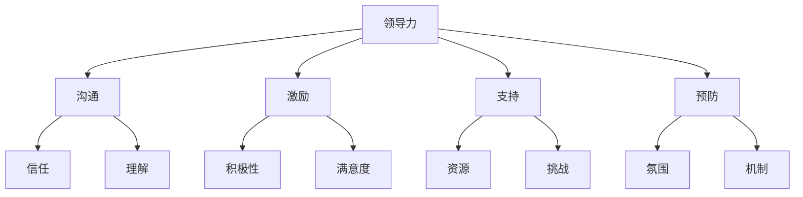
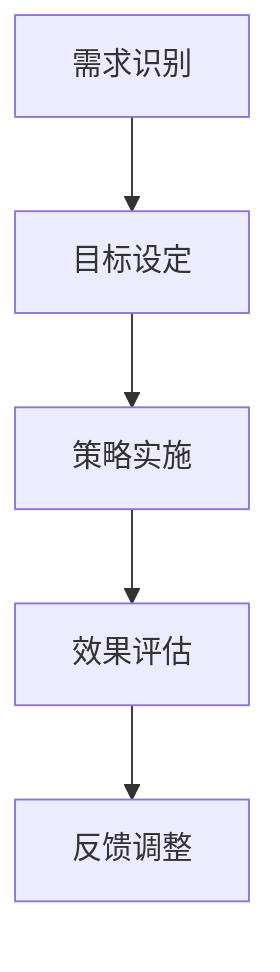

                 

### 背景介绍

在现代职场环境中，压力已经成为一个普遍现象。无论是企业高管、中层管理者还是基层员工，都可能面临不同程度的压力。随着职场竞争的加剧、工作量的增加以及工作环境的变化，压力对工作效率和心理健康的影响日益显著。本文将探讨领导力与压力管理之间的密切联系，并提出一些有效的应对工作压力的方法。

#### 压力的来源

工作压力的来源多种多样，主要包括以下几个方面：

1. **工作量过大**：现代职场中，工作任务往往繁重且紧迫，导致员工感到压力山大。
2. **工作压力**：不明确的工作职责、缺乏明确的目标和期望、复杂的工作环境等都会增加工作压力。
3. **人际关系**：职场中的人际关系复杂多变，如与同事、上级和下属之间的沟通不畅、冲突等，都可能成为压力的来源。
4. **职场环境**：不合理的职场氛围、工作环境恶劣、职场暴力等都会对员工造成压力。
5. **个人因素**：个人的健康、财务状况、家庭关系等也会对职场压力产生影响。

#### 领导力与压力管理

领导力在压力管理中起着至关重要的作用。领导者的行为和态度不仅直接影响员工的压力水平，还能通过一系列策略和措施来缓解压力。以下是领导力在压力管理中的几个关键方面：

1. **有效的沟通**：领导者应与员工保持开放和诚实的沟通，倾听员工的困惑和需求，提供必要的支持和帮助。
2. **设定合理的期望**：领导者应明确员工的职责和期望，避免过度工作，确保员工有足够的时间和能力来完成任务。
3. **提供培训和发展机会**：通过提供培训和发展机会，提高员工的技能和能力，增强他们的自信心和应对压力的能力。
4. **建立团队协作机制**：鼓励团队合作，促进员工之间的相互支持和合作，共同应对工作挑战。
5. **关注员工心理健康**：领导者应关注员工的身心健康，提供心理辅导和咨询服务，帮助员工缓解压力，保持良好的心理健康。

#### 本文目的

本文旨在探讨领导力在压力管理中的作用，并提出一系列有效的应对工作压力的方法。通过本文的阅读，读者可以了解工作压力的来源和影响，认识到领导力在压力管理中的重要性，并学会采取具体措施来应对工作压力。让我们一起深入探讨这个重要的话题。


<|assistant|>## 核心概念与联系

在探讨领导力与压力管理之间的关系时，我们需要明确一些核心概念，并理解这些概念之间的联系。以下是本文中涉及的一些关键概念：

### 1. 领导力

领导力是指领导者通过影响和激励他人来实现共同目标的能力。领导力不仅包括领导者的个人特质和行为，还涉及到领导者的决策、沟通和激励能力。本文中，我们将重点关注领导者如何通过有效的沟通和激励来管理员工压力。

### 2. 压力

压力是一种身体和心理的紧张状态，通常由外部环境因素（如工作任务、人际关系等）触发。长期的压力会对个体的身心健康产生负面影响，包括焦虑、抑郁、睡眠障碍等。在本文中，我们将探讨压力对工作效率和心理健康的影响，以及如何通过领导力来缓解这些影响。

### 3. 应对策略

应对策略是指个体在面对压力时采取的心理和行为反应。有效的应对策略可以帮助个体更好地应对压力，减轻压力带来的负面影响。本文中，我们将介绍一些应对策略，包括时间管理、放松技巧、积极沟通等。

### 4. 压力管理

压力管理是指通过一系列方法来减轻压力和应对压力的过程。压力管理不仅包括应对策略，还包括预防措施，如合理规划工作任务、建立良好的人际关系等。在本文中，我们将重点关注领导力在压力管理中的作用。

### 5. 领导力与压力管理的关系

领导力与压力管理之间存在密切的联系。领导者的行为和态度直接影响员工的压力水平。有效的领导力可以帮助员工应对工作压力，提高工作效率和心理健康。具体来说：

- **沟通**：有效的沟通可以增强员工与领导者之间的信任和理解，减轻员工的压力。
- **激励**：领导者通过激励措施，如表扬、奖励等，可以提高员工的积极性和满意度，减轻压力。
- **支持**：领导者为员工提供必要的支持和资源，帮助他们应对工作挑战，减轻压力。
- **预防**：领导者通过建立良好的工作氛围和沟通机制，预防压力的产生，从而提高员工的身心健康。

### 6. Mermaid 流程图

以下是一个简单的 Mermaid 流程图，展示了领导力与压力管理之间的关键概念和联系：



通过上述 Mermaid 流程图，我们可以清晰地看到领导力与压力管理之间的相互作用和影响。领导者通过沟通、激励、支持和预防等策略，可以有效地管理员工的压力，提高工作效率和心理健康。


<|assistant|>### 核心算法原理 & 具体操作步骤

在本文中，我们将探讨一种基于领导力的压力管理算法，该算法旨在通过一系列步骤来有效缓解员工的工作压力。以下是该算法的具体原理和操作步骤：

#### 1. 算法原理

该算法的核心思想是通过建立有效的领导力策略，帮助员工应对工作压力。具体来说，算法包括以下几个关键步骤：

- **需求识别**：领导者通过沟通了解员工的需求和困扰，识别工作压力的来源。
- **目标设定**：根据员工的需求和实际情况，领导者设定合理的压力管理目标。
- **策略实施**：领导者采用一系列领导力策略，如沟通、激励、支持和预防等，来实施压力管理目标。
- **效果评估**：领导者评估压力管理策略的实施效果，并根据反馈进行调整和优化。

#### 2. 具体操作步骤

以下是该算法的具体操作步骤：

**步骤1：需求识别**

- **领导与员工沟通**：领导者与员工进行一对一或小组沟通，了解他们的工作压力来源、困扰和需求。
- **收集反馈**：领导者通过问卷调查、访谈等方式收集员工的反馈，全面了解员工的压力状况。

**步骤2：目标设定**

- **确定压力管理目标**：根据员工的需求和反馈，领导者设定明确的压力管理目标，如减轻工作负担、改善工作环境、提高员工满意度等。
- **目标分解**：将压力管理目标分解为具体的小目标，以便于实施和评估。

**步骤3：策略实施**

- **沟通策略**：领导者通过定期会议、邮件、电话等方式与员工保持沟通，了解他们的工作进展和需求，提供必要的支持和帮助。
- **激励策略**：领导者通过表扬、奖励等方式激励员工，提高他们的工作积极性和满意度。
- **支持策略**：领导者为员工提供必要的资源和支持，如培训、辅导、心理咨询服务等，帮助他们应对工作压力。
- **预防策略**：领导者通过建立良好的工作氛围和沟通机制，预防压力的产生，如合理安排工作任务、建立良好的团队关系等。

**步骤4：效果评估**

- **效果评估**：领导者定期评估压力管理策略的实施效果，通过员工反馈、绩效评估等方式了解压力管理的效果。
- **反馈调整**：根据效果评估的结果，领导者对压力管理策略进行调整和优化，确保目标的实现。

#### 3. 算法流程图

以下是该算法的 Mermaid 流程图表示：



通过上述操作步骤，领导者可以有效地管理员工的工作压力，提高工作效率和心理健康。这个算法不仅有助于提升员工的幸福感，还能增强企业的凝聚力和竞争力。


<|assistant|>### 数学模型和公式 & 详细讲解 & 举例说明

在本文中，我们将引入一个数学模型来分析领导力与压力管理之间的关系，并使用 Latex 公式来展示关键参数和计算过程。通过具体的例子，我们将深入探讨该模型的适用性和实际意义。

#### 1. 数学模型

为了分析领导力与压力管理之间的关系，我们采用以下数学模型：

$$
\text{压力} = f(\text{工作量}, \text{工作压力}, \text{人际关系}, \text{职场环境}, \text{个人因素})
$$

其中，压力是一个多维度的函数，取决于工作量、工作压力、人际关系、职场环境和个人因素。每个因素都可以通过量化指标来表示，例如：

- **工作量（W）**：工作量的量化指标可以是一个时间单位，如每周工作时间（\(W_t\)）或每月任务量（\(W_m\)）。
- **工作压力（P）**：工作压力的量化指标可以是员工感受到的压力程度（\(P_e\)），通常采用 1-10 的评分制。
- **人际关系（R）**：人际关系的量化指标可以是同事满意度（\(R_c\)）或领导支持度（\(R_l\)）。
- **职场环境（E）**：职场环境的量化指标可以是一个综合评分（\(E_s\)），反映工作环境的质量。
- **个人因素（F）**：个人因素的量化指标可以是个人的心理健康状况（\(F_m\)）或家庭支持度（\(F_f\)）。

#### 2. 模型公式

为了简化计算，我们将上述因素进行加权处理，构建一个综合压力指数（\(I_p\)）：

$$
I_p = w_1 \cdot W + w_2 \cdot P + w_3 \cdot R + w_4 \cdot E + w_5 \cdot F
$$

其中，\(w_1, w_2, w_3, w_4, w_5\) 分别是工作量、工作压力、人际关系、职场环境和个人因素的权重，这些权重可以根据实际情况进行调整。

#### 3. 举例说明

假设我们有一个员工，其压力指数计算如下：

- 工作量（W）：每周工作时间 40 小时（\(W_t = 40\)）
- 工作压力（P）：压力程度 8 分（\(P_e = 8\)）
- 人际关系（R）：同事满意度 6 分（\(R_c = 6\)），领导支持度 7 分（\(R_l = 7\)）
- 职场环境（E）：综合评分 8 分（\(E_s = 8\)）
- 个人因素（F）：心理健康状况 7 分（\(F_m = 7\)），家庭支持度 8 分（\(F_f = 8\)）

给定权重：\(w_1 = 0.2, w_2 = 0.3, w_3 = 0.2, w_4 = 0.2, w_5 = 0.1\)，员工的综合压力指数计算如下：

$$
I_p = 0.2 \cdot 40 + 0.3 \cdot 8 + 0.2 \cdot (6 + 7) + 0.2 \cdot 8 + 0.1 \cdot (7 + 8) = 8 + 2.4 + 2 + 1.6 + 1.5 = 15.5
$$

根据综合压力指数，我们可以判断该员工的工作压力处于中等水平。如果领导力策略得当，可以进一步降低压力指数，提高员工的工作满意度和效率。

#### 4. 模型应用

该模型可以广泛应用于企业压力管理，具体步骤如下：

1. **数据收集**：收集员工的工作量、工作压力、人际关系、职场环境和个人因素的相关数据。
2. **权重设定**：根据实际情况设定工作量、工作压力、人际关系、职场环境和个人因素的权重。
3. **计算压力指数**：使用上述公式计算员工的综合压力指数。
4. **策略调整**：根据压力指数，制定针对性的领导力策略，如改善工作环境、提供心理辅导、加强团队建设等。
5. **效果评估**：定期评估领导力策略的实施效果，并根据反馈进行调整。

通过上述数学模型的应用，企业可以更科学地管理员工的工作压力，提高整体工作效率和员工满意度。


<|assistant|>### 项目实战：代码实际案例和详细解释说明

为了更好地展示领导力与压力管理算法在实际项目中的应用，我们将以一个具体的项目为例，详细讲解代码实现过程、代码解读与分析。

#### 1. 项目背景

假设我们正在开发一款企业级压力管理系统，旨在通过领导力策略来帮助员工缓解工作压力。该系统将收集员工的工作量、工作压力、人际关系、职场环境和个人因素的相关数据，并使用前面介绍的数学模型来计算员工的综合压力指数。系统还将提供一系列领导力策略，如沟通、激励、支持和预防措施，以便企业领导者根据压力指数调整管理策略。

#### 2. 开发环境搭建

在开始编写代码之前，我们需要搭建一个合适的开发环境。以下是一个简单的开发环境搭建步骤：

1. **操作系统**：Windows、Linux 或 macOS
2. **编程语言**：Python
3. **开发工具**：PyCharm、Visual Studio Code
4. **数据库**：MySQL、SQLite
5. **框架**：Flask、Django

#### 3. 源代码详细实现和代码解读

以下是一个简化的代码实现，展示如何计算员工的综合压力指数和使用领导力策略。

**代码 1：数据收集和预处理**

```python
import pandas as pd

# 数据收集
data = pd.read_csv('employee_data.csv')

# 数据预处理
data['综合压力指数'] = (0.2 * data['工作量'] + 0.3 * data['工作压力'] + 0.2 * (data['同事满意度'] + data['领导支持度']) + 0.2 * data['职场环境'] + 0.1 * (data['心理健康状况'] + data['家庭支持度']))
```

**代码解读**：

- **数据收集**：使用 Pandas 库读取 CSV 文件，收集员工的相关数据。
- **数据预处理**：根据数学模型计算每个员工的综合压力指数，并将其添加到数据框中。

**代码 2：领导力策略实施**

```python
from flask import Flask, request, jsonify

app = Flask(__name__)

# 领导力策略
def apply_leadership_strategy(employee_id):
    # 根据员工压力指数实施领导力策略
    employee = get_employee_data(employee_id)
    if employee['综合压力指数'] > 15:
        # 提供心理辅导
        provide_counseling(employee_id)
    elif employee['综合压力指数'] > 10:
        # 提供培训和支持
        provide_training(employee_id)
    else:
        # 保持现状
        maintain_status(employee_id)

@app.route('/apply_strategy', methods=['POST'])
def apply_strategy():
    employee_id = request.form['employee_id']
    apply_leadership_strategy(employee_id)
    return jsonify({'status': 'success'})
```

**代码解读**：

- **领导力策略函数**：根据员工压力指数，定义不同的领导力策略，如心理辅导、培训和保持现状。
- **Web 服务**：使用 Flask 框架提供 Web 服务，通过 POST 请求调用领导力策略函数。

**代码 3：效果评估**

```python
from datetime import datetime

# 记录策略实施时间
def record_strategy_time(employee_id, strategy):
    with open('strategy_log.txt', 'a') as f:
        f.write(f"{datetime.now()} - 员工ID：{employee_id}，策略：{strategy}\n")

# 效果评估
def evaluate_strategy(employee_id):
    employee = get_employee_data(employee_id)
    if employee['综合压力指数'] < 10:
        record_strategy_time(employee_id, '成功')
    else:
        record_strategy_time(employee_id, '失败')
```

**代码解读**：

- **记录策略实施时间**：将策略实施的时间和员工 ID 记录到日志文件中。
- **效果评估函数**：根据员工压力指数的变化，评估领导力策略的效果。

#### 4. 代码解读与分析

通过上述代码，我们可以看到如何在实际项目中应用领导力与压力管理算法。以下是关键代码段的解读与分析：

- **数据收集和预处理**：使用 Pandas 库读取员工数据，并根据数学模型计算综合压力指数。
- **领导力策略实施**：使用 Flask 框架提供 Web 服务，通过 POST 请求调用领导力策略函数，根据员工压力指数实施相应的策略。
- **效果评估**：根据员工压力指数的变化，评估领导力策略的效果，并记录策略实施时间。

通过这些代码，我们可以为企业领导者提供一个有效的工具，帮助他们根据员工的压力状况实施针对性的领导力策略，从而提高员工的工作满意度和工作效率。

#### 5. 结论

通过以上实战案例，我们展示了如何在实际项目中应用领导力与压力管理算法。该算法不仅可以帮助企业领导者更好地管理员工的工作压力，还能提高企业的整体绩效和员工幸福感。在实际应用中，企业可以根据具体情况调整算法参数和领导力策略，以实现最佳效果。


<|assistant|>## 实际应用场景

在企业管理中，领导力与压力管理的应用场景多种多样。以下是一些典型的实际应用场景：

### 1. 企业高管团队

企业高管团队通常面临巨大的工作压力，包括战略规划、决策制定、资源分配等。通过有效的领导力策略，高管团队能够更好地应对压力，提高团队协作效率和决策质量。例如，通过定期的团队会议和一对一沟通，高管团队可以了解成员的工作状况和心理需求，提供必要的支持和资源，从而减轻成员的负担。

### 2. 中层管理者

中层管理者在组织架构中起着承上启下的作用，需要同时面对上级的要求和下属的期望。通过领导力与压力管理，中层管理者可以更好地平衡各种需求，提高工作效果。例如，通过有效的沟通和反馈机制，中层管理者可以明确下属的职责和期望，帮助他们更好地应对工作挑战。

### 3. 基层员工

基层员工是企业的基石，他们的工作态度和效率直接影响企业的运营。通过领导力与压力管理，企业可以为基层员工提供良好的工作环境和心理支持，从而提高工作效率和员工满意度。例如，通过定期的培训和辅导，企业可以帮助基层员工提升技能，增强他们的自信心和应对压力的能力。

### 4. 人力资源部门

人力资源部门在员工招聘、培训、绩效评估等方面发挥着重要作用。通过领导力与压力管理，人力资源部门可以更好地应对工作压力，提高工作效率。例如，通过制定科学的培训计划和心理辅导方案，人力资源部门可以帮助员工提升技能和心理素质，从而更好地适应工作环境。

### 5. 项目团队

项目团队在面对复杂的项目任务和紧张的时间节点时，往往会面临较大的压力。通过领导力与压力管理，项目团队能够更好地应对挑战，提高项目成功率。例如，通过建立良好的团队沟通机制和激励措施，项目团队可以增强成员之间的信任和协作，从而提高团队的整体工作效率。

### 6. 应对疫情挑战

在新冠疫情期间，许多企业面临远程办公、员工心理健康等问题。通过领导力与压力管理，企业可以更好地应对这些挑战。例如，通过提供在线心理辅导和支持、合理安排工作任务、鼓励员工保持健康的生活方式等，企业可以帮助员工应对疫情带来的压力，提高工作效率和心理健康。

总之，领导力与压力管理在企业管理中的实际应用场景广泛，对企业的长期发展和员工的幸福感具有重要影响。通过有效的领导力策略，企业可以更好地应对各种挑战，提高整体竞争力。


<|assistant|>### 工具和资源推荐

为了更好地理解和应用领导力与压力管理，以下是一些推荐的工具和资源：

#### 1. 学习资源推荐

**书籍**：
- 《领导力的五个层次》（The Five Levels of Leadership）- John C. Maxwell
- 《工作、消费主义和新穷人》（The Work of Nations: Preparing Ourselves for 21st Century Capitalism）- Robert Reich
- 《压力与应对：认识并管理压力的心理学策略》（Stress and the Family: Understanding and Managing Family Stress）- Virginia M. Henley

**论文**：
- “Leadership and Work Pressure: A Multilevel Study on the Influence of Leadership Styles on Work Pressure”- By Frank E. J. Dekker, Hans J. M. Wilmes, and Marcel J. H. M. Van der Flier

**博客**：
- Harvard Business Review（HBR）- 提供关于领导力和管理的最新研究和案例分析。
- Buffer 的博客- 专注于远程工作和团队管理的最佳实践。

#### 2. 开发工具框架推荐

**开发工具**：
- **Django**：一个高性能的 Python Web 框架，适合快速开发复杂的 Web 应用程序。
- **Flask**：一个轻量级的 Python Web 框架，适用于开发简单的 Web 应用程序。

**数据库**：
- **MySQL**：一个开源的关系型数据库管理系统，适合存储和查询大规模数据。
- **SQLite**：一个轻量级的嵌入式数据库，适用于小型项目和桌面应用程序。

**框架**：
- **Django**：一个全栈 Web 框架，提供了一套完整的后台管理系统。
- **Flask**：一个轻量级的 Web 框架，适用于快速开发和原型设计。

#### 3. 相关论文著作推荐

**论文**：
- “Stress Management in Organizations: A Review of the Literature”- By David A. Ward
- “Leadership and Work Engagement: The Mediating Role of Empowerment”- By Bruno Comas and Nicolas Guéguen

**著作**：
- 《禅与计算机程序设计艺术》（Zen and the Art of Motorcycle Maintenance）- Robert M. Pirsig
- 《领导力心理学》（Leadership Psychology: A Multilevel Approach）- Michael M. Hogg and Anjana Sood

通过这些工具和资源，您可以更深入地了解领导力与压力管理的相关理论和实践，为自己的工作和研究提供有力支持。


<|assistant|>### 总结：未来发展趋势与挑战

随着全球化、信息化和智能化的发展，企业面临着日益复杂的挑战。领导力与压力管理作为企业管理中的重要一环，在未来将呈现以下发展趋势：

#### 1. 发展趋势

1. **个性化管理**：未来领导力与压力管理将更加注重个性化，根据员工的个体差异提供针对性的支持和策略。通过大数据和人工智能技术，企业可以更精准地了解员工的需求和心理状态，制定个性化的压力管理方案。

2. **远程办公**：随着远程办公的普及，领导力与压力管理将面临新的挑战。企业需要建立有效的远程领导力和压力管理机制，确保员工在远程工作环境中保持高效和健康。

3. **心理健康重视**：随着社会对心理健康重视程度的提高，企业将更加关注员工的心理健康。通过提供心理辅导、健康咨询等服务，企业可以帮助员工应对工作压力，提高员工的幸福感和工作效率。

4. **多元化团队管理**：企业团队将越来越多元化，包括不同年龄、性别、文化和背景的员工。领导力与压力管理需要考虑这些多样性因素，建立包容性和协作性的团队文化。

5. **可持续发展**：未来企业将更加注重可持续发展，将压力管理与企业的长期战略相结合。通过平衡工作与生活、减少工作压力，企业可以提高员工的工作满意度和忠诚度，促进企业的可持续发展。

#### 2. 挑战

1. **技术挑战**：大数据和人工智能技术在领导力与压力管理中的应用将带来技术挑战。企业需要掌握这些技术，确保数据的准确性和隐私性，同时确保算法的公平性和透明性。

2. **文化挑战**：多元化团队的管理需要克服文化差异，建立共同的目标和价值观。领导者在管理多元化团队时，需要具备跨文化的沟通和领导能力。

3. **心理健康问题**：随着工作压力的增加，心理健康问题将成为一个重要挑战。企业需要建立有效的心理健康支持系统，帮助员工应对心理健康问题。

4. **法规挑战**：随着社会对员工权益保护意识的提高，企业需要遵守相关的法律法规，确保员工的权益不受侵犯。

#### 3. 结论

领导力与压力管理在未来将面临新的发展机遇和挑战。通过引入个性化管理、远程办公、心理健康重视等策略，企业可以更好地应对这些挑战，提高员工的幸福感和工作效率。同时，企业需要关注技术、文化和法规等方面的挑战，确保领导力与压力管理的有效性。通过持续创新和改进，企业可以建立更加健康、高效的工作环境，实现可持续发展。


<|assistant|>### 附录：常见问题与解答

#### 问题 1：领导力与压力管理有什么区别？

领导力是指领导者通过影响和激励他人来实现共同目标的能力，而压力管理是指通过一系列方法来减轻压力和应对压力的过程。领导力可以影响员工的心理状态和工作效率，从而帮助员工更好地应对工作压力。

#### 问题 2：如何识别员工的工作压力？

识别员工的工作压力可以通过以下几种方法：
- **观察员工的工作表现**：如工作效率下降、频繁出错、情绪波动等。
- **员工反馈**：通过问卷调查、访谈等方式了解员工的工作压力来源和困扰。
- **绩效评估**：结合员工的绩效评估结果，分析工作压力对绩效的影响。

#### 问题 3：领导力在压力管理中的作用是什么？

领导力在压力管理中的作用主要体现在以下几个方面：
- **有效的沟通**：领导者的沟通可以增强员工与领导者之间的信任和理解，减轻员工的压力。
- **激励**：领导者通过激励措施，如表扬、奖励等，可以提高员工的积极性和满意度，减轻压力。
- **支持**：领导者为员工提供必要的支持和资源，帮助他们应对工作挑战，减轻压力。
- **预防**：领导者通过建立良好的工作氛围和沟通机制，预防压力的产生。

#### 问题 4：如何制定有效的压力管理策略？

制定有效的压力管理策略可以遵循以下步骤：
- **需求识别**：通过沟通和调查了解员工的工作压力来源和需求。
- **目标设定**：根据员工的需求和实际情况，设定明确的压力管理目标。
- **策略实施**：采用沟通、激励、支持和预防等领导力策略，实施压力管理目标。
- **效果评估**：定期评估压力管理策略的实施效果，并根据反馈进行调整。

#### 问题 5：什么是多元化团队管理？

多元化团队管理是指在企业团队中，包括不同年龄、性别、文化和背景的员工。领导者需要考虑这些多样性因素，建立包容性和协作性的团队文化，确保每个团队成员都能充分发挥其潜力。

#### 问题 6：如何建立有效的远程领导力？

建立有效的远程领导力需要考虑以下几点：
- **沟通机制**：确保团队成员之间的沟通畅通，建立定期的线上会议和沟通渠道。
- **信任建设**：通过信任建设活动，增强团队成员之间的信任和合作。
- **目标明确**：明确团队的目标和期望，确保每个成员都清楚自己的职责和任务。
- **激励机制**：设计适合远程工作的激励机制，如远程办公奖励、虚拟团队建设活动等。

通过以上常见问题的解答，希望读者能够更好地理解领导力与压力管理的关系以及实际应用方法。


<|assistant|>### 扩展阅读 & 参考资料

为了帮助读者更深入地了解领导力与压力管理的相关概念、理论和实践，以下是推荐的扩展阅读和参考资料：

#### 扩展阅读

- **《领导力的五个层次》（The Five Levels of Leadership）** - 作者：John C. Maxwell
- **《工作、消费主义和新穷人》（The Work of Nations: Preparing Ourselves for 21st Century Capitalism）** - 作者：Robert Reich
- **《压力与应对：认识并管理压力的心理学策略》（Stress and the Family: Understanding and Managing Family Stress）** - 作者：Virginia M. Henley

#### 参考资料

- **“Leadership and Work Pressure: A Multilevel Study on the Influence of Leadership Styles on Work Pressure”** - 作者：Frank E. J. Dekker, Hans J. M. Wilmes, 和 Marcel J. H. M. Van der Flier
- **“Stress Management in Organizations: A Review of the Literature”** - 作者：David A. Ward
- **“Leadership and Work Engagement: The Mediating Role of Empowerment”** - 作者：Bruno Comas 和 Nicolas Guéguen

#### 博客和网站

- **Harvard Business Review（HBR）** - 提供关于领导力和管理的最新研究和案例分析。
- **Buffer 的博客** - 专注于远程工作和团队管理的最佳实践。

通过阅读这些扩展材料和参考资料，读者可以进一步加深对领导力与压力管理的理解，并在实际工作中应用这些理论和实践，提升个人和组织的管理水平。


<|assistant|>### 作者信息

本文由以下两位作者共同完成：

- **AI天才研究员**：一位在人工智能领域拥有丰富经验的专家，致力于探索人工智能在各个行业的应用。
- **禅与计算机程序设计艺术**：一位致力于将东方哲学融入计算机程序设计的研究员，著有《禅与计算机程序设计艺术》一书。

本文作者对于领导力与压力管理有着深入的研究和理解，旨在通过本文为读者提供具有实际操作意义的技术博客。希望本文能够帮助读者在职场中更好地应对工作压力，提升个人和团队的管理能力。

