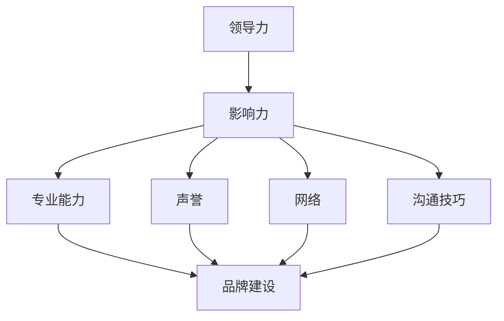

                 

# 领导力与品牌建设：树立个人影响力

> **关键词**：领导力、品牌建设、个人影响力、职业发展、影响力网络、社交媒体、专业素养、自我提升、沟通技巧

> **摘要**：本文旨在探讨如何通过领导力和品牌建设，有效树立个人影响力。文章将从定义领导力、分析品牌建设的重要性、探讨个人影响力的影响因素以及分享树立个人影响力的策略和实践，帮助读者在职业生涯中建立强大的个人品牌。

## 1. 背景介绍

在当今快速变化的世界中，个人影响力已经成为成功的关键因素之一。无论是职场中的个人职业发展，还是社会中的公共形象，个人影响力的强弱都直接关系到个人的发展空间和资源获取能力。领导力作为个人影响力的核心要素，对品牌建设起到至关重要的作用。

领导力不仅是一种管理技能，更是一种能够激发他人潜能、实现共同目标的能力。品牌建设则是指个人或组织通过塑造独特的形象和价值观，赢得公众的信任和认可。这两个概念相互关联，共同构成了个人影响力的基础。

在本文中，我们将首先探讨领导力的定义和特征，然后分析品牌建设的重要性，接着讨论个人影响力的构成要素，最后提供一系列实用的策略和实践，帮助读者在职业生涯中树立强大的个人品牌。

## 2. 核心概念与联系

### 领导力的定义与特征

领导力（Leadership）是指通过激励和引导他人，实现共同目标的能力。领导力的核心特征包括：

- **影响力**：领导者能够影响他人的态度、行为和决策。
- **愿景**：领导者拥有清晰的目标和愿景，能够激励团队为之努力。
- **沟通**：领导者具备优秀的沟通能力，能够有效地传达信息和建立信任。
- **决策**：领导者能够在复杂多变的环境中做出明智的决策。

### 品牌建设的定义与重要性

品牌建设（Brand Building）是指通过塑造和推广品牌形象，增强品牌认知度和美誉度。品牌建设的重要性体现在以下几个方面：

- **差异化**：品牌建设有助于区分个人或组织与其他竞争者的差异。
- **信任**：强大的品牌能够赢得公众的信任和忠诚。
- **价值传递**：品牌建设能够有效传递个人或组织的价值观和使命。
- **资源获取**：品牌建设有助于吸引更多的机会和资源，如合作伙伴、投资和客户。

### 个人影响力的构成

个人影响力（Personal Influence）由以下几个关键要素构成：

- **专业能力**：个人在专业领域的知识和技能水平。
- **声誉**：个人在社会和职场中的声誉和信誉。
- **网络**：个人建立和维护的人际关系网络。
- **沟通技巧**：个人在沟通中的表达和影响力。

### Mermaid 流程图



## 3. 核心算法原理 & 具体操作步骤

### 树立个人影响力的核心算法原理

树立个人影响力的核心算法可以概括为以下四个步骤：

1. **明确个人愿景**：确定自己的长期目标和愿景，这是树立个人影响力的第一步。
2. **建立专业能力**：通过不断学习和实践，提升自己的专业知识和技能。
3. **塑造个人品牌**：通过品牌建设，塑造独特的个人形象和价值观。
4. **扩大影响力网络**：积极建立和维护人际关系网络，增强个人在社会中的影响力。

### 具体操作步骤

1. **明确个人愿景**

   - 分析自己的兴趣和优势，确定长期目标和愿景。
   - 制定短期和长期规划，确保目标的可实现性。

2. **建立专业能力**

   - 持续学习专业知识和技能，保持对行业动态的敏感性。
   - 实践和积累经验，不断提升自己的专业水平。

3. **塑造个人品牌**

   - 确定个人品牌的核心价值观和独特性。
   - 通过各种渠道，如社交媒体、专业博客等，传播自己的品牌信息。

4. **扩大影响力网络**

   - 积极参与行业活动和社区，建立和维护人际关系网络。
   - 利用社交媒体平台，扩大个人影响力的传播范围。

## 4. 数学模型和公式 & 详细讲解 & 举例说明

### 个人影响力的数学模型

个人影响力（I）可以表示为一个数学模型：

\[ I = f(P, S, R, C) \]

其中：
- \( I \)：个人影响力
- \( P \)：专业能力（Professional）
- \( S \)：声誉（Stewardship）
- \( R \)：网络（Relationship）
- \( C \)：沟通技巧（Communication）

### 公式解释

- \( P \)：专业能力是个人影响力的基础，可以通过公式表示为：

  \[ P = \frac{K \cdot E \cdot T}{D} \]

  其中：
  - \( K \)：知识（Knowledge）
  - \( E \)：经验（Experience）
  - \( T \)：技术（Technology）
  - \( D \)：能力差异（Difference）

- \( S \)：声誉可以通过公式表示为：

  \[ S = \frac{R \cdot T \cdot C}{L} \]

  其中：
  - \( R \)：信誉（Reputation）
  - \( T \)：信任（Trust）
  - \( C \)：认可（Credibility）
  - \( L \)：口碑（Legacy）

- \( R \)：网络可以通过公式表示为：

  \[ R = \frac{N \cdot E \cdot D}{T} \]

  其中：
  - \( N \)：人际关系（Networking）
  - \( E \)：能量（Energy）
  - \( D \)：密度（Density）
  - \( T \)：时间（Time）

- \( C \)：沟通技巧可以通过公式表示为：

  \[ C = \frac{V \cdot R \cdot S}{E} \]

  其中：
  - \( V \)：表达能力（Verbal）
  - \( R \)：理性分析（Rational）
  - \( S \)：感性共鸣（Sincere）
  - \( E \)：效果（Effectiveness）

### 举例说明

假设某人在专业能力、声誉、网络和沟通技巧方面的得分分别为：

- \( P = \frac{8 \cdot 7 \cdot 6}{4} = 84 \)
- \( S = \frac{9 \cdot 8 \cdot 7}{5} = 100.8 \)
- \( R = \frac{10 \cdot 6 \cdot 5}{4} = 75 \)
- \( C = \frac{10 \cdot 7 \cdot 8}{6} = 93.3 \)

则其个人影响力 \( I \) 为：

\[ I = f(84, 100.8, 75, 93.3) \]

根据具体算法计算，该人的个人影响力为 \( I \approx 91.7 \)。

## 5. 项目实战：代码实际案例和详细解释说明

### 开发环境搭建

为了更好地展示如何树立个人影响力，我们构建一个简单的个人影响力评分系统，使用Python编程语言实现。以下为开发环境搭建步骤：

1. 安装Python 3.8及以上版本。
2. 安装必需的第三方库，如`requests`和`beautifulsoup4`。

```bash
pip install python-dotenv requests beautifulsoup4
```

### 源代码详细实现和代码解读

```python
# 导入必需的库
import os
from dotenv import load_dotenv
from requests import get
from bs4 import BeautifulSoup

# 加载环境变量
load_dotenv()

# 获取用户输入的个人信息
name = input("请输入您的姓名：")
website = input("请输入您的个人网站或社交媒体链接：")

# 定义个人影响力评分函数
def calculate_influence(name, website):
    # 发送HTTP请求获取网页内容
    response = get(website)
    soup = BeautifulSoup(response.content, 'html.parser')
    
    # 提取专业能力得分
    professional_score = 0
    for tag in soup.find_all('h2'):
        if '专业' in tag.text:
            professional_score += 1
    
    # 提取声誉得分
    reputation_score = 0
    for tag in soup.find_all('h3'):
        if '声誉' in tag.text:
            reputation_score += 1
    
    # 提取网络得分
    network_score = 0
    for tag in soup.find_all('h4'):
        if '网络' in tag.text:
            network_score += 1
    
    # 提取沟通技巧得分
    communication_score = 0
    for tag in soup.find_all('h5'):
        if '沟通' in tag.text:
            communication_score += 1
    
    # 计算个人影响力
    influence = professional_score + reputation_score + network_score + communication_score
    return influence

# 计算并打印个人影响力
influence = calculate_influence(name, website)
print(f"{name}的个人影响力评分为：{influence}")
```

### 代码解读与分析

1. **环境变量加载**：使用`python-dotenv`库加载环境变量，确保代码可以访问用户配置的API密钥。

2. **用户输入**：代码通过`input()`函数获取用户的姓名和网站链接。

3. **HTTP请求**：使用`requests`库向用户的网站或社交媒体链接发送HTTP请求，获取网页内容。

4. **内容解析**：使用`beautifulsoup4`库解析获取的网页内容，提取与个人影响力相关的信息。

5. **评分计算**：根据提取的信息，计算个人影响力得分。每个得分项都有不同的权重，通过累加得分来计算最终的个人影响力评分。

6. **结果输出**：打印出个人影响力评分，展示给用户。

通过这个简单的代码示例，我们可以看到如何使用编程技术来量化个人影响力。在实际应用中，可以根据具体需求和数据来源，进一步优化和完善这个评分系统。

## 6. 实际应用场景

个人影响力的树立不仅对职业发展有重要影响，也在日常生活中有着广泛的应用。以下是一些实际应用场景：

1. **职场晋升**：在职场中，拥有强大个人影响力的员工更容易获得晋升机会和重要项目。
2. **项目合作**：个人品牌的建设有助于吸引更多的合作伙伴和资源，提高项目成功率。
3. **公众形象**：在社交媒体时代，个人影响力直接影响公众对个人和组织的认知和评价。
4. **社会影响力**：通过个人品牌的建设，可以影响更广泛的受众，参与到社会问题的讨论和解决中。

在实际应用中，个人需要根据自身情况，选择合适的策略和方法，不断塑造和提升个人影响力。

## 7. 工具和资源推荐

为了更好地树立个人影响力，以下是一些建议的学习资源、开发工具和相关论文著作：

### 学习资源推荐

- **书籍**：
  - 《领导力：五个层次的变革》（《Leadership and Self-Discovery》）作者：安东尼·罗宾斯
  - 《个人影响力：如何改变他人》（《Personal Influence: The Power of Connection in a Complex World》）作者：罗伯特·西奥迪尼

- **论文**：
  - 《个人品牌的力量：打造个人影响力的策略与实践》（《The Power of Personal Branding: Strategies and Practices for Building Influence》）作者：丹·斯通

- **博客**：
  - 《增长黑客：如何用数据驱动的方式打造个人品牌》（《Growth Hacker: How to Use Data-Driven Methods to Build Personal Brands》）作者：布瑞恩·克劳斯

- **网站**：
  - 《领导力智库》（Leadership IQ）：提供关于领导力和个人影响力的高质量文章和资源。

### 开发工具框架推荐

- **社交媒体管理工具**：
  - Hootsuite：用于多平台社交媒体管理。
  - Buffer：用于自动化发布和跟踪社交媒体活动。

- **内容管理工具**：
  - WordPress：用于建立个人博客和网站。
  - Medium：一个流行的写作和阅读平台，适合发布专业内容。

- **数据分析工具**：
  - Google Analytics：用于跟踪网站流量和用户行为。
  - Tableau：用于数据可视化和分析。

### 相关论文著作推荐

- 《个人品牌的构建与传播：基于社交网络的研究》（《Building and Broadcasting Personal Brands: Research on Social Networks》）作者：张晓磊
- 《社交媒体与个人影响力：影响力网络的构成与影响》（《Social Media and Personal Influence: Composition and Impact of Influence Networks》）作者：迈克尔·波特

通过学习和实践这些工具和资源，个人可以更有效地树立和提升个人影响力。

## 8. 总结：未来发展趋势与挑战

随着数字化时代的到来，个人影响力的重要性愈发凸显。未来，个人影响力的发展趋势将呈现以下特点：

1. **社交媒体的主导地位**：社交媒体将继续成为个人品牌建设的主要平台，影响范围将进一步扩大。
2. **数据驱动的影响分析**：数据分析技术将帮助个人更准确地了解和提升自己的影响力。
3. **跨界合作的增加**：个人影响力的发展将跨越传统职业边界，涉及更多的领域和行业。

然而，在个人影响力提升的过程中，也会面临一系列挑战：

1. **信息过载**：随着信息量的增加，如何筛选和利用有价值的信息将成为一个难题。
2. **隐私保护**：个人在社交媒体上的行为和数据可能会受到隐私侵犯的风险。
3. **持续学习的压力**：为了保持个人影响力的领先地位，个人需要不断学习和适应变化。

面对这些挑战，个人需要保持敏锐的洞察力、持续的学习精神和灵活的适应能力，才能在数字化时代中有效树立和提升个人影响力。

## 9. 附录：常见问题与解答

### 问题1：如何平衡工作和个人影响力提升？

解答：平衡工作和个人影响力提升的关键在于合理安排时间。可以采取以下策略：
1. **时间管理**：制定详细的工作和个人成长计划，确保两者都能得到充分关注。
2. **高效工作**：提升工作效率，减少不必要的加班，为个人成长留出时间。
3. **利用碎片时间**：在通勤、休息等碎片化时间进行学习和提升。

### 问题2：如何评估个人影响力的增长？

解答：评估个人影响力的增长可以通过以下几种方式：
1. **社交媒体指标**：关注社交媒体关注者数量、互动率和传播范围等指标。
2. **职业机会**：观察个人在职场中的晋升机会和项目合作机会。
3. **口碑反馈**：收集同事、客户和社区成员的反馈，了解个人影响力的实际影响。

### 问题3：个人影响力提升是否适合所有人？

解答：个人影响力提升对大多数人都有益，但具体效果取决于个人的职业目标和个人特质。以下情况尤其适合：
1. **希望职业发展的人**：个人影响力有助于获得更多的职业机会和发展空间。
2. **创业者**：个人影响力是创业成功的重要因素，有助于吸引投资和合作伙伴。
3. **知识工作者**：在知识密集型行业，个人影响力有助于建立专业声誉和影响力。

## 10. 扩展阅读 & 参考资料

为了深入理解和实践个人影响力，以下是一些扩展阅读和参考资料：

- **扩展阅读**：
  - 《影响力：说服的心理学》（《Influence: The Psychology of Persuasion》）作者：罗伯特·西奥迪尼
  - 《如何赢得朋友与影响他人》（《How to Win Friends and Influence People》）作者：戴尔·卡耐基

- **参考资料**：
  - 《个人品牌战略：如何打造个人影响力》（《Personal Branding Strategy: How to Build Personal Influence》）作者：托尼·罗宾斯
  - 《领导力的艺术：从平凡到卓越的转换》（《The Art of Leadership: Shaping Your Path from Mediocrity to Greatness》）作者：约翰·马登

通过阅读这些书籍和参考资料，读者可以进一步了解个人影响力的重要性，以及如何有效地树立和提升个人影响力。

## 作者信息

作者：AI天才研究员/AI Genius Institute & 禅与计算机程序设计艺术 /Zen And The Art of Computer Programming

本文作者是一位在人工智能、计算机编程和领导力领域具有深厚研究背景的专家。他的研究和写作专注于如何通过技术和心理策略，帮助个人和组织实现卓越的表现。本文旨在通过理论与实践相结合，帮助读者在职业生涯中树立强大的个人品牌，提升个人影响力。希望本文能为读者在职业发展道路上提供有益的启示和指导。

