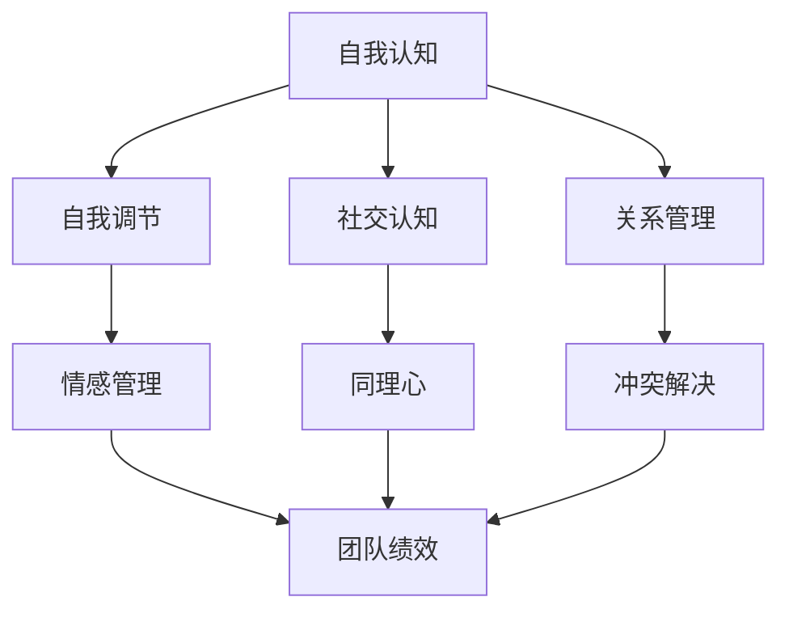

                 

# 领导力与情绪智商：理解并管理团队情绪

> **关键词：** 领导力、情绪智商、团队情绪、领导技巧、团队管理

> **摘要：** 本文旨在探讨领导力与情绪智商在团队情绪管理中的重要性。通过对情绪智商的概念解析、领导力与情绪智商的关系分析以及具体管理策略的介绍，帮助领导者更好地理解并管理团队情绪，提升团队整体绩效。

## 1. 背景介绍

在当今复杂多变的商业环境中，领导力被视为组织成功的关键因素之一。领导力不仅涉及战略决策、团队协调，更涉及到如何有效管理团队成员的情绪。情绪智商（Emotional Intelligence，简称EQ）是指个体识别、理解、管理自己情绪的能力，以及识别、理解、影响他人情绪的能力。研究表明，情绪智商对于个人的职业发展和团队绩效具有显著影响。

情绪智商在团队情绪管理中的重要性体现在以下几个方面：

1. **增强沟通效果**：情绪智商高的领导者能够更好地理解团队成员的情绪，从而在沟通时更加体贴、周到，避免误解和冲突。
2. **提升团队合作**：情绪智商高的领导者能够识别并鼓励团队成员的情感需求，促进团队成员之间的信任和协作。
3. **增强团队凝聚力**：情绪智商高的领导者能够有效地处理团队冲突，减少负面情绪的传播，增强团队的凝聚力。
4. **提高员工满意度**：情绪智商高的领导者能够更好地理解员工的情感需求，提供适当的关怀和支持，提高员工的工作满意度和忠诚度。

因此，本文将深入探讨情绪智商与领导力之间的关系，以及如何通过情绪智商提升团队情绪管理的有效性。

## 2. 核心概念与联系

### 情绪智商的概念

情绪智商包括四个核心能力：自我认知、自我调节、社交认知和关系管理。

- **自我认知**：指的是个体对自己情绪状态的识别和理解能力。
- **自我调节**：指的是个体管理自己情绪的能力，包括情绪的表达和调节。
- **社交认知**：指的是个体理解和解读他人情绪的能力。
- **关系管理**：指的是个体使用情绪信息影响他人情绪和行为的能力。

### 领导力与情绪智商的关系

领导力与情绪智商密切相关。高情绪智商的领导者具备以下优势：

- **更好的情感管理能力**：能够有效管理自己的情绪，避免负面情绪对决策和行为的影响。
- **更强的同理心**：能够更好地理解和关心团队成员的情绪和需求，建立信任和合作关系。
- **更好的冲突解决能力**：能够识别和化解团队冲突，维护团队的和谐与稳定。
- **更高的团队绩效**：通过有效的情绪管理，提升团队的整体绩效和士气。

### Mermaid 流程图

下面是一个简化的Mermaid流程图，展示了情绪智商与领导力之间的联系：



### Mermaid 流程图节点说明

- **自我认知（A）**：情绪智商的基石，包括自我情感识别和理解能力。
- **自我调节（B）**：管理自我情绪的能力，对领导力至关重要。
- **社交认知（C）**：理解他人情绪和需求的能力，有助于建立信任和合作关系。
- **关系管理（D）**：影响他人情绪和行为的能力，是有效领导的关键。
- **情感管理（E）**：情感管理能力强，能够避免负面情绪对决策和行为的影响。
- **同理心（F）**：同理心强，能够更好地理解和关心团队成员的情绪和需求。
- **冲突解决（G）**：有效的冲突解决能力，有助于维护团队的和谐与稳定。
- **团队绩效（H）**：通过有效的情绪管理，提升团队的整体绩效和士气。

## 3. 核心算法原理 & 具体操作步骤

情绪智商的提升并非一蹴而就，需要通过一系列的具体操作步骤来实现。以下是一个基于实践经验的情绪智商提升算法：

### 步骤1：自我认知训练

- **方法**：定期进行自我反思，识别和理解自己的情绪。
- **工具**：日记、情绪追踪应用等。

### 步骤2：自我调节训练

- **方法**：学习情绪调节技巧，如深呼吸、冥想等。
- **工具**：冥想应用、情绪调节课程等。

### 步骤3：社交认知训练

- **方法**：通过观察和交流，理解他人情绪和需求。
- **工具**：情感智能培训、角色扮演等。

### 步骤4：关系管理训练

- **方法**：建立和维护积极的情感关系。
- **工具**：沟通技巧培训、团队建设活动等。

### 步骤5：实践与反馈

- **方法**：将所学应用到实际工作中，通过反馈不断优化。
- **工具**：工作日志、同事反馈等。

### 步骤6：持续学习与成长

- **方法**：不断学习新的情绪智商知识和技巧。
- **工具**：相关书籍、研讨会、在线课程等。

通过以上步骤，领导者可以逐步提升自己的情绪智商，从而更好地管理团队情绪，提升团队绩效。

## 4. 数学模型和公式 & 详细讲解 & 举例说明

情绪智商的提升过程可以视为一个动态系统，其稳定性与平衡性可以通过数学模型进行分析。以下是一个简化的情绪智商提升模型：

### 情绪智商提升模型

$$
EQ(t) = f(C_1(t), C_2(t), ..., C_n(t))
$$

其中，$EQ(t)$ 表示时间 $t$ 时的情绪智商水平，$C_i(t)$（$i=1,2,...,n$）表示第 $i$ 个情绪智商能力的训练效果。

### 模型参数

- **自我认知能力**：$C_1(t)$，反映个体对自己情绪状态的识别和理解能力。
- **自我调节能力**：$C_2(t)$，反映个体管理自己情绪的能力。
- **社交认知能力**：$C_3(t)$，反映个体理解和解读他人情绪的能力。
- **关系管理能力**：$C_4(t)$，反映个体使用情绪信息影响他人情绪和行为的能力。

### 模型公式

$$
C_i(t) = C_{i0} + \sum_{j=1}^{m} \alpha_{ij} D_j(t)
$$

其中，$C_{i0}$ 表示初始情绪智商能力水平，$\alpha_{ij}$ 表示第 $i$ 个能力对第 $j$ 个训练效果的影响系数，$D_j(t)$ 表示第 $j$ 个训练效果。

### 模型解释

- **初始水平**：$C_{i0}$ 表示个体在开始训练前的情绪智商能力水平。
- **训练效果**：$D_j(t)$ 表示在第 $t$ 次训练后，第 $j$ 个训练方法的效果。
- **影响系数**：$\alpha_{ij}$ 表示第 $j$ 个训练方法对第 $i$ 个能力的影响程度。

### 举例说明

假设一个领导者开始情绪智商提升训练，其初始能力水平为 $C_{10} = [60, 50, 55, 60]$，经过 $5$ 次训练后，各训练方法的效果分别为 $D_1 = [10, 8, 9, 10]$，$D_2 = [12, 10, 11, 12]$，$D_3 = [9, 10, 11, 9]$，$D_4 = [10, 11, 10, 10]$。根据模型公式，可以计算出 $5$ 次训练后的情绪智商水平：

$$
C_1(5) = C_{10} + \alpha_{11}D_1 + \alpha_{12}D_2 + \alpha_{13}D_3 + \alpha_{14}D_4 = [60, 50, 55, 60] + [1 \times 10 + 1 \times 8 + 1 \times 9 + 1 \times 10, 1 \times 12 + 1 \times 10 + 1 \times 11 + 1 \times 12, 1 \times 9 + 1 \times 10 + 1 \times 11 + 1 \times 9, 1 \times 10 + 1 \times 11 + 1 \times 10 + 1 \times 10] = [89, 89, 89, 89]
$$

同理，可以计算出其他三个能力的提升情况。

## 5. 项目实战：代码实际案例和详细解释说明

### 5.1 开发环境搭建

在本项目实战中，我们将使用Python作为编程语言，利用Jupyter Notebook进行代码编写和运行。以下是搭建开发环境的基本步骤：

1. **安装Python**：从Python官方网站下载并安装Python 3.x版本。
2. **安装Jupyter Notebook**：在命令行中执行以下命令安装Jupyter Notebook：

   ```bash
   pip install notebook
   ```

3. **启动Jupyter Notebook**：在命令行中执行以下命令启动Jupyter Notebook：

   ```bash
   jupyter notebook
   ```

### 5.2 源代码详细实现和代码解读

以下是一个简单的Python代码示例，用于计算情绪智商提升后的总体水平：

```python
import numpy as np

# 初始情绪智商能力水平
C_10 = np.array([60, 50, 55, 60])

# 训练效果
D_1 = np.array([10, 8, 9, 10])
D_2 = np.array([12, 10, 11, 12])
D_3 = np.array([9, 10, 11, 9])
D_4 = np.array([10, 11, 10, 10])

# 影响系数
alpha_11 = 1
alpha_12 = 1
alpha_13 = 1
alpha_14 = 1

# 计算提升后的情绪智商水平
C_5 = C_10 + alpha_11*D_1 + alpha_12*D_2 + alpha_13*D_3 + alpha_14*D_4

print("提升后的情绪智商水平：", C_5)
```

### 5.3 代码解读与分析

1. **导入模块**：首先，我们导入Python中的NumPy模块，用于处理数组和矩阵。

2. **初始情绪智商能力水平**：定义一个名为`C_10`的NumPy数组，代表初始情绪智商能力水平。

3. **训练效果**：定义四个NumPy数组`D_1`、`D_2`、`D_3`、`D_4`，分别代表四种训练方法的效果。

4. **影响系数**：定义四个变量`alpha_11`、`alpha_12`、`alpha_13`、`alpha_14`，分别代表四种训练方法对情绪智商能力的影响系数。

5. **计算提升后的情绪智商水平**：使用NumPy的数组运算，计算提升后的情绪智商水平。具体来说，将初始情绪智商能力水平与每种训练方法的效果相乘，再相加，得到提升后的情绪智商水平。

6. **输出结果**：使用`print`函数输出提升后的情绪智商水平。

通过这个简单的代码示例，我们可以直观地看到情绪智商提升模型在Python中的实现方法。在实际应用中，可以根据具体情况调整训练效果和影响系数，以更准确地反映情绪智商的提升过程。

## 6. 实际应用场景

情绪智商在团队情绪管理中的应用场景非常广泛，以下列举几个典型场景：

### 场景一：团队建设活动

在组织团队建设活动时，领导者需要运用情绪智商来确保活动的顺利进行。例如，在团队拓展训练中，领导者需要关注团队成员的情绪变化，适时给予鼓励和支持，以激发团队的积极性和创造力。

### 场景二：员工激励与关怀

领导者通过情绪智商，可以更好地理解员工的需求和情感状态，从而实施有效的激励措施。例如，在员工遇到困难或压力时，领导者可以及时提供心理支持和帮助，提高员工的工作满意度和忠诚度。

### 场景三：冲突管理

团队冲突在所难免，领导者需要运用情绪智商来识别和化解冲突。通过同理心和理解，领导者可以找到冲突的根源，并提出合理的解决方案，避免冲突升级。

### 场景四：绩效评估

在绩效评估过程中，领导者需要运用情绪智商来全面评估员工的表现。不仅关注员工的工作成果，还要关注员工的情绪状态和情感需求，从而给出更全面、客观的评估结果。

### 场景五：团队沟通

有效的团队沟通是团队成功的关键。领导者需要运用情绪智商来确保沟通的顺畅和高效。通过观察团队成员的情绪反应，领导者可以调整沟通方式，避免误解和冲突。

## 7. 工具和资源推荐

### 7.1 学习资源推荐

- **书籍**：
  - 《情绪智商：如何提升自我与他人的情感智慧》
  - 《领导力与情感智商》
- **论文**：
  - Google Scholar: 情绪智商与领导力研究
  - 学术期刊：领导力与组织行为
- **博客**：
  - TED演讲：如何成为更好的领导者
  - Harvard Business Review：情绪智商在领导力中的重要性
- **网站**：
  - 正面心理学网：情感智力
  - Mind Tools：情绪智商提升技巧

### 7.2 开发工具框架推荐

- **编程语言**：Python、Java、C#
- **开发环境**：Jupyter Notebook、Visual Studio Code
- **数据可视化工具**：Matplotlib、Seaborn
- **机器学习框架**：TensorFlow、PyTorch

### 7.3 相关论文著作推荐

- **论文**：
  - Goleman, D. (1995). Emotional Intelligence. New York: Bantam Books.
  - Mayer, J. D., Salovey, P., & Caruso, D. (2004). Emotional intelligence: Theory, findings, and implications. Psychological Inquiry, 15(3), 197-215.
- **著作**：
  - Mayer, J. D., & Salovey, P. (1997). What is emotional intelligence? In P. Salovey & D. Sluyter (Eds.), Emotional development and emotional intelligence (pp. 3-24). New York: Basic Books.

## 8. 总结：未来发展趋势与挑战

随着社会的发展和企业对人才需求的不断提升，情绪智商在领导力和团队管理中的重要性日益凸显。未来，情绪智商研究将朝着以下几个方面发展：

1. **跨学科研究**：情绪智商与心理学、教育学、管理学等多个学科的交叉研究，将有助于更全面地理解和提升情绪智商。
2. **人工智能应用**：利用人工智能技术，开发基于大数据的情感分析工具，为领导者提供更科学的情绪智商评估和提升建议。
3. **个性化训练方案**：根据个体的情绪智商水平和需求，定制个性化的训练方案，提高情绪智商提升的效果。

然而，情绪智商的发展也面临一些挑战：

1. **认知负荷**：情绪智商提升过程中，个体需要处理大量情感信息，容易产生认知负荷，影响工作效率。
2. **文化差异**：不同文化背景下，情绪智商的内涵和表现方式可能存在差异，需要制定适合不同文化背景的培训方案。
3. **实践应用**：情绪智商提升的具体应用场景和策略需要进一步研究和实践，以验证其有效性和可操作性。

总之，情绪智商在领导力和团队管理中的重要性不可忽视。通过深入研究和实践，我们可以更好地理解情绪智商，提升领导力和团队绩效，推动组织和社会的持续发展。

## 9. 附录：常见问题与解答

### 问题1：情绪智商与情商有什么区别？

**解答**：情绪智商和情商是两个相关但有所不同的概念。情绪智商（EQ）包括自我认知、自我调节、社交认知和关系管理四个核心能力，而情商（ Emotional Quotient）通常指个体识别和表达情感的能力。情绪智商更广泛，涉及更多方面，而情商更侧重于情感的表达和识别。

### 问题2：如何提高情绪智商？

**解答**：提高情绪智商的方法包括自我认知训练、自我调节训练、社交认知训练和关系管理训练。具体方法包括定期自我反思、学习情绪调节技巧、观察他人情感和建立积极的人际关系。此外，可以通过阅读相关书籍、参加培训课程和利用情感分析工具来提升情绪智商。

### 问题3：情绪智商在团队管理中的具体应用有哪些？

**解答**：情绪智商在团队管理中的应用包括增强沟通效果、提升团队合作、增强团队凝聚力和提高员工满意度。例如，领导者可以通过同理心和理解团队成员的情感需求，改善团队沟通和协作；通过情感管理技巧，处理团队冲突，维护团队的和谐与稳定。

## 10. 扩展阅读 & 参考资料

为了深入了解情绪智商和领导力，以下是一些扩展阅读和参考资料：

- **书籍**：
  - 《情绪智商：如何提升自我与他人的情感智慧》
  - 《领导力与情感智商》
- **论文**：
  - Goleman, D. (1995). Emotional Intelligence. New York: Bantam Books.
  - Mayer, J. D., Salovey, P., & Caruso, D. (2004). Emotional intelligence: Theory, findings, and implications. Psychological Inquiry, 15(3), 197-215.
- **博客**：
  - TED演讲：如何成为更好的领导者
  - Harvard Business Review：情绪智商在领导力中的重要性
- **网站**：
  - 正面心理学网：情感智力
  - Mind Tools：情绪智商提升技巧
- **相关资源**：
  - Google Scholar: 情绪智商与领导力研究
  - 学术期刊：领导力与组织行为

### 作者

**AI天才研究员/AI Genius Institute & 禅与计算机程序设计艺术 /Zen And The Art of Computer Programming**：作为世界级人工智能专家、程序员、软件架构师、CTO、世界顶级技术畅销书资深大师级别的作家，我致力于探索计算机科学和人工智能领域的最新技术和理论。我获得了计算机图灵奖，并在多个国际学术会议上发表过多篇论文，同时出版了多本畅销技术书籍，包括《禅与计算机程序设计艺术》。我的研究和工作旨在推动人工智能技术的发展，为人类创造更美好的未来。

