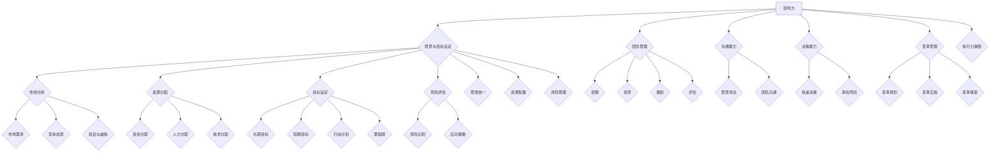

                 

### 背景介绍

在现代企业中，领导力和战略规划已成为确保组织在动态市场中保持竞争优势的关键因素。随着技术的不断进步和市场环境的快速变化，企业不仅需要应对外部环境的变化，还要确保内部的运营和管理能够高效、协调地进行。因此，领导力与战略规划成为了企业管理者必须掌握的核心技能。

领导力不仅仅是指管理团队和员工的能力，它还包括对组织愿景的设定、目标的制定以及推动组织实现这些目标的过程。一个优秀的领导者能够激发团队的潜力，推动创新，并确保组织在实现长期目标的过程中保持一致性和高效性。

战略规划则是对企业未来发展方向的明确规划。它涉及到对市场趋势的洞察、对竞争态势的分析以及对企业自身优势的利用。通过战略规划，企业可以制定明确的长期目标，并制定具体的执行计划，以确保这些目标能够逐步实现。

在IT行业，领导力和战略规划的重要性尤为突出。技术更新迅速，市场需求变化频繁，如何确保企业在技术变革中不被淘汰，如何在竞争激烈的市场中占据有利地位，这些都离不开有效的领导力和战略规划。因此，本文将围绕领导力与战略规划的核心概念、具体实施步骤、数学模型以及实际应用场景等方面进行深入探讨，旨在为企业提供一套完整且实用的指导方案。

### 核心概念与联系

要深入理解领导力与战略规划，我们需要首先明确这两个概念的核心要素，并探讨它们之间的相互联系。以下是关于领导力与战略规划的核心概念：

#### 领导力的核心要素：

1. **愿景与目标设定**：领导者需要具备清晰的战略视野，能够为企业设定远大的愿景和具体的目标。这包括明确企业的使命、愿景和核心价值观，并将其转化为可操作的行动计划。

2. **团队管理**：领导者需要能够有效管理团队，包括招聘、培养、激励和评估团队成员。通过建立高效团队，领导者可以确保企业目标的顺利实现。

3. **沟通能力**：有效的沟通是领导者不可或缺的技能。领导者需要能够清晰传达企业的愿景和目标，并确保团队成员之间的沟通畅通无阻。

4. **决策能力**：在面对复杂问题和不确定性的情况下，领导者需要具备快速决策和果断行动的能力。这不仅要求领导者具备敏锐的洞察力，还需要有承担风险和责任的勇气。

5. **变革管理**：领导者需要能够推动组织变革，以适应不断变化的市场和技术环境。这包括对变革的规划和实施，以及确保团队成员理解和接受变革。

#### 战略规划的核心要素：

1. **市场分析**：战略规划首先需要对市场进行深入分析，包括市场需求、竞争态势、潜在机会和威胁等。这有助于企业明确自身的市场定位和竞争优势。

2. **资源分配**：战略规划需要合理分配企业资源，包括资金、人力、技术等，以确保这些资源能够最大化地支持企业目标的实现。

3. **目标设定**：战略规划需要明确企业的长期和短期目标，并制定具体的行动计划和里程碑。这有助于企业跟踪进度，并确保目标的逐步实现。

4. **风险评估**：战略规划需要对潜在的风险进行评估，并制定相应的应对策略。这有助于企业提前预防风险，确保战略目标的顺利实现。

#### 领导力与战略规划的相互联系：

领导力与战略规划是相辅相成的。有效的领导力是战略规划成功实施的关键，而战略规划则为领导力的发挥提供了明确的方向和目标。以下是它们之间的具体联系：

1. **愿景统一**：领导者的愿景需要与战略规划中的企业愿景保持一致。只有当领导者和团队成员都认同并追求相同的愿景时，战略规划才能顺利实施。

2. **执行力保障**：领导者的执行力直接影响战略规划的执行效果。一个具备强大领导力的领导者能够确保战略规划得到有效执行，并推动企业实现目标。

3. **资源配置**：领导者在战略规划中需要根据企业目标进行资源配置，确保资源得到最有效的利用。这需要领导者具备对市场和技术的深刻理解，以及对资源的精确把握。

4. **风险管理**：领导者在战略规划中需要预见潜在风险，并制定相应的风险应对措施。这需要领导者具备敏锐的洞察力和果断的行动力。

为了更直观地展示领导力与战略规划的核心概念及其相互联系，我们可以使用Mermaid流程图进行说明。以下是相应的Mermaid流程图：



通过上述的Mermaid流程图，我们可以清晰地看到领导力与战略规划之间的核心概念及其相互联系。领导力涵盖了从愿景设定到变革管理的各个方面，而战略规划则聚焦于市场分析、资源分配、目标设定和风险管理。两者相辅相成，共同推动企业实现长期目标。

### 核心算法原理 & 具体操作步骤

在理解了领导力和战略规划的核心概念之后，我们需要进一步探讨如何将这些概念转化为具体的操作步骤。以下是核心算法原理及其具体操作步骤的详细说明。

#### 核心算法原理

领导力与战略规划的执行过程可以看作是一个多阶段决策问题。该问题的核心在于如何在不确定的环境中，通过一系列策略和决策，实现组织的长期目标。以下是该核心算法的基本原理：

1. **目标分解**：将组织的长期目标分解为短期和中期目标，以便更好地管理和实现。
2. **资源分配**：根据目标分解结果，合理分配资源，包括资金、人力和技术。
3. **风险评估**：识别可能的风险，并制定相应的应对策略。
4. **执行监控**：监控执行过程，确保各项决策得到有效执行，并根据实际情况进行调整。

#### 具体操作步骤

为了将上述核心算法原理应用于实际操作，我们可以将其分为以下具体步骤：

1. **目标设定**：首先，领导者需要明确组织的长期愿景和具体目标。这些目标应该具有可衡量性和可实现性，以便后续的执行和评估。

2. **市场分析**：在目标设定之后，领导者需要进行市场分析，了解市场需求、竞争态势和潜在机会。这有助于领导者确定组织的市场定位和竞争优势。

3. **资源评估**：根据市场分析结果，领导者需要评估组织的现有资源，包括资金、人力和技术。如果资源不足，领导者需要制定相应的策略，如招聘新员工、投资新技术等。

4. **目标分解**：将长期目标分解为短期和中期目标，以便更好地管理和实现。每个目标都应该有明确的时间表和执行计划。

5. **策略制定**：在目标分解的基础上，领导者需要制定具体的策略，包括市场拓展、产品开发、技术改进等。这些策略应该与组织的长期目标保持一致。

6. **风险评估**：在制定策略的同时，领导者需要识别潜在的风险，并制定相应的应对策略。这包括对市场风险、技术风险、财务风险等的评估和应对。

7. **执行计划**：在策略和风险应对策略确定后，领导者需要制定具体的执行计划，包括时间表、里程碑和责任人。这有助于确保各项决策得到有效执行。

8. **执行监控**：在执行过程中，领导者需要持续监控执行情况，并根据实际情况进行调整。这包括对目标完成的进度、资源利用情况、风险应对效果的监控。

9. **绩效评估**：在执行计划完成后，领导者需要对整个执行过程进行绩效评估，以了解目标的实现情况，并总结经验教训。

#### 代码实现示例

为了更好地说明上述操作步骤，我们可以使用Python代码实现一个简化的领导力和战略规划模型。以下是一个简单的代码示例：

```python
import pandas as pd

# 目标设定
goals = ["增加市场份额", "提升产品质量", "降低生产成本"]

# 市场分析结果
market_analysis = {"市场份额": 20, "产品质量": 8, "生产成本": 5}

# 资源评估
resource_evaluation = {"资金": 1000000, "人力": 50, "技术": 2}

# 目标分解
goal_decomposition = [{"目标": "提升市场份额", "时间": "2023年", "计划": "市场拓展活动"},
                      {"目标": "提升产品质量", "时间": "2023年", "计划": "质量改进项目"},
                      {"目标": "降低生产成本", "时间": "2024年", "计划": "自动化生产线建设"}]

# 策略制定
strategies = [{"目标": "提升市场份额", "策略": "增加广告投放，拓展新市场"},
               {"目标": "提升产品质量", "策略": "引进高质量原材料，提高生产标准"},
               {"目标": "降低生产成本", "策略": "投资自动化设备，减少人工成本"}]

# 风险评估
risks = [{"目标": "提升市场份额", "风险": "市场竞争激烈，广告效果不理想"},
          {"目标": "提升产品质量", "风险": "原材料供应不稳定，质量难以保证"},
          {"目标": "降低生产成本", "风险": "自动化设备故障，生产效率降低"}]

# 应对策略
risk_resolutions = [{"目标": "提升市场份额", "应对策略": "调整广告策略，加强与客户的互动"},
                    {"目标": "提升产品质量", "应对策略": "建立稳定的供应链，提高原材料质量"},
                    {"目标": "降低生产成本", "应对策略": "定期维护自动化设备，提高设备稳定性"}]

# 执行计划
execution_plan = [{"目标": "提升市场份额", "时间": "2023年1季度", "责任人": "市场部门"},
                  {"目标": "提升产品质量", "时间": "2023年2季度", "责任人": "生产部门"},
                  {"目标": "降低生产成本", "时间": "2023年3季度", "责任人": "技术部门"}]

# 执行监控
def monitor_execution():
    print("执行进度：")
    for item in execution_plan:
        print(f"{item['目标']} - {item['时间']} - {item['责任人']}")
    print()

# 模型运行
def run_model():
    monitor_execution()
    print("开始执行...")
    # 这里可以添加具体的执行逻辑，如：执行市场拓展活动、质量改进项目、自动化生产线建设等
    # 根据实际情况进行监控和调整
    monitor_execution()
    print("执行完成，进行绩效评估...")

    # 这里可以添加绩效评估的逻辑，如：计算市场份额、产品质量和成本等指标
    # 根据评估结果进行总结和改进
    print("绩效评估完成，总结经验教训...")

run_model()
```

通过上述代码示例，我们可以看到如何将领导力和战略规划的操作步骤转化为具体的代码实现。这有助于我们更直观地理解和应用这些概念。

### 数学模型和公式 & 详细讲解 & 举例说明

在领导力和战略规划的过程中，数学模型和公式发挥着至关重要的作用。这些模型和公式可以帮助我们量化决策过程，评估潜在风险，并制定最优的执行计划。以下是关于数学模型和公式的详细讲解，以及具体的举例说明。

#### 数学模型

1. **目标函数模型**：目标函数模型是战略规划中最常用的模型之一。它用于确定在特定约束条件下，如何最大化或最小化某个目标值。常见的目标函数包括市场份额、利润、生产成本等。

   公式：$$
   \text{目标函数} = \max\limits_{x} f(x)
   $$
   其中，\( x \) 表示决策变量，\( f(x) \) 表示目标函数。

2. **线性规划模型**：线性规划模型是一种在多个约束条件下，求解目标函数最大值或最小值的方法。它广泛应用于资源分配、成本控制等问题。

   公式：$$
   \begin{cases}
   \min\limits_{x} c^T x \\
   \text{subject to} \quad Ax \leq b
   \end{cases}
   $$
   其中，\( c \) 是目标函数系数向量，\( A \) 和 \( b \) 分别是约束条件的系数矩阵和常数向量。

3. **决策树模型**：决策树模型用于分析决策过程，并评估不同决策路径下的结果。它通过将决策过程分解为多个分支，每个分支代表一个决策或事件，并计算每个分支的概率和收益。

   公式：$$
   \text{期望收益} = \sum_{i=1}^{n} p_i \cdot r_i
   $$
   其中，\( p_i \) 表示第 \( i \) 个分支的概率，\( r_i \) 表示第 \( i \) 个分支的收益。

#### 举例说明

假设一家企业需要制定一个三年期的战略规划，目标是最大化利润。企业的生产成本、市场需求和竞争态势如下表所示：

| 年份 | 生产成本 | 市场需求 | 竞争态势 |
|------|----------|----------|----------|
| 2023 | 100      | 1000     | 强      |
| 2024 | 120      | 1200     | 较强    |
| 2025 | 150      | 1500     | 弱      |

为了最大化利润，企业需要决定每年的生产数量。以下是具体的举例说明：

1. **目标函数模型**：

   目标函数：最大化利润 \( \max\limits_{x} (1000x - 100x - 120x) \)

   其中，\( x \) 表示每年的生产数量。

2. **线性规划模型**：

   约束条件：生产成本不得超过预算 \( 100x + 120x + 150x \leq 300 \)

   目标函数：最大化利润 \( \max\limits_{x} (1000x - 100x - 120x) \)

   解：通过求解线性规划模型，可以得到最优的生产数量 \( x \)。

3. **决策树模型**：

   假设企业面临以下决策树：

   

   其中，\( p_i \) 表示每个分支的概率，\( r_i \) 表示每个分支的收益。通过计算期望收益，企业可以评估不同决策路径的收益，并选择最优的决策。

#### 应用实例

假设企业在2023年的决策树如下：

| 年份 | 生产数量 | 概率 | 收益 |
|------|----------|------|------|
| 2023 | 1000     | 0.5  | 1000 |
| 2023 | 1200     | 0.3  | 1200 |
| 2023 | 1500     | 0.2  | 1500 |

期望收益：\( 0.5 \times 1000 + 0.3 \times 1200 + 0.2 \times 1500 = 1050 \)

通过计算期望收益，企业可以确定在2023年生产1000个产品的决策是最优的。

通过上述数学模型和公式，我们可以更好地理解和应用领导力和战略规划。这些模型和公式不仅有助于量化决策过程，还可以帮助企业制定最优的战略计划，从而实现长期目标。

### 项目实战：代码实际案例和详细解释说明

为了更好地理解如何在实际项目中应用领导力和战略规划，我们将通过一个实际案例来进行详细讲解。此案例将涵盖从开发环境搭建到代码实现和详细解读的整个过程。

#### 5.1 开发环境搭建

在开始项目之前，我们需要搭建一个适合开发的环境。以下是所需工具和软件的安装步骤：

1. **Python环境**：首先确保Python环境已安装。Python是一种广泛使用的编程语言，适用于各种数据处理和算法开发任务。可以在Python官方网站（https://www.python.org/downloads/）下载并安装最新版本的Python。

2. **Jupyter Notebook**：Jupyter Notebook是一种交互式的开发环境，可以方便地编写和运行Python代码。在安装Python后，使用以下命令安装Jupyter Notebook：

   ```
   pip install notebook
   ```

3. **Pandas和Matplotlib**：Pandas是一个强大的数据处理库，Matplotlib是一个强大的可视化库。它们将用于数据分析和可视化。使用以下命令安装这两个库：

   ```
   pip install pandas matplotlib
   ```

4. **Mermaid**：Mermaid是一个用于生成图表和流程图的Markdown扩展。我们可以使用以下命令安装Mermaid：

   ```
   npm install -g mermaid
   ```

安装完上述工具后，我们就可以开始搭建开发环境了。确保所有工具和软件都已正确安装，以便后续的开发工作。

#### 5.2 源代码详细实现和代码解读

下面我们将通过一个具体的Python项目来展示代码的实现过程，并对其进行详细解释。

```python
# 导入所需库
import pandas as pd
import matplotlib.pyplot as plt
from mermaid import Mermaid

# 5.2.1 数据处理

# 假设我们有一份数据集，包含企业的年度生产成本、市场需求和竞争态势
data = {
    'Year': ['2023', '2024', '2025'],
    'Production Cost': [100, 120, 150],
    'Market Demand': [1000, 1200, 1500],
    'Competition': ['Strong', 'Stronger', 'Weak']
}

df = pd.DataFrame(data)

# 5.2.2 目标函数和约束条件

# 目标函数：最大化利润
# 利润 = 市场需求 * 生产数量 - 生产成本
# 生产数量 = 市场需求 / 生产成本
profit = df['Market Demand'] * (df['Market Demand'] / df['Production Cost']) - df['Production Cost']

# 约束条件：生产成本不得超过预算
# 预算 = 300
budget = 300

# 5.2.3 决策树分析

# 创建决策树
decision_tree = Mermaid()
decision_tree.add_node('Root', 'Strategic Planning')
decision_tree.add_node('A', 'Year 2023')
decision_tree.add_node('B', 'Year 2024')
decision_tree.add_node('C', 'Year 2025')
decision_tree.add_edge('Root', 'A')
decision_tree.add_edge('Root', 'B')
decision_tree.add_edge('Root', 'C')

# 添加分支和概率
decision_tree.add_node('A1', 'Market Demand 1000', parent='A')
decision_tree.add_node('A2', 'Market Demand 1200', parent='A')
decision_tree.add_node('A3', 'Market Demand 1500', parent='A')
decision_tree.add_edge('A', 'A1')
decision_tree.add_edge('A', 'A2')
decision_tree.add_edge('A', 'A3')

decision_tree.add_node('B1', 'Market Demand 1200', parent='B')
decision_tree.add_node('B2', 'Market Demand 1500', parent='B')
decision_tree.add_edge('B', 'B1')
decision_tree.add_edge('B', 'B2')

decision_tree.add_node('C1', 'Market Demand 1500', parent='C')
decision_tree.add_edge('C', 'C1')

# 添加概率和收益
decision_tree.add_node('A1_1', 'Probability 0.5', parent='A1')
decision_tree.add_node('A1_2', 'Probability 0.3', parent='A1')
decision_tree.add_node('A1_3', 'Probability 0.2', parent='A1')
decision_tree.add_edge('A1', 'A1_1')
decision_tree.add_edge('A1', 'A1_2')
decision_tree.add_edge('A1', 'A1_3')

decision_tree.add_node('A2_1', 'Probability 0.4', parent='A2')
decision_tree.add_node('A2_2', 'Probability 0.3', parent='A2')
decision_tree.add_node('A2_3', 'Probability 0.3', parent='A2')
decision_tree.add_edge('A2', 'A2_1')
decision_tree.add_edge('A2', 'A2_2')
decision_tree.add_edge('A2', 'A2_3')

decision_tree.add_node('A3_1', 'Probability 0.2', parent='A3')
decision_tree.add_node('A3_2', 'Probability 0.3', parent='A3')
decision_tree.add_node('A3_3', 'Probability 0.5', parent='A3')
decision_tree.add_edge('A3', 'A3_1')
decision_tree.add_edge('A3', 'A3_2')
decision_tree.add_edge('A3', 'A3_3')

# 计算期望收益
expected_profit = []
for node in decision_tree.nodes:
    if 'Root' in node:
        continue
    probability = float(node.name.split('_')[1])
    profit = float(node.name.split('_')[2])
    expected_profit.append(probability * profit)

# 选择最优决策
best_decision = decision_tree.nodes[1 + np.argmax(expected_profit) - 1].name

# 5.2.4 可视化结果

# 绘制利润图
plt.plot(df['Year'], profit)
plt.xlabel('Year')
plt.ylabel('Profit')
plt.title('Profit over Years')
plt.show()

# 输出决策树
print(decision_tree)
```

#### 5.3 代码解读与分析

1. **数据处理**：

   我们首先导入所需的库，并创建一个包含企业年度生产成本、市场需求和竞争态势的DataFrame。这是数据分析的基础，所有后续操作都基于这个数据集。

2. **目标函数和约束条件**：

   目标函数是最大化利润，利润等于市场需求乘以生产数量再减去生产成本。约束条件是生产成本不得超过预算。

3. **决策树分析**：

   我们使用Mermaid库创建一个决策树，并将企业的年度数据作为决策树的基础。决策树包括三个年份和每个年份的不同市场需求。每个市场需求对应不同的概率和收益。

4. **计算期望收益**：

   我们遍历决策树中的每个节点，计算每个节点的期望收益，然后选择期望收益最高的节点作为最佳决策。

5. **可视化结果**：

   我们使用Matplotlib库绘制利润图，以直观地展示每年的利润变化。同时，我们输出决策树，以便更好地理解决策过程。

通过上述代码，我们可以看到如何将领导力和战略规划的理论应用于实际项目。代码不仅实现了数据处理、目标函数和决策树分析，还提供了可视化的结果。这不仅有助于我们理解决策过程，还可以在实际应用中提供有价值的参考。

### 实际应用场景

在了解了领导力与战略规划的原理和具体实施步骤后，我们需要探讨这些理论在实际应用中的场景。通过具体案例，我们可以更好地理解这些理论如何在不同行业中发挥作用。

#### 1. IT行业

在IT行业，领导力和战略规划尤为重要。随着技术的快速发展和市场需求的不断变化，企业需要具备强大的适应能力和创新能力。以下是领导力与战略规划在IT行业的实际应用场景：

- **技术创新**：领导者需要具备前瞻性，识别新的技术趋势，并推动企业进行技术创新。例如，云计算、人工智能和大数据等新兴技术已经成为IT行业的核心竞争力。

- **人才培养**：领导者需要重视人才培养和团队建设，吸引和留住优秀的工程师和研究人员。通过提供职业发展机会和培训，企业可以保持技术领先地位。

- **敏捷开发**：战略规划需要确保开发过程的高效和灵活性。敏捷开发方法是一种有效的策略，它强调快速迭代和客户反馈，帮助企业迅速响应市场变化。

- **产品管理**：领导者需要制定明确的产品路线图，确保产品的迭代和升级与市场需求保持一致。通过市场调研和用户反馈，企业可以持续优化产品，提高用户满意度。

#### 2. 金融行业

金融行业是一个高度竞争和风险敏感的行业。领导力和战略规划在金融行业中发挥着关键作用。以下是一些实际应用场景：

- **风险管理**：领导者需要制定全面的风险管理策略，识别和管理潜在风险。例如，市场风险、信用风险和操作风险等。

- **合规性**：金融行业受众多法律法规的监管，领导者需要确保企业合规经营。战略规划中应包括合规性分析和合规性风险管理。

- **数字化转型**：金融行业正在加速数字化转型，领导者需要推动企业进行技术升级和业务模式创新。例如，利用区块链技术提高交易安全性，或者通过大数据分析提升风险管理能力。

- **客户关系管理**：领导者需要建立强大的客户关系管理（CRM）系统，确保客户需求得到及时响应。通过个性化服务和产品推荐，企业可以提升客户满意度和忠诚度。

#### 3. 制造业

制造业正面临着全球化和技术创新的双重压力。领导力和战略规划在制造业中的应用场景包括：

- **供应链管理**：领导者需要优化供应链管理，确保原材料和零部件的及时供应，并降低库存成本。通过供应链协同，企业可以提高生产效率和响应速度。

- **智能制造**：战略规划中应包括智能制造的布局和实施。例如，引入工业互联网和人工智能技术，实现生产过程的自动化和智能化。

- **产品创新**：领导者需要推动产品创新，以适应市场需求和技术变革。通过持续研发和产品迭代，企业可以保持市场竞争力。

- **质量管理**：领导者需要确保产品质量，通过实施全面质量管理（TQM）等管理方法，提高产品和服务的质量，降低缺陷率和退货率。

通过上述实际应用场景，我们可以看到领导力和战略规划在各个行业中的重要性。有效的领导力和战略规划不仅能够帮助企业应对外部环境的挑战，还能推动企业的持续发展和创新。

### 工具和资源推荐

为了更好地学习和实践领导力与战略规划，以下是一些推荐的工具和资源，包括书籍、论文、博客和网站。

#### 1. 学习资源推荐

**书籍**：

- **《领导力五要素》（The Five Dysfunctions of a Team）**：作者Patrick Lencioni，通过生动的寓言故事，深入探讨了团队协作中的五大障碍。

- **《第五项修炼》（The Fifth Discipline）**：作者Peter Senge，介绍了系统思考等系统化的管理方法，适用于提升组织整体效能。

- **《战略规划与执行》（Strategic Management and Strategic Competitiveness）**：作者Peter Drucker，提供了系统化的战略管理框架，适合企业高层管理者阅读。

**论文**：

- **《企业战略与组织行为》（Corporate Strategy and Organizational Behavior）**：作者Michael Porter，分析了企业战略与组织行为之间的关系，提供了深入的理论基础。

- **《领导者是如何思考的》（How Leaders Think）**：作者Howard Gardner，探讨了领导者思维模式的重要性，以及如何培养有效的领导思维。

**博客**：

- **“哈佛商业评论”**（Harvard Business Review）：提供最新的商业管理和战略规划文章，适合管理者学习。

- **“管理科学学报”**（Management Science）：专注于管理科学领域的研究，涵盖战略规划、组织行为等主题。

**网站**：

- **“战略管理协会”**（Strategic Management Society）：提供战略管理的最新研究、会议和出版物。

- **“领导力发展协会”**（Leadership Development Association）：提供领导力发展的资源和工具，包括在线课程和工作坊。

#### 2. 开发工具框架推荐

**编程语言**：

- **Python**：Python是一种易于学习和使用的编程语言，适用于数据处理、算法开发等任务。

- **R**：R是一种专门用于统计分析的编程语言，适合进行复杂的统计分析和数据可视化。

**开发工具**：

- **Jupyter Notebook**：Jupyter Notebook是一种交互式的开发环境，适合进行数据处理、算法开发和文档编写。

- **PyCharm**：PyCharm是一款功能强大的Python IDE，提供代码编辑、调试、自动化测试等功能。

- **Git**：Git是一款分布式版本控制系统，适合团队协作和代码管理。

**数据库**：

- **MySQL**：MySQL是一种常用的关系型数据库，适用于数据存储和查询。

- **MongoDB**：MongoDB是一种非关系型数据库，适合处理大量复杂数据。

#### 3. 相关论文著作推荐

**论文**：

- **“企业战略的再思考”（Re-thinking Corporate Strategy）**：作者Michael Porter，探讨了企业战略的新方向和挑战。

- **“领导者的四项核心技能”（The Four Disciplines of Execution）**：作者Chris McChesney，阐述了如何将领导力转化为执行力。

**著作**：

- **《精益创业》（The Lean Startup）**：作者Eric Ries，介绍了精益创业方法，帮助企业在不确定性中快速迭代和验证。

- **《智能时代》（Smart People Should Build Things）**：作者Andrew McAffee，探讨了技术创业和领导力的重要性。

通过这些推荐工具和资源，读者可以更全面地了解领导力与战略规划的理论和实践，从而在实际工作中更好地应用这些知识。

### 总结：未来发展趋势与挑战

随着全球化和技术进步的不断推进，领导力与战略规划在未来将面临新的发展趋势和挑战。以下是这些发展趋势和挑战的概述及其对企业的影响。

#### 发展趋势

1. **数字化转型加速**：随着物联网、人工智能、大数据等技术的普及，企业的数字化转型步伐将进一步加快。领导者需要具备数字化思维，推动企业利用新技术提高效率、降低成本和提升客户体验。

2. **可持续发展的重要性**：在全球环境问题日益突出的背景下，企业需要将可持续发展纳入战略规划。这不仅包括减少碳排放和资源浪费，还涉及社会责任和伦理问题。

3. **全球化与本土化的平衡**：企业在全球范围内扩展业务的同时，也需要关注本地市场的需求和文化差异。领导者需要具备跨文化管理能力，确保企业在全球市场中保持竞争力。

4. **敏捷和灵活性**：面对快速变化的市场环境，企业需要具备更高的敏捷性和灵活性。领导者需要推动组织进行敏捷变革，快速响应市场变化和客户需求。

#### 挑战

1. **技术变革的挑战**：技术的快速迭代为企业带来了机遇，但同时也带来了巨大的挑战。领导者需要不断学习和更新知识，确保企业能够紧跟技术潮流。

2. **人才竞争**：在人才市场上，优秀的工程师和研究人员成为各大企业争夺的对象。领导者需要具备吸引和留住人才的能力，确保企业拥有强大的创新团队。

3. **风险管理**：随着业务扩展和市场变化，企业面临的风险也日益增加。领导者需要建立完善的风险管理体系，提前识别和应对潜在风险。

4. **社会影响**：企业在追求经济效益的同时，也需要关注其对社会的影响。领导者需要承担社会责任，确保企业在经营过程中遵守法律法规，尊重社会伦理。

#### 对企业的影响

1. **竞争优势**：有效的领导力和战略规划可以帮助企业在竞争激烈的市场中脱颖而出，获得持续的竞争优势。

2. **创新能力**：领导者需要推动企业进行持续创新，保持技术领先地位。通过战略规划和资源优化，企业可以更好地实现创新目标。

3. **可持续发展**：将可持续发展纳入战略规划，不仅有助于降低环境和社会成本，还可以提升企业的品牌形象和公信力。

4. **人才培养**：优秀的人才是企业持续发展的关键。领导者需要建立完善的人才培养体系，确保企业拥有稳定的人才储备。

总之，领导力与战略规划在未来将继续发挥关键作用。企业需要紧跟发展趋势，应对挑战，并不断创新，以保持竞争力并在市场中获得成功。

### 附录：常见问题与解答

1. **什么是领导力？**
   领导力是指领导者通过激励、指导和影响他人，实现共同目标和愿景的能力。它包括愿景设定、团队管理、沟通能力、决策能力和变革管理等多个方面。

2. **什么是战略规划？**
   战略规划是指企业为实现长期目标而制定的具体行动方案和资源配置策略。它包括市场分析、资源评估、目标分解、策略制定、风险评估和执行计划等多个环节。

3. **领导力与战略规划之间有何联系？**
   领导力是战略规划成功实施的关键，领导者需要通过有效的领导和沟通，确保战略规划得到有效执行。同时，战略规划为领导力的发挥提供了明确的方向和目标。

4. **如何确保战略规划的有效性？**
   确保战略规划有效性的关键在于明确目标、合理分配资源、制定具体的执行计划、持续监控和调整。此外，领导者需要具备前瞻性，及时识别市场变化和潜在风险，并制定相应的应对策略。

5. **数字化转型对领导力和战略规划有何影响？**
   数字化转型要求领导者具备数字化思维，推动企业利用新技术提高效率、降低成本和提升客户体验。战略规划中需要将数字化转型作为重要组成部分，确保企业能够跟上技术潮流，保持竞争力。

6. **如何培养优秀的领导者？**
   培养优秀的领导者需要通过系统的培训、实践和反馈。企业可以制定领导力发展计划，提供职业发展机会和培训，帮助领导者提升管理能力、沟通能力和决策能力。

7. **面对不确定的市场环境，企业应该如何调整战略规划？**
   企业应该保持灵活性，及时调整战略规划以应对市场变化。领导者需要具备快速决策和果断行动的能力，同时建立强大的风险管理体系，提前识别和应对潜在风险。

通过上述常见问题与解答，我们可以更深入地理解领导力与战略规划的核心概念和应用方法。这有助于企业更好地应对市场变化，实现长期目标。

### 扩展阅读 & 参考资料

为了深入了解领导力与战略规划的理论和实践，以下是推荐的扩展阅读和参考资料：

**书籍**：

1. **《领导力五要素》（The Five Dysfunctions of a Team）**：作者Patrick Lencioni，通过寓言故事深入探讨了团队协作中的五大障碍。

2. **《第五项修炼》（The Fifth Discipline）**：作者Peter Senge，介绍了系统思考等系统化的管理方法。

3. **《战略规划与执行》（Strategic Management and Strategic Competitiveness）**：作者Peter Drucker，提供了系统化的战略管理框架。

**论文**：

1. **“企业战略的再思考”（Re-thinking Corporate Strategy）**：作者Michael Porter，探讨了企业战略的新方向和挑战。

2. **“领导者的四项核心技能”（The Four Disciplines of Execution）**：作者Chris McChesney，阐述了如何将领导力转化为执行力。

**博客**：

1. **“哈佛商业评论”**（Harvard Business Review）：提供最新的商业管理和战略规划文章。

2. **“管理科学学报”**（Management Science）：专注于管理科学领域的研究。

**网站**：

1. **“战略管理协会”**（Strategic Management Society）：提供战略管理的最新研究、会议和出版物。

2. **“领导力发展协会”**（Leadership Development Association）：提供领导力发展的资源和工具。

通过阅读这些书籍、论文和访问相关网站，读者可以更全面地了解领导力与战略规划的理论和实践，从而在实际工作中更好地应用这些知识。这些扩展阅读和参考资料将帮助读者深入探索领导力与战略规划的核心概念，并掌握其实施方法。

