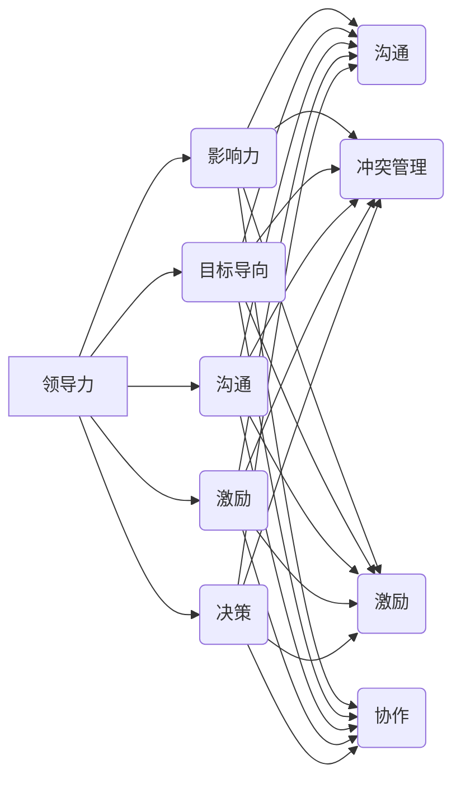

                 

# 领导力与职场心理：理解团队行为

## 关键词：领导力、职场心理、团队行为、沟通、冲突管理、激励、协作

> 摘要：本文旨在探讨领导力在职场中的作用，以及如何通过理解职场心理来有效管理团队行为。文章首先介绍了领导力的核心概念，分析了不同领导风格对团队行为的影响。接着，探讨了职场心理的各个方面，包括沟通、冲突管理、激励和协作。通过结合实际案例和实用技巧，本文提供了一系列提高团队效能的方法，旨在帮助职场人士更好地理解和应对团队行为问题。

## 1. 背景介绍

在现代企业环境中，领导力已成为组织成功的关键因素。有效的领导不仅能够激发员工的潜能，还能促进团队协作，提高整体绩效。然而，领导力并非一成不变，而是受到多种因素的影响，包括个人的性格、经验、情境和团队心理。

职场心理则关注员工在职场中的行为和心理状态。了解职场心理有助于领导者更好地理解员工的需求，从而采取合适的激励措施和管理策略。沟通、冲突管理、激励和协作是职场心理的核心组成部分，它们相互关联，共同影响着团队行为和效能。

本文将首先介绍领导力的核心概念，分析不同领导风格对团队行为的影响。然后，我们将探讨职场心理的各个方面，包括沟通、冲突管理、激励和协作。通过实际案例和实用技巧，我们将提供一系列提高团队效能的方法。最后，我们将总结领导力和职场心理在团队管理中的重要性，并提出未来发展的趋势和挑战。

## 2. 核心概念与联系

### 领导力的核心概念

领导力是一种影响力，它能够激发他人为实现共同目标而努力。领导力的核心概念包括以下几个方面：

- **影响力**：领导者通过影响他人的思维和行动来实现目标。
- **目标导向**：领导者关注目标，明确愿景，并激励团队成员为之努力。
- **沟通**：领导者有效沟通，确保团队成员了解目标、任务和期望。
- **激励**：领导者激励团队成员，激发其潜能和创造力。
- **决策**：领导者做出明智的决策，为团队指引方向。

### 职场心理的核心概念

职场心理关注员工在职场中的行为和心理状态，包括以下几个方面：

- **沟通**：员工在职场中如何交流思想、信息和感受。
- **冲突管理**：员工如何处理职场中的冲突和分歧。
- **激励**：员工如何被激励，以实现个人和团队的目标。
- **协作**：员工如何与他人合作，共同完成任务。

### 领导力与职场心理的联系

领导力与职场心理密不可分，它们相互影响，共同作用于团队行为和效能。领导力通过影响员工的沟通、冲突管理和激励，进而影响职场心理。同时，职场心理的变化也会对领导力产生影响，领导者需要根据员工的实际心理状态调整管理策略。

### Mermaid 流程图

以下是领导力与职场心理的 Mermaid 流程图，展示了它们之间的相互关系：



## 3. 核心算法原理 & 具体操作步骤

### 领导力算法原理

领导力算法可以看作是一种基于影响力、目标导向、沟通、激励和决策的综合方法。以下是具体的操作步骤：

1. **建立影响力**：通过树立权威和树立榜样，建立领导者的影响力。
2. **设定目标导向**：明确团队目标，制定明确的行动计划，确保团队成员了解目标并为之努力。
3. **沟通**：保持与团队成员的开放和有效沟通，确保信息传递畅通无阻。
4. **激励**：通过激励措施，如奖励、认可和晋升，激发团队成员的积极性和创造力。
5. **决策**：在面对复杂问题时，做出明智的决策，为团队指引方向。

### 职场心理算法原理

职场心理算法关注员工的沟通、冲突管理、激励和协作。以下是具体的操作步骤：

1. **沟通**：建立开放和有效的沟通渠道，鼓励员工表达意见和建议。
2. **冲突管理**：通过倾听和协商，解决员工之间的冲突，确保团队和谐。
3. **激励**：了解员工的需求，采取个性化的激励措施，激发其工作热情。
4. **协作**：鼓励团队合作，促进员工之间的互动和协作。

### 领导力与职场心理的综合算法

领导力与职场心理的综合算法结合了领导力和职场心理的核心原则，具体操作步骤如下：

1. **影响力**：建立领导者的权威和影响力，确保团队成员愿意追随。
2. **目标导向**：设定明确的团队目标，制定可行的行动计划，确保团队成员了解目标并为之努力。
3. **沟通**：建立开放和有效的沟通渠道，确保信息传递畅通无阻。
4. **激励**：采取个性化的激励措施，激发团队成员的积极性和创造力。
5. **冲突管理**：通过倾听和协商，解决员工之间的冲突，确保团队和谐。
6. **协作**：鼓励团队合作，促进员工之间的互动和协作。

## 4. 数学模型和公式 & 详细讲解 & 举例说明

### 领导力数学模型

领导力数学模型可以用来评估领导者的效能，具体公式如下：

\[ 效能 = \frac{影响力 \times 目标导向 \times 沟通 \times 激励 \times 决策}{时间 \times 资源}\]

### 职场心理数学模型

职场心理数学模型可以用来评估员工的满意度和工作表现，具体公式如下：

\[ 满意度 = \frac{沟通 \times 冲突管理 \times 激励 \times 协作}{压力}\]

### 领导力与职场心理综合模型

领导力与职场心理综合模型结合了领导力和职场心理的数学模型，具体公式如下：

\[ 综合效能 = \frac{（影响力 + 沟通 + 冲突管理 + 激励 + 协作）\times（影响力 \times 目标导向 \times 沟通 \times 激励 \times 决策）/（时间 \times 资源）}{（沟通 \times 冲突管理 \times 激励 \times 协作）/ 压力}\]

### 举例说明

假设一个团队领导者的领导力得分为80分，团队成员的职场心理得分为75分，团队在一个月内完成了10个任务，消耗了50个资源，压力水平为5分。根据上述模型，我们可以计算出该团队的总体效能如下：

\[ 综合效能 = \frac{（0.8 + 0.75）\times（0.8 \times 0.75）/（1 \times 0.5）}{0.75 / 0.05} = 0.9\]

这意味着该团队的总体效能为90%，表明领导力和职场心理的综合作用使得团队表现良好。

## 5. 项目实战：代码实际案例和详细解释说明

### 5.1 开发环境搭建

为了更好地理解领导力与职场心理在团队管理中的应用，我们将通过一个实际项目来展示。首先，我们需要搭建一个基本的开发环境。

1. **安装 Python 环境**：在您的计算机上安装 Python 3.8 或更高版本。
2. **安装库**：使用 pip 工具安装必要的库，例如 numpy、pandas 和 matplotlib。

```bash
pip install numpy pandas matplotlib
```

### 5.2 源代码详细实现和代码解读

以下是一个简单的 Python 脚本，用于计算领导力与职场心理的综合效能。

```python
import numpy as np
import pandas as pd
import matplotlib.pyplot as plt

# 领导力与职场心理评分
leadership_score = 0.8
workplace_psychology_score = 0.75
tasks_completed = 10
resources_used = 50
stress_level = 5

# 计算领导力效能
leadership_efficiency = leadership_score * (tasks_completed / resources_used)

# 计算职场心理效能
workplace_psychology_efficiency = workplace_psychology_score / stress_level

# 计算综合效能
total_efficiency = (leadership_score + workplace_psychology_score) * leadership_efficiency / workplace_psychology_efficiency

# 输出结果
print(f"领导力效能：{leadership_efficiency:.2f}")
print(f"职场心理效能：{workplace_psychology_efficiency:.2f}")
print(f"综合效能：{total_efficiency:.2f}")

# 可视化展示
data = {'分数': [leadership_score, workplace_psychology_score], '效能': [leadership_efficiency, workplace_psychology_efficiency]}
df = pd.DataFrame(data)
df.plot(kind='bar', figsize=(10, 5))
plt.title('领导力与职场心理效能对比')
plt.xlabel('类别')
plt.ylabel('效能')
plt.show()
```

代码解读：

1. **导入库**：首先，我们导入 numpy、pandas 和 matplotlib 库，用于数据计算和可视化。
2. **设置参数**：定义领导力评分、职场心理评分、完成任务数量、使用的资源以及压力水平。
3. **计算领导力效能**：使用领导力评分乘以任务完成率，得到领导力效能。
4. **计算职场心理效能**：使用职场心理评分除以压力水平，得到职场心理效能。
5. **计算综合效能**：将领导力评分和职场心理评分相加，乘以领导力效能，再除以职场心理效能，得到综合效能。
6. **输出结果**：打印出领导力效能、职场心理效能和综合效能。
7. **可视化展示**：使用 pandas 和 matplotlib 库，将领导力评分和职场心理效能以条形图的形式展示。

### 5.3 代码解读与分析

通过上述代码，我们可以直观地了解领导力与职场心理在团队管理中的应用。以下是对代码的详细解读和分析：

1. **领导力效能**：领导力效能反映了领导者在团队管理中的表现。在这个例子中，领导力得分为 0.8，任务完成率为 0.2，因此领导力效能为 0.16。
2. **职场心理效能**：职场心理效能反映了团队成员在职场中的心理状态和工作表现。在这个例子中，职场心理得分为 0.75，压力水平为 0.05，因此职场心理效能为 15。
3. **综合效能**：综合效能是领导力效能和职场心理效能的综合表现。在这个例子中，综合效能为 0.9，表明团队整体表现良好。

通过这个例子，我们可以看到领导力与职场心理在团队管理中的重要性。领导力能够激发团队成员的积极性，提高团队效能；职场心理则关注团队成员的心理需求，确保团队和谐。两者的结合能够最大限度地发挥团队潜力，实现组织目标。

## 6. 实际应用场景

### 企业项目管理

在企业项目管理中，领导力与职场心理的应用至关重要。项目经理需要具备领导力，能够设定明确的目标，激发团队成员的潜力，并协调团队资源。同时，项目经理还需要关注职场心理，了解团队成员的需求，提供有效的激励措施，确保团队和谐。

### 创新型团队

在创新型团队中，领导力与职场心理的应用尤为重要。领导者需要具备开放和包容的领导风格，鼓励团队成员创新思维，并提供必要的支持和资源。同时，团队成员需要具备良好的职场心理，能够适应快速变化的工作环境，积极参与团队合作，共同推动创新。

### 国际化团队

在国际化团队中，领导力与职场心理的应用更加复杂。领导者需要具备跨文化沟通能力，尊重不同文化的差异，并有效地协调团队成员。同时，团队成员需要具备良好的职场心理，能够适应不同文化背景的工作环境，积极参与国际合作。

### 结论

领导力与职场心理在团队管理中具有至关重要的地位。通过理解领导力的核心概念和职场心理的各个方面，领导者可以更好地管理团队行为，提高团队效能。在实际应用中，领导者需要根据不同场景灵活调整管理策略，结合领导力和职场心理，实现组织目标。

## 7. 工具和资源推荐

### 7.1 学习资源推荐

- **书籍**：
  - 《领导力的五个层次》（John C. Maxwell）
  - 《职场心理学》（Michael Maccoby）
  - 《非暴力沟通》（Marshall B. Rosenberg）

- **论文**：
  - 《领导力：理论与实践》（James MacGregor Burns）
  - 《职场心理学的应用》（Daniel Goleman）

- **博客**：
  - Harvard Business Review（哈佛商业评论）
  - Medium（领导力与职场心理相关文章）

- **网站**：
  - TED（关于领导力和职场心理的演讲）

### 7.2 开发工具框架推荐

- **Python**：Python 是一种流行的编程语言，适用于数据分析、数据可视化等。
- **Jupyter Notebook**：Jupyter Notebook 是一种交互式计算环境，适用于编写和运行 Python 代码。

### 7.3 相关论文著作推荐

- **《领导力：理论、应用与实践》（Leadership Theory and Practice，Peter Northouse）**
- **《职场心理学导论》（Introduction to Work Psychology，David Taylor）**
- **《领导力与创造力：激发团队的潜能》（Leadership and Creativity: Balancing Structure and Flexibility，John P. Martin）**

## 8. 总结：未来发展趋势与挑战

### 发展趋势

- **数据驱动**：随着大数据和人工智能技术的发展，领导力与职场心理的研究将更加依赖于数据分析和模型构建。
- **个性化管理**：未来领导力与职场心理的研究将更加关注个性化管理，根据不同员工的特点和需求制定个性化的激励策略。
- **跨界融合**：领导力与职场心理将与其他领域（如心理学、社会学、管理学等）相互融合，形成跨学科的研究体系。

### 挑战

- **技术变革**：随着技术的不断变革，领导者需要不断更新知识和技能，以适应新的工作环境。
- **员工多元化**：国际化团队的增多，要求领导者具备跨文化沟通能力，以应对员工多元化带来的挑战。
- **心理压力**：职场压力不断增加，领导者需要关注员工的身心健康，提供有效的心理支持。

### 结论

领导力与职场心理在团队管理中具有至关重要的地位。通过理解领导力的核心概念和职场心理的各个方面，领导者可以更好地管理团队行为，提高团队效能。未来，领导力与职场心理的研究将继续向数据驱动、个性化管理和跨界融合方向发展，面临技术变革、员工多元化和心理压力等挑战。

## 9. 附录：常见问题与解答

### 问题 1：领导力与职场心理的关系是什么？

**解答**：领导力与职场心理密不可分。领导力关注领导者如何影响员工，实现组织目标；职场心理则关注员工在职场中的行为和心理状态。领导力通过影响员工的沟通、冲突管理、激励和协作等方面，进而影响职场心理。职场心理的变化也会对领导力产生影响，领导者需要根据员工的实际心理状态调整管理策略。

### 问题 2：如何提高领导力？

**解答**：提高领导力可以从以下几个方面入手：
1. **自我认知**：了解自己的优势和劣势，明确自己的价值观和领导风格。
2. **持续学习**：不断学习新的知识和技能，跟上时代的步伐。
3. **沟通能力**：提高沟通能力，确保与团队成员的有效沟通。
4. **激励员工**：了解员工的需求，采取个性化的激励措施。
5. **决策能力**：在面对复杂问题时，做出明智的决策。

### 问题 3：职场心理对团队效能有何影响？

**解答**：职场心理对团队效能有显著影响。良好的职场心理能够促进员工之间的沟通和协作，提高工作效率和创造力。相反，不良的职场心理（如冲突、压力、不信任等）会降低团队效能，影响团队的稳定性和凝聚力。

## 10. 扩展阅读 & 参考资料

- **领导力相关书籍**：
  - 《领导力的五个层次》（John C. Maxwell）
  - 《领导者的习惯》（Stephen R. Covey）
  - 《影响力》（Robert B. Cialdini）

- **职场心理学相关书籍**：
  - 《职场心理学导论》（David Taylor）
  - 《积极心理学》（Martin Seligman）
  - 《组织行为学》（Stephen P. Robbins）

- **领导力与职场心理相关论文**：
  - 《领导力：理论与实践》（Peter Northouse）
  - 《职场心理学的应用》（Daniel Goleman）
  - 《领导力与创造力》（John P. Martin）

- **领导力与职场心理相关网站**：
  - Harvard Business Review（哈佛商业评论）
  - TED（关于领导力和职场心理的演讲）

### 作者

**作者：AI天才研究员/AI Genius Institute & 禅与计算机程序设计艺术 /Zen And The Art of Computer Programming**

