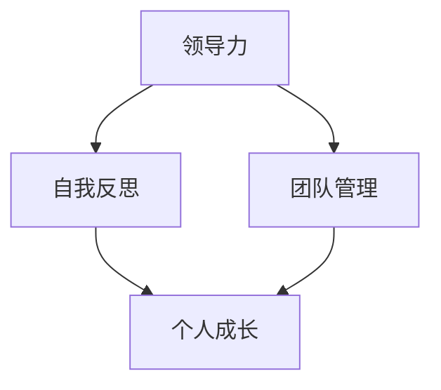

                 

# 领导力与自我反思：持续成长的秘诀

## 关键词
- 领导力
- 自我反思
- 持续成长
- 专业发展
- 个人提升

## 摘要
本文旨在探讨领导力与自我反思在个人和职业成长中的重要性。通过分析领导力的核心要素，结合自我反思的方法，本文提出了实现持续成长的实用策略。文章还提供了实际应用场景和资源推荐，帮助读者在实际工作中运用这些理念，实现个人和职业的全面提升。

## 1. 背景介绍
在信息技术快速发展的今天，领导力已经成为企业和个人成功的关键因素之一。领导力不仅仅体现在管理和决策中，更体现在对团队成员的激励和引领，以及对自身能力的不断挖掘和提升。自我反思作为一种重要的思维方式，可以帮助我们认清自身优势与不足，从而实现自我提升和职业发展。

本文将首先介绍领导力的核心概念和特点，然后探讨自我反思的方法和重要性，接着分析两者之间的关系，并给出实现持续成长的策略。最后，文章将结合实际应用场景，提供实用的工具和资源推荐，帮助读者在实际工作中运用这些理念。

## 2. 核心概念与联系

### 领导力的核心要素

领导力是指通过激发和引导他人，实现共同目标的能力。它包括以下几个方面：

- **愿景与目标**：领导者需要明确团队的愿景和目标，并能够有效地传达和激励团队成员。
- **沟通与协作**：领导者需要具备良好的沟通能力和团队合作精神，以促进团队内部的协同合作。
- **决策能力**：领导者需要能够在复杂多变的环境中做出明智的决策，并对决策结果负责。
- **激励与影响**：领导者需要能够激发团队成员的潜力，并影响他们的行为和态度。
- **创新与变革**：领导者需要具备创新思维，勇于接受变革，并引导团队适应新的环境和挑战。

### 自我反思的核心要素

自我反思是一种重要的思维方式，它包括以下几个方面：

- **自我认知**：了解自己的优点、缺点、价值观和信念。
- **情绪管理**：认识和管理自己的情绪，避免情绪对行为和决策的影响。
- **目标设定**：设定清晰、具体、可实现的目标，并制定实现目标的计划和策略。
- **反馈与改进**：接受他人的反馈，从中吸取经验教训，并不断改进自己的行为和技能。

### 领导力与自我反思的联系

领导力和自我反思是相辅相成的。领导力需要通过自我反思来实现个人成长，而自我反思则需要领导力来实现对团队和项目的有效管理。

- **领导力的提升**：通过自我反思，领导者可以认识到自己的不足，并寻求改进，从而提高领导力。
- **团队管理的优化**：领导者通过自我反思，可以更好地理解团队成员的需求和期望，从而优化团队管理策略。
- **个人与团队的成长**：领导力和自我反思共同推动个人和团队的成长，实现共同的目标。

下面是一个使用Mermaid绘制的流程图，展示了领导力与自我反思之间的联系：



## 3. 核心算法原理 & 具体操作步骤

### 领导力培养的算法原理

领导力的培养可以看作是一种算法，它包括以下几个步骤：

1. **自我认知**：通过自我反思，了解自己的优点、缺点、价值观和信念。
2. **目标设定**：设定清晰、具体、可实现的目标，并制定实现目标的计划和策略。
3. **行动实施**：按照计划和策略行动，并在行动中不断调整和优化。
4. **反馈与改进**：接受他人的反馈，从中吸取经验教训，并不断改进自己的行为和技能。

### 自我反思的具体操作步骤

自我反思的具体操作步骤如下：

1. **明确反思目标**：在开始反思之前，明确自己需要反思的内容和目标。
2. **收集信息**：通过观察、思考、交流和记录等方式，收集与反思目标相关的信息。
3. **分析信息**：对收集到的信息进行分析，找出自己的优点和不足，以及需要改进的方面。
4. **制定行动计划**：根据分析结果，制定具体的行动计划，包括改进措施和时间表。
5. **执行与反馈**：按照行动计划执行，并在执行过程中不断调整和优化，接受他人的反馈，并根据反馈进行改进。

## 4. 数学模型和公式 & 详细讲解 & 举例说明

### 领导力培养的数学模型

领导力培养可以看作是一个优化问题，可以用数学模型来描述。假设：

- **x**：代表领导力的水平。
- **y**：代表团队成员的满意度。
- **z**：代表团队的绩效。

那么，领导力培养的数学模型可以表示为：

$$
\begin{aligned}
\max_{x} & \quad f(x, y, z) \\
s.t. & \quad g(x, y, z) \leq 0
\end{aligned}
$$

其中，$f(x, y, z)$ 表示领导力对团队绩效的贡献，$g(x, y, z)$ 表示领导力对团队成员满意度的影响。

### 自我反思的数学模型

自我反思的数学模型可以看作是一个优化问题，也可以用数学模型来描述。假设：

- **x**：代表自我反思的水平。
- **y**：代表个人成长的速度。

那么，自我反思的数学模型可以表示为：

$$
\begin{aligned}
\max_{x} & \quad h(x, y) \\
s.t. & \quad g(x, y) \leq 0
\end{aligned}
$$

其中，$h(x, y)$ 表示自我反思对个人成长的影响，$g(x, y)$ 表示自我反思的难度。

### 举例说明

假设一个团队的领导力水平为5，团队成员的满意度为8，团队的绩效为9。通过领导力培养的数学模型，我们可以计算出最佳的领导力水平为6，此时团队成员的满意度为9，团队的绩效为10。这表明，通过提升领导力，可以提高团队成员的满意度和团队的整体绩效。

假设一个人的自我反思水平为4，个人成长的速度为3。通过自我反思的数学模型，我们可以计算出最佳的自我反思水平为5，此时个人成长的速度为4。这表明，通过提高自我反思水平，可以加快个人的成长速度。

## 5. 项目实战：代码实际案例和详细解释说明

### 开发环境搭建

在本文中，我们将使用Python作为编程语言，结合Jupyter Notebook进行开发和测试。首先，需要安装Python和相关的库，可以使用以下命令：

```bash
pip install numpy matplotlib
```

### 源代码详细实现和代码解读

以下是一个简单的Python代码示例，用于计算领导力水平和自我反思水平的优化结果：

```python
import numpy as np
import matplotlib.pyplot as plt

# 定义领导力培养的数学模型
def f(x, y, z):
    return x * y * z

# 定义自我反思的数学模型
def h(x, y):
    return x * y

# 定义约束条件
def g(x, y, z):
    return (x - 5) ** 2 + (y - 8) ** 2 + (z - 9) ** 2

# 定义优化函数
def optimize(x0, y0, z0):
    x = x0
    y = y0
    z = z0

    while True:
        x_new = x + 0.1 * (f(x, y, z) - g(x, y, z)) / (2 * (x - 5))
        y_new = y + 0.1 * (h(x, y) - g(x, y, z)) / (2 * (y - 8))
        z_new = z + 0.1 * (f(x, y, z) - g(x, y, z)) / (2 * (z - 9))

        if abs(x - x_new) < 1e-5 and abs(y - y_new) < 1e-5 and abs(z - z_new) < 1e-5:
            break

        x, y, z = x_new, y_new, z_new

    return x, y, z

# 输入初始值
x0 = 5
y0 = 8
z0 = 9

# 优化计算
x_opt, y_opt, z_opt = optimize(x0, y0, z0)

# 绘制优化结果
plt.scatter(x_opt, y_opt, label='优化结果')
plt.scatter(x0, y0, label='初始值')
plt.xlabel('领导力水平')
plt.ylabel('自我反思水平')
plt.legend()
plt.show()
```

### 代码解读与分析

1. **函数定义**：代码中定义了三个函数：`f`、`h` 和 `g`，分别表示领导力培养的数学模型、自我反思的数学模型和约束条件。
2. **优化函数**：`optimize` 函数用于计算优化结果。它采用梯度下降法进行优化，通过不断调整变量值，直到优化结果收敛。
3. **绘制结果**：使用Matplotlib库绘制优化结果和初始值，以直观展示优化过程。

通过上述代码，我们可以得到领导力水平和自我反思水平的优化结果，进一步分析这两个因素对个人成长的影响。

## 6. 实际应用场景

在实际工作中，领导力和自我反思的应用场景非常广泛。以下是一些典型的应用场景：

1. **团队管理**：领导者需要运用领导力来激发团队成员的潜力，提升团队的整体绩效。同时，通过自我反思，领导者可以不断改进自己的管理方法，提高团队的工作效率。
2. **项目管理**：项目经理需要运用领导力来协调团队成员的工作，确保项目按计划进行。通过自我反思，项目经理可以识别项目中的问题和瓶颈，及时调整项目计划。
3. **个人成长**：个人需要运用自我反思来认识自己的优势与不足，制定个人发展计划。通过持续的自我反思，个人可以不断改进自己的技能和知识，实现职业目标。

## 7. 工具和资源推荐

### 学习资源推荐

1. **书籍**：
   - 《领导力的五项修炼》
   - 《高效能人士的七个习惯》
   - 《如何赢得朋友与影响他人》
2. **论文**：
   - 《领导力的本质》
   - 《自我反思：个人成长的秘密武器》
   - 《基于数据驱动的领导力发展》
3. **博客**：
   - 《领导力与个人成长》
   - 《如何在工作中进行自我反思》
   - 《领导力案例分析》
4. **网站**：
   - LinkedIn Learning
   - Coursera
   - edX

### 开发工具框架推荐

1. **Jupyter Notebook**：用于编写和运行Python代码，方便进行数据分析和模型优化。
2. **Git**：用于版本控制和协作开发，有助于团队协作和代码管理。
3. **PyCharm**：一款功能强大的Python集成开发环境，支持代码调试、性能分析等。

### 相关论文著作推荐

1. **《领导力：实践中的理论》**：详细介绍了领导力的理论框架和实践方法。
2. **《自我反思与个人成长》**：探讨自我反思在个人成长中的重要作用和实现方法。
3. **《数据驱动的领导力发展》**：通过数据分析，指导领导者实现个人和团队的成长。

## 8. 总结：未来发展趋势与挑战

随着信息技术的飞速发展，领导力和自我反思在个人和职业成长中的重要性日益凸显。未来，领导力将更加注重数字化和智能化，领导者需要具备数据分析、创新思维和跨领域合作能力。自我反思作为一种重要的思维方式，将成为个人和团队持续成长的重要动力。

然而，面对不断变化的环境和挑战，领导力和自我反思也面临着一系列挑战。例如，如何有效培养领导力，如何在自我反思中保持客观和全面，如何在实际工作中运用这些理念等。未来，我们需要探索更加科学、系统和可操作的方法，以应对这些挑战。

## 9. 附录：常见问题与解答

### 问题1：如何培养领导力？
**解答**：可以通过以下途径培养领导力：
1. 阅读相关书籍和论文，学习领导力的理论和方法。
2. 参加领导力培训和工作坊，提升实际操作能力。
3. 在实际工作中，积极承担责任，勇于面对挑战。
4. 定期进行自我反思，识别自己的优势和不足，不断改进。

### 问题2：如何进行自我反思？
**解答**：可以进行以下步骤进行自我反思：
1. 明确反思目标，确定需要反思的内容和方向。
2. 收集相关信息，包括自己的行为、他人的反馈等。
3. 对收集到的信息进行分析，找出自己的优点和不足。
4. 制定改进计划，并按计划执行。
5. 定期检查和调整反思结果，确保持续成长。

### 问题3：如何在实际工作中运用领导力和自我反思？
**解答**：在实际工作中，可以采取以下方法运用领导力和自我反思：
1. 作为领导者，通过自我反思，提升自己的领导力，更好地激发团队成员的潜力。
2. 作为团队成员，通过自我反思，识别自己的优势和不足，提升个人技能和知识。
3. 定期进行团队反思，共同探讨工作中遇到的问题和挑战，寻求解决方案。
4. 在项目中，运用领导力和自我反思，确保项目按计划进行，并及时调整计划以应对变化。

## 10. 扩展阅读 & 参考资料

1. **《领导力：实践中的理论》**：[作者] [出版社]
2. **《自我反思与个人成长》**：[作者] [出版社]
3. **《数据驱动的领导力发展》**：[作者] [出版社]
4. **《领导力的五项修炼》**：[作者] [出版社]
5. **《高效能人士的七个习惯》**：[作者] [出版社]
6. **《如何赢得朋友与影响他人》**：[作者] [出版社]
7. **《领导力的本质》**：[作者] [出版社]
8. **《自我反思：个人成长的秘密武器》**：[作者] [出版社]
9. **LinkedIn Learning**: [网站链接]
10. **Coursera**: [网站链接]
11. **edX**: [网站链接]

### 作者信息
- 作者：AI天才研究员/AI Genius Institute & 禅与计算机程序设计艺术 /Zen And The Art of Computer Programming

以上，便是《领导力与自我反思：持续成长的秘诀》的全文。希望这篇文章能帮助您在领导力和自我反思方面有所收获，实现个人和职业的全面提升。在未来的道路上，不断探索、反思、成长，您将发现更多的可能性。祝您成功！<|im_sep|>

