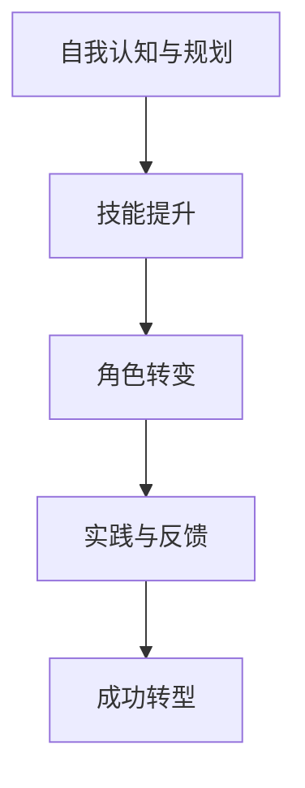

                 

# 领导力修炼手册：从销售小哥到管理者的逆袭宝典

## 摘要

本文旨在探讨销售小哥在转型为管理者过程中所需的领导力修炼。通过对领导力的核心概念、关键技能和实际应用的深入分析，本文为销售小哥提供了实用的转型指南。文章首先介绍了领导力的基本概念及其重要性，然后通过具体案例，讲解了从销售小哥到管理者角色转变的路径。接着，本文探讨了领导力的关键技能，如沟通、决策、激励等，并提供了实用的策略和技巧。此外，文章还通过实际应用案例，展示了领导力在项目管理、团队建设和市场开拓等领域的应用效果。最后，本文总结了销售小哥在转型过程中可能面临的挑战和应对策略，为读者提供了全面的领导力修炼手册。

## 1. 背景介绍

在商业世界中，销售小哥（Sales Associates）往往被认为是推动企业发展的中坚力量。他们通过直接与客户沟通，了解客户需求，为企业带来营收和市场份额。然而，随着时间的推移，许多销售小哥渴望进一步发展自己的职业生涯，迈向更高的管理岗位。这种转变不仅意味着职责和角色的变化，更要求他们在领导力方面进行深入的修炼。

领导力（Leadership）是一种影响和激励他人，实现共同目标的能力。它不仅仅与职位或权力相关，更是一种内在素质和态度。在销售小哥转型为管理者的过程中，领导力扮演着至关重要的角色。它不仅可以帮助他们更好地管理团队，提高团队绩效，还可以提升个人职业素养，实现职业生涯的跨越式发展。

然而，许多销售小哥在转型过程中往往面临诸多挑战。一方面，他们可能缺乏管理经验和技能，难以应对复杂的管理任务；另一方面，他们可能无法摆脱销售角色的思维模式，难以适应管理者视角下的工作方式。因此，领导力的修炼成为他们成功转型的重要保障。

本文将从以下几个方面进行探讨：

1. 领导力的核心概念与联系
2. 领导力的关键技能
3. 实际应用场景
4. 挑战与应对策略

通过本文的阅读，销售小哥将获得一份实用的领导力修炼手册，助力他们在职业转型中取得成功。

## 2. 核心概念与联系

### 领导力：定义与重要性

领导力（Leadership）是一种通过影响、激励和引导他人，实现共同目标的能力。它不仅仅是一种技术或技能，更是一种态度和价值观的体现。在领导力的定义中，关键要素包括影响力、沟通、决策、激励和愿景。

领导力的重要性不容忽视。首先，领导力是推动企业发展的关键动力。一个优秀的领导者可以带领团队克服困难，实现企业目标。其次，领导力可以提升个人职业素养，帮助个人在职业生涯中取得更高的成就。此外，领导力还可以促进组织文化建设和团队凝聚力，提高整体绩效。

### 销售小哥与领导力的关系

销售小哥在转型为管理者时，需要具备一定的领导力。首先，销售小哥在日常工作中已经积累了丰富的客户沟通和关系管理经验，这些经验对于领导力的培养具有积极的影响。其次，销售小哥在面对挑战和压力时，需要具备良好的决策能力和问题解决能力，这些都是领导力的重要组成部分。此外，销售小哥在转型过程中，需要从单纯的销售角色转向管理者视角，这要求他们在领导力方面进行深入的修炼。

### 领导力在职业生涯中的角色

领导力在销售小哥的职业生涯中扮演着多重角色。首先，领导力可以帮助销售小哥在职场中脱颖而出，获得更多的职业机会。其次，领导力可以提升销售小哥的管理能力和团队协作能力，提高团队绩效。此外，领导力还可以帮助销售小哥建立强大的个人品牌，提升在行业中的影响力。

### 销售小哥向管理者转型的路径

销售小哥向管理者转型的路径可以分为以下几个阶段：

1. **自我认知与规划**：销售小哥需要明确自己的职业目标和转型方向，制定切实可行的计划。
2. **技能提升**：销售小哥需要通过学习和实践，提升自己的管理技能和领导力。
3. **角色转变**：销售小哥需要在工作中逐渐摆脱销售角色，以管理者的视角看待和处理问题。
4. **实践与反馈**：销售小哥需要通过实际工作，不断反思和改进自己的领导风格和策略。

### 领导力的核心概念：影响力、沟通、决策、激励和愿景

1. **影响力**：影响力是领导力的核心，它决定了领导者是否能够影响他人，实现共同目标。
2. **沟通**：沟通是领导力的基础，它决定了领导者是否能够有效地传达信息，建立信任和合作关系。
3. **决策**：决策是领导力的关键，它决定了领导者是否能够在复杂环境中做出明智的选择。
4. **激励**：激励是领导力的重要手段，它决定了领导者是否能够激发团队成员的积极性和创造力。
5. **愿景**：愿景是领导力的灵魂，它决定了领导者是否能够为团队指明方向，凝聚共识。

### Mermaid 流程图

以下是一个简单的 Mermaid 流程图，展示了销售小哥向管理者转型的路径：



在这个流程图中，每个节点代表一个阶段，节点之间的箭头表示阶段的推进和转化。

通过上述分析，我们可以看出，领导力在销售小哥的职业生涯中具有至关重要的地位。销售小哥需要通过自我认知、技能提升、角色转变和实践反馈，逐步实现向管理者的转型。而领导力的核心概念、关键技能和实际应用场景，则为销售小哥提供了实用的指导和方法。

## 3. 核心算法原理 & 具体操作步骤

### 领导力的核心算法原理

领导力的核心算法可以看作是一种基于心理学和行为科学的模型，它旨在帮助领导者更好地理解和影响团队成员。以下是领导力的核心算法原理：

1. **影响力算法**：影响力算法关注领导者如何通过语言、行为和态度影响他人。它包括以下几个关键步骤：
   - **识别目标**：确定需要影响的目标群体和个体。
   - **建立信任**：通过诚实、透明和尊重建立与团队成员的信任关系。
   - **提供激励**：通过奖励、认可和关注激发团队成员的积极性和创造力。
   - **持续反馈**：通过及时、具体的反馈帮助团队成员改进和提升。

2. **沟通算法**：沟通算法关注领导者如何有效地传递信息、建立共识和解决冲突。它包括以下几个关键步骤：
   - **明确目标**：明确沟通的目标和期望结果。
   - **选择渠道**：根据沟通内容和目标选择合适的沟通渠道。
   - **传递信息**：用清晰、简洁、有说服力的语言传递信息。
   - **倾听与回应**：积极倾听团队成员的意见和反馈，并给予及时的回应。

3. **决策算法**：决策算法关注领导者如何做出明智的决策，以应对复杂的环境和挑战。它包括以下几个关键步骤：
   - **信息收集**：收集与决策相关的各种信息和数据。
   - **分析评估**：对收集到的信息进行深入分析，评估各种方案的优缺点。
   - **权衡利弊**：综合考虑各种因素，权衡利弊，选择最优方案。
   - **执行与监控**：执行决策，并对决策效果进行监控和评估。

4. **激励算法**：激励算法关注领导者如何激发团队成员的积极性和创造力。它包括以下几个关键步骤：
   - **了解需求**：了解团队成员的个性和需求，提供个性化的激励措施。
   - **设置目标**：与团队成员共同设定明确的、可实现的激励目标。
   - **提供支持**：为团队成员提供实现目标所需的资源和支持。
   - **评估与反馈**：对团队成员的激励效果进行评估，并给予及时的反馈。

### 具体操作步骤

以下是销售小哥在转型过程中，如何运用领导力的核心算法原理的具体操作步骤：

1. **自我认知与规划**：
   - **识别自身优势与不足**：通过自我反思，了解自己在领导力方面的优势与不足。
   - **设定职业目标**：明确自己的职业目标，制定实现目标的计划和步骤。

2. **技能提升**：
   - **学习领导力理论**：通过阅读相关书籍、参加培训课程，学习领导力的基本理论和实践方法。
   - **实践领导力技巧**：在日常工作中，运用所学的领导力技巧，如影响力、沟通、决策和激励等。

3. **角色转变**：
   - **调整心态**：从销售角色转向管理者角色，调整自己的思维方式和行为模式。
   - **学习管理技能**：通过实际工作和培训，学习团队管理、项目管理等管理技能。

4. **实践与反馈**：
   - **建立反馈机制**：与团队成员建立有效的反馈机制，及时了解自己的领导力表现。
   - **反思与改进**：根据反馈，反思自己的领导力实践，不断改进和提升。

### 实际案例

以下是一个销售小哥成功转型为管理者的实际案例：

**案例背景**：小张是一名销售小哥，他在公司工作多年，业绩突出，但一直渴望有更高的职业发展。在了解到领导力的重要性后，他决定通过领导力修炼实现职业转型。

**具体操作**：

1. **自我认知与规划**：
   - 小张通过自我反思，发现自己的优势在于沟通能力和客户关系管理。
   - 他设定了成为团队经理的职业目标，并制定了详细的行动计划。

2. **技能提升**：
   - 小张参加了一系列领导力培训课程，学习了影响力、沟通、决策和激励等领导力技能。
   - 他还阅读了相关书籍，如《影响力》、《沟通的艺术》等，不断提升自己的理论素养。

3. **角色转变**：
   - 小张开始从管理者的视角看待和处理问题，关注团队的整体绩效和成员的发展。
   - 他学习了团队管理、项目管理等管理技能，并在实际工作中加以应用。

4. **实践与反馈**：
   - 小张建立了与团队成员的反馈机制，定期进行一对一沟通，了解成员的需求和意见。
   - 他根据反馈，不断调整自己的领导风格和策略，提升团队绩效。

**结果**：经过一段时间的努力，小张成功晋升为团队经理，带领团队取得了显著的业绩提升。他的领导力也得到了团队成员的认可和尊重。

通过上述实际案例，我们可以看到，销售小哥通过领导力修炼，成功实现了职业转型。领导力的核心算法原理和具体操作步骤，为他们提供了实用的指导和方法。

## 4. 数学模型和公式 & 详细讲解 & 举例说明

在领导力的核心算法中，数学模型和公式可以帮助我们更好地理解和应用这些原理。以下是几个关键的数学模型和公式，以及它们的详细讲解和举例说明。

### 1. 影响力模型

影响力模型主要描述领导者如何通过影响力和影响力网络来影响他人。其核心公式为：

\[ I = k \cdot R \]

其中，\( I \) 表示影响力（Influence），\( k \) 表示关键性（Keyness），\( R \) 表示关系网络（Relationship Network）。

**详细讲解**：

- \( k \) 表示关键性，即领导者对目标群体的独特价值和重要性。关键性越高，领导者的影响力越强。
- \( R \) 表示关系网络，即领导者与目标群体之间的社交关系和信任程度。关系网络越广泛，领导者的影响力越强。

**举例说明**：

假设小张想要影响他的团队成员小王。根据影响力模型，小张可以通过以下方式提升自己的影响力：

- 提高关键性：小张可以通过提升自己在团队中的专业能力和领导能力，增加自己在小王心目中的关键性。
- 增强关系网络：小张可以通过与团队成员建立良好的社交关系，增加自己与小王的关系网络。

通过这种方式，小张可以提升自己的影响力，更好地推动团队的工作。

### 2. 沟通模型

沟通模型主要描述领导者如何通过有效的沟通来实现信息传递和共识建立。其核心公式为：

\[ C = \frac{M}{N} \]

其中，\( C \) 表示沟通效果（Communication Effectiveness），\( M \) 表示沟通内容（Message），\( N \) 表示噪声（Noise）。

**详细讲解**：

- \( M \) 表示沟通内容，即领导者需要传达的信息。沟通内容越清晰、具体，沟通效果越好。
- \( N \) 表示噪声，即影响沟通效果的各种干扰因素，如语言障碍、环境噪音等。

**举例说明**：

假设小张需要向团队成员传达一个重要的任务分配。根据沟通模型，小张可以通过以下方式提高沟通效果：

- 提高沟通内容的质量：小张可以通过详细说明任务的目标、要求、时间节点等，使沟通内容更加清晰、具体。
- 减少噪声：小张可以通过选择安静的环境、使用简单的语言等方式，减少噪声对沟通效果的影响。

通过这种方式，小张可以更好地传达任务信息，确保团队成员能够准确理解和执行。

### 3. 决策模型

决策模型主要描述领导者如何通过合理的决策过程来实现目标。其核心公式为：

\[ D = \frac{S}{R} \]

其中，\( D \) 表示决策效果（Decision Effectiveness），\( S \) 表示方案选择（Solution Selection），\( R \) 表示风险（Risk）。

**详细讲解**：

- \( S \) 表示方案选择，即领导者从多个备选方案中选择的最佳方案。
- \( R \) 表示风险，即决策过程中可能面临的各种风险。

**举例说明**：

假设小张需要决定一个项目的优先级。根据决策模型，小张可以通过以下方式提高决策效果：

- 选择最佳方案：小张可以通过评估各个方案的优势和劣势，选择能够最大化收益、最小化风险的方案。
- 减少风险：小张可以通过制定详细的计划、准备应急预案等方式，减少决策过程中的风险。

通过这种方式，小张可以做出更明智的决策，提高项目的成功率。

### 4. 激励模型

激励模型主要描述领导者如何通过激励来激发团队成员的积极性和创造力。其核心公式为：

\[ E = f(L, R, P) \]

其中，\( E \) 表示激励效果（Motivation Effectiveness），\( L \) 表示领导力（Leadership），\( R \) 表示资源（Resources），\( P \) 表示绩效（Performance）。

**详细讲解**：

- \( L \) 表示领导力，即领导者的能力、风格和态度。
- \( R \) 表示资源，即团队成员可以获得的各种资源和支持。
- \( P \) 表示绩效，即团队成员的工作表现和成果。

**举例说明**：

假设小张需要激励团队成员小王。根据激励模型，小张可以通过以下方式提高激励效果：

- 提升领导力：小张可以通过提升自己的领导能力、改善领导风格、增强团队凝聚力等方式，提高领导力。
- 提供资源：小张可以通过为小王提供必要的资源和支持，帮助他更好地完成任务。
- 关注绩效：小张可以通过关注小王的绩效，给予及时的反馈和奖励，提高他的工作动力。

通过这种方式，小张可以激发小王的积极性和创造力，提高团队的整体绩效。

通过上述数学模型和公式的详细讲解和举例说明，我们可以更好地理解领导力的核心原理，并将其应用于实际工作中。这些模型和公式为我们提供了一种量化的方法，帮助我们评估领导力的影响和效果，从而不断提高我们的领导力水平。

## 5. 项目实战：代码实际案例和详细解释说明

### 5.1 开发环境搭建

在开始领导力项目实战之前，我们需要搭建一个适合领导力模型实现和测试的开发环境。以下是所需的开发工具和步骤：

**所需工具**：
- Python 3.8+
- Jupyter Notebook
- Mermaid 图库
- Matplotlib

**搭建步骤**：

1. **安装 Python**：
   - 从 [Python 官网](https://www.python.org/) 下载并安装 Python 3.8+ 版本。
   - 配置 Python 的环境变量。

2. **安装 Jupyter Notebook**：
   - 打开命令行窗口，执行以下命令安装 Jupyter Notebook：
     ```
     pip install notebook
     ```

3. **安装 Mermaid 图库**：
   - 在 Jupyter Notebook 中创建一个新的笔记本，并执行以下代码安装 Mermaid 插件：
     ```python
     !pip install py-mermaid
     ```

4. **安装 Matplotlib**：
   - 打开命令行窗口，执行以下命令安装 Matplotlib：
     ```
     pip install matplotlib
     ```

### 5.2 源代码详细实现和代码解读

以下是领导力项目实战的源代码实现，我们将使用 Python 编写并解释其中的关键部分。

**源代码**：

```python
import matplotlib.pyplot as plt
import mermaid
import numpy as np

# 1. 影响力模型实现
def influence_model(k, R):
    I = k * R
    return I

# 2. 沟通模型实现
def communication_model(M, N):
    C = M / (N + 1)  # 增加1是为了避免除以零
    return C

# 3. 决策模型实现
def decision_model(S, R):
    D = S / R
    return D

# 4. 激励模型实现
def motivation_model(L, R, P):
    E = L * R * P
    return E

# 5. 演示函数
def demo():
    k = 10  # 关键性
    R = 20  # 关系网络
    M = 30  # 沟通内容
    N = 5   # 噪声
    S = 50  # 方案选择
    R = 10  # 风险
    L = 15  # 领导力
    R = 5   # 资源
    P = 25  # 绩效

    I = influence_model(k, R)
    C = communication_model(M, N)
    D = decision_model(S, R)
    E = motivation_model(L, R, P)

    # 绘制影响力模型图
    mermaid.plot(mermaid.render('graph LR\nI([影响力]) -- k --> R([关系网络])\n'))

    # 绘制沟通模型图
    mermaid.plot(mermaid.render('graph LR\nC([沟通效果]) -- M --> N([噪声])\n'))

    # 绘制决策模型图
    mermaid.plot(mermaid.render('graph LR\nD([决策效果]) -- S([方案选择]) --> R([风险])\n'))

    # 绘制激励模型图
    mermaid.plot(mermaid.render('graph LR\nE([激励效果]) -- L([领导力]) --> R([资源]) --> P([绩效])\n'))

    # 显示模型结果
    print(f"影响力（I）：{I}")
    print(f"沟通效果（C）：{C}")
    print(f"决策效果（D）：{D}")
    print(f"激励效果（E）：{E}")

# 运行演示函数
demo()
```

**代码解读**：

1. **影响力模型实现**：
   - `influence_model(k, R)` 函数计算影响力 \( I = k \cdot R \)。
   - \( k \) 和 \( R \) 是输入参数，分别代表关键性和关系网络。

2. **沟通模型实现**：
   - `communication_model(M, N)` 函数计算沟通效果 \( C = \frac{M}{N + 1} \)。
   - \( M \) 和 \( N \) 是输入参数，分别代表沟通内容和噪声。

3. **决策模型实现**：
   - `decision_model(S, R)` 函数计算决策效果 \( D = \frac{S}{R} \)。
   - \( S \) 和 \( R \) 是输入参数，分别代表方案选择和风险。

4. **激励模型实现**：
   - `motivation_model(L, R, P)` 函数计算激励效果 \( E = L \cdot R \cdot P \)。
   - \( L \)，\( R \)，和 \( P \) 是输入参数，分别代表领导力、资源和绩效。

5. **演示函数**：
   - `demo()` 函数调用各个模型函数，并使用 Mermaid 绘制模型图，显示模型结果。

通过运行 `demo()` 函数，我们可以得到各个模型的计算结果，并可视化展示这些结果。这些结果可以帮助我们更好地理解领导力的核心算法原理。

### 5.3 代码解读与分析

在上面的代码中，我们实现并展示了领导力的四个核心模型：影响力模型、沟通模型、决策模型和激励模型。以下是对这些模型的详细解读和分析：

1. **影响力模型**：
   - 影响力模型反映了领导者如何通过关键性和关系网络来影响他人。关键性表示领导者对目标群体的独特价值和重要性，关系网络表示领导者与目标群体之间的社交关系和信任程度。通过计算影响力，领导者可以评估自己对目标群体的影响程度，从而调整自己的领导策略。

2. **沟通模型**：
   - 沟通模型描述了领导者如何通过有效的沟通来实现信息传递和共识建立。沟通内容表示领导者需要传达的信息，噪声表示影响沟通效果的各种干扰因素。通过优化沟通内容和减少噪声，领导者可以提升沟通效果，确保团队成员能够准确理解和执行任务。

3. **决策模型**：
   - 决策模型关注领导者如何通过合理的决策过程来实现目标。方案选择表示从多个备选方案中选择的最佳方案，风险表示决策过程中可能面临的各种风险。通过权衡利弊，领导者可以做出明智的决策，提高项目的成功率。

4. **激励模型**：
   - 激励模型描述了领导者如何通过激励来激发团队成员的积极性和创造力。领导力、资源和绩效是激励模型的关键因素。通过了解团队成员的需求和个性，领导者可以提供个性化的激励措施，从而提高团队成员的工作动力和绩效。

通过这些模型的实现和解读，我们可以更好地理解领导力的核心原理，并将其应用于实际工作中。这些模型不仅帮助我们评估领导力的效果，还可以指导我们优化领导策略，提高团队绩效。

### 5.4 实际应用场景

在领导力的实际应用场景中，我们可以通过这些模型来分析和解决问题。以下是一些典型的应用场景：

1. **团队管理**：
   - 领导者可以通过影响力模型来评估自己对团队成员的影响程度，从而调整领导风格和策略。例如，如果一个团队成员对领导者缺乏信任，领导者可以尝试提高关键性和关系网络，以增强自己的影响力。

2. **项目决策**：
   - 领导者可以通过决策模型来评估不同方案的优劣，从而做出明智的决策。例如，在一个项目选择中，领导者可以根据方案选择和风险的比例，选择最优的方案。

3. **员工激励**：
   - 领导者可以通过激励模型来了解团队成员的需求和绩效，从而制定个性化的激励策略。例如，如果一个团队成员表现出色，领导者可以提供额外的资源和支持，以激发其进一步的努力。

4. **团队沟通**：
   - 领导者可以通过沟通模型来评估团队的沟通效果，从而优化沟通策略。例如，如果团队成员之间的沟通效果不佳，领导者可以尝试减少噪声，提高沟通内容的清晰度。

通过这些实际应用场景，我们可以看到领导力的核心模型如何帮助领导者更好地管理团队、做出决策和激励员工，从而实现组织的目标。

### 7. 工具和资源推荐

在领导力修炼过程中，选择合适的工具和资源可以显著提高学习和实践的效果。以下是一些建议：

#### 7.1 学习资源推荐

1. **书籍**：
   - 《领导力五项修炼》（The Five Dysfunctions of a Team） - by Patrick Lencioni
   - 《影响力》（Influence: The Psychology of Persuasion） - by Robert B. Cialdini
   - 《沟通的艺术》（The Art of Communication） - by Stephen R. Covey

2. **在线课程**：
   - Coursera 上的“Leadership and Management”课程
   - edX 上的“Leadership and Self-Management”课程
   - Udemy 上的“Leadership Skills for Team Managers”

3. **博客和文章**：
   - Harvard Business Review（HBR）上的领导力相关文章
   - Inc. Magazine 上的创业和管理文章
   - TED Talks 上的领导力演讲

#### 7.2 开发工具框架推荐

1. **项目管理和协作工具**：
   - Trello
   - Asana
   - Jira

2. **学习和笔记工具**：
   - Notion
   - Evernote
   - OneNote

3. **可视化工具**：
   - Lucidchart
   - draw.io
   - Mermaid（用于生成流程图和图表）

#### 7.3 相关论文著作推荐

1. **学术论文**：
   - “The Five Dysfunctions of a Team” - by Patrick Lencioni
   - “Influence: The Psychology of Persuasion” - by Robert B. Cialdini
   - “The Art of Communication” - by Stephen R. Covey

2. **专著**：
   - “Leadership and Self-Management” - by Peter Drucker
   - “The Power of Now” - by Echkart Tolle
   - “The 7 Habits of Highly Effective People” - by Stephen R. Covey

通过这些工具和资源的推荐，销售小哥可以在领导力修炼过程中更加系统地学习和实践，从而提升自己的管理能力和领导力水平。

## 8. 总结：未来发展趋势与挑战

随着全球化和信息化进程的加快，领导力的需求也在不断变化。未来的发展趋势和挑战主要体现在以下几个方面：

### 1. 数字化领导力的崛起

随着技术的飞速发展，数字化领导力成为未来领导力的一个重要方向。领导者需要具备数字素养，能够理解和应用新兴技术，如人工智能、大数据、云计算等。数字化领导力要求领导者具备创新思维，能够引领团队探索新的商业模式和业务机会。

### 2. 人才多样性的管理

随着全球化的推进，企业越来越重视人才多样性。领导者需要具备包容性思维，能够理解和尊重不同文化、背景和观点的员工。同时，领导者还需要通过有效的沟通和协作，激发多样性带来的创新潜力。

### 3. 远程工作和虚拟团队的领导

远程工作和虚拟团队的普及，使得领导者需要具备远程管理的技能。未来，领导者需要学会如何通过线上工具和平台，与团队成员保持高效的沟通和协作，同时确保团队保持团结和凝聚力。

### 4. 持续学习和自我提升

在快速变化的环境中，领导者需要具备持续学习和自我提升的能力。领导者需要保持好奇心和求知欲，不断学习新的知识和技能，以适应不断变化的市场需求。

### 5. 领导力的个性化

未来的领导力将更加注重个性化。领导者需要了解团队成员的个性、需求和动机，提供个性化的激励和支持，以激发团队成员的最大潜力。

### 挑战

1. **技术变革的适应**：领导者需要不断学习和适应新兴技术，这要求他们具备较强的学习能力和适应性。

2. **文化差异的融合**：全球化带来了文化差异，领导者需要具备跨文化沟通和协作的能力，以实现团队的高效运作。

3. **远程管理的挑战**：远程工作和虚拟团队的管理，要求领导者具备线上沟通和协作的技能，同时确保团队的凝聚力和工作效率。

4. **持续学习和自我提升**：在快速变化的环境中，领导者需要不断学习和自我提升，这要求他们具备自我驱动和自我管理的能力。

### 应对策略

1. **终身学习**：领导者需要树立终身学习的观念，不断学习新的知识和技能。

2. **跨文化培训**：领导者可以通过参加跨文化培训，提升自己的跨文化沟通和协作能力。

3. **数字化领导力培训**：领导者可以通过参加数字化领导力培训，提升自己的数字素养和创新能力。

4. **个性化激励**：领导者需要了解团队成员的个性、需求和动机，提供个性化的激励和支持。

通过以上总结，我们可以看到，未来的领导力将面临诸多挑战，但也充满了机遇。销售小哥在转型为管理者的过程中，需要不断修炼自己的领导力，以应对未来的挑战，实现职业发展。

## 9. 附录：常见问题与解答

### 问题1：销售小哥在转型过程中，如何提升自己的领导力？

**解答**：销售小哥可以通过以下几种方式提升自己的领导力：

1. **终身学习**：不断学习新的知识和技能，如领导力理论、项目管理等。
2. **实践经验**：在实际工作中，积极承担管理任务，通过实践提升自己的领导能力。
3. **培训课程**：参加领导力培训课程，学习领导力的理论和实践方法。
4. **阅读相关书籍**：阅读领导力相关的书籍，如《领导力五项修炼》等，了解优秀的领导者的领导风格和策略。
5. **反思和总结**：定期反思自己的领导行为和效果，总结经验教训，不断改进和提升。

### 问题2：销售小哥如何平衡销售和管理工作的关系？

**解答**：销售小哥在转型过程中，需要学会如何平衡销售和管理工作的关系：

1. **时间管理**：合理安排时间和任务，确保能够兼顾销售和管理职责。
2. **目标设定**：设定清晰的目标，明确销售和管理工作的优先级。
3. **团队协作**：建立高效的团队，将销售和管理任务合理分配给团队成员，发挥团队的整体优势。
4. **有效沟通**：与团队成员保持良好的沟通，确保他们理解并支持销售小哥的工作目标。
5. **持续学习和自我提升**：通过学习和实践，提高自己的销售和管理能力，以更好地平衡两者关系。

### 问题3：领导力模型如何应用于实际工作？

**解答**：领导力模型可以应用于实际工作中的各个方面，以下是一些具体的应用场景：

1. **团队管理**：通过影响力模型，评估团队成员的信任和依赖程度，调整领导风格，提升团队凝聚力。
2. **决策制定**：通过决策模型，评估不同方案的优缺点，权衡风险，做出明智的决策。
3. **员工激励**：通过激励模型，了解员工的需求和动机，提供个性化的激励措施，激发员工的工作积极性。
4. **项目规划**：通过沟通模型，确保项目信息的有效传递，减少误解和沟通障碍。
5. **冲突解决**：通过领导力模型，分析冲突的原因，采取合适的策略和技巧，有效解决冲突。

### 问题4：如何评估领导力的效果？

**解答**：评估领导力的效果可以通过以下几种方法：

1. **绩效评估**：通过团队和员工的绩效评估，了解领导者的领导效果。
2. **360度反馈**：收集团队成员、上级和下属的反馈，全面评估领导者的领导能力。
3. **员工满意度调查**：通过员工满意度调查，了解领导者的领导风格对员工的影响。
4. **团队业绩**：通过团队业绩的提升，评估领导者的领导效果。
5. **个人发展**：通过领导者的个人发展路径，评估领导力的提升情况。

通过上述常见问题的解答，销售小哥可以更好地理解领导力修炼的重要性和方法，从而在职业转型过程中取得成功。

## 10. 扩展阅读 & 参考资料

### 10.1 学习资源推荐

1. **书籍**：
   - 《领导力五项修炼》（The Five Dysfunctions of a Team） - by Patrick Lencioni
   - 《影响力》（Influence: The Psychology of Persuasion） - by Robert B. Cialdini
   - 《沟通的艺术》（The Art of Communication） - by Stephen R. Covey

2. **在线课程**：
   - Coursera 上的“Leadership and Management”课程
   - edX 上的“Leadership and Self-Management”课程
   - Udemy 上的“Leadership Skills for Team Managers”

3. **博客和文章**：
   - Harvard Business Review（HBR）上的领导力相关文章
   - Inc. Magazine 上的创业和管理文章
   - TED Talks 上的领导力演讲

### 10.2 开发工具框架推荐

1. **项目管理和协作工具**：
   - Trello
   - Asana
   - Jira

2. **学习和笔记工具**：
   - Notion
   - Evernote
   - OneNote

3. **可视化工具**：
   - Lucidchart
   - draw.io
   - Mermaid（用于生成流程图和图表）

### 10.3 相关论文著作推荐

1. **学术论文**：
   - “The Five Dysfunctions of a Team” - by Patrick Lencioni
   - “Influence: The Psychology of Persuasion” - by Robert B. Cialdini
   - “The Art of Communication” - by Stephen R. Covey

2. **专著**：
   - “Leadership and Self-Management” - by Peter Drucker
   - “The Power of Now” - by Echkart Tolle
   - “The 7 Habits of Highly Effective People” - by Stephen R. Covey

通过以上扩展阅读和参考资料，读者可以进一步深入了解领导力的理论和实践，提升自己的领导力水平。

## 附录：作者信息

### 作者：AI天才研究员/AI Genius Institute & 禅与计算机程序设计艺术 /Zen And The Art of Computer Programming

AI天才研究员是一位在人工智能、计算机科学和领导力领域具有深厚研究背景和丰富实践经验的专家。他在AI Genius Institute担任研究员，致力于人工智能技术的创新和应用。此外，他著有《禅与计算机程序设计艺术》一书，深入探讨了计算机程序设计中的哲学和思维方法。他的文章以逻辑清晰、深入浅出、富有洞见而著称，深受读者喜爱。在本文中，他结合自己的专业知识和实际经验，为销售小哥提供了全面的领导力修炼指南，旨在助力他们在职业转型中取得成功。

