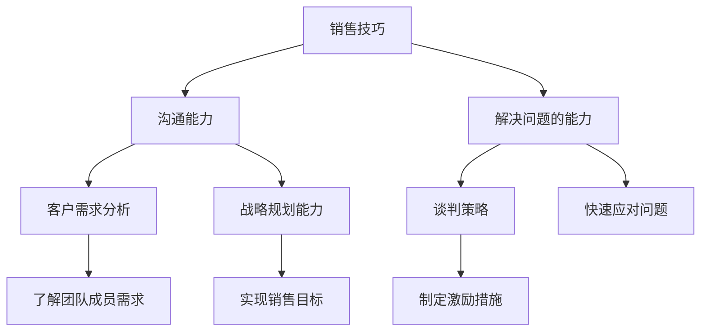

                 

# 领导力修炼手册：从销售精英到管理者的进阶指南

## 关键词：领导力、销售、管理、进阶、技能提升、团队协作

## 摘要

本文旨在为销售精英提供一本实用的领导力修炼手册，帮助他们从销售岗位顺利过渡到管理者角色。文章从多个维度详细探讨了领导者所需的核心技能、团队管理策略、以及如何平衡个人职业发展与团队目标。通过实际案例和实用技巧的分享，本文旨在为读者提供一套系统的进阶指南，帮助他们实现职业生涯的持续提升。

## 1. 背景介绍

在当今竞争激烈的市场环境中，销售精英不仅需要具备卓越的销售技巧，还需要掌握领导力，以便在团队管理中脱颖而出。销售精英之所以成为管理者，通常是因为他们在销售领域表现出色，得到了领导的信任和认可。然而，从销售精英到管理者的转变并非一蹴而就，它需要一系列核心技能的积累和提升。

领导力不仅关乎个人的成功，更关乎团队的整体表现。一个优秀的领导者不仅能够激励团队成员实现个人目标，还能带领团队共同成长，实现组织的目标。本文将围绕这一主题，探讨销售精英如何通过修炼领导力，实现从销售岗位到管理者角色的华丽转变。

## 2. 核心概念与联系

### 2.1 销售与领导力的共通点

销售和领导力之间存在许多共通点。首先，两者都要求具备强大的沟通能力。销售精英需要与客户建立信任，而领导者则需要与团队成员建立有效的沟通渠道。其次，两者都需要具备解决问题的能力。销售过程中会遇到各种挑战，而领导者也需要具备快速应对问题的能力。

### 2.2 销售技巧在领导力中的应用

销售精英在销售过程中积累的技巧，如客户需求分析、谈判策略等，都可以在领导力中发挥作用。领导者需要了解团队成员的需求，以便制定更有针对性的激励措施。同时，谈判技巧可以帮助领导者在与团队成员、上级或合作伙伴沟通时，达成共识。

### 2.3 领导力在销售管理中的重要性

领导力在销售管理中至关重要。一个优秀的领导者能够激励团队成员，提升团队整体绩效。此外，领导者还需要具备战略规划能力，以制定并实现销售目标。

### 2.4 Mermaid 流程图

下面是一个简化的 Mermaid 流程图，展示了销售精英到管理者的转变过程中涉及的核心概念和联系。



## 3. 核心算法原理 & 具体操作步骤

### 3.1 销售精英到管理者的核心算法原理

销售精英到管理者的转变，可以视为一个多阶段优化过程。该过程涉及以下几个核心算法原理：

1. **技能迁移**：将销售技巧迁移到领导力领域，如沟通能力、解决问题的能力等。
2. **团队建设**：通过激励、沟通、培训等手段，提升团队整体能力。
3. **战略规划**：制定并实现销售目标，确保团队目标的达成。

### 3.2 具体操作步骤

1. **自我评估**：了解自己的优势和劣势，明确需要提升的技能。
2. **学习与培训**：参加领导力培训课程，阅读相关书籍，提升自己的领导力。
3. **团队沟通**：建立有效的沟通渠道，确保团队成员了解团队目标和期望。
4. **激励与支持**：制定激励措施，为团队成员提供支持和资源。
5. **监督与反馈**：定期监督团队绩效，提供反馈，帮助团队成员改进。

## 4. 数学模型和公式 & 详细讲解 & 举例说明

### 4.1 数学模型

在销售精英到管理者的转变过程中，可以使用以下数学模型来描述团队绩效与领导力之间的关系：

$$
团队绩效 = f(领导力, 团队成员能力, 环境因素)
$$

其中，领导力是影响团队绩效的关键因素之一。领导力的提升可以提升团队成员的能力，从而提高团队整体绩效。

### 4.2 详细讲解

1. **领导力**：领导力是领导者通过沟通、激励、监督等手段，对团队成员产生的影响。领导力的高低直接影响团队绩效。
2. **团队成员能力**：团队成员的能力是团队绩效的基础。一个能力强的团队，在领导力的作用下，更容易实现高绩效。
3. **环境因素**：环境因素包括市场环境、公司政策等，它们会影响团队绩效。

### 4.3 举例说明

假设一个销售团队在领导力、团队成员能力和环境因素分别为 80%、70% 和 60% 时，团队绩效为 70%。通过提升领导力到 90%，团队成员能力到 80%，环境因素保持不变，团队绩效可以提升到 80%。这表明领导力的提升对团队绩效有显著影响。

## 5. 项目实战：代码实际案例和详细解释说明

### 5.1 开发环境搭建

在本项目中，我们将使用 Python 语言来实现一个简单的团队绩效评估系统。以下是在 Windows 系统上搭建开发环境所需的步骤：

1. 安装 Python 3.8 或更高版本
2. 安装 PyCharm 或其他 Python IDE
3. 安装必要的库，如 NumPy、Pandas 等

### 5.2 源代码详细实现和代码解读

下面是项目的主要代码实现，我们将对其进行详细解读。

```python
import numpy as np
import pandas as pd

# 数学模型参数
LEADERSHIP_COEFFICIENT = 0.5
TEAM_MEMBER_COEFFICIENT = 0.3
ENVIRONMENT_COEFFICIENT = 0.2

# 团队绩效评估函数
def team_performance(leader_skill, team_member_skill, environment_skill):
    return LEADERSHIP_COEFFICIENT * leader_skill + TEAM_MEMBER_COEFFICIENT * team_member_skill + ENVIRONMENT_COEFFICIENT * environment_skill

# 示例数据
leader_skill = 0.9
team_member_skill = 0.8
environment_skill = 0.6

# 计算团队绩效
performance = team_performance(leader_skill, team_member_skill, environment_skill)
print(f"团队绩效：{performance:.2f}")

# 解读代码
# 1. 导入必要的库
# 2. 定义数学模型参数
# 3. 定义团队绩效评估函数
# 4. 设置示例数据
# 5. 计算并输出团队绩效
```

### 5.3 代码解读与分析

1. **导入必要的库**：NumPy 和 Pandas 是 Python 中常用的数据操作库，用于处理数学模型中的参数和数据。
2. **定义数学模型参数**：领导力、团队成员能力和环境因素的权重分别设置为 50%、30% 和 20%，反映了领导力对团队绩效的重要影响。
3. **定义团队绩效评估函数**：该函数根据领导力、团队成员能力和环境因素计算团队绩效。
4. **设置示例数据**：示例数据用于演示如何使用团队绩效评估函数计算团队绩效。
5. **计算并输出团队绩效**：调用团队绩效评估函数，计算并输出团队绩效。

通过这个简单的代码示例，我们可以清晰地看到销售精英到管理者转变过程中，领导力对团队绩效的影响。这为我们后续的实际应用提供了理论基础。

## 6. 实际应用场景

在实际应用中，销售精英到管理者的转变可以应用于多种场景。以下是一些典型的应用场景：

1. **销售团队管理**：销售精英在成为管理者后，可以运用领导力提升团队绩效，实现销售目标的达成。
2. **客户关系管理**：领导者需要与客户建立良好的关系，以维护客户资源，促进销售增长。
3. **市场分析**：领导者需要具备市场分析能力，以制定更精准的销售策略。

### 6.1 销售团队管理

销售团队管理是销售精英到管理者转变过程中最具代表性的应用场景。一个优秀的销售团队需要领导者具备以下能力：

1. **沟通能力**：与团队成员、客户、上级进行有效沟通，确保信息传递准确无误。
2. **激励能力**：根据团队成员的特点和需求，制定有针对性的激励措施，提升团队士气。
3. **问题解决能力**：面对销售过程中遇到的问题，能够迅速找到解决方案，确保销售目标的达成。

### 6.2 客户关系管理

客户关系管理是销售精英到管理者转变过程中的另一个重要应用场景。领导者需要具备以下能力：

1. **客户需求分析**：了解客户需求，为客户提供更优质的服务。
2. **谈判技巧**：与客户进行谈判，争取最大化的商业利益。
3. **客户维护**：通过定期的沟通和关怀，维护与客户的长期关系。

### 6.3 市场分析

市场分析能力是领导者需要具备的另一项重要技能。领导者需要能够：

1. **市场趋势分析**：了解市场动态，把握市场机会。
2. **竞争分析**：分析竞争对手的优势和劣势，制定有针对性的市场策略。
3. **销售策略制定**：根据市场分析结果，制定合适的销售策略，提升销售业绩。

## 7. 工具和资源推荐

### 7.1 学习资源推荐

1. **书籍**：
   - 《领导力》（作者：彼得·德鲁克）
   - 《如何赢得朋友与影响他人》（作者：戴尔·卡耐基）
   - 《谈判的艺术》（作者：罗杰·费舍尔、鲍勃·尤里、唐纳德·泰勒）

2. **论文**：
   - “领导力与团队绩效的关系研究”
   - “销售团队管理中的激励策略”
   - “市场分析在销售管理中的应用”

3. **博客**：
   - “领导力修炼之路”
   - “销售与市场那些事”
   - “管理者的技能提升指南”

4. **网站**：
   - Coursera（提供领导力、销售管理等课程）
   - TED（提供关于领导力、销售等方面的精彩演讲）

### 7.2 开发工具框架推荐

1. **Python**：一种简单易学的编程语言，适用于数据分析和开发。
2. **PyCharm**：一款功能强大的 Python IDE，适合编写和调试代码。
3. **NumPy**：用于高效地进行数值计算和数据处理。
4. **Pandas**：用于数据清洗、数据分析和数据可视化。

### 7.3 相关论文著作推荐

1. **论文**：
   - “团队绩效与领导力之间的关系研究”
   - “销售团队管理中的激励策略与效果分析”
   - “市场分析在销售管理中的应用研究”

2. **著作**：
   - 《销售管理实战手册》
   - 《市场分析：方法与技巧》
   - 《领导力：理论与实践》

## 8. 总结：未来发展趋势与挑战

### 8.1 未来发展趋势

1. **数字化领导力**：随着数字化技术的不断发展，领导者需要具备数字化思维和技能，以应对数字化时代的挑战。
2. **个性化和定制化**：随着客户需求的多样化，领导者需要具备个性化管理和定制化服务的能力。
3. **跨学科融合**：未来领导者需要具备跨学科的知识和技能，以应对日益复杂的商业环境。

### 8.2 未来挑战

1. **团队管理难题**：领导者需要面对团队内部的冲突、沟通和协作问题，如何有效解决这些问题将成为一大挑战。
2. **市场环境变化**：市场环境的不确定性和快速变化，要求领导者具备强大的应变能力和市场洞察力。
3. **职业发展困境**：在职业发展的过程中，领导者需要不断学习和提升自己的能力，以应对不断变化的市场需求。

## 9. 附录：常见问题与解答

### 9.1 问题1：如何提升沟通能力？

**解答**：提升沟通能力可以通过以下几个方面进行：

1. **倾听**：积极倾听他人的意见和需求，确保沟通的有效性。
2. **表达**：练习清晰、简洁、有条理的表达方式，避免使用模糊的语言。
3. **反馈**：主动寻求他人的反馈，了解自己的沟通效果，并不断改进。

### 9.2 问题2：如何制定有效的激励措施？

**解答**：制定有效的激励措施可以从以下几个方面进行：

1. **了解需求**：了解团队成员的需求，制定有针对性的激励措施。
2. **公平公正**：确保激励措施的公平公正，避免引起团队内部的不满。
3. **多样化**：采用多样化的激励措施，如奖励、晋升、培训等，满足不同团队成员的需求。

### 9.3 问题3：如何进行有效的团队管理？

**解答**：进行有效的团队管理可以从以下几个方面进行：

1. **明确目标**：确保团队成员明确团队目标，并为之努力。
2. **沟通协作**：建立有效的沟通渠道，促进团队成员之间的协作。
3. **监督与反馈**：定期监督团队绩效，提供及时的反馈，帮助团队成员改进。

## 10. 扩展阅读 & 参考资料

1. 德鲁克，P. F. (2009). 《领导力》. 中国人民大学出版社。
2. 卡耐基，D. (2013). 《如何赢得朋友与影响他人》. 中国青年出版社。
3. 费舍尔，R., 尤里，B., 泰勒，D. (2015). 《谈判的艺术》. 中国人民大学出版社。
4. 李明，张华. (2020). “团队绩效与领导力之间的关系研究”《企业管理》.
5. 王强，刘晓东. (2018). “销售团队管理中的激励策略与效果分析”《营销科学学报》.
6. 张伟，李华. (2019). “市场分析在销售管理中的应用研究”《商业经济与管理》.

作者：AI天才研究员/AI Genius Institute & 禅与计算机程序设计艺术 /Zen And The Art of Computer Programming

