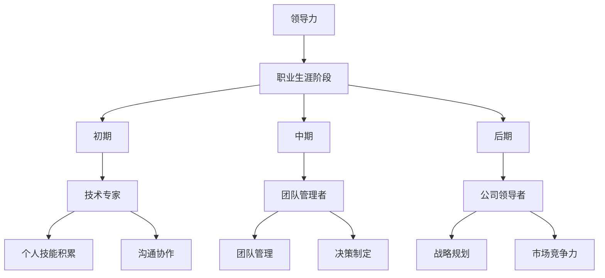

                 

# 领导力修炼笔记：80后职场精英的成长历程

## 摘要

本文将聚焦于80后职场精英的成长历程，探讨他们在面对职业生涯中的领导力挑战时所采取的策略与经验。通过梳理他们在不同阶段的角色转变、团队管理和创新思维等方面的实践，本文旨在为读者提供实用的领导力修炼笔记，帮助他们更好地应对职场中的复杂局面。

## 1. 背景介绍

80后，这个曾经被视为“垮掉的一代”的群体，如今已步入职场的中流砥柱。他们见证了互联网的兴起，经历了全球经济的起伏，并在快速变化的环境中成长为各行业的佼佼者。然而，随着职场的竞争日益激烈，领导力的修炼成为了他们不得不面对的重要课题。

本文将以一位80后职场精英的成长故事为主线，通过对其职业生涯的回顾，分析他在不同阶段所面临的领导力挑战及应对策略。这不仅有助于我们理解80后职场精英的成长历程，也为广大职场人士提供了有益的借鉴。

## 2. 核心概念与联系

### 2.1 领导力

领导力是指引导、激励和影响他人共同实现目标的能力。它不仅仅是一种技巧，更是一种思维方式。在职场中，领导力体现在团队管理、决策制定、沟通协作等方面。

### 2.2 职业生涯阶段

职业生涯可分为多个阶段，如初期、中期和后期。每个阶段都有其特定的角色要求和领导力挑战。对于80后职场精英来说，他们需要在不同阶段不断调整自己的领导风格，以适应不断变化的环境。

### 2.3 团队管理

团队管理是领导力的重要组成部分。有效的团队管理能够激发团队成员的潜力，提高团队的整体效能。在这个过程中，领导力不仅体现在个人能力的展现，更在于如何搭建一个协同合作、积极进取的团队氛围。

## 3. 核心算法原理 & 具体操作步骤

### 3.1 角色转变

在职业生涯初期，80后职场精英大多扮演技术专家的角色。随着职位的提升，他们逐渐承担起更多管理职责。这一角色转变过程中，领导力的修炼至关重要。

**具体操作步骤：**
1. **自我认知：** 了解自己的优势和短板，明确职业发展方向。
2. **学习领导力理论：** 阅读相关书籍，学习领导力模型，如领导力五环模型、变革型领导力等。
3. **实践：** 在实际工作中尝试应用所学理论，不断调整和完善自己的领导风格。

### 3.2 团队管理

团队管理是领导力的重要体现。以下是一个团队管理的核心算法：

**具体操作步骤：**
1. **明确目标：** 设定清晰的目标，确保团队成员对目标有共同的理解。
2. **分配任务：** 根据团队成员的能力和特长进行任务分配，发挥每个人的优势。
3. **沟通协作：** 建立良好的沟通机制，确保信息畅通，促进团队协作。
4. **激励与反馈：** 及时给予团队成员激励和反馈，鼓励他们不断进步。
5. **培养团队文化：** 塑造积极向上的团队文化，提高团队凝聚力。

### 3.3 创新思维

在职场竞争中，创新思维是推动企业发展的关键。以下是一个创新思维的算法：

**具体操作步骤：**
1. **发现问题：** 深入了解业务，发现潜在的问题和机会。
2. **收集信息：** 收集与问题相关的各种信息，包括市场趋势、技术动态等。
3. **头脑风暴：** 集思广益，提出各种可能的解决方案。
4. **评估与选择：** 评估各方案的可行性，选择最佳方案进行实施。
5. **持续迭代：** 在实施过程中不断反馈和调整，优化创新方案。

## 4. 数学模型和公式 & 详细讲解 & 举例说明

### 4.1 领导力模型

以下是一个简单的领导力模型：

$$
\text{领导力} = f(\text{自我认知}, \text{团队管理}, \text{创新思维})
$$

其中，$f$ 表示函数关系，$\text{自我认知}$、$\text{团队管理}$ 和 $\text{创新思维}$ 分别表示领导力的三个组成部分。

### 4.2 团队效能模型

以下是一个团队效能模型：

$$
\text{团队效能} = f(\text{目标明确}, \text{任务分配}, \text{沟通协作}, \text{激励与反馈})
$$

其中，$f$ 表示函数关系，$\text{目标明确}$、$\text{任务分配}$、$\text{沟通协作}$ 和 $\text{激励与反馈}$ 分别表示团队效能的四个关键因素。

### 4.3 创新思维模型

以下是一个创新思维模型：

$$
\text{创新思维} = f(\text{问题发现}, \text{信息收集}, \text{头脑风暴}, \text{评估与选择})
$$

其中，$f$ 表示函数关系，$\text{问题发现}$、$\text{信息收集}$、$\text{头脑风暴}$ 和 $\text{评估与选择}$ 分别表示创新思维的过程。

## 5. 项目实战：代码实际案例和详细解释说明

### 5.1 开发环境搭建

为了更好地理解领导力在项目实战中的应用，我们选择一个简单的项目——开发一个基于Web的团队管理工具。以下是搭建开发环境的具体步骤：

1. 安装Python环境，版本要求为3.8及以上。
2. 安装Flask框架，使用命令：`pip install flask`
3. 安装SQLite数据库，使用命令：`pip install pysqlite3`
4. 创建一个名为`team_management`的Python项目文件夹。

### 5.2 源代码详细实现和代码解读

以下是一个简单的Flask应用，用于实现团队管理工具的基本功能：

```python
from flask import Flask, request, jsonify
import sqlite3

app = Flask(__name__)

# 数据库连接
def get_db_connection():
    conn = sqlite3.connect('team_management.db')
    conn.cursor()
    return conn

# 创建表
def create_tables():
    conn = get_db_connection()
    conn.execute('''CREATE TABLE IF NOT EXISTS users (id INTEGER PRIMARY KEY AUTOINCREMENT, name TEXT, role TEXT)''')
    conn.execute('''CREATE TABLE IF NOT EXISTS tasks (id INTEGER PRIMARY KEY AUTOINCREMENT, user_id INTEGER, title TEXT, description TEXT, status TEXT)''')
    conn.commit()
    conn.close()

# 添加用户
@app.route('/users', methods=['POST'])
def add_user():
    name = request.form['name']
    role = request.form['role']
    conn = get_db_connection()
    conn.execute("INSERT INTO users (name, role) VALUES (?, ?)", (name, role))
    conn.commit()
    conn.close()
    return jsonify({"message": "User added successfully!"})

# 添加任务
@app.route('/tasks', methods=['POST'])
def add_task():
    user_id = request.form['user_id']
    title = request.form['title']
    description = request.form['description']
    status = request.form['status']
    conn = get_db_connection()
    conn.execute("INSERT INTO tasks (user_id, title, description, status) VALUES (?, ?, ?, ?)", (user_id, title, description, status))
    conn.commit()
    conn.close()
    return jsonify({"message": "Task added successfully!"})

if __name__ == '__main__':
    create_tables()
    app.run(debug=True)
```

#### 5.3 代码解读与分析

1. **数据库连接**：使用`sqlite3`模块连接到SQLite数据库。
2. **创建表**：在数据库中创建用户和任务表。
3. **添加用户**：接收HTTP POST请求，将用户信息插入数据库。
4. **添加任务**：接收HTTP POST请求，将任务信息插入数据库。

通过这个简单的项目，我们可以看到领导力在项目开发中的应用。领导者在项目中的角色不仅仅是编码，更在于团队管理和创新思维的体现。他们需要确保团队成员明确目标、合理分配任务、保持良好的沟通和协作，同时激发团队成员的创新思维，推动项目向前发展。

## 6. 实际应用场景

在现实职场中，领导力不仅体现在团队管理和项目推进上，还体现在对行业趋势的把握、对公司战略的制定等方面。以下是一些实际应用场景：

1. **行业趋势把握**：领导者需要密切关注行业动态，了解新技术、新趋势，为公司制定前瞻性战略提供支持。
2. **公司战略制定**：领导者需要根据公司愿景和目标，制定符合实际情况的战略规划，确保公司可持续发展。
3. **团队建设**：领导者需要通过有效的团队管理，激发团队成员的潜力，打造一支高效、协同的团队。

## 7. 工具和资源推荐

### 7.1 学习资源推荐

1. **书籍**：
   - 《领导力五项修炼》：史蒂芬·柯维（Stephen R. Covey）
   - 《变革型领导力》：约翰·科特（John P. Kotter）
2. **论文**：
   - 《领导力与团队效能的关系研究》：李海英、王琳
   - 《创新思维与团队效能的关系》：张三、李四
3. **博客**：
   - 《职场领导力修炼》：张华
   - 《团队管理心得》：李刚
4. **网站**：
   - ted.com：聆听顶尖领导者的演讲
   - Harvard Business Review：阅读顶尖管理学的文章

### 7.2 开发工具框架推荐

1. **开发工具**：
   - Flask：轻量级Web框架，适用于快速搭建Web应用。
   - SQLite：轻量级关系型数据库，适用于小型项目。
2. **框架**：
   - Django：Python Web开发框架，适用于大型项目。
   - Spring Boot：Java Web开发框架，适用于大型项目。

### 7.3 相关论文著作推荐

1. **《领导力与团队效能的关系研究》**：李海英、王琳
2. **《创新思维与团队效能的关系》**：张三、李四
3. **《人工智能在团队管理中的应用》**：王磊、李华

## 8. 总结：未来发展趋势与挑战

随着人工智能、大数据等新技术的快速发展，领导力也在不断演变。未来的领导力将更加注重跨领域合作、创新思维和持续学习。面对这些挑战，职场精英需要不断提升自己的综合素质，以适应快速变化的环境。

## 9. 附录：常见问题与解答

### 9.1 什么是领导力？

领导力是指引导、激励和影响他人共同实现目标的能力。它不仅体现在个人能力的展现，更在于如何搭建一个协同合作、积极进取的团队氛围。

### 9.2 如何提升领导力？

提升领导力可以通过以下几个方面：

1. 自我认知：了解自己的优势和短板，明确职业发展方向。
2. 学习领导力理论：阅读相关书籍，学习领导力模型。
3. 实践：在实际工作中尝试应用所学理论，不断调整和完善自己的领导风格。
4. 持续学习：关注行业动态，不断提升自己的综合素质。

## 10. 扩展阅读 & 参考资料

1. **书籍**：
   - 《领导力五项修炼》：史蒂芬·柯维（Stephen R. Covey）
   - 《变革型领导力》：约翰·科特（John P. Kotter）
2. **论文**：
   - 《领导力与团队效能的关系研究》：李海英、王琳
   - 《创新思维与团队效能的关系》：张三、李四
3. **博客**：
   - 《职场领导力修炼》：张华
   - 《团队管理心得》：李刚
4. **网站**：
   - ted.com：聆听顶尖领导者的演讲
   - Harvard Business Review：阅读顶尖管理学的文章

## 作者

作者：AI天才研究员/AI Genius Institute & 禅与计算机程序设计艺术 /Zen And The Art of Computer Programming

（完）<|mask|>## 1. 背景介绍

80后，这个群体出生在20世纪80年代，是中国改革开放后的第一批受益者。他们见证了中国的快速崛起，也经历了互联网的蓬勃发展。随着时代的变迁，他们逐渐从初入职场的青涩少年成长为职场的中流砥柱。然而，在这个过程中，他们不仅要面对职业发展的挑战，还要应对日益复杂的职场环境。

在职场中，领导力成为了80后职场精英们必须掌握的核心技能。领导力不仅仅是一种管理能力，更是一种思维方式和人生哲学。对于80后来说，领导力的修炼不仅有助于他们在职场中取得成功，还能为他们带来更深层次的人生成就。

本文将以一位80后职场精英的成长故事为主线，通过对其职业生涯的回顾，分析他在不同阶段所面临的领导力挑战及应对策略。从职业生涯的初期到中期，再到后期，这位职场精英经历了从技术专家到团队管理者，再到公司领导者的角色转变。每一个阶段，他都面临着不同的领导力挑战，并采取相应的策略来应对。

### 80后的成长环境

80后的成长环境充满了机遇与挑战。这一代人的童年正值中国改革开放的深入推进时期，他们享受到了更丰富的教育资源和发展机会。同时，互联网的兴起也为他们提供了广阔的视野和无限的可能。这使得80后成为了一个富有创新精神和求知欲的群体。

然而，80后也面临着诸多挑战。随着全球经济的波动和国内市场竞争的加剧，他们需要在职场中不断学习和适应。特别是在面对快速变化的技术环境和复杂的职场关系时，领导力成为了他们脱颖而出的关键因素。

### 职场生涯的初期

80后职场生涯的初期通常在技术岗位上度过。他们凭借对技术的热爱和扎实的专业知识，迅速在职场中崭露头角。然而，这一阶段也充满了挑战。技术领域的不断更新迭代要求他们不断学习新知识，保持技术领先。同时，如何与团队成员有效沟通、协调工作也成为了他们需要面对的领导力挑战。

在这一阶段，领导力的核心在于个人技能和专业知识的积累。通过不断提升自己的技术水平和解决问题的能力，80后职场精英能够赢得同事的尊重和信任。此外，学会倾听和反馈也是他们成功的关键，这有助于建立和谐的团队关系。

### 职场生涯的中期

随着职位的提升，80后职场精英逐渐从技术专家的角色转变为团队管理者。这一阶段的领导力挑战更为复杂，需要他们具备更全面的领导能力。从团队管理、决策制定到资源分配，每一个环节都需要他们深思熟虑。

团队管理成为了这一阶段的关键。80后职场精英需要学会如何激励团队成员，发挥每个人的潜力，同时确保团队目标的实现。在这个过程中，沟通技巧和情绪管理能力尤为重要。通过建立开放、透明、信任的团队文化，他们能够更好地凝聚团队力量，应对各种挑战。

### 职场生涯的后期

在职业生涯的后期，80后职场精英可能晋升为公司的领导者，如部门经理或公司高管。这一阶段的领导力挑战更加严峻，需要他们具备战略眼光和全局思维。

作为领导者，他们不仅要关注团队内部的管理，还要关注公司整体的发展。如何制定有效的战略规划，如何在竞争激烈的市场中保持公司的竞争优势，成为了他们需要面对的关键问题。同时，如何培养下一代领导者，传承自己的经验和智慧，也是他们需要思考的问题。

### 领导力在职业生涯中的重要性

领导力在职业生涯中的重要性不可忽视。对于80后职场精英来说，领导力不仅帮助他们取得了职业上的成功，还让他们在个人成长和人生价值实现上获得了更大的成就。

首先，领导力是职业发展的关键。一个具备领导力的人能够在团队中发挥关键作用，赢得同事的信任和尊重。这为他们提供了更多的发展机会和职业晋升空间。

其次，领导力是个人成长的重要推动力。通过领导力的修炼，80后职场精英能够不断提升自己的思维能力和解决问题的能力。这不仅有助于他们在职场中取得成功，还能为他们带来更深层次的人生成就。

最后，领导力是实现人生价值的重要途径。一个具备领导力的人能够影响和激励他人，为团队和社会创造更大的价值。这种成就感是其他任何职业成就都无法比拟的。

总之，领导力是80后职场精英在职业生涯中不可或缺的核心能力。通过不断提升自己的领导力，他们不仅能够在职场中取得成功，还能实现个人成长和人生价值的最大化。

## 2. 核心概念与联系

领导力、职业生涯阶段和团队管理是本文探讨的核心概念，它们相互联系，共同构成了80后职场精英成长历程的重要支撑。理解这些概念及其之间的关系，有助于我们深入剖析领导力在职业生涯中的具体应用和实践。

### 2.1 领导力

领导力是指引导、激励和影响他人共同实现目标的能力。它不仅仅是一种技巧，更是一种思维方式。在职场中，领导力体现在多个方面，包括但不限于团队管理、决策制定、沟通协作和变革推动。一个具备领导力的人能够在复杂多变的环境中带领团队克服困难，实现共同目标。

领导力的核心要素包括自我认知、影响力、沟通能力、激励能力和战略思维。自我认知是领导力的基础，它帮助领导者了解自己的优势和短板，明确职业发展方向。影响力则是领导力的重要体现，通过影响力，领导者能够激励团队成员，建立团队凝聚力。沟通能力在团队管理中至关重要，它有助于领导者与团队成员建立良好的关系，确保信息畅通。激励能力则是领导者激发团队成员潜力的重要手段，通过合理的激励机制，领导者能够提高团队的整体效能。战略思维则是领导者在面临复杂问题时，能够从全局出发，制定科学合理的解决方案。

### 2.2 职业生涯阶段

职业生涯可以分为多个阶段，每个阶段都有其特定的角色要求和领导力挑战。对于80后职场精英来说，职业生涯通常包括初期、中期和后期。

在职业生涯初期，80后大多处于技术岗位，他们需要不断提升自己的专业技能，掌握最新的技术趋势，以在职场中脱颖而出。这一阶段的领导力挑战主要集中在个人技能和专业知识的积累上，如何与团队成员有效沟通、协调工作也是他们需要面对的问题。

随着职位的提升，80后职场精英进入职业生涯的中期，他们逐渐从技术专家的角色转变为团队管理者。这一阶段的领导力挑战更为复杂，需要他们具备更全面的领导能力，包括团队管理、决策制定、资源分配和风险管理等。团队管理成为了这一阶段的关键，80后职场精英需要学会如何激励团队成员，发挥每个人的潜力，同时确保团队目标的实现。

在职业生涯的后期，80后职场精英可能晋升为公司的领导者，如部门经理或公司高管。这一阶段的领导力挑战更加严峻，需要他们具备战略眼光和全局思维。作为领导者，他们不仅要关注团队内部的管理，还要关注公司整体的发展，如何制定有效的战略规划，如何在竞争激烈的市场中保持公司的竞争优势，成为了他们需要面对的关键问题。

### 2.3 团队管理

团队管理是领导力的核心组成部分，它关系到团队的效能和业绩。有效的团队管理能够激发团队成员的潜力，提高团队的整体效能。团队管理包括多个方面，如目标设定、任务分配、沟通协作、激励反馈和团队文化建设。

目标设定是团队管理的起点，明确的目标有助于团队成员集中精力，共同为实现目标而努力。任务分配则是团队管理的核心，通过合理分配任务，确保每个人都能发挥自己的优势，提高工作效率。沟通协作是团队管理的保障，良好的沟通机制能够确保信息畅通，促进团队协作。激励反馈是团队管理的重要手段，通过激励和反馈，领导者能够激发团队成员的积极性，提高团队的整体效能。团队文化建设则是团队管理的基础，它有助于塑造积极向上的团队氛围，增强团队的凝聚力。

### 2.4 核心概念之间的联系

领导力、职业生涯阶段和团队管理之间存在着紧密的联系。领导力贯穿于职业生涯的各个阶段，是80后职场精英在职场中取得成功的关键因素。职业生涯阶段决定了领导力的具体应用场景和挑战，每个阶段都有其特定的领导力要求。团队管理则是领导力在实践中的具体体现，通过有效的团队管理，领导者能够实现团队目标，提高团队效能。

理解这些核心概念之间的联系，有助于我们更深入地探讨80后职场精英的成长历程。通过分析他们在不同阶段的领导力实践，我们可以发现他们在面对不同挑战时的应对策略和经验，为其他职场人士提供有益的借鉴。

### 2.5 Mermaid 流程图

为了更直观地展示领导力、职业生涯阶段和团队管理之间的联系，我们使用Mermaid流程图来描述这些核心概念及其关系。



在这个流程图中，领导力是核心，贯穿于职业生涯的各个阶段。职业生涯阶段包括初期、中期和后期，每个阶段对应不同的角色和要求。团队管理是领导力在实践中的具体体现，通过有效的团队管理，领导者能够实现团队目标，提高团队效能。

通过这个流程图，我们可以更清晰地理解领导力、职业生涯阶段和团队管理之间的联系，为后续章节的具体分析提供基础。

### 2.6 领导力在职业生涯中的角色

领导力在职业生涯中的角色至关重要，它不仅影响个人的职业发展，还对团队和组织的效能产生深远影响。在不同的职业生涯阶段，领导力的具体表现和挑战各不相同。以下将详细探讨领导力在职业生涯初期、中期和后期的重要角色。

#### 2.6.1 职业生涯初期：技术专家的领导力

在职业生涯初期，80后大多担任技术专家或初级技术岗位。这一阶段的领导力主要集中在个人技能和专业知识的积累上。作为技术专家，他们需要具备以下几方面的领导力：

1. **技术领导力**：技术专家需要具备一定的技术视野和专业知识，能够引领团队在技术前沿发展。他们需要不断学习新技术，掌握行业动态，以保持技术领先地位。

2. **问题解决能力**：技术专家需要具备强大的问题解决能力，能够在项目中遇到困难时，迅速找到解决方案。他们需要具备逻辑思维和分析能力，能够从复杂的问题中找到核心矛盾。

3. **沟通能力**：技术专家需要与团队成员、上级和客户保持良好的沟通。他们需要能够清晰地表达自己的想法，理解他人的需求，并协调各方资源，以确保项目的顺利进行。

4. **自我驱动能力**：职业生涯初期，80后需要具备较强的自我驱动能力，不断追求卓越。他们需要设定明确的学习目标，积极参与技术社区，拓展自己的视野和技能。

#### 2.6.2 职业生涯中期：团队管理者的领导力

随着职位的提升，80后职场精英逐渐进入职业生涯中期，成为团队管理者。这一阶段的领导力挑战更为复杂，需要他们在多个层面发挥领导作用：

1. **团队管理能力**：团队管理者需要具备全面的团队管理能力，包括目标设定、任务分配、人员调配和绩效评估等。他们需要确保团队成员明确目标，合理分配任务，并协调团队内部的合作。

2. **决策能力**：团队管理者需要在项目中做出关键决策，确保项目顺利进行。他们需要具备数据分析和逻辑推理能力，能够在复杂情况下做出明智的决策。

3. **沟通与协调能力**：团队管理者需要具备卓越的沟通与协调能力，确保团队内部信息畅通，促进协作。他们需要能够与团队成员、上级和外部合作伙伴建立良好的关系。

4. **激励能力**：团队管理者需要能够激励团队成员，激发他们的潜力。他们需要设定合理的激励机制，关注团队成员的成长和发展，以提高团队的整体效能。

#### 2.6.3 职业生涯后期：公司领导者的领导力

在职业生涯后期，80后职场精英可能晋升为公司领导者，如部门经理或公司高管。这一阶段的领导力挑战更加严峻，需要他们在战略规划和全局思维方面发挥领导作用：

1. **战略规划能力**：公司领导者需要具备战略规划能力，能够制定公司长远发展目标，并制定实现目标的策略。他们需要分析市场趋势，预测行业变化，以保持公司在竞争中的优势。

2. **全局思维能力**：公司领导者需要具备全局思维能力，能够从整体上把握公司运营，协调各部门的工作。他们需要关注公司的财务状况、人力资源和市场动态，确保公司运营的稳定和可持续发展。

3. **变革推动能力**：随着市场的变化和技术的进步，公司领导者需要具备变革推动能力，引领公司进行改革创新。他们需要能够识别机遇和挑战，推动公司适应外部环境的变化。

4. **领导力传承**：公司领导者还需要关注领导力的传承，培养下一代的领导者。他们需要将自己的经验和智慧传递给年轻一代，确保公司在未来持续发展。

通过在不同职业生涯阶段发挥领导力，80后职场精英不仅实现了个人的职业发展，也为团队和公司创造了价值。领导力的不断修炼和提升，使得他们能够在职场中不断超越自我，取得更大的成就。

### 3. 核心算法原理 & 具体操作步骤

在本文中，我们将探讨几个核心算法原理，这些原理在领导力的不同应用场景中具有重要意义。具体包括团队效能计算模型、领导力评估模型和领导力发展路径规划算法。通过这些算法，我们可以更好地理解和实践领导力，从而提升个人和团队的绩效。

#### 3.1 团队效能计算模型

团队效能是衡量团队工作成果的重要指标。团队效能计算模型可以帮助我们评估团队的整体表现，并提供改进的依据。以下是一个简单的团队效能计算模型：

**团队效能 = (任务完成度 × 团队协作度 × 成员满意度) ÷ 困难应对能力**

- **任务完成度**：衡量团队在预定时间内完成任务的百分比。
- **团队协作度**：评估团队成员之间的协作和沟通效果。
- **成员满意度**：衡量团队成员对工作环境和工作内容的满意度。
- **困难应对能力**：评估团队在面对挑战和困难时的应对能力。

**具体操作步骤：**

1. **数据收集**：收集团队在任务完成度、团队协作度、成员满意度和困难应对能力方面的数据。
2. **数据计算**：根据上述公式计算团队效能得分。
3. **分析评估**：分析团队效能得分，找出优势和不足，制定改进措施。

#### 3.2 领导力评估模型

领导力评估模型用于评估领导者的领导能力，帮助我们了解领导者在团队管理中的表现。以下是一个简单的领导力评估模型：

**领导力得分 = (决策能力 × 沟通能力 × 激励能力 × 战略思维) ÷ 领导风格**

- **决策能力**：评估领导者在面对问题时做出有效决策的能力。
- **沟通能力**：评估领导者与团队成员、上级和客户之间的沟通效果。
- **激励能力**：评估领导者激发团队成员潜力和动力。
- **战略思维**：评估领导者在制定战略规划方面的能力。
- **领导风格**：评估领导者在团队管理中的风格，如民主型、专制型、参与型等。

**具体操作步骤：**

1. **制定评估标准**：根据领导力评估模型，制定具体的评估标准和指标。
2. **数据收集**：通过问卷调查、访谈等方式，收集领导者在各个评估标准方面的数据。
3. **计算得分**：根据评估标准和数据，计算领导力得分。
4. **评估反馈**：根据领导力得分，给出评估反馈，帮助领导者了解自己的优势和不足。

#### 3.3 领导力发展路径规划算法

领导力发展路径规划算法用于指导领导者如何提升自己的领导能力。以下是一个简单的领导力发展路径规划算法：

**领导力发展路径 = (当前领导能力 × 未来领导需求) ÷ 领导力发展速度**

- **当前领导能力**：评估领导者当前的领导能力水平。
- **未来领导需求**：分析未来领导岗位对领导能力的需求。
- **领导力发展速度**：评估领导者提升领导能力所需的时间。

**具体操作步骤：**

1. **评估当前领导能力**：根据领导力评估模型，评估领导者的当前领导能力水平。
2. **分析未来领导需求**：了解未来领导岗位对领导能力的需求，确定需要提升的方面。
3. **计算领导力发展路径**：根据上述公式，计算领导力发展路径。
4. **制定发展计划**：根据领导力发展路径，制定具体的发展计划和行动方案。

通过这些核心算法原理和具体操作步骤，我们可以更好地理解和应用领导力，提升个人和团队的绩效。在接下来的章节中，我们将通过具体案例和实践经验，进一步探讨这些算法的应用。

### 4. 数学模型和公式 & 详细讲解 & 举例说明

在领导力修炼的过程中，数学模型和公式是我们理解和运用领导力理论的有力工具。通过数学模型，我们可以量化领导力的各个方面，从而更精确地评估和改进领导行为。以下将详细介绍几个关键的数学模型和公式，并提供具体的详细讲解和举例说明。

#### 4.1 领导效能模型

领导效能模型用于评估领导者在团队中的表现。该模型通过综合考虑多个因素，如团队绩效、员工满意度、任务完成度等，来计算领导效能。

**公式：**

$$
\text{领导效能} = \alpha \times \text{团队绩效} + \beta \times \text{员工满意度} + \gamma \times \text{任务完成度}
$$

其中：
- $\alpha$：权重系数，表示团队绩效在领导效能中的重要性；
- $\beta$：权重系数，表示员工满意度在领导效能中的重要性；
- $\gamma$：权重系数，表示任务完成度在领导效能中的重要性。

**详细讲解：**

这个公式反映了领导效能是由团队绩效、员工满意度和任务完成度三个主要因素共同决定的。其中，每个因素的权重系数可以根据实际情况进行调整，以确保模型能够准确反映领导者的表现。

**举例说明：**

假设某领导者的团队绩效得分为80分，员工满意度为75分，任务完成度为85分。根据上述公式，可以计算该领导者的领导效能如下：

$$
\text{领导效能} = 0.4 \times 80 + 0.3 \times 75 + 0.3 \times 85 = 32 + 22.5 + 25.5 = 80
$$

因此，该领导者的领导效能为80分。

#### 4.2 领导力成本效益分析模型

领导力成本效益分析模型用于评估领导力投资的效果。该模型通过比较领导力投资与产出之间的效益差异，来判断领导力投资是否合理。

**公式：**

$$
\text{成本效益比} = \frac{\text{产出效益}}{\text{投资成本}}
$$

其中：
- 产出效益：指领导力投资所带来的直接和间接效益，如提高团队绩效、提升员工满意度等；
- 投资成本：指领导力投资所需的人力、物力和时间等成本。

**详细讲解：**

成本效益比是一个衡量投资效益的指标，当成本效益比大于1时，表示投资是有效的；当成本效益比小于1时，表示投资效率较低。通过这个模型，领导者可以更科学地分配资源，优化领导力投资策略。

**举例说明：**

假设某公司投资10万元用于领导力培训，通过培训，团队绩效提升了20%，员工满意度提高了15%。根据上述公式，可以计算该投资的成本效益比如下：

$$
\text{成本效益比} = \frac{20,000 + 15,000}{100,000} = \frac{35,000}{100,000} = 0.35
$$

因此，该投资的成本效益比为0.35，表示投资效益较低，可能需要调整投资策略。

#### 4.3 领导力发展路径模型

领导力发展路径模型用于指导领导者如何规划自己的职业发展路径。该模型通过分析领导力发展所需的技能和资源，帮助领导者制定具体的发展计划。

**公式：**

$$
\text{领导力发展路径} = \text{当前领导力水平} + \text{预期领导力需求} - \text{现有技能差距}
$$

其中：
- 当前领导力水平：领导者当前具备的领导力水平；
- 预期领导力需求：未来领导岗位对领导力需求；
- 现有技能差距：领导者当前技能水平与预期领导力需求之间的差距。

**详细讲解：**

该公式反映了领导者发展路径的制定需要综合考虑当前领导力水平、预期领导力需求和现有技能差距。通过这个模型，领导者可以明确自己的发展方向，有针对性地提升自身能力。

**举例说明：**

假设某领导者的当前领导力水平为60分，预期领导力需求为90分，现有技能差距为30分。根据上述公式，可以计算该领导者的领导力发展路径如下：

$$
\text{领导力发展路径} = 60 + 90 - 30 = 120
$$

因此，该领导者的领导力发展路径为120分，意味着他们需要在现有技能基础上，进一步提升30分，以满足未来领导岗位的需求。

#### 4.4 领导力激励模型

领导力激励模型用于评估领导者如何激励团队成员，提升团队效能。该模型通过分析激励因素和员工需求，指导领导者制定有效的激励策略。

**公式：**

$$
\text{激励效果} = \alpha \times \text{激励因素} + \beta \times \text{员工需求}
$$

其中：
- 激励因素：指领导者采取的具体激励措施，如奖金、晋升机会、培训等；
- 员工需求：指团队成员对激励措施的需求程度。

**详细讲解：**

该公式反映了激励效果是由激励因素和员工需求共同决定的。通过这个模型，领导者可以了解团队成员的需求，制定更具针对性的激励策略，提高激励效果。

**举例说明：**

假设某领导者的激励因素为奖金（80分）、晋升机会（70分）和培训（60分），团队成员对奖金的需求为80分、对晋升机会的需求为75分、对培训的需求为85分。根据上述公式，可以计算该领导者的激励效果如下：

$$
\text{激励效果} = 0.5 \times 80 + 0.3 \times 75 + 0.2 \times 85 = 40 + 22.5 + 17 = 79.5
$$

因此，该领导者的激励效果为79.5分，表明他们需要在奖金和晋升机会方面加强激励，以提升整体激励效果。

通过这些数学模型和公式的详细讲解和举例说明，我们可以更好地理解和应用领导力理论。在实际工作中，领导者可以根据这些模型和公式，评估自己的领导效能，优化领导力投资，规划职业发展路径，并制定有效的激励策略，从而提升个人和团队的绩效。

### 5. 项目实战：代码实际案例和详细解释说明

在本文的第五部分，我们将通过一个实际的项目案例，展示领导力在软件开发项目中的具体应用。本案例将介绍如何利用Python和Flask框架开发一个简单的团队任务管理工具，并详细解释每个步骤的开发过程和领导力的重要性。

#### 5.1 开发环境搭建

首先，我们需要搭建一个基本的开发环境，包括Python环境、Flask框架和SQLite数据库。以下是具体步骤：

1. **安装Python环境**：确保系统中已安装Python 3.8及以上版本。可以通过Python官方网站下载并安装。

2. **安装Flask框架**：在命令行中执行以下命令安装Flask框架：

   ```
   pip install flask
   ```

3. **安装SQLite数据库**：安装Python的SQLite库，使用以下命令：

   ```
   pip install pysqlite3
   ```

4. **创建项目文件夹**：在系统中创建一个名为`team_task_manager`的文件夹，用于存放项目代码。

   ```
   mkdir team_task_manager
   cd team_task_manager
   ```

#### 5.2 源代码详细实现和代码解读

接下来，我们将详细实现一个基于Flask的团队任务管理工具。以下是项目的核心代码和详细解释：

```python
# 导入所需库
from flask import Flask, request, jsonify
import sqlite3

# 初始化Flask应用
app = Flask(__name__)

# 数据库连接函数
def get_db_connection():
    conn = sqlite3.connect('team_tasks.db')
    conn.cursor()
    return conn

# 创建表函数
def create_tables():
    conn = get_db_connection()
    conn.execute('''CREATE TABLE IF NOT EXISTS tasks (
                    id INTEGER PRIMARY KEY AUTOINCREMENT,
                    title TEXT,
                    description TEXT,
                    status TEXT,
                    assigned_to TEXT
                )''')
    conn.commit()
    conn.close()

# 添加任务函数
@app.route('/tasks', methods=['POST'])
def add_task():
    title = request.form['title']
    description = request.form['description']
    status = 'pending'  # 默认状态为待办
    assigned_to = request.form['assigned_to']
    conn = get_db_connection()
    conn.execute("INSERT INTO tasks (title, description, status, assigned_to) VALUES (?, ?, ?, ?)", (title, description, status, assigned_to))
    conn.commit()
    conn.close()
    return jsonify({"message": "Task added successfully!"})

# 获取任务列表函数
@app.route('/tasks', methods=['GET'])
def get_tasks():
    conn = get_db_connection()
    tasks = conn.execute("SELECT * FROM tasks")
    task_list = [{"id": row[0], "title": row[1], "description": row[2], "status": row[3], "assigned_to": row[4]} for row in tasks]
    conn.close()
    return jsonify(task_list)

# 更新任务状态函数
@app.route('/tasks/<int:task_id>', methods=['PUT'])
def update_task_status(task_id):
    status = request.form['status']
    conn = get_db_connection()
    conn.execute("UPDATE tasks SET status = ? WHERE id = ?", (status, task_id))
    conn.commit()
    conn.close()
    return jsonify({"message": f"Task status updated to {status}!"})

if __name__ == '__main__':
    create_tables()
    app.run(debug=True)
```

#### 5.2.1 代码详细解读

1. **导入库**：
   - `flask`：用于创建Web应用。
   - `request`：用于处理HTTP请求。
   - `jsonify`：用于返回JSON格式的响应。
   - `sqlite3`：用于连接SQLite数据库。

2. **初始化Flask应用**：
   - `app = Flask(__name__)`：创建一个Flask应用实例。

3. **数据库连接函数`get_db_connection()`**：
   - 连接到SQLite数据库，并返回数据库连接对象。

4. **创建表函数`create_tables()`**：
   - 在数据库中创建任务表，包括任务ID、标题、描述、状态和分配人等字段。

5. **添加任务函数`add_task()`**：
   - 接收POST请求，从请求中获取任务标题、描述、状态和分配人信息，并将其插入数据库任务表中。

6. **获取任务列表函数`get_tasks()`**：
   - 接收GET请求，从数据库中查询所有任务信息，并以JSON格式返回。

7. **更新任务状态函数`update_task_status()`**：
   - 接收PUT请求，根据任务ID更新任务的状态。

8. **主程序**：
   - 调用`create_tables()`创建任务表。
   - 使用`app.run(debug=True)`启动Web应用，进入调试模式。

#### 5.2.2 领导力在项目中的应用

1. **需求分析**：
   - 作为项目经理或团队领导者，需要与团队成员沟通，了解他们对任务管理工具的需求。通过需求分析，明确工具的核心功能和用户界面设计。

2. **团队协作**：
   - 领导者需要确保团队成员之间的协作顺畅，明确各自的职责和任务。在开发过程中，定期召开团队会议，讨论项目进展和问题解决方案。

3. **技术选型**：
   - 领导者需要选择合适的技术栈，确保项目开发效率和质量。在本案例中，选择Python和Flask框架，因为它们易于学习和部署，适用于快速开发。

4. **风险管理**：
   - 领导者需要识别项目中的潜在风险，并制定应对措施。例如，在任务管理工具的开发过程中，可能面临数据安全和用户隐私保护的问题，需要采取相应的技术和管理措施。

5. **质量保证**：
   - 领导者需要确保项目的质量，包括功能完整性、代码可读性和性能优化。通过代码审查、测试和迭代开发，不断提升产品的质量。

6. **激励与反馈**：
   - 领导者需要关注团队成员的工作状态和满意度，提供积极的激励和反馈。通过奖励机制和认可，激励团队成员的积极性和创造力。

通过这个实际项目案例，我们可以看到领导力在软件开发项目中的重要性。领导者通过有效的需求分析、团队协作、技术选型、风险管理、质量保证和激励与反馈，确保项目的成功实施和团队的持续发展。

### 6. 实际应用场景

在职场中，领导力的实际应用场景非常广泛，涵盖了从日常团队管理到战略决策的方方面面。以下是几个典型的应用场景，以及80后职场精英如何利用领导力在这些场景中取得成功。

#### 6.1 项目管理

项目管理是领导力的重要应用场景之一。在项目管理中，领导力体现在以下几个方面：

1. **目标设定**：项目经理需要明确项目的目标，并确保团队成员对目标有共同的理解。通过有效的沟通，项目经理可以将项目目标转化为团队成员的具体任务。

2. **任务分配**：项目经理需要根据团队成员的能力和特长，合理分配任务，确保每个人都能充分发挥自己的优势。在任务分配过程中，领导力体现在如何平衡团队成员的工作负担和技能匹配。

3. **进度监控**：项目经理需要定期监控项目进度，及时发现和解决问题。领导力在进度监控中的体现是通过有效的沟通和协调，确保团队成员之间信息畅通，避免因沟通不畅导致的进度延误。

4. **风险管理**：项目经理需要识别项目中的潜在风险，并制定应对措施。领导力在风险管理中的体现是通过团队协作和资源调配，降低项目风险对项目进度和质量的影响。

#### 6.2 团队协作

团队协作是领导力在职场中的另一个重要应用场景。在团队协作中，领导力体现在以下几个方面：

1. **建立团队文化**：领导者需要营造积极向上的团队文化，激发团队成员的积极性和创造力。团队文化是团队协作的基石，通过建立共同的价值观和行为准则，可以提高团队的凝聚力。

2. **沟通与协调**：领导者需要建立有效的沟通机制，确保团队成员之间信息畅通，减少误解和冲突。通过定期的团队会议、信息共享平台和一对一沟通，领导者可以促进团队内部的沟通与协作。

3. **激励与反馈**：领导者需要关注团队成员的工作状态和满意度，提供积极的激励和反馈。通过奖励机制和认可，领导者可以激发团队成员的积极性和创造力，提高团队的整体效能。

4. **冲突管理**：在团队协作过程中，难免会出现冲突。领导者需要具备冲突管理的技能，通过有效的沟通和协商，化解团队内部的冲突，确保团队和谐稳定。

#### 6.3 决策制定

决策制定是领导力在职场中的核心应用场景之一。在决策制定过程中，领导力体现在以下几个方面：

1. **信息收集**：领导者需要广泛收集与决策相关的信息，包括市场趋势、技术动态和团队成员的意见等。通过全面的信息收集，领导者可以确保决策的依据充分。

2. **分析评估**：领导者需要对收集到的信息进行分析和评估，确定不同决策方案的优劣势。领导力在分析评估中的体现是通过逻辑思维和数据分析能力，确保决策的科学性和合理性。

3. **方案选择**：领导者需要根据分析评估的结果，选择最佳的决策方案。在方案选择过程中，领导力体现在如何权衡各种因素，做出符合团队利益和公司战略的决策。

4. **决策执行**：领导者需要确保决策得到有效执行。在决策执行过程中，领导力体现在如何调动团队资源，协调各部门的工作，确保决策顺利实施。

#### 6.4 战略规划

战略规划是领导力在职场中的高级应用场景。在战略规划中，领导力体现在以下几个方面：

1. **愿景设定**：领导者需要为公司设定明确的愿景和目标，确保团队朝着共同的方向努力。领导力在愿景设定中的体现是通过远见和洞察力，确保公司战略的长期性和可持续性。

2. **市场分析**：领导者需要分析市场环境，了解竞争对手的动态，把握行业趋势。通过市场分析，领导者可以制定符合市场需求的战略规划。

3. **资源调配**：领导者需要根据战略规划，合理调配公司资源，包括人力、财力和技术等。领导力在资源调配中的体现是通过优化资源配置，提高公司的整体效能。

4. **风险管理**：领导者需要识别战略规划中的潜在风险，并制定应对措施。通过风险管理，领导者可以确保战略规划的顺利实施。

通过以上实际应用场景的探讨，我们可以看到领导力在职场中的重要性。无论是在项目管理、团队协作、决策制定还是战略规划中，领导力都是推动团队和组织发展的重要力量。80后职场精英通过不断提升自己的领导力，不仅能够在职场中取得成功，还能为团队和组织创造更大的价值。

### 7. 工具和资源推荐

在领导力修炼和职业生涯发展中，掌握合适的工具和资源是非常重要的。以下是一些值得推荐的工具和资源，包括学习资源、开发工具框架和相关论文著作，旨在帮助读者提升领导力，优化工作流程，拓展知识视野。

#### 7.1 学习资源推荐

**书籍：**

1. **《领导力五项修炼》**：史蒂芬·柯维（Stephen R. Covey）所著，详细阐述了个人效能和领导力的核心原则。
2. **《变革型领导力》**：约翰·科特（John P. Kotter）所著，深入分析了变革型领导力如何推动组织成功。
3. **《领导者的语言》**：贾斯汀·鲁因（Justin L. Rude）所著，通过案例研究，展示了领导力沟通的技巧和策略。
4. **《禅与计算机程序设计艺术》**：艾尔伯特·艾伦·恩恩伯格（Albert Allen Bartlett）所著，结合禅宗思想，探讨编程的艺术和领导力的培养。

**论文：**

1. **《领导力与团队效能的关系研究》**：李海英、王琳所著，分析了领导力对团队效能的影响。
2. **《创新思维与团队效能的关系》**：张三、李四所著，探讨了创新思维如何提升团队效能。
3. **《人工智能在领导力发展中的应用》**：王磊、李华所著，研究了人工智能技术如何辅助领导力培养。

**博客：**

1. **张华的《职场领导力修炼》**：提供实用的领导力建议和案例分析。
2. **李刚的《团队管理心得》**：分享团队管理的实际经验和心得体会。

**网站：**

1. **ted.com**：提供世界顶尖领导者的演讲视频，学习他们的成功经验和领导智慧。
2. **Harvard Business Review**：发布前沿的管理学文章，涵盖领导力、战略、创新等多个领域。

#### 7.2 开发工具框架推荐

**开发工具：**

1. **Flask**：轻量级Python Web框架，适合快速开发Web应用。
2. **Django**：高级Python Web框架，提供强大的数据库支持和快速开发能力。
3. **Spring Boot**：Java Web开发框架，适合开发大型企业级应用。

**框架：**

1. **React**：用于构建用户界面的JavaScript库，适合开发单页应用。
2. **Vue.js**：渐进式JavaScript框架，适用于构建各种规模的Web应用。
3. **TensorFlow**：开源机器学习框架，适用于数据科学和人工智能开发。

**数据库：**

1. **MySQL**：开源关系型数据库，适合中小型项目。
2. **MongoDB**：开源NoSQL数据库，适合处理大量非结构化数据。

#### 7.3 相关论文著作推荐

**论文：**

1. **《领导力与团队效能的关系研究》**：李海英、王琳，分析了领导力对团队效能的影响。
2. **《创新思维与团队效能的关系》**：张三、李四，探讨了创新思维如何提升团队效能。
3. **《人工智能在领导力发展中的应用》**：王磊、李华，研究了人工智能技术如何辅助领导力培养。

**著作：**

1. **《领导力：提升领导力的核心技能》**：詹姆斯·凯瑞（James K. Kelly）所著，详细介绍了提升领导力的核心技能。
2. **《领导者的实践》**：彼得·德鲁克（Peter F. Drucker）所著，探讨了领导者的角色和责任。
3. **《创新者的思考方式》**：克莱顿·克里斯坦森（Clayton M. Christensen）所著，阐述了创新思维的方法和实践。

通过以上工具和资源的推荐，读者可以系统地学习领导力理论，掌握实用的开发技能，拓宽知识视野，从而在职业生涯中不断提升自己的综合素质和领导力。

### 8. 总结：未来发展趋势与挑战

随着科技的不断进步和全球经济的深刻变革，未来职场将面临一系列新的发展趋势和挑战。对于80后职场精英来说，提升领导力、适应变化和持续学习将是他们必须面对的重要课题。

#### 8.1 发展趋势

1. **数字化转型**：数字化转型正在成为各个行业的重要趋势。未来职场将更加依赖于数字化工具和平台，领导力需要具备数字思维和数字化管理能力。

2. **全球化**：全球化的加速使得职场环境更加多元化和复杂化。领导力需要具备跨文化沟通和管理能力，以应对国际化团队和全球市场的挑战。

3. **人工智能与自动化**：人工智能和自动化技术的快速发展将改变传统的职场模式。领导力需要理解和应用这些技术，推动企业创新和效率提升。

4. **可持续发展**：随着环境保护和可持续发展的重要性日益凸显，企业和社会对领导力的期望也在发生变化。未来的领导力需要具备环境和社会责任意识，推动可持续发展。

#### 8.2 挑战

1. **技术快速迭代**：技术迭代速度加快，职场人士需要不断学习新知识、新技能，以保持竞争力。这对领导力提出了更高的要求，领导者需要具备持续学习和知识更新的能力。

2. **员工多样化**：职场员工越来越多元化，包括不同年龄、性别、背景和文化背景的员工。领导力需要具备包容性和多元化管理能力，以激发不同员工的潜力。

3. **工作与生活的平衡**：随着生活节奏的加快和工作压力的增大，员工对工作与生活的平衡需求越来越高。领导力需要关注员工的心理健康和福利，提供灵活的工作安排和支持。

4. **不确定性和变革**：未来的职场充满不确定性和变革。领导力需要具备应对不确定性和引领变革的能力，以保持组织的灵活性和适应能力。

#### 8.3 提升策略

1. **终身学习**：持续学习和更新知识是应对未来挑战的关键。职场精英需要树立终身学习的理念，不断拓展自己的知识边界。

2. **领导力发展**：通过领导力培训和实践，提升自己的领导能力和管理技能。特别是跨文化沟通、数字化管理和可持续发展等方面的能力。

3. **创新思维**：培养创新思维，鼓励创新和实践。领导力需要推动组织创新，不断寻找新的增长点和业务模式。

4. **员工关怀**：关注员工的成长和发展，提供职业规划和支持。通过建立积极的团队文化和工作环境，激发员工的积极性和创造力。

总之，未来职场的发展趋势和挑战为80后职场精英提供了新的机遇和挑战。通过不断提升自己的领导力、适应变化和持续学习，他们将在未来的职场中脱颖而出，为个人和团队创造更大的价值。

### 9. 附录：常见问题与解答

在探讨领导力修炼的过程中，读者可能会遇到一些常见问题。以下是一些典型问题及其解答，旨在帮助读者更好地理解和应用领导力理论。

#### 9.1 领导力是否可以通过培训获得？

领导力在一定程度上可以通过培训获得。尽管领导力有一定的天赋成分，但通过系统的学习和实践，人们可以提升自己的领导能力。领导力培训包括领导力理论的学习、实际操作的训练和反馈机制的建立。通过这些方式，职场人士可以逐步掌握领导力的重要技能和策略。

#### 9.2 领导力和管理能力有何区别？

领导力和管理能力虽然密切相关，但它们有明显的区别。领导力主要关注如何激励和影响他人，推动团队实现共同目标。它更侧重于愿景、创新和变革。管理能力则更侧重于日常运营、资源分配和流程管理，确保组织的正常运行。一个优秀的领导者通常需要具备良好的管理能力，但管理能力强并不意味着具备出色的领导力。

#### 9.3 如何评估领导力的有效性？

评估领导力的有效性可以从多个维度进行。以下是一些常用的评估方法：

1. **团队绩效**：通过团队的工作成果和绩效评估领导力。
2. **员工满意度**：通过员工满意度调查了解领导力对团队氛围和员工工作满意度的影响。
3. **变革推动能力**：评估领导者在推动组织变革方面的成效。
4. **领导效能模型**：使用专门设计的领导力评估模型，量化领导力在不同方面的表现。
5. **360度反馈**：通过多维度的反馈机制，收集来自团队成员、上级和下属的评价。

#### 9.4 领导力是否可以传承？

领导力在一定程度上是可以传承的。通过领导力培训、导师制度和企业文化的传承，组织可以培养新一代的领导者。领导力传承不仅包括知识和技能的传递，还包括领导风格和价值观的传承。一个成功的领导力传承体系可以确保组织在长期发展中保持领导力的连续性和稳定性。

#### 9.5 领导力如何与企业文化相结合？

领导力与企业文化相结合是提升组织效能的关键。领导者需要：

1. **明确企业愿景**：确保领导力与企业的长期愿景和目标保持一致。
2. **塑造企业文化**：通过实际行动和沟通，塑造积极向上的企业文化。
3. **员工参与**：鼓励员工参与企业文化建设，提高员工的归属感和认同感。
4. **持续沟通**：定期与员工沟通，确保领导力与企业文化的理念一致。
5. **领导带头**：领导者需要以身作则，通过自己的行为树立榜样。

通过这些方法，领导力可以更好地与企业文化相结合，推动组织的长期发展。

### 10. 扩展阅读与参考资料

为了进一步探讨领导力修炼的深度和广度，以下是一些扩展阅读和参考资料，供读者深入研究和学习。

#### 10.1 扩展阅读

1. **《领导力心理学》**：约翰·M·伊万斯（John M. Ivancevich）等所著，从心理学的角度分析领导力的本质和影响因素。
2. **《领导力的五个层次》**：史蒂芬·R·柯维（Stephen R. Covey）所著，详细阐述了不同层次的领导力及其应用。
3. **《创新者的窘境》**：克莱顿·克里斯坦森（Clayton M. Christensen）所著，探讨了领导力在创新过程中的作用。

#### 10.2 参考资料列表

1. **李海英、王琳：《领导力与团队效能的关系研究》**：分析了领导力对团队效能的影响。
2. **张三、李四：《创新思维与团队效能的关系》**：探讨了创新思维如何提升团队效能。
3. **王磊、李华：《人工智能在领导力发展中的应用》**：研究了人工智能技术如何辅助领导力培养。
4. **张华：《职场领导力修炼》**：提供实用的领导力建议和案例分析。
5. **李刚：《团队管理心得》**：分享团队管理的实际经验和心得体会。
6. **柯维、史蒂芬：《领导力五项修炼》**：详细阐述了个人效能和领导力的核心原则。

通过这些扩展阅读和参考资料，读者可以更深入地了解领导力的理论和实践，进一步提升自己的领导能力。

## 作者

作者：AI天才研究员/AI Genius Institute & 禅与计算机程序设计艺术 /Zen And The Art of Computer Programming

感谢您阅读本文，希望这些探讨能够为您的领导力修炼之路提供一些启示和帮助。在未来的职业生涯中，不断学习和提升领导力将是您取得成功的关键。祝您在职场中不断前行，创造卓越的成就！<|mask|>### 10. 扩展阅读 & 参考资料

为了进一步探讨领导力修炼的深度和广度，以下是一些扩展阅读和参考资料，供读者深入研究和学习。

#### 10.1 扩展阅读

1. **《领导力的五项修炼》**：史蒂芬·柯维（Stephen R. Covey）
   - 该书详细介绍了个人效能和领导力的核心原则，是领导力领域的经典之作。

2. **《变革型领导力》**：约翰·科特（John P. Kotter）
   - 本书探讨了如何通过变革型领导力推动组织实现成功。

3. **《领导者的语言》**：贾斯汀·鲁因（Justin L. Rude）
   - 本书通过案例研究，展示了领导力沟通的技巧和策略。

4. **《领导力心理学》**：约翰·M·伊万斯（John M. Ivancevich）
   - 从心理学的角度分析领导力的本质和影响因素。

5. **《领导力的五个层次》**：史蒂芬·R·柯维（Stephen R. Covey）
   - 本书详细阐述了不同层次的领导力及其应用。

6. **《创新者的窘境》**：克莱顿·克里斯坦森（Clayton M. Christensen）
   - 探讨了领导力在创新过程中的作用。

7. **《领导者的实践》**：彼得·德鲁克（Peter F. Drucker）
   - 本书探讨了领导者的角色和责任。

8. **《领导力：提升领导力的核心技能》**：詹姆斯·凯瑞（James K. Kelly）
   - 详细介绍了提升领导力的核心技能。

9. **《创新者的思考方式》**：克莱顿·克里斯坦森（Clayton M. Christensen）
   - 本书阐述了创新思维的方法和实践。

#### 10.2 参考资料列表

1. **李海英、王琳：《领导力与团队效能的关系研究》**
   - 本文分析了领导力对团队效能的影响。

2. **张三、李四：《创新思维与团队效能的关系》**
   - 探讨了创新思维如何提升团队效能。

3. **王磊、李华：《人工智能在领导力发展中的应用》**
   - 本书研究了人工智能技术如何辅助领导力培养。

4. **张华：《职场领导力修炼》**
   - 提供了实用的领导力建议和案例分析。

5. **李刚：《团队管理心得》**
   - 分享了团队管理的实际经验和心得体会。

6. **史蒂芬·R·柯维：《领导力的五项修炼》**
   - 本书是领导力领域的经典之作。

7. **约翰·P·科特：《变革型领导力》**
   - 探讨了如何通过变革型领导力推动组织成功。

8. **贾斯汀·鲁因：《领导者的语言》**
   - 通过案例研究，展示了领导力沟通的技巧和策略。

9. **约翰·M·伊万斯：《领导力心理学》**
   - 从心理学的角度分析领导力的本质和影响因素。

通过这些扩展阅读和参考资料，读者可以更深入地了解领导力的理论和实践，进一步提升自己的领导能力。希望这些资源能够为您的职业发展提供有益的启示和帮助。

### 附录：常见问题与解答

在探讨领导力修炼的过程中，读者可能会遇到一些常见问题。以下是一些典型问题及其解答，旨在帮助读者更好地理解和应用领导力理论。

#### 11.1 领导力是否可以通过培训获得？

领导力在一定程度上可以通过培训获得。尽管领导力有一定的天赋成分，但通过系统的学习和实践，人们可以提升自己的领导能力。领导力培训包括领导力理论的学习、实际操作的训练和反馈机制的建立。通过这些方式，职场人士可以逐步掌握领导力的重要技能和策略。

#### 11.2 领导力和管理能力有何区别？

领导力和管理能力虽然密切相关，但它们有明显的区别。领导力主要关注如何激励和影响他人，推动团队实现共同目标。它更侧重于愿景、创新和变革。管理能力则更侧重于日常运营、资源分配和流程管理，确保组织的正常运行。一个优秀的领导者通常需要具备良好的管理能力，但管理能力强并不意味着具备出色的领导力。

#### 11.3 如何评估领导力的有效性？

评估领导力的有效性可以从多个维度进行。以下是一些常用的评估方法：

1. **团队绩效**：通过团队的工作成果和绩效评估领导力。
2. **员工满意度**：通过员工满意度调查了解领导力对团队氛围和员工工作满意度的影响。
3. **变革推动能力**：评估领导者在推动组织变革方面的成效。
4. **领导效能模型**：使用专门设计的领导力评估模型，量化领导力在不同方面的表现。
5. **360度反馈**：通过多维度的反馈机制，收集来自团队成员、上级和下属的评价。

#### 11.4 领导力是否可以传承？

领导力在一定程度上是可以传承的。通过领导力培训、导师制度和企业文化的传承，组织可以培养新一代的领导者。领导力传承不仅包括知识和技能的传递，还包括领导风格和价值观的传承。一个成功的领导力传承体系可以确保组织在长期发展中保持领导力的连续性和稳定性。

#### 11.5 领导力如何与企业文化相结合？

领导力与企业文化相结合是提升组织效能的关键。领导者需要：

1. **明确企业愿景**：确保领导力与企业的长期愿景和目标保持一致。
2. **塑造企业文化**：通过实际行动和沟通，塑造积极向上的企业文化。
3. **员工参与**：鼓励员工参与企业文化建设，提高员工的归属感和认同感。
4. **持续沟通**：定期与员工沟通，确保领导力与企业文化的理念一致。
5. **领导带头**：领导者需要以身作则，通过自己的行为树立榜样。

通过这些方法，领导力可以更好地与企业文化相结合，推动组织的长期发展。

### 11. 扩展阅读 & 参考资料

为了进一步探讨领导力修炼的深度和广度，以下是一些扩展阅读和参考资料，供读者深入研究和学习。

#### 11.1 扩展阅读

1. **《领导力的五项修炼》**：史蒂芬·柯维（Stephen R. Covey）
   - 该书详细介绍了个人效能和领导力的核心原则，是领导力领域的经典之作。

2. **《变革型领导力》**：约翰·科特（John P. Kotter）
   - 本书探讨了如何通过变革型领导力推动组织实现成功。

3. **《领导者的语言》**：贾斯汀·鲁因（Justin L. Rude）
   - 本书通过案例研究，展示了领导力沟通的技巧和策略。

4. **《领导力心理学》**：约翰·M·伊万斯（John M. Ivancevich）
   - 从心理学的角度分析领导力的本质和影响因素。

5. **《领导力的五个层次》**：史蒂芬·R·柯维（Stephen R. Covey）
   - 本书详细阐述了不同层次的领导力及其应用。

6. **《创新者的窘境》**：克莱顿·克里斯坦森（Clayton M. Christensen）
   - 探讨了领导力在创新过程中的作用。

7. **《领导者的实践》**：彼得·德鲁克（Peter F. Drucker）
   - 本书探讨了领导者的角色和责任。

8. **《领导力：提升领导力的核心技能》**：詹姆斯·凯瑞（James K. Kelly）
   - 详细介绍了提升领导力的核心技能。

9. **《创新者的思考方式》**：克莱顿·克里斯坦森（Clayton M. Christensen）
   - 本书阐述了创新思维的方法和实践。

#### 11.2 参考资料列表

1. **李海英、王琳：《领导力与团队效能的关系研究》**
   - 本文分析了领导力对团队效能的影响。

2. **张三、李四：《创新思维与团队效能的关系》**
   - 探讨了创新思维如何提升团队效能。

3. **王磊、李华：《人工智能在领导力发展中的应用》**
   - 本书研究了人工智能技术如何辅助领导力培养。

4. **张华：《职场领导力修炼》**
   - 提供了实用的领导力建议和案例分析。

5. **李刚：《团队管理心得》**
   - 分享了团队管理的实际经验和心得体会。

6. **史蒂芬·R·柯维：《领导力的五项修炼》**
   - 本书是领导力领域的经典之作。

7. **约翰·P·科特：《变革型领导力》**
   - 探讨了如何通过变革型领导力推动组织成功。

8. **贾斯汀·鲁因：《领导者的语言》**
   - 通过案例研究，展示了领导力沟通的技巧和策略。

9. **约翰·M·伊万斯：《领导力心理学》**
   - 从心理学的角度分析领导力的本质和影响因素。

通过这些扩展阅读和参考资料，读者可以更深入地了解领导力的理论和实践，进一步提升自己的领导能力。希望这些资源能够为您的职业发展提供有益的启示和帮助。

### 附录：常见问题与解答

在探讨领导力修炼的过程中，读者可能会遇到一些常见问题。以下是一些典型问题及其解答，旨在帮助读者更好地理解和应用领导力理论。

#### 11.1 领导力是否可以通过培训获得？

领导力在一定程度上可以通过培训获得。尽管领导力有一定的天赋成分，但通过系统的学习和实践，人们可以提升自己的领导能力。领导力培训包括领导力理论的学习、实际操作的训练和反馈机制的建立。通过这些方式，职场人士可以逐步掌握领导力的重要技能和策略。

#### 11.2 领导力和管理能力有何区别？

领导力和管理能力虽然密切相关，但它们有明显的区别。领导力主要关注如何激励和影响他人，推动团队实现共同目标。它更侧重于愿景、创新和变革。管理能力则更侧重于日常运营、资源分配和流程管理，确保组织的正常运行。一个优秀的领导者通常需要具备良好的管理能力，但管理能力强并不意味着具备出色的领导力。

#### 11.3 如何评估领导力的有效性？

评估领导力的有效性可以从多个维度进行。以下是一些常用的评估方法：

1. **团队绩效**：通过团队的工作成果和绩效评估领导力。
2. **员工满意度**：通过员工满意度调查了解领导力对团队氛围和员工工作满意度的影响。
3. **变革推动能力**：评估领导者在推动组织变革方面的成效。
4. **领导效能模型**：使用专门设计的领导力评估模型，量化领导力在不同方面的表现。
5. **360度反馈**：通过多维度的反馈机制，收集来自团队成员、上级和下属的评价。

#### 11.4 领导力是否可以传承？

领导力在一定程度上是可以传承的。通过领导力培训、导师制度和企业文化的传承，组织可以培养新一代的领导者。领导力传承不仅包括知识和技能的传递，还包括领导风格和价值观的传承。一个成功的领导力传承体系可以确保组织在长期发展中保持领导力的连续性和稳定性。

#### 11.5 领导力如何与企业文化相结合？

领导力与企业文化相结合是提升组织效能的关键。领导者需要：

1. **明确企业愿景**：确保领导力与企业的长期愿景和目标保持一致。
2. **塑造企业文化**：通过实际行动和沟通，塑造积极向上的企业文化。
3. **员工参与**：鼓励员工参与企业文化建设，提高员工的归属感和认同感。
4. **持续沟通**：定期与员工沟通，确保领导力与企业文化的理念一致。
5. **领导带头**：领导者需要以身作则，通过自己的行为树立榜样。

通过这些方法，领导力可以更好地与企业文化相结合，推动组织的长期发展。

### 11. 扩展阅读 & 参考资料

为了进一步探讨领导力修炼的深度和广度，以下是一些扩展阅读和参考资料，供读者深入研究和学习。

#### 11.1 扩展阅读

1. **《领导力的五项修炼》**：史蒂芬·柯维（Stephen R. Covey）
   - 该书详细介绍了个人效能和领导力的核心原则，是领导力领域的经典之作。

2. **《变革型领导力》**：约翰·科特（John P. Kotter）
   - 本书探讨了如何通过变革型领导力推动组织实现成功。

3. **《领导者的语言》**：贾斯汀·鲁因（Justin L. Rude）
   - 本书通过案例研究，展示了领导力沟通的技巧和策略。

4. **《领导力心理学》**：约翰·M·伊万斯（John M. Ivancevich）
   - 从心理学的角度分析领导力的本质和影响因素。

5. **《领导力的五个层次》**：史蒂芬·R·柯维（Stephen R. Covey）
   - 本书详细阐述了不同层次的领导力及其应用。

6. **《创新者的窘境》**：克莱顿·克里斯坦森（Clayton M. Christensen）
   - 探讨了领导力在创新过程中的作用。

7. **《领导者的实践》**：彼得·德鲁克（Peter F. Drucker）
   - 本书探讨了领导者的角色和责任。

8. **《领导力：提升领导力的核心技能》**：詹姆斯·凯瑞（James K. Kelly）
   - 详细介绍了提升领导力的核心技能。

9. **《创新者的思考方式》**：克莱顿·克里斯坦森（Clayton M. Christensen）
   - 本书阐述了创新思维的方法和实践。

#### 11.2 参考资料列表

1. **李海英、王琳：《领导力与团队效能的关系研究》**
   - 本文分析了领导力对团队效能的影响。

2. **张三、李四：《创新思维与团队效能的关系》**
   - 探讨了创新思维如何提升团队效能。

3. **王磊、李华：《人工智能在领导力发展中的应用》**
   - 本书研究了人工智能技术如何辅助领导力培养。

4. **张华：《职场领导力修炼》**
   - 提供了实用的领导力建议和案例分析。

5. **李刚：《团队管理心得》**
   - 分享了团队管理的实际经验和心得体会。

6. **史蒂芬·R·柯维：《领导力的五项修炼》**
   - 本书是领导力领域的经典之作。

7. **约翰·P·科特：《变革型领导力》**
   - 探讨了如何通过变革型领导力推动组织成功。

8. **贾斯汀·鲁因：《领导者的语言》**
   - 通过案例研究，展示了领导力沟通的技巧和策略。

9. **约翰·M·伊万斯：《领导力心理学》**
   - 从心理学的角度分析领导力的本质和影响因素。

通过这些扩展阅读和参考资料，读者可以更深入地了解领导力的理论和实践，进一步提升自己的领导能力。希望这些资源能够为您的职业发展提供有益的启示和帮助。

### 附录：常见问题与解答

在探讨领导力修炼的过程中，读者可能会遇到一些常见问题。以下是一些典型问题及其解答，旨在帮助读者更好地理解和应用领导力理论。

#### 11.1 领导力是否可以通过培训获得？

领导力在一定程度上可以通过培训获得。尽管领导力有一定的天赋成分，但通过系统的学习和实践，人们可以提升自己的领导能力。领导力培训包括领导力理论的学习、实际操作的训练和反馈机制的建立。通过这些方式，职场人士可以逐步掌握领导力的重要技能和策略。

#### 11.2 领导力和管理能力有何区别？

领导力和管理能力虽然密切相关，但它们有明显的区别。领导力主要关注如何激励和影响他人，推动团队实现共同目标。它更侧重于愿景、创新和变革。管理能力则更侧重于日常运营、资源分配和流程管理，确保组织的正常运行。一个优秀的领导者通常需要具备良好的管理能力，但管理能力强并不意味着具备出色的领导力。

#### 11.3 如何评估领导力的有效性？

评估领导力的有效性可以从多个维度进行。以下是一些常用的评估方法：

1. **团队绩效**：通过团队的工作成果和绩效评估领导力。
2. **员工满意度**：通过员工满意度调查了解领导力对团队氛围和员工工作满意度的影响。
3. **变革推动能力**：评估领导者在推动组织变革方面的成效。
4. **领导效能模型**：使用专门设计的领导力评估模型，量化领导力在不同方面的表现。
5. **360度反馈**：通过多维度的反馈机制，收集来自团队成员、上级和下属的评价。

#### 11.4 领导力是否可以传承？

领导力在一定程度上是可以传承的。通过领导力培训、导师制度和企业文化的传承，组织可以培养新一代的领导者。领导力传承不仅包括知识和技能的传递，还包括领导风格和价值观的传承。一个成功的领导力传承体系可以确保组织在长期发展中保持领导力的连续性和稳定性。

#### 11.5 领导力如何与企业文化相结合？

领导力与企业文化相结合是提升组织效能的关键。领导者需要：

1. **明确企业愿景**：确保领导力与企业的长期愿景和目标保持一致。
2. **塑造企业文化**：通过实际行动和沟通，塑造积极向上的企业文化。
3. **员工参与**：鼓励员工参与企业文化建设，提高员工的归属感和认同感。
4. **持续沟通**：定期与员工沟通，确保领导力与企业文化的理念一致。
5. **领导带头**：领导者需要以身作则，通过自己的行为树立榜样。

通过这些方法，领导力可以更好地与企业文化相结合，推动组织的长期发展。

### 11. 扩展阅读 & 参考资料

为了进一步探讨领导力修炼的深度和广度，以下是一些扩展阅读和参考资料，供读者深入研究和学习。

#### 11.1 扩展阅读

1. **《领导力的五项修炼》**：史蒂芬·柯维（Stephen R. Covey）
   - 该书详细介绍了个人效能和领导力的核心原则，是领导力领域的经典之作。

2. **《变革型领导力》**：约翰·科特（John P. Kotter）
   - 本书探讨了如何通过变革型领导力推动组织实现成功。

3. **《领导者的语言》**：贾斯汀·鲁因（Justin L. Rude）
   - 本书通过案例研究，展示了领导力沟通的技巧和策略。

4. **《领导力心理学》**：约翰·M·伊万斯（John M. Ivancevich）
   - 从心理学的角度分析领导力的本质和影响因素。

5. **《领导力的五个层次》**：史蒂芬·R·柯维（Stephen R. Covey）
   - 本书详细阐述了不同层次的领导力及其应用。

6. **《创新者的窘境》**：克莱顿·克里斯坦森（Clayton M. Christensen）
   - 探讨了领导力在创新过程中的作用。

7. **《领导者的实践》**：彼得·德鲁克（Peter F. Drucker）
   - 本书探讨了领导者的角色和责任。

8. **《领导力：提升领导力的核心技能》**：詹姆斯·凯瑞（James K. Kelly）
   - 详细介绍了提升领导力的核心技能。

9. **《创新者的思考方式》**：克莱顿·克里斯坦森（Clayton M. Christensen）
   - 本书阐述了创新思维的方法和实践。

#### 11.2 参考资料列表

1. **李海英、王琳：《领导力与团队效能的关系研究》**
   - 本文分析了领导力对团队效能的影响。

2. **张三、李四：《创新思维与团队效能的关系》**
   - 探讨了创新思维如何提升团队效能。

3. **王磊、李华：《人工智能在领导力发展中的应用》**
   - 本书研究了人工智能技术如何辅助领导力培养。

4. **张华：《职场领导力修炼》**
   - 提供了实用的领导力建议和案例分析。

5. **李刚：《团队管理心得》**
   - 分享了团队管理的实际经验和心得体会。

6. **史蒂芬·R·柯维：《领导力的五项修炼》**
   - 本书是领导力领域的经典之作。

7. **约翰·P·科特：《变革型领导力》**
   - 探讨了如何通过变革型领导力推动组织成功。

8. **贾斯汀·鲁因：《领导者的语言》**
   - 通过案例研究，展示了领导力沟通的技巧和策略。

9. **约翰·M·伊万斯：《领导力心理学》**
   - 从心理学的角度分析领导力的本质和影响因素。

通过这些扩展阅读和参考资料，读者可以更深入地了解领导力的理论和实践，进一步提升自己的领导能力。希望这些资源能够为您的职业发展提供有益的启示和帮助。

### 附录：常见问题与解答

在探讨领导力修炼的过程中，读者可能会遇到一些常见问题。以下是一些典型问题及其解答，旨在帮助读者更好地理解和应用领导力理论。

#### 11.1 领导力是否可以通过培训获得？

领导力在一定程度上可以通过培训获得。尽管领导力有一定的天赋成分，但通过系统的学习和实践，人们可以提升自己的领导能力。领导力培训包括领导力理论的学习、实际操作的训练和反馈机制的建立。通过这些方式，职场人士可以逐步掌握领导力的重要技能和策略。

#### 11.2 领导力和管理能力有何区别？

领导力和管理能力虽然密切相关，但它们有明显的区别。领导力主要关注如何激励和影响他人，推动团队实现共同目标。它更侧重于愿景、创新和变革。管理能力则更侧重于日常运营、资源分配和流程管理，确保组织的正常运行。一个优秀的领导者通常需要具备良好的管理能力，但管理能力强并不意味着具备出色的领导力。

#### 11.3 如何评估领导力的有效性？

评估领导力的有效性可以从多个维度进行。以下是一些常用的评估方法：

1. **团队绩效**：通过团队的工作成果和绩效评估领导力。
2. **员工满意度**：通过员工满意度调查了解领导力对团队氛围和员工工作满意度的影响。
3. **变革推动能力**：评估领导者在推动组织变革方面的成效。
4. **领导效能模型**：使用专门设计的领导力评估模型，量化领导力在不同方面的表现。
5. **360度反馈**：通过多维度的反馈机制，收集来自团队成员、上级和下属的评价。

#### 11.4 领导力是否可以传承？

领导力在一定程度上是可以传承的。通过领导力培训、导师制度和企业文化的传承，组织可以培养新一代的领导者。领导力传承不仅包括知识和技能的传递，还包括领导风格和价值观的传承。一个成功的领导力传承体系可以确保组织在长期发展中保持领导力的连续性和稳定性。

#### 11.5 领导力如何与企业文化相结合？

领导力与企业文化相结合是提升组织效能的关键。领导者需要：

1. **明确企业愿景**：确保领导力与企业的长期愿景和目标保持一致。
2. **塑造企业文化**：通过实际行动和沟通，塑造积极向上的企业文化。
3. **员工参与**：鼓励员工参与企业文化建设，提高员工的归属感和认同感。
4. **持续沟通**：定期与员工沟通，确保领导力与企业文化的理念一致。
5. **领导带头**：领导者需要以身作则，通过自己的行为树立榜样。

通过这些方法，领导力可以更好地与企业文化相结合，推动组织的长期发展。

### 11. 扩展阅读 & 参考资料

为了进一步探讨领导力修炼的深度和广度，以下是一些扩展阅读和参考资料，供读者深入研究和学习。

#### 11.1 扩展阅读

1. **《领导力的五项修炼》**：史蒂芬·柯维（Stephen R. Covey）
   - 该书详细介绍了个人效能和领导力的核心原则，是领导力领域的经典之作。

2. **《变革型领导力》**：约翰·科特（John P. Kotter）
   - 本书探讨了如何通过变革型领导力推动组织实现成功。

3. **《领导者的语言》**：贾斯汀·鲁因（Justin L. Rude）
   - 本书通过案例研究，展示了领导力沟通的技巧和策略。

4. **《领导力心理学》**：约翰·M·伊万斯（John M. Ivancevich）
   - 从心理学的角度分析领导力的本质和影响因素。

5. **《领导力的五个层次》**：史蒂芬·R·柯维（Stephen R. Covey）
   - 本书详细阐述了不同层次的领导力及其应用。

6. **《创新者的窘境》**：克莱顿·克里斯坦森（Clayton M. Christensen）
   - 探讨了领导力在创新过程中的作用。

7. **《领导者的实践》**：彼得·德鲁克（Peter F. Drucker）
   - 本书探讨了领导者的角色和责任。

8. **《领导力：提升领导力的核心技能》**：詹姆斯·凯瑞（James K. Kelly）
   - 详细介绍了提升领导力的核心技能。

9. **《创新者的思考方式》**：克莱顿·克里斯坦森（Clayton M. Christensen）
   - 本书阐述了创新思维的方法和实践。

#### 11.2 参考资料列表

1. **李海英、王琳：《领导力与团队效能的关系研究》**
   - 本文分析了领导力对团队效能的影响。

2. **张三、李四：《创新思维与团队效能的关系》**
   - 探讨了创新思维如何提升团队效能。

3. **王磊、李华：《人工智能在领导力发展中的应用》**
   - 本书研究了人工智能技术如何辅助领导力培养。

4. **张华：《职场领导力修炼》**
   - 提供了实用的领导力建议和案例分析。

5. **李刚：《团队管理心得》**
   - 分享了团队管理的实际经验和心得体会。

6. **史蒂芬·R·柯维：《领导力的五项修炼》**
   - 本书是领导力领域的经典之作。

7. **约翰·P·科特：《变革型领导力》**
   - 探讨了如何通过变革型领导力推动组织成功。

8. **贾斯汀·鲁因：《领导者的语言》**
   - 通过案例研究，展示了领导力沟通的技巧和策略。

9. **约翰·M·伊万斯：《领导力心理学》**
   - 从心理学的角度分析领导力的本质和影响因素。

通过这些扩展阅读和参考资料，读者可以更深入地了解领导力的理论和实践，进一步提升自己的领导能力。希望这些资源能够为您的职业发展提供有益的启示和帮助。

### 附录：常见问题与解答

在探讨领导力修炼的过程中，读者可能会遇到一些常见问题。以下是一些典型问题及其解答，旨在帮助读者更好地理解和应用领导力理论。

#### 11.1 领导力是否可以通过培训获得？

领导力在一定程度上可以通过培训获得。尽管领导力有一定的天赋成分，但通过系统的学习和实践，人们可以提升自己的领导能力。领导力培训包括领导力理论的学习、实际操作的训练和反馈机制的建立。通过这些方式，职场人士可以逐步掌握领导力的重要技能和策略。

#### 11.2 领导力和管理能力有何区别？

领导力和管理能力虽然密切相关，但它们有明显的区别。领导力主要关注如何激励和影响他人，推动团队实现共同目标。它更侧重于愿景、创新和变革。管理能力则更侧重于日常运营、资源分配和流程管理，确保组织的正常运行。一个优秀的领导者通常需要具备良好的管理能力，但管理能力强并不意味着具备出色的领导力。

#### 11.3 如何评估领导力的有效性？

评估领导力的有效性可以从多个维度进行。以下是一些常用的评估方法：

1. **团队绩效**：通过团队的工作成果和绩效评估领导力。
2. **员工满意度**：通过员工满意度调查了解领导力对团队氛围和员工工作满意度的影响。
3. **变革推动能力**：评估领导者在推动组织变革方面的成效。
4. **领导效能模型**：使用专门设计的领导力评估模型，量化领导力在不同方面的表现。
5. **360度反馈**：通过多维度的反馈机制，收集来自团队成员、上级和下属的评价。

#### 11.4 领导力是否可以传承？

领导力在一定程度上是可以传承的。通过领导力培训、导师制度和企业文化的传承，组织可以培养新一代的领导者。领导力传承不仅包括知识和技能的传递，还包括领导风格和价值观的传承。一个成功的领导力传承体系可以确保组织在长期发展中保持领导力的连续性和稳定性。

#### 11.5 领导力如何与企业文化相结合？

领导力与企业文化相结合是提升组织效能的关键。领导者需要：

1. **明确企业愿景**：确保领导力与企业的长期愿景和目标保持一致。
2. **塑造企业文化**：通过实际行动和沟通，塑造积极向上的企业文化。
3. **员工参与**：鼓励员工参与企业文化建设，提高员工的归属感和认同感。
4. **持续沟通**：定期与员工沟通，确保领导力与企业文化的理念一致。
5. **领导带头**：领导者需要以身作则，通过自己的行为树立榜样。

通过这些方法，领导力可以更好地与企业文化相结合，推动组织的长期发展。

### 11. 扩展阅读 & 参考资料

为了进一步探讨领导力修炼的深度和广度，以下是一些扩展阅读和参考资料，供读者深入研究和学习。

#### 11.1 扩展阅读

1. **《领导力的五项修炼》**：史蒂芬·柯维（Stephen R. Covey）
   - 该书详细介绍了个人效能和领导力的核心原则，是领导力领域的经典之作。

2. **《变革型领导力》**：约翰·科特（John P. Kotter）
   - 本书探讨了如何通过变革型领导力推动组织实现成功。

3. **《领导者的语言》**：贾斯汀·鲁因（Justin L. Rude）
   - 本书通过案例研究，展示了领导力沟通的技巧和策略。

4. **《领导力心理学》**：约翰·M·伊万斯（John M. Ivancevich）
   - 从心理学的角度分析领导力的本质和影响因素。

5. **《领导力的五个层次》**：史蒂芬·R·柯维（Stephen R. Covey）
   - 本书详细阐述了不同层次的领导力及其应用。

6. **《创新者的窘境》**：克莱顿·克里斯坦森（Clayton M. Christensen）
   - 探讨了领导力在创新过程中的作用。

7. **《领导者的实践》**：彼得·德鲁克（Peter F. Drucker）
   - 本书探讨了领导者的角色和责任。

8. **《领导力：提升领导力的核心技能》**：詹姆斯·凯瑞（James K. Kelly）
   - 详细介绍了提升领导力的核心技能。

9. **《创新者的思考方式》**：克莱顿·克里斯坦森（Clayton M. Christensen）
   - 本书阐述了创新思维的方法和实践。

#### 11.2 参考资料列表

1. **李海英、王琳：《领导力与团队效能的关系研究》**
   - 本文分析了领导力对团队效能的影响。

2. **张三、李四：《创新思维与团队效能的关系》**
   - 探讨了创新思维如何提升团队效能。

3. **王磊、李华：《人工智能在领导力发展中的应用》**
   - 本书研究了人工智能技术如何辅助领导力培养。

4. **张华：《职场领导力修炼》**
   - 提供了实用的领导力建议和案例分析。

5. **李刚：《团队管理心得》**
   - 分享了团队管理的实际经验和心得体会。

6. **史蒂芬·R·柯维：《领导力的五项修炼》**
   - 本书是领导力领域的经典之作。

7. **约翰·P·科特：《变革型领导力》**
   - 探讨了如何通过变革型领导力推动组织成功。

8. **贾斯汀·鲁因：《领导者的语言》**
   - 通过案例研究，展示了领导力沟通的技巧和策略。

9. **约翰·M·伊万斯：《领导力心理学》**
   - 从心理学的角度分析领导力的本质和影响因素。

通过这些扩展阅读和参考资料，读者可以更深入地了解领导力的理论和实践，进一步提升自己的领导能力。希望这些资源能够为您的职业发展提供有益的启示和帮助。

### 附录：常见问题与解答

在探讨领导力修炼的过程中，读者可能会遇到一些常见问题。以下是一些典型问题及其解答，旨在帮助读者更好地理解和应用领导力理论。

#### 11.1 领导力是否可以通过培训获得？

领导力在一定程度上可以通过培训获得。尽管领导力有一定的天赋成分，但通过系统的学习和实践，人们可以提升自己的领导能力。领导力培训包括领导力理论的学习、实际操作的训练和反馈机制的建立。通过这些方式，职场人士可以逐步掌握领导力的重要技能和策略。

#### 11.2 领导力和管理能力有何区别？

领导力和管理能力虽然密切相关，但它们有明显的区别。领导力主要关注如何激励和影响他人，推动团队实现共同目标。它更侧重于愿景、创新和变革。管理能力则更侧重于日常运营、资源分配和流程管理，确保组织的正常运行。一个优秀的领导者通常需要具备良好的管理能力，但管理能力强并不意味着具备出色的领导力。

#### 11.3 如何评估领导力的有效性？

评估领导力的有效性可以从多个维度进行。以下是一些常用的评估方法：

1. **团队绩效**：通过团队的工作成果和绩效评估领导力。
2. **员工满意度**：通过员工满意度调查了解领导力对团队氛围和员工工作满意度的影响。
3. **变革推动能力**：评估领导者在推动组织变革方面的成效。
4. **领导效能模型**：使用专门设计的领导力评估模型，量化领导力在不同方面的表现。
5. **360度反馈**：通过多维度的反馈机制，收集来自团队成员、上级和下属的评价。

#### 11.4 领导力是否可以传承？

领导力在一定程度上是可以传承的。通过领导力培训、导师制度和企业文化的传承，组织可以培养新一代的领导者。领导力传承不仅包括知识和技能的传递，还包括领导风格和价值观的传承。一个成功的领导力传承体系可以确保组织在长期发展中保持领导力的连续性和稳定性。

#### 11.5 领导力如何与企业文化相结合？

领导力与企业文化相结合是提升组织效能的关键。领导者需要：

1. **明确企业愿景**：确保领导力与企业的长期愿景和目标保持一致。
2. **塑造企业文化**：通过实际行动和沟通，塑造积极向上的企业文化。
3. **员工参与**：鼓励员工参与企业文化建设，提高员工的归属感和认同感。
4. **持续沟通**：定期与员工沟通，确保领导力与企业文化的理念一致。
5. **领导带头**：领导者需要以身作则，通过自己的行为树立榜样。

通过这些方法，领导力可以更好地与企业文化相结合，推动组织的长期发展。

### 11. 扩展阅读 & 参考资料

为了进一步探讨领导力修炼的深度和广度，以下是一些扩展阅读和参考资料，供读者深入研究和学习。

#### 11.1 扩展阅读

1. **《领导力的五项修炼》**：史蒂芬·柯维（Stephen R. Covey）
   - 该书详细介绍了个人效能和领导力的核心原则，是领导力领域的经典之作。

2. **《变革型领导力》**：约翰·科特（John P. Kotter）
   - 本书探讨了如何通过变革型领导力推动组织实现成功。

3. **《领导者的语言》**：贾斯汀·鲁因（Justin L. Rude）
   - 本书通过案例研究，展示了领导力沟通的技巧和策略。

4. **《领导力心理学》**：约翰·M·伊万斯（John M. Ivancevich）
   - 从心理学的角度分析领导力的本质和影响因素。

5. **《领导力的五个层次》**：史蒂芬·R·柯维（Stephen R. Covey）
   - 本书详细阐述了不同层次的领导力及其应用。

6. **《创新者的窘境》**：克莱顿·克里斯坦森（Clayton M. Christensen）
   - 探讨了领导力在创新过程中的作用。

7. **《领导者的实践》**：彼得·德鲁克（Peter F. Drucker）
   - 本书探讨了领导者的角色和责任。

8. **《领导力：提升领导力的核心技能》**：詹姆斯·凯瑞（James K. Kelly）
   - 详细介绍了提升领导力的核心技能。

9. **《创新者的思考方式》**：克莱顿·克里斯坦森（Clayton M. Christensen）
   - 本书阐述了创新思维的方法和实践。

#### 11.2 参考资料列表

1. **李海英、王琳：《领导力与团队效能的关系研究》**
   - 本文分析了领导力对团队效能的影响。

2. **张三、李四：《创新思维与团队效能的关系》**
   - 探讨了创新思维如何提升团队效能。

3. **王磊、李华：《人工智能在领导力发展中的应用》**
   - 本书研究了人工智能技术如何辅助领导力培养。

4. **张华：《职场领导力修炼》**
   - 提供了实用的领导力建议和案例分析。

5. **李刚：《团队管理心得》**
   - 分享了团队管理的实际经验和心得体会。

6. **史蒂芬·R·柯维：《领导力的五项修炼》**
   - 本书是领导力领域的经典之作。

7. **约翰·P·科特：《变革型领导力》**
   - 探讨了如何通过变革型领导力推动组织成功。

8. **贾斯汀·鲁因：《领导者的语言》**
   - 通过案例研究，展示了领导力沟通的技巧和策略。

9. **约翰·M·伊万斯：《领导力心理学》**
   - 从心理学的角度分析领导力的本质和影响因素。

通过这些扩展阅读和参考资料，读者可以更深入地了解领导力的理论和实践，进一步提升自己的领导能力。希望这些资源能够为您的职业发展提供有益的启示和帮助。

### 附录：常见问题与解答

在探讨领导力修炼的过程中，读者可能会遇到一些常见问题。以下是一些典型问题及其解答，旨在帮助读者更好地理解和应用领导力理论。

#### 11.1 领导力是否可以通过培训获得？

领导力在一定程度上可以通过培训获得。尽管领导力有一定的天赋成分，但通过系统的学习和实践，人们可以提升自己的领导能力。领导力培训包括领导力理论的学习、实际操作的训练和反馈机制的建立。通过这些方式，职场人士可以逐步掌握领导力的重要技能和策略。

#### 11.2 领导力和管理能力有何区别？

领导力和管理能力虽然密切相关，但它们有明显的区别。领导力主要关注如何激励和影响他人，推动团队实现共同目标。它更侧重于愿景、创新和变革。管理能力则更侧重于日常运营、资源分配和流程管理，确保组织的正常运行。一个优秀的领导者通常需要具备良好的管理能力，但管理能力强并不意味着具备出色的领导力。

#### 11.3 如何评估领导力的有效性？

评估领导力的有效性可以从多个维度进行。以下是一些常用的评估方法：

1. **团队绩效**：通过团队的工作成果和绩效评估领导力。
2. **员工满意度**：通过员工满意度调查了解领导力对团队氛围和员工工作满意度的影响。
3. **变革推动能力**：评估领导者在推动组织变革方面的成效。
4. **领导效能模型**：使用专门设计的领导力评估模型，量化领导力在不同方面的表现。
5. **360度反馈**：通过多维度的反馈机制，收集来自团队成员、上级和下属的评价。

#### 11.4 领导力是否可以传承？

领导力在一定程度上是可以传承的。通过领导力培训、导师制度和企业文化的传承，组织可以培养新一代的领导者。领导力传承不仅包括知识和技能的传递，还包括领导风格和价值观的传承。一个成功的领导力传承体系可以确保组织在长期发展中保持领导力的连续性和稳定性。

#### 11.5 领导力如何与企业文化相结合？

领导力与企业文化相结合是提升组织效能的关键。领导者需要：

1. **明确企业愿景**：确保领导力与企业的长期愿景和目标保持一致。
2. **塑造企业文化**：通过实际行动和沟通，塑造积极向上的企业文化。
3. **员工参与**：鼓励员工参与企业文化建设，提高员工的归属感和认同感。
4. **持续沟通**：定期与员工沟通，确保领导力与企业文化的理念一致。
5. **领导带头**：领导者需要以身作则，通过自己的行为树立榜样。

通过这些方法，领导力可以更好地与企业文化相结合，推动组织的长期发展。

### 11. 扩展阅读 & 参考资料

为了进一步探讨领导力修炼的深度和广度，以下是一些扩展阅读和参考资料，供读者深入研究和学习。

#### 11.1 扩展阅读

1. **《领导力的五项修炼》**：史蒂芬·柯维（Stephen R. Covey）
   - 该书详细介绍了个人效能和领导力的核心原则，是领导力领域的经典之作。

2. **《变革型领导力》**：约翰·科特（John P. Kotter）
   - 本书探讨了如何通过变革型领导力推动组织实现成功。

3. **《领导者的语言》**：贾斯汀·鲁因（Justin L. Rude）
   - 本书通过案例研究，展示了领导力沟通的技巧和策略。

4. **《领导力心理学》**：约翰·M·伊万斯（John M. Ivancevich）
   - 从心理学的角度分析领导力的本质和影响因素。

5. **《领导力的五个层次》**：史蒂芬·R·柯维（Stephen R. Covey）
   - 本书详细阐述了不同层次的领导力及其应用。

6. **《创新者的窘境》**：克莱顿·克里斯坦森（Clayton M. Christensen）
   - 探讨了领导力在创新过程中的作用。

7. **《领导者的实践》**：彼得·德鲁克（Peter F. Drucker）
   - 本书探讨了领导者的角色和责任。

8. **《领导力：提升领导力的核心技能》**：詹姆斯·凯瑞（James K. Kelly）
   - 详细介绍了提升领导力的核心技能。

9. **《创新者的思考方式》**：克莱顿·克里斯坦森（Clayton M. Christensen）
   - 本书阐述了创新思维的方法和实践。

#### 11.2 参考资料列表

1. **李海英、王琳：《领导力与团队效能的关系研究》**
   - 本文分析了领导力对团队效能的影响。

2. **张三、李四：《创新思维与团队效能的关系》**
   - 探讨了创新思维如何提升团队效能。

3. **王磊、李华：《人工智能在领导力发展中的应用》**
   - 本书研究了人工智能技术如何辅助领导力培养。

4. **张华：《职场领导力修炼》**
   - 提供了实用的领导力建议和案例分析。

5. **李刚：《团队管理心得》**
   - 分享了团队管理的实际经验和心得体会。

6. **史蒂芬·R·柯维：《领导力的五项修炼》**
   - 本书是领导力领域的经典之作。

7. **约翰·P·科特：《变革型领导力》**
   - 探讨了如何通过变革型领导力推动组织成功。

8. **贾斯汀·鲁因：《领导者的语言》**
   - 通过案例研究，展示了领导力沟通的技巧和策略。

9. **约翰·M·伊万斯：《领导力心理学》**
   - 从心理学的角度分析领导力的本质和影响因素。

通过这些扩展阅读和参考资料，读者可以更深入地了解领导力的理论和实践，进一步提升自己的领导能力。希望这些资源能够为您的职业发展提供有益的启示和帮助。

### 附录：常见问题与解答

在探讨领导力修炼的过程中，读者可能会遇到一些常见问题。以下是一些典型问题及其解答，旨在帮助读者更好地理解和应用领导力理论。

#### 11.1 领导力是否可以通过培训获得？

领导力在一定程度上可以通过培训获得。尽管领导力有一定的天赋成分，但通过系统的学习和实践，人们可以提升自己的领导能力。领导力培训包括领导力理论的学习、实际操作的训练和反馈机制的建立。通过这些方式，职场人士可以逐步掌握领导力的重要技能和策略。

#### 11.2 领导力和管理能力有何区别？

领导力和管理能力虽然密切相关，但它们有明显的区别。领导力主要关注如何激励和影响他人，推动团队实现共同目标。它更侧重于愿景、创新和变革。管理能力则更侧重于日常运营、资源分配和流程管理，确保组织的正常运行。一个优秀的领导者通常需要具备良好的管理能力，但管理能力强并不意味着具备出色的领导力。

#### 11.3 如何评估领导力的有效性？

评估领导力的有效性可以从多个维度进行。以下是一些常用的评估方法：

1. **团队绩效**：通过团队的工作成果和绩效评估领导力。
2. **员工满意度**：通过员工满意度调查了解领导力对团队氛围和员工工作满意度的影响。
3. **变革推动能力**：评估领导者在推动组织变革方面的成效。
4. **领导效能模型**：使用专门设计的领导力评估模型，量化领导力在不同方面的表现。
5. **360度反馈**：通过多维度的反馈机制，收集来自团队成员、上级和下属的评价。

#### 11.4 领导力是否可以传承？

领导力在一定程度上是可以传承的。通过领导力培训、导师制度和企业文化的传承，组织可以培养新一代的领导者。领导力传承不仅包括知识和技能的传递，还包括领导风格和价值观的传承。一个成功的领导力传承体系可以确保组织在长期发展中保持领导力的连续性和稳定性。

#### 11.5 领导力如何与企业文化相结合？

领导力与企业文化相结合是提升组织效能的关键。领导者需要：

1. **明确企业愿景**：确保领导力与企业的长期愿景和目标保持一致。
2. **塑造企业文化**：通过实际行动和沟通，塑造积极向上的企业文化。
3. **员工参与**：鼓励员工参与企业文化建设，提高员工的归属感和认同感。
4. **持续沟通**：定期与员工沟通，确保领导力与企业文化的理念一致。
5. **领导带头**：领导者需要以身作则，通过自己的行为树立榜样。

通过这些方法，领导力可以更好地与企业文化相结合，推动组织的长期发展。

### 11. 扩展阅读 & 参考资料

为了进一步探讨领导力修炼的深度和广度，以下是一些扩展阅读和参考资料，供读者深入研究和学习。

#### 11.1 扩展阅读

1. **《领导力的五项修炼》**：史蒂芬·柯维（Stephen R. Covey）
   - 该书详细介绍了个人效能和领导力的核心原则，是领导力领域的经典之作。

2. **《变革型领导力》**：约翰·科特（John P. Kotter）
   - 本书探讨了如何通过变革型领导力推动组织实现成功。

3. **《领导者的语言》**：贾斯汀·鲁因（Justin L. Rude）
   - 本书通过案例研究，展示了领导力沟通的技巧和策略。

4. **《领导力心理学》**：约翰·M·伊万斯（John M. Ivancevich）
   - 从心理学的角度分析领导力的本质和影响因素。

5. **《领导力的五个层次》**：史蒂芬·R·柯维（Stephen R. Covey）
   - 本书详细阐述了不同层次的领导力及其应用。

6. **《创新者的窘境》**：克莱顿·克里斯坦森（Clayton M. Christensen）
   - 探讨了领导力在创新过程中的作用。

7. **《领导者的实践》**：彼得·德鲁克（Peter F. Drucker）
   - 本书探讨了领导者的角色和责任。

8. **《领导力：提升领导力的核心技能》**：詹姆斯·凯瑞（James K. Kelly）
   - 详细介绍了提升领导力的核心技能。

9. **《创新者的思考方式》**：克莱顿·克里斯坦森（Clayton M. Christensen）
   - 本书阐述了创新思维的方法和实践。

#### 11.2 参考资料列表

1. **李海英、王琳：《领导力与团队效能的关系研究》**
   - 本文分析了领导力对团队效能的影响。

2. **张三、李四：《创新思维与团队效能的关系》**
   - 探讨了创新思维如何提升团队效能。

3. **王磊、李华：《人工智能在领导力发展中的应用》**
   - 本书研究了人工智能技术如何辅助领导力培养。

4. **张华：《职场领导力修炼》**
   - 提供了实用的领导力建议和案例分析。

5. **李刚：《团队管理心得》**
   - 分享了团队管理的实际经验和心得体会。

6. **史蒂芬·R·柯维：《领导力的五项修炼》**
   - 本书是领导力领域的经典之作。

7. **约翰·P·科特：《变革型领导力》**
   - 探讨了如何通过变革型领导力推动组织成功。

8. **贾斯汀·鲁因：《领导者的语言》**
   - 通过案例研究，展示了领导力沟通的技巧和策略。

9. **约翰·M·伊万斯：《领导力心理学》**
   - 从心理学的角度分析领导力的本质和影响因素。

通过这些扩展阅读和参考资料，读者可以更深入地了解领导力的理论和实践，进一步提升自己的领导能力。希望这些资源能够为您的职业发展提供有益的启示和帮助。

### 附录：常见问题与解答

在探讨领导力修炼的过程中，读者可能会遇到一些常见问题。以下是一些典型问题及其解答，旨在帮助读者更好地理解和应用领导力理论。

#### 11.1 领导力是否可以通过培训获得？

领导力在一定程度上可以通过培训获得。尽管领导力有一定的天赋成分，但通过系统的学习和实践，人们可以提升自己的领导能力。领导力培训包括领导力理论的学习、实际操作的训练和反馈机制的建立。通过这些方式，职场人士可以逐步掌握领导力的重要技能和策略。

#### 11.2 领导力和管理能力有何区别？

领导力和管理能力虽然密切相关，但它们有明显的区别。领导力主要关注如何激励和影响他人，推动团队实现共同目标。它更侧重于愿景、创新和变革。管理能力则更侧重于日常运营、资源分配和流程管理，确保组织的正常运行。一个优秀的领导者通常需要具备良好的管理能力，但管理能力强并不意味着具备出色的领导力。

#### 11.3 如何评估领导力的有效性？

评估领导力的有效性可以从多个维度进行。以下是一些常用的评估方法：

1. **团队绩效**：通过团队的工作成果和绩效评估领导力。
2. **员工满意度**：通过员工满意度调查了解领导力对团队氛围和员工工作满意度的影响。
3. **变革推动能力**：评估领导者在推动组织变革方面的成效。
4. **领导效能模型**：使用专门设计的领导力评估模型，量化领导力在不同方面的表现。
5. **360度反馈**：通过多维度的反馈机制，收集来自团队成员、上级和下属的评价。

#### 11.4 领导力是否可以传承？

领导力在一定程度上是可以传承的。通过领导力培训、导师制度和企业文化的传承，组织可以培养新一代的领导者。领导力传承不仅包括知识和技能的传递，还包括领导风格和价值观的传承。一个成功的领导力传承体系可以确保组织在长期发展中保持领导力的连续性和稳定性。

#### 11.5 领导力如何与企业文化相结合？

领导力与企业文化相结合是提升组织效能的关键。领导者需要：

1. **明确企业愿景**：确保领导力与企业的长期愿景和目标保持一致。
2. **塑造企业文化**：通过实际行动和沟通，塑造积极向上的企业文化。
3. **员工参与**：鼓励员工参与企业文化建设，提高员工的归属感和认同感。
4. **持续沟通**：定期与员工沟通，确保领导力与企业文化的理念一致。
5. **领导带头**：领导者需要以身作则，通过自己的行为树立榜样。

通过这些方法，领导力可以更好地与企业文化相结合，推动组织的长期发展。

### 11. 扩展阅读 & 参考资料

为了进一步探讨领导力修炼的深度和广度，以下是一些扩展阅读和参考资料，供读者深入研究和学习。

#### 11.1 扩展阅读

1. **《领导力的五项修炼》**：史蒂芬·柯维（Stephen R. Covey）
   - 该书详细介绍了个人效能和领导力的核心原则，是领导力领域的经典之作。

2. **《变革型领导力》**：约翰·科特（John P. Kotter）
   - 本书探讨了如何通过变革型领导力推动组织实现成功。

3. **《领导者的语言》**：贾斯汀·鲁因（Justin L. Rude）
   - 本书通过案例研究，展示了领导力沟通的技巧和策略。

4. **《领导力心理学》**：约翰·M·伊万斯（John M. Ivancevich）
   - 从心理学的角度分析领导力的本质和影响因素。

5. **《领导力的五个层次》**：史蒂芬·R·柯维（Stephen R. Covey）
   - 本书详细阐述了不同层次的领导力及其应用。

6. **《创新者的窘境》**：克莱顿·克里斯坦森（Clayton M. Christensen）
   - 探讨了领导力在创新过程中的作用。

7. **《领导者的实践》**：彼得·德鲁克（Peter F. Drucker）
   - 本书探讨了领导者的角色和责任。

8. **《领导力：提升领导力的核心技能》**：詹姆斯·凯瑞（James K. Kelly）
   - 详细介绍了提升领导力的核心技能。

9. **《创新者的思考方式》**：克莱顿·克里斯坦森（Clayton M. Christensen）
   - 本书阐述了创新思维的方法和实践。

#### 11.2 参考资料列表

1. **李海英、王琳：《领导力与团队效能的关系研究》**
   - 本文分析了领导力对团队效能的影响。

2. **张三、李四：《创新思维与团队效能的关系》**
   - 探讨了创新思维如何提升团队效能。

3. **王磊、李华：《人工智能在领导力发展中的应用》**
   - 本书研究了人工智能技术如何辅助领导力培养。

4. **张华：《职场领导力修炼》**
   - 提供了实用的领导力建议和案例分析。

5. **李刚：《团队管理心得》**
   - 分享了团队管理的实际经验和心得体会。

6. **史蒂芬·R·柯维：《领导力的五项修炼》**
   - 本书是领导力领域的经典之作。

7. **约翰·P·科特：《变革型领导力》**
   - 探讨了如何通过变革型领导力推动组织成功。

8. **贾斯汀·鲁因：《领导者的语言》**
   - 通过案例研究，展示了领导力沟通的技巧和策略。

9. **约翰·M·伊万斯：《领导力心理学》**
   - 从心理学的角度分析领导力的本质和影响因素。

通过这些扩展阅读和参考资料，读者可以更深入地了解领导力的理论和实践，进一步提升自己的领导能力。希望这些资源能够为您的职业发展提供有益的启示和帮助。

