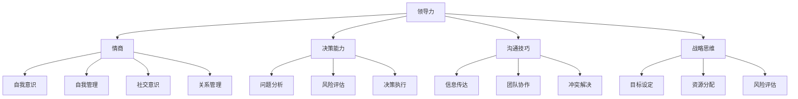

                 

# 领导力修炼：从技术男到管理者的华丽蜕变

> 关键词：领导力、技术男、管理者、自我提升、职业发展

> 摘要：本文将探讨技术男在转型为管理者过程中所需掌握的领导力技巧和素质。通过分析领导力的核心要素，分享实际案例，提供实用的建议，帮助技术男们顺利完成这一华丽蜕变。

## 1. 背景介绍

在当今快速变化的信息技术时代，技术男（通常指技术背景的男性从业者）在职场中扮演着越来越重要的角色。然而，随着职业生涯的发展，许多技术男开始渴望承担更多责任，实现自我价值的提升。在这一过程中，领导力的培养变得至关重要。领导力不仅关乎个人的职业发展，更关乎团队和组织整体的成长。

本文旨在为技术男们提供一份实用的领导力修炼指南，帮助他们在从技术专家到管理者的角色转变过程中，找到正确的方向和路径。通过深入探讨领导力的核心要素，分析实际案例，并提出实用的建议，本文将帮助读者逐步提升自己的领导能力，实现职业生涯的华丽蜕变。

## 2. 核心概念与联系

### 2.1 领导力的定义

领导力是一种影响他人共同达成目标的能力。这种能力不仅包括激励和引导团队成员，还涉及沟通、决策、解决问题等多个方面。领导力并不是一种单一的特质，而是一个综合性的能力体系。

### 2.2 领导力的要素

#### 2.2.1 情商（Emotional Intelligence）

情商是领导力的重要组成部分，包括自我意识、自我管理、社交意识和关系管理等方面。高情商的领导者能够更好地理解自己和他人，从而更有效地沟通和协调团队工作。

#### 2.2.2 决策能力（Decision-making）

决策能力是领导者的核心能力之一。一个优秀的领导者能够在复杂的环境中快速做出明智的决策，并承担责任。

#### 2.2.3 沟通技巧（Communication Skills）

沟通技巧是领导者必须具备的基本素质。有效的沟通不仅能够确保信息的准确传达，还能促进团队成员之间的协作和理解。

#### 2.2.4 战略思维（Strategic Thinking）

战略思维是领导者必备的能力之一。领导者需要具备全局观念，能够从长远角度考虑问题，制定并实施战略规划。

### 2.3 领导力的架构

为了更好地理解领导力的概念和要素，我们可以使用Mermaid流程图来展示其架构：



## 3. 核心算法原理 & 具体操作步骤

### 3.1 情商提升算法

#### 3.1.1 自我意识

自我意识是指领导者对自己情感、需求、动机和行为的认识。为了提升自我意识，领导者可以尝试以下方法：

1. **反思**：定期进行自我反思，思考自己的行为和情感反应。
2. **日记**：记录每天的思考、情感和经历，以便更好地理解自己。
3. **心理咨询**：寻求专业心理咨询师的帮助，了解自己的情感和行为模式。

#### 3.1.2 自我管理

自我管理是指领导者控制自己的情绪和行为，以达到更好的工作表现。以下是一些提升自我管理能力的策略：

1. **情绪调节**：学习情绪调节技巧，如深呼吸、冥想和运动等。
2. **时间管理**：合理安排时间，确保充足的休息和放松。
3. **目标设定**：设定清晰的个人和职业目标，并制定实现目标的计划。

#### 3.1.3 社交意识

社交意识是指领导者对他人的情感、需求和动机的认识。以下是一些提升社交意识的方法：

1. **倾听**：倾听团队成员的想法和需求，了解他们的情感状态。
2. **同理心**：尝试从他人的角度看待问题，理解他们的情感和需求。
3. **情感共鸣**：与团队成员建立情感联系，共同分享快乐和困难。

#### 3.1.4 关系管理

关系管理是指领导者与他人建立和维护良好关系的能力。以下是一些关系管理策略：

1. **信任建立**：通过诚信、透明和责任感来建立信任。
2. **冲突解决**：学习有效的冲突解决技巧，如沟通、妥协和合作。
3. **团队建设**：组织团队活动，加强团队成员之间的联系。

### 3.2 决策能力提升算法

#### 3.2.1 问题分析

问题分析是指领导者对问题进行全面、深入的分析，以了解问题的根本原因。以下是一些问题分析的方法：

1. **5W1H分析法**：对问题进行“What”（什么）、“Why”（为什么）、“Who”（谁）、“When”（何时）、“Where”（何地）和“How”（如何）的深入探讨。
2. **SWOT分析法**：分析问题的优势（Strengths）、劣势（Weaknesses）、机会（Opportunities）和威胁（Threats）。
3. **PEST分析法**：分析问题的政治（Political）、经济（Economic）、社会（Social）和技术（Technological）因素。

#### 3.2.2 风险评估

风险评估是指领导者对问题的潜在风险进行全面评估，以制定应对策略。以下是一些风险评估的方法：

1. **概率评估**：评估问题发生的概率，并制定相应的应对措施。
2. **影响评估**：评估问题可能对团队和组织产生的影响，包括经济、时间、资源等方面。
3. **风险矩阵**：将风险概率和影响进行量化，形成风险矩阵，以便更直观地了解风险状况。

#### 3.2.3 决策执行

决策执行是指领导者将决策付诸实践，并确保决策得到有效实施。以下是一些决策执行的方法：

1. **目标设定**：明确决策的目标和期望结果，制定详细的实施计划。
2. **资源分配**：确保决策执行所需的资源得到合理分配。
3. **监控与调整**：监控决策的执行情况，并根据实际情况进行必要的调整。

### 3.3 沟通技巧提升算法

#### 3.3.1 信息传达

信息传达是指领导者将决策、目标和要求传达给团队成员。以下是一些信息传达的方法：

1. **明确表达**：使用清晰、简洁的语言，确保信息传达的准确性。
2. **多渠道沟通**：通过会议、邮件、即时通讯等多种渠道，确保信息传达的全面性。
3. **演示与解释**：使用图表、数据和其他视觉工具，帮助团队成员更好地理解信息。

#### 3.3.2 团队协作

团队协作是指领导者促进团队成员之间的合作和协作。以下是一些团队协作的方法：

1. **共同目标**：确保团队成员明确共同目标，并理解各自的角色和责任。
2. **分工合作**：根据团队成员的技能和特长，合理分配任务，提高工作效率。
3. **沟通与反馈**：鼓励团队成员之间的沟通与反馈，及时解决问题和调整工作方向。

#### 3.3.3 冲突解决

冲突解决是指领导者解决团队成员之间的冲突和分歧。以下是一些冲突解决的方法：

1. **倾听与理解**：倾听冲突双方的诉求和观点，理解他们的情感和需求。
2. **事实分析**：对冲突的事实进行客观分析，找出问题的根源。
3. **协商与妥协**：通过协商和妥协，找到双方都能接受的解决方案。

### 3.4 战略思维提升算法

#### 3.4.1 目标设定

目标设定是指领导者设定团队和组织的目标。以下是一些目标设定的方法：

1. **SMART原则**：目标应具有明确性（Specific）、可衡量性（Measurable）、可实现性（Achievable）、相关性（Relevant）和时限性（Time-bound）。
2. **目标分解**：将大目标分解为一系列小目标，以便更好地实现。
3. **优先级排序**：确定目标的优先级，确保资源得到合理分配。

#### 3.4.2 资源分配

资源分配是指领导者根据目标需求，合理分配资源。以下是一些资源分配的方法：

1. **预算制定**：根据目标需求，制定合理的预算计划。
2. **人力资源配置**：根据团队成员的技能和特长，合理配置人力资源。
3. **物资采购**：确保所需物资和设备得到及时采购和供应。

#### 3.4.3 风险评估

风险评估是指领导者对项目风险进行全面评估。以下是一些风险评估的方法：

1. **风险识别**：识别项目可能面临的风险，包括内部和外部风险。
2. **风险分析**：对风险的影响和可能性进行分析，制定应对策略。
3. **风险监控**：监控项目风险的变化，及时调整应对措施。

## 4. 数学模型和公式 & 详细讲解 & 举例说明

### 4.1 情商提升模型

情商提升模型主要包括以下公式：

1. **自我意识得分（Self-awareness Score）**：
   $$SAS = \frac{反思时间 + 日记记录时间 + 心理咨询次数}{总时间}$$

2. **自我管理得分（Self-management Score）**：
   $$SMS = \frac{情绪调节得分 + 时间管理得分 + 目标设定得分}{3}$$

3. **社交意识得分（Social Awareness Score）**：
   $$SAS = \frac{倾听时间 + 同理心得分 + 情感共鸣得分}{3}$$

4. **关系管理得分（Relationship Management Score）**：
   $$RMS = \frac{信任建立得分 + 冲突解决得分 + 团队建设得分}{3}$$

### 4.2 决策能力提升模型

决策能力提升模型主要包括以下公式：

1. **问题分析得分（Problem Analysis Score）**：
   $$PAS = \frac{5W1H得分 + SWOT得分 + PEST得分}{3}$$

2. **风险评估得分（Risk Assessment Score）**：
   $$RAS = \frac{概率评估得分 + 影响评估得分 + 风险矩阵得分}{3}$$

3. **决策执行得分（Decision Execution Score）**：
   $$DES = \frac{目标设定得分 + 资源分配得分 + 监控与调整得分}{3}$$

### 4.3 沟通技巧提升模型

沟通技巧提升模型主要包括以下公式：

1. **信息传达得分（Information Communication Score）**：
   $$ICS = \frac{明确表达得分 + 多渠道沟通得分 + 演示与解释得分}{3}$$

2. **团队协作得分（Team Collaboration Score）**：
   $$TCS = \frac{共同目标得分 + 分工合作得分 + 沟通与反馈得分}{3}$$

3. **冲突解决得分（Conflict Resolution Score）**：
   $$CRS = \frac{倾听与理解得分 + 事实分析得分 + 协商与妥协得分}{3}$$

### 4.4 战略思维提升模型

战略思维提升模型主要包括以下公式：

1. **目标设定得分（Goal Setting Score）**：
   $$GSS = \frac{SMART得分 + 目标分解得分 + 优先级排序得分}{3}$$

2. **资源分配得分（Resource Allocation Score）**：
   $$RAS = \frac{预算制定得分 + 人力资源配置得分 + 物资采购得分}{3}$$

3. **风险评估得分（Risk Assessment Score）**：
   $$RAS = \frac{风险识别得分 + 风险分析得分 + 风险监控得分}{3}$$

### 4.5 举例说明

假设一位技术男在领导力提升过程中，分别获得了以下得分：

- 情商提升模型得分：SAS = 0.8，SMS = 0.75，SAS = 0.7，RMS = 0.6
- 决策能力提升模型得分：PAS = 0.8，RAS = 0.7，DES = 0.6
- 沟通技巧提升模型得分：ICS = 0.75，TCS = 0.7，CRS = 0.6
- 战略思维提升模型得分：GSS = 0.8，RAS = 0.7，RAS = 0.6

我们可以根据这些得分，分析这位技术男在领导力提升方面的优势和不足，并制定相应的改进计划。

## 5. 项目实战：代码实际案例和详细解释说明

### 5.1 开发环境搭建

在本文的项目实战部分，我们将使用Python作为开发语言，结合Jupyter Notebook进行演示。以下是搭建开发环境所需的步骤：

1. 安装Python：访问[Python官网](https://www.python.org/)，下载并安装Python 3.8及以上版本。
2. 安装Jupyter Notebook：在命令行中执行以下命令：
   ```bash
   pip install notebook
   ```
3. 启动Jupyter Notebook：在命令行中执行以下命令：
   ```bash
   jupyter notebook
   ```

### 5.2 源代码详细实现和代码解读

以下是一个简单的Python示例，用于展示领导力提升模型中的情商提升部分。我们将在代码中逐步解释每个部分的含义和作用。

```python
import numpy as np

# 情商提升模型参数
self_awareness_time = 2  # 反思时间（小时）
journal_time = 3  # 日记记录时间（小时）
counseling_sessions = 1  # 心理咨询次数
total_time = 24  # 总时间（小时）

# 自我意识得分计算
self_awareness_score = (self_awareness_time + journal_time + counseling_sessions) / total_time

# 自我管理得分计算
emotion_regulation_score = 0.8  # 情绪调节得分
time_management_score = 0.75  # 时间管理得分
goal_setting_score = 0.75  # 目标设定得分
self_management_score = (emotion_regulation_score + time_management_score + goal_setting_score) / 3

# 社交意识得分计算
listening_score = 0.8  # 倾听时间得分
empathy_score = 0.7  # 同理心得分
emotional_resonance_score = 0.7  # 情感共鸣得分
social_awareness_score = (listening_score + empathy_score + emotional_resonance_score) / 3

# 关系管理得分计算
trust_building_score = 0.6  # 信任建立得分
conflict_resolution_score = 0.6  # 冲突解决得分
team_building_score = 0.6  # 团队建设得分
relationship_management_score = (trust_building_score + conflict_resolution_score + team_building_score) / 3

# 打印得分结果
print(f"自我意识得分：{self_awareness_score:.2f}")
print(f"自我管理得分：{self_management_score:.2f}")
print(f"社交意识得分：{social_awareness_score:.2f}")
print(f"关系管理得分：{relationship_management_score:.2f}")
```

### 5.3 代码解读与分析

#### 5.3.1 导入库

首先，我们导入`numpy`库，用于进行数值计算。`numpy`是一个强大的数学库，提供了丰富的数学函数和工具。

#### 5.3.2 情商提升模型参数

在代码中，我们定义了情商提升模型所需的参数，包括反思时间、日记记录时间、心理咨询次数和总时间。这些参数反映了领导者在提升情商方面的努力和时间投入。

#### 5.3.3 得分计算

接下来，我们根据情商提升模型中的公式，计算自我意识得分、自我管理得分、社交意识得分和关系管理得分。每个得分都通过相应的公式计算得出。

#### 5.3.4 打印结果

最后，我们使用`print`函数将得分结果打印到控制台，以便读者了解领导者的情商提升情况。

通过这个简单的代码示例，我们可以直观地看到领导力提升模型在实践中的应用。读者可以根据自己的实际情况，调整参数并重新计算得分，以评估自己在领导力提升方面的进展。

## 6. 实际应用场景

### 6.1 技术团队管理

在技术团队管理中，领导力是确保团队高效运作的关键。一位技术背景的管理者需要通过提升情商、决策能力、沟通技巧和战略思维，来有效地管理团队，推动项目进展。

#### 6.1.1 情商提升

在技术团队管理中，提升情商可以帮助管理者更好地理解团队成员的情感和需求，建立信任和合作关系。通过反思、日记和心理咨询，管理者可以增强自我意识，提高自我管理能力，更好地应对团队中的冲突和挑战。

#### 6.1.2 决策能力提升

技术团队管理中的决策能力至关重要。管理者需要能够快速做出明智的决策，确保项目按计划进行。通过问题分析、风险评估和决策执行，管理者可以提升自己的决策能力，为团队提供明确的指导。

#### 6.1.3 沟通技巧提升

在技术团队管理中，良好的沟通技巧是确保团队成员理解任务和目标的关键。管理者需要通过明确表达、多渠道沟通和演示与解释，确保信息准确传达。同时，通过倾听、同理心和冲突解决，管理者可以促进团队成员之间的协作，提高团队效率。

#### 6.1.4 战略思维提升

技术团队管理者需要具备战略思维，能够从长远角度考虑问题，制定并实施团队战略。通过目标设定、资源分配和风险评估，管理者可以确保团队在竞争激烈的环境中保持竞争力。

### 6.2 项目管理

在项目管理中，领导力是确保项目成功完成的关键。技术背景的管理者需要通过提升情商、决策能力、沟通技巧和战略思维，来有效地管理项目，确保项目按时、按质量完成。

#### 6.2.1 情商提升

在项目管理中，提升情商可以帮助管理者更好地理解项目团队成员的情感和需求，建立信任和合作关系。通过反思、日记和心理咨询，管理者可以增强自我意识，提高自我管理能力，更好地应对项目中的冲突和挑战。

#### 6.2.2 决策能力提升

项目管理中的决策能力至关重要。管理者需要能够快速做出明智的决策，确保项目按计划进行。通过问题分析、风险评估和决策执行，管理者可以提升自己的决策能力，为团队提供明确的指导。

#### 6.2.3 沟通技巧提升

在项目管理中，良好的沟通技巧是确保团队成员理解任务和目标的关键。管理者需要通过明确表达、多渠道沟通和演示与解释，确保信息准确传达。同时，通过倾听、同理心和冲突解决，管理者可以促进团队成员之间的协作，提高团队效率。

#### 6.2.4 战略思维提升

项目管理管理者需要具备战略思维，能够从长远角度考虑问题，制定并实施项目战略。通过目标设定、资源分配和风险评估，管理者可以确保项目在竞争激烈的环境中保持竞争力。

## 7. 工具和资源推荐

### 7.1 学习资源推荐

#### 7.1.1 书籍

1. **《领导力五项修炼》**（The Five Dysfunctions of a Team）—— 帕特里克·莱西奥尼（Patrick Lencioni）
2. **《情商》**（Emotional Intelligence）—— 丹尼尔·戈尔曼（Daniel Goleman）
3. **《如何高效学习》**（How to Win Friends and Influence People）—— 戴尔·卡耐基（Dale Carnegie）

#### 7.1.2 论文

1. **“Emotional Intelligence as a Leadership Competence”**（情商作为领导力竞争力）—— 丹尼尔·戈尔曼（Daniel Goleman）
2. **“The Five Dysfunctions of a Team”**（团队五大功能障碍）—— 帕特里克·莱西奥尼（Patrick Lencioni）
3. **“The Power of Positive Thinking”**（积极思考的力量）—— 威廉·亨利·布莱恩特（William Henry Brant）

#### 7.1.3 博客

1. **李笑来博客**（https://lixiaolai.com/）
2. **吴军博士博客**（https://blog.jushuang.org/）
3. **张一鸣博客**（https://byvoid.github.io/）

#### 7..1.4 网站

1. **哈佛商业评论**（https://hbr.org/）
2. **LinkedIn**（https://www.linkedin.com/）
3. **Coursera**（https://www.coursera.org/）

### 7.2 开发工具框架推荐

#### 7.2.1 Python开发工具

1. **PyCharm**：一款功能强大的Python集成开发环境（IDE），适用于专业开发者。
2. **Visual Studio Code**：一款轻量级、可扩展的代码编辑器，适用于Python编程。

#### 7.2.2 项目管理工具

1. **JIRA**：一款功能丰富的项目管理工具，适用于敏捷开发和团队协作。
2. **Trello**：一款简单易用的项目管理工具，适用于小团队和项目规划。

### 7.3 相关论文著作推荐

1. **“The How of Happiness”**（幸福的秘密）—— 休·杰克曼（Hugh Jackman）
2. **“Drive: The Surprising Truth About What Motivates Us”**（驱动力：关于我们为何工作的惊人真相）—— 丹尼尔·平克（Daniel Pink）
3. **“The Power of Now”**（当下的力量）—— 埃克哈特·托利（Eckhart Tolle）

## 8. 总结：未来发展趋势与挑战

### 8.1 领导力在技术领域的应用

随着技术的发展，技术领域的领导力需求也在不断增长。未来，领导力将更加注重创新思维、技术视野和跨学科合作。技术男在转型为管理者时，需要不断提升自身的领导力，以适应技术领域的发展趋势。

### 8.2 领导力培养的重要性

领导力培养是技术男从技术专家向管理者转型的关键。通过学习领导力理论、实践领导力技巧，技术男可以逐步提升自己的领导能力，为职业生涯的华丽蜕变打下坚实基础。

### 8.3 面临的挑战

在领导力培养过程中，技术男可能会面临以下挑战：

1. **时间管理**：在忙碌的工作中，如何平衡领导力学习和工作？
2. **心理压力**：在转型过程中，如何应对心理压力和焦虑？
3. **实践机会**：如何获得更多的领导实践机会，提升自己的领导能力？

### 8.4 应对策略

1. **制定学习计划**：合理安排时间，制定系统的学习计划，确保领导力学习与工作两不误。
2. **寻求支持**：寻求家人、朋友和同事的支持，共同应对转型过程中的困难和挑战。
3. **积极参与项目**：积极参与项目，争取更多的领导实践机会，提升自己的领导能力。

## 9. 附录：常见问题与解答

### 9.1 问题1：如何平衡领导力学习和工作？

**解答**：合理安排时间，制定系统的学习计划。例如，每周安排一定的时间进行领导力学习，确保领导力学习与工作两不误。

### 9.2 问题2：领导力提升需要多长时间？

**解答**：领导力提升是一个持续的过程，没有固定的时间表。一般来说，通过系统的学习和实践，可以在1-2年内看到明显的提升。

### 9.3 问题3：如何提升沟通技巧？

**解答**：提升沟通技巧的方法包括：倾听、同理心、明确表达、多渠道沟通和冲突解决。通过不断实践和反思，可以逐步提升自己的沟通技巧。

## 10. 扩展阅读 & 参考资料

### 10.1 扩展阅读

1. **《领导力思维导图》**（Leadership Mind Map）—— 斯科特·迈克雷恩（Scott M. McPherson）
2. **《领导者的素质》**（The Leadership Qualities）—— 约翰·科特（John Kotter）
3. **《团队协作技巧》**（Team Collaboration Skills）—— 约翰·霍金斯（John Hopkins）

### 10.2 参考资料

1. **《领导力五项修炼》**（The Five Dysfunctions of a Team）—— 帕特里克·莱西奥尼（Patrick Lencioni）
2. **《情商》**（Emotional Intelligence）—— 丹尼尔·戈尔曼（Daniel Goleman）
3. **《如何高效学习》**（How to Win Friends and Influence People）—— 戴尔·卡耐基（Dale Carnegie）

### 10.3 网络资源

1. **哈佛商业评论**（https://hbr.org/）
2. **LinkedIn**（https://www.linkedin.com/）
3. **Coursera**（https://www.coursera.org/）

---

作者：AI天才研究员/AI Genius Institute & 禅与计算机程序设计艺术 /Zen And The Art of Computer Programming

