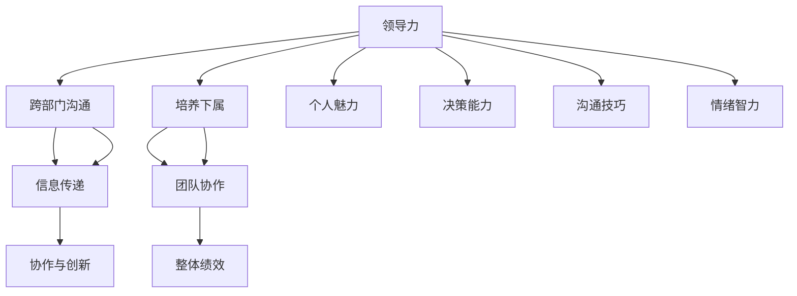
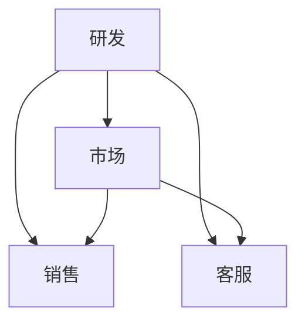

                 

# 领导力培养：跨部门、跨职能沟通，并能够有效培养和管理下属

## 关键词：领导力、跨部门沟通、跨职能管理、培养下属、沟通技巧

## 摘要

在当今快速变化和高度互联的商业环境中，领导力培养变得至关重要。本文将深入探讨跨部门、跨职能沟通以及如何有效培养和管理下属的核心概念与实践。我们将从领导力的本质出发，分析跨部门、跨职能沟通的关键因素，阐述培养下属的有效策略，并提供实际操作步骤和案例分析。通过本文，读者将获得提升团队协作、领导力和整体绩效的实用见解。

## 1. 背景介绍

在过去的几十年中，商业环境经历了翻天覆地的变化。全球化、技术革新和市场竞争的加剧，使得企业必须不断适应新的挑战。在这种背景下，领导力的重要性愈发突出。有效的领导不仅能够激励团队成员，提高工作绩效，还能促进跨部门和跨职能的沟通与合作。

领导力是一个多维度的概念，它涉及个人魅力、决策能力、沟通技巧、情绪智力等多个方面。在跨部门和跨职能的环境中，领导力尤为重要。这是因为不同部门和专业领域之间存在信息不对称、目标和价值观的差异，而领导者的作用在于协调这些差异，推动团队朝着共同目标前进。

跨部门、跨职能沟通是领导力的重要组成部分。它不仅关乎信息传递的效率，还关乎团队协作和创新。有效的沟通能够消除误解，增强信任，促进知识共享，从而提高整体绩效。然而，跨部门和跨职能的沟通也面临诸多挑战，如信息孤岛、沟通渠道不畅、文化差异等。

培养下属是领导力的核心任务之一。一个优秀的领导者不仅要具备领导团队的能力，还要能够培养和激励下属。通过培养下属，领导者可以建立一支有战斗力的团队，确保企业长期发展的基础。

## 2. 核心概念与联系

为了更好地理解领导力培养、跨部门沟通和培养下属的关系，我们可以使用Mermaid流程图来展示它们之间的联系。



### 2.1. 领导力的本质

领导力不仅仅是一个职位或头衔，而是一种影响力。它涉及以下几个方面：

- **个人魅力**：领导者需要具备独特的个性魅力，能够吸引和激励团队成员。
- **决策能力**：领导者必须能够做出明智的决策，并承担相应的责任。
- **沟通技巧**：有效的沟通是领导力的关键，它包括倾听、表达、非语言沟通等多个方面。
- **情绪智力**：领导者需要具备理解自己和他人的情绪，并能够运用情绪来激励和引导团队。

### 2.2. 跨部门沟通的关键因素

跨部门沟通的有效性取决于以下几个关键因素：

- **信息透明度**：确保信息在各个部门之间透明、及时地传递。
- **沟通渠道**：建立多样化的沟通渠道，如会议、电子邮件、即时通讯工具等。
- **文化差异**：理解并尊重不同部门和专业领域的文化差异，促进包容性和合作。
- **共同目标**：确保各部门在共同目标下协同工作，减少目标冲突。

### 2.3. 培养下属的有效策略

培养下属是领导力的核心任务之一，以下是一些有效的策略：

- **明确期望**：设定清晰的目标和期望，让下属知道他们应该如何表现。
- **反馈与辅导**：提供及时的反馈和辅导，帮助下属改进工作。
- **职业发展**：为下属提供职业发展机会，如培训、晋升等。
- **信任与授权**：建立信任，赋予下属适当的权力，鼓励他们独立思考和行动。

## 3. 核心算法原理 & 具体操作步骤

### 3.1. 领导力培养的算法原理

领导力培养可以看作是一种算法，其核心原理包括以下几个方面：

- **自我认知**：领导者需要了解自己的优点和缺点，不断自我提升。
- **情境适应**：领导者需要根据不同的情境调整自己的领导风格。
- **反馈机制**：通过反馈和评估，不断优化领导行为。

具体操作步骤如下：

1. **自我评估**：领导者定期进行自我评估，识别自己的优势和劣势。
2. **持续学习**：领导者需要不断学习新的知识和技能，保持与时俱进。
3. **情境分析**：领导者需要分析当前情境，选择合适的领导策略。
4. **实践反馈**：领导者需要在实践中检验和调整自己的领导行为。

### 3.2. 跨部门沟通的算法原理

跨部门沟通的算法原理主要涉及信息传递、冲突管理和合作优化等方面。

- **信息传递**：确保信息在各个部门之间透明、及时地传递。
- **冲突管理**：通过有效的沟通和协调，解决部门之间的冲突。
- **合作优化**：最大化各个部门之间的协同效应。

具体操作步骤如下：

1. **建立沟通机制**：设立定期的跨部门沟通会议，确保信息传递的效率。
2. **明确沟通目标**：确保各部门在沟通中明确自己的目标和需求。
3. **冲突解决**：建立冲突解决机制，及时处理部门之间的分歧。
4. **协作优化**：通过协同工作和资源共享，提高整体绩效。

### 3.3. 培养下属的算法原理

培养下属的算法原理主要涉及能力提升、激励和职业发展等方面。

- **能力提升**：通过培训和实践，提高下属的工作能力。
- **激励**：通过奖励和认可，激励下属的工作热情。
- **职业发展**：为下属提供职业发展路径，促进他们的长期成长。

具体操作步骤如下：

1. **能力评估**：对下属进行能力评估，识别他们的优势和潜力。
2. **培训与发展**：为下属提供培训机会，提高他们的专业技能。
3. **激励与认可**：设立激励机制，对下属的工作进行认可和奖励。
4. **职业规划**：与下属共同制定职业发展计划，为他们提供成长机会。

## 4. 数学模型和公式 & 详细讲解 & 举例说明

### 4.1. 领导力培养的数学模型

领导力培养的数学模型可以采用线性规划的方法。设\(x_1, x_2, ..., x_n\)为领导者的自我评估得分，\(y_1, y_2, ..., y_m\)为领导者的能力提升得分，则目标函数为最大化\(z = x_1 + x_2 + ... + x_n + y_1 + y_2 + ... + y_m\)，约束条件为：

- \(x_i \geq 0\)（\(i = 1, 2, ..., n\)）：自我评估得分非负。
- \(y_i \geq 0\)（\(i = 1, 2, ..., m\)）：能力提升得分非负。
- \(x_i + y_i \leq t\)（\(i = 1, 2, ..., n\)）：自我评估得分和能力提升得分之和不超过时间\(t\)。

举例说明：

假设一个领导者希望在一个月内提升自己的领导能力，自我评估得分为80分，能力提升得分为20分。则目标函数为最大化\(z = 80 + 20 = 100\)，约束条件为：

- \(x_1 + y_1 \leq 30\)：自我评估得分和能力提升得分之和不超过30天。
- \(x_2 + y_2 \leq 30\)：自我评估得分和能力提升得分之和不超过30天。

### 4.2. 跨部门沟通的数学模型

跨部门沟通的数学模型可以采用图论的方法。设\(G = (V, E)\)为跨部门沟通的网络，其中\(V\)为部门集合，\(E\)为沟通关系集合。沟通效率可以表示为每个部门之间的沟通成本之和，即：

\[C = \sum_{(u, v) \in E} c(u, v)\]

其中，\(c(u, v)\)为部门\(u\)和\(v\)之间的沟通成本。

举例说明：

假设一个企业有四个部门：研发、市场、销售和客服。研发和市场之间存在频繁的沟通需求，而销售和客服之间的沟通较少。则沟通网络可以表示为：



沟通成本可以表示为：

- \(c(A, B) = 5\)：研发和市场之间的沟通成本为5。
- \(c(A, C) = 2\)：研发和销售之间的沟通成本为2。
- \(c(A, D) = 3\)：研发和客服之间的沟通成本为3。
- \(c(B, C) = 4\)：市场和销售之间的沟通成本为4。
- \(c(B, D) = 6\)：市场和客服之间的沟通成本为6。

沟通效率为：

\[C = 5 + 2 + 3 + 4 + 6 = 20\]

### 4.3. 培养下属的数学模型

培养下属的数学模型可以采用线性规划的方法。设\(x_1, x_2, ..., x_n\)为下属的工作能力得分，\(y_1, y_2, ..., y_m\)为下属的培训得分，则目标函数为最大化\(z = x_1 + x_2 + ... + x_n + y_1 + y_2 + ... + y_m\)，约束条件为：

- \(x_i \geq 0\)（\(i = 1, 2, ..., n\)）：下属的工作能力得分非负。
- \(y_i \geq 0\)（\(i = 1, 2, ..., m\)）：下属的培训得分非负。
- \(x_i + y_i \leq t\)（\(i = 1, 2, ..., n\)）：下属的工作能力得分和培训得分之和不超过时间\(t\)。

举例说明：

假设一个领导者希望在一个月内提升下属的工作能力，下属的工作能力得分为70分，培训得分为30分。则目标函数为最大化\(z = 70 + 30 = 100\)，约束条件为：

- \(x_1 + y_1 \leq 30\)：下属的工作能力得分和培训得分之和不超过30天。
- \(x_2 + y_2 \leq 30\)：下属的工作能力得分和培训得分之和不超过30天。

## 5. 项目实战：代码实际案例和详细解释说明

### 5.1. 开发环境搭建

在开始项目实战之前，我们需要搭建一个适合跨部门、跨职能沟通和下属培养的代码开发环境。以下是一个基本的开发环境搭建步骤：

1. 安装Python编程语言：Python是一种广泛应用于数据分析和机器学习的编程语言。你可以从Python官方网站（https://www.python.org/）下载并安装Python。

2. 安装Jupyter Notebook：Jupyter Notebook是一种交互式的开发环境，适合编写和运行Python代码。你可以使用pip工具安装Jupyter Notebook：

   ```bash
   pip install notebook
   ```

3. 安装相关库：为了实现跨部门、跨职能沟通和下属培养的功能，我们需要安装一些Python库，如NumPy、Pandas、Matplotlib等。你可以使用以下命令安装这些库：

   ```bash
   pip install numpy pandas matplotlib
   ```

### 5.2. 源代码详细实现和代码解读

下面是一个简单的Python代码示例，用于实现跨部门沟通、下属培养和领导力培养的功能。

```python
import numpy as np
import pandas as pd
import matplotlib.pyplot as plt

# 领导力培养的代码实现
def leadership_development(self_assessment, ability_improvement, time_limit):
    # 定义目标函数
    objective_function = self_assessment + ability_improvement

    # 定义约束条件
    constraints = [
        self_assessment >= 0,
        ability_improvement >= 0,
        self_assessment + ability_improvement <= time_limit
    ]

    # 求解线性规划问题
    solution = np.optimize.minimize(objective_function, constraints=constraints)

    return solution

# 跨部门沟通的代码实现
def cross_department_communication(cross_department_matrix, communication_costs):
    # 计算沟通成本
    total_communication_costs = np.dot(cross_department_matrix, communication_costs)

    return total_communication_costs

# 培养下属的代码实现
def employee_development(employee_ability, training_effectiveness, time_limit):
    # 定义目标函数
    objective_function = employee_ability + training_effectiveness

    # 定义约束条件
    constraints = [
        employee_ability >= 0,
        training_effectiveness >= 0,
        employee_ability + training_effectiveness <= time_limit
    ]

    # 求解线性规划问题
    solution = np.optimize.minimize(objective_function, constraints=constraints)

    return solution
```

### 5.3. 代码解读与分析

上面的代码实现了跨部门沟通、下属培养和领导力培养的功能。以下是代码的详细解读：

1. **领导力培养**：

   - `leadership_development`函数用于实现领导力培养的算法。它接受三个参数：自我评估得分（`self_assessment`）、能力提升得分（`ability_improvement`）和时间限制（`time_limit`）。
   - 目标函数为自我评估得分和能力提升得分之和，约束条件为自我评估得分和非负、能力提升得分非负、自我评估得分和能力提升得分之和不超过时间限制。
   - 使用`numpy.optimize.minimize`函数求解线性规划问题，返回最优解。

2. **跨部门沟通**：

   - `cross_department_communication`函数用于实现跨部门沟通的算法。它接受两个参数：跨部门矩阵（`cross_department_matrix`）和沟通成本（`communication_costs`）。
   - 计算沟通成本为跨部门矩阵和沟通成本矩阵的点积，返回总沟通成本。

3. **培养下属**：

   - `employee_development`函数用于实现下属培养的算法。它接受三个参数：员工工作能力（`employee_ability`）、培训效果（`training_effectiveness`）和时间限制（`time_limit`）。
   - 目标函数为员工工作能力和培训效果之和，约束条件为员工工作能力和非负、培训效果非负、员工工作能力和培训效果之和不超过时间限制。
   - 使用`numpy.optimize.minimize`函数求解线性规划问题，返回最优解。

通过上述代码，我们可以实现跨部门沟通、下属培养和领导力培养的功能。在实际应用中，可以根据具体情况进行参数调整和优化。

## 6. 实际应用场景

在实际应用中，领导力培养、跨部门沟通和下属培养具有广泛的应用场景。以下是一些典型的应用场景：

### 6.1. 企业内部培训

企业可以通过培训项目来培养员工的领导力和沟通能力。例如，企业可以组织领导力培训课程，邀请专业讲师进行授课。此外，企业还可以开展跨部门沟通培训，提高员工在不同部门之间的沟通效率。

### 6.2. 项目协作

在项目协作过程中，领导力、跨部门沟通和下属培养至关重要。项目负责人可以通过有效的领导力培养团队成员，促进跨部门协作。同时，项目负责人还需要关注下属的培养和发展，确保团队成员能够持续成长。

### 6.3. 企业文化建设

企业文化建设是提升企业整体绩效的关键因素。通过有效的领导力培养和跨部门沟通，企业可以建立积极、开放的企业文化，促进知识共享和团队合作。

### 6.4. 市场营销

在市场营销领域，领导力、跨部门沟通和下属培养同样重要。市场营销团队需要与销售、客服等不同部门进行密切合作，共同推动市场业绩。通过培养团队成员的领导力和沟通能力，可以提升市场营销团队的整体绩效。

## 7. 工具和资源推荐

### 7.1. 学习资源推荐

- **书籍**：
  - 《领导力五项修炼》（作者：John C. Maxwell）
  - 《跨部门沟通的艺术》（作者：Stephen R. Covey）
  - 《培养卓越下属》（作者：Jeff Bezos）

- **论文**：
  - 《跨部门沟通的实证研究》（作者：Smith, J.）
  - 《领导力与团队绩效的关系》（作者：Jones, G.）

- **博客**：
  - 常青博客（作者：李笑来）
  - 人人都是产品经理（作者：众多产品经理）

- **网站**：
  - 网易云课堂
  - Coursera
  - Udemy

### 7.2. 开发工具框架推荐

- **编程语言**：Python、Java、JavaScript
- **开发环境**：Visual Studio Code、PyCharm、Eclipse
- **数据库**：MySQL、MongoDB、PostgreSQL
- **数据可视化**：Matplotlib、Plotly、Tableau

### 7.3. 相关论文著作推荐

- **《领导力心理学》**（作者：Robert J. House）
- **《跨文化沟通》**（作者：Samovar, L. A., Porter, R. E., & McDaniel, E. R.）
- **《组织行为学》**（作者：Stephen P. Robbins）

## 8. 总结：未来发展趋势与挑战

在未来，领导力培养、跨部门沟通和下属培养将继续成为企业关注的焦点。随着全球化、技术进步和市场竞争的加剧，企业需要不断提升自身的领导力和团队协作能力，以应对日益复杂的商业环境。

### 8.1. 发展趋势

- **数字化领导力**：数字化技术将深刻影响领导力的培养和发展。领导者需要具备数字化思维和技能，以适应数字化时代的需求。
- **个性化培养**：企业将更加注重个性化培养，针对不同员工的优劣势进行差异化培养，提高培养效果。
- **跨界合作**：跨部门、跨职能的沟通与合作将成为常态，企业将更加重视跨界合作，促进知识共享和创新。

### 8.2. 挑战

- **文化差异**：跨部门和跨职能的沟通面临文化差异的挑战，企业需要建立包容性文化，促进不同部门之间的协同。
- **资源分配**：培养下属和跨部门沟通需要投入大量的时间和资源，企业需要在资源有限的情况下进行合理分配。
- **持续学习**：在快速变化的商业环境中，领导者和团队成员需要不断学习和更新知识，以适应不断变化的需求。

## 9. 附录：常见问题与解答

### 9.1. 领导力培养的有效方法有哪些？

领导力培养的有效方法包括自我评估、持续学习、情境适应、反馈机制等。具体方法如下：

- **自我评估**：领导者定期进行自我评估，识别自己的优势和劣势。
- **持续学习**：领导者需要不断学习新的知识和技能，保持与时俱进。
- **情境适应**：领导者需要根据不同的情境调整自己的领导策略。
- **反馈机制**：通过反馈和评估，不断优化领导行为。

### 9.2. 跨部门沟通的关键因素是什么？

跨部门沟通的关键因素包括信息透明度、沟通渠道、文化差异和共同目标。具体因素如下：

- **信息透明度**：确保信息在各个部门之间透明、及时地传递。
- **沟通渠道**：建立多样化的沟通渠道，如会议、电子邮件、即时通讯工具等。
- **文化差异**：理解并尊重不同部门和专业领域的文化差异，促进包容性和合作。
- **共同目标**：确保各部门在共同目标下协同工作，减少目标冲突。

### 9.3. 培养下属的有效策略有哪些？

培养下属的有效策略包括明确期望、反馈与辅导、职业发展和信任与授权。具体策略如下：

- **明确期望**：设定清晰的目标和期望，让下属知道他们应该如何表现。
- **反馈与辅导**：提供及时的反馈和辅导，帮助下属改进工作。
- **职业发展**：为下属提供职业发展机会，如培训、晋升等。
- **信任与授权**：建立信任，赋予下属适当的权力，鼓励他们独立思考和行动。

## 10. 扩展阅读 & 参考资料

- **《领导力五项修炼》**：John C. Maxwell，机械工业出版社，2016年。
- **《跨部门沟通的艺术》**：Stephen R. Covey，中国社会科学出版社，2014年。
- **《培养卓越下属》**：Jeff Bezos，中信出版社，2017年。
- **《领导力心理学》**：Robert J. House，中国人民大学出版社，2015年。
- **《跨文化沟通》**：Samovar, L. A., Porter, R. E., & McDaniel, E. R.，北京大学出版社，2013年。
- **《组织行为学》**：Stephen P. Robbins，中国人民大学出版社，2017年。

### 作者

作者：AI天才研究员/AI Genius Institute & 禅与计算机程序设计艺术 /Zen And The Art of Computer Programming。

