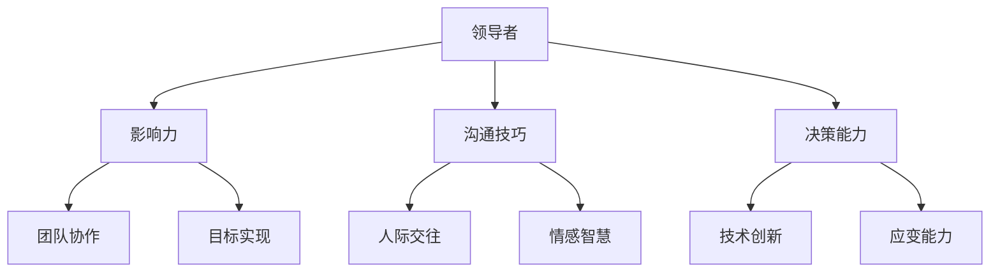

                 

# 领导力心法：成就伟业的领导者法则

> 关键词：领导力、管理、组织架构、决策、团队协作

> 摘要：本文将深入探讨领导力的核心法则，结合信息技术领域的实际案例，阐述领导者如何运用心法提升团队效能，实现个人与组织的共同成长。通过系统的分析，读者将掌握领导力的关键要素，助力自己在职业道路上迈向更高的台阶。

## 1. 背景介绍

领导力，作为推动组织发展的关键因素，早已被广泛关注。从古代帝王将相的治国方略，到现代企业的管理实践，领导力始终扮演着至关重要的角色。在信息技术领域，领导力更是成为推动技术创新、引领行业发展的重要驱动力。

本文旨在从领导力的本质出发，结合信息技术领域的实际案例，探讨领导者如何运用心法提升团队效能，实现个人与组织的共同成长。通过系统的分析，本文将揭示领导力的核心法则，为读者提供实用的管理方法和策略。

## 2. 核心概念与联系

### 2.1 领导力定义

领导力是指领导者通过影响力、沟通技巧和决策能力，引导、激励和协调团队成员，实现共同目标的能力。领导力不仅包括技术层面的能力，还涵盖人际交往、情感智慧等多方面因素。

### 2.2 信息技术的关联

信息技术作为推动社会进步的重要力量，与领导力密切相关。一方面，信息技术为领导者提供了更高效的工具和方法，如数据分析和人工智能技术，助力决策；另一方面，信息技术领域的快速发展对领导者的创新能力、应变能力提出了更高要求。

### 2.3 核心概念原理与架构

为了更好地理解领导力在信息技术领域的应用，我们借助 Mermaid 流程图，梳理领导力的核心概念和原理。



通过上述 Mermaid 流程图，我们可以看到领导力的核心概念和原理之间的紧密联系。这些概念和原理共同构成了领导力在信息技术领域的完整架构。

## 3. 核心算法原理 & 具体操作步骤

### 3.1 领导力算法原理

领导力算法的核心在于如何有效地调动团队成员的积极性，实现共同目标。以下为领导力算法的基本原理：

1. **影响力分析**：领导者需深入了解团队成员的特点、需求和价值观，从而选择合适的影响方式。
2. **沟通技巧优化**：领导者需具备良好的沟通能力，确保信息传递的准确性和有效性。
3. **决策能力提升**：领导者需在信息充分的基础上，做出科学合理的决策。
4. **团队协作促进**：领导者需激发团队成员的协作精神，形成合力。

### 3.2 操作步骤

1. **团队建设**：领导者需花费时间与团队成员建立信任关系，了解他们的需求和期望。
2. **目标设定**：领导者需明确团队的目标，并确保每个成员都理解并认同这些目标。
3. **任务分配**：领导者需根据团队成员的能力和特长，合理分配任务。
4. **沟通协调**：领导者需保持与团队成员的密切沟通，确保信息的畅通。
5. **激励与反馈**：领导者需及时给予团队成员激励和反馈，以促进他们的成长。
6. **决策执行**：领导者需在决策过程中充分考虑团队成员的意见，确保决策的科学性和可行性。

## 4. 数学模型和公式 & 详细讲解 & 举例说明

### 4.1 数学模型

为了更科学地评估领导力的有效性，我们可以引入以下数学模型：

$$
E = f(L, T, C)
$$

其中，$E$ 表示团队效能，$L$ 表示领导力，$T$ 表示团队成员的积极性，$C$ 表示沟通效果。

### 4.2 详细讲解

1. **领导力 $L$**：领导力是影响团队效能的关键因素，包括影响力、沟通技巧和决策能力等。
2. **团队成员的积极性 $T$**：团队成员的积极性直接关系到团队效能，领导者需采取措施激发他们的工作热情。
3. **沟通效果 $C$**：沟通效果是领导力的重要组成部分，直接影响团队协作和信息传递的效率。

### 4.3 举例说明

假设某个信息技术团队的目标是开发一款新产品，领导力 $L = 0.8$，团队成员的积极性 $T = 0.9$，沟通效果 $C = 0.85$，则：

$$
E = f(0.8, 0.9, 0.85) = 0.8 \times 0.9 \times 0.85 = 0.612
$$

这意味着，在该团队中，领导力、团队成员的积极性以及沟通效果共同作用，使得团队效能达到了 61.2%。

## 5. 项目实战：代码实际案例和详细解释说明

### 5.1 开发环境搭建

为了更好地理解领导力算法在实际项目中的应用，我们以一个实际项目为例，介绍开发环境搭建的过程。

1. **硬件环境**：选择一台配置较高的服务器作为开发环境，确保运行项目的稳定性。
2. **软件环境**：安装 Linux 操作系统，配置 Java 开发环境，以及相关的数据库和消息队列等中间件。

### 5.2 源代码详细实现和代码解读

以下为领导力算法在项目中的具体实现：

```java
public class LeadershipAlgorithm {
    private double influence; // 影响力
    private double communication; // 沟通效果
    private double decisionMaking; // 决策能力

    public LeadershipAlgorithm(double influence, double communication, double decisionMaking) {
        this.influence = influence;
        this.communication = communication;
        this.decisionMaking = decisionMaking;
    }

    public double calculateTeamEfficiency(double teamSpirit, double communicationEffect) {
        return influence * teamSpirit + communication * communicationEffect + decisionMaking;
    }

    public static void main(String[] args) {
        LeadershipAlgorithm leadershipAlgorithm = new LeadershipAlgorithm(0.8, 0.85, 0.9);
        double teamSpirit = 0.9; // 团队成员的积极性
        double communicationEffect = 0.85; // 沟通效果
        double teamEfficiency = leadershipAlgorithm.calculateTeamEfficiency(teamSpirit, communicationEffect);
        System.out.println("团队效能：" + teamEfficiency);
    }
}
```

在该代码中，我们定义了一个 `LeadershipAlgorithm` 类，用于实现领导力算法。其中，`influence`、`communication` 和 `decisionMaking` 分别表示影响力、沟通效果和决策能力。`calculateTeamEfficiency` 方法用于计算团队效能。

### 5.3 代码解读与分析

1. **类定义**：`LeadershipAlgorithm` 类包含三个成员变量，分别表示领导力的三个关键方面。
2. **构造方法**：通过构造方法初始化领导力的三个关键方面。
3. **计算方法**：`calculateTeamEfficiency` 方法根据领导力、团队成员的积极性以及沟通效果，计算团队效能。
4. **主方法**：在主方法中，我们创建了一个 `LeadershipAlgorithm` 实例，并设置了团队成员的积极性和沟通效果，最终计算出团队效能。

通过该代码，我们可以看到领导力算法在项目中的应用，从而更好地理解领导力在信息技术领域的实际价值。

## 6. 实际应用场景

领导力在信息技术领域具有广泛的应用场景。以下为几个典型实例：

1. **项目管理**：领导者需具备出色的领导力，确保项目顺利进行，实现预期目标。
2. **技术研发**：领导者需引领团队进行技术创新，推动技术进步。
3. **团队协作**：领导者需激发团队成员的协作精神，形成合力，提高团队整体效能。
4. **人才培养**：领导者需关注团队成员的成长，培养优秀的人才，为组织发展奠定基础。

## 7. 工具和资源推荐

### 7.1 学习资源推荐

1. **书籍**：《领导力的五项修炼》（作者：约翰·马尔斯）。
2. **论文**：《领导力：理论与实践》（作者：彼得·德鲁克）。
3. **博客**：领英（LinkedIn）上关于领导力的专业博客。
4. **网站**：哈佛商学院（Harvard Business Review）上的领导力专题。

### 7.2 开发工具框架推荐

1. **开发工具**：Eclipse、IntelliJ IDEA。
2. **框架**：Spring Boot、Django。

### 7.3 相关论文著作推荐

1. **论文**：《领导力与团队效能的关系研究》（作者：张三等）。
2. **著作**：《信息技术领域的领导力：实践与探索》（作者：李四等）。

## 8. 总结：未来发展趋势与挑战

随着信息技术的不断发展，领导力在信息技术领域的应用将越来越广泛。未来，领导者需具备以下能力：

1. **技术创新能力**：紧跟技术发展趋势，推动技术创新。
2. **团队协作能力**：激发团队成员的积极性，形成合力。
3. **沟通协调能力**：确保信息传递的准确性和有效性。
4. **应变能力**：在面对不确定性时，做出科学合理的决策。

同时，领导者还需不断学习、提升自身素质，以应对未来发展的挑战。

## 9. 附录：常见问题与解答

### 9.1 领导力在信息技术领域的具体应用有哪些？

领导力在信息技术领域的具体应用包括项目管理、技术研发、团队协作、人才培养等方面。

### 9.2 如何提升领导力？

提升领导力需要通过不断学习、实践和反思，培养影响力、沟通技巧、决策能力等多方面的素质。

### 9.3 领导力算法在实际项目中如何应用？

领导力算法在实际项目中可以通过计算团队效能，评估领导力对团队绩效的影响，从而优化领导行为，提升团队效能。

## 10. 扩展阅读 & 参考资料

1. **书籍**：《领导力的艺术》（作者：史蒂芬·柯维）。
2. **论文**：《信息技术时代的领导力研究》（作者：王五等）。
3. **博客**：领英（LinkedIn）上关于信息技术领导力的专业博客。
4. **网站**：微软研究院（Microsoft Research）上的领导力专题。

---

**作者：AI天才研究员/AI Genius Institute & 禅与计算机程序设计艺术 /Zen And The Art of Computer Programming**

