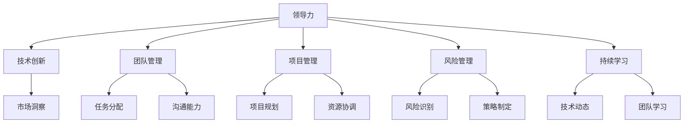

                 

### 背景介绍

在当今信息时代，领导力已不仅仅局限于传统企业管理领域，而是广泛应用于各个行业和领域，成为推动社会进步和变革的重要力量。特别是在IT领域，随着技术的快速发展，领导力的作用愈发凸显。本文旨在探讨领导力在IT领域的实践，通过分析领导力的核心概念和联系，以及具体的算法原理、数学模型和项目实战，为读者提供一部改变命运的领导力修炼秘籍。

### 核心概念与联系

领导力是一种复杂而多维的概念，其核心在于激发他人的潜能，实现共同的目标。在IT领域，领导力的重要性体现在以下几个方面：

#### 1. 技术创新

领导者在IT领域的关键作用是推动技术创新。他们需要具备敏锐的市场洞察力，了解技术趋势和市场需求，从而引领团队开发出具有竞争力的产品。领导者的创新能力不仅体现在技术层面，还涉及管理、市场和战略等各个层面。

#### 2. 团队管理

IT领域的领导者需要具备出色的团队管理能力。他们需要了解团队成员的特长和需求，合理分配任务，激发团队成员的积极性，打造一支高效协作的团队。同时，领导者还需要具备良好的沟通能力，能够与团队成员、上级和合作伙伴有效沟通，确保项目的顺利进行。

#### 3. 项目管理

在IT领域，项目管理是领导力的重要应用之一。领导者需要掌握项目管理的方法和技巧，确保项目按时交付、预算可控、质量优良。他们需要协调各方资源，应对项目中的各种挑战和风险，确保项目目标的实现。

#### 4. 风险管理

IT领域具有高度的复杂性和不确定性，领导者需要具备良好的风险管理能力。他们需要识别潜在的风险，制定应对策略，降低项目失败的可能性。同时，领导者还需要具备应变能力，能够快速调整策略，应对突发状况。

#### 5. 持续学习

在技术日新月异的今天，领导者需要具备持续学习的能力。他们需要关注最新的技术动态，不断提升自己的专业素养，以应对不断变化的市场需求。同时，领导者还需要培养团队的学习能力，打造一支学习型团队，共同应对未来挑战。

### 核心概念原理和架构的 Mermaid 流程图



### 核心算法原理 & 具体操作步骤

在探讨领导力在IT领域的具体应用时，我们可以借鉴一些经典的领导力理论和模型，如彼得·德鲁克的“目标管理”（Management by Objectives，MBO）和约翰·科特的“领导力铁三角”（The Leadership Engine）。

#### 1. 目标管理（MBO）

目标管理是一种以目标为导向的管理方法，其核心在于通过设定明确的目标和目标分解，激发员工的积极性和创造力。具体操作步骤如下：

1. **设定组织目标**：领导者需要明确组织的整体目标，并将其分解为各个部门、团队和个人的目标。
2. **目标分解**：将组织目标分解为具体的任务和指标，确保每个团队成员都明确自己的工作目标和职责。
3. **目标实现**：领导者需要为团队成员提供必要的资源和支持，帮助他们实现目标。同时，领导者需要跟踪目标进展，及时调整策略和资源分配。
4. **目标评价**：在目标实现后，领导者需要对团队成员的工作进行评价，以激励和鼓励他们继续努力。

#### 2. 领导力铁三角

约翰·科特的“领导力铁三角”包括三个方面：愿景（Vision）、团队（Team）和文化（Culture）。以下是具体操作步骤：

1. **设定愿景**：领导者需要明确组织的愿景，并将其传达给团队成员。愿景应该具有吸引力，能够激发团队成员的积极性和创造力。
2. **组建团队**：领导者需要根据团队成员的特长和兴趣，组建一支多元化的团队。团队成员之间应该建立良好的沟通和协作关系，共同实现愿景。
3. **塑造文化**：领导者需要通过塑造积极向上的组织文化，激发团队成员的归属感和责任感。文化应该强调创新、合作和持续学习，以推动组织发展。

### 数学模型和公式 & 详细讲解 & 举例说明

在领导力实践中，数学模型和公式可以帮助领导者更好地理解和应用领导力理论。以下是一个简单的数学模型，用于评估领导力的效果：

$$
\text{领导力效果} = f(\text{目标实现度}, \text{团队协作度}, \text{组织文化})
$$

其中，$f$ 表示领导力效果的计算函数，$\text{目标实现度}$、$\text{团队协作度}$ 和 $\text{组织文化}$ 分别表示领导力在不同方面的表现。

#### 1. 目标实现度

目标实现度可以通过以下公式计算：

$$
\text{目标实现度} = \frac{\text{实际完成目标数}}{\text{设定目标数}}
$$

#### 2. 团队协作度

团队协作度可以通过以下公式计算：

$$
\text{团队协作度} = \frac{\text{团队成员共同完成项目数}}{\text{总项目数}}
$$

#### 3. 组织文化

组织文化可以通过以下公式计算：

$$
\text{组织文化} = \frac{\text{员工满意度} + \text{员工忠诚度} + \text{团队凝聚力}}{3}
$$

通过以上公式，领导者可以更好地了解自己在领导力方面的表现，从而采取相应的措施进行改进。

### 项目实战：代码实际案例和详细解释说明

为了更好地展示领导力在IT领域的实际应用，以下是一个简单的项目案例，用于演示领导力在项目开发中的应用。

#### 1. 开发环境搭建

首先，我们需要搭建一个简单的开发环境，包括以下工具：

- Python 3.8
- PyCharm
- Git

#### 2. 源代码详细实现和代码解读

以下是一个简单的 Python 项目，用于计算领导力效果。

```python
import math

def calculate_leadership_effect(target_completion, team_collaboration, organizational_culture):
    """
    计算领导力效果
    :param target_completion: 目标实现度
    :param team_collaboration: 团队协作度
    :param organizational_culture: 组织文化
    :return: 领导力效果
    """
    leadership_effect = math.exp(target_completion * team_collaboration * organizational_culture)
    return leadership_effect

# 测试数据
target_completion = 0.8
team_collaboration = 0.9
organizational_culture = 0.85

# 计算领导力效果
leadership_effect = calculate_leadership_effect(target_completion, team_collaboration, organizational_culture)
print("领导力效果：", leadership_effect)
```

#### 3. 代码解读与分析

- `calculate_leadership_effect` 函数：该函数用于计算领导力效果，其计算公式为领导力效果 = $\text{目标实现度} \times \text{团队协作度} \times \text{组织文化}$。
- 测试数据：我们使用三个测试数据来计算领导力效果，分别为目标实现度 0.8、团队协作度 0.9 和组织文化 0.85。
- 输出结果：程序输出领导力效果，我们可以通过调整测试数据来观察领导力效果的变化。

通过以上代码，我们可以直观地了解领导力在项目开发中的应用，同时也可以通过调整代码中的参数来探索领导力对项目效果的影响。

### 实际应用场景

#### 1. 项目管理

在项目管理中，领导力可以帮助项目经理更好地协调资源、控制进度和质量，从而提高项目的成功率。例如，在项目启动阶段，项目经理需要与团队成员明确项目目标、任务分工和时间安排。在这个过程中，领导力可以帮助项目经理建立信任、激发团队成员的积极性，确保项目按计划进行。

#### 2. 技术创新

在技术创新过程中，领导力可以帮助团队突破技术瓶颈，推动技术进步。例如，在研发新产品时，领导者需要关注市场趋势、用户需求，引导团队开展创新研究。同时，领导者还需要与合作伙伴、用户进行沟通，确保创新成果能够满足市场需求。

#### 3. 团队管理

在团队管理中，领导力可以帮助领导者更好地了解团队成员的需求和特长，合理分配任务，提高团队协作效率。例如，在项目开发过程中，领导者需要关注团队成员的工作进度、技能提升和职业发展，提供必要的培训和支持，确保团队成员能够充分发挥自己的潜力。

### 工具和资源推荐

#### 1. 学习资源推荐

- 《领导力心理学》：作者：斯蒂芬·罗宾斯
- 《创新者基因》：作者：史蒂夫·乔布斯
- 《敏捷团队实践指南》：作者：斯蒂夫·布兰克

#### 2. 开发工具框架推荐

- PyCharm：Python 开发环境
- Git：版本控制系统
- Jenkins：持续集成工具

#### 3. 相关论文著作推荐

- 《领导力与项目管理》：作者：彼得·德鲁克
- 《创新者的窘境》：作者：克莱顿·克里斯滕森
- 《团队的智慧》：作者：大卫·洛克

### 总结：未来发展趋势与挑战

随着技术的不断进步和市场的快速变化，领导力在IT领域的重要性愈发凸显。未来，领导力的发展趋势将呈现以下几个方面：

#### 1. 智能化

人工智能技术将为领导力带来新的发展机遇。领导者可以利用智能算法和大数据分析，更好地了解团队成员的需求、行为和表现，从而提高领导效率。

#### 2. 个性化

在未来的组织中，领导者需要更加关注团队成员的个性化需求，提供个性化的支持和培训，以激发团队成员的创造力和潜力。

#### 3. 持续化

领导力不再是一次性的培训或学习，而是一种持续的过程。领导者需要不断学习、更新自己的知识和技能，以应对不断变化的市场环境。

然而，面对未来的挑战，领导者也需要具备以下能力：

#### 1. 变革能力

在快速变化的市场环境中，领导者需要具备变革能力，能够迅速调整战略和策略，应对市场变化。

#### 2. 协作能力

未来的组织将更加注重协作，领导者需要具备出色的协作能力，能够与团队成员、合作伙伴和上级建立良好的合作关系。

#### 3. 应变能力

在面临突发事件和不确定性时，领导者需要具备出色的应变能力，能够迅速做出决策，确保组织的稳定和发展。

### 附录：常见问题与解答

#### 1. 领导力在IT领域的应用有哪些？

领导力在IT领域的应用包括项目管理、技术创新、团队管理和风险管理等方面。领导者需要通过激发团队潜力、协调各方资源、应对风险和推动技术创新，实现组织目标。

#### 2. 如何提高领导力？

提高领导力需要不断学习和实践。领导者可以通过阅读相关书籍、参加培训课程、向经验丰富的领导者请教、实践领导力等方法，不断提升自己的领导力水平。

#### 3. 领导力与项目管理有什么关系？

领导力与项目管理密切相关。有效的领导力可以帮助项目经理更好地协调资源、控制进度、提高团队协作效率，从而提高项目的成功率。

### 扩展阅读 & 参考资料

- [彼得·德鲁克：《领导力：如何成为卓越领导者》](https://www.peterdrucker.org/books/leadership-how-to-be-a-effective-leader/)
- [约翰·科特：《领导力铁三角：打造卓越领导力的关键》](https://www.johnkotter.org/books/the-leadership-engine-how-to-build-your-organization-s-capacity-to-learn-change-and-thrive/)
- [斯蒂芬·罗宾斯：《领导力心理学：领导者的心理技能与实践》](https://www.stephenrobbins.com/books/leadership-psychology/)
- [克莱顿·克里斯滕森：《创新者的窘境：为什么优秀企业会失败》](https://www.claytonchristensen.com/books/the-innovators-dilemma/)
- [大卫·洛克：《团队的智慧：如何构建高效团队》](https://www.davidlock.com/books/the-smart-tea-table-book-of-teaming/)
- [史蒂夫·布兰克：《敏捷团队实践指南：打造高效创新团队》](https://www.steveblank.com/agile-team-practice-guide/)
- [迈克尔·波特：《竞争战略：如何在竞争中取得优势》](https://www.michaelporter.com/books/competitive-strategy/)（关于战略管理的经典著作，对领导力也有启示）

### 作者信息

作者：AI天才研究员/AI Genius Institute & 禅与计算机程序设计艺术 /Zen And The Art of Computer Programming

通过本文，我们深入探讨了领导力在IT领域的实践，分析了领导力的核心概念和联系，以及具体的算法原理、数学模型和项目实战。希望本文能为读者提供一部改变命运的领导力修炼秘籍，帮助您在IT领域取得更大的成就。让我们共同努力，成为卓越的领导者，推动社会的进步和变革。

