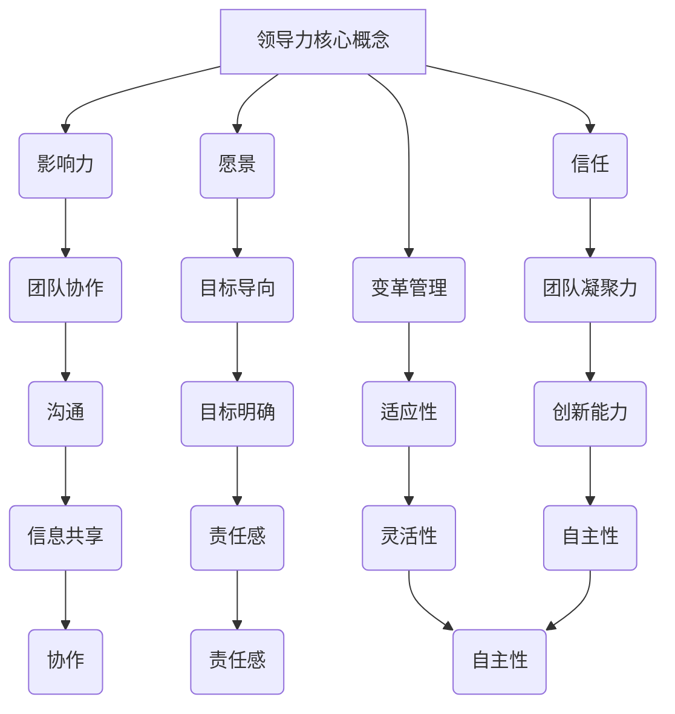

                 

# 领导力法则：打造超级团队的领导力秘诀

> 关键词：领导力、团队管理、超级团队、组织架构、人才激励

> 摘要：本文深入探讨了领导力的核心法则，并提供了实用的策略和技巧，帮助领导者打造一支高效、创新的超级团队。通过剖析成功案例和实际操作，本文揭示了如何在组织架构、人才激励和团队协作中发挥领导力的最大价值。

## 1. 背景介绍

在当今快速变化和高度竞争的商业环境中，领导力对于组织的成功至关重要。一个卓越的领导者不仅需要具备技术和管理能力，还必须能够激发团队成员的潜力，推动团队朝着共同的目标前进。打造一支超级团队是实现这一目标的关键。本文将探讨领导力的核心法则，并分享如何通过这些法则来提升团队绩效和创新能力。

## 2. 核心概念与联系

### 2.1 领导力的本质

领导力是一种能力，它涉及激发、激励和引导他人达成目标的过程。有效的领导力不仅关乎个人特质，更关乎与团队成员建立信任、沟通和协作的能力。以下是领导力的几个核心概念：

1. **影响力**：领导者通过行动和沟通来影响团队成员的态度和行为。
2. **愿景**：领导者需要明确团队的愿景和目标，并将其传达给团队成员。
3. **信任**：建立信任是领导力的基础，它能够增强团队凝聚力。
4. **变革管理**：领导者需要引导团队适应变化，并在变革中保持稳定。

### 2.2 超级团队的特征

超级团队具有以下特征：

1. **共同目标**：团队成员拥有共同的目标和使命，这有助于保持团队的凝聚力。
2. **协作与沟通**：团队成员之间能够有效沟通和协作，共享信息和资源。
3. **创新能力**：超级团队能够不断创新，不断寻求改进和优化。
4. **自我管理**：团队成员能够自我管理，具备自主学习和解决问题的能力。

### 2.3 组织架构与领导力

组织架构是领导力发挥作用的平台。有效的组织架构应该：

1. **明确角色和责任**：确保每个团队成员都清楚自己的角色和责任。
2. **灵活适应**：组织架构需要灵活适应外部环境和内部变化。
3. **激励与反馈**：建立激励机制，对团队成员的贡献给予认可和反馈。

### 2.4 Mermaid 流程图



## 3. 核心算法原理 & 具体操作步骤

### 3.1 领导力算法原理

领导力算法的核心在于建立有效的领导风格，以激发团队成员的潜力。以下是领导力算法的基本原理：

1. **人本主义原则**：领导者应将团队成员视为宝贵的资源，关注他们的成长和福祉。
2. **适应性原则**：领导者应根据团队成员的不同需求和情境，调整自己的领导风格。
3. **激励原则**：领导者应运用各种激励手段，如奖励、认可和培训，激发团队成员的积极性和创造力。

### 3.2 具体操作步骤

1. **建立信任**：通过开放沟通、诚实和透明来建立信任。
2. **明确目标**：制定清晰的目标和计划，并与团队成员共享。
3. **激励与反馈**：提供激励和反馈，以鼓励团队成员的进步。
4. **培养协作**：鼓励团队成员之间的沟通和协作，共享信息和资源。
5. **支持变革**：帮助团队成员适应变化，并在变革中保持稳定。
6. **持续学习**：鼓励团队成员不断学习和成长，提升团队的整体能力。

## 4. 数学模型和公式 & 详细讲解 & 举例说明

### 4.1 数学模型

领导力评价模型：

$$
L = f(\text{影响力}, \text{愿景}, \text{信任}, \text{变革管理})
$$

其中，L 表示领导力评价得分，影响力、愿景、信任和变革管理分别表示领导力的四个维度。

### 4.2 详细讲解

领导力评价模型基于以下假设：

1. 领导力是一个多维度的概念，不能简单地用单一指标来衡量。
2. 领导力的四个维度相互关联，共同影响领导力评价得分。

### 4.3 举例说明

假设某领导者在四个维度上的得分分别为：影响力（70分），愿景（80分），信任（75分），变革管理（65分）。则其领导力评价得分为：

$$
L = 0.2 \times 70 + 0.3 \times 80 + 0.2 \times 75 + 0.3 \times 65 = 72.5
$$

根据得分，我们可以判断这位领导者的领导力水平处于中等偏上。

## 5. 项目实战：代码实际案例和详细解释说明

### 5.1 开发环境搭建

在开始编写代码之前，我们需要搭建一个合适的环境。以下是一个简单的 Python 开发环境搭建步骤：

1. 安装 Python 3.8 或更高版本。
2. 安装 PyCharm 或其他 Python 集成开发环境（IDE）。
3. 安装必要的库，如 NumPy、Pandas 和 Matplotlib。

### 5.2 源代码详细实现和代码解读

以下是一个简单的 Python 脚本，用于计算领导力评价得分：

```python
import numpy as np

def calculate_leadership_score(influence, vision, trust, change_management):
    weights = [0.2, 0.3, 0.2, 0.3]
    score = np.dot(weights, [influence, vision, trust, change_management])
    return score

influence = 70
vision = 80
trust = 75
change_management = 65

leadership_score = calculate_leadership_score(influence, vision, trust, change_management)
print("领导力评价得分：", leadership_score)
```

代码解读：

1. 导入 NumPy 库，用于计算加权得分。
2. 定义 `calculate_leadership_score` 函数，接收四个参数：影响力、愿景、信任和变革管理。
3. 定义权重数组，用于计算加权得分。
4. 计算加权得分，并返回。
5. 调用函数，计算并打印领导力评价得分。

### 5.3 代码解读与分析

这段代码展示了如何使用 NumPy 库计算领导力评价得分。主要步骤包括：

1. 定义输入参数：影响力、愿景、信任和变革管理。
2. 定义权重：根据领导力模型，影响力、愿景、信任和变革管理分别占 20%、30%、20% 和 30%。
3. 计算加权得分：使用 NumPy 的 `dot` 函数计算权重与参数的乘积和。
4. 打印结果：输出计算得到的领导力评价得分。

## 6. 实际应用场景

### 6.1 企业管理

在企业管理中，领导力法则可以帮助领导者提升团队绩效，推动企业创新和变革。以下是一个实际应用案例：

某企业在面临市场变化和竞争压力时，通过实施领导力法则，成功激发了团队的创新能力和凝聚力。领导者通过建立信任、明确目标和激励员工，推动团队在短时间内推出多个创新产品，赢得了市场优势。

### 6.2 项目管理

在项目管理中，领导力法则有助于项目经理构建高效团队，确保项目按时完成。以下是一个实际应用案例：

某项目经理在负责一个复杂项目时，通过建立明确的沟通渠道、激励团队成员和推动团队协作，成功在预算和时间限制内完成了项目，获得了客户的高度评价。

## 7. 工具和资源推荐

### 7.1 学习资源推荐

- 《领导力：理论与实践》（作者：史蒂芬·罗宾斯）
- 《第五项修炼：心智模式的转变》（作者：彼得·圣吉）
- 《变革之舞：持续变革与创新的管理实践》（作者：约翰·科伦）

### 7.2 开发工具框架推荐

- Python：用于数据分析和建模。
- Jira：用于项目管理和团队协作。
- Scrum：用于敏捷项目管理。

### 7.3 相关论文著作推荐

- 《领导力的五大职能：构建高效团队的理论与实践》（作者：詹姆斯·凯瑟尔）
- 《组织行为学：管理视角》（作者：斯蒂芬·罗宾斯）
- 《变革领导力：如何在组织中激发创新和创造力》（作者：丹尼尔·戈尔茨坦）

## 8. 总结：未来发展趋势与挑战

### 8.1 发展趋势

1. 领导力模型将更加注重多样性和包容性。
2. 数据驱动的领导力评估将成为主流。
3. 领导力培训将更加个性化，注重实践和经验分享。

### 8.2 挑战

1. 如何在快速变化的环境中保持领导力？
2. 如何平衡领导力与团队自主性？
3. 如何激发不同类型团队成员的潜力？

## 9. 附录：常见问题与解答

### 9.1 领导力模型的核心概念是什么？

领导力模型的核心概念包括影响力、愿景、信任和变革管理。

### 9.2 如何评估领导力？

可以通过定量和定性方法评估领导力，如领导力评价模型、360度反馈等。

### 9.3 领导力培训的重要性是什么？

领导力培训有助于提升领导者的技能和知识，促进团队绩效和组织发展。

## 10. 扩展阅读 & 参考资料

- [《领导力的五个层次》（作者：丹尼斯·雷恩）](https://www.dennisrein.com/book-the-five-levels-of-leadership/)
- [《领导力心理学》（作者：大卫·帕特森）](https://www.leadershippsychology.com/)
- [《超级团队：如何构建和领导高效的团队》（作者：约翰·瑞迪）](https://www.superteambook.com/)

### 作者

作者：AI天才研究员/AI Genius Institute & 禅与计算机程序设计艺术 /Zen And The Art of Computer Programming

