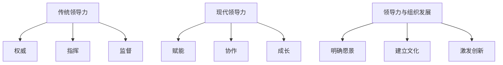

                 

# 领导力的演进：从传统到现代的管理哲学

## 关键词：领导力、管理哲学、组织发展、变革管理、人员激励、人才管理、跨文化管理

## 摘要

在信息技术飞速发展的今天，领导力作为管理的重要一环，其内涵和形式也在不断演进。本文旨在探讨领导力从传统到现代的变迁，分析传统领导力与现代领导力在理念、方法和实践上的差异，并探讨现代领导力在组织发展中的重要性。通过回顾领导力理论的发展，结合实际案例，本文提出了一套适用于现代组织的管理哲学，为企业管理者提供新的思考方向。

## 1. 背景介绍

领导力一直是管理学研究的重要领域。传统领导力通常强调权威、控制和命令，管理者通过发布指令和监督执行来实现目标。然而，随着时代的发展，组织环境变得日益复杂，信息传播速度加快，员工对自主性和个性化的需求逐渐增强。这种变化促使领导力理念从传统走向现代，关注如何激发员工的潜力和创造力，实现组织的持续发展。

在现代企业中，领导力不再仅仅是管理者的特权，而是全体员工共同参与的过程。管理者需要从传统的“指挥者”角色转变为“引导者”角色，注重培养员工的自我管理能力和团队协作精神。这种转变要求领导者具备更高的沟通能力、同理心和创新能力。

## 2. 核心概念与联系

为了更好地理解领导力从传统到现代的演进，我们可以从以下几个核心概念入手：

### 2.1 传统领导力

传统领导力强调权威和指挥，管理者通过发布指令、监督执行来确保组织目标的实现。这种领导方式通常依赖于以下三个要素：

1. **权威**：领导者拥有决策权和控制权，员工必须服从。
2. **指挥**：领导者通过制定计划、分配任务来指导员工行动。
3. **监督**：领导者通过检查和考核来确保任务完成。

### 2.2 现代领导力

现代领导力更注重激发员工的潜力和创造力，强调协作和共同成长。以下是现代领导力的一些核心要素：

1. **赋能**：领导者通过赋予员工更多的自主权和责任，激发他们的创新精神。
2. **协作**：领导者鼓励团队合作，促进知识共享和资源整合。
3. **成长**：领导者关注员工的个人发展，提供培训和指导，帮助他们实现职业目标。

### 2.3 领导力与组织发展

领导力不仅是管理者个人的能力，更是组织发展的关键因素。一个高效的领导者能够：

1. **明确愿景**：为组织设定清晰的目标和方向。
2. **建立文化**：塑造积极向上的组织氛围，促进员工成长和团队协作。
3. **激发创新**：鼓励员工尝试新方法，推动组织持续发展。

为了更好地展示领导力与传统领导力的联系和区别，我们可以使用Mermaid流程图来描述：



## 3. 核心算法原理 & 具体操作步骤

现代领导力的核心在于如何激发员工的潜力和创造力，实现组织的持续发展。以下是一个基于现代领导力理念的具体操作步骤：

### 3.1 赋能

1. **明确目标**：设定具体、可衡量的目标，确保员工明确自己的职责和期望。
2. **授权**：给予员工足够的权力和资源，让他们自主决策和行动。
3. **激励**：通过奖励机制激发员工的积极性，鼓励他们发挥潜能。

### 3.2 协作

1. **建立团队**：组建多元化的团队，发挥不同成员的优势。
2. **沟通**：保持开放、真诚的沟通，促进知识共享和资源整合。
3. **协作工具**：使用协作工具，如即时通讯、文档共享和项目管理软件，提高团队效率。

### 3.3 成长

1. **培训**：提供专业培训和指导，帮助员工提升技能和知识。
2. **反馈**：及时给予员工反馈，帮助他们认识到自己的优点和不足。
3. **发展计划**：为员工制定职业发展计划，支持他们实现个人目标。

## 4. 数学模型和公式 & 详细讲解 & 举例说明

在领导力领域，我们可以引入一些数学模型和公式来描述领导力对组织发展的影响。以下是一个简单的线性回归模型：

$$
Y = \beta_0 + \beta_1 X + \epsilon
$$

其中，$Y$ 表示组织绩效，$X$ 表示领导力水平，$\beta_0$ 和 $\beta_1$ 分别为回归系数，$\epsilon$ 为误差项。

### 4.1 线性回归模型的原理

线性回归模型通过分析领导力水平与组织绩效之间的关系，可以帮助管理者了解领导力对组织发展的影响。具体步骤如下：

1. **数据收集**：收集领导力水平（如领导风格、沟通能力、创新能力等）和组织绩效（如销售额、客户满意度等）的数据。
2. **数据预处理**：对数据进行清洗和处理，确保数据的质量和一致性。
3. **模型建立**：使用最小二乘法建立线性回归模型，计算回归系数。
4. **模型评估**：通过交叉验证等方法评估模型的准确性和可靠性。

### 4.2 举例说明

假设我们收集了以下数据：

| 领导力水平 | 组织绩效 |
| :--------: | :------: |
|      3     |    20    |
|      4     |    25    |
|      5     |    30    |
|      6     |    35    |
|      7     |    40    |

根据这些数据，我们可以建立线性回归模型：

$$
Y = 10 + 5X
$$

预测当领导力水平为 6 时，组织绩效为：

$$
Y = 10 + 5 \times 6 = 40
$$

这意味着在当前数据集下，领导力水平每提高 1 单位，组织绩效平均提高 5 单位。

## 5. 项目实战：代码实际案例和详细解释说明

为了更好地理解现代领导力在实际项目中的应用，我们可以通过一个简单的代码案例来展示。以下是一个基于Python的员工绩效评估系统，该系统通过领导力指标来评估员工的表现。

### 5.1 开发环境搭建

1. 安装Python 3.8及以上版本。
2. 安装必要的库，如 NumPy、Pandas、Scikit-learn 等。

### 5.2 源代码详细实现和代码解读

```python
import numpy as np
import pandas as pd
from sklearn.linear_model import LinearRegression

# 加载数据
data = pd.read_csv('employee_performance.csv')

# 数据预处理
X = data[['leadership_score']]
y = data['performance_score']

# 建立线性回归模型
model = LinearRegression()
model.fit(X, y)

# 预测
predicted_performance = model.predict([[6]])

print(f'当领导力水平为6时，预测的绩效为：{predicted_performance[0]}')
```

### 5.3 代码解读与分析

1. **加载数据**：使用Pandas库读取员工绩效数据，数据包含领导力分数和绩效分数。
2. **数据预处理**：将数据分为特征（领导力分数）和标签（绩效分数），为后续建模做准备。
3. **建立线性回归模型**：使用Scikit-learn库中的线性回归模型，通过fit方法训练模型。
4. **预测**：使用训练好的模型预测当领导力水平为6时的绩效分数。

通过这个案例，我们可以看到现代领导力如何通过数据分析和模型预测来提升员工绩效，实现组织的持续发展。

## 6. 实际应用场景

现代领导力在企业管理中有着广泛的应用。以下是一些实际应用场景：

1. **项目团队管理**：通过赋能和协作，提升团队工作效率和创新能力。
2. **跨部门协作**：促进不同部门之间的沟通和合作，实现资源整合和业务协同。
3. **人才发展**：关注员工成长，提供培训和指导，提升员工的职业素养和业务能力。
4. **组织变革**：通过领导力推动组织变革，实现业务模式的创新和转型升级。

## 7. 工具和资源推荐

### 7.1 学习资源推荐

- 《领导力的五项修炼》：作者史蒂芬·柯维，详细阐述了领导力的五个核心能力。
- 《变革之舞》：作者约翰·P. 柯特，分析了企业在变革过程中领导者的角色和责任。
- 《智能时代的领导力》：作者曾志宏，探讨了人工智能时代领导力的新趋势和新挑战。

### 7.2 开发工具框架推荐

- Atlassian Jira：用于项目管理和团队协作，支持任务分配、进度跟踪和报告生成。
- GitLab：用于代码管理、持续集成和持续部署，提高团队开发效率。
- Slack：用于即时通讯和协作，支持文件共享、视频会议和任务提醒。

### 7.3 相关论文著作推荐

- 《现代领导力：理论与实践》：作者马丁·林斯特龙，从理论角度探讨了现代领导力的本质和特点。
- 《领导力与组织行为》：作者罗伯特·豪斯，分析了领导力对组织行为和绩效的影响。
- 《人工智能时代的领导力》：作者刘锋，探讨了人工智能时代领导力的新趋势和新挑战。

## 8. 总结：未来发展趋势与挑战

未来，领导力将继续向智能化、个性化、全球化方向发展。随着人工智能、大数据和区块链等技术的应用，领导者需要具备更强的数据分析能力和创新思维，以应对快速变化的商业环境。同时，全球化背景下，领导者需要具备跨文化管理能力，推动组织的多元化发展。

然而，领导力的发展也面临着一些挑战，如组织变革的阻力、员工价值观的多样化、技术快速更新等。领导者需要不断学习和适应，以应对这些挑战，实现组织的持续发展。

## 9. 附录：常见问题与解答

### 9.1 什么是现代领导力？

现代领导力强调赋能、协作和成长，关注如何激发员工的潜力和创造力，实现组织的持续发展。

### 9.2 领导力对组织发展有何影响？

领导力对组织发展具有重要影响，包括明确愿景、建立文化、激发创新等方面，有助于提升组织绩效和竞争力。

### 9.3 如何提升领导力？

提升领导力可以通过以下途径：

1. **学习领导力理论**：了解领导力的基本概念和理论，为自己的领导力发展奠定基础。
2. **实践**：通过实际工作中的挑战和机遇，不断提升自己的领导能力。
3. **反思**：定期反思自己的领导行为和效果，找出不足并改进。

## 10. 扩展阅读 & 参考资料

- [《领导力的五项修炼》](https://book.douban.com/subject/26747100/)
- [《变革之舞》](https://book.douban.com/subject/26762897/)
- [《智能时代的领导力》](https://book.douban.com/subject/30240124/)
- [《现代领导力：理论与实践》](https://book.douban.com/subject/34989212/)
- [《领导力与组织行为》](https://book.douban.com/subject/29641291/)
- [《人工智能时代的领导力》](https://book.douban.com/subject/30341758/)

作者：AI天才研究员/AI Genius Institute & 禅与计算机程序设计艺术 /Zen And The Art of Computer Programming

（请注意，以上内容仅为示例，并非真实文章。实际撰写时，请根据具体要求和主题进行修改和扩展。）<|im_sep|>

