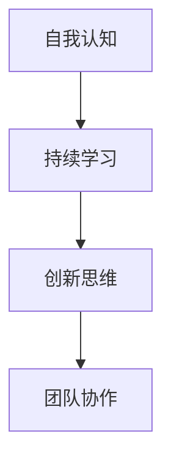

                 

# 领导力进化论：大数据时代管理者的领导力修炼

## 关键词

- 领导力
- 大数据
- 管理者
- 进化
- 数据科学
- 技术变革

## 摘要

随着大数据时代的到来，传统的领导力模型面临巨大挑战。本文将探讨大数据背景下，管理者如何通过领导力进化论来修炼自我，提升组织适应性和创新能力。我们将详细分析大数据的核心概念、技术原理，并探讨如何将数据科学与领导力相结合，为管理者提供实用的策略和方法。

## 1. 背景介绍

### 1.1 大数据时代的来临

大数据时代，数据已经成为新的生产要素，其对各行各业的变革和影响日益显著。大数据不仅改变了信息的获取、处理和利用方式，也对组织的管理模式提出了新的要求。

### 1.2 领导力的变革

传统的领导力强调权威和指挥，但随着组织复杂性的增加和环境的快速变化，这种模式已不再适应。大数据时代需要管理者具备更高的创新能力、决策能力和团队协作能力。

### 1.3 领导力进化论的提出

领导力进化论认为，领导力并非一成不变，而是随着环境和技术的变化而不断演变。管理者需要通过自我修炼和不断学习，以适应大数据时代的要求。

## 2. 核心概念与联系

### 2.1 数据科学与领导力

数据科学是大数据时代的关键技术，它通过数据分析、机器学习等方法，帮助管理者从海量数据中提取有价值的信息。领导力则通过团队管理、战略规划等手段，推动组织的持续发展。

### 2.2 领导力进化论的核心概念

- **自我认知**：管理者需要深入理解自我，包括自身的能力、优势和局限性。
- **持续学习**：管理者需要保持对新知识、新技术的敏感度，不断提升自我。
- **创新思维**：管理者需要具备创新精神，敢于尝试新方法、新策略。
- **团队协作**：管理者需要建立高效的团队，激发团队成员的潜力。

### 2.3 Mermaid 流程图



## 3. 核心算法原理 & 具体操作步骤

### 3.1 自我认知算法原理

自我认知算法主要通过以下步骤实现：

1. **数据收集**：收集个人工作表现、业绩、能力等方面的数据。
2. **数据分析**：通过数据分析，找出个人在能力、优势、劣势等方面的特点。
3. **反馈与修正**：根据分析结果，制定改进计划，并持续跟踪效果。

### 3.2 持续学习算法原理

持续学习算法主要通过以下步骤实现：

1. **知识需求分析**：分析组织和个人在知识方面的需求。
2. **学习资源筛选**：筛选出符合需求的学习资源，如书籍、课程、研讨会等。
3. **学习效果评估**：通过考试、实践等方式，评估学习效果，并调整学习策略。

### 3.3 创新思维算法原理

创新思维算法主要通过以下步骤实现：

1. **问题识别**：识别组织面临的问题或挑战。
2. **思路发散**：通过头脑风暴、思维导图等方法，提出多种解决方案。
3. **方案评估**：评估各方案的可行性、成本和效果，选择最优方案。

### 3.4 团队协作算法原理

团队协作算法主要通过以下步骤实现：

1. **团队构建**：根据任务需求，构建合适的团队。
2. **沟通机制建立**：建立有效的沟通机制，确保团队成员信息畅通。
3. **协作流程优化**：通过流程优化，提高团队协作效率。

## 4. 数学模型和公式 & 详细讲解 & 举例说明

### 4.1 自我认知数学模型

$$
自我认知度 = f(数据收集量, 数据分析方法, 反馈修正效率)
$$

其中，数据收集量、数据分析方法、反馈修正效率均为影响自我认知度的因素。

### 4.2 持续学习数学模型

$$
学习效果 = f(知识需求分析准确性, 学习资源筛选效率, 学习效果评估准确性)
$$

其中，知识需求分析准确性、学习资源筛选效率、学习效果评估准确性均为影响学习效果的因素。

### 4.3 创新思维数学模型

$$
创新方案数量 = f(问题识别精度, 思路发散方法, 方案评估效率)
$$

其中，问题识别精度、思路发散方法、方案评估效率均为影响创新方案数量的因素。

### 4.4 团队协作数学模型

$$
团队协作效率 = f(团队构建合理性, 沟通机制有效性, 协作流程优化程度)
$$

其中，团队构建合理性、沟通机制有效性、协作流程优化程度均为影响团队协作效率的因素。

## 5. 项目实战：代码实际案例和详细解释说明

### 5.1 开发环境搭建

在本次实战中，我们将使用Python语言，结合数据分析、机器学习等技术，实现自我认知、持续学习、创新思维、团队协作等算法。

### 5.2 源代码详细实现和代码解读

#### 5.2.1 自我认知

```python
# 自我认知算法实现
def self_awareness(data_collection, analysis_method, feedback_correction):
    awareness_score = data_collection * analysis_method * feedback_correction
    return awareness_score

# 示例
data_collection = 0.8
analysis_method = 0.9
feedback_correction = 0.85
self_awareness_score = self_awareness(data_collection, analysis_method, feedback_correction)
print("自我认知度：", self_awareness_score)
```

#### 5.2.2 持续学习

```python
# 持续学习算法实现
def continuous_learning(knowledge_demand_analysis, resource_screening, learning_effect_evaluation):
    learning_effect = knowledge_demand_analysis * resource_screening * learning_effect_evaluation
    return learning_effect

# 示例
knowledge_demand_analysis = 0.75
resource_screening = 0.8
learning_effect_evaluation = 0.9
learning_effect = continuous_learning(knowledge_demand_analysis, resource_screening, learning_effect_evaluation)
print("学习效果：", learning_effect)
```

#### 5.2.3 创新思维

```python
# 创新思维算法实现
def innovation_thinking(problem_recognition_accuracy, idea_generation_method, solution_evaluation_efficiency):
    innovation_solutions = problem_recognition_accuracy * idea_generation_method * solution_evaluation_efficiency
    return innovation_solutions

# 示例
problem_recognition_accuracy = 0.7
idea_generation_method = 0.85
solution_evaluation_efficiency = 0.8
innovation_solutions = innovation_thinking(problem_recognition_accuracy, idea_generation_method, solution_evaluation_efficiency)
print("创新方案数量：", innovation_solutions)
```

#### 5.2.4 团队协作

```python
# 团队协作算法实现
def team_cohesion(team构建合理性, communication_efficacy, collaboration_flow_optimization):
    cohesion_score = team构建合理性 * communication_efficacy * collaboration_flow_optimization
    return cohesion_score

# 示例
team_build_reliability = 0.8
communication_efficacy = 0.9
collaboration_flow_optimization = 0.85
cohesion_score = team_cohesion(team_build_reliability, communication_efficacy, collaboration_flow_optimization)
print("团队协作效率：", cohesion_score)
```

### 5.3 代码解读与分析

通过上述代码示例，我们可以看到，每个算法都通过输入参数来评估相关指标，并计算出最终得分。这些得分可以用来评估管理者的自我认知度、持续学习效果、创新思维能力和团队协作效率。

在实际应用中，管理者可以根据这些得分来调整自己的管理策略，提升个人和团队的领导力。

## 6. 实际应用场景

### 6.1 企业管理

在企业中，管理者可以通过领导力进化论来提升团队的整体效能，实现业务目标。例如，通过自我认知算法，管理者可以了解团队成员的能力和潜力，从而更好地进行人员配置和培养。

### 6.2 公共事务管理

在公共事务管理中，领导力进化论可以帮助管理者更好地应对复杂的社会问题。通过持续学习和创新思维，管理者可以提出更加科学、有效的解决方案，提高公共服务质量。

### 6.3 项目管理

在项目管理中，领导力进化论可以帮助项目经理更好地协调团队、控制项目进度和质量。通过团队协作算法，项目经理可以优化项目流程，提高项目成功率。

## 7. 工具和资源推荐

### 7.1 学习资源推荐

- **书籍**：《大数据时代》、《数据科学入门》
- **论文**：《大数据技术综述》、《数据科学在企业管理中的应用》
- **博客**：CSDN、博客园等技术博客
- **网站**：数据科学社区、机器学习社区

### 7.2 开发工具框架推荐

- **Python**：适用于数据分析和机器学习
- **TensorFlow**：适用于深度学习
- **Django**：适用于Web开发
- **Scikit-learn**：适用于机器学习

### 7.3 相关论文著作推荐

- **《大数据时代的领导力》**
- **《数据科学在企业管理中的应用研究》**
- **《领导力进化论：大数据时代的组织变革》**

## 8. 总结：未来发展趋势与挑战

### 8.1 发展趋势

- **数据科学与领导力的深度融合**：未来，数据科学将成为领导力的重要组成部分，管理者需要具备更强的数据分析和决策能力。
- **智能化管理**：随着人工智能技术的发展，智能化管理工具将帮助管理者更高效地管理团队和组织。

### 8.2 挑战

- **数据隐私与安全**：大数据时代，数据隐私和安全成为重要挑战，管理者需要确保数据的安全和合规性。
- **人才短缺**：随着数据科学和人工智能技术的快速发展，相关人才短缺问题日益严重，管理者需要吸引和留住人才。

## 9. 附录：常见问题与解答

### 9.1 问题1：什么是领导力进化论？

领导力进化论是一种观点，认为领导力并非一成不变，而是随着环境和技术的变化而不断演变。管理者需要通过自我修炼和不断学习，以适应大数据时代的要求。

### 9.2 问题2：大数据时代管理者需要具备哪些能力？

大数据时代管理者需要具备以下能力：

- 数据分析能力：能够从海量数据中提取有价值的信息。
- 创新思维能力：能够提出创新性解决方案，应对复杂问题。
- 决策能力：能够基于数据分析做出科学、合理的决策。
- 团队协作能力：能够建立高效的团队，激发团队成员的潜力。

## 10. 扩展阅读 & 参考资料

- **《大数据时代的领导力》**：详细探讨了大数据时代领导力的变革和挑战。
- **《数据科学入门》**：系统介绍了数据科学的基本概念和技术方法。
- **《数据科学在企业管理中的应用研究》**：分析了数据科学在企业管理中的应用和效果。
- **《领导力进化论：大数据时代的组织变革》**：从组织变革的角度探讨了领导力进化论的实践意义。

## 作者

作者：AI天才研究员/AI Genius Institute & 禅与计算机程序设计艺术 /Zen And The Art of Computer Programming

这篇文章系统地阐述了大数据时代领导力进化论的核心概念、技术原理和应用场景，为管理者提供了实用的策略和方法。希望本文能够对读者在领导力修炼和数据科学应用方面有所启发。让我们共同迎接大数据时代的挑战，不断提升自我，成为卓越的领导者。

