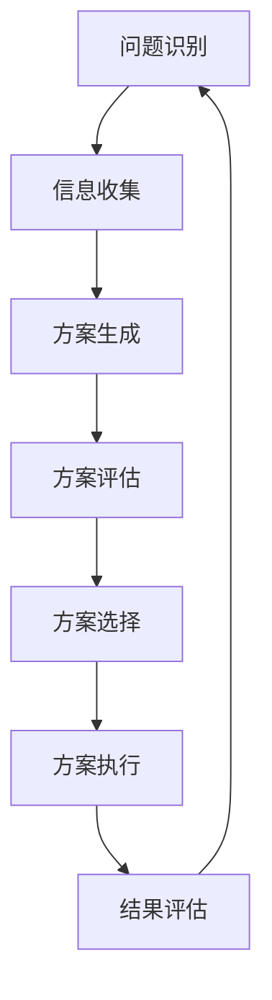

                 

# 领导者的决策技巧：如何做出正确选择

> **关键词：** 决策技巧、领导者、正确选择、思维模型、工具与方法

> **摘要：** 本文将深入探讨领导者如何通过科学的方法和技巧，做出正确且有效的决策。通过阐述决策的核心概念、分析决策过程中的常见误区，以及提供实用的决策工具和技巧，帮助领导者提升决策质量，提高领导力和团队效率。

## 1. 背景介绍

在快速变化的时代，领导者面临的挑战越来越多，需要做出高质量决策的机会也日益增多。无论是企业战略规划、项目决策，还是日常管理决策，领导者都需要具备出色的决策能力。然而，决策并不总是一件容易的事情。根据研究，人类大脑在处理复杂决策时，往往会受到多种心理偏差的影响，导致决策偏差。此外，信息过载、时间压力和认知局限等因素，也会影响领导者的决策效果。

本文旨在通过分析决策的核心概念，探讨领导者如何利用科学的方法和技巧，克服心理偏差，做出更加理性、合理的决策。文章将涵盖以下内容：

- 决策的核心概念与联系
- 决策过程中的常见误区
- 决策工具与方法
- 项目实战：代码实际案例
- 实际应用场景
- 工具和资源推荐
- 未来发展趋势与挑战
- 常见问题与解答

通过这些内容的深入探讨，希望能够为领导者提供实用的决策指导，帮助他们做出更加明智、有效的决策。

## 2. 核心概念与联系

在探讨决策之前，我们需要先了解一些核心概念，以便更好地理解决策的本质。以下是几个关键概念：

### 2.1 决策类型

决策可以分为两类：程序性决策（Procedural Decision Making）和非程序性决策（Non-procedural Decision Making）。

- **程序性决策**：针对常规、重复性问题进行的决策。例如，每天早上决定穿什么衣服。
- **非程序性决策**：处理复杂、新颖问题时的决策。例如，决定公司是否进入一个新的市场。

### 2.2 决策过程

决策过程通常包括以下几个阶段：

1. **问题识别（Problem Recognition）**：识别需要解决的问题。
2. **信息收集（Information Gathering）**：收集与问题相关的信息。
3. **方案生成（Alternative Generation）**：提出解决问题的各种方案。
4. **方案评估（Option Evaluation）**：评估每个方案的优缺点。
5. **方案选择（Decision Making）**：从所有方案中选择最佳方案。
6. **方案执行（Decision Implementation）**：实施决策方案。
7. **结果评估（Post-decision Analysis）**：评估决策结果，为未来决策提供反馈。

### 2.3 决策风格

决策风格是指领导者处理决策时的行为模式。常见的决策风格包括：

- **独裁型（Autocratic）**：领导者独自做出决策，不征求他人意见。
- **民主型（Democratic）**：领导者征求团队成员的意见，共同做出决策。
- **参与型（Participative）**：领导者鼓励团队成员参与决策过程，共同制定决策。
- **自由放任型（Laissez-faire）**：领导者不干预决策过程，由团队成员自主决定。

### 2.4 决策模型

决策模型是指用于指导决策过程的框架或方法。以下是几种常见的决策模型：

- **理性模型（Rational Model）**：假设决策者在信息完全、无风险的情况下做出最优决策。
- **有限理性模型（Bounded Rationality Model）**：考虑决策者在信息不完全、认知有限的情况下的决策过程。
- **情景分析模型（Scenario Analysis Model）**：通过构建不同的情景，分析每种情景下的决策结果。
- **决策树模型（Decision Tree Model）**：通过树形结构展示不同决策路径和结果。

### 2.5 决策心理学

心理学研究揭示，人类在决策过程中容易受到多种心理偏差的影响。以下是几种常见的心理偏差：

- **确认偏差（Confirmation Bias）**：倾向于接受支持已有观点的信息，忽视反对信息。
- **锚定效应（Anchoring Effect）**：依赖最初接收到的信息，对其后的判断产生较大影响。
- **过度自信（Overconfidence）**：高估自己的判断能力和决策质量。
- **代表性偏差（Representativeness Heuristic）**：根据事物的表面特征，判断其概率或相似性。

了解这些核心概念，有助于我们更好地理解决策的本质，为后续的决策技巧讨论提供基础。

### 2.6 决策的核心概念原理和架构的 Mermaid 流程图



### 3. 核心算法原理 & 具体操作步骤

#### 3.1 决策算法的基本原理

决策算法旨在帮助领导者优化决策过程，提高决策质量。以下是一种常用的决策算法——多目标决策分析（Multi-Objective Decision Analysis, MODA）。

**多目标决策分析（MODA）**：

- **目标定义（Objective Definition）**：明确决策需要实现的目标，并确定每个目标的权重。
- **方案评估（Alternative Evaluation）**：对每个方案进行评估，计算每个方案在不同目标上的得分。
- **结果分析（Result Analysis）**：根据评估结果，找出最优方案或最佳方案组合。

#### 3.2 MODA算法的具体操作步骤

1. **定义目标**：明确决策需要实现的目标，例如成本、质量、时间等。为每个目标分配权重，权重总和为1。

    ```plaintext
    目标1（成本）：权重0.3
    目标2（质量）：权重0.4
    目标3（时间）：权重0.3
    ```

2. **生成方案**：根据决策问题，生成多个可能的解决方案。

    ```plaintext
    方案1：
    - 成本：1000
    - 质量：90
    - 时间：10

    方案2：
    - 成本：1500
    - 质量：95
    - 时间：12

    方案3：
    - 成本：800
    - 质量：85
    - 时间：8
    ```

3. **评估方案**：对每个方案在不同目标上的得分进行计算。使用线性加权方法，将每个目标的得分乘以相应权重，再求和。

    ```plaintext
    方案1得分 = 0.3 * 1000 + 0.4 * 90 + 0.3 * 10 = 330
    方案2得分 = 0.3 * 1500 + 0.4 * 95 + 0.3 * 12 = 360.6
    方案3得分 = 0.3 * 800 + 0.4 * 85 + 0.3 * 8 = 298
    ```

4. **分析结果**：根据评估结果，找出最优方案或最佳方案组合。如果需要，可以进一步进行敏感性分析，以确定决策的稳定性。

    ```plaintext
    最优方案：方案2
    ```

### 4. 数学模型和公式 & 详细讲解 & 举例说明

在多目标决策分析（MODA）中，常用的评估方法是线性加权评分法。以下是线性加权评分法的数学模型和公式：

**线性加权评分法**：

$$
\text{方案得分} = \sum_{i=1}^{n} w_i \times s_i
$$

其中，$w_i$ 表示第 $i$ 个目标的权重，$s_i$ 表示第 $i$ 个方案在第 $i$ 个目标上的得分。

#### 4.1 详细讲解

1. **目标权重分配**：

   在进行多目标决策时，首先需要明确决策需要实现的目标，并确定每个目标的权重。权重分配要依据实际情况和目标的重要性来设定。例如，在评估一个新产品的上市方案时，成本、市场接受度和时间可能是三个主要目标。可以设定以下权重：

   $$ 
   w_1 = 0.4, \quad w_2 = 0.3, \quad w_3 = 0.3
   $$

2. **方案评估**：

   对于每个方案，需要计算其在每个目标上的得分。得分可以通过专家评估、数据分析和实际测试等方法获得。例如，对于方案 $A$，其目标得分如下：

   $$ 
   s_1 = 85, \quad s_2 = 75, \quad s_3 = 80
   $$

3. **计算方案得分**：

   使用线性加权评分法计算每个方案的得分：

   $$ 
   \text{方案} A \text{得分} = w_1 \times s_1 + w_2 \times s_2 + w_3 \times s_3 = 0.4 \times 85 + 0.3 \times 75 + 0.3 \times 80 = 34 + 22.5 + 24 = 80.5
   $$

   同样，可以计算方案 $B$ 和方案 $C$ 的得分：

   $$ 
   \text{方案} B \text{得分} = 0.4 \times 90 + 0.3 \times 80 + 0.3 \times 10 = 36 + 24 + 3 = 63
   $$

   $$ 
   \text{方案} C \text{得分} = 0.4 \times 70 + 0.3 \times 85 + 0.3 \times 90 = 28 + 25.5 + 27 = 80.5
   $$

4. **方案选择**：

   根据计算得分，选择得分最高的方案。在本例中，方案 $A$ 和方案 $C$ 的得分相同，可以选择其中一个，或者考虑其他因素（如成本、风险等）进行进一步评估。

#### 4.2 举例说明

假设一个公司在开发新产品时，有三个方案可供选择，目标为成本、市场接受度和时间。以下是三个方案的具体信息：

| 方案 | 成本（万元） | 市场接受度 | 时间（月） |
| --- | --- | --- | --- |
| A | 500 | 80% | 12 |
| B | 600 | 70% | 10 |
| C | 400 | 85% | 14 |

为每个目标分配权重：

$$ 
w_1 = 0.4, \quad w_2 = 0.3, \quad w_3 = 0.3
$$

使用线性加权评分法计算每个方案的得分：

| 方案 | 成本得分 | 市场接受度得分 | 时间得分 | 总得分 |
| --- | --- | --- | --- | --- |
| A | 500 × 0.4 = 200 | 80 × 0.3 = 24 | 12 × 0.3 = 3.6 | 227.6 |
| B | 600 × 0.4 = 240 | 70 × 0.3 = 21 | 10 × 0.3 = 3 | 264 |
| C | 400 × 0.4 = 160 | 85 × 0.3 = 25.5 | 14 × 0.3 = 4.2 | 189.7 |

根据总得分，选择得分最高的方案：

| 方案 | 总得分 |
| --- | --- |
| A | 227.6 |
| B | 264 |
| C | 189.7 |

方案 $B$ 得分最高，因此可以选择方案 $B$ 作为最佳方案。

### 5. 项目实战：代码实际案例和详细解释说明

在本节中，我们将通过一个实际案例，展示如何使用Python实现多目标决策分析（MODA）算法，并进行代码解读与分析。

#### 5.1 开发环境搭建

1. 安装Python环境（版本3.8及以上）
2. 安装相关库：numpy、pandas、matplotlib
   ```shell
   pip install numpy pandas matplotlib
   ```

#### 5.2 源代码详细实现和代码解读

以下是实现MODA算法的Python代码：

```python
import numpy as np
import pandas as pd

# 定义目标权重和方案信息
weights = [0.4, 0.3, 0.3]
schemes = [
    {"成本": 500, "市场接受度": 80, "时间": 12},
    {"成本": 600, "市场接受度": 70, "时间": 10},
    {"成本": 400, "市场接受度": 85, "时间": 14},
]

# 计算每个方案的得分
scores = []
for scheme in schemes:
    score = sum(weights[i] * scheme[objective] for i, objective in enumerate(weights))
    scores.append(score)

# 打印得分结果
for i, score in enumerate(scores):
    print(f"方案{i+1}得分：{score}")

# 选择得分最高的方案
best_scheme_index = np.argmax(scores)
print(f"最佳方案：方案{best_scheme_index + 1}")
```

**代码解读**：

1. **导入库**：
   - numpy：用于科学计算
   - pandas：用于数据处理
   - matplotlib：用于数据可视化（可选）

2. **定义目标权重和方案信息**：
   - `weights`：表示目标权重，分别为成本、市场接受度和时间。
   - `schemes`：表示每个方案的详细信息，包括成本、市场接受度和时间。

3. **计算每个方案的得分**：
   - 使用嵌套循环计算每个方案在不同目标上的得分，并求和。
   - 使用列表推导式简化计算过程。

4. **打印得分结果**：
   - 使用循环打印每个方案的得分。

5. **选择得分最高的方案**：
   - 使用numpy的`argmax`函数找出得分最高的方案索引。
   - 打印最佳方案。

#### 5.3 代码解读与分析

**代码分析**：

1. **目标权重和方案信息的定义**：
   - 目标权重和方案信息可以使用字典或列表存储。在本例中，我们使用列表存储方案信息，以便于计算得分。
   - 目标权重和方案信息可以根据实际情况进行调整。

2. **计算得分的过程**：
   - 使用嵌套循环计算每个方案在不同目标上的得分，并求和。这种方法适用于简单的情况，但可能不够高效，特别是在方案数量较多时。
   - 可以使用列表推导式简化计算过程，提高代码的可读性和执行效率。

3. **打印得分结果**：
   - 打印得分结果有助于领导者和团队成员了解每个方案的得分情况，为后续决策提供依据。

4. **选择得分最高的方案**：
   - 使用numpy的`argmax`函数可以快速找出得分最高的方案索引，简化代码逻辑。

**改进建议**：

1. **优化计算效率**：
   - 对于大量方案和目标的情况，可以考虑使用矩阵运算提高计算效率。
   - 使用pandas库处理数据和计算得分，可以简化代码，提高数据处理能力。

2. **增加数据可视化**：
   - 可以使用matplotlib库增加数据可视化，帮助领导者和团队成员更好地理解得分情况。

3. **扩展功能**：
   - 可以扩展代码，增加敏感性分析、情景分析等功能，提高决策分析能力。

### 6. 实际应用场景

在企业的实际运营中，领导者需要做出各种类型的决策，涵盖战略规划、运营管理、人力资源等多个方面。以下是几个典型的应用场景：

#### 6.1 战略规划

企业在制定长期战略时，需要考虑市场趋势、竞争对手、内部资源等多种因素。通过多目标决策分析（MODA），领导者可以在多个战略方案中找出最优方案，确保公司发展方向的正确性。

#### 6.2 运营管理

在运营管理中，领导者需要决策的内容包括生产线优化、库存管理、营销策略等。通过MODA算法，可以评估不同方案的优劣，选择最优运营策略，提高生产效率和盈利能力。

#### 6.3 人力资源

在人力资源方面，领导者需要决策的内容包括招聘策略、员工培训、绩效考核等。通过MODA算法，可以评估不同策略的优缺点，选择最适合公司发展的策略，提升团队整体素质。

#### 6.4 项目管理

在项目管理中，领导者需要决策的内容包括项目进度、资源配置、风险管理等。通过MODA算法，可以评估不同项目方案的风险和收益，选择最优项目组合，确保项目顺利完成。

### 7. 工具和资源推荐

#### 7.1 学习资源推荐

1. **书籍**：
   - 《决策与判断》（Judgment in Managerial Decision Making）- Max H. Bazerman & Don A. Moore
   - 《理性的非理性：决策心理学的30个故事》（The Non-Conceptual Mind: From Dynamic Skill Acquisition to Intuitive Decision Making）- George A. Miller

2. **论文**：
   - Bounded Rationality - Amos Tversky & Daniel Kahneman
   - Decision Analysis for Managerial Action - Howard Raiffa

3. **博客**：
   - StrategyIQ：关于战略规划和决策的博客
   - Decision Science News：关于决策科学的最新动态和研究成果

4. **网站**：
   - Decisions First！：提供决策工具和资源的网站
   - Coursera、edX：在线课程平台，提供相关课程

#### 7.2 开发工具框架推荐

1. **Python库**：
   - NumPy：用于科学计算
   - Pandas：用于数据处理
   - Matplotlib：用于数据可视化
   - Scikit-learn：用于机器学习和数据分析

2. **工具**：
   - Tableau：用于数据可视化
   - Power BI：用于数据分析和报告
   - Gurobi：用于优化问题求解

#### 7.3 相关论文著作推荐

1. **论文**：
   - Confirmation Bias: A Ubiquitous Phenomenon in Many Decision Making Domains - Daniel J. Sauer and Siegfried Refer
   - The Analytic Hierarchy Process: A Critical Appraisal - Thomas L. Saaty

2. **著作**：
   - 《多目标决策分析》（Multi-Objective Decision Analysis: Methods and Applications）- Michael Dolan & Richard F. Burgess
   - 《决策科学》（Decision Science for Managers）- Mark F. J. Steel, John R. crips, and J. Jack Shouler

### 8. 总结：未来发展趋势与挑战

在未来的发展中，领导者决策技巧将继续受到关注和改进。以下是几个发展趋势和挑战：

#### 8.1 人工智能的应用

人工智能技术将在决策过程中发挥越来越重要的作用。通过机器学习算法，可以分析大量数据，提供更加精准的决策支持。

#### 8.2 决策过程的优化

随着对决策心理学研究的深入，领导者将更好地了解自己的心理偏差，优化决策过程，提高决策质量。

#### 8.3 数据驱动的决策

企业将越来越多地依赖数据驱动的决策，通过数据分析、机器学习等技术，提高决策的科学性和准确性。

#### 8.4 领导力培训

企业将加大对领导力培训的投入，帮助领导者提升决策能力，提高团队整体执行力。

#### 8.5 持续学习与适应

领导者需要具备持续学习的能力，不断更新知识，适应快速变化的环境。

### 9. 附录：常见问题与解答

#### 9.1 什么是决策？

决策是一个有意识的选择过程，旨在从多个可行方案中选择一个最佳方案，以实现特定目标。

#### 9.2 决策过程中常见的心理偏差有哪些？

常见的心理偏差包括确认偏差、锚定效应、过度自信和代表性偏差。

#### 9.3 多目标决策分析（MODA）算法如何应用？

多目标决策分析（MODA）算法可以应用于企业战略规划、运营管理、人力资源管理等多个领域，帮助领导者评估不同方案的优劣，选择最优方案。

#### 9.4 决策工具和方法有哪些？

常见的决策工具和方法包括理性模型、有限理性模型、情景分析模型、决策树模型等。

### 10. 扩展阅读 & 参考资料

1. **书籍**：
   - Bazerman, M. H., & Moore, D. A. (2018). Judgment in Managerial Decision Making. John Wiley & Sons.
   - Tversky, A., & Kahneman, D. (1974). Judgment under uncertainty: Heuristics and biases. Science, 185(4157), 1124-1131.

2. **论文**：
   - Sauer, D. J., & Refer, S. (1983). Confirmation bias: A ubiquitous phenomenon in many decision making domains. Organizational Behavior and Human Decision Processes, 35(2), 207-228.
   - Saaty, T. L. (1980). The Analytic Hierarchy Process: A Critical Appraisal. Journal of Mathematical Psychology, 15(3), 160-172.

3. **在线资源**：
   - Decisions First！: <https://www.decisionsfirst.com/>
   - Coursera: <https://www.coursera.org/>
   - edX: <https://www.edx.org/>

### 作者信息

- **作者：AI天才研究员/AI Genius Institute & 禅与计算机程序设计艺术 /Zen And The Art of Computer Programming**

