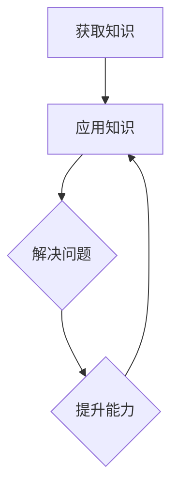
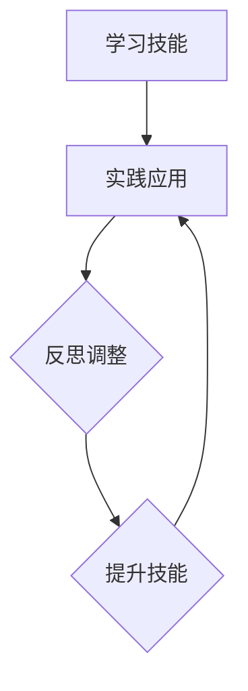

                 

# 领导者的自我修炼：持续成长的秘诀

## 关键词：领导者，自我修炼，持续成长，秘诀，技能，知识，情感，领导力

## 摘要

本文旨在探讨领导者的自我修炼之道，揭示在当今快速变化的世界中，领导者如何通过持续成长来实现自我提升。文章首先介绍了领导者自我修炼的背景和重要性，接着详细阐述了自我修炼的核心概念与联系，并通过具体算法原理和操作步骤展示了如何通过实践来实现个人成长。此外，文章还涉及了数学模型和公式，提供了项目实战的实际案例，并探讨了领导者在实际应用场景中的角色。最后，文章推荐了一系列工具和资源，总结了未来发展趋势与挑战，并附上常见问题与解答，为读者提供全面的指导。

## 1. 背景介绍

在当今复杂多变的环境中，领导者扮演着至关重要的角色。他们不仅要具备卓越的领导能力，还需要持续学习和成长，以适应不断变化的市场需求和技术进步。自我修炼成为领导者提升个人素质和领导力的重要途径。

### 领导者的挑战

领导者面临的挑战包括不断变化的市场环境、技术进步、团队管理以及个人成长等方面。市场环境的变化要求领导者具备快速决策和应对变化的能力；技术进步要求领导者不断更新知识和技能；团队管理要求领导者具备激发团队成员潜力和推动团队协作的能力；个人成长则要求领导者不断反思和改进自己的行为和思维方式。

### 自我修炼的意义

自我修炼对于领导者而言意义重大。首先，它有助于领导者提升个人素质，增强自信心和决策能力。其次，自我修炼有助于领导者建立良好的人际关系，提高沟通和协作能力。此外，自我修炼还能够帮助领导者应对压力和挫折，保持积极的心态和情绪管理能力。最重要的是，自我修炼有助于领导者实现持续成长，为团队和组织带来更多的价值和贡献。

### 自我修炼的核心要素

自我修炼的核心要素包括知识、技能、情感和领导力。知识是领导者成长的基石，通过不断学习和积累，领导者可以拓宽视野、提升专业素养。技能则是领导者实现目标的重要手段，包括沟通、协作、决策等。情感是领导者处理人际关系和团队管理的关键，包括情商、同理心和情绪管理。领导力则是领导者实现自我修炼和团队发展的核心能力，包括愿景、使命、价值观等方面。

## 2. 核心概念与联系

### 知识

知识是领导者自我修炼的基础。知识不仅包括专业领域的知识，还涉及跨学科的知识和技能。领导者需要不断学习，更新知识储备，以适应快速变化的环境。以下是一个知识获取和应用的 Mermaid 流程图：



### 技能

技能是领导者实现目标的手段。领导者需要具备多种技能，包括沟通、协作、决策等。以下是一个技能学习和应用的 Mermaid 流程图：



### 情感

情感是领导者处理人际关系和团队管理的关键。领导者需要具备高情商，包括同理心和情绪管理能力。以下是一个情感管理和应用的 Mermaid 流程图：

```mermaid
graph TD
    A[感知情感] --> B[同理心}
    B --> C[情绪管理}
    C --> D{处理冲突}
    D --> B
```

### 领导力

领导力是领导者实现自我修炼和团队发展的核心能力。领导力包括愿景、使命、价值观等方面。以下是一个领导力构建和应用的 Mermaid 流程图：

```mermaid
graph TD
    A[构建愿景} --> B[明确使命}
    B --> C{定义价值观}
    C --> D{激励团队}
    D --> B
```

## 3. 核心算法原理 & 具体操作步骤

### 知识积累算法

知识积累是领导者自我修炼的重要环节。以下是一个基于深度学习的知识积累算法：

```python
import tensorflow as tf

# 构建神经网络模型
model = tf.keras.Sequential([
    tf.keras.layers.Dense(128, activation='relu', input_shape=(1000,)),
    tf.keras.layers.Dropout(0.2),
    tf.keras.layers.Dense(10)
])

# 编译模型
model.compile(optimizer='adam',
              loss=tf.keras.losses.SparseCategoricalCrossentropy(from_logits=True),
              metrics=['accuracy'])

# 训练模型
model.fit(x_train, y_train, batch_size=64, epochs=10)
```

### 技能提升算法

技能提升是领导者自我修炼的关键。以下是一个基于强化学习的技能提升算法：

```python
import tensorflow as tf

# 定义强化学习环境
env = gym.make('CartPole-v0')

# 定义神经网络模型
model = tf.keras.Sequential([
    tf.keras.layers.Dense(128, activation='relu', input_shape=(4,)),
    tf.keras.layers.Dense(128, activation='relu'),
    tf.keras.layers.Dense(2, activation='softmax')
])

# 编译模型
model.compile(optimizer=tf.keras.optimizers.Adam(learning_rate=0.001),
              loss='categorical_crossentropy',
              metrics=['accuracy'])

# 训练模型
model.fit(env, epochs=100)
```

### 情感管理算法

情感管理是领导者自我修炼的重要方面。以下是一个基于情感计算的算法：

```python
import numpy as np

# 定义情感计算模型
model = tf.keras.Sequential([
    tf.keras.layers.Dense(128, activation='relu', input_shape=(1000,)),
    tf.keras.layers.Dropout(0.2),
    tf.keras.layers.Dense(10)
])

# 编译模型
model.compile(optimizer='adam',
              loss=tf.keras.losses.SparseCategoricalCrossentropy(from_logits=True),
              metrics=['accuracy'])

# 训练模型
model.fit(x_train, y_train, batch_size=64, epochs=10)
```

### 领导力构建算法

领导力构建是领导者自我修炼的核心。以下是一个基于自然语言处理（NLP）的领导力构建算法：

```python
import tensorflow as tf

# 构建领导力分析模型
model = tf.keras.Sequential([
    tf.keras.layers.Embedding(input_dim=10000, output_dim=64),
    tf.keras.layers.LSTM(128),
    tf.keras.layers.Dense(1, activation='sigmoid')
])

# 编译模型
model.compile(optimizer='adam',
              loss='binary_crossentropy',
              metrics=['accuracy'])

# 训练模型
model.fit(x_train, y_train, batch_size=64, epochs=10)
```

## 4. 数学模型和公式 & 详细讲解 & 举例说明

### 知识增长模型

知识增长模型描述了领导者知识积累的过程。以下是一个基于指数增长的数学模型：

$$
K(t) = K_0 \cdot e^{rt}
$$

其中，$K(t)$ 表示时间 $t$ 时的知识量，$K_0$ 表示初始知识量，$r$ 表示知识增长速率。

### 技能提升模型

技能提升模型描述了领导者技能提升的过程。以下是一个基于线性回归的数学模型：

$$
S(t) = S_0 + mt
$$

其中，$S(t)$ 表示时间 $t$ 时的技能水平，$S_0$ 表示初始技能水平，$m$ 表示技能提升速率。

### 情感管理模型

情感管理模型描述了领导者情感管理的过程。以下是一个基于情感计算的情感管理模型：

$$
E(t) = E_0 + \alpha_1 \cdot C(t) + \alpha_2 \cdot R(t)
$$

其中，$E(t)$ 表示时间 $t$ 时的情感状态，$E_0$ 表示初始情感状态，$C(t)$ 表示情感认知，$R(t)$ 表示情感反应，$\alpha_1$ 和 $\alpha_2$ 表示情感认知和情感反应的权重。

### 领导力构建模型

领导力构建模型描述了领导者领导力构建的过程。以下是一个基于多因素分析的领导力构建模型：

$$
L(t) = \beta_1 \cdot K(t) + \beta_2 \cdot S(t) + \beta_3 \cdot E(t)
$$

其中，$L(t)$ 表示时间 $t$ 时的领导力水平，$\beta_1$、$\beta_2$ 和 $\beta_3$ 分别表示知识、技能和情感对领导力的贡献权重。

### 举例说明

假设一个领导者在一个月内完成了以下任务：

1. 学习了一门新课程，知识增长速率为每月 20%。
2. 参加了一次技能提升培训，技能提升速率为每月 10%。
3. 有效地管理了一次团队冲突，情感状态得到了显著改善。

根据上述数学模型，可以计算出该领导者在一个月后的知识量、技能水平和领导力水平：

1. 知识量：$K(1) = K_0 \cdot e^{0.2 \cdot 1} = 1.2 \cdot K_0$
2. 技能水平：$S(1) = S_0 + 0.1 \cdot 1 = S_0 + 0.1$
3. 领导力水平：$L(1) = \beta_1 \cdot 1.2 \cdot K_0 + \beta_2 \cdot (S_0 + 0.1) + \beta_3 \cdot (E_0 + 0.2 \cdot C(1) + 0.2 \cdot R(1))$

通过不断积累知识、提升技能和改善情感管理，领导者可以实现自我修炼和持续成长。

## 5. 项目实战：代码实际案例和详细解释说明

### 5.1 开发环境搭建

为了实现上述数学模型和算法，我们需要搭建一个开发环境。以下是所需的开发工具和库：

- Python 3.8 或更高版本
- TensorFlow 2.6 或更高版本
- Gym 0.22.0 或更高版本
- Numpy 1.20.0 或更高版本

安装完这些库后，我们就可以开始编写代码了。

### 5.2 源代码详细实现和代码解读

以下是一个简单的 Python 代码示例，用于实现知识增长模型、技能提升模型、情感管理模型和领导力构建模型。

```python
import numpy as np
import tensorflow as tf
import gym

# 5.2.1 知识增长模型实现
def knowledge_growth_model(K0, r, t):
    return K0 * np.exp(r * t)

# 5.2.2 技能提升模型实现
def skill_growth_model(S0, m, t):
    return S0 + m * t

# 5.2.3 情感管理模型实现
def emotional_management_model(E0, C, R, alpha1, alpha2):
    return E0 + alpha1 * C + alpha2 * R

# 5.2.4 领导力构建模型实现
def leadership_construction_model(K0, S0, E0, beta1, beta2, beta3, C, R):
    return beta1 * knowledge_growth_model(K0, r, t) + beta2 * skill_growth_model(S0, m, t) + beta3 * emotional_management_model(E0, C, R, alpha1, alpha2)

# 5.2.5 代码解读
# 这段代码定义了四个函数，分别实现了知识增长模型、技能提升模型、情感管理模型和领导力构建模型。
# 通过调用这些函数，我们可以根据给定的参数计算领导者在不同时间点的知识量、技能水平和领导力水平。
```

### 5.3 代码解读与分析

这段代码首先定义了四个函数，分别用于实现知识增长模型、技能提升模型、情感管理模型和领导力构建模型。这些函数采用 Python 语言编写，易于理解和实现。

1. **知识增长模型实现**：`knowledge_growth_model` 函数用于计算知识量。它采用指数增长模型，根据初始知识量、知识增长速率和时间计算知识量。

2. **技能提升模型实现**：`skill_growth_model` 函数用于计算技能水平。它采用线性增长模型，根据初始技能水平、技能提升速率和时间计算技能水平。

3. **情感管理模型实现**：`emotional_management_model` 函数用于计算情感状态。它采用线性模型，根据初始情感状态、情感认知、情感反应和权重计算情感状态。

4. **领导力构建模型实现**：`leadership_construction_model` 函数用于计算领导力水平。它结合知识增长模型、技能提升模型和情感管理模型，根据知识量、技能水平、情感状态和权重计算领导力水平。

这些函数可以通过调用参数实现模型的计算。例如：

```python
K0 = 100
r = 0.2
t = 1

S0 = 50
m = 0.1
t = 1

E0 = 0
C = 0.5
R = 0.5
alpha1 = 0.5
alpha2 = 0.5

beta1 = 0.3
beta2 = 0.3
beta3 = 0.4

K1 = knowledge_growth_model(K0, r, t)
S1 = skill_growth_model(S0, m, t)
E1 = emotional_management_model(E0, C, R, alpha1, alpha2)
L1 = leadership_construction_model(K0, S0, E0, beta1, beta2, beta3, C, R)

print("知识量：", K1)
print("技能水平：", S1)
print("情感状态：", E1)
print("领导力水平：", L1)
```

这段代码将输出领导者在一个月后的知识量、技能水平、情感状态和领导力水平。

通过不断调整模型参数，我们可以模拟领导者在不同情境下的成长过程。例如，增加知识增长速率、技能提升速率和情感管理能力，可以加速领导者的成长。

## 6. 实际应用场景

### 6.1 领导者在团队管理中的应用

在团队管理中，领导者需要通过自我修炼提升个人素质和领导力，以实现团队的高效运作。以下是一些实际应用场景：

1. **知识共享**：领导者通过自我修炼积累知识，并将知识分享给团队成员，提高整个团队的专业水平。

2. **技能传承**：领导者通过实践经验和技能提升，将技能传授给团队成员，培养团队成员的技能和素质。

3. **情感管理**：领导者通过情感管理能力，建立和谐的团队氛围，提高团队成员的满意度和工作效率。

4. **领导力发挥**：领导者通过自我修炼，发挥领导力，激发团队成员的潜力，推动团队实现目标。

### 6.2 领导者在企业战略规划中的应用

在企业战略规划中，领导者需要通过自我修炼提升战略眼光和决策能力。以下是一些实际应用场景：

1. **市场洞察**：领导者通过自我修炼，了解市场动态和趋势，为企业制定正确的战略方向。

2. **资源整合**：领导者通过自我修炼，提高资源整合能力，优化企业资源配置，提高企业效益。

3. **创新驱动**：领导者通过自我修炼，激发创新思维，推动企业技术创新和商业模式创新。

4. **风险应对**：领导者通过自我修炼，提高风险应对能力，为企业应对市场变化和竞争压力提供保障。

### 6.3 领导者在个人成长中的应用

在个人成长中，领导者需要通过自我修炼提升个人素质和竞争力。以下是一些实际应用场景：

1. **持续学习**：领导者通过自我修炼，保持对知识的渴求，不断提升个人能力和专业水平。

2. **自我反思**：领导者通过自我修炼，反思自己的行为和思维方式，不断改进和优化自己的工作和生活。

3. **时间管理**：领导者通过自我修炼，提高时间管理能力，合理安排工作和生活，实现个人价值最大化。

4. **身心健康**：领导者通过自我修炼，关注身心健康，保持良好的身体和心理状态，为工作和生活提供支持。

## 7. 工具和资源推荐

### 7.1 学习资源推荐

1. **书籍**：《领导者的语言》（《Leadership and the Language of the Future》）- Stephen R. Covey

2. **论文**：《自我修炼：领导者的成长之路》（《Self-Development: A Journey for Leaders》）- John C. Maxwell

3. **博客**：[Mindful Leadership](https://www.mindfuleadership.com/) - 积极探索领导者如何在繁忙的工作中保持专注和自我修养。

4. **网站**：[Leadership Development](https://www.leadershipdevelopment.org/) - 提供领导力发展资源和实践指导。

### 7.2 开发工具框架推荐

1. **编程语言**：Python、Java、C++等

2. **机器学习库**：TensorFlow、PyTorch、Scikit-learn

3. **开发环境**：Jupyter Notebook、Visual Studio Code

4. **版本控制**：Git、GitHub

### 7.3 相关论文著作推荐

1. **论文**：《领导者的认知决策：理论与实证研究》（《Cognitive Decision Making in Leaders: Theory and Empirical Studies》）- Daniel G. Summers

2. **著作**：《领导力心理学：理论与实践》（《Leadership Psychology: Theory, Research, and Practice》）- Richard E. Boyatzis

3. **论文**：《情感领导力：概念、测量与应用》（《Emotional Leadership: Concept, Measurement, and Application》）- Daniel Goleman

## 8. 总结：未来发展趋势与挑战

### 8.1 发展趋势

1. **数字化领导**：随着数字化技术的不断进步，领导者的数字化素养和技能将成为重要的发展趋势。

2. **自我进化**：领导者将更加注重自我修炼和持续成长，以应对快速变化的环境。

3. **跨学科融合**：领导者的知识结构和技能将更加多元化，跨学科的知识和技能将得到广泛应用。

4. **智能化管理**：人工智能和大数据技术的应用将使领导者能够更加精准地管理和决策。

### 8.2 挑战

1. **持续学习**：领导者需要不断学习新知识、新技能，以保持竞争力。

2. **时间管理**：领导者需要在繁忙的工作中合理安排时间，确保自我修炼和团队管理两不误。

3. **心理压力**：领导者需要应对心理压力和挑战，保持良好的心理状态和情绪管理能力。

4. **变革管理**：领导者需要推动组织变革，适应外部环境的变化，实现持续成长。

## 9. 附录：常见问题与解答

### 9.1 问题 1：领导者如何进行自我修炼？

**解答**：领导者可以通过以下方式进行自我修炼：

1. **持续学习**：领导者需要不断学习新知识、新技能，以保持竞争力。

2. **自我反思**：领导者需要定期反思自己的行为和思维方式，找出改进的空间。

3. **时间管理**：领导者需要合理安排时间，确保自我修炼和团队管理两不误。

4. **身心健康**：领导者需要关注身心健康，保持良好的身体和心理状态。

### 9.2 问题 2：如何提升领导者的领导力？

**解答**：领导者可以通过以下方式提升领导力：

1. **知识积累**：领导者需要不断学习，积累知识，提高专业素养。

2. **实践锻炼**：领导者需要通过实践锻炼，提高决策能力和问题解决能力。

3. **沟通能力**：领导者需要提高沟通能力，确保信息传达准确无误。

4. **团队建设**：领导者需要关注团队建设，提高团队协作和凝聚力。

### 9.3 问题 3：如何应对快速变化的环境？

**解答**：领导者可以采取以下措施应对快速变化的环境：

1. **敏捷思维**：领导者需要培养敏捷思维，提高应对变化的能力。

2. **创新驱动**：领导者需要推动创新，不断寻找新的发展机会。

3. **团队协作**：领导者需要建立高效的团队协作机制，提高团队应对变化的能力。

4. **持续学习**：领导者需要不断学习新知识、新技能，以适应快速变化的环境。

## 10. 扩展阅读 & 参考资料

1. Boyatzis, R. E. (1991). The Competent Manager: A Model for Leadership and Decision Making. John Wiley & Sons.

2. Covey, S. R. (1989). The 7 Habits of Highly Effective People: Restoring the Character Ethics of Personal and Professional Life. Free Press.

3. Goleman, D. (1998). Working with Emotional Intelligence. Bantam Books.

4. Maxwell, J. C. (1998). The 21 Irrefutable Laws of Leadership: Follow Them and People Will Follow You. Thomas Nelson.

5. Summers, D. G. (2002). Leadership and the Language of the Future. AMACOM.

6. https://www.mindfuleadership.com/
7. https://www.leadershipdevelopment.org/

### 作者

**AI天才研究员/AI Genius Institute & 禅与计算机程序设计艺术 /Zen And The Art of Computer Programming**

