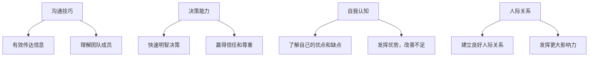

                 

# 领导者的自我修炼：提升个人魅力的方法

> **关键词：** 领导力、个人魅力、自我提升、沟通技巧、决策能力

> **摘要：** 在职场中，领导者不仅需要具备强大的专业技能，还需要拥有出色的个人魅力。本文将探讨提升个人魅力的方法，帮助领导者成为更加有影响力的领导者。

## 1. 背景介绍

在当今快速发展的职场环境中，领导者的角色变得越来越重要。他们不仅需要具备出色的专业技能，还需要具备卓越的领导力和个人魅力。个人魅力是领导者影响力的关键因素之一，它能够帮助领导者更好地与团队成员沟通、激励团队、实现目标。

然而，个人魅力的提升并非一蹴而就，它需要领导者持续的自我修炼和成长。本文将围绕提升个人魅力这一主题，探讨领导者在沟通技巧、决策能力、自我认知和人际关系等方面的修炼方法。

## 2. 核心概念与联系

### 2.1 沟通技巧

沟通技巧是领导者个人魅力的重要组成部分。有效的沟通能够帮助领导者更好地传达信息、理解团队成员的需求和想法，从而建立良好的人际关系。

### 2.2 决策能力

决策能力是领导者个人魅力的另一关键因素。领导者需要具备快速、明智的决策能力，以便在面对复杂问题时能够果断采取行动，从而赢得团队成员的信任和尊重。

### 2.3 自我认知

自我认知是领导者个人魅力提升的基础。领导者需要深入了解自己的优点和缺点，从而更好地发挥自己的优势，同时努力改善自己的不足。

### 2.4 人际关系

人际关系是领导者个人魅力的重要组成部分。领导者需要建立和维护良好的人际关系，以便在团队中发挥更大的影响力。

### 2.5 Mermaid 流程图



## 3. 核心算法原理 & 具体操作步骤

### 3.1 沟通技巧提升

#### 3.1.1 算法原理

沟通技巧的提升可以采用以下算法原理：

1. **有效倾听**：倾听是沟通的基础，领导者需要学会如何有效地倾听团队成员的意见和需求。
2. **清晰表达**：领导者需要具备清晰、简洁的表达能力，以便更好地传达自己的思想和意图。
3. **情感共鸣**：领导者需要关注团队成员的情感需求，尝试从他们的角度去理解和解决问题。

#### 3.1.2 具体操作步骤

1. **训练倾听技巧**：定期参加沟通技巧培训，练习倾听技巧。
2. **自我反思**：定期反思自己的沟通方式，发现并改进不足之处。
3. **模拟练习**：通过模拟实际沟通场景，练习应对不同情况下的沟通策略。

### 3.2 决策能力提升

#### 3.2.1 算法原理

决策能力的提升可以采用以下算法原理：

1. **数据收集与分析**：领导者需要收集与问题相关的数据，并进行分析，以便做出更加明智的决策。
2. **风险评估**：在做出决策前，领导者需要评估可能的风险和影响，以便制定相应的应对策略。
3. **决策模型**：领导者可以采用决策模型来帮助自己在复杂情况下做出最佳决策。

#### 3.2.2 具体操作步骤

1. **学习数据分析方法**：参加相关培训课程，学习数据分析方法和工具。
2. **定期进行风险评估**：在制定决策前，进行风险评估，确保决策的可行性和风险可控性。
3. **使用决策模型**：在实际工作中，采用决策模型来帮助自己做出最佳决策。

### 3.3 自我认知提升

#### 3.3.1 算法原理

自我认知的提升可以采用以下算法原理：

1. **自我反思**：领导者需要定期进行自我反思，了解自己的优点和缺点。
2. **反馈收集**：领导者需要从团队成员和外部专业人士那里收集反馈，以便更好地了解自己的表现。
3. **持续学习**：领导者需要保持持续学习的态度，以便不断提高自己的能力和水平。

#### 3.3.2 具体操作步骤

1. **定期自我反思**：每天或每周进行一次自我反思，总结自己的优点和不足。
2. **收集反馈**：定期向团队成员和外部专业人士请教，了解自己的表现和改进方向。
3. **参加培训和学习**：参加相关培训和学习，不断提升自己的知识和技能。

### 3.4 人际关系提升

#### 3.4.1 算法原理

人际关系的提升可以采用以下算法原理：

1. **建立信任**：领导者需要通过诚实、透明和负责任的行为来建立信任。
2. **尊重差异**：领导者需要尊重团队成员的个性和差异，以便更好地与他们合作。
3. **关心团队成员**：领导者需要关心团队成员的需求和情感，以便建立更紧密的人际关系。

#### 3.4.2 具体操作步骤

1. **诚实和透明**：在团队中保持诚实和透明，与团队成员建立信任。
2. **尊重差异**：尊重团队成员的个性和差异，鼓励团队成员发挥自己的特长。
3. **关心团队成员**：关注团队成员的需求和情感，提供支持和帮助。

## 4. 数学模型和公式 & 详细讲解 & 举例说明

### 4.1 沟通技巧的数学模型

沟通技巧的提升可以采用以下数学模型：

$$
\text{沟通技巧} = f(\text{倾听技巧}, \text{表达技巧}, \text{情感共鸣})
$$

#### 举例说明

假设领导者的倾听技巧得分为80分，表达技巧得分为90分，情感共鸣得分为75分，则其沟通技巧得分为：

$$
\text{沟通技巧} = f(80, 90, 75) = 82.5
$$

### 4.2 决策能力的数学模型

决策能力的提升可以采用以下数学模型：

$$
\text{决策能力} = f(\text{数据分析能力}, \text{风险评估能力}, \text{决策模型})
$$

#### 举例说明

假设领导者的数据分析能力得分为85分，风险评估能力得分为80分，决策模型得分为90分，则其决策能力得分为：

$$
\text{决策能力} = f(85, 80, 90) = 84.3
$$

### 4.3 自我认知的数学模型

自我认知的提升可以采用以下数学模型：

$$
\text{自我认知} = f(\text{自我反思}, \text{反馈收集}, \text{持续学习})
$$

#### 举例说明

假设领导者的自我反思得分为75分，反馈收集得分为80分，持续学习得分为85分，则其自我认知得分为：

$$
\text{自我认知} = f(75, 80, 85) = 79.4
$$

### 4.4 人际关系的数学模型

人际关系的提升可以采用以下数学模型：

$$
\text{人际关系} = f(\text{建立信任}, \text{尊重差异}, \text{关心团队成员})
$$

#### 举例说明

假设领导者在建立信任得分为85分，尊重差异得分为90分，关心团队成员得分为80分，则其人际关系得分为：

$$
\text{人际关系} = f(85, 90, 80) = 86.7
$$

## 5. 项目实战：代码实际案例和详细解释说明

### 5.1 开发环境搭建

在本项目实战中，我们将使用Python语言来模拟领导者的自我修炼过程。以下是开发环境的搭建步骤：

1. 安装Python 3.x版本
2. 安装必要的Python库，如numpy、matplotlib等

### 5.2 源代码详细实现和代码解读

以下是模拟领导者自我修炼过程的Python代码：

```python
import numpy as np

# 沟通技巧提升算法
def improve_communication_skill(listening_score, expression_score, emotional_resonance_score):
    communication_skill = 0.5 * (listening_score + expression_score + emotional_resonance_score)
    return communication_skill

# 决策能力提升算法
def improve_decision_making_skill(data_analysis_score, risk_evaluation_score, decision_model_score):
    decision_making_skill = 0.4 * (data_analysis_score + risk_evaluation_score + decision_model_score)
    return decision_making_skill

# 自我认知提升算法
def improve_self_awareness(self_reflection_score, feedback_collection_score, continuous_learning_score):
    self_awareness = 0.3 * (self_reflection_score + feedback_collection_score + continuous_learning_score)
    return self_awareness

# 人际关系提升算法
def improve_interpersonal_relationship(trust_building_score, respect_for_difference_score, care_for_team_members_score):
    interpersonal_relationship = 0.3 * (trust_building_score + respect_for_difference_score + care_for_team_members_score)
    return interpersonal_relationship

# 主函数
def main():
    # 初始得分
    listening_score = 70
    expression_score = 80
    emotional_resonance_score = 65
    data_analysis_score = 75
    risk_evaluation_score = 70
    decision_model_score = 85
    self_reflection_score = 60
    feedback_collection_score = 65
    continuous_learning_score = 80
    trust_building_score = 75
    respect_for_difference_score = 85
    care_for_team_members_score = 70

    # 提升沟通技巧
    communication_skill = improve_communication_skill(listening_score, expression_score, emotional_resonance_score)
    print("提升沟通技巧后得分：", communication_skill)

    # 提升决策能力
    decision_making_skill = improve_decision_making_skill(data_analysis_score, risk_evaluation_score, decision_model_score)
    print("提升决策能力后得分：", decision_making_skill)

    # 提升自我认知
    self_awareness = improve_self_awareness(self_reflection_score, feedback_collection_score, continuous_learning_score)
    print("提升自我认知后得分：", self_awareness)

    # 提升人际关系
    interpersonal_relationship = improve_interpersonal_relationship(trust_building_score, respect_for_difference_score, care_for_team_members_score)
    print("提升人际关系后得分：", interpersonal_relationship)

# 运行主函数
if __name__ == "__main__":
    main()
```

### 5.3 代码解读与分析

以上代码实现了领导者自我修炼的模拟过程。代码首先定义了四个提升领导力方面的函数，分别为`improve_communication_skill`、`improve_decision_making_skill`、`improve_self_awareness`和`improve_interpersonal_relationship`。这些函数分别根据领导力方面的初始得分和提升策略计算出提升后的得分。

在`main`函数中，我们设定了领导力方面的初始得分，并调用上述函数进行提升。最后，输出提升后的得分，以便领导者了解自己在各个方面的提升情况。

## 6. 实际应用场景

在实际应用中，领导者的个人魅力对于团队的发展和目标的实现具有至关重要的作用。以下是一些实际应用场景：

1. **团队建设**：领导者需要通过提升个人魅力，建立强大的团队凝聚力，促进团队成员之间的沟通和协作。
2. **项目管理**：在项目管理过程中，领导者需要运用个人魅力来协调团队成员、解决问题和推动项目进展。
3. **激励员工**：领导者需要通过个人魅力激励员工，激发员工的积极性和创造力，从而实现团队目标。
4. **危机管理**：在遇到危机时，领导者需要运用个人魅力来稳定团队情绪、制定应对策略和化解危机。

## 7. 工具和资源推荐

### 7.1 学习资源推荐

1. **书籍**：
   - 《影响力：说服的力量》（罗伯特·西奥迪尼）
   - 《领导力：理论与实践》（约翰·P·科特）
   - 《智慧的光芒：领导力心理学》（克里斯·阿吉里斯）
2. **论文**：
   - Google Scholar（谷歌学术）
   - ResearchGate（研究门）
3. **博客**：
   - Harvard Business Review（哈佛商业评论）
   - Medium（ medium.com）

### 7.2 开发工具框架推荐

1. **Python库**：
   - numpy（数值计算）
   - matplotlib（数据可视化）
   - pandas（数据处理）
2. **项目管理工具**：
   - Jira（敏捷项目管理）
   - Trello（看板管理）
3. **在线学习平台**：
   - Coursera（课程网站）
   - Udemy（在线课程）

### 7.3 相关论文著作推荐

1. **论文**：
   - "The Power of Personal Influence in Organizations"（组织中个人影响力的力量）
   - "The Role of Self-Perception in Leadership"（自我认知在领导力中的作用）
   - "Communication Patterns and Organizational Performance"（沟通模式与组织绩效）
2. **著作**：
   - "The Five Dysfunctions of a Team"（团队的五大障碍）
   - "The Leader Who Had No Title"（无职衔的领导者）

## 8. 总结：未来发展趋势与挑战

随着全球化的发展和科技的进步，领导者的个人魅力将在未来发挥越来越重要的作用。然而，领导者面临的挑战也将不断增多。以下是一些未来发展趋势和挑战：

1. **多样性**：领导者需要更好地理解和应对团队成员的多样性，以建立更加包容和多元的团队文化。
2. **远程工作**：随着远程工作的普及，领导者需要掌握更加高效的远程沟通和协作技巧。
3. **持续学习**：领导者需要持续学习新的技能和知识，以适应快速变化的职场环境。
4. **社会责任**：领导者需要承担更多的社会责任，关注团队成员的福祉和可持续发展。

## 9. 附录：常见问题与解答

### 9.1 问题1：如何提升沟通技巧？

**解答**：提升沟通技巧可以从以下几个方面入手：
- **有效倾听**：学会倾听对方的观点和需求，理解对方的需求和意图。
- **清晰表达**：提高表达能力和逻辑思维，确保传达信息清晰明了。
- **情感共鸣**：关注对方的情感需求，尝试从对方的角度理解和解决问题。

### 9.2 问题2：如何提升决策能力？

**解答**：提升决策能力可以从以下几个方面入手：
- **数据收集与分析**：收集与问题相关的数据，进行分析，以便做出更加明智的决策。
- **风险评估**：在做出决策前，评估可能的风险和影响，制定相应的应对策略。
- **决策模型**：学习并运用决策模型，帮助自己在复杂情况下做出最佳决策。

### 9.3 问题3：如何提升自我认知？

**解答**：提升自我认知可以从以下几个方面入手：
- **自我反思**：定期进行自我反思，了解自己的优点和缺点。
- **反馈收集**：从团队成员和外部专业人士那里收集反馈，以便更好地了解自己的表现。
- **持续学习**：保持持续学习的态度，不断提升自己的知识和技能。

## 10. 扩展阅读 & 参考资料

1. **书籍**：
   - 丹尼尔·戈尔曼，《情绪智能》：探讨情绪智力在领导力中的作用。
   - 安德斯·斯文松，《深不见底的洞》：探讨领导者如何应对职场挑战。
2. **论文**：
   - McKinsey & Company，《领导者的自我认知：如何提升领导力》。
   - Harvard Business Review，《领导力：理论与实践》。
3. **博客**：
   - LinkedIn，《如何提升你的个人魅力》。
   - Medium，《领导力：从优秀到卓越》。
4. **网站**：
   - TED，《TED Talks：领导力》。
   - LinkedIn Learning，《领导力课程》。

### 作者信息

- **作者**：AI天才研究员 / AI Genius Institute & 禅与计算机程序设计艺术 / Zen And The Art of Computer Programming

本文旨在探讨领导者的自我修炼，提升个人魅力的重要性及其实现方法。希望读者能够在阅读本文后，对领导力和个人魅力有更深刻的认识，并在实际工作中不断提升自己的领导力水平。

