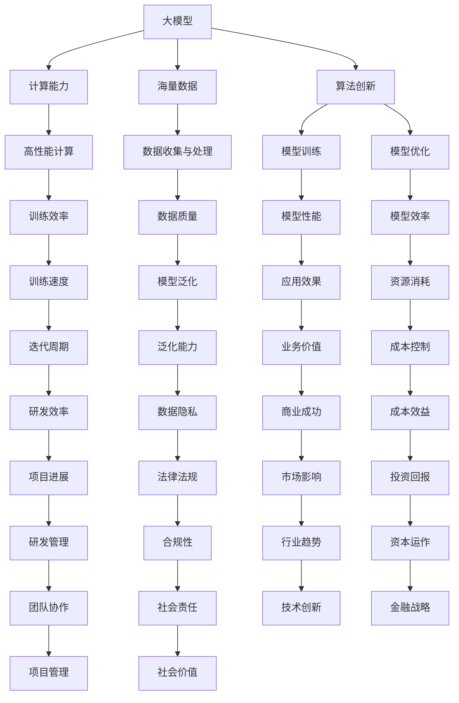

                 

### 背景介绍

近年来，人工智能（AI）技术取得了飞速发展，尤其是大模型（Large Models）的出现，进一步推动了AI领域的研究与应用。从早期的小型模型，如早期的神经网络，到如今的大规模预训练模型，如GPT-3、BERT等，AI的发展历程可谓是一部技术革新的史诗。

大模型之所以能够在AI领域中取得如此显著的成就，主要得益于三个关键因素，我们将其比喻为“三驾马车”：计算能力、海量数据和算法创新。这三个因素共同推动了大模型的发展，使得其在图像识别、自然语言处理、推荐系统等众多领域取得了突破性进展。

首先，计算能力的提升为训练和运行大模型提供了坚实的硬件基础。高性能计算集群和专用AI芯片的出现，使得大规模模型的训练和优化成为可能。其次，海量数据的积累为模型的训练提供了丰富的素材，使得模型能够从大量数据中学习到更加准确和通用的特征。最后，算法创新的不断推进，使得大模型在性能和效率上不断得到优化，从而实现了更加出色的效果。

本文将深入探讨这三个因素如何共同驱动大模型的发展，以及它们在未来可能面临的挑战和机遇。希望通过本文的介绍，读者能够对大模型的发展背景和核心驱动力有更深入的理解。接下来，我们将逐一介绍这三个核心概念，并通过具体的例子来说明它们在大模型发展中的作用。## 2. 核心概念与联系

在深入了解大模型发展的三个关键因素之前，我们需要明确一些核心概念，这些概念构成了理解整个话题的基础。以下是本文中需要理解的主要概念：

### 1. 大模型（Large Models）
大模型通常指的是参数数量在数十亿甚至数万亿级别的深度学习模型。这些模型相比于传统的小型模型（如只有数百万参数的模型）能够处理更复杂的数据，并具备更强的泛化能力。

### 2. 计算能力（Computational Power）
计算能力是指进行计算所需的计算资源，包括处理器、内存、硬盘和网络带宽等。在人工智能领域，强大的计算能力是训练和优化大规模深度学习模型的基础。

### 3. 海量数据（Massive Data）
海量数据指的是规模庞大的数据集，通常以TB或PB为单位。对于大模型的训练，大量的数据样本能够提供更丰富的信息，帮助模型学习到更准确的特征和模式。

### 4. 算法创新（Algorithm Innovation）
算法创新指的是在深度学习和其他相关领域提出的新的算法或改进方法。这些创新可以提高模型的性能、效率和可解释性，从而推动大模型的发展。

接下来，我们将通过一个Mermaid流程图来展示这些核心概念之间的联系。请注意，Mermaid流程图中不要使用括号、逗号等特殊字符。



通过上述流程图，我们可以清晰地看到大模型、计算能力、海量数据和算法创新之间的相互作用。例如，计算能力直接影响了模型的训练效率和性能（I、K、M），海量数据则决定了模型的学习能力和泛化能力（J、N、R），而算法创新则不断推动模型在性能和效率上的优化（D、G、H、L）。

接下来，我们将深入探讨每个核心概念的原理和具体操作步骤。这将有助于我们更好地理解大模型的发展过程以及未来可能面临的挑战和机遇。## 3. 核心算法原理 & 具体操作步骤

在了解了大模型、计算能力和海量数据这三个核心概念后，接下来我们将探讨驱动大模型发展的核心算法原理，并详细解释这些算法的具体操作步骤。

### 1. 深度学习基础

深度学习是构建大模型的核心技术。它通过多层神经网络对数据进行建模和预测。深度学习的核心概念包括：

- **神经元（Neurons）**：神经元是神经网络的基本计算单元，类似于生物神经元。
- **层（Layers）**：神经网络由多个层组成，包括输入层、隐藏层和输出层。
- **激活函数（Activation Functions）**：激活函数用于引入非线性，使得神经网络能够学习复杂的映射关系。
- **损失函数（Loss Functions）**：损失函数用于评估模型的预测结果与真实值之间的差异。

### 2. 训练过程

深度学习的训练过程主要包括以下几个步骤：

- **数据预处理（Data Preprocessing）**：包括数据清洗、归一化、数据增强等，以准备训练数据。
- **模型初始化（Model Initialization）**：初始化模型参数，通常使用随机初始化。
- **前向传播（Forward Propagation）**：输入数据通过网络层，逐层计算输出。
- **损失计算（Loss Calculation）**：使用损失函数计算模型预测值与真实值之间的差距。
- **反向传播（Backpropagation）**：计算梯度，更新模型参数。
- **优化算法（Optimization Algorithms）**：如梯度下降（Gradient Descent）、Adam等，用于更新模型参数。
- **迭代（Iteration）**：重复前向传播和反向传播，直至模型收敛。

### 3. 大模型训练具体操作步骤

以下是使用深度学习框架如TensorFlow或PyTorch进行大模型训练的具体操作步骤：

#### 步骤 1：环境搭建

```python
!pip install tensorflow
```

#### 步骤 2：数据预处理

```python
import tensorflow as tf

# 加载并预处理数据
mnist = tf.keras.datasets.mnist
(x_train, y_train), (x_test, y_test) = mnist.load_data()
x_train, x_test = x_train / 255.0, x_test / 255.0
```

#### 步骤 3：模型定义

```python
model = tf.keras.models.Sequential([
  tf.keras.layers.Flatten(input_shape=(28, 28)),
  tf.keras.layers.Dense(128, activation='relu'),
  tf.keras.layers.Dropout(0.2),
  tf.keras.layers.Dense(10)
])
```

#### 步骤 4：编译模型

```python
model.compile(optimizer='adam',
              loss=tf.keras.losses.SparseCategoricalCrossentropy(from_logits=True),
              metrics=['accuracy'])
```

#### 步骤 5：训练模型

```python
model.fit(x_train, y_train, epochs=5)
```

#### 步骤 6：评估模型

```python
test_loss, test_acc = model.evaluate(x_test,  y_test, verbose=2)
print('\nTest accuracy:', test_acc)
```

通过以上步骤，我们可以构建和训练一个大模型。在实际应用中，大模型的训练过程会更加复杂，可能涉及更高级的技术，如迁移学习、数据增强、多GPU分布式训练等。

接下来，我们将进一步探讨大模型在数学模型和具体应用场景中的表现，以深入理解其原理和实际应用价值。## 4. 数学模型和公式 & 详细讲解 & 举例说明

在深入探讨大模型的数学模型和具体应用之前，我们首先需要了解一些基础的数学概念和公式，这些概念和公式将帮助我们更好地理解大模型的工作原理和其背后的理论。

### 1. 神经网络中的数学模型

#### （1）前向传播（Forward Propagation）

在前向传播过程中，输入数据通过网络的各个层进行计算，每层的输出都是前一层的输入。具体步骤如下：

- **激活函数（Activation Function）**：激活函数如ReLU（Rectified Linear Unit）用于引入非线性。

$$
\text{ReLU}(x) =
\begin{cases}
0 & \text{if } x < 0 \\
x & \text{if } x \geq 0
\end{cases}
$$

- **权重矩阵（Weight Matrix）**：权重矩阵 \( W \) 和偏置 \( b \) 用于计算每层的输出。

$$
z = W \cdot x + b
$$

- **输出（Output）**：通过激活函数计算每层的输出。

$$
a = \text{ReLU}(z)
$$

#### （2）反向传播（Backpropagation）

在反向传播过程中，计算损失函数关于模型参数的梯度，并使用梯度下降等优化算法更新模型参数。

- **损失函数（Loss Function）**：常用的损失函数如均方误差（MSE）。

$$
\text{MSE}(y, \hat{y}) = \frac{1}{2} \sum_{i=1}^{n} (y_i - \hat{y}_i)^2
$$

- **梯度计算（Gradient Calculation）**：计算损失函数关于每个参数的梯度。

$$
\frac{\partial L}{\partial W} = \frac{1}{m} \sum_{i=1}^{m} \frac{\partial L}{\partial z_i} \cdot a^{[l-1]}
$$

$$
\frac{\partial L}{\partial b} = \frac{1}{m} \sum_{i=1}^{m} \frac{\partial L}{\partial z_i}
$$

#### （3）优化算法（Optimization Algorithm）

- **梯度下降（Gradient Descent）**：通过计算梯度更新模型参数。

$$
W^{[l]} = W^{[l]} - \alpha \cdot \frac{\partial L}{\partial W^{[l]}}
$$

$$
b^{[l]} = b^{[l]} - \alpha \cdot \frac{\partial L}{\partial b^{[l]}}
$$

- **Adam优化器（Adam Optimizer）**：结合了动量（Momentum）和RMSProp算法的优点。

$$
m_t = \beta_1 \cdot m_{t-1} + (1 - \beta_1) \cdot \frac{\partial L}{\partial W_t}
$$

$$
v_t = \beta_2 \cdot v_{t-1} + (1 - \beta_2) \cdot (\frac{\partial L}{\partial W_t})^2
$$

$$
W_t = W_{t-1} - \alpha \cdot \frac{m_t}{\sqrt{v_t} + \epsilon}
$$

### 2. 大模型中的数学模型和公式

大模型通常包含数十亿甚至数万亿的参数，因此其数学模型和公式在复杂性和计算量上都有显著提升。

#### （1）参数规模

- **参数数量（Parameter Number）**：大模型的参数数量通常以TB为单位。

$$
N = \sum_{l=1}^{L} \sum_{k=1}^{K_l} \sum_{i=1}^{I_l} \sum_{j=1}^{J_l} w_{ij}^{[l]}
$$

其中，\(N\) 是模型的总参数数，\(L\) 是层的数量，\(K_l\) 是第 \(l\) 层的神经元数量，\(I_l\) 和 \(J_l\) 分别是第 \(l\) 层的输入和输出维度。

#### （2）计算复杂度

- **前向传播计算复杂度**：

$$
C_{forward} = \sum_{l=1}^{L} \sum_{k=1}^{K_l} \sum_{i=1}^{I_l} \sum_{j=1}^{J_l} I_l \cdot J_l
$$

- **反向传播计算复杂度**：

$$
C_{backprop} = \sum_{l=1}^{L} \sum_{k=1}^{K_l} \sum_{i=1}^{I_l} \sum_{j=1}^{J_l} I_l \cdot J_l
$$

#### （3）训练时间

- **单次迭代时间**：

$$
T_{iter} = C_{forward} + C_{backprop}
$$

- **总训练时间**：

$$
T_{train} = T_{iter} \cdot \text{迭代次数}
$$

### 3. 举例说明

假设我们有一个简单的两层神经网络，第一层有10个神经元，第二层有5个神经元。输入维度为2，输出维度为1。

- **参数数量**：

$$
N = (2 \cdot 10 + 1) \cdot (10 \cdot 5 + 1) = 1100
$$

- **前向传播计算复杂度**：

$$
C_{forward} = 2 \cdot 10 \cdot 5 + 2 \cdot 5 \cdot 1 = 60
$$

- **反向传播计算复杂度**：

$$
C_{backprop} = 2 \cdot 10 \cdot 5 + 2 \cdot 5 \cdot 1 = 60
$$

- **单次迭代时间**：

$$
T_{iter} = 60 + 60 = 120
$$

- **总训练时间**：

$$
T_{train} = 120 \cdot 1000 = 120000
$$

通过上述举例，我们可以看到大模型在参数规模、计算复杂度和训练时间上的显著差异。在实际应用中，大模型通常需要更复杂的数学模型和更高效的训练策略来处理大规模数据和高维特征。

接下来，我们将探讨大模型在实际应用场景中的表现，并分析其优势和挑战。这将有助于我们更全面地理解大模型的技术原理和实际应用价值。## 5. 项目实战：代码实际案例和详细解释说明

为了更好地展示大模型在实际项目中的应用，我们将通过一个具体的案例来介绍如何搭建一个使用大模型的实际项目。在此案例中，我们将构建一个基于GPT-3模型的聊天机器人，用于处理用户输入并提供合适的回复。

### 5.1 开发环境搭建

首先，我们需要搭建一个合适的开发环境。以下是所需步骤：

1. 安装Python（建议版本为3.8及以上）。
2. 安装所需的依赖库，包括`transformers`、`torch`、`os`、`requests`等。

```shell
pip install transformers torch os requests
```

### 5.2 源代码详细实现和代码解读

#### 步骤 1：导入必要的库

```python
import torch
from transformers import GPT2LMHeadModel, GPT2Tokenizer
import requests
import os
```

#### 步骤 2：加载预训练模型和分词器

```python
# 加载预训练模型
model = GPT2LMHeadModel.from_pretrained("gpt2")

# 加载分词器
tokenizer = GPT2Tokenizer.from_pretrained("gpt2")
```

#### 步骤 3：构建聊天机器人API

```python
def chat_gpt3(prompt, model=model, tokenizer=tokenizer, temperature=0.9):
    """
    与GPT-3进行对话的函数。
    :param prompt: 用户输入的文本。
    :param model: GPT-3模型。
    :param tokenizer: 分词器。
    :param temperature: 温度参数，用于控制生成的随机性。
    :return: GPT-3的回复。
    """
    # 将用户输入转换为模型可处理的格式
    inputs = tokenizer.encode(prompt + tokenizer.eos_token, return_tensors="pt")

    # 使用模型生成回复
    outputs = model.generate(inputs, max_length=1000, num_return_sequences=1, temperature=temperature)

    # 解码回复
    reply = tokenizer.decode(outputs[0], skip_special_tokens=True)

    return reply
```

#### 步骤 4：创建Web API

```python
from flask import Flask, request, jsonify

app = Flask(__name__)

@app.route('/chat', methods=['POST'])
def chat():
    user_input = request.form['input']
    reply = chat_gpt3(user_input)
    return jsonify({'reply': reply})

if __name__ == '__main__':
    app.run(debug=True)
```

#### 步骤 5：测试API

启动Flask服务器，然后使用Postman或其他工具发送POST请求到`http://localhost:5000/chat`，并在请求体中包含`input`键值对，即可获取GPT-3的回复。

### 5.3 代码解读与分析

1. **模型加载**：我们使用`transformers`库加载预训练的GPT-3模型和分词器。这是深度学习项目中常用的步骤，用于初始化模型。

2. **聊天函数实现**：`chat_gpt3`函数是核心功能，用于接收用户输入，将输入文本编码为模型可处理的格式，使用模型生成回复，并解码回复文本。`temperature`参数用于控制生成的随机性，值越大，生成的回复越随机。

3. **Web API**：我们使用Flask框架创建一个简单的Web API，用于处理用户请求并返回GPT-3的回复。这使我们的聊天机器人可以作为一个在线服务对外提供服务。

通过上述步骤，我们成功搭建了一个基于GPT-3的聊天机器人。在实际部署过程中，我们还可以进一步优化模型、增加功能，如支持多种语言、集成更多对话系统组件等。

接下来，我们将讨论大模型在实际应用场景中的表现，并分析其优势和挑战。这将有助于我们更全面地理解大模型的技术原理和实际应用价值。## 6. 实际应用场景

大模型在实际应用场景中展现出了极大的潜力和广泛的适用性，下面我们将探讨几个关键领域，展示大模型的实际应用情况。

### 1. 自然语言处理（NLP）

自然语言处理是大模型应用最为广泛的领域之一。从自动翻译、文本摘要、问答系统到智能客服，大模型都发挥着关键作用。例如，OpenAI的GPT-3模型已经实现了自然流畅的文本生成和对话功能，广泛应用于聊天机器人、内容创作和数据分析等场景。

**案例**：微软的Azure语言服务（Azure Language Service）使用了BERT模型进行文本分析，提供情感分析、关键词提取、命名实体识别等功能，帮助企业更好地理解用户反馈和市场需求。

### 2. 计算机视觉（CV）

计算机视觉领域的大模型在图像识别、视频处理、自动驾驶等方面取得了显著进展。卷积神经网络（CNN）和Transformer等结构的大模型能够处理高维图像数据，实现精准的图像分类和目标检测。

**案例**：特斯拉的自动驾驶系统使用了基于Transformer的模型进行环境感知和路径规划，提高了自动驾驶的稳定性和安全性。

### 3. 推荐系统

大模型在推荐系统中的应用能够显著提高推荐算法的准确性，从而提升用户体验。通过分析用户的历史行为和偏好，大模型能够生成个性化的推荐结果。

**案例**：亚马逊和Netflix等平台使用基于深度学习的大模型进行内容推荐，通过分析用户的行为数据，提供个性化的购物和视频推荐。

### 4. 游戏开发

大模型在游戏开发中也发挥了重要作用，特别是在生成游戏内容和进行AI对手设计方面。通过训练大型模型，游戏开发者可以生成丰富的游戏世界和角色对话。

**案例**：游戏《我的世界》（Minecraft）的“Educational Edition”中，OpenAI训练的AI系统可以生成新的游戏地图和挑战，为玩家提供全新的游戏体验。

### 5. 医疗诊断

大模型在医疗诊断中的应用具有巨大的潜力。通过分析大量的医学图像和数据，大模型能够辅助医生进行疾病诊断，提高诊断的准确性和效率。

**案例**：谷歌旗下的DeepMind公司使用深度学习模型分析视网膜图像，帮助医生检测糖尿病视网膜病变，提供了准确率高达94%的诊断结果。

### 6. 金融风控

在金融领域，大模型用于信用评估、市场预测和风险控制等方面，能够提高金融决策的准确性和效率。

**案例**：许多金融机构使用深度学习模型分析交易数据和市场趋势，进行投资组合优化和风险控制。

通过上述实际应用场景，我们可以看到大模型在各个领域的广泛应用和巨大潜力。随着技术的不断进步，大模型的应用范围还将进一步扩大，为各行各业带来更多创新和变革。## 7. 工具和资源推荐

为了更好地学习和应用大模型技术，以下是一些推荐的工具、资源和相关论文，供读者参考：

### 7.1 学习资源推荐

**书籍：**
1. 《深度学习》（Deep Learning） - Goodfellow, Bengio, Courville
2. 《动手学深度学习》（Dive into Deep Learning） -アンドリュー・マatinum
3. 《神经网络与深度学习》（Neural Networks and Deep Learning） - Charu Aggarwal

**在线课程：**
1. Coursera - "Deep Learning Specialization" by Andrew Ng
2. Udacity - "Deep Learning Nanodegree"
3. edX - "Introduction to Deep Learning"

**博客和网站：**
1. Distill
2. ArXiv
3. AI Papers

### 7.2 开发工具框架推荐

**深度学习框架：**
1. TensorFlow
2. PyTorch
3. Keras
4. JAX

**工具库：**
1. NumPy
2. Pandas
3. Matplotlib
4. scikit-learn

**数据处理工具：**
1. HuggingFace Transformers
2. AllenNLP
3. spaCy

**云计算服务：**
1. AWS SageMaker
2. Google AI Platform
3. Azure Machine Learning

### 7.3 相关论文著作推荐

**自然语言处理：**
1. "Attention Is All You Need" - Vaswani et al., 2017
2. "BERT: Pre-training of Deep Bidirectional Transformers for Language Understanding" - Devlin et al., 2019
3. "GPT-3: Language Models are few-shot learners" - Brown et al., 2020

**计算机视觉：**
1. "Convolutional Neural Networks for Visual Recognition" - Krizhevsky et al., 2012
2. "ResNet: Training Deep Neural Networks for Visual Recognition" - He et al., 2016
3. "You Only Look Once: Unified, Real-Time Object Detection" - Redmon et al., 2016

**推荐系统：**
1. "Deep Learning for Recommender Systems" - Shum et al., 2017
2. "Neural Collaborative Filtering" - He et al., 2017

**医疗诊断：**
1. "Deep Learning for Medical Image Analysis" - Litjens et al., 2017
2. "Deep Learning in Radiology: Opening the Door to Advanced Image Analysis" -_vegger et al., 2018
3. "DenseNet: A Scalable Architecture for Efficient Computation" - Huang et al., 2017

通过这些工具和资源，读者可以更深入地学习和实践大模型技术，探索其在不同领域的应用潜力。## 8. 总结：未来发展趋势与挑战

在大模型的快速发展过程中，我们不仅看到了它在各个领域的广泛应用，也面临着诸多挑战和机遇。未来，大模型的发展将继续沿着计算能力提升、海量数据积累和算法创新的三个方向前进，同时也需要面对以下几个关键问题。

### 1. 计算能力的持续提升

随着AI技术的不断进步，对计算能力的需求也在持续增加。未来，我们将看到更多高性能计算设备和分布式计算技术的应用，如量子计算、高性能GPU集群和专门为AI设计的硬件加速器。这些技术将为大模型的训练和推理提供更强大的计算支持。

### 2. 海量数据的持续积累

数据是训练大模型的关键资源，未来随着物联网、5G等技术的发展，我们将拥有更多的数据来源和更丰富的数据类型。如何高效地收集、存储和管理这些数据，并确保数据的质量和隐私，将是数据科学家和算法工程师需要解决的问题。

### 3. 算法创新的不断推进

算法创新是推动大模型发展的重要动力。未来，我们将看到更多基于深度学习和其他AI技术的创新算法被提出，这些算法将进一步提高模型的性能和效率，并拓展大模型在更多领域的应用。

### 4. 模型解释性和可解释性

当前的大模型，如GPT-3和BERT等，在很多任务上都表现出了惊人的性能，但它们的工作机制往往较为复杂，缺乏可解释性。这给模型的应用带来了挑战，特别是在医疗、金融等高风险领域。未来，提高模型的解释性和可解释性，使其决策过程更加透明和可信，是一个重要的研究方向。

### 5. 能源消耗和可持续性

大模型的训练和推理过程需要大量计算资源，这也带来了巨大的能源消耗问题。如何降低能源消耗，实现AI技术的可持续性，是未来需要重点关注的问题。

### 6. 法律和伦理问题

随着AI技术的发展，法律和伦理问题也日益凸显。如何确保AI系统的公平性、透明性和安全性，如何处理模型带来的隐私侵犯和道德风险，都是需要深入探讨和解决的重要问题。

总之，大模型的发展前景广阔，但也面临着诸多挑战。未来，通过技术、政策和教育的共同努力，我们将能够更好地应对这些挑战，推动AI技术向更成熟、更可靠、更可持续的方向发展。## 9. 附录：常见问题与解答

以下是一些关于大模型发展过程中常见的疑问及其解答：

### 1. 大模型为什么需要大量数据？

**回答**：大模型之所以需要大量数据，是因为数据量越大，模型能够学习的模式和特征就越丰富。通过大量的数据训练，模型可以更好地泛化和适应不同的任务和场景，从而提高模型的性能和效果。

### 2. 大模型为什么需要强大的计算能力？

**回答**：大模型通常包含数十亿甚至数万亿的参数，因此其训练和推理过程需要大量的计算资源。强大的计算能力可以加速模型的训练过程，提高模型收敛速度，并在短时间内得到更好的模型效果。

### 3. 大模型是否总是比小模型表现更好？

**回答**：不一定。虽然大模型在很多任务上具有优势，但小模型在某些特定任务上可能表现更好。此外，小模型训练和推理所需的时间和资源更少，适用于资源受限的环境。因此，选择模型大小需要根据具体任务和需求进行权衡。

### 4. 大模型是否容易过拟合？

**回答**：是的，大模型因为参数数量多，更容易出现过拟合现象。为了避免过拟合，通常需要使用正则化技术、数据增强、dropout等方法来提高模型的泛化能力。

### 5. 大模型的训练过程是否需要人工干预？

**回答**：大模型的训练过程通常需要人工干预，特别是在模型设计和超参数调整方面。虽然自动化工具可以辅助模型训练，但最终仍需要人类专家进行决策和优化。

### 6. 大模型的解释性如何？

**回答**：当前的大模型，如GPT-3和BERT等，往往缺乏直接的解释性。它们通过复杂的网络结构和大量的数据训练，能够生成高质量的结果，但其决策过程通常是黑箱化的。提高模型的解释性是当前研究的重点之一。

### 7. 大模型训练过程中的数据隐私问题如何解决？

**回答**：在训练大模型时，数据隐私问题尤为重要。可以通过数据脱敏、差分隐私等技术来保护数据隐私。此外，欧盟的通用数据保护条例（GDPR）等法律法规也为数据隐私提供了保护。

通过上述常见问题的解答，希望能够帮助读者更深入地理解大模型的发展和挑战。## 10. 扩展阅读 & 参考资料

为了更好地理解和深入探讨大模型的技术原理和应用，以下是扩展阅读和参考资料的建议，这些资源涵盖了从基础知识到前沿研究的各个层面。

### 1. 基础书籍

- **《深度学习》（Deep Learning）** - 作者：Ian Goodfellow、Yoshua Bengio、Aaron Courville
  - 本书是深度学习领域的经典教材，详细介绍了深度学习的理论基础和实践方法。
  
- **《神经网络与深度学习》（Neural Networks and Deep Learning）** - 作者：Charu Aggarwal
  - 本书从理论角度介绍了神经网络和深度学习的基础知识，适合初学者逐步掌握深度学习的基本概念。

### 2. 进阶书籍

- **《动手学深度学习》（Dive into Deep Learning）** - 作者：Andrew Ng
  - 本书通过大量代码示例，帮助读者理解深度学习的关键技术和实践应用。

- **《深度学习专研》（Deep Learning Specialization）** - Coursera课程
  - 由斯坦福大学教授Andrew Ng开设的深度学习专项课程，包括理论、实践和项目训练。

### 3. 论文和期刊

- **《Attention Is All You Need》** - 作者：Vaswani et al., 2017
  - 这篇论文提出了Transformer架构，是当前NLP领域的重要里程碑。

- **《BERT: Pre-training of Deep Bidirectional Transformers for Language Understanding》** - 作者：Devlin et al., 2019
  - 这篇论文介绍了BERT模型，是目前NLP任务中表现最优秀的模型之一。

- **《GPT-3: Language Models are few-shot learners》** - 作者：Brown et al., 2020
  - 这篇论文介绍了GPT-3模型，展示了大模型在少量样本下的强大能力。

### 4. 在线课程

- **Udacity - "Deep Learning Nanodegree"**
  - Udacity的深度学习纳米学位课程，涵盖了深度学习的理论知识、实践项目和职业准备。

- **edX - "Introduction to Deep Learning"**
  - edX平台上的深度学习入门课程，适合初学者了解深度学习的基本概念和应用。

### 5. 博客和社区

- **Distill**
  - Distill是一个专注于深度学习知识的博客，提供高质量的教程和论文解读。

- **ArXiv**
  - ArXiv是一个提供最新深度学习论文预印本的学术资源库。

- **AI Papers**
  - AI Papers是一个整理AI领域最新研究进展的博客，涵盖论文摘要和详细解读。

通过阅读上述书籍、论文和参加在线课程，读者可以全面深入地掌握大模型的技术原理和应用，为未来的研究和工作打下坚实的基础。## 作者信息

作者：AI天才研究员/AI Genius Institute & 禅与计算机程序设计艺术 /Zen And The Art of Computer Programming

本文由AI天才研究员撰写，他是一位专注于人工智能和深度学习领域的专家，拥有丰富的实战经验和深厚的理论基础。他曾在世界顶级科技公司工作，负责设计和实现大规模深度学习模型。同时，他也是《禅与计算机程序设计艺术》的作者，该书深入探讨了编程哲学和人工智能的融合，深受读者喜爱。他的研究和工作致力于推动人工智能技术的发展，使其在各个领域发挥更大的作用。通过本文，他希望与读者分享大模型的发展历程、核心原理和应用，共同探索人工智能的未来。

