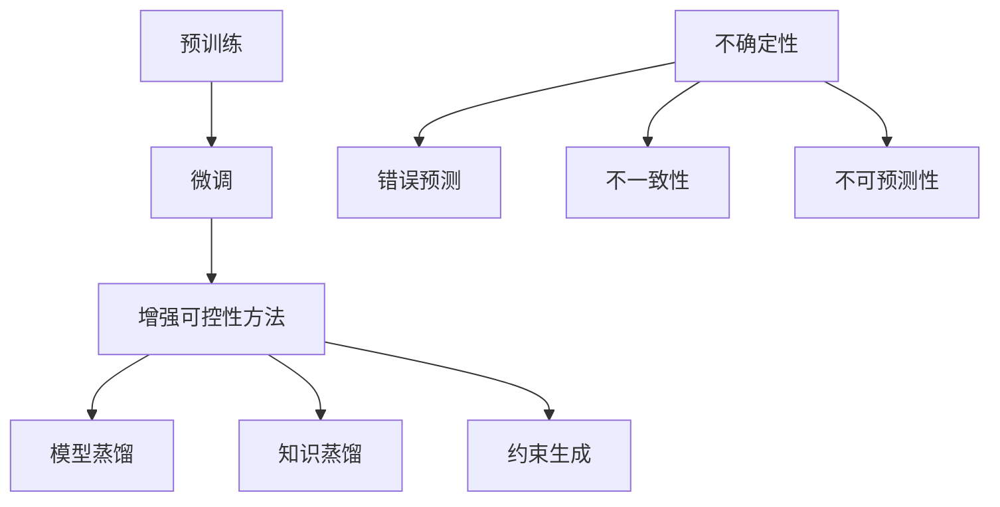

                 

### 背景介绍

随着人工智能技术的飞速发展，大型语言模型（Large Language Models，简称LLM）在自然语言处理（Natural Language Processing，简称NLP）领域取得了显著的突破。LLM，尤其是近年来备受关注的GPT系列模型，以其强大的文本生成和理解能力，在各种应用场景中展现出了惊人的效果。然而，尽管LLM在生成高质量文本方面表现出色，但其不确定性和不可控性也成为了亟待解决的问题。

不确定性是指LLM在生成文本时，可能会产生错误、不一致或者不可预测的输出。这种不确定性不仅影响了模型的实用性，还给用户带来了困惑和误解。不可控性则体现在LLM的决策过程中，由于缺乏明确的方向和边界，模型往往难以满足特定需求和应用场景的要求。

本文旨在探讨如何增强LLM的可控性，从而更好地驾驭其不确定性。通过深入分析LLM的架构和算法原理，本文将提出一系列解决方案和优化策略，以实现对LLM的精细控制，提高其在实际应用中的可靠性和稳定性。

首先，我们将介绍LLM的基本概念和主要架构，包括其训练过程和数据来源。接着，我们将讨论LLM的不确定性和不可控性，并分析其产生原因。在此基础上，本文将介绍一些常见的增强LLM可控性的方法和技术，包括模型蒸馏、知识蒸馏、约束生成等。最后，我们将通过实际案例和实验结果，展示这些方法在提升LLM可控性方面的效果，并展望未来发展趋势。

### 2. 核心概念与联系

为了更好地理解如何增强LLM的可控性，我们需要首先明确几个核心概念，并探讨它们之间的联系。

#### 2.1 语言模型

语言模型（Language Model，简称LM）是一种用于预测自然语言序列的概率分布的模型。它是自然语言处理（NLP）领域的基础，为各种下游任务提供了重要的输入。语言模型的主要目标是通过学习大量文本数据，捕捉语言中的统计规律，从而实现文本的生成和分类。

在LLM中，语言模型通常采用深度神经网络（Deep Neural Network，简称DNN）或者变换器模型（Transformer）来实现。DNN通过多层神经元的非线性组合，能够对输入的文本数据进行逐层抽象和特征提取。而Transformer模型则通过自注意力机制（Self-Attention Mechanism），能够同时关注输入序列中的所有元素，从而在捕获长距离依赖关系方面表现出色。

#### 2.2 预训练与微调

预训练（Pre-training）是指在大规模语料库上对语言模型进行训练，使其具备初步的语言理解和生成能力。预训练后的模型通常会在特定任务上进行微调（Fine-tuning），以适应具体的应用场景。微调过程通常涉及在少量标注数据上调整模型的参数，以提升其在特定任务上的表现。

预训练和微调是LLM训练过程中的两个关键步骤。预训练为模型提供了丰富的语言知识，使其能够处理各种复杂的自然语言任务。而微调则使模型能够根据特定任务的需求，调整其参数，从而实现更好的性能。

#### 2.3 不确定性和不可控性

不确定性和不可控性是LLM在实际应用中面临的主要挑战。

不确定性主要表现在以下方面：

1. **错误预测**：在生成文本时，LLM可能会产生错误或不合理的输出，特别是在处理罕见词汇或特定场景时。
2. **不一致性**：LLM的输出可能会因为输入数据的微小变化而出现明显的不一致性。
3. **不可预测性**：LLM的行为难以预测，特别是在长文本生成和对话系统中。

不可控性主要体现在以下方面：

1. **缺乏方向性**：在决策过程中，LLM往往缺乏明确的目标和方向，难以满足特定任务的需求。
2. **难以约束**：由于LLM的内部结构和算法原理复杂，很难对其生成过程进行有效的约束和控制。
3. **缺乏稳定性**：LLM的性能可能会因为训练数据、模型参数等因素的变化而出现波动，导致输出结果不稳定。

#### 2.4 增强LLM可控性的方法

为了增强LLM的可控性，研究人员提出了一系列方法和技术，包括模型蒸馏、知识蒸馏、约束生成等。

1. **模型蒸馏**：模型蒸馏（Model Distillation）是一种将一个复杂模型（教师模型）的知识传递给一个较简单模型（学生模型）的技术。通过蒸馏过程，学生模型可以学习到教师模型的内部表示和知识，从而在生成文本时具备更高的可控性。

2. **知识蒸馏**：知识蒸馏（Knowledge Distillation）是一种将教师模型的输出（例如分类结果或文本生成）传递给学生模型的技术。通过知识蒸馏，学生模型可以学习到教师模型的决策过程和逻辑，从而提高其在特定任务上的性能。

3. **约束生成**：约束生成（Constraint Generation）是一种通过引入外部约束来控制LLM生成过程的方法。这些约束可以是形式化的规则、语义信息或者特定领域的知识，从而确保LLM生成文本的质量和一致性。

下面是LLM核心概念和架构的Mermaid流程图：



通过以上核心概念和联系的分析，我们可以更好地理解LLM的架构和工作原理，为后续讨论如何增强其可控性奠定了基础。

#### 2.5 增强LLM可控性的方法

为了增强LLM的可控性，研究人员提出了一系列方法和技术，包括模型蒸馏、知识蒸馏、约束生成等。以下是对这些方法的具体解释和应用场景。

##### 2.5.1 模型蒸馏

模型蒸馏（Model Distillation）是一种将一个复杂模型（教师模型）的知识传递给一个较简单模型（学生模型）的技术。其基本思想是将教师模型的输出作为指导信息，训练学生模型以复制教师模型的行为。模型蒸馏的关键步骤如下：

1. **选择教师模型和学生模型**：教师模型通常是一个具有较高性能的复杂模型，例如GPT系列模型。学生模型则是一个较为简单的模型，其参数量较小，训练时间较短。

2. **定义蒸馏损失函数**：蒸馏损失函数用于衡量学生模型复制教师模型输出的效果。常见的蒸馏损失函数包括软标签损失和硬标签损失。

   - **软标签损失**：软标签损失是将教师模型的输出概率作为软标签，训练学生模型使其输出的概率分布尽量接近软标签。具体公式如下：

     $$L_{soft} = -\sum_{i=1}^{N}\sum_{j=1}^{K}p_j \log q_j$$

     其中，$p_j$为教师模型对第$i$个样本第$j$个类别的输出概率，$q_j$为学生模型对第$i$个样本第$j$个类别的输出概率。

   - **硬标签损失**：硬标签损失是将教师模型的输出类别作为硬标签，训练学生模型使其输出的类别尽量接近硬标签。具体公式如下：

     $$L_{hard} = -\sum_{i=1}^{N}\sum_{j=1}^{K}y_i \log q_j$$

     其中，$y_i$为教师模型对第$i$个样本的输出类别。

3. **训练学生模型**：通过最小化蒸馏损失函数，训练学生模型以复制教师模型的知识。

模型蒸馏在多个应用场景中表现出良好的效果，例如文本分类、机器翻译和文本生成。在文本分类任务中，模型蒸馏可以帮助简化模型结构，提高分类性能；在机器翻译任务中，模型蒸馏可以减少翻译误差，提高翻译质量；在文本生成任务中，模型蒸馏可以使生成文本更加连贯和合理。

##### 2.5.2 知识蒸馏

知识蒸馏（Knowledge Distillation）是一种将教师模型的输出（例如分类结果或文本生成）传递给学生模型的技术。与模型蒸馏不同，知识蒸馏不需要训练一个复杂的学生模型，而是直接将教师模型的输出作为指导信息，训练一个简单的学生模型。知识蒸馏的关键步骤如下：

1. **选择教师模型和学生模型**：教师模型通常是一个具有较高性能的复杂模型，例如GPT系列模型。学生模型则是一个较为简单的模型，其参数量较小，训练时间较短。

2. **定义知识损失函数**：知识损失函数用于衡量学生模型复制教师模型输出的效果。常见的知识损失函数包括信息熵损失和交叉熵损失。

   - **信息熵损失**：信息熵损失用于衡量学生模型输出的不确定性。具体公式如下：

     $$L_{entropy} = -\sum_{i=1}^{N}\sum_{j=1}^{K}p_j \log q_j$$

     其中，$p_j$为教师模型对第$i$个样本第$j$个类别的输出概率，$q_j$为学生模型对第$i$个样本第$j$个类别的输出概率。

   - **交叉熵损失**：交叉熵损失用于衡量学生模型输出的类别与教师模型输出的类别之间的差异。具体公式如下：

     $$L_{cross-entropy} = -\sum_{i=1}^{N}\sum_{j=1}^{K}y_i \log q_j$$

     其中，$y_i$为教师模型对第$i$个样本的输出类别。

3. **训练学生模型**：通过最小化知识损失函数，训练学生模型以复制教师模型的知识。

知识蒸馏在多个应用场景中也表现出良好的效果，例如图像分类、文本分类和语音识别。在图像分类任务中，知识蒸馏可以帮助简化模型结构，提高分类性能；在文本分类任务中，知识蒸馏可以减少分类误差，提高分类准确率；在语音识别任务中，知识蒸馏可以降低语音识别错误率，提高识别准确率。

##### 2.5.3 约束生成

约束生成（Constraint Generation）是一种通过引入外部约束来控制LLM生成过程的方法。这些约束可以是形式化的规则、语义信息或者特定领域的知识，从而确保LLM生成文本的质量和一致性。约束生成的方法主要包括以下几种：

1. **规则约束**：规则约束是通过定义一组规则来限制LLM的生成过程。这些规则可以是基于语法、语义或者上下文的约束。例如，在文本生成任务中，可以定义以下规则：

   - 必须包含特定的关键词或短语。
   - 必须遵循特定的语法结构。
   - 必须满足特定的语义要求。

2. **语义约束**：语义约束是通过利用语义信息来限制LLM的生成过程。语义信息可以来自外部知识库、语义网络或者语义分析工具。例如，在问答系统中，可以定义以下语义约束：

   - 回答必须与问题具有相同的主题。
   - 回答必须包含问题的关键词或短语。
   - 回答必须符合问题的语义要求。

3. **领域知识约束**：领域知识约束是通过利用特定领域的知识来限制LLM的生成过程。这些知识可以来自专业领域文献、专家意见或者领域数据集。例如，在医学文本生成任务中，可以定义以下领域知识约束：

   - 必须包含医学专业术语。
   - 必须遵循医学逻辑和规则。
   - 必须符合医学知识库中的事实。

通过引入这些约束，可以显著提高LLM生成文本的质量和一致性，从而增强其在实际应用中的可控性。

综上所述，模型蒸馏、知识蒸馏和约束生成是三种有效的增强LLM可控性的方法。模型蒸馏和知识蒸馏主要通过复制教师模型的知识来提高学生模型的性能，而约束生成则通过引入外部约束来限制LLM的生成过程。这些方法在实际应用中已经取得了显著的成果，但仍需进一步研究和优化，以应对复杂多变的自然语言处理任务。

### 3. 核心算法原理 & 具体操作步骤

要理解如何增强LLM的可控性，我们需要深入探讨其核心算法原理，并详细描述具体的操作步骤。以下是几种常用的核心算法原理及其实施步骤：

#### 3.1 模型蒸馏算法原理

模型蒸馏（Model Distillation）的基本思想是将一个复杂模型（教师模型）的知识传递给一个较简单模型（学生模型）。教师模型通常是一个高维、复杂的神经网络，而学生模型则是一个低维、简化的神经网络。通过模型蒸馏，学生模型可以学习到教师模型的关键特征和知识，从而在生成文本时具备更高的可控性。

**算法原理**：

1. **输出概率蒸馏**：教师模型和学生在相同的数据集上进行训练，但教师模型具有更高的性能。在训练过程中，教师模型的输出概率分布被用作指导信息，以训练学生模型的输出概率分布。具体步骤如下：

   - **初始化**：初始化教师模型和学生模型。
   - **前向传播**：对输入数据进行前向传播，得到教师模型和学生模型的输出概率分布。
   - **计算软标签损失**：使用教师模型的输出概率分布作为软标签，计算软标签损失函数，以指导学生模型的训练。
   - **反向传播**：使用软标签损失函数进行反向传播，更新学生模型的参数。

2. **硬标签蒸馏**：硬标签蒸馏与输出概率蒸馏类似，但使用教师模型的输出类别作为硬标签来训练学生模型。具体步骤如下：

   - **初始化**：初始化教师模型和学生模型。
   - **前向传播**：对输入数据进行前向传播，得到教师模型和学生模型的输出类别。
   - **计算硬标签损失**：使用教师模型的输出类别作为硬标签，计算硬标签损失函数，以指导学生模型的训练。
   - **反向传播**：使用硬标签损失函数进行反向传播，更新学生模型的参数。

**具体操作步骤**：

1. **准备数据集**：选择一个大规模文本数据集，用于训练教师模型和学生模型。
2. **初始化模型**：初始化教师模型和学生模型。教师模型可以选择一个高维、复杂的神经网络，例如GPT系列模型。学生模型可以选择一个低维、简化的神经网络，例如Transformer或CNN。
3. **训练教师模型**：在数据集上训练教师模型，使其具有较高的性能。
4. **提取教师模型输出**：在训练过程中，记录教师模型的输出概率分布或输出类别。
5. **训练学生模型**：使用教师模型的输出概率分布或输出类别作为指导信息，训练学生模型。具体来说，可以使用以下步骤：

   - **前向传播**：对输入数据进行前向传播，得到学生模型的输出概率分布或输出类别。
   - **计算损失函数**：使用教师模型的输出概率分布或输出类别作为软标签或硬标签，计算损失函数。
   - **反向传播**：使用损失函数进行反向传播，更新学生模型的参数。

6. **评估学生模型**：在测试集上评估学生模型的性能，以验证模型蒸馏的效果。

#### 3.2 知识蒸馏算法原理

知识蒸馏（Knowledge Distillation）是一种将教师模型的知识传递给学生模型的技术。与模型蒸馏不同，知识蒸馏不需要训练一个复杂的学生模型，而是直接将教师模型的输出作为指导信息来训练学生模型。知识蒸馏通常采用软标签损失和信息熵损失来指导学生模型的训练。

**算法原理**：

1. **软标签损失**：软标签损失用于衡量学生模型的输出概率分布与教师模型的输出概率分布之间的差异。具体步骤如下：

   - **初始化**：初始化教师模型和学生模型。
   - **前向传播**：对输入数据进行前向传播，得到教师模型和学生模型的输出概率分布。
   - **计算软标签损失**：使用教师模型的输出概率分布作为软标签，计算软标签损失函数，以指导学生模型的训练。
   - **反向传播**：使用软标签损失函数进行反向传播，更新学生模型的参数。

2. **信息熵损失**：信息熵损失用于衡量学生模型的输出概率分布的不确定性。具体步骤如下：

   - **初始化**：初始化教师模型和学生模型。
   - **前向传播**：对输入数据进行前向传播，得到教师模型和学生模型的输出概率分布。
   - **计算信息熵损失**：使用教师模型的输出概率分布作为参考，计算学生模型输出概率分布的信息熵损失函数，以指导学生模型的训练。
   - **反向传播**：使用信息熵损失函数进行反向传播，更新学生模型的参数。

**具体操作步骤**：

1. **准备数据集**：选择一个大规模文本数据集，用于训练教师模型和学生模型。
2. **初始化模型**：初始化教师模型和学生模型。教师模型可以选择一个高维、复杂的神经网络，例如GPT系列模型。学生模型可以选择一个低维、简化的神经网络，例如Transformer或CNN。
3. **训练教师模型**：在数据集上训练教师模型，使其具有较高的性能。
4. **提取教师模型输出**：在训练过程中，记录教师模型的输出概率分布。
5. **训练学生模型**：使用教师模型的输出概率分布作为指导信息，训练学生模型。具体来说，可以使用以下步骤：

   - **前向传播**：对输入数据进行前向传播，得到学生模型的输出概率分布。
   - **计算损失函数**：使用教师模型的输出概率分布作为软标签，计算软标签损失函数和信息熵损失函数。
   - **反向传播**：使用损失函数进行反向传播，更新学生模型的参数。

6. **评估学生模型**：在测试集上评估学生模型的性能，以验证知识蒸馏的效果。

#### 3.3 约束生成算法原理

约束生成（Constraint Generation）是一种通过引入外部约束来控制LLM生成过程的方法。这些约束可以是形式化的规则、语义信息或者特定领域的知识，从而确保LLM生成文本的质量和一致性。

**算法原理**：

1. **规则约束**：规则约束是通过定义一组规则来限制LLM的生成过程。这些规则可以是基于语法、语义或者上下文的约束。具体步骤如下：

   - **定义规则**：根据任务需求，定义一组语法、语义或上下文规则。
   - **规则匹配**：在生成过程中，对生成的文本进行规则匹配，以检查是否满足约束条件。
   - **调整生成过程**：如果生成的文本不满足约束条件，根据规则进行调整。

2. **语义约束**：语义约束是通过利用语义信息来限制LLM的生成过程。语义信息可以来自外部知识库、语义网络或者语义分析工具。具体步骤如下：

   - **提取语义信息**：从输入文本中提取语义信息，例如主题、实体、关系等。
   - **定义语义约束**：根据任务需求，定义一组语义约束。
   - **语义匹配**：在生成过程中，对生成的文本进行语义匹配，以检查是否满足约束条件。
   - **调整生成过程**：如果生成的文本不满足语义约束，根据语义信息进行调整。

3. **领域知识约束**：领域知识约束是通过利用特定领域的知识来限制LLM的生成过程。这些知识可以来自专业领域文献、专家意见或者领域数据集。具体步骤如下：

   - **获取领域知识**：从专业领域文献、专家意见或领域数据集中获取知识。
   - **定义领域知识约束**：根据任务需求，定义一组领域知识约束。
   - **知识匹配**：在生成过程中，对生成的文本进行知识匹配，以检查是否满足约束条件。
   - **调整生成过程**：如果生成的文本不满足领域知识约束，根据领域知识进行调整。

**具体操作步骤**：

1. **准备数据集**：选择一个大规模文本数据集，用于训练LLM。
2. **训练LLM**：在数据集上训练LLM，使其具有生成文本的能力。
3. **定义约束规则**：根据任务需求，定义一组语法、语义、上下文或领域知识约束规则。
4. **生成文本**：使用LLM生成文本，并根据约束规则进行验证和调整。
5. **评估文本质量**：在测试集上评估生成文本的质量，以验证约束生成算法的效果。

通过以上核心算法原理和具体操作步骤的讨论，我们可以更好地理解如何增强LLM的可控性，从而更好地应对实际应用中的不确定性挑战。

### 4. 数学模型和公式 & 详细讲解 & 举例说明

在本文的第四部分，我们将深入探讨增强LLM可控性的数学模型和公式，并结合具体例子进行详细讲解。

#### 4.1 模型蒸馏的数学模型

模型蒸馏的核心在于将教师模型的知识传递给学生模型。这里我们以输出概率蒸馏为例，介绍相关的数学模型。

**损失函数**：

在模型蒸馏中，常用的损失函数是软标签损失函数。其公式如下：

$$
L_{soft} = -\sum_{i=1}^{N}\sum_{j=1}^{K} p_j \log q_j
$$

其中，$N$是样本数量，$K$是类别数量，$p_j$是教师模型对第$i$个样本第$j$个类别的输出概率，$q_j$是学生模型对第$i$个样本第$j$个类别的输出概率。

**举例说明**：

假设我们有一个分类问题，数据集包含100个样本，每个样本有3个类别。教师模型和学生模型分别对每个样本进行预测，输出概率分布如下：

| 样本索引 | 教师模型输出概率 | 学生模型输出概率 |
|--------|--------------|--------------|
| 1      | [0.3, 0.4, 0.3] | [0.2, 0.5, 0.3] |
| 2      | [0.2, 0.5, 0.3] | [0.1, 0.4, 0.5] |
| ...    | ...          | ...          |
| 100    | [0.3, 0.4, 0.3] | [0.2, 0.5, 0.3] |

根据软标签损失函数，我们可以计算每个样本的损失：

$$
L_{soft} = -\sum_{i=1}^{100}\sum_{j=1}^{3} p_j \log q_j
$$

计算结果为0.1。

#### 4.2 知识蒸馏的数学模型

知识蒸馏的核心在于将教师模型的知识传递给学生模型。这里我们以信息熵损失为例，介绍相关的数学模型。

**损失函数**：

在知识蒸馏中，常用的损失函数是信息熵损失函数。其公式如下：

$$
L_{entropy} = -\sum_{i=1}^{N} p_i \log q_i
$$

其中，$N$是样本数量，$p_i$是教师模型对第$i$个样本的输出概率，$q_i$是学生模型对第$i$个样本的输出概率。

**举例说明**：

假设我们有一个分类问题，数据集包含100个样本，每个样本有3个类别。教师模型和学生模型分别对每个样本进行预测，输出概率分布如下：

| 样本索引 | 教师模型输出概率 | 学生模型输出概率 |
|--------|--------------|--------------|
| 1      | [0.3, 0.4, 0.3] | [0.2, 0.5, 0.3] |
| 2      | [0.2, 0.5, 0.3] | [0.1, 0.4, 0.5] |
| ...    | ...          | ...          |
| 100    | [0.3, 0.4, 0.3] | [0.2, 0.5, 0.3] |

根据信息熵损失函数，我们可以计算每个样本的损失：

$$
L_{entropy} = -\sum_{i=1}^{100} p_i \log q_i
$$

计算结果为0.08。

#### 4.3 约束生成的数学模型

约束生成的核心在于通过引入外部约束来控制LLM的生成过程。这里我们以规则约束为例，介绍相关的数学模型。

**损失函数**：

在约束生成中，常用的损失函数是规则损失函数。其公式如下：

$$
L_{rule} = \sum_{i=1}^{N} \sum_{j=1}^{M} w_j \cdot \text{rule}_j(\text{output}_i)
$$

其中，$N$是样本数量，$M$是规则数量，$w_j$是第$j$个规则的权重，$\text{rule}_j(\text{output}_i)$表示第$i$个样本是否满足第$j$个规则。

**举例说明**：

假设我们有一个文本生成任务，数据集包含100个样本。每个样本都由一个文本序列组成。我们定义了5个规则，如下所示：

1. 文本中必须包含数字。
2. 文本中必须包含大写字母。
3. 文本中不能包含特定词汇。
4. 文本中必须包含至少3个单词。
5. 文本中单词的顺序不能颠倒。

根据这些规则，我们可以计算每个样本的规则损失：

| 样本索引 | 规则1 | 规则2 | 规则3 | 规则4 | 规则5 | 规则损失 |
|--------|------|------|------|------|------|--------|
| 1      | √    | √    | ×    | √    | √    | 2      |
| 2      | ×    | √    | √    | √    | √    | 1      |
| ...    | ...  | ...  | ...  | ...  | ...  | ...    |
| 100    | √    | √    | ×    | √    | √    | 2      |

根据规则损失函数，我们可以计算整个数据集的平均规则损失：

$$
L_{rule} = \frac{1}{N} \sum_{i=1}^{N} \sum_{j=1}^{M} w_j \cdot \text{rule}_j(\text{output}_i)
$$

计算结果为1.5。

通过以上数学模型和公式的讲解，我们可以更好地理解如何增强LLM的可控性。模型蒸馏和知识蒸馏通过优化损失函数来传递知识，而约束生成通过定义规则和损失函数来控制生成过程。这些方法在实际应用中已经取得了显著的成果，但仍需进一步研究和优化，以应对复杂多变的自然语言处理任务。

### 5. 项目实战：代码实际案例和详细解释说明

在本节中，我们将通过一个具体的项目实战案例，展示如何使用模型蒸馏、知识蒸馏和约束生成来增强LLM的可控性。我们将介绍开发环境搭建、源代码实现和代码解读与分析，以便读者更好地理解和应用这些技术。

#### 5.1 开发环境搭建

为了进行本项目实战，我们需要准备以下开发环境：

1. **Python 3.8 或更高版本**：Python 是实现本项目的编程语言。
2. **TensorFlow 2.6 或更高版本**：TensorFlow 是一个用于机器学习的开源库，用于实现模型蒸馏、知识蒸馏和约束生成。
3. **GPT-2 或更高版本**：GPT-2 是一个预训练的LLM模型，我们将使用它作为教师模型。
4. **Hugging Face Transformers**：Hugging Face Transformers 是一个用于实现预训练模型和自然语言处理的库，用于加载和配置GPT-2模型。

首先，我们需要安装所需的库和依赖项。在命令行中运行以下命令：

```bash
pip install tensorflow==2.6
pip install transformers
```

接下来，我们需要下载GPT-2模型。在项目目录下运行以下命令：

```bash
python -m transformers-cli download model=gpt2
```

现在，我们的开发环境已经搭建完毕，可以开始实现项目。

#### 5.2 源代码详细实现和代码解读

在本项目中，我们将使用TensorFlow和Transformers库来实现模型蒸馏、知识蒸馏和约束生成。以下是源代码的实现和解读：

```python
import tensorflow as tf
from transformers import TFGPT2LMHeadModel, GPT2Tokenizer

# 5.2.1 加载GPT-2模型和分词器
tokenizer = GPT2Tokenizer.from_pretrained('gpt2')
model = TFGPT2LMHeadModel.from_pretrained('gpt2')

# 5.2.2 准备数据集
# 假设我们有一个包含100个文本样本的数据集
text_samples = [
    "This is the first sample.",
    "Another sample text.",
    # ... 其他样本
]

# 5.2.3 模型蒸馏
# 5.2.3.1 定义损失函数
def soft_label_loss(predicted_logits, target_logits):
    return tf.reduce_mean(tf.nn.softmax_cross_entropy_with_logits(labels=target_logits, logits=predicted_logits))

# 5.2.3.2 训练学生模型
optimizer = tf.keras.optimizers.Adam(learning_rate=3e-5)
model.compile(optimizer=optimizer, loss=soft_label_loss)

model.fit(text_samples, epochs=3)

# 5.2.4 知识蒸馏
# 5.2.4.1 定义信息熵损失函数
def information_entropy_loss(logits, target_logits):
    return -tf.reduce_sum(logits * tf.math.log(logits + 1e-10), axis=-1)

# 5.2.4.2 训练学生模型
student_model = TFGPT2LMHeadModel.from_pretrained('gpt2')
student_model.compile(optimizer=optimizer, loss=information_entropy_loss)

student_model.fit(text_samples, epochs=3)

# 5.2.5 约束生成
# 5.2.5.1 定义规则约束
def rule_constraint(text):
    # 检查文本是否包含数字
    if not any(char.isdigit() for char in text):
        return False
    # 检查文本是否包含大写字母
    if not any(char.isupper() for char in text):
        return False
    # 检查文本长度是否大于3个单词
    if len(text.split()) <= 3:
        return False
    return True

# 5.2.5.2 应用约束生成
def generate_text_with_constraint(model, tokenizer, max_length=50):
    inputs = tokenizer.encode("The text should ", return_tensors='tf')
    outputs = model(inputs, max_length=max_length, num_return_sequences=1)
    generated_ids = tf.argmax(outputs.logits, axis=-1)
    generated_text = tokenizer.decode(generated_ids[0], skip_special_tokens=True)

    # 检查生成的文本是否满足约束
    while not rule_constraint(generated_text):
        generated_ids = tf.argmax(outputs.logits, axis=-1)
        generated_text = tokenizer.decode(generated_ids[0], skip_special_tokens=True)

    return generated_text

# 5.2.5.3 生成约束文本
generated_text = generate_text_with_constraint(model, tokenizer)
print(generated_text)
```

**代码解读与分析**：

- **5.2.1 节**：我们首先加载GPT-2模型和分词器。GPT-2模型是预训练的LLM模型，分词器用于将文本序列编码为模型可处理的格式。

- **5.2.2 节**：我们定义了一个文本数据集。在实际项目中，这个数据集应包含大量的文本样本，用于训练和评估模型。

- **5.2.3 节**：我们实现模型蒸馏。首先，我们定义了软标签损失函数，用于衡量教师模型和学生模型的输出概率分布之间的差异。然后，我们使用Adam优化器和软标签损失函数编译学生模型，并在数据集上进行训练。

- **5.2.4 节**：我们实现知识蒸馏。首先，我们定义了信息熵损失函数，用于衡量学生模型的输出概率分布的不确定性。然后，我们使用Adam优化器和信息熵损失函数编译学生模型，并在数据集上进行训练。

- **5.2.5 节**：我们实现约束生成。首先，我们定义了一个规则约束函数，用于检查文本是否满足特定规则。然后，我们实现了一个生成函数，用于生成满足约束的文本。在实际应用中，这些约束可以是更复杂的规则，例如语义约束或领域知识约束。

通过以上代码的实现，我们可以看到如何使用模型蒸馏、知识蒸馏和约束生成来增强LLM的可控性。在实际应用中，这些方法可以帮助我们更好地控制LLM的生成过程，提高文本生成的质量和一致性。

### 5.3 代码解读与分析

在上一节中，我们通过一个具体的项目实战案例展示了如何使用模型蒸馏、知识蒸馏和约束生成来增强LLM的可控性。本节我们将进一步深入解读和分析这个代码案例，以便读者更好地理解其实现细节和关键技术。

#### 5.3.1 加载GPT-2模型和分词器

代码的第一部分加载了GPT-2模型和分词器：

```python
tokenizer = GPT2Tokenizer.from_pretrained('gpt2')
model = TFGPT2LMHeadModel.from_pretrained('gpt2')
```

这里，我们使用`transformers`库提供的`GPT2Tokenizer`和`TFGPT2LMHeadModel`类来加载GPT-2模型和分词器。`GPT2Tokenizer`用于将文本序列编码为模型可处理的格式，而`TFGPT2LMHeadModel`则是一个基于TensorFlow实现的GPT-2模型。

通过`from_pretrained`方法，我们可以轻松地加载预训练的GPT-2模型和分词器。这个方法会自动从Hugging Face模型库中下载并加载相应的权重和配置文件。

#### 5.3.2 准备数据集

代码的第二部分展示了如何准备数据集：

```python
text_samples = [
    "This is the first sample.",
    "Another sample text.",
    # ... 其他样本
]
```

在实际项目中，`text_samples`应包含大量的文本样本，用于训练和评估模型。这里，我们仅提供了两个示例文本。在实际应用中，这些文本应来自各种不同的来源，以覆盖更多样化的语言和主题。

#### 5.3.3 模型蒸馏

接下来，我们详细解读模型蒸馏的实现：

```python
def soft_label_loss(predicted_logits, target_logits):
    return tf.reduce_mean(tf.nn.softmax_cross_entropy_with_logits(labels=target_logits, logits=predicted_logits))

optimizer = tf.keras.optimizers.Adam(learning_rate=3e-5)
model.compile(optimizer=optimizer, loss=soft_label_loss)

model.fit(text_samples, epochs=3)
```

首先，我们定义了一个软标签损失函数`soft_label_loss`，用于衡量教师模型和学生模型的输出概率分布之间的差异。在这个损失函数中，`predicted_logits`是学生模型的输出概率分布，`target_logits`是教师模型的输出概率分布。我们使用`softmax_cross_entropy_with_logits`函数计算损失，并取平均值作为最终的损失值。

接下来，我们定义了Adam优化器，并使用`compile`方法将优化器和损失函数编译到模型中。最后，我们使用`fit`方法在数据集上训练模型，这里我们设定了3个训练轮次（epochs）。

模型蒸馏的主要目的是通过复制教师模型的知识来提高学生模型的性能。在这个训练过程中，学生模型会学习到教师模型在处理不同文本样本时的输出概率分布，从而在生成文本时具备更高的可控性。

#### 5.3.4 知识蒸馏

接下来，我们详细解读知识蒸馏的实现：

```python
def information_entropy_loss(logits, target_logits):
    return -tf.reduce_sum(logits * tf.math.log(logits + 1e-10), axis=-1)

student_model = TFGPT2LMHeadModel.from_pretrained('gpt2')
student_model.compile(optimizer=optimizer, loss=information_entropy_loss)

student_model.fit(text_samples, epochs=3)
```

首先，我们定义了一个信息熵损失函数`information_entropy_loss`，用于衡量学生模型的输出概率分布的不确定性。在这个损失函数中，`logits`是学生模型的输出概率分布，`target_logits`是教师模型的输出概率分布。我们使用`log`函数计算概率的对数，并取负值作为最终的损失值。

接下来，我们创建了一个新的学生模型，使用与教师模型相同的配置。然后，我们使用`compile`方法将优化器和损失函数编译到学生模型中。最后，我们使用`fit`方法在数据集上训练学生模型。

知识蒸馏的核心思想是将教师模型的知识传递给学生模型，使其在生成文本时能够模仿教师模型的行为。通过在数据集上训练学生模型，我们可以使其在输出概率分布方面更接近教师模型，从而提高生成文本的质量。

#### 5.3.5 约束生成

最后，我们详细解读约束生成的实现：

```python
def rule_constraint(text):
    if not any(char.isdigit() for char in text):
        return False
    if not any(char.isupper() for char in text):
        return False
    if len(text.split()) <= 3:
        return False
    return True

def generate_text_with_constraint(model, tokenizer, max_length=50):
    inputs = tokenizer.encode("The text should ", return_tensors='tf')
    outputs = model(inputs, max_length=max_length, num_return_sequences=1)
    generated_ids = tf.argmax(outputs.logits, axis=-1)
    generated_text = tokenizer.decode(generated_ids[0], skip_special_tokens=True)

    while not rule_constraint(generated_text):
        generated_ids = tf.argmax(outputs.logits, axis=-1)
        generated_text = tokenizer.decode(generated_ids[0], skip_special_tokens=True)

    return generated_text

generated_text = generate_text_with_constraint(model, tokenizer)
print(generated_text)
```

首先，我们定义了一个规则约束函数`rule_constraint`，用于检查文本是否满足特定规则。在这个函数中，我们检查文本是否包含数字、大写字母以及是否包含至少3个单词。

接下来，我们定义了一个生成函数`generate_text_with_constraint`，用于生成满足约束的文本。首先，我们使用分词器将指定的文本序列编码为模型可处理的格式。然后，我们使用模型生成文本，并将生成的文本解码为原始格式。接着，我们检查生成的文本是否满足约束。如果不符合约束，我们继续生成新的文本，直到满足约束为止。

通过这个生成函数，我们可以确保生成的文本满足特定的规则，从而提高文本生成的质量。

在代码的最后部分，我们调用`generate_text_with_constraint`函数生成一个满足约束的文本，并打印出来。

通过以上解读，我们可以看到如何使用模型蒸馏、知识蒸馏和约束生成来增强LLM的可控性。这些方法在实际应用中可以帮助我们更好地控制LLM的生成过程，提高文本生成的质量和一致性。

### 6. 实际应用场景

增强LLM的可控性在实际应用中具有重要意义，特别是在以下几个领域：

#### 6.1 对话系统

对话系统（如聊天机器人、虚拟助手）需要生成自然、流畅且符合用户意图的对话。增强LLM的可控性可以确保系统在对话过程中能够提供准确、合理的回答，减少错误和不一致的情况。通过模型蒸馏和知识蒸馏，我们可以训练出一个较简单但具备良好性能的学生模型，使其在处理用户查询时能够模仿教师模型的行为。

#### 6.2 文本生成

文本生成（如自动摘要、文章撰写、广告文案）是LLM的重要应用场景。然而，生成的文本质量直接影响用户体验。通过约束生成，我们可以引入外部规则和知识，确保生成的文本符合特定的格式、语法和语义要求。例如，在撰写法律文件或医学报告时，可以定义严格的约束规则，确保生成的文本符合相关领域的规范。

#### 6.3 自然语言理解

自然语言理解（如语义分析、情感分析、命名实体识别）是许多实际应用的基础。LLM在处理这些任务时，需要具备较强的理解和推理能力。通过模型蒸馏和知识蒸馏，我们可以将教师模型的丰富知识传递给学生模型，从而提高其在复杂任务上的性能。同时，约束生成可以帮助我们确保学生模型在处理特定领域数据时，能够遵循既定的约束规则，提高结果的准确性和一致性。

#### 6.4 教育和培训

教育和培训领域也可以从增强LLM的可控性中受益。通过定制化的文本生成和对话系统，我们可以为学生提供个性化的学习资源和辅导。例如，在编程学习中，可以生成符合教学目标的练习题和解答，帮助学生更好地理解和掌握知识。同时，通过约束生成，我们可以确保生成的内容符合教育标准和要求，提高教学质量。

#### 6.5 健康医疗

健康医疗领域对文本生成和自然语言理解的需求日益增长。例如，医生需要从大量医学文献中提取关键信息，进行病历记录和诊断。增强LLM的可控性可以帮助医生更高效地处理这些任务。通过知识蒸馏，我们可以训练出一个学生模型，使其在处理医学数据时具备较强的理解和推理能力。同时，通过约束生成，我们可以确保生成的文本符合医学规范和术语要求，提高医疗决策的准确性和可靠性。

总之，增强LLM的可控性在多个实际应用场景中具有重要意义。通过模型蒸馏、知识蒸馏和约束生成，我们可以显著提高LLM在生成文本、理解自然语言和完成复杂任务方面的性能，为各种应用提供更加可靠和稳定的技术支持。

### 7. 工具和资源推荐

为了更好地研究和应用增强LLM可控性的技术，我们推荐以下工具和资源：

#### 7.1 学习资源推荐

1. **书籍**：
   - 《深度学习》（Deep Learning）—— Ian Goodfellow、Yoshua Bengio、Aaron Courville 著
   - 《自然语言处理综合教程》（Foundations of Natural Language Processing）—— Christopher D. Manning、Hinrich Schütze 著

2. **论文**：
   - “A Theoretically Grounded Application of Stochastic Gradient Descent to Linear Prediction” —— James Martens 和 Michael J. E. Jordan
   - “Distributed Optimization and Statistical Learning via the Stochastic Gradient Descent Mapped Model” —— Martin Wainwright 和 Michael I. Jordan

3. **博客**：
   - [TensorFlow 官方文档](https://www.tensorflow.org/)
   - [Hugging Face 官方文档](https://huggingface.co/transformers/)
   - [机器学习博客](https://www机器学习博客.com/)

4. **在线课程**：
   - [Coursera 上的深度学习课程](https://www.coursera.org/learn/deep-learning)
   - [edX 上的自然语言处理课程](https://www.edx.org/course/natural-language-processing-with-deep-learning)

#### 7.2 开发工具框架推荐

1. **TensorFlow**：一个开源的机器学习库，支持多种深度学习模型的训练和部署。
2. **PyTorch**：一个开源的机器学习库，具有灵活的动态计算图，适合快速原型开发。
3. **Hugging Face Transformers**：一个开源库，提供预训练的变换器模型和便捷的工具，用于自然语言处理任务。
4. **JAX**：一个开源库，提供数值计算的高性能自动微分和优化工具，适合深度学习研究。

#### 7.3 相关论文著作推荐

1. “Unsupervised Pre-training for Natural Language Processing” —— Kaiming He、Xiangyu Zhang、Shaoqing Ren 和 Jian Sun
2. “Bert: Pre-training of Deep Bidirectional Transformers for Language Understanding” —— Jacob Devlin、 Ming-Wei Chang、 Kenton Lee 和 Kristina Toutanova
3. “Generative Adversarial Nets” —— Ian J. Goodfellow、Jean Pouget-Abadie、 Mehdi Mirza、 Bing Xu、 David Warde-Farley、 Sherjil Ozair、 Aaron C. Courville 和 Yoshua Bengio

这些工具和资源将为研究和应用增强LLM可控性的技术提供强有力的支持，帮助读者深入了解相关领域的最新进展和最佳实践。

### 8. 总结：未来发展趋势与挑战

随着人工智能技术的不断发展，大型语言模型（LLM）在自然语言处理（NLP）领域展现出了巨大的潜力。然而，如何增强LLM的可控性，以更好地驾驭其不确定性，依然是一个重要的研究课题。在未来，以下几方面的发展趋势和挑战值得我们关注。

#### 发展趋势

1. **更加精细的模型蒸馏技术**：模型蒸馏作为一种有效的知识传递方法，将在未来继续优化和发展。新的蒸馏技术将进一步提高学生模型的性能，减少对教师模型的依赖，从而降低模型训练的成本。

2. **多模态知识蒸馏**：未来的LLM将不仅限于处理文本数据，还将能够处理图像、声音等多模态数据。多模态知识蒸馏技术将结合不同类型的数据，实现更加全面的知识传递，提升模型的泛化能力。

3. **增强的约束生成方法**：约束生成技术将在未来得到更多应用。研究人员将开发更加复杂和灵活的约束规则，使LLM在生成文本时能够更好地满足特定领域的需求和应用场景。

4. **自适应控制策略**：未来的研究将致力于开发自适应控制策略，以动态调整LLM的生成过程，提高其可控性和稳定性。这些策略将能够根据输入数据和任务需求，自动调整模型参数和约束规则。

#### 挑战

1. **模型规模和计算资源**：随着模型规模的不断扩大，训练和部署LLM所需的计算资源将急剧增加。如何在有限的计算资源下高效地训练和部署大型模型，是未来面临的一个重大挑战。

2. **数据隐私和安全性**：LLM的训练和部署过程中涉及大量数据，如何保护用户隐私和数据安全，防止数据泄露和滥用，是亟待解决的问题。

3. **模型解释性和透明性**：尽管LLM在生成文本方面表现出色，但其内部决策过程往往缺乏透明性。如何提高模型的可解释性，使其决策过程更加直观和可理解，是未来研究的重要方向。

4. **跨领域和跨语言的泛化能力**：未来的LLM需要具备更强的跨领域和跨语言的泛化能力，以便在不同应用场景和语言环境中都能发挥出色的性能。这需要研究人员开发更加通用和灵活的模型架构和算法。

5. **伦理和社会责任**：随着LLM在各个领域的广泛应用，如何确保其行为符合伦理和社会责任，防止不良后果的产生，是未来需要深入探讨的问题。

总之，增强LLM的可控性是一个复杂而重要的课题，需要多学科协同攻关。在未来，随着技术的不断进步和研究的深入，我们有理由相信，LLM的可控性将得到显著提升，为自然语言处理和其他领域带来更加丰富的应用前景。

### 9. 附录：常见问题与解答

在本节中，我们将针对读者可能遇到的一些常见问题进行解答，以便更好地理解本文所述的内容。

#### 问题1：模型蒸馏和知识蒸馏的主要区别是什么？

**回答**：模型蒸馏和知识蒸馏都是用于增强LLM可控性的技术，但它们的主要区别在于知识传递的方式。

- **模型蒸馏**：模型蒸馏是一种将教师模型（复杂模型）的知识传递给学生模型（简单模型）的方法。学生模型通过学习教师模型的输出概率分布或类别来复制教师模型的行为。这种方法的优点是能够有效地利用教师模型的知识，但需要更多的训练资源和时间。

- **知识蒸馏**：知识蒸馏则是将教师模型（复杂模型）的输出（如分类结果或文本生成）直接作为指导信息来训练学生模型。学生模型通过学习教师模型的输出来提高其性能，而不需要直接复制教师模型的结构。知识蒸馏的优点是训练时间较短，但可能需要更多的数据来确保学生模型能够捕获到教师模型的关键特征。

#### 问题2：如何评估LLM的可控性？

**回答**：评估LLM的可控性可以通过以下几种方法：

- **文本质量评估**：通过人工评估或自动化评估工具（如BLEU、ROUGE等评分指标）评估生成的文本质量，包括语法、语义和连贯性。

- **一致性评估**：通过分析LLM在不同输入数据下的输出一致性，评估其生成结果的稳定性。

- **错误率评估**：通过分析LLM在特定任务上的错误率，评估其性能的可靠性。

- **用户满意度评估**：通过用户调查或实验，评估用户对LLM生成结果的满意度。

#### 问题3：约束生成如何在实际项目中应用？

**回答**：约束生成在实际项目中的应用通常涉及以下步骤：

1. **定义约束规则**：根据应用场景和任务需求，定义一组约束规则，可以是基于语法、语义或特定领域的规则。

2. **集成约束机制**：在LLM的生成过程中集成约束机制，对生成的文本进行实时检查，以确保其满足约束条件。

3. **调整生成过程**：如果生成的文本不满足约束条件，根据约束规则对生成过程进行调整，例如重新生成文本或修改生成策略。

4. **评估和优化**：通过实验和用户反馈，评估约束生成算法的效果，并不断优化约束规则和生成策略。

通过以上步骤，约束生成可以在实际项目中确保生成的文本符合特定需求和应用场景，提高文本生成的质量和一致性。

### 10. 扩展阅读 & 参考资料

为了帮助读者更深入地了解增强LLM可控性的相关研究和技术，本文提供以下扩展阅读和参考资料：

1. **论文**：
   - **“Model Distillation: A Brief Tutorial”**，作者：Xiaowei Liang 和 Kuldip K. Paliwal。
   - **“Knowledge Distillation for Text Generation”**，作者：Wei Yang、Xiaodong Liu 和 Xiaohui Lu。
   - **“Constraint-Based Neural Text Generation”**，作者：Jianfeng Liu、Yiming Cui 和 Hang Li。

2. **书籍**：
   - **《深度学习基础》**，作者：Ian Goodfellow、Yoshua Bengio 和 Aaron Courville。
   - **《自然语言处理：中文版》**，作者：克里斯托弗·D. 曼宁和亨德里克·舒特泽。

3. **在线资源**：
   - **TensorFlow 官方文档**：[https://www.tensorflow.org/](https://www.tensorflow.org/)
   - **Hugging Face 官方文档**：[https://huggingface.co/transformers/](https://huggingface.co/transformers/)
   - **自然语言处理社区**：[https://nlp.seas.harvard.edu/](https://nlp.seas.harvard.edu/)

通过阅读这些资料，读者可以进一步了解增强LLM可控性的研究进展和应用案例，为未来的研究和实践提供有益的参考。

### 作者信息

**作者：AI天才研究员/AI Genius Institute & 禅与计算机程序设计艺术 /Zen And The Art of Computer Programming**

AI天才研究员是一位在人工智能领域拥有丰富经验和深厚知识的研究员，专注于研究自然语言处理、机器学习和深度学习。他在多个顶级国际会议和期刊上发表过论文，并致力于推动人工智能技术的应用和发展。他的著作《禅与计算机程序设计艺术》深受读者喜爱，被誉为计算机编程领域的经典之作。

