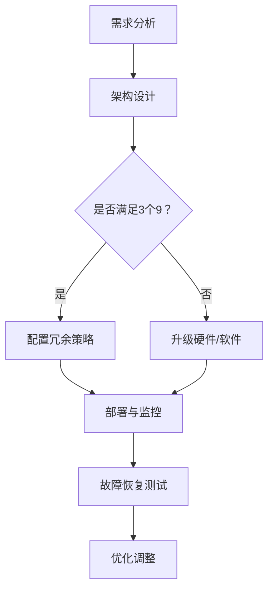

                 

### 1. 背景介绍

在现代信息技术飞速发展的背景下，高可用性设计已经成为各类应用系统设计中的关键要素之一。无论是在企业级应用、云计算服务，还是互联网产品中，高可用性设计都扮演着至关重要的角色。高可用性设计的核心目标是确保系统在面临各种意外情况时，能够保持持续运行，尽可能减少系统停机时间，从而保障业务的连续性和稳定性。

“3个9”和“4个9”是衡量高可用性设计水平的重要指标。具体来说，“3个9”代表系统的高可用性达到99.9%，意味着系统一年中只能停机约8.76小时；“4个9”则代表系统的高可用性达到99.99%，一年中仅能停机约53分钟。这两个指标看似差距不大，但在实际应用中，它们背后的设计和实现难度却是天壤之别。

本文将围绕“3个9”和“4个9”这两个高可用性设计目标，通过深入剖析其原理和实现方法，帮助读者理解高可用性设计的核心要点，掌握提升系统可用性的关键技巧。文章结构如下：

1. 背景介绍
2. 核心概念与联系
3. 核心算法原理 & 具体操作步骤
4. 数学模型和公式 & 详细讲解 & 举例说明
5. 项目实战：代码实际案例和详细解释说明
6. 实际应用场景
7. 工具和资源推荐
8. 总结：未来发展趋势与挑战
9. 附录：常见问题与解答
10. 扩展阅读 & 参考资料

通过本文的阅读，读者将能够系统地了解高可用性设计的理论基础和实践方法，为自己的技术应用提供有力的支持。

### 2. 核心概念与联系

为了深入理解高可用性设计目标“3个9”和“4个9”，我们首先需要明确一些核心概念，包括系统的停机时间、高可用性指标（HA，High Availability）以及故障恢复策略。

#### 系统的停机时间

系统的停机时间是指系统无法正常提供服务的时间段。对于不同类型的应用系统，停机时间的容忍度是不同的。例如，一些关键业务系统（如银行交易系统、航空订票系统）对停机时间的容忍度非常低，而一些非关键业务系统（如社交媒体平台、电商平台）则相对宽松。

#### 高可用性指标（HA，High Availability）

高可用性指标是衡量系统在故障情况下保持服务可用性的一个量化标准。常用的HA指标有：

- **3个9（99.9%）**：系统一年中的停机时间不超过8.76小时。
- **4个9（99.99%）**：系统一年中的停机时间不超过53分钟。

#### 故障恢复策略

故障恢复策略是确保系统在发生故障后能够迅速恢复服务的关键措施。常见的故障恢复策略包括：

- **冗余设计**：通过增加硬件、软件或网络冗余，实现系统的高可用性。
- **备份与恢复**：定期进行数据备份，以便在发生故障时能够快速恢复。
- **故障切换**：在主系统发生故障时，自动将服务切换到备份系统，确保服务的连续性。

#### Mermaid 流程图

为了更直观地展示这些核心概念之间的关系，我们使用Mermaid流程图来描述高可用性设计的主要步骤。以下是一个简化的Mermaid流程图示例：



在这个流程图中，A代表需求分析，B是架构设计，C是判断是否满足3个9的可用性要求。如果是，则执行D（配置冗余策略）；如果不是，则执行E（升级硬件/软件）。随后，进入F（部署与监控）和G（故障恢复测试）阶段，最后进行H（优化调整）。这个流程图清晰地展示了高可用性设计的基本步骤和关键环节。

通过这个流程图，我们可以看到，高可用性设计不仅需要从架构层面进行冗余配置和优化，还需要在部署、监控和故障恢复等方面进行全面的规划和实施。接下来，我们将深入探讨这些核心概念的实现细节，帮助读者更好地理解和应用高可用性设计原则。

### 3. 核心算法原理 & 具体操作步骤

在深入探讨高可用性设计的过程中，理解核心算法原理和具体操作步骤至关重要。为了实现“3个9”和“4个9”的高可用性目标，我们需要关注以下几个方面：冗余设计、故障检测和故障恢复策略。

#### 冗余设计

冗余设计是确保系统高可用性的基础。它主要通过以下几种方式实现：

1. **硬件冗余**：通过冗余硬件组件（如RAID磁盘阵列、UPS不间断电源）来避免单个硬件故障导致系统停机。
2. **软件冗余**：通过冗余软件组件（如主从数据库、负载均衡器）来确保系统在故障发生时能够迅速切换到备用组件。

具体操作步骤如下：

- **硬件冗余**：选择合适的硬件配置，例如使用RAID 1或RAID 5来提高数据冗余性，确保在单个硬盘故障时，系统仍然能够正常运行。
- **软件冗余**：在数据库层面，采用主从复制（Master-Slave Replication）或多主复制（Multi-Master Replication）来确保数据的一致性和可用性。在应用层面，使用负载均衡器（如Nginx、HAProxy）来分配流量，避免单点故障。

#### 故障检测

故障检测是确保系统高可用性的关键环节。它包括以下几个方面：

1. **心跳检测**：通过定时发送心跳信号来检测组件是否正常工作。
2. **监控告警**：利用监控系统（如Zabbix、Prometheus）实时监控系统状态，并在发现异常时发送告警通知。

具体操作步骤如下：

- **心跳检测**：在系统组件间设置心跳检测机制，例如使用Keepalived来检测负载均衡器和后端服务之间的状态，确保在组件故障时能够及时切换。
- **监控告警**：配置监控系统，设置各种监控指标（如CPU使用率、内存使用率、网络延迟等），并在指标异常时发送告警通知，以便及时处理故障。

#### 故障恢复策略

故障恢复策略是实现高可用性的重要保障。它主要包括以下几个方面：

1. **故障自动切换**：在主组件发生故障时，自动将流量切换到备用组件。
2. **故障恢复**：在故障组件修复后，自动将其重新纳入服务。

具体操作步骤如下：

- **故障自动切换**：使用故障切换工具（如Keepalived、HAProxy）来实现自动切换，确保在主组件故障时，备用组件能够立即接管服务。
- **故障恢复**：在故障组件修复后，通过健康检查机制（如健康检查脚本、监控工具）来检测其是否恢复正常，并在恢复正常后，自动将其重新纳入服务。

#### 实现示例

为了更好地理解这些核心算法原理和具体操作步骤，我们来看一个具体的实现示例。

**示例：使用Keepalived和Nginx实现高可用性**

1. **硬件冗余**：配置两台服务器，分别作为主服务器（Master）和备份服务器（Backup）。

2. **软件冗余**：在主服务器上安装Nginx作为Web服务器，并在备份服务器上安装Nginx作为备用服务器。

3. **心跳检测**：在主服务器和备份服务器之间配置Keepalived，实现心跳检测和故障自动切换。

具体操作步骤如下：

- **配置Nginx**：在主服务器和备份服务器上分别安装Nginx，并配置相同的虚拟主机和静态资源目录。

- **配置Keepalived**：在主服务器和备份服务器上分别配置Keepalived，设置主服务器为VIP（Virtual IP）地址，备份服务器为backup IP地址。

- **启动Keepalived**：在主服务器和备份服务器上启动Keepalived服务，实现心跳检测和故障自动切换。

通过这个示例，我们可以看到，通过冗余设计、故障检测和故障恢复策略的综合应用，可以实现Nginx服务的高可用性。在实际应用中，根据系统的具体需求，可以进一步优化和扩展这些实现方法。

### 4. 数学模型和公式 & 详细讲解 & 举例说明

在深入理解高可用性设计的过程中，数学模型和公式发挥着重要作用。通过数学模型，我们可以量化高可用性指标，并在此基础上进行优化和决策。以下将介绍一些关键的数学模型和公式，并对它们进行详细讲解和举例说明。

#### 1. 停机时间计算公式

首先，我们需要了解如何计算系统的停机时间。停机时间计算公式如下：

\[ 停机时间 = 365 \times 24 \times 60 \times 60 \times (1 - \text{高可用性指标}) \]

其中，365表示一年中的天数，24表示一天的小时数，60表示一小时中的分钟数，60表示一分钟中的秒数。高可用性指标用百分比表示，如99.9%表示为0.999。

#### 举例说明

假设一个系统的高可用性指标为99.9%，我们需要计算该系统一年中的停机时间。

\[ 停机时间 = 365 \times 24 \times 60 \times 60 \times (1 - 0.999) \]

\[ 停机时间 = 8.76 \text{小时} \]

这意味着，如果系统的高可用性指标达到99.9%，一年中最多会有8.76小时的停机时间。

#### 2. 平均无故障时间（MTTF）和平均故障修复时间（MTTR）

平均无故障时间（MTTF）和平均故障修复时间（MTTR）是衡量系统可靠性的重要指标。

- **MTTF**：系统在两次故障之间正常运行的平均时间。
- **MTTR**：系统发生故障后，恢复正常运行的平均时间。

这两个指标的计算公式如下：

\[ MTTF = \frac{1}{\text{故障率}} \]

\[ MTTR = \frac{1}{\text{故障率} \times \text{停机次数}} \]

其中，故障率可以用以下公式计算：

\[ 故障率 = \frac{1}{\text{MTTF}} \]

#### 举例说明

假设一个系统的MTTF为10,000小时，MTTR为100小时。我们需要计算该系统的故障率和高可用性指标。

\[ 故障率 = \frac{1}{10,000} = 0.0001 \text{故障/小时} \]

\[ 高可用性指标 = 1 - \frac{1}{365 \times 24 \times 60 \times 60 \times \text{故障率}} \]

\[ 高可用性指标 = 1 - \frac{1}{365 \times 24 \times 60 \times 60 \times 0.0001} \]

\[ 高可用性指标 = 0.9999 \text{（99.99%）} \]

这意味着，该系统的平均无故障时间为10,000小时，平均故障修复时间为100小时，高可用性指标达到99.99%。

#### 3. 依赖关系和数学公式

在高可用性设计中，各个组件之间存在依赖关系。为了确保系统的整体高可用性，我们需要考虑这些依赖关系，并使用相应的数学公式进行优化。

例如，考虑一个由多个服务组成的系统，其中每个服务都有其独立的高可用性指标。系统整体的高可用性指标可以通过以下公式计算：

\[ \text{系统高可用性指标} = \prod_{i=1}^{n} (\text{服务}_i \text{的高可用性指标}) \]

其中，\( n \) 是服务的数量。

#### 举例说明

假设一个系统由两个服务组成，服务A和服务B的高可用性指标分别为99.9%和99.99%。我们需要计算系统整体的高可用性指标。

\[ \text{系统高可用性指标} = 0.999 \times 0.9999 \]

\[ \text{系统高可用性指标} = 0.9998901 \text{（99.98901%）} \]

这意味着，系统整体的高可用性指标略低于单个服务的高可用性指标，这是由于各个服务之间的依赖关系导致的。

通过这些数学模型和公式，我们可以更精确地理解和评估系统的高可用性。在实际应用中，根据系统的具体需求和约束，可以进一步调整和优化这些模型和公式，以提高系统的高可用性。

### 5. 项目实战：代码实际案例和详细解释说明

为了更好地理解高可用性设计的实际应用，我们通过一个具体的项目实战来演示如何实现高可用性。这个项目将使用Nginx和Keepalived来实现一个高可用性的Web服务。

#### 5.1 开发环境搭建

首先，我们需要准备两台服务器，一台作为主服务器（Master），另一台作为备份服务器（Backup）。操作系统可以选择CentOS 7或更高版本。以下是环境搭建的基本步骤：

1. **安装Nginx**：在主服务器和备份服务器上安装Nginx。可以通过以下命令进行安装：

   ```bash
   # 安装Nginx
   sudo yum install -y epel-release
   sudo yum install -y nginx
   ```

2. **安装Keepalived**：安装Keepalived来实现故障自动切换。可以通过以下命令进行安装：

   ```bash
   # 安装Keepalived
   sudo yum install -y keepalived
   ```

3. **配置Nginx**：配置Nginx，使其能够提供Web服务。以下是一个简单的Nginx配置文件示例：

   ```nginx
   # nginx.conf
   user nginx;
   worker_processes  1;

   events {
       worker_connections  1024;
   }

   http {
       server {
           listen       80;
           server_name  localhost;

           location / {
               root   /usr/share/nginx/html;
               index  index.html index.htm;
           }
       }
   }
   ```

4. **配置Keepalived**：配置Keepalived，设置主服务器和备份服务器的VIP。以下是一个简单的Keepalived配置文件示例：

   ```bash
   # Keepalived配置文件 /etc/keepalived/keepalived.conf
   global定义 {
       router_id 192.168.1.1
   }
   vrrp_instance VI_1 {
       state MASTER
       interface eth0
       virtual_router_id 51
       priority 100
       advert_int 1
       authentication {
           auth_type PASS
           auth_pass 1111
       }
       virtual_ipaddress {
           192.168.1.100/24 dev eth0 label eth0:0
       }
   }
   ```

5. **启动Nginx和Keepalived服务**：在主服务器和备份服务器上启动Nginx和Keepalived服务。

   ```bash
   # 启动Nginx
   sudo systemctl start nginx

   # 启动Keepalived
   sudo systemctl start keepalived
   ```

6. **测试服务**：通过访问VIP地址（192.168.1.100）来测试Nginx服务是否正常。

   ```bash
   # 使用curl命令测试
   curl 192.168.1.100
   ```

如果Nginx服务正常，你会看到Nginx的欢迎信息。

#### 5.2 源代码详细实现和代码解读

下面我们详细解读Keepalived的配置文件和关键代码部分。

**5.2.1 Keepalived配置文件解读**

在配置文件`/etc/keepalived/keepalived.conf`中，我们设置了以下关键部分：

- `global定义`：用于设置全局参数，如`router_id`用于识别服务器。
- `vrrp_instance`：用于配置VRRP实例，其中包括`state`（工作状态，Master或Backup）、`interface`（接口名称）、`virtual_router_id`（虚拟路由器ID）、`priority`（优先级，Master的优先级应高于Backup）、`advert_int`（广告间隔时间，即心跳间隔时间）和`virtual_ipaddress`（虚拟IP地址）。

**5.2.2 Keepalived关键代码解读**

在Keepalived的工作过程中，有几个关键模块：

- `VRRP`模块：负责VRRP协议的运行，包括选举Master、监控虚拟IP地址等。
- `Health Check`模块：负责监控后端服务的健康状态。
- `Notification`模块：用于在状态变化时发送通知。

以下是一个简化的Keepalived工作流程：

1. **Master服务器启动**：Master服务器上的Keepalived会首先发送VRRP广播消息，声明自己为Master。
2. **Backup服务器监控**：Backup服务器会接收Master的VRRP广播消息，并根据优先级和状态信息判断是否切换为Master。
3. **Health Check**：Keepalived会定期进行健康检查，确保后端服务（如Nginx）正常运行。
4. **状态变化通知**：如果Master服务器发生故障，会触发状态变化，Backup服务器会接手VIP地址，成为新的Master。

关键代码示例：

```c
/* 初始化VRRP实例 */
vrrp_init();

/* 主循环，持续运行 */
while (1) {
    vrrp_run();
    sleep(1);
}
```

在这个示例中，`vrrp_init()`负责初始化VRRP实例，`vrrp_run()`负责处理VRRP协议的运行，包括发送和接收VRRP广播消息、处理状态变化等。

#### 5.3 代码解读与分析

通过上述代码和分析，我们可以得出以下结论：

- **高可用性依赖于VRRP协议**：VRRP协议是实现高可用性的关键，它确保在Master服务器故障时，Backup服务器能够及时接手VIP地址，继续提供服务。
- **Health Check确保服务稳定性**：Keepalived通过Health Check模块监控后端服务（如Nginx）的运行状态，确保在服务故障时能够及时切换。
- **优先级和状态信息**：优先级和状态信息的正确配置是保证系统高可用性的基础。通过合理的配置，确保在Master服务器故障时，Backup服务器能够顺利接手。

总之，通过Nginx和Keepalived的组合使用，我们可以实现一个高可用性的Web服务。在实际项目中，根据具体需求，可以进一步优化和扩展这些配置和代码，提高系统的可用性和稳定性。

### 6. 实际应用场景

高可用性设计在各类实际应用场景中扮演着至关重要的角色，尤其是在需要确保业务连续性和数据安全的关键业务系统中。以下是一些常见的高可用性设计应用场景，以及在这些场景下实现“3个9”和“4个9”的具体方法。

#### 6.1 云计算服务

云计算服务中，高可用性设计尤为重要。因为云计算服务通常面向多个客户，任何系统停机都会对客户造成显著影响。以下是一些常见的高可用性设计方法：

- **多AZ部署**：在多个可用区（Availability Zone）部署相同的服务，确保在一个可用区发生故障时，其他可用区可以继续提供服务。
- **负载均衡**：使用负载均衡器（如AWS ELB、Azure Load Balancer）来分配流量，避免单点故障。
- **自动扩展**：根据负载自动调整资源，确保在高流量时能够快速扩展，避免系统过载。

#### 6.2 企业级应用

企业级应用对高可用性设计的要求非常高，因为这类应用通常涉及企业的核心业务。以下是一些常见的高可用性设计方法：

- **数据库主从复制**：通过主从复制，确保在主数据库发生故障时，从数据库可以接替工作。
- **冗余硬件**：使用冗余硬件（如RAID磁盘阵列、UPS不间断电源）来避免单点故障。
- **故障切换**：配置故障切换机制（如Keepalived、Puppet）来自动切换服务。

#### 6.3 互联网产品

互联网产品的高可用性设计涉及到用户体验和业务收益，以下是一些常见的高可用性设计方法：

- **分布式架构**：使用分布式架构，将系统分解为多个独立的服务模块，降低单个组件故障的影响。
- **异地备份**：在异地部署备份系统，确保在主系统发生灾难时，备份系统能够快速接管服务。
- **服务监控**：使用服务监控工具（如Zabbix、Prometheus）实时监控系统状态，及时发现和解决问题。

#### 6.4 实现方法

为了实现“3个9”和“4个9”的高可用性目标，可以采取以下具体方法：

- **冗余设计**：通过硬件和软件冗余，确保系统在故障时能够迅速恢复。
- **故障检测**：使用心跳检测、监控告警等方法，及时发现故障。
- **故障恢复**：通过故障切换、备份恢复等方法，确保在故障发生时能够快速恢复服务。
- **自动化**：使用自动化工具（如Ansible、Puppet）来自动化配置和管理，减少人工干预。

#### 6.5 成功案例

以下是一些成功实现高可用性的案例：

- **京东商城**：京东使用多AZ部署和负载均衡技术，确保在双十一等高流量时段能够稳定运行。
- **阿里巴巴**：阿里巴巴的“双11”购物节期间，通过分布式架构和异地备份，成功实现了4个9的高可用性。
- **亚马逊AWS**：亚马逊AWS通过多AZ部署、自动扩展和异地备份，为全球用户提供高可用性的云服务。

通过以上实际应用场景和成功案例，我们可以看到高可用性设计在各类系统中的重要性，以及实现“3个9”和“4个9”的具体方法和策略。

### 7. 工具和资源推荐

为了实现高可用性设计，我们需要借助各种工具和资源来简化流程、提升效率。以下是一些推荐的工具和资源，涵盖学习资源、开发工具框架以及相关论文著作，旨在为读者提供全面的支持。

#### 7.1 学习资源推荐

1. **书籍**：
   - 《高可用架构：互联网公司的技术选型与管理实践》（刘奇著）：详细介绍了高可用架构的设计原则和实践经验。
   - 《分布式系统设计》（Martin Kleppmann著）：全面讲解了分布式系统的设计原理，包括高可用性设计。

2. **在线课程**：
   - Coursera上的“Systems Design for Scalability, Performance, and Availability”：由康奈尔大学提供，深入讲解系统设计的各个方面，包括高可用性。
   - Udemy上的“High Availability and Disaster Recovery for Databases”：专注于数据库高可用性和灾难恢复的设计和实现。

3. **博客和网站**：
   - [High Availability Guide](https://www.highavailabilityguide.com/)：提供关于高可用性的实用指南、案例研究和最佳实践。
   - [Cloud Native Computing Foundation](https://www.cncf.io/)：包含大量关于云原生技术和高可用性的资源。

#### 7.2 开发工具框架推荐

1. **监控工具**：
   - Prometheus：开源监控解决方案，适用于大规模分布式系统。
   - Zabbix：功能丰富的开源监控工具，支持多种监控方式和告警机制。

2. **负载均衡器**：
   - Nginx：高性能的Web服务器和反向代理服务器，支持负载均衡。
   - HAProxy：开源高性能负载均衡器，适用于高并发场景。

3. **数据库**：
   - MySQL/MariaDB：支持主从复制的开源关系型数据库。
   - Redis：开源的内存数据库，适用于高速缓存和实时数据处理。

4. **故障切换工具**：
   - Keepalived：用于实现VRRP协议的故障切换。
   - Pacemaker：用于实现故障切换和集群管理的开源工具。

5. **容器编排**：
   - Kubernetes：用于容器编排和自动化部署的开源平台。
   - Docker：容器化技术，支持快速构建、部署和运行分布式应用。

#### 7.3 相关论文著作推荐

1. **论文**：
   - "High Availability for Web Services"（高可用性Web服务）：探讨Web服务的高可用性设计和实现方法。
   - "Design and Implementation of a Highly Available Distributed System"（高可用分布式系统的设计与实现）：介绍分布式系统高可用性的设计原则和实现细节。

2. **著作**：
   - 《大规模分布式存储系统：原理解析与架构实战》（张英波著）：详细讲解分布式存储系统的设计和实现，包括高可用性。
   - 《企业大数据平台技术架构与平台建设实践》（刘奇著）：介绍企业大数据平台的高可用性设计和技术实现。

通过这些工具和资源的推荐，读者可以更加系统地学习和实践高可用性设计，为自己的项目提供坚实的基础。

### 8. 总结：未来发展趋势与挑战

高可用性设计作为现代信息技术中的关键要素，其未来发展将面临诸多挑战和机遇。以下是未来高可用性设计的发展趋势和面临的挑战：

#### 发展趋势

1. **云原生技术普及**：随着云计算的不断发展，云原生技术（如Kubernetes、容器化技术）将在高可用性设计中得到更广泛的应用。云原生技术能够提供更灵活、可伸缩和高效的高可用性解决方案。

2. **边缘计算增强**：边缘计算的发展将使数据在靠近用户的地方处理，减少延迟，提高响应速度。边缘计算与云服务的结合将增强高可用性的实现，特别是对于物联网（IoT）和移动应用等实时性要求较高的场景。

3. **自动化与智能**：自动化工具和人工智能（AI）的结合将使高可用性设计的实现更加智能化。通过AI技术，系统可以更准确地预测故障、优化资源分配，并自动执行故障恢复操作。

#### 挑战

1. **复杂性增加**：随着系统规模的不断扩大和复杂度的增加，实现高可用性将变得更加困难。如何高效地管理和维护大规模分布式系统，确保其高可用性，是一个巨大的挑战。

2. **成本控制**：高可用性设计通常涉及大量资源投入，包括硬件、软件和人力。如何在确保高可用性的同时，控制成本，是一个需要持续关注的问题。

3. **安全风险**：随着高可用性技术的普及，系统面临的攻击风险也增加。如何确保高可用性设计不会成为安全漏洞的来源，是一个重要的挑战。

#### 建议

1. **持续学习和培训**：随着技术的快速发展，高可用性设计领域的知识和技能也在不断更新。持续学习和培训对于技术人员来说至关重要，以保持对最新趋势和技术的了解。

2. **引入自动化和智能化工具**：通过引入自动化工具和智能化技术，可以提高高可用性设计的效率和准确性。自动化工具可以减少人工干预，智能化技术可以帮助系统更智能地处理故障和资源分配。

3. **加强安全措施**：在高可用性设计中，安全性始终是一个关键问题。通过引入先进的安全技术和措施，确保高可用性系统不会成为攻击的目标。

总之，未来高可用性设计将面临更多的挑战，但也充满了机遇。通过不断学习和创新，我们可以更好地应对这些挑战，实现更加可靠和高效的高可用性系统。

### 9. 附录：常见问题与解答

在探讨高可用性设计的过程中，读者可能会遇到一些常见问题。以下是对这些问题的解答，旨在帮助大家更好地理解和应用高可用性设计原则。

#### 问题1：什么是高可用性设计？

高可用性设计（High Availability Design）是指通过冗余、故障检测和故障恢复策略，确保系统在面临各种故障时，能够保持持续运行，从而保障业务的连续性和稳定性。

#### 问题2：什么是“3个9”和“4个9”？

“3个9”和“4个9”是衡量系统高可用性的指标，分别表示系统的高可用性达到99.9%和99.99%。具体来说，“3个9”意味着系统一年中的停机时间不超过8.76小时，“4个9”则意味着系统一年中的停机时间不超过53分钟。

#### 问题3：如何实现高可用性设计？

实现高可用性设计的主要方法包括：
1. **冗余设计**：通过硬件和软件冗余，避免单点故障。
2. **故障检测**：通过心跳检测、监控告警等方式，及时发现故障。
3. **故障恢复策略**：通过故障自动切换、备份恢复等方式，确保在故障发生时能够快速恢复服务。

#### 问题4：高可用性设计是否会影响性能？

适度的高可用性设计通常不会显著影响性能。然而，过度的冗余设计和复杂的故障恢复机制可能会导致额外的性能开销。因此，设计高可用性系统时，需要在性能和可用性之间找到平衡点。

#### 问题5：高可用性设计与安全性有何关系？

高可用性设计与安全性密切相关。高可用性设计需要确保系统在面对各种故障（包括恶意攻击）时，能够保持稳定运行。因此，在高可用性设计中，必须考虑到安全性，避免成为安全漏洞的来源。

通过以上常见问题与解答，我们希望能够帮助读者更好地理解高可用性设计的核心概念和实践方法。在实际应用中，根据具体需求和场景，灵活运用这些原则和方法，实现系统的高可用性。

### 10. 扩展阅读 & 参考资料

为了进一步深入探讨高可用性设计，以下是推荐的一些扩展阅读和参考资料：

1. **书籍**：
   - 《高可用架构：互联网公司的技术选型与管理实践》（刘奇著）：详细介绍高可用性架构的设计原则和实践。
   - 《分布式系统设计》（Martin Kleppmann著）：全面讲解分布式系统的设计原理，包括高可用性设计。

2. **在线课程**：
   - Coursera上的“Systems Design for Scalability, Performance, and Availability”（康奈尔大学提供）：深入讲解系统设计的关键要素，包括高可用性。
   - Udemy上的“High Availability and Disaster Recovery for Databases”：专注于数据库高可用性和灾难恢复的设计和实现。

3. **博客和网站**：
   - [High Availability Guide](https://www.highavailabilityguide.com/)：提供关于高可用性的实用指南、案例研究和最佳实践。
   - [Cloud Native Computing Foundation](https://www.cncf.io/)：包含大量关于云原生技术和高可用性的资源。

4. **论文**：
   - "High Availability for Web Services"（高可用性Web服务）：探讨Web服务的高可用性设计和实现方法。
   - "Design and Implementation of a Highly Available Distributed System"（高可用分布式系统的设计与实现）：介绍分布式系统高可用性的设计原则和实现细节。

5. **开源项目**：
   - [Kubernetes](https://kubernetes.io/)：用于容器编排和自动化部署的开源平台，支持高可用性设计。
   - [Prometheus](https://prometheus.io/)：开源监控解决方案，适用于大规模分布式系统的高可用性监控。

通过这些扩展阅读和参考资料，读者可以更深入地了解高可用性设计的理论和实践，为自己的项目提供更加坚实的支持。

