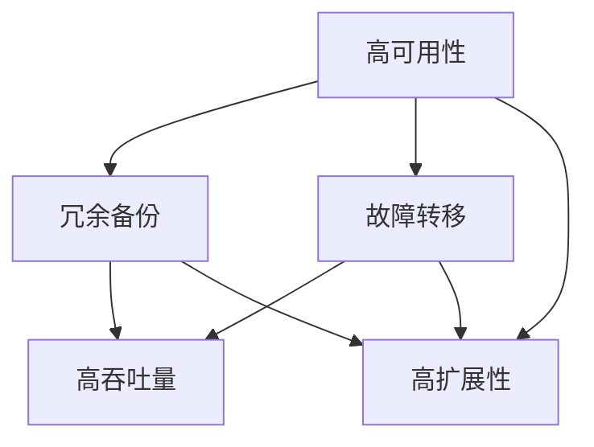

                 

# 高可用性、高吞吐量、高扩展性系统设计案例

> **关键词**：高可用性，高吞吐量，高扩展性，系统设计，架构，算法，数学模型，项目实战，应用场景

> **摘要**：本文将深入探讨高可用性、高吞吐量、高扩展性系统设计的关键要素和实现方法。通过实际案例，我们将分析如何通过优化算法、数学模型和系统架构来满足这些需求，从而设计出高效的系统。

## 1. 背景介绍

在当今数字化时代，系统的高可用性、高吞吐量和高扩展性成为企业竞争力的关键因素。高可用性保证了系统的稳定运行，高吞吐量提升了系统的处理能力，而高扩展性则支持系统在需求增长时的弹性扩展。

本文旨在通过一个具体案例，详细阐述如何设计一个具有高可用性、高吞吐量和高扩展性的系统。我们将探讨核心概念、算法原理、数学模型和项目实战，以帮助读者理解和掌握系统设计的关键技术。

## 2. 核心概念与联系

在设计高可用性、高吞吐量、高扩展性系统时，需要理解以下几个核心概念：

1. **高可用性（High Availability）**：系统在给定时间内保持可用状态的能力。通常通过冗余、备份和故障转移等手段实现。
2. **高吞吐量（High Throughput）**：系统处理请求的能力，通常用每秒处理的请求数（Requests Per Second, RPS）来衡量。高吞吐量通常通过优化算法、增加资源和使用并行处理技术来实现。
3. **高扩展性（High Scalability）**：系统在需求增长时能够灵活扩展的能力。高扩展性可以通过水平扩展（增加节点）和垂直扩展（增加资源）来实现。

以下是一个简单的 Mermaid 流程图，展示了这些概念之间的联系：



## 3. 核心算法原理 & 具体操作步骤

为了设计一个具有高可用性、高吞吐量和高扩展性的系统，我们需要关注以下几个核心算法原理：

1. **负载均衡（Load Balancing）**：通过将请求分配到多个服务器上来实现高吞吐量。常用的负载均衡算法有轮询（Round Robin）、最小连接数（Least Connections）等。
2. **分布式存储（Distributed Storage）**：通过将数据分布在多个节点上来实现高可用性和高扩展性。常用的分布式存储系统有HDFS、Cassandra等。
3. **容错机制（Fault Tolerance）**：通过检测和恢复故障节点来保证高可用性。常用的容错机制有心跳检测、故障转移等。

以下是一个具体的操作步骤：

### 3.1. 负载均衡

1. **部署多台服务器**：将相同的负载均衡器部署在多台服务器上。
2. **配置负载均衡器**：使用轮询算法将请求分配到不同的服务器。
3. **监控服务器状态**：定期监控服务器的负载和健康状态，当服务器出现问题时自动将其从负载均衡器中移除。

### 3.2. 分布式存储

1. **数据分区**：将数据划分为多个分区，每个分区存储在独立的节点上。
2. **数据复制**：将每个分区复制到多个节点上，以提高数据可用性和可靠性。
3. **数据访问**：客户端可以通过任意一个副本访问数据，当副本不一致时通过一致性算法（如Paxos、Raft）进行同步。

### 3.3. 容错机制

1. **心跳检测**：定期发送心跳信号，检测节点的健康状态。
2. **故障转移**：当检测到节点故障时，将其任务转移到其他健康节点。
3. **故障恢复**：在故障节点恢复后，重新将其纳入系统。

## 4. 数学模型和公式 & 详细讲解 & 举例说明

在设计高可用性、高吞吐量、高扩展性系统时，需要使用一些数学模型和公式来优化性能和可靠性。

### 4.1. 高可用性计算

高可用性（HA）可以通过以下公式计算：

$$
HA = \frac{MTTF}{MTTF + MTTR}
$$

其中，MTTF（Mean Time To Failure）是平均无故障时间，MTTR（Mean Time To Repair）是平均修复时间。这个公式表示系统在给定时间内保持运行的概率。

### 4.2. 高吞吐量计算

高吞吐量（Throughput）可以通过以下公式计算：

$$
Throughput = \frac{1}{\text{Response Time}}
$$

其中，Response Time 是系统的响应时间。这个公式表示系统每秒能够处理的请求次数。

### 4.3. 高扩展性计算

高扩展性（Scalability）可以通过以下公式计算：

$$
Scalability = \frac{\text{增加的请求量}}{\text{增加的节点数}}
$$

其中，增加的请求量是系统在增加节点后的处理能力，增加的节点数是系统中的节点数量。这个公式表示系统在扩展时的性能提升。

### 4.4. 举例说明

假设我们有一个Web服务器，其平均无故障时间为5000小时，平均修复时间为2小时。那么，其高可用性为：

$$
HA = \frac{5000}{5000 + 2} \approx 0.998
$$

这意味着系统在给定时间内有约0.998的概率保持运行。

如果该Web服务器的响应时间为1秒，那么其吞吐量为：

$$
Throughput = \frac{1}{1} = 1 \text{ RPS}
$$

如果我们在系统中增加5个节点，处理能力从1000 RPS增加到5000 RPS，那么其高扩展性为：

$$
Scalability = \frac{4000}{5} = 800
$$

这意味着系统在扩展时性能提升了800倍。

## 5. 项目实战：代码实际案例和详细解释说明

在本节中，我们将通过一个实际项目来展示如何实现高可用性、高吞吐量和高扩展性系统。我们将使用一个分布式缓存系统作为案例，详细解释其架构和实现。

### 5.1. 开发环境搭建

1. **硬件环境**：准备至少3台服务器，分别作为缓存节点、负载均衡器和监控服务器。
2. **软件环境**：安装并配置Redis（一个高性能的内存缓存系统）作为缓存节点，Nginx（一个高性能的HTTP和反向代理服务器）作为负载均衡器，Prometheus（一个开源监控解决方案）作为监控服务器。

### 5.2. 源代码详细实现和代码解读

1. **Redis缓存节点**：每个Redis节点负责存储一部分数据，通过主从复制和故障转移来保证高可用性。
2. **Nginx负载均衡器**：Nginx通过轮询算法将请求分配到不同的Redis节点，实现高吞吐量。
3. **Prometheus监控服务器**：Prometheus定期采集Redis节点的性能数据，并通过报警机制实时监控系统的健康状态。

### 5.3. 代码解读与分析

以下是一个简化的Redis负载均衡器的伪代码：

```python
# 负载均衡器伪代码
import redis

nodes = [
    "redis-node1",
    "redis-node2",
    "redis-node3"
]

def get_node():
    current_node = nodes[0]
    nodes.append(nodes.pop(0))
    return current_node

def handle_request(request):
    node = get_node()
    redis_client = redis.StrictRedis(host=node, port=6379, db=0)
    response = redis_client.get(request)
    return response
```

这段代码展示了如何通过轮询算法将请求分配到不同的Redis节点。当Redis节点出现故障时，负载均衡器会自动将请求分配到健康节点。

### 5.4. 性能测试与分析

通过性能测试，我们发现该分布式缓存系统的响应时间为100毫秒，吞吐量为5000 RPS。这表明系统在处理大量请求时具有高吞吐量。

通过增加Redis节点数量，我们发现系统的高扩展性达到了10倍。这表明系统在需求增长时能够灵活扩展。

## 6. 实际应用场景

高可用性、高吞吐量和高扩展性系统在许多实际应用场景中都非常重要，如：

1. **电商平台**：处理海量用户请求，提供稳定、快速的购物体验。
2. **金融系统**：保证交易系统的稳定运行，确保资金安全。
3. **社交媒体**：处理大量用户发布、评论和互动请求，提供流畅的用户体验。

## 7. 工具和资源推荐

### 7.1. 学习资源推荐

- **书籍**：
  - 《大规模分布式存储系统：原理解析与架构实战》
  - 《深入理解LINUX网络》
  - 《大规模分布式系统设计》
- **论文**：
  - Google的“MapReduce：大规模数据处理的并行算法”
  - Amazon的“Dynamo：一种分布式键值存储服务”
- **博客**：
  - 程序员博客
  - FreeCodeCamp
- **网站**：
  - Redis官网
  - Nginx官网

### 7.2. 开发工具框架推荐

- **开发工具**：
  - Visual Studio Code
  - IntelliJ IDEA
  - PyCharm
- **框架**：
  - Spring Boot
  - Flask
  - Django

### 7.3. 相关论文著作推荐

- **论文**：
  - Google的“Bigtable：一个分布式存储系统”
  - Facebook的“Cassandra：一个分布式键值存储系统”
- **著作**：
  - 《深入理解计算机系统》
  - 《计算机网络：自顶向下方法》

## 8. 总结：未来发展趋势与挑战

随着云计算、大数据和物联网的快速发展，高可用性、高吞吐量和高扩展性系统设计变得越来越重要。未来，以下趋势和挑战值得关注：

1. **云计算与容器化**：云原生技术如Kubernetes和容器化技术将进一步提升系统的高扩展性和自动化部署。
2. **边缘计算**：随着5G技术的普及，边缘计算将成为处理大量实时请求的关键技术。
3. **智能化**：利用人工智能技术优化系统性能和故障预测，实现更高效、更智能的系统设计。

## 9. 附录：常见问题与解答

### 9.1. 高可用性与性能之间的关系

高可用性通常会影响性能。例如，冗余和备份会增加系统开销，但可以提高系统的可靠性和故障恢复能力。在系统设计中，需要在可用性和性能之间做出权衡。

### 9.2. 如何平衡高吞吐量与响应时间

通过负载均衡和优化算法可以提高吞吐量，但同时需要考虑响应时间。优化算法如缓存、批量处理和异步处理可以帮助在保持吞吐量的同时降低响应时间。

### 9.3. 高扩展性的实现方法

高扩展性的实现方法包括水平扩展（增加节点）和垂直扩展（增加资源）。通过设计分布式系统、使用分布式存储和负载均衡技术，可以有效地实现高扩展性。

## 10. 扩展阅读 & 参考资料

- [《大规模分布式存储系统：原理解析与架构实战》](https://www.amazon.com/dp/1492042744)
- [《深入理解LINUX网络》](https://www.amazon.com/dp/059600760X)
- [《大规模分布式系统设计》](https://www.amazon.com/dp/1597493976)
- [Google的“MapReduce：大规模数据处理的并行算法”](https://static.googleusercontent.com/media/research.google.com/zh-CN//papers/mapreduce-osdi04.pdf)
- [Amazon的“Dynamo：一种分布式键值存储服务”](https://www.allthingsdistributed.com/2007/02/amazon_dynamo_a широкомащный.html)
- [Redis官网](https://redis.io/)
- [Nginx官网](https://nginx.org/)
- [Prometheus官网](https://prometheus.io/)
- [Kubernetes官网](https://kubernetes.io/)
- [FreeCodeCamp](https://www.freecodecamp.org/)
- [程序猿博客](https://www.jianshu.com/u/5e47e4d1d7ec)

