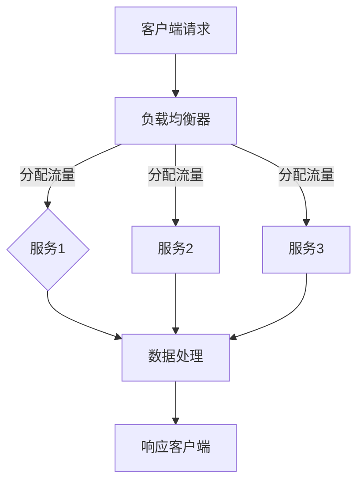

                 

# 高吞吐量系统设计的最佳实践

## 关键词
- 高吞吐量系统
- 设计最佳实践
- 性能优化
- 系统架构
- 线程池
- 缓存策略
- 负载均衡
- 并发编程

## 摘要

本文将探讨高吞吐量系统设计的最佳实践。我们将从背景介绍开始，逐步深入核心概念、算法原理，并通过项目实战和实际应用场景进行详细讲解。文章还将推荐学习资源、开发工具和框架，并总结未来发展趋势与挑战。

## 1. 背景介绍

在现代信息技术领域，随着互联网的飞速发展和大数据的爆发式增长，对系统的高吞吐量需求日益增加。高吞吐量系统设计已经成为企业提高竞争力、满足用户需求的关键。然而，设计一个高效、可靠且具有高吞吐量的系统并非易事。本文将介绍一系列最佳实践，帮助读者更好地理解和实现高吞吐量系统的设计。

## 2. 核心概念与联系

### 2.1 性能指标

在设计高吞吐量系统时，我们需要关注以下几个关键性能指标：

- 吞吐量（Throughput）：单位时间内系统能够处理的数据量。
- 响应时间（Response Time）：从请求提交到响应返回所需的时间。
- 并发度（Concurrency）：系统能够同时处理的最大请求数。

### 2.2 系统架构

高吞吐量系统设计通常涉及以下几个关键组件：

- 网络架构：优化网络传输速度和稳定性，提高系统整体性能。
- 数据存储：选择合适的数据存储方案，降低数据访问延迟。
- 服务架构：采用分布式服务架构，提高系统伸缩性和容错性。

### 2.3 Mermaid 流程图

以下是高吞吐量系统架构的 Mermaid 流程图：



## 3. 核心算法原理 & 具体操作步骤

### 3.1 线程池

线程池是一种管理线程的机制，可以提高系统的并发处理能力和资源利用率。具体操作步骤如下：

1. 创建线程池：初始化线程池大小、最大线程数、队列容量等参数。
2. 提交任务：将任务提交到线程池，线程池会自动分配空闲线程执行任务。
3. 处理任务：执行任务，处理数据，生成结果。
4. 关闭线程池：在不需要使用线程池时，关闭线程池释放资源。

### 3.2 缓存策略

缓存策略是提高系统性能和吞吐量的重要手段。具体操作步骤如下：

1. 选择缓存类型：根据系统需求选择合适的缓存类型，如内存缓存、磁盘缓存、分布式缓存等。
2. 设计缓存策略：设置缓存过期时间、缓存大小、缓存淘汰策略等参数。
3. 数据缓存：将经常访问的数据缓存起来，减少数据库查询次数。
4. 缓存同步：保证缓存与数据库数据的一致性，避免数据冲突。

### 3.3 负载均衡

负载均衡是将请求均匀分配到多个服务器或节点，提高系统吞吐量和可用性。具体操作步骤如下：

1. 选择负载均衡算法：如轮询、最小连接数、哈希等。
2. 配置负载均衡器：设置负载均衡策略、健康检查、会话保持等参数。
3. 分配请求：将请求分配到不同的服务器或节点。
4. 监控与优化：实时监控负载均衡器性能，进行优化调整。

## 4. 数学模型和公式 & 详细讲解 & 举例说明

### 4.1 吞吐量计算公式

吞吐量（Throughput）是衡量系统性能的关键指标，可以通过以下公式计算：

\[ Throughput = \frac{Total\ Requests\ Processed}{Time} \]

其中，Total Requests Processed 表示系统在单位时间内处理的总请求数，Time 表示时间单位。

### 4.2 响应时间计算公式

响应时间（Response Time）是衡量系统处理速度的关键指标，可以通过以下公式计算：

\[ Response\ Time = \frac{Total\ Processing\ Time}{Total\ Requests\ Processed} \]

其中，Total Processing Time 表示系统在单位时间内处理请求的总时间，Total Requests Processed 表示系统在单位时间内处理的总请求数。

### 4.3 举例说明

假设一个系统在1小时内处理了1000个请求，总处理时间为6000秒。根据吞吐量和响应时间的计算公式，可以得到以下结果：

\[ Throughput = \frac{1000}{1} = 1000\ Requests/小时 \]

\[ Response\ Time = \frac{6000}{1000} = 6\ 秒/请求 \]

## 5. 项目实战：代码实际案例和详细解释说明

### 5.1 开发环境搭建

在开始项目实战之前，我们需要搭建一个合适的开发环境。这里以 Java 语言为例，介绍如何搭建开发环境。

1. 安装 JDK：下载并安装 JDK，配置环境变量。
2. 安装 IDE：下载并安装一个合适的 IDE，如 Eclipse 或 IntelliJ IDEA。
3. 创建项目：在 IDE 中创建一个 Java 项目，添加必要的依赖库。

### 5.2 源代码详细实现和代码解读

下面是一个简单的 Java 线程池实现示例：

```java
import java.util.concurrent.ExecutorService;
import java.util.concurrent.Executors;

public class ThreadPoolExample {
    public static void main(String[] args) {
        // 创建线程池，设置线程池大小为 10
        ExecutorService executor = Executors.newFixedThreadPool(10);

        // 提交任务到线程池
        for (int i = 0; i < 100; i++) {
            executor.submit(new Task(i));
        }

        // 关闭线程池
        executor.shutdown();
    }

    static class Task implements Runnable {
        private final int taskId;

        public Task(int taskId) {
            this.taskId = taskId;
        }

        @Override
        public void run() {
            System.out.println("执行任务 " + taskId + "，线程名：" + Thread.currentThread().getName());
            // 执行任务操作
            try {
                Thread.sleep(1000);
            } catch (InterruptedException e) {
                e.printStackTrace();
            }
        }
    }
}
```

这段代码创建了一个固定大小的线程池，将100个任务提交到线程池执行。任务执行过程中，线程池会自动分配空闲线程处理任务。

### 5.3 代码解读与分析

- `ExecutorService`：线程池的核心接口，负责线程的创建、调度和销毁。
- `Executors`：提供了一些线程池的工厂方法，如 `newFixedThreadPool()` 方法创建固定大小的线程池。
- `Runnable`：任务接口，任务类实现该接口，重写 `run()` 方法，定义任务执行逻辑。
- `Thread.sleep(1000)`：模拟任务执行时间，用于测试线程池性能。

## 6. 实际应用场景

高吞吐量系统设计在实际应用场景中具有广泛的应用，以下是一些典型的应用场景：

- 大型电商平台：处理海量订单和用户请求，提供高吞吐量的交易和查询服务。
- 搜索引擎：处理海量数据检索请求，提供实时、精准的搜索结果。
- 数据处理平台：处理海量数据，提供数据挖掘、分析和可视化服务。
- 高并发网站：处理用户访问请求，提供稳定的页面访问和交互体验。

## 7. 工具和资源推荐

### 7.1 学习资源推荐

- 《高性能MySQL》
- 《大规模分布式存储系统：原理解析与架构实战》
- 《计算机网络：自顶向下方法》
- 《深入理解计算机系统》

### 7.2 开发工具框架推荐

- Spring Boot：轻量级框架，用于快速构建分布式系统。
- Kafka：分布式消息队列，用于实时数据传输和数据处理。
- Redis：高性能的内存缓存数据库，适用于缓存策略实现。
- Docker：容器化技术，用于部署和运行分布式应用。

### 7.3 相关论文著作推荐

- "The Google File System"：介绍 Google 文件系统的设计原理和实现。
- "Bigtable: A Distributed Storage System for Structured Data"：介绍 Google Bigtable 的设计原理和实现。
- "The Chubby Lock Service: Reliable Locks for Large-scale Distributed Systems"：介绍 Google Chubby 锁服务的实现。

## 8. 总结：未来发展趋势与挑战

高吞吐量系统设计在未来的发展趋势和挑战如下：

- 超大规模数据处理：随着数据规模的不断扩大，如何高效处理海量数据成为关键挑战。
- 分布式架构优化：分布式系统的优化和调优将成为研究的重点。
- 新兴技术的应用：如区块链、人工智能等新兴技术在高吞吐量系统设计中的应用和融合。
- 资源利用率和成本控制：如何在保证性能的前提下，优化资源利用率和降低成本。

## 9. 附录：常见问题与解答

### 9.1 高吞吐量系统设计的关键指标有哪些？

- 吞吐量、响应时间和并发度。

### 9.2 什么是线程池？如何使用线程池？

- 线程池是一种管理线程的机制，可以提高系统的并发处理能力和资源利用率。使用线程池通常包括创建线程池、提交任务和关闭线程池等步骤。

### 9.3 什么是缓存策略？如何实现缓存策略？

- 缓存策略是一种通过将数据存储在缓存中，减少数据库查询次数，提高系统性能的方法。实现缓存策略通常包括选择缓存类型、设计缓存策略、数据缓存和缓存同步等步骤。

## 10. 扩展阅读 & 参考资料

- 《分布式系统原理与范型》
- 《大规模分布式存储系统：原理解析与架构实战》
- 《高并发系统设计与实践》
- 《大规模数据处理技术》

### 作者

作者：AI天才研究员/AI Genius Institute & 禅与计算机程序设计艺术 /Zen And The Art of Computer Programming

【文章完】<|im_sep|>

