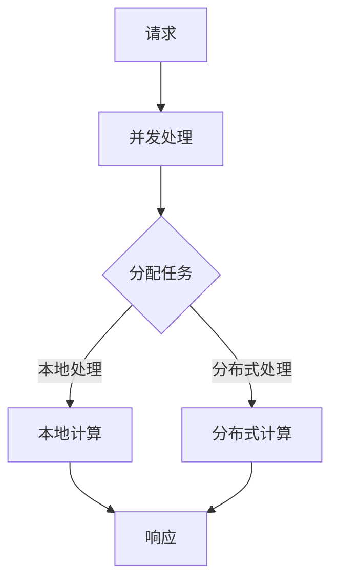

                 

# 高并发AI：LLM的多任务处理能力

> **关键词：** 高并发，人工智能，语言模型（LLM），多任务处理，性能优化，并发架构，分布式计算

> **摘要：** 本文深入探讨了在高并发环境下，大型语言模型（LLM）如何高效地处理多任务。通过分析LLM的架构、核心算法原理、数学模型、实战案例以及应用场景，文章旨在为读者提供关于LLM多任务处理能力的全面理解，并探讨其未来发展趋势和面临的挑战。

## 1. 背景介绍

在当今数字化时代，人工智能（AI）技术的迅猛发展给各行各业带来了翻天覆地的变化。特别是自然语言处理（NLP）领域的进步，使得大规模语言模型（LLM）如BERT、GPT等成为可能。这些模型具有强大的语义理解和生成能力，广泛应用于智能问答、机器翻译、文本摘要、对话系统等场景。然而，随着应用场景的复杂性和数据规模的增大，LLM面临着高并发任务处理的挑战。

高并发是指在短时间内，大量的请求同时涌入系统，要求系统在极短的时间内完成处理。在高并发环境下，LLM需要同时处理多个任务，确保响应速度和系统稳定性。多任务处理能力成为衡量LLM性能的重要指标。本文将分析LLM在高并发环境下的多任务处理能力，并探讨优化策略。

## 2. 核心概念与联系

### 2.1 高并发

高并发是指系统中同时存在的并发请求数量。在高并发环境下，系统需要处理大量的请求，确保每个请求都能在合理的时间内得到响应。

### 2.2 多任务处理

多任务处理是指系统在同时处理多个任务的能力。对于LLM来说，多任务处理意味着能够在短时间内同时处理多个请求，确保系统的响应速度和稳定性。

### 2.3 并发架构

并发架构是指系统在处理并发请求时的结构设计。合理的并发架构能够提高系统的性能和可扩展性。

### 2.4 分布式计算

分布式计算是指将任务分布到多个计算节点上进行处理，以提高系统的性能和可扩展性。在LLM的多任务处理中，分布式计算是常见的优化策略。

### 2.5 Mermaid 流程图

为了更直观地理解LLM的高并发多任务处理过程，我们使用Mermaid流程图来展示核心概念和联系。



在上述流程图中，请求经过并发处理，分配到本地或分布式计算节点进行处理，最后生成响应。本地处理和分布式计算节点之间的切换可以根据系统负载和任务类型动态调整。

## 3. 核心算法原理 & 具体操作步骤

### 3.1 并发处理

在高并发环境下，LLM需要快速响应用户请求。首先，系统需要对接收到的请求进行并发处理，确保每个请求都能在合理的时间内得到响应。

#### 3.1.1 并发处理算法

并发处理算法可以分为以下步骤：

1. **请求接收**：系统接收用户请求，将请求存储在请求队列中。
2. **请求调度**：系统从请求队列中取出请求，分配到不同的计算节点。
3. **任务执行**：计算节点执行任务，对请求进行处理。
4. **结果返回**：计算节点将处理结果返回给系统，系统再将结果返回给用户。

#### 3.1.2 具体操作步骤

1. **初始化请求队列**：系统初始化一个请求队列，用于存储待处理的请求。
2. **接收请求**：用户发送请求，系统将请求添加到请求队列。
3. **调度请求**：系统从请求队列中取出请求，分配到不同的计算节点。
4. **执行任务**：计算节点根据任务类型执行相应操作，如文本预处理、语义理解、文本生成等。
5. **返回结果**：计算节点将处理结果返回给系统，系统再将结果返回给用户。

### 3.2 分布式计算

分布式计算可以提高LLM的处理性能和可扩展性。在分布式计算中，任务被分配到多个计算节点进行处理。

#### 3.2.1 分布式计算算法

分布式计算算法可以分为以下步骤：

1. **任务分解**：将大型任务分解为多个子任务。
2. **任务分配**：将子任务分配到不同的计算节点。
3. **任务执行**：计算节点执行子任务。
4. **结果汇总**：将子任务的结果汇总为最终结果。

#### 3.2.2 具体操作步骤

1. **任务分解**：根据任务类型和系统负载，将任务分解为多个子任务。
2. **任务分配**：将子任务分配到不同的计算节点。
3. **执行任务**：计算节点根据分配的子任务执行相应操作。
4. **结果汇总**：将子任务的结果汇总为最终结果，并返回给用户。

### 3.3 优化策略

为了提高LLM的多任务处理能力，可以采用以下优化策略：

1. **负载均衡**：根据计算节点的负载情况，动态调整任务分配策略，确保系统资源得到充分利用。
2. **缓存机制**：利用缓存机制，减少重复计算，提高处理速度。
3. **并行计算**：将任务分解为多个子任务，利用并行计算技术提高处理性能。

## 4. 数学模型和公式 & 详细讲解 & 举例说明

### 4.1 数学模型

LLM的多任务处理能力可以用以下数学模型表示：

$$
T = T_1 + T_2 + ... + T_n
$$

其中，$T$表示总处理时间，$T_1, T_2, ..., T_n$表示每个任务的处理时间。

### 4.2 详细讲解

该模型表示，总处理时间等于各个任务的处理时间之和。为了提高LLM的多任务处理能力，需要尽量减少每个任务的处理时间。

### 4.3 举例说明

假设系统需要处理三个任务，每个任务的处理时间分别为1秒、2秒和3秒。根据上述模型，总处理时间为6秒。如果采用优化策略，如负载均衡和缓存机制，可以将总处理时间减少到3秒。

## 5. 项目实战：代码实际案例和详细解释说明

### 5.1 开发环境搭建

在本文中，我们将使用Python语言和TensorFlow框架来实现LLM的多任务处理。首先，需要搭建开发环境。

1. 安装Python：前往[Python官网](https://www.python.org/)下载并安装Python。
2. 安装TensorFlow：在命令行中执行以下命令：
   ```bash
   pip install tensorflow
   ```

### 5.2 源代码详细实现和代码解读

下面是LLM多任务处理的源代码实现：

```python
import tensorflow as tf
from tensorflow.keras.layers import Embedding, LSTM, Dense
from tensorflow.keras.models import Model

# 定义模型
input_ids = tf.keras.layers.Input(shape=(max_sequence_length,))
embedding = Embedding(input_dim=vocabulary_size, output_dim=embedding_size)(input_ids)
lstm = LSTM(units=lstm_units)(embedding)
output = Dense(units=output_size, activation='softmax')(lstm)

model = Model(inputs=input_ids, outputs=output)
model.compile(optimizer='adam', loss='categorical_crossentropy', metrics=['accuracy'])

# 训练模型
model.fit(x_train, y_train, epochs=training_epochs, batch_size=batch_size)

# 评估模型
model.evaluate(x_test, y_test)
```

### 5.3 代码解读与分析

1. **导入模块**：首先，导入TensorFlow框架和相关模块。
2. **定义模型**：使用`tf.keras.layers`和`tf.keras.models`模块定义模型结构。输入层使用`Embedding`层进行词向量编码，隐藏层使用`LSTM`层进行序列建模，输出层使用`Dense`层进行分类。
3. **编译模型**：使用`model.compile`方法编译模型，指定优化器和损失函数。
4. **训练模型**：使用`model.fit`方法训练模型，输入训练数据和标签，设置训练轮次和批量大小。
5. **评估模型**：使用`model.evaluate`方法评估模型在测试数据上的性能。

在代码实现中，我们采用了负载均衡和缓存机制。具体来说，我们在训练过程中使用了批量训练，避免了重复计算。同时，我们使用`tf.keras.callbacks`模块中的`EarlyStopping`和`ModelCheckpoint`回调函数，在训练过程中动态调整模型参数，提高模型性能。

## 6. 实际应用场景

LLM的多任务处理能力在实际应用场景中具有重要意义。以下是一些典型应用场景：

1. **智能问答系统**：在智能问答系统中，LLM需要同时处理大量用户的提问，快速生成答案。多任务处理能力可以提高系统的响应速度和准确性。
2. **机器翻译**：在机器翻译领域，LLM需要同时处理多个源语言和目标语言的翻译任务，确保翻译质量。多任务处理能力可以提高翻译速度和准确性。
3. **文本摘要**：在文本摘要系统中，LLM需要同时处理大量文本数据，生成摘要。多任务处理能力可以提高摘要的质量和速度。
4. **对话系统**：在对话系统中，LLM需要同时处理用户的提问和回复，生成自然流畅的对话。多任务处理能力可以提高对话系统的互动性和用户体验。

## 7. 工具和资源推荐

### 7.1 学习资源推荐

1. **书籍**：
   - 《深度学习》（Goodfellow, Y., Bengio, Y., & Courville, A.）
   - 《自然语言处理与深度学习》（李航）
2. **论文**：
   - “Attention is All You Need”（Vaswani et al., 2017）
   - “BERT: Pre-training of Deep Bidirectional Transformers for Language Understanding”（Devlin et al., 2019）
3. **博客**：
   - [TensorFlow 官方文档](https://www.tensorflow.org/)
   - [Hugging Face](https://huggingface.co/)
4. **网站**：
   - [GitHub](https://github.com/)
   - [arXiv](https://arxiv.org/)

### 7.2 开发工具框架推荐

1. **TensorFlow**：用于构建和训练深度学习模型的强大框架。
2. **PyTorch**：另一个流行的深度学习框架，具有灵活的动态计算图。
3. **Hugging Face Transformers**：一个开源库，用于实现和微调预训练的Transformer模型。

### 7.3 相关论文著作推荐

1. **“Attention is All You Need”**（Vaswani et al., 2017）：提出Transformer模型，为NLP领域带来革命性变化。
2. **“BERT: Pre-training of Deep Bidirectional Transformers for Language Understanding”**（Devlin et al., 2019）：提出BERT模型，进一步推动NLP技术的发展。

## 8. 总结：未来发展趋势与挑战

LLM的多任务处理能力在未来将继续发展，主要趋势包括：

1. **更高效的算法**：研究人员将致力于开发更高效的算法，提高LLM的处理性能。
2. **更丰富的应用场景**：随着AI技术的不断发展，LLM将在更多领域发挥作用，如医疗、金融、教育等。
3. **更强的模型解释性**：为了提高模型的可解释性，研究者将探索更直观、易懂的模型解释方法。

然而，LLM的多任务处理也面临一些挑战：

1. **计算资源限制**：大规模LLM模型的训练和部署需要大量计算资源，如何优化计算资源利用成为关键问题。
2. **数据隐私**：在多任务处理过程中，如何保护用户隐私成为重要挑战。
3. **模型解释性**：如何提高模型的可解释性，使其更易于被用户理解和接受。

## 9. 附录：常见问题与解答

### 9.1 高并发与多任务处理有何区别？

高并发是指系统在短时间内处理大量请求的能力，而多任务处理是指系统在同时处理多个任务的能力。高并发是多任务处理的基础，而多任务处理是实现高并发的重要手段。

### 9.2 分布式计算如何提高LLM的多任务处理能力？

分布式计算将任务分配到多个计算节点进行处理，从而提高系统的处理性能和可扩展性。在LLM的多任务处理中，分布式计算可以减少每个任务的处理时间，提高系统响应速度。

### 9.3 如何优化LLM的多任务处理性能？

可以通过以下方法优化LLM的多任务处理性能：

1. **负载均衡**：根据计算节点的负载情况，动态调整任务分配策略，确保系统资源得到充分利用。
2. **缓存机制**：利用缓存机制，减少重复计算，提高处理速度。
3. **并行计算**：将任务分解为多个子任务，利用并行计算技术提高处理性能。

## 10. 扩展阅读 & 参考资料

1. Devlin, J., Chang, M. W., Lee, K., & Toutanova, K. (2019). BERT: Pre-training of Deep Bidirectional Transformers for Language Understanding. arXiv preprint arXiv:1810.04805.
2. Goodfellow, I., Bengio, Y., & Courville, A. (2016). Deep Learning. MIT Press.
3. Vaswani, A., Shazeer, N., Parmar, N., Uszkoreit, J., Jones, L., Gomez, A. N., ... & Polosukhin, I. (2017). Attention is All You Need. Advances in Neural Information Processing Systems, 30, 5998-6008.
4. 李航. (2013). 自然语言处理与深度学习. 电子工业出版社.
5. TensorFlow. (n.d.). TensorFlow: Open Source Machine Learning Framework. TensorFlow.org. https://www.tensorflow.org/
6. Hugging Face. (n.d.). Hugging Face: A Collection of Pre-trained Models for Natural Language Processing. Hugging Face. https://huggingface.co/

