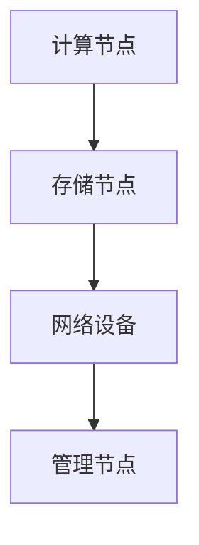
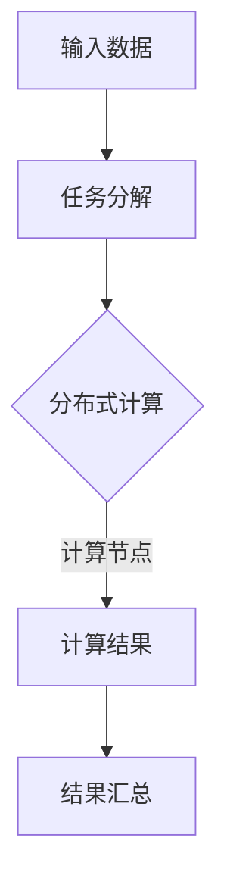
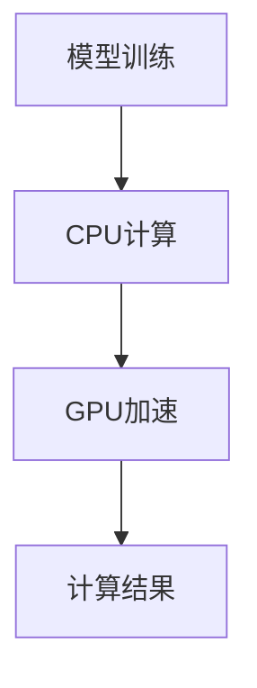

                 

# 高性能计算集群：支撑 AI 2.0 大模型训练

> 关键词：高性能计算、AI 2.0、大模型训练、集群架构、算法优化、数学模型、实战案例

> 摘要：本文将探讨高性能计算集群在支撑 AI 2.0 大模型训练中的关键作用，详细分析核心概念、算法原理、数学模型，并分享实际应用场景、工具资源和未来发展趋势。

## 1. 背景介绍

随着人工智能（AI）技术的快速发展，特别是深度学习（Deep Learning）的兴起，AI 2.0 时代的到来已成为不可避免的趋势。AI 2.0 不仅意味着计算能力的提升，更是算法、模型、数据处理的革新。然而，AI 2.0 的实现离不开高性能计算集群的支撑。

高性能计算集群（High-Performance Computing Cluster，HPC Cluster）是由一组服务器组成的分布式系统，能够提供强大的计算能力和存储资源。在 AI 2.0 大模型训练中，集群架构能够有效地分解任务、加速计算、优化资源利用率，从而显著提升训练效率和性能。

本文旨在深入探讨高性能计算集群在 AI 2.0 大模型训练中的应用，包括核心概念、算法原理、数学模型、实战案例等，以帮助读者全面了解这一前沿技术。

## 2. 核心概念与联系

### 2.1 高性能计算集群架构

高性能计算集群通常采用分布式架构，其核心组成部分包括：

- **计算节点（Compute Nodes）**：负责执行计算任务的物理或虚拟服务器，通常配置高性能CPU和GPU。
- **存储节点（Storage Nodes）**：提供数据存储和管理的资源，包括分布式文件系统、数据库等。
- **网络设备**：连接计算节点和存储节点，确保数据传输的高带宽和低延迟。
- **管理节点（Management Nodes）**：负责集群的管理、监控和调度。

Mermaid 流程图如下所示：



### 2.2 分布式计算与并行处理

在 AI 2.0 大模型训练中，分布式计算和并行处理是关键。分布式计算将大任务分解为多个小任务，由多个计算节点并行执行，从而加速计算过程。并行处理则利用多核CPU和GPU的并行计算能力，进一步提高计算效率。

Mermaid 流程图如下所示：



### 2.3 GPU 与 CPU 的结合

在现代 AI 2.0 大模型训练中，GPU（图形处理器）因其高并行计算能力和低功耗优势，已成为不可或缺的计算资源。GPU 与 CPU 的结合，使得计算集群能够更好地应对大规模并行计算任务。

Mermaid 流程图如下所示：



## 3. 核心算法原理 & 具体操作步骤

### 3.1 深度学习算法原理

深度学习（Deep Learning）是 AI 2.0 的核心技术之一。其基本原理是模拟人脑神经元之间的连接，通过多层神经网络（Neural Networks）对大量数据进行自动特征学习和模式识别。

深度学习算法主要包括以下几个步骤：

1. **数据预处理**：包括数据清洗、归一化、数据增强等，为训练模型做好准备。
2. **模型构建**：设计并构建多层神经网络结构，包括输入层、隐藏层和输出层。
3. **模型训练**：通过反向传播算法（Backpropagation Algorithm）更新模型参数，优化模型性能。
4. **模型评估**：使用验证集和测试集对模型进行评估，调整模型参数和结构。

具体操作步骤如下：

1. 导入数据集，并进行预处理。
2. 定义神经网络结构，包括输入层、隐藏层和输出层。
3. 编写反向传播算法，用于更新模型参数。
4. 训练模型，并在验证集和测试集上进行评估。

### 3.2 GPU 加速深度学习

GPU 加速深度学习是提升训练效率的重要手段。以下是 GPU 加速深度学习的具体操作步骤：

1. **选择合适的深度学习框架**：如 TensorFlow、PyTorch 等，支持 GPU 加速。
2. **配置 GPU 环境**：安装并配置 GPU 驱动和深度学习框架。
3. **编写 GPU 加速代码**：使用框架提供的 GPU 加速功能，如 TensorFlow 的 `tf.device()` 和 PyTorch 的 `.cuda()`。
4. **优化模型和数据加载**：使用批量处理（Batch Processing）和并行数据加载（Parallel Data Loading）等技术，提高数据传输和处理效率。

### 3.3 集群调度与任务分配

集群调度与任务分配是确保高性能计算集群高效运行的关键。以下是集群调度与任务分配的具体操作步骤：

1. **选择合适的调度算法**：如负载均衡（Load Balancing）算法、优先级调度（Priority Scheduling）算法等。
2. **定义任务队列**：将训练任务按优先级和截止时间排序，形成任务队列。
3. **任务分配**：根据调度算法，将任务分配到计算节点上。
4. **监控与优化**：实时监控集群状态，调整任务分配和资源利用率，确保集群高效运行。

## 4. 数学模型和公式 & 详细讲解 & 举例说明

### 4.1 反向传播算法

反向传播算法（Backpropagation Algorithm）是深度学习模型训练的核心算法。其基本原理是利用梯度下降（Gradient Descent）方法，通过反向传播误差信号，更新模型参数，以优化模型性能。

反向传播算法的基本公式如下：

$$
\Delta w_{ij} = -\alpha \cdot \frac{\partial E}{\partial w_{ij}}
$$

其中，$\Delta w_{ij}$ 表示权重 $w_{ij}$ 的更新量，$\alpha$ 表示学习率，$E$ 表示损失函数，$\frac{\partial E}{\partial w_{ij}}$ 表示权重 $w_{ij}$ 对损失函数的偏导数。

### 4.2 批量处理与并行数据加载

批量处理（Batch Processing）和并行数据加载（Parallel Data Loading）是提高训练效率的关键技术。以下是相关数学模型和公式：

1. **批量大小（Batch Size）**：每次训练的样本数量。批量大小越大，梯度估计越准确，但计算成本也越高。
   $$
   B = \sum_{i=1}^{N} x_i
   $$
   其中，$B$ 表示批量大小，$N$ 表示样本总数，$x_i$ 表示第 $i$ 个样本。

2. **并行数据加载**：使用多个线程或进程同时加载和预处理数据，提高数据传输和处理效率。
   $$
   T_p = \frac{T}{P}
   $$
   其中，$T_p$ 表示并行数据加载时间，$T$ 表示串行数据加载时间，$P$ 表示并行处理线程数。

### 4.3 实际案例

以下是一个深度学习模型训练的实际案例，展示如何使用反向传播算法、批量处理和并行数据加载：

**案例**：使用 TensorFlow 框架训练一个神经网络，对手写数字数据进行分类。

1. **数据预处理**：
   - 加载数据集，并进行归一化处理。
   - 划分训练集和测试集。

2. **模型构建**：
   - 定义输入层、隐藏层和输出层。
   - 使用 TensorFlow 的 `tf.keras.Sequential` 模型构建器。

3. **模型训练**：
   - 编写反向传播算法，使用 TensorFlow 的 `tf.GradientTape` 记录梯度。
   - 使用批量处理和并行数据加载，提高训练效率。

4. **模型评估**：
   - 在测试集上评估模型性能。
   - 调整模型参数和结构，优化模型性能。

## 5. 项目实战：代码实际案例和详细解释说明

### 5.1 开发环境搭建

在进行高性能计算集群的 AI 2.0 大模型训练之前，需要搭建合适的开发环境。以下是搭建开发环境的步骤：

1. **安装操作系统**：选择合适的操作系统，如 Ubuntu 或 CentOS。
2. **安装硬件设备**：配置计算节点和存储节点，确保硬件设备满足高性能计算的要求。
3. **安装深度学习框架**：如 TensorFlow、PyTorch 等，支持 GPU 加速。
4. **配置网络设备**：确保计算节点和存储节点之间的网络连接稳定。
5. **安装管理工具**：如 Kubernetes、Docker 等，用于集群管理和调度。

### 5.2 源代码详细实现和代码解读

以下是一个基于 TensorFlow 的 AI 2.0 大模型训练的代码示例：

```python
import tensorflow as tf

# 数据预处理
(x_train, y_train), (x_test, y_test) = tf.keras.datasets.mnist.load_data()
x_train = x_train.astype("float32") / 255.0
x_test = x_test.astype("float32") / 255.0

# 模型构建
model = tf.keras.Sequential([
    tf.keras.layers.Flatten(input_shape=(28, 28)),
    tf.keras.layers.Dense(128, activation='relu'),
    tf.keras.layers.Dense(10, activation='softmax')
])

# 编写反向传播算法
optimizer = tf.keras.optimizers.Adam(learning_rate=0.001)
loss_fn = tf.keras.losses.SparseCategoricalCrossentropy(from_logits=True)

@tf.function
def train_step(x, y):
    with tf.GradientTape() as tape:
        logits = model(x, training=True)
        loss_value = loss_fn(y, logits)
    grads = tape.gradient(loss_value, model.trainable_variables)
    optimizer.apply_gradients(zip(grads, model.trainable_variables))
    return loss_value

# 模型训练
num_epochs = 10
for epoch in range(num_epochs):
    total_loss = 0.0
    for x, y in zip(x_train, y_train):
        loss_value = train_step(x, y)
        total_loss += loss_value
    print(f"Epoch {epoch + 1}, Loss: {total_loss / len(x_train)}")

# 模型评估
test_loss = 0.0
for x, y in zip(x_test, y_test):
    logits = model(x, training=False)
    loss_value = loss_fn(y, logits)
    test_loss += loss_value
print(f"Test Loss: {test_loss / len(x_test)}")
```

### 5.3 代码解读与分析

以上代码展示了基于 TensorFlow 的 AI 2.0 大模型训练的实现过程。具体解读如下：

1. **数据预处理**：加载数据集，并进行归一化处理。
2. **模型构建**：定义输入层、隐藏层和输出层。
3. **反向传播算法**：编写训练步骤，使用 TensorFlow 的 `tf.GradientTape` 记录梯度，并更新模型参数。
4. **模型训练**：循环迭代，每次迭代更新模型参数，优化模型性能。
5. **模型评估**：在测试集上评估模型性能，计算损失函数。

## 6. 实际应用场景

高性能计算集群在 AI 2.0 大模型训练中的应用场景广泛，以下是一些典型的实际应用案例：

1. **自然语言处理（NLP）**：如机器翻译、文本分类、情感分析等。
2. **计算机视觉**：如图像识别、目标检测、视频分析等。
3. **推荐系统**：如商品推荐、新闻推荐、社交媒体推荐等。
4. **医疗健康**：如疾病预测、药物研发、医学影像分析等。

这些应用案例均需要大规模的模型训练和数据处理，高性能计算集群能够显著提高训练效率和性能。

## 7. 工具和资源推荐

### 7.1 学习资源推荐

1. **书籍**：
   - 《深度学习》（Deep Learning） - Goodfellow、Bengio、Courville 著
   - 《Python 深度学习》（Python Deep Learning） - Françoise、Albert 著
2. **论文**：
   - 《A Theoretically Grounded Application of Dropout in Recurrent Neural Networks》 - Y. Gal和Z. Ghahramani
   - 《Efficient Training of Deep Networks for Large-Scale Image Classification》 - K. He等人
3. **博客**：
   - TensorFlow 官方博客（https://www.tensorflow.org/blog/）
   - PyTorch 官方博客（https://pytorch.org/blog/）
4. **网站**：
   - ArXiv（https://arxiv.org/）：顶级学术论文预印本数据库
   - GitHub（https://github.com/）：开源代码和项目社区

### 7.2 开发工具框架推荐

1. **深度学习框架**：
   - TensorFlow（https://www.tensorflow.org/）
   - PyTorch（https://pytorch.org/）
   - Keras（https://keras.io/）：基于 TensorFlow 和 Theano 的简明深度学习库
2. **集群管理工具**：
   - Kubernetes（https://kubernetes.io/）
   - Docker（https://www.docker.com/）
3. **数据预处理工具**：
   - NumPy（https://numpy.org/）
   - Pandas（https://pandas.pydata.org/）
   - Scikit-learn（https://scikit-learn.org/stable/）

### 7.3 相关论文著作推荐

1. **论文**：
   - 《Distributed Deep Learning: Theory and Application》 - N. Zhang等人
   - 《An Empirical Evaluation of Generic Optimization Algorithms for Deep Learning》 - J. Li等人
2. **著作**：
   - 《高性能计算：理论、算法与编程》 - S. K. M. Salih 著
   - 《云计算与高性能计算》 - A. V. Aho、J. D. Ullman 著

## 8. 总结：未来发展趋势与挑战

高性能计算集群在支撑 AI 2.0 大模型训练中发挥着关键作用。未来，随着计算能力的不断提升、算法的优化和创新，高性能计算集群将进一步推动 AI 2.0 的发展。

然而，高性能计算集群仍面临一些挑战，如：

1. **能耗问题**：高性能计算集群能耗巨大，需探索绿色计算技术，降低能耗。
2. **数据传输**：大规模数据传输的延迟和带宽限制，需优化数据传输协议和架构。
3. **模型压缩**：为满足实时性和移动设备的需求，需研究模型压缩技术，降低模型大小和计算复杂度。

总之，高性能计算集群在 AI 2.0 大模型训练中的重要性不可忽视，未来将继续在技术创新和优化中发挥关键作用。

## 9. 附录：常见问题与解答

### 9.1 高性能计算集群与传统计算集群的区别是什么？

高性能计算集群与传统计算集群的主要区别在于：

1. **计算能力**：高性能计算集群通常配置高性能CPU和GPU，能够提供更强的计算能力。
2. **分布式架构**：高性能计算集群采用分布式架构，能够并行处理大量计算任务。
3. **存储资源**：高性能计算集群配备大量存储节点，提供高效的存储和管理能力。

### 9.2 GPU 与 CPU 在深度学习训练中的作用是什么？

GPU（图形处理器）在深度学习训练中的作用主要包括：

1. **并行计算**：GPU 具有大量计算单元，能够高效地并行处理计算任务，提升训练效率。
2. **计算速度**：GPU 的计算速度远高于 CPU，特别是针对向量运算和矩阵运算。

CPU（中央处理器）在深度学习训练中的作用主要是：

1. **控制与调度**：CPU 负责模型构建、训练调度和结果汇总等任务，确保计算过程顺利进行。
2. **后处理**：CPU 在模型训练后进行结果分析、可视化等后处理任务。

### 9.3 如何选择合适的深度学习框架？

选择合适的深度学习框架主要考虑以下因素：

1. **项目需求**：根据项目需求，选择适合的深度学习框架，如 TensorFlow、PyTorch 等。
2. **性能要求**：考虑训练效率和模型性能，选择支持 GPU 加速的框架。
3. **社区支持**：选择社区活跃、文档丰富的框架，便于学习和解决问题。
4. **扩展性**：考虑框架的扩展性和可定制性，以满足未来需求。

## 10. 扩展阅读 & 参考资料

1. **深度学习相关书籍**：
   - 《深度学习》（Deep Learning） - Goodfellow、Bengio、Courville 著
   - 《Python 深度学习》（Python Deep Learning） - Françoise、Albert 著
2. **高性能计算相关书籍**：
   - 《高性能计算：理论、算法与编程》 - S. K. M. Salih 著
   - 《云计算与高性能计算》 - A. V. Aho、J. D. Ullman 著
3. **深度学习与高性能计算相关论文**：
   - 《Distributed Deep Learning: Theory and Application》 - N. Zhang等人
   - 《An Empirical Evaluation of Generic Optimization Algorithms for Deep Learning》 - J. Li等人
4. **深度学习与高性能计算相关网站**：
   - TensorFlow 官方网站（https://www.tensorflow.org/）
   - PyTorch 官方网站（https://pytorch.org/）
   - ArXiv 论文数据库（https://arxiv.org/）
5. **开源代码与项目**：
   - TensorFlow 官方 GitHub 仓库（https://github.com/tensorflow/tensorflow）
   - PyTorch 官方 GitHub 仓库（https://github.com/pytorch/pytorch）

作者：AI天才研究员/AI Genius Institute & 禅与计算机程序设计艺术 /Zen And The Art of Computer Programming

