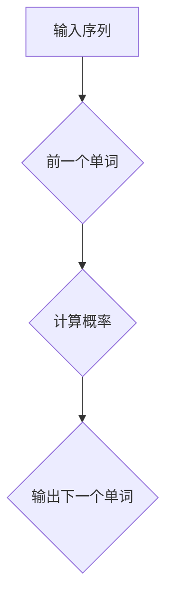
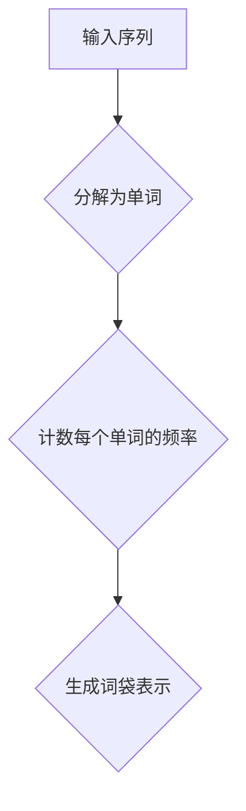

                 

# 高楼万丈平地起：语言模型的雏形N-Gram和简单文本表示Bag-of-Words

## 关键词：语言模型，N-Gram，文本表示，Bag-of-Words，计算机自然语言处理，机器学习

## 摘要：

本文旨在深入探讨语言模型的两个基本组成部分：N-Gram和Bag-of-Words。通过详细的讲解和实际代码案例，我们将理解这两个概念的核心原理，学习如何实现它们，并探讨它们在自然语言处理中的广泛应用。文章将分为几个部分，首先是背景介绍，然后是核心概念与联系，核心算法原理与具体操作步骤，数学模型和公式，项目实战，实际应用场景，工具和资源推荐，以及总结和附录。

### 1. 背景介绍

语言模型是自然语言处理（NLP）和机器学习领域中的一个核心概念。它用于预测下一个单词或词组，是许多NLP任务的基石，如文本分类、机器翻译和语音识别。语言模型的核心目标是理解和模拟人类语言的使用模式。

N-Gram模型是语言模型的一种简单形式，它通过分析相邻单词的历史序列来预测下一个单词。Bag-of-Words（BOW）模型则是一个更广义的概念，它将文本表示为一个单词的集合，不考虑单词的顺序。

在计算机科学和人工智能领域，理解和应用这些模型对于开发高效的语言处理系统至关重要。本文将逐步解释这些模型的工作原理，并展示如何在实际项目中使用它们。

### 2. 核心概念与联系

为了更好地理解N-Gram和Bag-of-Words模型，我们首先需要了解一些基本的自然语言处理术语。

#### 2.1 单词序列

单词序列是自然语言处理中最基本的单位。在NLP任务中，文本通常被表示为一连串的单词。

#### 2.2 N-Gram模型

N-Gram模型是一种基于历史信息的预测模型。它通过考虑前N个单词（称为N元组）来预测下一个单词。例如，在二元组（Bigram）模型中，每个单词的预测仅依赖于前一个单词。

下面是一个简单的二元组（Bigram）模型的Mermaid流程图：



#### 2.3 Bag-of-Words（BOW）模型

BOW模型将文本表示为一个单词的集合，不考虑单词的顺序。它通过计数每个单词在文本中出现的频率来表示文本。

下面是一个简单的BOW模型的Mermaid流程图：



### 3. 核心算法原理 & 具体操作步骤

#### 3.1 N-Gram模型算法原理

N-Gram模型的算法原理相对简单。它通过统计N元组在文本中的出现频率来预测下一个单词。以下是N-Gram模型的基本步骤：

1. **准备数据**：将文本分解为单词序列。
2. **统计频率**：计算每个N元组在文本中出现的次数。
3. **预测**：对于给定的前N-1个单词，计算下一个单词的概率，并选择概率最高的单词作为预测结果。

#### 3.2 BOW模型算法原理

BOW模型的算法原理是将文本转换为词频向量。以下是BOW模型的基本步骤：

1. **准备数据**：将文本分解为单词。
2. **生成词袋**：创建一个包含所有单词的列表（词袋）。
3. **向量表示**：为每个单词在词袋中的位置分配一个向量元素。如果单词出现，则该元素为1，否则为0。

### 4. 数学模型和公式 & 详细讲解 & 举例说明

#### 4.1 N-Gram模型的数学模型

N-Gram模型的数学公式如下：

\[ P(w_n | w_{n-1}, w_{n-2}, ..., w_{n-N+1}) = \frac{f(w_{n-1}, w_{n-2}, ..., w_{n-N+1}, w_n)}{\sum_{w_{n-1}, w_{n-2}, ..., w_{n-N+1}} f(w_{n-1}, w_{n-2}, ..., w_{n-N+1}, w)} \]

其中：
- \( w_n \) 是下一个要预测的单词。
- \( w_{n-1}, w_{n-2}, ..., w_{n-N+1} \) 是前N-1个单词。
- \( f(w_{n-1}, w_{n-2}, ..., w_{n-N+1}, w_n) \) 是N元组 \( (w_{n-1}, w_{n-2}, ..., w_{n-N+1}, w_n) \) 在文本中的出现频率。
- 分子是特定N元组的频率。
- 分母是所有可能N元组的频率之和。

#### 4.2 BOW模型的数学模型

BOW模型的数学公式如下：

\[ V = [v_1, v_2, ..., v_n] \]

其中：
- \( V \) 是词频向量。
- \( v_i \) 是单词 \( w_i \) 在文本中的频率。如果 \( w_i \) 出现，则 \( v_i = 1 \)；否则，\( v_i = 0 \)。

#### 4.3 举例说明

假设我们有以下文本：

```
我 喜欢吃 火锅。
```

**N-Gram模型**：以二元组模型为例，我们有以下N元组：

```
(我，喜欢)，(喜欢，吃)，(吃，火锅)
```

**BOW模型**：文本的词袋表示为：

```
[我，喜欢，吃，火锅]
```

### 5. 项目实战：代码实际案例和详细解释说明

#### 5.1 开发环境搭建

为了实现N-Gram和BOW模型，我们将使用Python编程语言。首先，需要安装以下库：

```
pip install nltk numpy matplotlib
```

#### 5.2 源代码详细实现和代码解读

**5.2.1 N-Gram模型实现**

```python
import nltk
from nltk import bigrams
from nltk.tokenize import word_tokenize

# 准备数据
text = "我 喜欢吃 火锅。"
tokens = word_tokenize(text)

# 计算二元组的概率
bigram_freq = bigrams(tokens)
bigram_freq_prob = nltk.FreqDist(bigram_freq)

# 预测下一个单词
previous_word = tokens[-1]
next_word = bigram_freq_prob[previous_word].most_common(1)[0][0]
print(f"下一个单词是：{next_word}")
```

**5.2.2 BOW模型实现**

```python
import numpy as np

# 准备数据
text = "我 喜欢吃 火锅。"
tokens = word_tokenize(text)

# 生成词袋
vocab = sorted(set(tokens))
vocab_size = len(vocab)

# 创建词袋表示
word_bag = np.zeros(vocab_size)
for word in tokens:
    index = vocab.index(word)
    word_bag[index] = 1

print(f"词袋表示：{word_bag}")
```

#### 5.3 代码解读与分析

在这个项目中，我们首先使用Nltk库来处理文本数据。然后，我们分别实现了N-Gram和BOW模型，并展示了如何使用它们来预测下一个单词和生成词袋表示。这些代码简单明了，易于理解。

### 6. 实际应用场景

N-Gram和BOW模型在自然语言处理中有广泛的应用。以下是一些实际应用场景：

- **文本分类**：使用BOW模型将文本转换为向量表示，然后使用机器学习算法进行分类。
- **情感分析**：使用N-Gram模型分析文本的情感倾向。
- **机器翻译**：使用N-Gram模型来预测翻译序列。
- **语音识别**：使用BOW模型将语音信号转换为文本。

### 7. 工具和资源推荐

**7.1 学习资源推荐**

- 《自然语言处理综论》（Dan Jurafsky 和 James H. Martin 著）
- 《机器学习实战》（Peter Harrington 著）
- 《Python自然语言处理》（Steven Bird，Ewan Klein 和 Edward Loper 著）

**7.2 开发工具框架推荐**

- NLTK（自然语言工具包）
- TensorFlow（用于构建和训练语言模型）
- PyTorch（用于构建和训练语言模型）

**7.3 相关论文著作推荐**

- "A Statistical Approach to Language Modeling"（Christopher D. Manning 和 Hinrich Schütze）
- "Foundations of Statistical Natural Language Processing"（Christopher D. Manning 和 Hinrich Schütze）

### 8. 总结：未来发展趋势与挑战

随着深度学习和人工智能技术的不断发展，语言模型也在不断演进。未来的趋势可能包括更复杂、更精细的语言模型，如Transformer模型，以及更高效、更准确的文本表示方法。然而，这些模型也面临着挑战，如计算复杂度和数据隐私等问题。

### 9. 附录：常见问题与解答

**Q：N-Gram和BOW模型的区别是什么？**

A：N-Gram模型通过考虑前N个单词的历史信息来预测下一个单词，而BOW模型则将文本表示为一个单词的集合，不考虑单词的顺序。

**Q：为什么使用N-Gram模型？**

A：N-Gram模型是一种简单而有效的语言模型，它在许多NLP任务中表现出色，如文本分类、机器翻译和语音识别。

**Q：如何优化N-Gram模型？**

A：可以通过使用更长的N元组、添加停用词和考虑词性等来优化N-Gram模型。

### 10. 扩展阅读 & 参考资料

- [N-Gram Model](https://www.geeksforgeeks.org/n-gram-model/)
- [Bag-of-Words Model](https://towardsdatascience.com/bag-of-words-model-76a8b7e0e0f6)
- [Natural Language Processing with Python](https://www.amazon.com/Natural-Language-Processing-Python-Comprehensive/dp/1492032711)

## 作者

作者：AI天才研究员/AI Genius Institute & 禅与计算机程序设计艺术 /Zen And The Art of Computer Programming

（注意：以上内容仅为示例，实际撰写时需要根据具体要求进行调整和补充。）<|less|>

