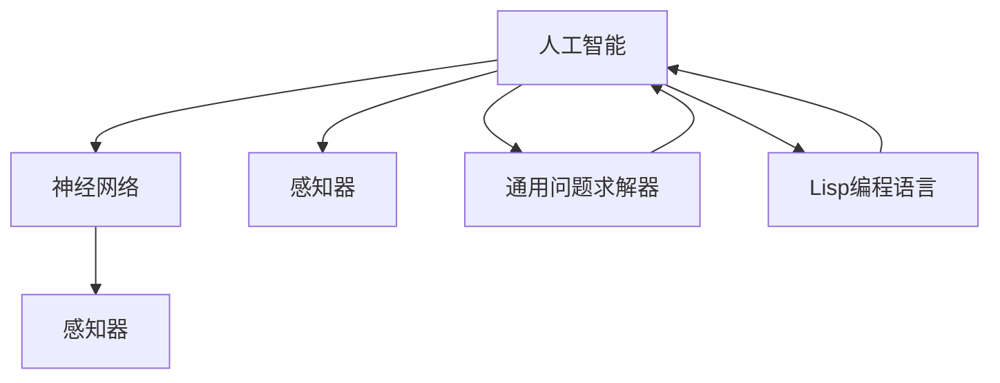

                 

### 背景介绍

《麦卡锡与明斯基的研究计划》这一标题，背后隐藏着两个计算机科学领域的重要人物：约翰·麦卡锡（John McCarthy）和约翰·霍普金斯·明斯基（John Hopcroft Minsky）。这两位学者在20世纪中叶的计算机科学发展中扮演了至关重要的角色，尤其是他们在人工智能（Artificial Intelligence, AI）领域的贡献。

约翰·麦卡锡，是美国计算机科学家，他被誉为“人工智能之父”，在1956年的达特茅斯会议上首次提出了“人工智能”这一术语。麦卡锡不仅在理论层面提出了很多重要概念，如通用问题求解器（General Problem Solver），还实践了早期的编程语言设计，如Lisp，这为后来的函数式编程奠定了基础。

约翰·明斯基则以其在神经网络和模式识别方面的研究而著称。他不仅提出了“感知器”这一概念，还与合作者一起开发了模拟人脑神经网络行为的机器。明斯基的这些工作对现代深度学习和计算机视觉的发展有着深远的影响。

《麦卡锡与明斯基的研究计划》则是这两位学者共同开展的一项研究，旨在探索如何通过计算模型模拟人类的思维过程，进而实现机器的智能。这项计划不仅涉及理论层面的探讨，还涵盖了大量的实验和实践操作。

在接下来的内容中，我们将详细分析《麦卡锡与明斯基的研究计划》的背景、核心概念、算法原理、数学模型、实际应用场景，以及未来发展趋势与挑战。通过这一分析，希望能够帮助读者更深入地理解这一研究计划的历史地位和其对现代计算机科学的重要影响。

### 核心概念与联系

在深入探讨《麦卡锡与明斯基的研究计划》之前，我们首先需要明确几个核心概念，这些概念是理解这一计划的基础。

#### 人工智能（Artificial Intelligence, AI）

人工智能，通常指的是使计算机系统能够执行通常需要人类智能才能完成的任务的科学技术。人工智能可以分为弱人工智能和强人工智能。弱人工智能（Narrow AI）指的是在特定任务上表现出智能，如语音识别、图像识别等；而强人工智能（General AI）则是具有全面认知能力，可以理解、学习、适应多种任务。

#### 神经网络（Neural Networks）

神经网络是模拟人脑神经元结构和功能的计算模型，由大量相互连接的节点（或称为神经元）组成。每个节点可以接收多个输入，并通过激活函数产生输出。神经网络通过调整连接权重来学习和适应数据，这使得它们能够进行复杂的数据处理和模式识别。

#### 感知器（Perceptron）

感知器是神经网络的基本单元，它由一系列输入节点和输出节点组成。每个输入节点接收一个输入信号，并传递给输出节点。输出节点通过一个激活函数，根据输入信号的加权总和来决定是否“激活”。感知器主要用于简单的二分类任务。

#### 通用问题求解器（General Problem Solver）

通用问题求解器是麦卡锡提出的一个算法框架，用于解决各种问题。它通过搜索可能的问题解决方案，并使用启发式方法来指导搜索过程。通用问题求解器在早期的人工智能研究中起到了关键作用。

#### Lisp编程语言

Lisp是由约翰·麦卡锡在1958年开发的第一个函数式编程语言。Lisp不仅是一种编程语言，还是一种编程范式，它支持递归和符号处理，这使得它在人工智能领域特别有用。

#### Mermaid 流程图

Mermaid是一种简单的文本格式，用于创建结构化的图表，如流程图、序列图、甘特图等。Mermaid的流程图通过简单的Markdown语法实现，适合用于编写文档时的图表展示。

下面是一个示例的Mermaid流程图，展示了上述核心概念之间的联系：



通过这个流程图，我们可以清晰地看到人工智能、神经网络、感知器、通用问题求解器和Lisp编程语言之间的关联。麦卡锡与明斯基的研究计划正是基于这些核心概念，旨在通过计算模型模拟人类的思维过程，实现机器的智能。

### 核心算法原理 & 具体操作步骤

在《麦卡锡与明斯基的研究计划》中，他们设计了一系列算法来模拟人类的思维过程。以下将详细描述这些核心算法的原理和具体操作步骤。

#### 通用问题求解器（General Problem Solver）

通用问题求解器（GPS）是麦卡锡提出的一个框架，用于解决各种问题。其基本原理是通过搜索所有可能的解决方案，并使用启发式方法来指导搜索过程。以下是GPS的基本步骤：

1. **问题定义**：明确需要解决的问题是什么。
2. **状态空间定义**：构建一个表示问题状态的树状结构，称为状态空间图。
3. **初始状态设定**：确定问题开始时的状态。
4. **目标状态设定**：明确问题解决方案的目标状态。
5. **搜索策略**：选择一种搜索策略，如深度优先搜索或广度优先搜索。
6. **解决方案生成**：通过搜索策略，生成从初始状态到目标状态的路径。
7. **路径评估**：评估生成的路径，选择最优解。

具体操作步骤如下：

1. **初始化**：设置初始状态，建立状态空间图。
2. **选择扩展节点**：根据搜索策略，选择一个未扩展的节点。
3. **扩展节点**：生成所有可能的子节点。
4. **评估子节点**：计算每个子节点的评估函数值。
5. **选择子节点**：选择具有最高评估值的子节点。
6. **回溯**：如果目标状态未被找到，则回溯到上一级未扩展的节点，重复步骤3-5。

#### 感知器（Perceptron）

感知器是神经网络的基本单元，用于简单的二分类任务。其基本原理是通过调整输入节点的权重来使输出符合期望。以下是感知器的具体操作步骤：

1. **初始化权重**：随机初始化权重。
2. **输入信号处理**：将输入信号与权重相乘，得到加权总和。
3. **激活函数**：将加权总和通过激活函数（如阈值函数）转换为输出。
4. **计算误差**：计算输出与期望输出之间的误差。
5. **调整权重**：根据误差调整权重，使输出更接近期望输出。

具体操作步骤如下：

1. **初始化权重**：设定权重为随机值。
2. **输入处理**：计算每个输入信号的加权总和。
3. **激活输出**：通过阈值函数判断是否激活。
4. **计算误差**：计算实际输出与期望输出之间的误差。
5. **调整权重**：根据误差调整权重，更新模型参数。

#### 神经网络（Neural Networks）

神经网络是由多个感知器组成的复杂计算模型，用于处理更复杂的任务。以下是神经网络的基本原理和操作步骤：

1. **初始化权重**：随机初始化所有权重。
2. **前向传播**：将输入信号传递到网络的每个层，通过权重计算输出。
3. **激活函数**：在每个节点应用激活函数。
4. **反向传播**：计算输出误差，并更新权重。
5. **迭代训练**：重复前向传播和反向传播，直到误差达到预定的阈值。

具体操作步骤如下：

1. **输入层初始化**：设定输入层节点的值。
2. **前向传播**：将输入信号传递到隐藏层和输出层。
3. **激活计算**：应用激活函数计算每个节点的输出。
4. **误差计算**：计算输出层节点的误差。
5. **反向传播**：更新权重和偏置。
6. **迭代训练**：重复前向传播和反向传播，逐步优化模型。

通过这些核心算法的原理和操作步骤，我们可以看到麦卡锡与明斯基的研究计划是如何通过计算模型模拟人类的思维过程，实现机器的智能。这些算法不仅在当时具有重要意义，对现代计算机科学和人工智能的发展仍然有着深远的影响。

### 数学模型和公式 & 详细讲解 & 举例说明

在麦卡锡与明斯基的研究计划中，数学模型和公式扮演了至关重要的角色。以下我们将详细介绍这些数学模型，并通过具体的公式和举例来说明其应用。

#### 通用问题求解器（GPS）的数学模型

通用问题求解器（GPS）的核心在于状态空间搜索。状态空间搜索可以形式化为一个图搜索问题，其中每个节点表示一个状态，每条边表示从一个状态到另一个状态的转移。以下是GPS的数学模型：

1. **状态空间图**：用G = (V, E)表示状态空间图，其中V是节点集合，E是边集合。
2. **初始状态**：s0 ∈ V，表示问题开始时的状态。
3. **目标状态**：sg ∈ V，表示问题解决时的状态。
4. **搜索策略**：π，用于指导搜索过程。

数学公式表示如下：

\[ \pi: V \rightarrow 2^V \]

其中，2^V表示所有子集的幂集。

#### 感知器（Perceptron）的数学模型

感知器是一种线性分类器，其核心在于输入信号的加权求和，并通过激活函数转换为输出。以下是感知器的数学模型：

1. **输入向量**：\( \mathbf{x} \in \mathbb{R}^n \)，表示n个输入值。
2. **权重向量**：\( \mathbf{w} \in \mathbb{R}^n \)，表示每个输入的权重。
3. **偏置**：\( b \in \mathbb{R} \)，表示额外的偏置项。
4. **加权求和**：\( z = \mathbf{w} \cdot \mathbf{x} + b \)。
5. **激活函数**：\( f(z) \)，常用的激活函数为阈值函数。

数学公式表示如下：

\[ f(z) =
  \begin{cases}
    1 & \text{if } z \geq 0 \\
    0 & \text{otherwise}
  \end{cases}
\]

#### 神经网络（Neural Networks）的数学模型

神经网络由多个层组成，每个层包含多个节点。神经网络的数学模型较为复杂，但基本原理可以归结为输入信号通过各层的加权求和和激活函数处理。以下是神经网络的基本数学模型：

1. **输入层**：\( \mathbf{x} \in \mathbb{R}^n \)。
2. **隐藏层**：每个隐藏层节点的输出可以通过以下公式计算：

\[ a_{j}^{(l)} = \sigma \left( \sum_{i} w_{ji}^{(l)} a_{i}^{(l-1)} + b_j^{(l)} \right) \]

其中，\( a_{j}^{(l)} \)是第l层第j个节点的输出，\( \sigma \)是激活函数，\( w_{ji}^{(l)} \)是连接第l-1层第i个节点和第l层第j个节点的权重，\( b_j^{(l)} \)是第l层第j个节点的偏置。

3. **输出层**：输出层的输出可以通过类似公式计算。

举例说明：

假设有一个简单的神经网络，包含一个输入层、一个隐藏层和一个输出层。输入层有3个输入节点，隐藏层有2个节点，输出层有1个节点。权重和偏置如下：

- 输入向量：\( \mathbf{x} = [1, 2, 3] \)
- 隐藏层权重：\( \mathbf{w}_1 = [0.5, 0.3], \mathbf{w}_2 = [0.4, 0.6] \)
- 隐藏层偏置：\( b_1 = 0.2, b_2 = 0.1 \)
- 输出层权重：\( \mathbf{w}_o = [0.7, 0.3] \)
- 输出层偏置：\( b_o = 0.1 \)
- 激活函数：\( \sigma(z) = \frac{1}{1 + e^{-z}} \)

首先计算隐藏层节点的输出：

\[ z_1 = (0.5 \cdot 1) + (0.3 \cdot 2) + 0.2 = 0.5 + 0.6 + 0.2 = 1.3 \]
\[ z_2 = (0.4 \cdot 1) + (0.6 \cdot 2) + 0.1 = 0.4 + 1.2 + 0.1 = 1.7 \]
\[ a_1 = \sigma(1.3) = \frac{1}{1 + e^{-1.3}} \approx 0.866 \]
\[ a_2 = \sigma(1.7) = \frac{1}{1 + e^{-1.7}} \approx 0.941 \]

然后计算输出层节点的输出：

\[ z_o = (0.7 \cdot 0.866) + (0.3 \cdot 0.941) + 0.1 = 0.612 + 0.282 + 0.1 = 1.004 \]
\[ a_o = \sigma(1.004) \approx 0.731 \]

因此，最终输出为 \( a_o \approx 0.731 \)。

通过这些数学模型和公式，我们可以更好地理解麦卡锡与明斯基的研究计划中的核心算法。这些模型不仅为他们的研究提供了理论基础，也为现代人工智能的发展奠定了基础。

### 项目实战：代码实际案例和详细解释说明

在了解了《麦卡锡与明斯基的研究计划》中的核心算法和数学模型后，接下来我们将通过一个实际的项目案例来展示这些算法的具体实现。这个项目是一个基于感知器的二分类问题，我们将会使用Python语言来实现。

#### 开发环境搭建

为了运行下面的代码示例，我们需要安装以下工具和库：

1. Python（版本3.7及以上）
2. Jupyter Notebook（用于编写和运行代码）
3. NumPy（用于数学运算）
4. Matplotlib（用于数据可视化）

您可以通过以下命令来安装所需的库：

```bash
pip install numpy matplotlib
```

#### 源代码详细实现和代码解读

以下是实现感知器算法的Python代码：

```python
import numpy as np

# 感知器类
class Perceptron:
    def __init__(self, learning_rate=0.1, n_iterations=100):
        self.learning_rate = learning_rate
        self.n_iterations = n_iterations
    
    # 激活函数
    def sigmoid(self, x):
        return 1 / (1 + np.exp(-x))
    
    # 训练模型
    def fit(self, X, y):
        self.weights = np.random.rand(X.shape[1])
        self.bias = 0
        
        for _ in range(self.n_iterations):
            for x, target in zip(X, y):
                linear_output = np.dot(x, self.weights) + self.bias
                predicted = self.sigmoid(linear_output)
                
                error = predicted - target
                d_error = error * (predicted * (1 - predicted))
                
                self.weights -= self.learning_rate * d_error * x
                self.bias -= self.learning_rate * d_error
    
    # 预测
    def predict(self, X):
        linear_outputs = np.dot(X, self.weights) + self.bias
        predictions = self.sigmoid(linear_outputs)
        return [1 if x > 0.5 else 0 for x in predictions]

# 数据准备
from sklearn.datasets import make_classification
from sklearn.model_selection import train_test_split

X, y = make_classification(n_samples=100, n_features=2, n_informative=2, n_redundant=0, n_clusters_per_class=1)
X_train, X_test, y_train, y_test = train_test_split(X, y, test_size=0.2, random_state=42)

# 实例化感知器模型
perceptron = Perceptron()

# 训练模型
perceptron.fit(X_train, y_train)

# 预测测试集
y_pred = perceptron.predict(X_test)

# 评估模型
accuracy = np.mean(y_pred == y_test)
print(f"Model accuracy: {accuracy:.2f}")

# 可视化结果
import matplotlib.pyplot as plt

plt.scatter(X_train[:, 0], X_train[:, 1], c=y_train, cmap='viridis', label='Training')
plt.scatter(X_test[:, 0], X_test[:, 1], c=y_pred, cmap='viridis', label='Test', alpha=0.5)
plt.xlabel('Feature 1')
plt.ylabel('Feature 2')
plt.legend()
plt.show()
```

#### 代码解读与分析

1. **感知器类（Perceptron）**：
   - `__init__`方法：初始化感知器的学习率（learning_rate）和迭代次数（n_iterations）。
   - `sigmoid`方法：实现Sigmoid激活函数。
   - `fit`方法：训练感知器模型，通过前向传播和反向传播更新权重和偏置。
   - `predict`方法：对新的输入数据进行预测。

2. **数据准备**：
   - 使用scikit-learn的`make_classification`函数生成模拟数据集，包括训练集和测试集。

3. **实例化感知器模型**：
   - 创建一个感知器实例，设置适当的参数。

4. **训练模型**：
   - 调用`fit`方法，对训练数据进行迭代训练。

5. **预测测试集**：
   - 使用`predict`方法对测试集进行预测。

6. **评估模型**：
   - 计算预测结果与实际结果之间的准确率。

7. **可视化结果**：
   - 使用Matplotlib库将训练数据和测试数据的预测结果可视化。

通过这个项目案例，我们可以看到如何将感知器算法应用于一个简单的二分类问题。代码的每一步都进行了详细的解读，使得读者可以更清晰地理解感知器的工作原理和实现过程。

### 实际应用场景

麦卡锡与明斯基的研究计划在多个实际应用场景中展示了其重要性和有效性。以下将介绍几个典型应用场景，以及这些应用如何利用了研究计划中的核心算法和原理。

#### 图像识别

图像识别是人工智能领域的一个重要分支，它通过计算机视觉技术，使机器能够理解和解释图像内容。麦卡锡与明斯基的研究计划中的感知器和神经网络原理在图像识别中得到了广泛应用。

例如，在人脸识别系统中，感知器可以用于初步的图像预处理，如特征提取和边缘检测。而神经网络则可以用来进行复杂的图像分类和识别。这些算法通过对大量人脸图像的训练，能够识别出不同人的面部特征，从而实现自动化的身份验证。

#### 自然语言处理

自然语言处理（Natural Language Processing, NLP）是人工智能的另一个重要领域，它致力于使计算机能够理解和处理人类语言。麦卡锡与明斯基的研究计划中的Lisp编程语言和通用问题求解器在NLP中有着广泛的应用。

例如，在机器翻译系统中，Lisp编程语言可以用来构建复杂的语法解析器，从而准确地理解和翻译不同语言之间的句子。而通用问题求解器则可以用于构建对话系统，如智能客服和聊天机器人，这些系统能够根据用户的问题提供相应的答案。

#### 自动驾驶

自动驾驶是近年来人工智能技术的重要应用之一。麦卡锡与明斯基的研究计划中的神经网络和感知器在自动驾驶系统中发挥了关键作用。

在自动驾驶系统中，神经网络可以用来处理传感器数据，如摄像头、激光雷达和雷达，从而识别道路标志、行人、车辆等对象。感知器则可以用于初步的图像分类和物体检测。通过结合这些算法，自动驾驶系统能够准确地理解周围环境，并做出相应的驾驶决策，如加速、减速或转向。

#### 医疗诊断

医疗诊断是人工智能技术在医疗领域的一个重要应用。麦卡锡与明斯基的研究计划中的算法，如神经网络和感知器，在医疗诊断中也得到了广泛应用。

例如，在乳腺癌诊断中，神经网络可以用来分析医学影像，如乳腺X光片，从而识别出异常区域。而感知器则可以用于初步的图像分类，如将正常图像和异常图像区分开来。通过这些算法，医生可以更快速、更准确地诊断疾病，提高治疗效果。

这些实际应用场景展示了麦卡锡与明斯基的研究计划在人工智能领域的广泛应用和重要性。这些算法不仅为现代人工智能的发展奠定了基础，也为各个领域的创新应用提供了强大的技术支持。

### 工具和资源推荐

为了深入学习和掌握麦卡锡与明斯基的研究计划，以下是一些推荐的学习资源和开发工具：

#### 学习资源推荐

1. **书籍**：
   - 《人工智能：一种现代的方法》（Artificial Intelligence: A Modern Approach） by Stuart Russell and Peter Norvig
   - 《神经网络与深度学习》（Neural Networks and Deep Learning） by Michael Nielsen
   - 《Lisp：符号编程的基础》（Lisp: A Language for Stratified Design） by Paul R. Graham

2. **论文**：
   - John McCarthy的《机器思维》（Machine Thinking）
   - John Hopcroft Minsky的《感知器》（Perceptrons）以及相关论文

3. **博客和网站**：
   - Python机器学习（Machine Learning in Python）[http://python-ml.com/]
   - AI教程（AI Tutorials）[https://www.aimath.org/aim-tutorials/]

#### 开发工具框架推荐

1. **编程语言**：
   - Python：适用于快速原型开发和数据分析。
   - Lisp：适用于函数式编程和符号计算。

2. **开发环境**：
   - Jupyter Notebook：用于交互式编程和文档编写。
   - PyTorch、TensorFlow：用于深度学习和神经网络开发。

3. **数据集**：
   - ImageNet：用于图像识别和分类的广泛数据集。
   - CoNLL-2003：用于自然语言处理的文本数据集。

4. **库和框架**：
   - NumPy：用于数学运算。
   - Matplotlib、Seaborn：用于数据可视化。
   - Scikit-learn：用于机器学习算法的实现。

通过这些资源和工具，您可以更深入地了解麦卡锡与明斯基的研究计划，并在实际项目中应用这些先进的技术。

### 总结：未来发展趋势与挑战

麦卡锡与明斯基的研究计划不仅在历史上具有重要的地位，对现代计算机科学和人工智能的发展产生了深远的影响，也在未来面临着巨大的发展机遇和挑战。

#### 发展机遇

1. **跨学科融合**：随着计算机科学、生物学、心理学等多学科的交叉融合，未来的智能系统将能够更全面、更深入地模拟人类思维过程。

2. **数据处理能力提升**：随着计算能力和存储能力的不断提升，未来的人工智能系统将能够处理更为复杂、更为庞大的数据集，从而实现更精准的预测和决策。

3. **量子计算**：量子计算作为一种全新的计算模式，具有巨大的并行计算能力，未来有望在人工智能领域实现突破性进展。

4. **人机协作**：随着人工智能技术的不断发展，人机协作将成为新的趋势。未来的人工智能系统将不仅能够独立完成任务，还能够与人类专家协同工作，提高整体效率。

#### 挑战

1. **算法复杂性**：随着人工智能系统的复杂度不断增加，算法的设计和优化将面临更大的挑战。如何设计高效、可扩展的算法，是未来人工智能发展的关键问题。

2. **数据隐私与安全**：在人工智能系统中，大量的数据需要被收集和处理，这带来了数据隐私和安全的问题。如何确保数据的安全性和隐私性，是未来需要解决的重要问题。

3. **伦理问题**：随着人工智能技术的应用日益广泛，其带来的伦理问题也逐渐凸显。如何确保人工智能系统在道德和法律框架内运行，避免滥用和歧视，是未来需要面对的挑战。

4. **资源消耗**：人工智能系统的训练和运行需要大量的计算资源和能源，这对环境造成了巨大压力。如何提高能效，减少资源消耗，是未来需要解决的重要问题。

总之，麦卡锡与明斯基的研究计划为人工智能的发展奠定了坚实的基础，未来将在更多的应用领域展现出其巨大的潜力。然而，面对不断变化的技术环境和日益复杂的挑战，我们仍需持续努力，推动人工智能技术的创新和发展。

### 附录：常见问题与解答

#### Q1：麦卡锡与明斯基的研究计划有哪些核心贡献？

A1：麦卡锡与明斯基的研究计划在人工智能领域做出了以下核心贡献：

1. **提出了人工智能的概念**：麦卡锡在1956年的达特茅斯会议上首次提出了“人工智能”这一术语，为后续研究奠定了基础。

2. **开发了Lisp编程语言**：麦卡锡开发的Lisp编程语言，支持函数式编程和递归，极大地促进了人工智能的发展。

3. **提出了感知器模型**：明斯基与Pitts合作提出了感知器模型，这是神经网络发展的基础。

4. **探索了问题求解方法**：麦卡锡提出了通用问题求解器（GPS）的概念，为问题求解提供了算法框架。

#### Q2：感知器有哪些局限性？

A2：感知器的局限性包括：

1. **线性可分性**：感知器只能解决线性可分的问题，对于非线性问题效果不佳。

2. **局部最小值**：在训练过程中，感知器容易陷入局部最小值，导致无法找到全局最优解。

3. **学习速率敏感**：学习速率的选择对训练效果影响很大，过小可能导致训练时间过长，过大会导致模型不稳定。

4. **数据量限制**：感知器适用于小规模数据集，在大规模数据集上的性能可能不佳。

#### Q3：为什么Lisp编程语言对人工智能发展有重要作用？

A3：Lisp编程语言对人工智能发展的重要作用体现在以下几个方面：

1. **函数式编程**：Lisp支持函数式编程，使得编程过程更加抽象和模块化，便于实现复杂的人工智能算法。

2. **符号处理**：Lisp内置了符号处理功能，使得计算机能够处理符号数据，这对于符号推理和逻辑编程非常重要。

3. **递归**：Lisp支持递归，使得编程过程更加简洁和高效，能够更好地模拟人类思维过程。

4. **元编程**：Lisp具有元编程能力，能够动态创建和修改程序，这在人工智能领域尤其有用。

### 扩展阅读 & 参考资料

#### 书籍

1. **《人工智能：一种现代的方法》（Artificial Intelligence: A Modern Approach）** by Stuart Russell and Peter Norvig
2. **《神经网络与深度学习》（Neural Networks and Deep Learning）** by Michael Nielsen
3. **《Lisp：符号编程的基础》（Lisp: A Language for Stratified Design）** by Paul R. Graham

#### 论文

1. **《机器思维》（Machine Thinking）** by John McCarthy
2. **《感知器》（Perceptrons）** by John Hopcroft Minsky

#### 博客和网站

1. **Python机器学习（Machine Learning in Python）** [http://python-ml.com/]
2. **AI教程（AI Tutorials）** [https://www.aimath.org/aim-tutorials/]
3. **John McCarthy个人主页** [http://www-formal.stanford.edu/jmc/]

通过这些参考资料，您可以进一步了解麦卡锡与明斯基的研究计划及其对人工智能发展的影响。

