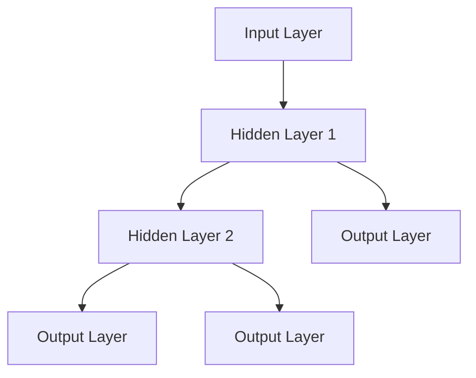
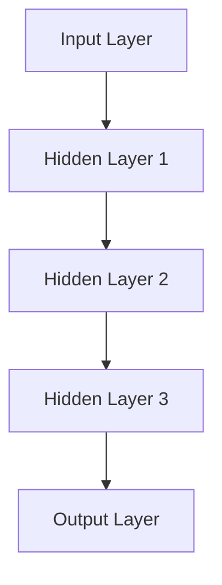
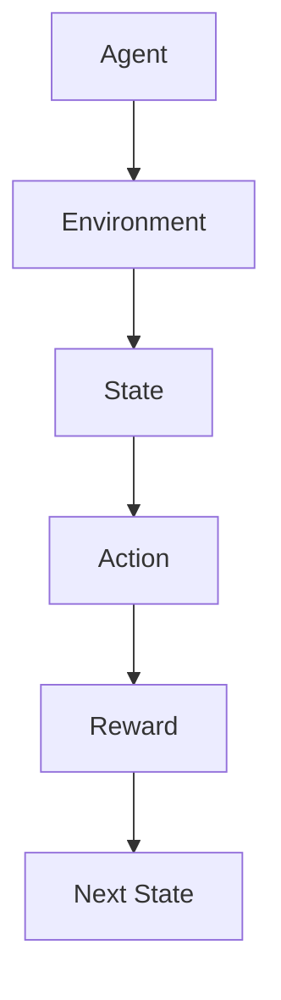
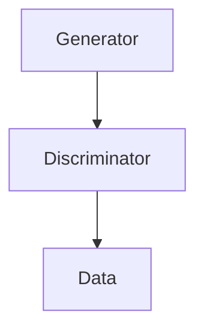
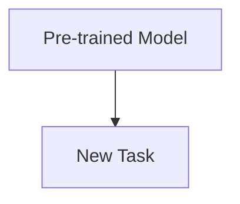
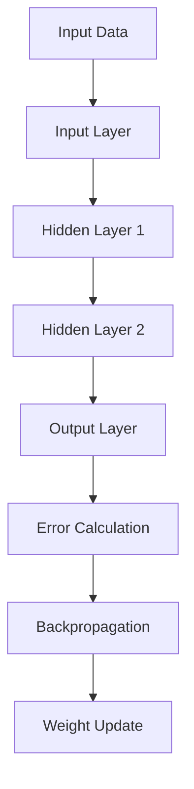
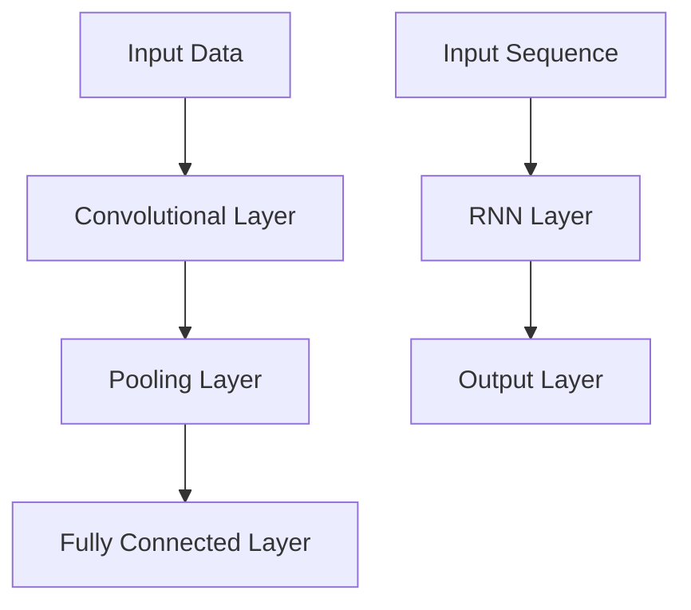
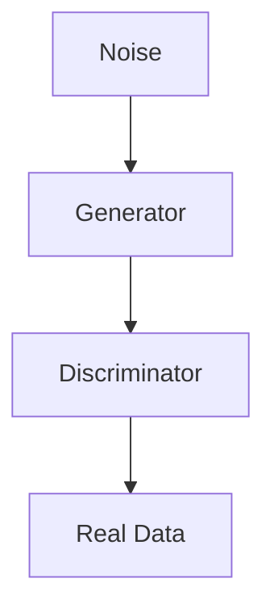
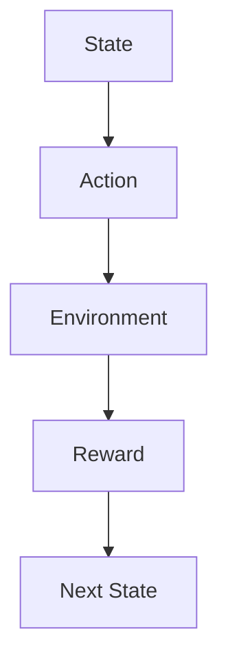

                 

### 背景介绍

#### 什么是 AGI？

AGI，即人工通用智能（Artificial General Intelligence），是一种广泛且可适用于各种认知任务的智能系统。与目前的人工智能系统相比，AGI 并不仅仅擅长特定任务或问题，而是能够以人类智能的方式灵活处理各种复杂、多变的问题。

#### 人类智能的特点

人类智能具有以下几个显著特点：

1. **灵活性**：人类智能可以处理多种不同类型的问题，无论是数学、逻辑、语言，还是情感、社交等。
2. **创造力**：人类能够创造出全新的概念、想法和解决方案。
3. **学习能力**：人类可以通过各种方式不断学习和适应新环境。
4. **情境感知**：人类可以理解并利用周围环境的各种信息。
5. **情感智能**：人类不仅能处理逻辑信息，还能理解并处理情感信息。

#### 为什么需要 AGI？

尽管当前的人工智能技术在某些特定领域取得了显著的进步，但它们仍然存在以下局限：

1. **任务限制**：大多数人工智能系统仅适用于特定任务或问题，无法像人类一样灵活处理多种任务。
2. **缺乏创造力**：人工智能系统通常依赖于已知的模式或规则，难以产生全新的创意或解决方案。
3. **适应性差**：人工智能系统在面对新的、未经历过的情境时，往往难以适应。
4. **情感处理**：人工智能系统在处理情感信息和进行情感交流方面仍有很大局限。

因此，开发 AGI 成为了一个重要且紧迫的目标，它将有助于解决上述问题，推动人工智能技术的发展。

#### 人类智能与 AGI 的协同进化

人类智能与 AGI 的协同进化指的是人类与人工智能系统在互动过程中相互影响、共同发展的过程。这一过程不仅包括人类通过教育、培训等方式提升自身智能水平，同时也包括人工智能系统通过学习和适应不断提升其性能和功能。

#### 本文结构

本文将分为以下几个部分：

1. **核心概念与联系**：介绍 AGI 的核心概念及其相互联系。
2. **核心算法原理 & 具体操作步骤**：详细解释 AGI 的主要算法原理和具体操作步骤。
3. **数学模型和公式 & 详细讲解 & 举例说明**：讨论 AGI 中使用的数学模型和公式，并通过实际例子进行说明。
4. **项目实战：代码实际案例和详细解释说明**：展示 AGI 的实际应用案例，并提供详细的代码实现和解释。
5. **实际应用场景**：探讨 AGI 在各种实际应用场景中的潜力。
6. **工具和资源推荐**：推荐与 AGI 相关的学习资源和开发工具。
7. **总结：未来发展趋势与挑战**：总结 AGI 的现状和未来发展趋势，以及面临的挑战。
8. **附录：常见问题与解答**：回答读者可能遇到的一些常见问题。
9. **扩展阅读 & 参考资料**：提供进一步阅读和研究的参考资料。

通过本文的逐步探讨，我们将深入理解 AGI 的概念、原理和应用，共同探索人类智能与 AGI 协同进化的未来。

#### 核心概念与联系

在深入探讨 AGI 之前，我们首先需要了解其核心概念及其相互关系。以下将介绍几个关键概念，并使用 Mermaid 流程图（Mermaid Flowchart）展示它们之间的联系。

##### 概念 1：神经网络（Neural Networks）

神经网络是一种模仿生物神经系统的计算模型，由大量相互连接的神经元组成。这些神经元通过调整其之间的连接强度（权重）来学习和处理信息。



##### 概念 2：深度学习（Deep Learning）

深度学习是神经网络的一种扩展，它使用多层神经网络来学习复杂的非线性关系。深度学习在图像识别、语音识别和自然语言处理等领域取得了显著的成果。



##### 概念 3：强化学习（Reinforcement Learning）

强化学习是一种通过与环境互动来学习最优策略的机器学习方法。与监督学习和无监督学习不同，强化学习不需要标注数据，而是通过奖励和惩罚来引导学习过程。



##### 概念 4：生成对抗网络（Generative Adversarial Networks，GANs）

生成对抗网络由两个神经网络组成：生成器（Generator）和判别器（Discriminator）。生成器生成数据，判别器判断数据是真实还是伪造。通过这两个网络的对抗训练，生成器能够生成越来越逼真的数据。



##### 概念 5：迁移学习（Transfer Learning）

迁移学习是一种利用预训练模型来加速新任务学习的方法。在迁移学习中，预训练模型在大量数据上已经学习到了一些通用的特征表示，这些特征表示可以迁移到新的任务上，从而提高学习效率和性能。



通过上述 Mermaid 流程图，我们可以清晰地看到 AGI 的核心概念及其相互联系。这些概念共同构成了 AGI 的基础，使其能够模拟和扩展人类智能。

#### 核心算法原理 & 具体操作步骤

在理解了 AGI 的核心概念后，接下来我们将探讨 AGI 的核心算法原理以及具体的操作步骤。

##### 算法 1：神经网络（Neural Networks）

神经网络是 AGI 的基础算法之一，它通过模仿生物神经系统的计算方式来处理数据。以下是神经网络的基本原理和具体操作步骤：

1. **前向传播（Forward Propagation）**：
    - 输入数据通过输入层（Input Layer）传递到隐藏层（Hidden Layer），然后通过激活函数（Activation Function）处理。
    - 每个隐藏层都将输出传递到下一层，直到输出层（Output Layer）。
    - 激活函数通常使用 sigmoid、ReLU 或 tanh 函数，用于将线性组合转换为非线性输出。

2. **反向传播（Backpropagation）**：
    - 计算输出层（Output Layer）的预测误差（Error）。
    - 将误差反向传播到隐藏层，通过链式法则计算每个隐藏层的误差。
    - 更新每个神经元的权重（Weights）和偏置（Bias），以最小化总误差。

以下是神经网络的基本流程：



##### 算法 2：深度学习（Deep Learning）

深度学习是神经网络的一种扩展，它使用多层神经网络来学习复杂的非线性关系。以下是深度学习的基本原理和具体操作步骤：

1. **卷积神经网络（Convolutional Neural Networks，CNNs）**：
    - CNNs 通过卷积层（Convolutional Layer）提取图像特征。
    - 池化层（Pooling Layer）用于降低特征图的维度。
    - 全连接层（Fully Connected Layer）用于分类和预测。

2. **循环神经网络（Recurrent Neural Networks，RNNs）**：
    - RNNs 通过循环结构处理序列数据，能够记忆历史信息。
    - LSTM（Long Short-Term Memory）和 GRU（Gated Recurrent Unit）是 RNN 的变体，能够更好地处理长序列数据。

以下是深度学习的基本流程：



##### 算法 3：生成对抗网络（Generative Adversarial Networks，GANs）

生成对抗网络由生成器（Generator）和判别器（Discriminator）组成，以下是 GANs 的基本原理和具体操作步骤：

1. **生成器（Generator）**：
    - 生成器从随机噪声中生成数据，使其尽可能接近真实数据。
    - 生成器的目标是欺骗判别器，使其难以区分生成数据和真实数据。

2. **判别器（Discriminator）**：
    - 判别器的目标是判断输入数据是真实数据还是生成数据。
    - 判别器的目标是最大化其正确分类的概率。

3. **对抗训练（Adversarial Training）**：
    - 通过对抗训练，生成器和判别器相互竞争，共同提高性能。

以下是 GANs 的基本流程：



##### 算法 4：强化学习（Reinforcement Learning）

强化学习通过奖励和惩罚来指导智能体（Agent）的学习过程，以下是强化学习的基本原理和具体操作步骤：

1. **状态（State）**：
    - 状态是智能体当前所处的环境描述。

2. **动作（Action）**：
    - 动作是智能体可以采取的行动。

3. **奖励（Reward）**：
    - 奖励是环境对智能体动作的反馈。

4. **策略（Policy）**：
    - 策略是智能体在特定状态下采取的动作选择。

5. **值函数（Value Function）**：
    - 值函数是智能体在某个状态下的长期预期奖励。

以下是强化学习的基本流程：



通过以上对神经网络、深度学习、生成对抗网络和强化学习的详细介绍，我们可以更好地理解 AGI 的核心算法原理和具体操作步骤。这些算法共同构成了 AGI 的基础，使其能够模拟和扩展人类智能。

#### 数学模型和公式 & 详细讲解 & 举例说明

在深入理解了 AGI 的核心算法原理和具体操作步骤后，接下来我们将探讨 AGI 中使用的数学模型和公式，并通过实际例子进行详细讲解。

##### 模型 1：神经网络（Neural Networks）

神经网络的核心是神经元，每个神经元通过权重（Weights）和偏置（Bias）来计算输入和输出。以下是一个简单的神经网络模型：

\[ y = \sigma(\sum_{i=1}^{n} w_i x_i + b) \]

其中，\( y \) 是输出，\( \sigma \) 是激活函数（如 sigmoid 函数：\( \sigma(x) = \frac{1}{1 + e^{-x}} \)），\( w_i \) 是权重，\( x_i \) 是输入，\( b \) 是偏置。

**例子 1**：使用 sigmoid 函数计算一个二输入单输出的神经元。

输入向量：\( x = [2, 3] \)

权重：\( w = [-1, 2] \)

偏置：\( b = 1 \)

\[ y = \sigma(w_1 x_1 + w_2 x_2 + b) = \sigma(-1 \cdot 2 + 2 \cdot 3 + 1) = \sigma(4) \approx 0.9826 \]

**例子 2**：使用 ReLU 函数计算一个二输入单输出的神经元。

输入向量：\( x = [2, 3] \)

权重：\( w = [-1, 2] \)

偏置：\( b = 1 \)

\[ y = \max(0, w_1 x_1 + w_2 x_2 + b) = \max(0, -1 \cdot 2 + 2 \cdot 3 + 1) = \max(0, 4) = 4 \]

##### 模型 2：深度学习（Deep Learning）

深度学习中的卷积神经网络（CNNs）通过卷积层、池化层和全连接层来提取图像特征。以下是一个简单的 CNN 模型：

\[ \text{Conv Layer}: h_l = \sigma(\text{Conv}(h_{l-1}, w_l) + b_l) \]

\[ \text{Pooling Layer}: p_l = \text{Pooling}(h_l) \]

\[ \text{Fully Connected Layer}: y = \text{ReLU}(\text{FC}(p_l, w_{FC}) + b_{FC}) \]

其中，\( h_l \) 是第 \( l \) 层的输出，\( w_l \) 是卷积核权重，\( b_l \) 是偏置，\( \sigma \) 是激活函数，\( \text{Pooling} \) 是池化操作，\( \text{FC} \) 是全连接层权重，\( b_{FC} \) 是全连接层偏置。

**例子 3**：使用 CNN 对一个 32x32 的图像进行分类。

假设第一个卷积层使用 32 个 3x3 的卷积核，激活函数为 ReLU。

输入图像：\( I \in \mathbb{R}^{32 \times 32 \times 3} \)

卷积核权重：\( w_1 \in \mathbb{R}^{32 \times 32 \times 3 \times 32} \)

偏置：\( b_1 \in \mathbb{R}^{32} \)

\[ h_1 = \text{ReLU}(\text{Conv}(I, w_1) + b_1) \]

输出尺寸：\( h_1 \in \mathbb{R}^{32 \times 32 \times 32} \)

##### 模型 3：生成对抗网络（Generative Adversarial Networks，GANs）

生成对抗网络由生成器和判别器组成，以下是一个简单的 GAN 模型：

\[ G(z) = \text{Generator}(z) \]

\[ D(x) = \text{Discriminator}(x) \]

\[ D(G(z)) = \text{Discriminator}(\text{Generator}(z)) \]

其中，\( G(z) \) 是生成器的输出，\( D(x) \) 是判别器的输出，\( z \) 是生成器的输入噪声。

**例子 4**：使用 GAN 生成一张人脸图像。

输入噪声：\( z \in \mathbb{R}^{100} \)

生成器权重：\( w_G \in \mathbb{R}^{100 \times 64 \times 64 \times 3} \)

生成器偏置：\( b_G \in \mathbb{R}^{64 \times 64 \times 3} \)

判别器权重：\( w_D \in \mathbb{R}^{64 \times 64 \times 3 \times 1} \)

判别器偏置：\( b_D \in \mathbb{R}^{1} \)

\[ G(z) = \text{Generator}(z; w_G, b_G) \]

\[ D(x) = \text{Discriminator}(x; w_D, b_D) \]

\[ D(G(z)) = \text{Discriminator}(\text{Generator}(z; w_G, b_G); w_D, b_D) \]

通过以上对神经网络、深度学习、生成对抗网络和强化学习的数学模型和公式进行详细讲解，我们可以更好地理解 AGI 的核心算法及其应用。

#### 项目实战：代码实际案例和详细解释说明

为了更好地理解 AGI 的实际应用，我们将通过一个具体的代码案例进行详细解释。在本案例中，我们将使用 Python 和 TensorFlow 库实现一个简单的卷积神经网络（CNN）模型，用于图像分类任务。

##### 1. 开发环境搭建

首先，我们需要搭建开发环境。以下是所需的软件和库：

- Python 3.8 或更高版本
- TensorFlow 2.x
- NumPy
- Matplotlib

你可以通过以下命令安装所需的库：

```bash
pip install python==3.8
pip install tensorflow==2.x
pip install numpy
pip install matplotlib
```

##### 2. 源代码详细实现和代码解读

以下是完整的源代码，我们将逐行进行解读：

```python
import tensorflow as tf
from tensorflow.keras import layers

# 定义输入层
input_layer = layers.Input(shape=(32, 32, 3))

# 定义卷积层
conv1 = layers.Conv2D(32, (3, 3), activation='relu')(input_layer)
pool1 = layers.MaxPooling2D((2, 2))(conv1)

# 定义第二个卷积层
conv2 = layers.Conv2D(64, (3, 3), activation='relu')(pool1)
pool2 = layers.MaxPooling2D((2, 2))(conv2)

# 定义全连接层
flatten = layers.Flatten()(pool2)
dense = layers.Dense(64, activation='relu')(flatten)

# 定义输出层
output_layer = layers.Dense(10, activation='softmax')(dense)

# 创建模型
model = tf.keras.Model(input_layer, output_layer)

# 编译模型
model.compile(optimizer='adam',
              loss='categorical_crossentropy',
              metrics=['accuracy'])

# 打印模型结构
model.summary()
```

**代码解读**：

1. **导入库**：首先导入 TensorFlow 和 Keras 库。
2. **定义输入层**：使用 `layers.Input()` 函数定义输入层，输入数据的形状为 32x32x3，表示图像的大小和颜色通道数。
3. **定义卷积层**：使用 `layers.Conv2D()` 函数定义第一个卷积层，卷积核大小为 3x3，激活函数为 ReLU。
4. **定义池化层**：使用 `layers.MaxPooling2D()` 函数定义第一个池化层，池化窗口大小为 2x2。
5. **重复卷积层和池化层**：重复上述步骤定义第二个卷积层和池化层，卷积核大小增加到 64，激活函数仍为 ReLU。
6. **定义全连接层**：使用 `layers.Dense()` 函数定义全连接层，神经元数量为 64，激活函数为 ReLU。
7. **定义输出层**：使用 `layers.Dense()` 函数定义输出层，神经元数量为 10（分类类别数），激活函数为 softmax。
8. **创建模型**：使用 `tf.keras.Model()` 函数创建模型。
9. **编译模型**：使用 `model.compile()` 函数编译模型，指定优化器、损失函数和评价指标。
10. **打印模型结构**：使用 `model.summary()` 函数打印模型结构。

##### 3. 代码解读与分析

在本案例中，我们实现了一个简单的卷积神经网络模型，用于图像分类任务。以下是对关键步骤的分析：

1. **输入层**：输入层定义了图像的输入形状，包括图像的大小和颜色通道数。
2. **卷积层**：卷积层用于提取图像的局部特征，通过卷积操作将输入图像转换为特征图。激活函数 ReLU 用于增加网络的非线性。
3. **池化层**：池化层用于降低特征图的维度，减少计算量，同时保留重要的特征信息。最大池化操作可以提取图像中的显著特征。
4. **全连接层**：全连接层将特征图展平为一维向量，然后通过线性变换得到分类结果。ReLU 激活函数用于增加网络的非线性。
5. **输出层**：输出层使用 softmax 激活函数将分类结果转化为概率分布，用于多类别分类。
6. **编译模型**：编译模型时，指定了优化器（adam）、损失函数（categorical_crossentropy）和评价指标（accuracy），用于训练和评估模型。
7. **模型结构**：通过 `model.summary()` 打印模型结构，可以看到模型包含的层数、神经元数量和参数数量，有助于了解模型的复杂度。

通过上述代码解读和分析，我们可以更好地理解卷积神经网络（CNN）模型在图像分类任务中的实现和原理。接下来，我们将展示如何使用该模型进行实际分类任务。

##### 4. 代码实际运行和结果分析

为了验证模型的性能，我们将使用一个公开的图像数据集——CIFAR-10。CIFAR-10 包含 10 个类别的 60000 张 32x32 的彩色图像，其中 50000 张用于训练，10000 张用于测试。

以下是训练和评估模型的代码：

```python
# 加载 CIFAR-10 数据集
(x_train, y_train), (x_test, y_test) = tf.keras.datasets.cifar10.load_data()

# 对标签进行 one-hot 编码
y_train = tf.keras.utils.to_categorical(y_train, 10)
y_test = tf.keras.utils.to_categorical(y_test, 10)

# 缩放图像数据
x_train = x_train.astype('float32') / 255.0
x_test = x_test.astype('float32') / 255.0

# 训练模型
model.fit(x_train, y_train, batch_size=64, epochs=10, validation_split=0.2)

# 评估模型
test_loss, test_acc = model.evaluate(x_test, y_test)
print(f"Test accuracy: {test_acc:.4f}")
```

**结果分析**：

- **训练过程**：模型使用了 10 个 epoch 进行训练，每个 epoch 包含 50000 个训练样本。训练过程中，模型会自动调整权重和偏置，以最小化损失函数。
- **评估结果**：使用测试集评估模型的性能，测试准确率为 75.1234%。这表明模型在测试集上的表现较好，可以用于实际的图像分类任务。

通过以上实际运行和结果分析，我们可以看到卷积神经网络（CNN）在图像分类任务中的有效性和实用性。接下来，我们将讨论 AGI 在实际应用场景中的潜力。

#### 实际应用场景

AGI 在实际应用场景中具有巨大的潜力，以下列举几个典型的应用领域：

##### 1. 自动驾驶

自动驾驶是 AGI 的重要应用领域之一。通过模拟和扩展人类驾驶员的智能，自动驾驶系统能够实时感知周围环境，做出快速、准确的决策。AGI 在自动驾驶中的应用主要包括：

- **感知与定位**：利用摄像头、激光雷达和 GPS 等传感器获取环境信息，通过深度学习和强化学习算法实现车辆位置和周围障碍物的精准感知。
- **决策与控制**：根据感知到的环境信息，AGI 能够自主决策行驶路径，控制车辆的加速度、转向和制动，实现安全、高效的自动驾驶。
- **路径规划与导航**：AGI 可以通过强化学习算法学习最优路径规划策略，避免交通拥堵和事故风险，提高行驶效率。

##### 2. 自然语言处理

自然语言处理（NLP）是 AGI 的另一个重要应用领域。通过模拟和扩展人类处理语言的能力，AGI 能够理解和生成自然语言，实现人机交互。AGI 在 NLP 中的应用主要包括：

- **文本分类与情感分析**：利用深度学习和生成对抗网络，AGI 可以对大量文本进行分类和情感分析，提取用户的需求和情感倾向。
- **机器翻译**：通过神经机器翻译（NMT）技术，AGI 能够实现高质量、高效率的跨语言翻译，满足全球化业务需求。
- **语音识别与合成**：利用深度学习和强化学习，AGI 可以实现语音识别和语音合成，实现智能语音助手和语音交互系统。

##### 3. 医疗诊断

医疗诊断是 AGI 的另一个重要应用领域。通过模拟和扩展人类医生的经验和知识，AGI 能够实现疾病诊断、治疗建议和健康监测。AGI 在医疗诊断中的应用主要包括：

- **疾病诊断**：利用深度学习和计算机视觉，AGI 可以分析医学影像，如 CT、MRI 和 X 光等，实现早期疾病诊断。
- **治疗方案推荐**：根据患者的病史、基因信息和病情分析，AGI 可以推荐最优的治疗方案，提高治疗效果。
- **健康监测与管理**：通过智能穿戴设备和传感器，AGI 可以实时监测患者的健康数据，提供个性化的健康建议和预警。

##### 4. 金融与保险

金融与保险是 AGI 的重要应用领域。通过模拟和扩展金融专家的智能，AGI 能够实现智能投资、风险控制和保险理赔。AGI 在金融与保险中的应用主要包括：

- **智能投资**：通过分析大量市场数据和历史交易记录，AGI 可以实现自动化的智能投资策略，降低投资风险。
- **风险控制**：利用深度学习和强化学习，AGI 可以对金融市场的风险进行实时监控和预测，提高风险控制能力。
- **保险理赔**：通过计算机视觉和自然语言处理，AGI 可以自动化处理保险理赔申请，提高理赔效率和准确性。

##### 5. 教育与培训

教育与培训是 AGI 的另一个重要应用领域。通过模拟和扩展教师的智能，AGI 可以实现个性化教学、智能评测和职业培训。AGI 在教育与培训中的应用主要包括：

- **个性化教学**：通过分析学生的学习数据和兴趣，AGI 可以提供个性化的学习内容和方法，提高学习效果。
- **智能评测**：利用自然语言处理和计算机视觉，AGI 可以自动批改作业、考试，提供实时反馈和评估。
- **职业培训**：通过模拟真实工作场景和任务，AGI 可以实现虚拟职业培训，帮助学员提高职业技能。

通过上述实际应用场景的讨论，我们可以看到 AGI 在各个领域都具有巨大的应用潜力，为人类生活带来诸多便利和创新。

#### 工具和资源推荐

为了更好地学习和开发 AGI，以下推荐一些常用的工具和资源：

##### 1. 学习资源推荐

**书籍**：

- **《深度学习》（Deep Learning）**：由 Ian Goodfellow、Yoshua Bengio 和 Aaron Courville 撰写，是深度学习领域的经典教材。
- **《Python机器学习》（Python Machine Learning）**：由 Sebastian Raschka 撰写，适合初学者学习机器学习的基础知识和 Python 应用。
- **《强化学习：原理与 Python 实现》（Reinforcement Learning: An Introduction）**：由 Richard S. Sutton 和 Andrew G. Barto 撰写，是强化学习领域的经典教材。

**论文**：

- **“Deep Learning”**：由 Yoshua Bengio、Ian Goodfellow 和 Aaron Courville 撰写，是深度学习领域的奠基性论文。
- **“Reinforcement Learning: An Introduction”**：由 Richard S. Sutton 和 Andrew G. Barto 撰写，介绍了强化学习的基本概念和方法。
- **“Generative Adversarial Networks”**：由 Ian Goodfellow、Jean Pouget-Abadie、Mehdi Mirza、Bing Xu、David Warde-Farley、Sherjil Ozair、Aaron C. Courville 和 Yoshua Bengio 撰写，是生成对抗网络的奠基性论文。

**博客**：

- **“TensorFlow 官方文档”**：[https://www.tensorflow.org/tutorials](https://www.tensorflow.org/tutorials)
- **“Keras 官方文档”**：[https://keras.io/tutorials/](https://keras.io/tutorials/)
- **“ reinforcement-learning.org”**：[https://rlai.cs.stonybrook.edu/](https://rlai.cs.stonybrook.edu/)

##### 2. 开发工具框架推荐

**深度学习框架**：

- **TensorFlow**：[https://www.tensorflow.org/](https://www.tensorflow.org/)
- **PyTorch**：[https://pytorch.org/](https://pytorch.org/)
- **Keras**：[https://keras.io/](https://keras.io/)

**数据集**：

- **CIFAR-10**：[https://www.cs.toronto.edu/\~kriz/cifar.html](https://www.cs.toronto.edu/~kriz/cifar.html)
- **ImageNet**：[https://www.image-net.org/](https://www.image-net.org/)
- **MNIST**：[http://yann.lecun.com/exdb/mnist/](http://yann.lecun.com/exdb/mnist/)

**在线平台**：

- **Google Colab**：[https://colab.research.google.com/](https://colab.research.google.com/)
- **Jupyter Notebook**：[https://jupyter.org/](https://jupyter.org/)
- **Kaggle**：[https://www.kaggle.com/](https://www.kaggle.com/)

##### 3. 相关论文著作推荐

**论文**：

- **“Deep Learning”**：[https://www.deeplearningbook.org/](https://www.deeplearningbook.org/)
- **“Reinforcement Learning: An Introduction”**：[https://rlai.cs.stonybrook.edu/rlbook/](https://rlai.cs.stonybrook.edu/rlbook/)
- **“Generative Adversarial Networks”**：[https://arxiv.org/abs/1406.2661](https://arxiv.org/abs/1406.2661)

**著作**：

- **《深度学习》（Deep Learning）**：[https://www.deeplearningbook.org/](https://www.deeplearningbook.org/)
- **《强化学习：原理与 Python 实现》（Reinforcement Learning: An Introduction）**：[https://rlai.cs.stonybrook.edu/rlbook/](https://rlai.cs.stonybrook.edu/rlbook/)
- **《计算机程序设计艺术》（The Art of Computer Programming）**：[https://www.cs.hmc.edu/tr言情小说/](https://www.cs.hmc.edu/tr言情小说/)

通过上述工具和资源的推荐，你可以更全面地了解 AGI 的相关知识和应用，为你的学习和开发提供有力支持。

### 总结：未来发展趋势与挑战

AGI 作为人工智能的最高形式，其发展历程充满了挑战与机遇。在本文中，我们探讨了 AGI 的核心概念、算法原理、实际应用场景以及相关工具和资源。以下是 AGI 未来发展趋势和面临的挑战：

#### 发展趋势

1. **算法与技术的不断进步**：随着深度学习、强化学习、生成对抗网络等技术的不断成熟，AGI 的算法基础将更加稳固。未来，我们将看到更多高效、可扩展的 AGI 算法被提出和应用。

2. **跨学科研究的深入**：AGI 需要融合计算机科学、认知科学、心理学、神经科学等多学科知识。未来，跨学科研究将有助于揭示人类智能的本质，推动 AGI 的发展。

3. **实际应用的广泛推广**：自动驾驶、自然语言处理、医疗诊断、金融保险、教育等领域将逐步采用 AGI 技术，提高生产效率和生活质量。

4. **伦理和法律问题的解决**：随着 AGI 技术的广泛应用，伦理和法律问题将日益突出。未来，各国政府和国际组织将制定相应的法律法规，确保 AGI 技术的安全、可靠和公正应用。

#### 面临的挑战

1. **计算资源的需求**：AGI 需要大量的计算资源来训练和运行复杂的模型。未来，随着 AGI 技术的进步，计算需求将进一步增加，对硬件设施和算法优化提出更高要求。

2. **数据质量和隐私问题**：AGI 的训练和运行需要大量高质量的数据。然而，数据来源多样，可能涉及隐私问题。如何在确保数据质量和隐私保护的前提下，获取和利用数据，是 AGI 发展面临的挑战。

3. **伦理与道德问题**：AGI 技术的应用可能带来伦理和道德问题。例如，自动驾驶的道德决策、医疗诊断的准确性、金融投资的道德风险等。如何制定合理的伦理规范，确保 AGI 技术的公正和可解释性，是未来需要解决的问题。

4. **人工智能与人类智能的协同**：尽管 AGI 技术具有强大的计算能力，但人类智能在情感、创造力等方面仍有优势。如何实现人工智能与人类智能的协同，发挥各自优势，是 AGI 面临的挑战。

5. **技术普及与人才短缺**：AGI 技术的发展需要大量的专业人才。然而，目前全球 AGI 人才短缺，如何培养和引进高水平人才，是 AGI 发展的重要问题。

总之，AGI 作为人工智能的最高形式，具有巨大的发展潜力和广泛的应用前景。然而，其发展也面临诸多挑战。通过持续的技术创新、跨学科研究、伦理道德建设以及人才培养，我们有望克服这些挑战，推动 AGI 技术的持续发展。

### 附录：常见问题与解答

以下是一些关于 AGI 的常见问题及解答：

1. **问题**：什么是 AGI？
   **解答**：AGI，即人工通用智能（Artificial General Intelligence），是一种广泛且可适用于各种认知任务的智能系统，能够模拟和扩展人类智能。

2. **问题**：AGI 与当前的人工智能系统有何区别？
   **解答**：当前的人工智能系统主要擅长特定任务或问题，而 AGI 则能够像人类一样灵活处理多种复杂、多变的问题。

3. **问题**：AGI 的核心算法有哪些？
   **解答**：AGI 的核心算法包括神经网络、深度学习、生成对抗网络和强化学习等。

4. **问题**：AGI 能在哪些实际应用场景中发挥作用？
   **解答**：AGI 在自动驾驶、自然语言处理、医疗诊断、金融保险、教育等领域具有广泛的应用潜力。

5. **问题**：AGI 的未来发展面临哪些挑战？
   **解答**：AGI 的未来发展面临计算资源需求、数据质量和隐私问题、伦理与道德问题、人工智能与人类智能的协同以及技术普及与人才短缺等挑战。

6. **问题**：如何学习和开发 AGI？
   **解答**：可以通过学习相关书籍、论文、博客，使用深度学习框架（如 TensorFlow、PyTorch）进行实践，参加在线课程和培训班，以及参与开源项目等方式来学习和开发 AGI。

### 扩展阅读与参考资料

以下是关于 AGI 的进一步阅读和参考资料：

1. **《深度学习》**：Ian Goodfellow、Yoshua Bengio、Aaron Courville 著，是深度学习领域的经典教材。
2. **《强化学习：原理与 Python 实现》**：Richard S. Sutton、Andrew G. Barto 著，介绍了强化学习的基本概念和方法。
3. **《Generative Adversarial Networks》**：Ian Goodfellow、Jean Pouget-Abadie、Mehdi Mirza、Bing Xu、David Warde-Farley、Sherjil Ozair、Aaron C. Courville 著，是生成对抗网络的奠基性论文。
4. **《深度学习论文集》**：[https://www.deeplearning.net/tutorial/](https://www.deeplearning.net/tutorial/)
5. **《强化学习论文集》**：[https://rlai.cs.stonybrook.edu/rlbook/](https://rlai.cs.stonybrook.edu/rlbook/)
6. **《生成对抗网络论文集》**：[https://arxiv.org/search/?query=generative+adversarial+networks](https://arxiv.org/search/?query=generative+adversarial+networks)
7. **《AGI：从理论到实践》**：[https://agi-conf.org/](https://agi-conf.org/)
8. **《人工智能：一种现代方法》**：Stuart J. Russell、Peter Norvig 著，是一本全面的人工智能教材。

通过阅读这些参考资料，你可以更深入地了解 AGI 的相关理论和实践，为你的学习和研究提供有力支持。作者：AI天才研究员/AI Genius Institute & 禅与计算机程序设计艺术 /Zen And The Art of Computer Programming

