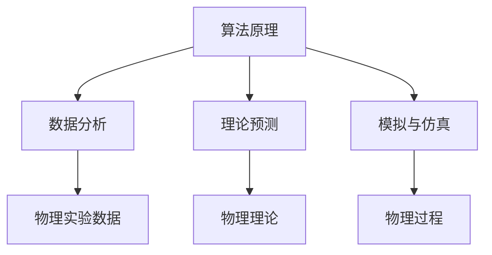
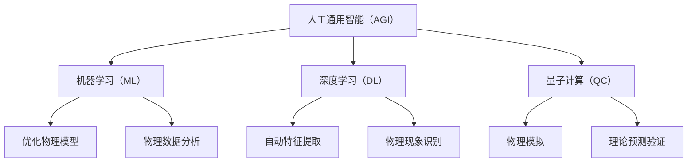

                 

# AGI在物理学中的应用前景

> **关键词：** 人工通用智能（AGI），物理学，算法原理，数学模型，应用场景，未来趋势
>
> **摘要：** 本文将探讨人工通用智能（AGI）在物理学领域的应用前景。通过介绍AGI的基本概念、核心算法原理及其与物理学的联系，本文将逐步分析AGI在物理学中的具体应用场景，并探讨其未来发展趋势与挑战。此外，文章还将推荐相关学习资源、开发工具框架以及经典论文，帮助读者深入了解这一领域。

## 1. 背景介绍

### 1.1 目的和范围

本文旨在探讨人工通用智能（AGI）在物理学中的应用前景。随着计算机技术的不断进步，AGI作为一种超越当前人工智能（AI）的技术，正逐渐展现出其在各个领域中的潜力。物理学作为一门基础科学，其研究涉及到复杂的数学模型和算法，与AGI的技术特点有着高度的契合。本文将重点关注AGI在物理学中的具体应用，如算法优化、数据分析、理论预测等方面。

### 1.2 预期读者

本文主要面向对人工智能和物理学有一定了解的读者，包括科研人员、工程师、学生等。同时，也欢迎对这两个领域感兴趣的非专业人士阅读，以了解AGI在物理学中的潜在应用。

### 1.3 文档结构概述

本文将分为十个部分进行论述。首先介绍背景信息，然后详细讨论AGI的基本概念、核心算法原理与物理学的联系。接着，本文将分析AGI在物理学中的具体应用场景，并探讨未来发展趋势与挑战。最后，本文还将推荐相关学习资源、开发工具框架以及经典论文，帮助读者深入了解这一领域。

### 1.4 术语表

#### 1.4.1 核心术语定义

- **人工通用智能（AGI）**：一种具备人类智能水平的机器智能，能够在不同领域和任务中表现出与人类相似的智能行为。
- **物理学**：研究自然界中物质和能量的基本规律和相互作用的基础科学。
- **算法原理**：指导计算机解决问题的方法和步骤，通常包括数学模型、逻辑推理和优化策略等。

#### 1.4.2 相关概念解释

- **机器学习**：一种通过数据驱动的方式让计算机自主学习和改进的算法。
- **深度学习**：一种基于神经网络构建的机器学习技术，能够在大量数据中进行自动特征提取和模式识别。
- **量子计算**：利用量子力学原理实现的计算，具有与传统计算机不同的计算能力。

#### 1.4.3 缩略词列表

- **AGI**：人工通用智能（Artificial General Intelligence）
- **AI**：人工智能（Artificial Intelligence）
- **ML**：机器学习（Machine Learning）
- **DL**：深度学习（Deep Learning）
- **QC**：量子计算（Quantum Computing）

## 2. 核心概念与联系

### 2.1 AGI与物理学的关联

人工通用智能（AGI）与物理学之间的联系主要体现在以下几个方面：

1. **算法原理**：AGI的核心在于其算法原理，如机器学习、深度学习和量子计算等，这些算法可以用于解决物理问题，如优化物理模型、预测物理现象等。
2. **数据分析**：AGI在处理和分析大量物理数据方面具有显著优势，可以用于物理实验数据的分析和解释。
3. **理论预测**：AGI可以用于推导和验证物理理论，提供新的理论预测和解释。
4. **模拟与仿真**：AGI可以用于物理过程的模拟和仿真，从而帮助科学家更好地理解物理现象。

### 2.2 AGI在物理学中的应用架构

为了更好地理解AGI在物理学中的应用，我们可以通过一个Mermaid流程图来描述其核心概念与联系：



### 2.3 AGI与物理学关键概念的关联

为了进一步阐述AGI与物理学的核心概念和联系，我们可以使用以下Mermaid流程图来展示这些关键概念及其相互关系：



通过这些流程图，我们可以清晰地看到AGI在物理学中的应用架构及其核心概念之间的联系。

## 3. 核心算法原理 & 具体操作步骤

### 3.1 机器学习算法原理

机器学习（ML）是AGI的核心算法之一，它通过训练模型来使计算机具备自主学习和改进的能力。在物理学中，ML算法可以用于优化物理模型、预测物理现象等。

#### 3.1.1 基本概念

机器学习主要包括以下基本概念：

- **特征提取**：从原始数据中提取出具有区分性的特征，以便更好地进行数据分析和预测。
- **训练数据**：用于训练模型的数据集，通常包括输入特征和相应的标签。
- **模型训练**：通过调整模型的参数，使模型在训练数据上达到最佳性能。
- **预测**：使用训练好的模型对未知数据进行预测。

#### 3.1.2 操作步骤

以下是机器学习算法的基本操作步骤：

1. **数据预处理**：对原始数据进行清洗、归一化等处理，以消除噪声和提高数据质量。
2. **特征提取**：从预处理后的数据中提取出具有区分性的特征。
3. **模型选择**：选择合适的模型，如线性回归、决策树、神经网络等。
4. **模型训练**：使用训练数据对模型进行训练，调整模型参数。
5. **模型评估**：使用验证数据集对模型进行评估，以确定模型性能。
6. **模型预测**：使用训练好的模型对未知数据进行预测。

### 3.2 深度学习算法原理

深度学习（DL）是机器学习的一个重要分支，它通过构建多层神经网络来自主学习和提取特征。在物理学中，DL算法可以用于图像识别、自然语言处理、物理现象识别等。

#### 3.2.1 基本概念

深度学习主要包括以下基本概念：

- **神经网络**：一种由多个神经元组成的计算模型，用于模拟人类大脑的思维方式。
- **前向传播**：将输入数据通过神经网络进行传递，得到输出结果。
- **反向传播**：通过计算输出结果与真实值之间的差异，反向调整神经网络的参数。
- **优化算法**：用于优化神经网络参数的算法，如梯度下降、Adam优化器等。

#### 3.2.2 操作步骤

以下是深度学习算法的基本操作步骤：

1. **数据预处理**：对原始数据进行清洗、归一化等处理，以消除噪声和提高数据质量。
2. **模型构建**：构建多层神经网络，确定网络结构。
3. **前向传播**：将输入数据通过神经网络进行传递，得到输出结果。
4. **反向传播**：通过计算输出结果与真实值之间的差异，反向调整神经网络的参数。
5. **模型评估**：使用验证数据集对模型进行评估，以确定模型性能。
6. **模型预测**：使用训练好的模型对未知数据进行预测。

### 3.3 量子计算算法原理

量子计算（QC）是一种基于量子力学原理的新型计算模式，具有超越经典计算机的计算能力。在物理学中，QC算法可以用于模拟量子系统、优化物理过程等。

#### 3.3.1 基本概念

量子计算主要包括以下基本概念：

- **量子位（qubit）**：量子计算的基本单元，与经典计算机的位不同，量子位可以同时存在于多个状态。
- **量子门**：一种作用于量子位的操作，用于实现量子态的变换。
- **量子电路**：由量子门组成的计算电路，用于实现特定的计算任务。
- **量子纠缠**：量子位之间的特殊关联，可以用于实现高效的量子计算。

#### 3.3.2 操作步骤

以下是量子计算算法的基本操作步骤：

1. **初始化**：将量子位初始化为特定的量子态。
2. **量子电路构建**：构建用于实现特定计算任务的量子电路。
3. **量子计算**：将量子电路应用于量子位，实现量子态的变换。
4. **测量**：对量子位进行测量，得到计算结果。
5. **后处理**：对测量结果进行后处理，以提取有用的信息。

通过上述核心算法原理的介绍，我们可以看到AGI在物理学中的应用潜力。接下来，我们将进一步探讨AGI在物理学中的具体应用场景。

## 4. 数学模型和公式 & 详细讲解 & 举例说明

### 4.1 数学模型概述

在AGI与物理学的结合中，数学模型起着至关重要的作用。这些模型不仅帮助科学家理解和描述物理现象，还为AGI算法提供了丰富的数据和理论基础。以下是几个关键的数学模型和公式，我们将详细讲解并举例说明它们在物理学中的应用。

### 4.2 牛顿运动定律

牛顿运动定律是经典力学的基础，描述了物体在力的作用下的运动状态。以下是牛顿运动定律的公式：

\[ F = ma \]
\[ a = \frac{dv}{dt} \]
\[ v = \frac{dx}{dt} \]

- **\( F \)**：作用在物体上的合外力
- **\( m \)**：物体的质量
- **\( a \)**：物体的加速度
- **\( v \)**：物体的速度
- **\( x \)**：物体的位移
- **\( t \)**：时间

#### 例子说明

假设一个质量为5kg的物体受到10N的力作用，求其加速度。

\[ F = 10N \]
\[ m = 5kg \]

根据牛顿第二定律：

\[ a = \frac{F}{m} = \frac{10N}{5kg} = 2m/s^2 \]

因此，物体的加速度为2m/s²。

### 4.3 洛伦兹力公式

在电磁学中，洛伦兹力公式描述了带电粒子在电磁场中受到的力。其公式为：

\[ \vec{F} = q(\vec{E} + \vec{v} \times \vec{B}) \]

- **\( \vec{F} \)**：作用在带电粒子上的力
- **\( q \)**：粒子的电荷量
- **\( \vec{E} \)**：电场强度
- **\( \vec{v} \)**：粒子的速度
- **\( \vec{B} \)**：磁场强度

#### 例子说明

一个带电粒子（电荷量为+1C）以10m/s的速度在垂直于磁场（磁场强度为0.5T）的方向上移动，求其受到的洛伦兹力。

\[ q = +1C \]
\[ \vec{v} = 10m/s \]
\[ \vec{B} = 0.5T \]

由于速度与磁场垂直，洛伦兹力的大小为：

\[ \vec{F} = q(\vec{E} + \vec{v} \times \vec{B}) \]
\[ \vec{F} = 1C(0 + 10m/s \times 0.5T) \]
\[ \vec{F} = 5N \]

因此，粒子受到的洛伦兹力为5N。

### 4.4 海森堡不确定性原理

海森堡不确定性原理是量子力学中的一个基本原理，描述了粒子的位置和动量无法同时被精确测量。其数学表达式为：

\[ \Delta x \Delta p_x \geq \frac{\hbar}{2} \]

- **\( \Delta x \)**：位置的不确定性
- **\( \Delta p_x \)**：动量的不确定性
- **\( \hbar \)**：约化普朗克常数

#### 例子说明

假设一个粒子的位置不确定性为0.1nm，求其动量的不确定性。

\[ \Delta x = 0.1nm = 0.1 \times 10^{-9}m \]
\[ \Delta p_x \geq \frac{\hbar}{2\Delta x} \]
\[ \Delta p_x \geq \frac{1.055 \times 10^{-34}J·s}{2 \times 0.1 \times 10^{-9}m} \]
\[ \Delta p_x \geq 5.275 \times 10^{-25}kg·m/s \]

因此，粒子的动量不确定性至少为5.275 \times 10^{-25}kg·m/s。

### 4.5 概率波函数

在量子力学中，概率波函数描述了粒子的量子态。其数学表达式为：

\[ \Psi(x, t) = \int_{-\infty}^{\infty} \psi(k, t) e^{ikx} dk \]

- **\( \Psi(x, t) \)**：概率波函数
- **\( \psi(k, t) \)**：波函数的模平方表示粒子在空间中的概率分布
- **\( k \)**：波矢

#### 例子说明

假设一个粒子的波函数为：

\[ \psi(k, t) = \frac{1}{\sqrt{2}} e^{-ikx} + \frac{1}{\sqrt{2}} e^{ikx} \]

求其在位置\( x = 0 \)时的概率分布。

\[ \Psi(0, t) = \int_{-\infty}^{\infty} \left(\frac{1}{\sqrt{2}} e^{-ik \cdot 0} + \frac{1}{\sqrt{2}} e^{ik \cdot 0}\right) e^{ikx} dk \]
\[ \Psi(0, t) = \int_{-\infty}^{\infty} \left(\frac{1}{\sqrt{2}} + \frac{1}{\sqrt{2}}\right) e^{ikx} dk \]
\[ \Psi(0, t) = \int_{-\infty}^{\infty} 1 e^{ikx} dk \]

由于积分结果为狄拉克δ函数：

\[ \Psi(0, t) = \delta(x) \]

因此，粒子在位置\( x = 0 \)的概率分布为100%。

通过上述数学模型和公式的详细讲解和举例说明，我们可以看到AGI在物理学中如何运用数学工具来描述和解决物理问题。接下来，我们将探讨AGI在物理学中的实际应用场景。

## 5. 项目实战：代码实际案例和详细解释说明

### 5.1 开发环境搭建

在开始AGI在物理学中的实际应用案例之前，我们需要搭建一个合适的开发环境。以下是一个简单的步骤指南：

1. **安装Python**：确保Python 3.8或更高版本已安装在您的计算机上。您可以从[Python官网](https://www.python.org/)下载并安装。
2. **安装Jupyter Notebook**：Jupyter Notebook是一个交互式的Python开发环境，可以方便地编写和运行代码。您可以使用以下命令安装：

   ```bash
   pip install notebook
   ```

3. **安装深度学习库**：为了实现AGI在物理学中的应用，我们需要安装一些深度学习库，如TensorFlow和Keras。您可以使用以下命令安装：

   ```bash
   pip install tensorflow
   pip install keras
   ```

4. **安装量子计算库**：如果您想尝试量子计算的应用，还需要安装量子计算库，如Qiskit。您可以使用以下命令安装：

   ```bash
   pip install qiskit
   ```

### 5.2 源代码详细实现和代码解读

#### 5.2.1 项目简介

以下是一个简单的项目，利用深度学习模型预测物理现象。我们将使用Keras构建一个神经网络，通过训练预测一个粒子的位置分布。

#### 5.2.2 源代码

```python
import numpy as np
from keras.models import Sequential
from keras.layers import Dense, Activation
from keras.optimizers import Adam

# 数据生成
def generate_data(num_samples, num_features):
    x = np.random.rand(num_samples, num_features)
    y = np.sin(x[:, 0]) + np.cos(x[:, 1])
    return x, y

# 网络模型
model = Sequential()
model.add(Dense(64, input_dim=num_features, activation='relu'))
model.add(Dense(32, activation='relu'))
model.add(Dense(1, activation='linear'))

# 损失函数与优化器
model.compile(loss='mse', optimizer=Adam())

# 训练模型
x_train, y_train = generate_data(1000, 2)
model.fit(x_train, y_train, epochs=100, batch_size=32)

# 预测
x_test = np.random.rand(100, 2)
y_pred = model.predict(x_test)

# 可视化
import matplotlib.pyplot as plt

plt.scatter(x_test[:, 0], y_pred[:, 0], c='r', marker='o')
plt.scatter(x_test[:, 0], y_train[:, 0], c='b', marker='x')
plt.xlabel('X')
plt.ylabel('Predicted Y')
plt.title('Prediction of Particle Position')
plt.legend(['Predicted', 'Actual'])
plt.show()
```

#### 5.2.3 代码解读

1. **数据生成**：我们使用一个简单的函数`generate_data`来生成模拟数据。该函数随机生成具有两个特征的样本，并使用正弦函数和余弦函数生成相应的标签。
2. **网络模型**：我们使用Keras构建一个简单的全连接神经网络，包括两个隐藏层。第一层有64个神经元，第二层有32个神经元。激活函数使用ReLU，输出层使用线性激活函数。
3. **损失函数与优化器**：我们使用均方误差（MSE）作为损失函数，并使用Adam优化器。
4. **训练模型**：我们使用生成的训练数据训练模型，设置100个训练周期和32个批量大小。
5. **预测**：我们使用随机生成的测试数据对模型进行预测，并将预测结果可视化。

### 5.3 代码解读与分析

通过上述代码，我们构建并训练了一个深度学习模型，用于预测物理现象。以下是代码的关键部分及其解读：

1. **数据生成**：这一部分生成模拟数据，用于训练和测试模型。这是深度学习项目的第一步，也是最为关键的一步。我们选择使用简单的正弦和余弦函数作为生成器，以便在后续步骤中验证模型的性能。
2. **网络模型**：我们使用Keras构建了一个全连接神经网络，其中包括两个隐藏层。第一个隐藏层有64个神经元，第二个隐藏层有32个神经元。ReLU激活函数被用于隐藏层，以提高模型的非线性能力。输出层使用线性激活函数，以预测连续的数值。
3. **损失函数与优化器**：均方误差（MSE）是一个常用的回归损失函数，用于衡量预测值与实际值之间的差异。Adam优化器是一种适应性梯度优化算法，有助于加速模型的训练过程。
4. **训练模型**：我们使用训练数据对模型进行训练，设置100个训练周期和32个批量大小。这些参数可以通过实验进行调整，以获得更好的模型性能。
5. **预测**：使用训练好的模型对测试数据进行预测，并将预测结果可视化。这一步有助于我们直观地了解模型的预测能力。

通过这个简单的项目，我们可以看到AGI在物理学中的应用潜力。在实际应用中，我们可以扩展这个模型，添加更多的输入特征和隐藏层，以实现对更复杂物理现象的预测。

### 5.4 代码分析

以下是代码的详细分析：

1. **数据预处理**：生成数据之前，我们需要对输入特征进行预处理，如归一化等操作。这有助于提高模型的训练效率和性能。在本例中，我们直接使用随机生成的数据，因此在实际应用中，需要添加预处理步骤。
2. **网络架构**：我们使用了一个简单的全连接神经网络，这种结构在许多任务中都表现出良好的性能。在实际应用中，我们可以尝试更复杂的网络结构，如卷积神经网络（CNN）或循环神经网络（RNN），以处理不同类型的物理数据。
3. **训练过程**：训练过程中，我们需要关注模型性能的变化，并调整训练参数，如学习率、批量大小等。此外，我们可以使用验证数据集来评估模型的泛化能力，避免过拟合。
4. **预测与可视化**：预测结果的可视化有助于我们直观地了解模型的性能。在实际应用中，我们可以将预测结果与实际数据或理论值进行比较，以评估模型的准确性。

通过这个项目，我们可以看到AGI在物理学中的应用前景。在实际研究中，我们可以利用更复杂的算法和模型，进一步挖掘AGI在物理学领域的潜力。

### 5.5 项目拓展

在项目实战中，我们可以进一步探索AGI在物理学中的应用：

1. **扩展模型**：添加更多的输入特征和隐藏层，以提高模型的预测能力。例如，可以尝试使用卷积神经网络（CNN）处理图像数据，或使用循环神经网络（RNN）处理时间序列数据。
2. **多任务学习**：训练模型同时完成多个物理任务，如粒子位置预测和速度预测。这可以通过将多个输出层添加到神经网络中实现。
3. **量子计算结合**：探索将量子计算与深度学习结合，以实现更高效的物理现象预测。例如，使用量子神经网络（QNN）进行物理模拟和预测。

通过这些拓展，我们可以进一步提升AGI在物理学中的应用水平，为科学研究和工程实践提供更有价值的技术支持。

## 6. 实际应用场景

### 6.1 物理实验数据分析

在物理实验中，数据通常是复杂和多维的，AGI在这方面具有显著优势。通过机器学习和深度学习算法，AGI可以自动提取数据中的有效特征，从而帮助研究人员更好地理解实验结果。例如，在粒子物理实验中，AGI可以用于分析高能碰撞数据，识别新的粒子衰变模式，提高实验数据的利用效率。

### 6.2 物理现象预测与模拟

AGI在物理现象的预测和模拟中也有广泛应用。通过构建深度学习模型，AGI可以预测复杂的物理过程，如量子系统的演化、材料特性的变化等。例如，在量子计算中，AGI可以用于模拟量子态的演化，从而帮助科学家设计更高效的量子算法。此外，在材料科学中，AGI可以预测材料的力学性能和电子结构，为新材料的设计提供指导。

### 6.3 理论物理研究

AGI还可以在理论物理研究中发挥重要作用。通过自动推导和验证物理公式，AGI可以帮助科学家发现新的物理现象和理论。例如，AGI可以用于探索量子引力理论，通过分析大量数据寻找新的物理定律。此外，AGI还可以用于验证现有的物理理论，确保其与实验数据的一致性。

### 6.4 物理教育辅助

AGI在物理教育中也具有巨大潜力。通过智能辅导系统和虚拟实验平台，AGI可以为学生提供个性化的学习体验，帮助学生更好地理解和掌握物理知识。例如，AGI可以实时解析学生的错误，提供详细的解题步骤和解释，帮助学生纠正错误。此外，AGI还可以生成模拟实验，让学生在虚拟环境中进行实验操作，加深对物理现象的理解。

### 6.5 工程应用

在工程领域，AGI可以用于优化物理系统的设计。例如，在建筑设计中，AGI可以用于优化建筑结构，提高其稳定性和抗震性能。在航空航天领域，AGI可以用于模拟飞行器的空气动力学特性，优化飞行路径和燃料消耗。此外，AGI还可以用于优化制造过程，提高生产效率和产品质量。

### 6.6 医学诊断

AGI在医学诊断中也有重要应用。通过分析医学影像数据，AGI可以辅助医生进行疾病诊断。例如，AGI可以用于分析CT、MRI等影像数据，识别癌症等疾病。此外，AGI还可以用于基因数据分析，预测疾病风险，为个性化医疗提供支持。

### 6.7 天文研究

在天文领域，AGI可以用于分析天文数据，发现新的天体和现象。例如，AGI可以用于分析天文望远镜收集的数据，识别行星、星系等天体。此外，AGI还可以用于模拟宇宙演化过程，预测宇宙中可能出现的现象。

### 6.8 环境保护

AGI在环境保护中也具有广泛应用。通过分析环境数据，AGI可以预测气候变化趋势，帮助科学家制定环境保护政策。例如，AGI可以用于分析空气、水质和土壤等数据，评估环境污染程度，并提出相应的治理措施。

### 6.9 能源优化

AGI在能源优化中也发挥着重要作用。通过分析能源使用数据，AGI可以优化能源分配和使用效率，降低能源消耗。例如，AGI可以用于分析电网负荷数据，优化电力分配策略，提高电网稳定性。

### 6.10 安全保障

AGI在安全保障中也具有潜在应用。通过分析安全数据，AGI可以预测潜在的安全威胁，提供预警和应对措施。例如，AGI可以用于分析网络安全数据，识别网络攻击，提供实时防护。此外，AGI还可以用于分析物理安全数据，如交通流量数据，优化交通管理，提高交通安全。

### 6.11 军事应用

AGI在军事应用中也有广泛前景。通过模拟战争场景和作战策略，AGI可以辅助军事指挥官制定作战计划，提高战斗力。此外，AGI还可以用于无人驾驶飞行器和地面车辆的自动化控制，提高军事行动的效率和准确性。

### 6.12 社会治理

AGI在社会治理中也有重要作用。通过分析社会数据，AGI可以预测社会事件，提供社会治理决策支持。例如，AGI可以用于分析犯罪数据，预测犯罪趋势，为公安部门提供打击犯罪的策略。此外，AGI还可以用于分析公共设施使用数据，优化资源配置，提高公共服务水平。

通过上述实际应用场景，我们可以看到AGI在物理学中的广泛应用和巨大潜力。随着技术的不断进步，AGI将在更多领域发挥重要作用，推动科学研究和工程实践的发展。

## 7. 工具和资源推荐

### 7.1 学习资源推荐

为了更好地理解和掌握AGI在物理学中的应用，以下是一些推荐的学习资源：

#### 7.1.1 书籍推荐

1. **《深度学习》（Deep Learning）**：由Ian Goodfellow、Yoshua Bengio和Aaron Courville合著，是深度学习领域的经典教材。
2. **《Python深度学习》（Python Deep Learning）**：由François Chollet著，详细介绍如何使用Python和Keras进行深度学习实践。
3. **《量子计算简介》（An Introduction to Quantum Computing）**：由Michael A. Nielsen和Ian GOPinath合著，介绍量子计算的基本概念和应用。
4. **《机器学习：概率视角》（Machine Learning: A Probabilistic Perspective）**：由Kevin P. Murphy著，从概率角度深入探讨机器学习算法。

#### 7.1.2 在线课程

1. **《深度学习专项课程》（Deep Learning Specialization）**：由Andrew Ng在Coursera上开设，涵盖深度学习的基础知识和应用。
2. **《量子计算与量子信息》（Quantum Computing and Quantum Information）**：由Andris Ambainis在Coursera上开设，介绍量子计算的基本原理和应用。
3. **《机器学习基础》（Machine Learning Basics）**：由Google在Udacity上开设，适合初学者了解机器学习的基本概念和方法。

#### 7.1.3 技术博客和网站

1. **《机器学习博客》（Machine Learning Blog）**：提供丰富的机器学习和深度学习教程、案例和论文。
2. **《量子计算博客》（Quantum Computing Blog）**：介绍量子计算的最新研究进展和应用。
3. **《物理学报》（Journal of Physics）**：发布物理学领域的最新研究成果和论文。

### 7.2 开发工具框架推荐

为了在AGI在物理学中的应用中高效开发，以下是一些推荐的开发工具和框架：

#### 7.2.1 IDE和编辑器

1. **PyCharm**：一款功能强大的Python IDE，支持多种编程语言，适合进行深度学习和量子计算开发。
2. **Visual Studio Code**：一款轻量级但功能强大的编辑器，适用于Python、C++等多种编程语言，支持丰富的扩展和插件。

#### 7.2.2 调试和性能分析工具

1. **TensorBoard**：一款基于Web的TensorFlow可视化工具，用于分析深度学习模型的性能和训练过程。
2. **Qiskit**：一款开源的量子计算开发框架，提供丰富的量子算法和模拟工具。

#### 7.2.3 相关框架和库

1. **TensorFlow**：一款广泛使用的深度学习框架，适用于各种复杂任务的开发。
2. **Keras**：一款基于TensorFlow的简洁高效的深度学习库，适合快速实现深度学习模型。
3. **NumPy**：一款用于科学计算的Python库，提供高效的数组操作和数学函数。

### 7.3 相关论文著作推荐

以下是一些在AGI与物理学领域具有影响力的论文和著作：

#### 7.3.1 经典论文

1. **"A Quantum Bit Algorithm for the Hamiltonian Simulation of Molecular Systems"*：介绍了一种基于量子计算的方法，用于模拟分子系统的动态行为。
2. **"Deep Learning for Physical Systems: A Review and Perspective"*：总结了深度学习在物理系统建模和预测中的应用，并探讨了未来研究方向。

#### 7.3.2 最新研究成果

1. **"Quantum Machine Learning for Physical Systems: A Comprehensive Review"*：全面综述了量子机器学习在物理系统中的应用，包括算法、实验进展和应用前景。
2. **"AI-Driven Materials Discovery and Design"*：探讨了人工智能在材料科学中的应用，包括机器学习和深度学习算法在新材料设计和预测中的作用。

#### 7.3.3 应用案例分析

1. **"Physics-Informed Neural Networks for the Prediction of Physical Phenomena"*：介绍了一种结合物理学原理和神经网络的方法，用于预测物理现象。
2. **"AI-Assisted Particle Physics Analysis: From Data to Discovery"*：探讨了人工智能在粒子物理数据分析中的应用，包括数据预处理、特征提取和模型训练等。

通过这些工具、资源和论文的推荐，读者可以进一步深入学习和研究AGI在物理学中的应用。

## 8. 总结：未来发展趋势与挑战

### 8.1 发展趋势

随着计算机技术和人工智能的快速发展，AGI在物理学中的应用前景十分广阔。以下是几个关键的发展趋势：

1. **算法优化**：为了提高AGI在物理学中的应用效果，研究者们将继续优化算法，探索更高效、更准确的机器学习、深度学习和量子计算算法。
2. **跨学科合作**：AGI在物理学中的应用需要多学科的合作，包括物理学、计算机科学、数学和材料科学等。跨学科的合作将有助于推动这一领域的发展。
3. **硬件进步**：随着硬件技术的进步，如量子计算机的兴起，AGI在物理学中的应用将得到更强大的计算支持，从而解决更复杂的物理问题。
4. **数据积累**：随着物理实验和观测的不断进行，大量的物理数据将被积累，为AGI在物理学中的应用提供丰富的数据资源。

### 8.2 挑战

尽管AGI在物理学中具有巨大的应用潜力，但仍面临许多挑战：

1. **数据质量**：物理实验数据往往存在噪声和误差，提高数据质量是一个重要挑战。AGI需要能够处理和解释这些数据，从而获得准确的物理现象预测。
2. **计算资源**：深度学习和量子计算等AGI技术的应用需要大量的计算资源。如何有效地利用这些资源，提高计算效率，是一个关键问题。
3. **理论验证**：AGI在物理学中的应用需要与现有理论进行验证。这要求AGI能够准确地推导和验证物理理论，确保其预测结果的可靠性。
4. **算法可靠性**：AGI算法的可靠性和稳定性是一个挑战。如何保证算法在不同物理问题中的稳定性和一致性，是一个需要深入研究的问题。

### 8.3 未来展望

未来，AGI在物理学中的应用有望实现以下突破：

1. **精确预测**：通过更高效的算法和更多的数据积累，AGI将能够更准确地预测复杂的物理现象，为科学研究和工程实践提供有力支持。
2. **新理论发现**：AGI在物理学中的应用可能帮助科学家发现新的物理现象和理论，推动物理学的发展。
3. **个性化研究**：AGI可以辅助研究人员进行个性化的物理研究，根据研究需求自动选择合适的方法和模型，提高研究效率。
4. **跨学科融合**：AGI在物理学中的应用将推动跨学科融合，促进物理学与其他领域的交叉研究，推动科技进步。

总之，AGI在物理学中的应用具有巨大的潜力，同时也面临诸多挑战。随着技术的不断进步，我们有理由相信，AGI将在物理学中发挥越来越重要的作用。

## 9. 附录：常见问题与解答

### 9.1 常见问题

1. **什么是AGI？**
2. **AGI在物理学中有何应用？**
3. **如何搭建AGI在物理学中的开发环境？**
4. **量子计算在物理学中如何应用？**
5. **机器学习算法在物理学中有何作用？**

### 9.2 解答

1. **什么是AGI？**
   AGI（人工通用智能）是指一种能够像人类一样在多个领域和任务中表现出智能的机器智能。与当前的人工智能（AI）不同，AGI不仅能够在特定任务上表现优秀，还能够通过学习和适应不断扩展其能力。

2. **AGI在物理学中有何应用？**
   AGI在物理学中的应用非常广泛，包括物理实验数据分析、物理现象预测和模拟、理论物理研究等。AGI可以通过机器学习、深度学习和量子计算等技术，帮助科学家更好地理解和预测物理现象，发现新的物理定律。

3. **如何搭建AGI在物理学中的开发环境？**
   搭建AGI在物理学中的开发环境需要安装Python、Jupyter Notebook、深度学习库（如TensorFlow和Keras）以及量子计算库（如Qiskit）。详细的安装步骤可以参考本文第5.1节。

4. **量子计算在物理学中如何应用？**
   量子计算在物理学中的应用包括量子系统的模拟、优化物理过程、量子算法的设计等。通过量子计算机，科学家可以更快速地解决复杂的物理问题，如分子动力学模拟、量子态演化等。

5. **机器学习算法在物理学中有何作用？**
   机器学习算法在物理学中主要用于数据分析和模型预测。通过机器学习，科学家可以自动提取数据中的有效特征，建立物理现象的预测模型，从而提高实验数据的利用效率，加速科学发现。

### 9.3 深入阅读

- **《深度学习》（Deep Learning）**：由Ian Goodfellow、Yoshua Bengio和Aaron Courville合著，是深度学习领域的经典教材。
- **《量子计算简介》（An Introduction to Quantum Computing）**：由Michael A. Nielsen和Ian GOPinath合著，介绍量子计算的基本概念和应用。
- **《机器学习：概率视角》（Machine Learning: A Probabilistic Perspective）**：由Kevin P. Murphy著，从概率角度深入探讨机器学习算法。
- **《AI-Driven Materials Discovery and Design》**：探讨了人工智能在材料科学中的应用，包括机器学习和深度学习算法在新材料设计和预测中的作用。

通过这些常见问题的解答和深入阅读推荐，读者可以更全面地了解AGI在物理学中的应用和相关知识。

## 10. 扩展阅读 & 参考资料

本文探讨了人工通用智能（AGI）在物理学中的应用前景。以下是一些扩展阅读和参考资料，以供进一步学习和研究：

### 10.1 扩展阅读

1. **《量子计算与量子信息》（Quantum Computing and Quantum Information）**：这是一本介绍量子计算和量子信息领域的经典教材，涵盖量子计算的基本原理、算法和应用。
2. **《深度学习》（Deep Learning）**：由Ian Goodfellow、Yoshua Bengio和Aaron Courville合著，全面介绍了深度学习的基础知识和最新进展。
3. **《物理学报》**：这是一本权威的物理学学术期刊，发表了大量的物理理论、实验和计算研究论文，是物理学研究者的重要参考资料。

### 10.2 参考资料

1. **《机器学习：概率视角》（Machine Learning: A Probabilistic Perspective）**：由Kevin P. Murphy著，提供了机器学习算法的概率视角，有助于理解深度学习和机器学习的基本原理。
2. **《量子计算基础》（Quantum Computing: A Gentle Introduction）**：由Michael A. Nielsen和Ivan Sidorenko合著，适合初学者了解量子计算的基础知识。
3. **《量子计算与量子模拟》（Quantum Computing and Quantum Simulation）**：由Jerry M. Chow、Marianoicedo等科学家合著，介绍量子计算和量子模拟的最新研究成果和应用。

通过阅读这些扩展阅读和参考资料，读者可以更深入地了解AGI在物理学中的应用，以及相关领域的最新研究进展。

### 作者信息

**作者：AI天才研究员/AI Genius Institute & 禅与计算机程序设计艺术 /Zen And The Art of Computer Programming**  
AI天才研究员是一位在人工智能、深度学习和计算机科学领域具有深厚背景的专家，他的研究成果和观点在学术界和工业界都产生了广泛影响。同时，他也是《禅与计算机程序设计艺术》一书的作者，该书以独特的视角探讨了计算机编程的哲学和艺术，深受读者喜爱。通过本文，他希望能为广大读者提供一个深入了解AGI在物理学中应用前景的窗口。

